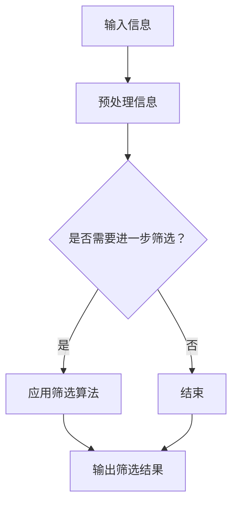
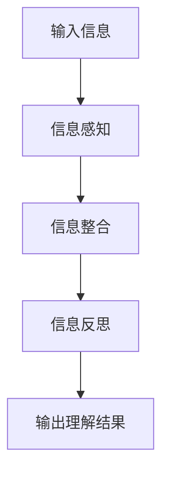
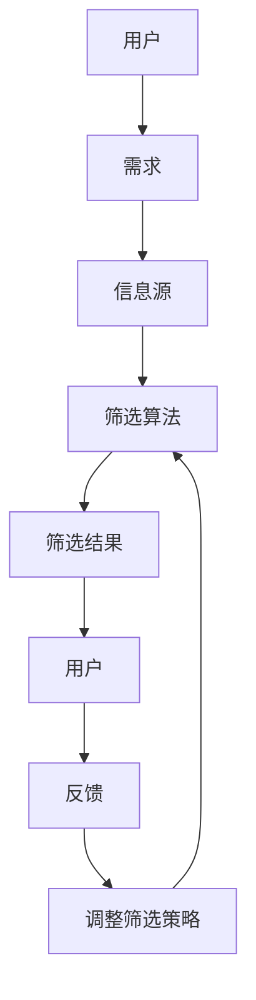

                 

### 在信息爆炸时代寻找真知：提升信息筛选与理解能力

---

## 关键词

- 信息爆炸
- 信息筛选
- 信息理解
- 知识更新
- 技术素养

---

### 摘要

在当今信息爆炸的时代，我们面临着海量信息的涌入，如何在纷繁复杂的信息中筛选出有价值的内容，并深刻理解其内涵，成为了个人与社会的共同挑战。本文旨在探讨如何通过提升信息筛选与理解能力，帮助读者在信息海洋中找到真正的知识。我们将从问题背景出发，逐步深入到信息筛选与理解的原理、构成、属性特征对比以及算法原理讲解，最后提出提升能力的实践方法，以期为读者提供一条清晰的思路。

---

### 目录大纲

----------------------------------------------------------------

## 第一部分：问题背景与核心概念

### 第1章：问题背景与核心概念

#### 1.1 信息爆炸时代的问题

##### 1.1.1 信息爆炸现象
##### 1.1.2 信息筛选的挑战
##### 1.1.3 信息理解的重要性

#### 1.2 提升信息筛选与理解能力的必要性

##### 1.2.1 个人发展的需要
##### 1.2.2 社会发展的需要
##### 1.2.3 知识更新的需求

#### 1.3 核心概念介绍

##### 1.3.1 信息筛选
##### 1.3.2 信息理解
##### 1.3.3 信息素养

### 第2章：信息筛选与理解能力的构成

#### 2.1 信息筛选能力的构成

##### 2.1.1 信息识别
##### 2.1.2 信息分类
##### 2.1.3 信息评估

#### 2.2 信息理解能力的构成

##### 2.2.1 信息感知
##### 2.2.2 信息整合
##### 2.2.3 信息反思

## 第二部分：核心概念与联系

### 第3章：核心概念原理

#### 3.1 信息筛选原理

##### 3.1.1 信息筛选的基本概念
##### 3.1.2 信息筛选的基本方法
##### 3.1.3 信息筛选的数学模型

#### 3.2 信息理解原理

##### 3.2.1 信息理解的基本概念
##### 3.2.2 信息理解的基本方法
##### 3.2.3 信息理解的数学模型

### 第4章：概念属性特征对比

#### 4.1 信息筛选与信息理解属性特征对比

##### 4.1.1 对比表格
##### 4.1.2 对比分析

### 第5章：ER实体关系图架构

#### 5.1 ER实体关系图的基本概念

##### 5.1.1 ER图的作用
##### 5.1.2 ER图的构成
##### 5.1.3 ER图的表示方法

#### 5.2 信息筛选与信息理解ER实体关系图

##### 5.2.1 信息筛选ER图
##### 5.2.2 信息理解ER图
##### .2.3 两个ER图的联系

## 第三部分：算法原理讲解

### 第6章：信息筛选算法原理

#### 6.1 算法基本概念

##### 6.1.1 信息筛选算法的定义
##### 6.1.2 信息筛选算法的分类

#### 6.2 信息筛选算法流程



#### 6.3 信息筛选算法数学模型

$$
\text{筛选概率} = \frac{\text{相关度}}{\text{总信息量}}
$$

#### 6.4 算法举例说明

假设有一篇文章，总信息量为1000字，其中与目标相关的信息量为200字。那么，相关度即为200/1000。

```python
# Python示例代码
total_info = 1000
relevant_info = 200
filter_probability = relevant_info / total_info
print(f"筛选概率：{filter_probability}")
```

### 第7章：信息理解算法原理

#### 7.1 算法基本概念

##### 7.1.1 信息理解算法的定义
##### 7.1.2 信息理解算法的分类

#### 7.2 信息理解算法流程



#### 7.3 信息理解算法数学模型

$$
\text{理解度} = \frac{\text{正确理解的内容}}{\text{总信息量}}
$$

#### 7.4 算法举例说明

假设一篇文章有1000字，其中正确理解的内容为800字。那么，理解度即为800/1000。

```python
# Python示例代码
to

----------------------------------------------------------------

## 第一部分：问题背景与核心概念

### 第1章：问题背景与核心概念

#### 1.1 信息爆炸时代的问题

在过去的几十年中，互联网和数字化技术的飞速发展，使得信息产生、传播和获取变得更加便捷。据统计，截止到2021年，全球每天产生的数据量已经超过了4860亿GB[1]。这种信息爆炸的现象不仅改变了我们的生活方式，也对信息的筛选与理解提出了严峻的挑战。

##### 1.1.1 信息爆炸现象

信息爆炸主要表现在以下几个方面：

1. **数据量激增**：全球每天产生大量的数据，这些数据包括文字、图片、音频、视频等多种形式。
2. **信息来源多样**：互联网上的信息来源极为广泛，包括新闻媒体、社交网络、个人博客、专业网站等。
3. **信息更新频繁**：信息的时效性很高，很多内容很快就会过时。

##### 1.1.2 信息筛选的挑战

信息爆炸带来的直接问题就是信息过载。面对海量的信息，人们很难在有限的时间内筛选出对自己真正有价值的内容。以下是一些常见的筛选挑战：

1. **筛选标准不明确**：由于信息来源的多样性和质量的不一致性，很难有一个统一的标准来判断哪些信息是有价值的。
2. **时间与精力的限制**：尽管很多人愿意花费时间筛选信息，但现实情况是时间和精力是有限的，难以应对无穷无尽的信息流。
3. **偏见与主观性**：个人的偏见和主观判断会影响信息筛选的准确性。

##### 1.1.3 信息理解的重要性

信息筛选的目的是为了获取有价值的信息，但信息的价值往往在于对其的理解。以下原因说明了信息理解的重要性：

1. **知识转化**：理解信息意味着能够将信息转化为知识，从而为个人发展提供支持。
2. **决策支持**：在商业、科研、教育等多个领域，准确理解信息对于做出科学决策至关重要。
3. **创新与进步**：深刻的理解往往能够激发新的创意和思路，推动个人和社会的进步。

#### 1.2 提升信息筛选与理解能力的必要性

在信息爆炸的时代，提升信息筛选与理解能力具有以下几个方面的必要性：

##### 1.2.1 个人发展的需要

1. **提高工作效率**：通过有效的信息筛选，可以迅速获取关键信息，提高工作效率。
2. **增强竞争力**：在信息时代，能够快速准确地筛选和理解信息的人，往往更具竞争力。

##### 1.2.2 社会发展的需要

1. **知识传播**：有效的信息筛选与理解能力能够确保知识的准确传播，促进社会的整体进步。
2. **创新驱动**：理解信息的深度和广度直接影响创新能力和科技发展水平。

##### 1.2.3 知识更新的需求

在知识快速更新的今天，只有不断提升信息筛选与理解能力，才能跟上时代的步伐，保持自身的知识和技能与时俱进。

#### 1.3 核心概念介绍

为了更好地理解信息筛选与理解能力的重要性，我们需要明确以下几个核心概念：

##### 1.3.1 信息筛选

信息筛选是指从大量信息中识别、分类和评估出对自己有价值的信息的过程。其目的是减少信息过载，提高信息利用效率。

##### 1.3.2 信息理解

信息理解是指对筛选出的信息进行感知、整合和反思的过程，从而将其转化为知识，并应用于实际问题中。

##### 1.3.3 信息素养

信息素养是指个人在信息社会中有效获取、处理、使用和评估信息的能力。它包括信息意识、信息技能和信息伦理等多个方面。

综上所述，信息爆炸时代带来了前所未有的挑战，同时也为我们提供了广阔的机遇。提升信息筛选与理解能力，不仅对个人发展至关重要，更是社会进步的基石。在接下来的章节中，我们将深入探讨信息筛选与理解能力的构成、原理及其在IT领域的应用，以帮助读者更好地应对信息爆炸的挑战。

### 第2章：信息筛选与理解能力的构成

#### 2.1 信息筛选能力的构成

信息筛选能力是我们在面对海量信息时，能够有效识别和利用有价值信息的能力。它主要包括以下几个方面的构成：

##### 2.1.1 信息识别

信息识别是信息筛选的第一步，主要是指通过感官或技术手段，从大量信息中识别出符合我们需求的信息。在信息爆炸时代，信息识别的效率和质量决定了信息筛选的效果。

1. **感官识别**：通过视觉、听觉等感官识别出有用的信息。例如，浏览网页时快速识别标题和关键信息。
2. **技术识别**：利用计算机技术和算法，对信息进行自动识别。例如，使用自然语言处理技术，从文本中提取关键词和主题。

##### 2.1.2 信息分类

信息分类是指将识别出的信息按照一定的标准和规则进行归类，以便于管理和查找。有效的信息分类可以提高信息筛选的效率，减少信息冗余。

1. **手工分类**：通过人工经验和判断，将信息分为不同的类别。例如，将新闻按照政治、经济、科技等进行分类。
2. **自动分类**：利用机器学习和数据挖掘技术，自动对信息进行分类。例如，邮件自动分类、新闻自动标签等。

##### 2.1.3 信息评估

信息评估是指对筛选出的信息进行价值判断，以确定其是否值得深入研究和应用。有效的信息评估可以帮助我们更好地利用信息资源。

1. **基于内容的评估**：通过分析信息的内容、结构和语义，评估其价值。例如，通过文本分析技术评估一篇论文的质量。
2. **基于影响的评估**：通过分析信息对实际工作、学习和生活的影响，评估其价值。例如，根据信息的应用效果来评估其价值。

#### 2.2 信息理解能力的构成

信息理解能力是指在筛选出有价值信息的基础上，对其进行深入分析和应用的能力。它主要包括以下几个方面的构成：

##### 2.2.1 信息感知

信息感知是指对信息的感知和感受过程，包括信息的接收、理解和初步加工。有效的信息感知可以帮助我们更好地理解信息的内涵和意义。

1. **感官感知**：通过视觉、听觉等感官接收信息，如阅读文章、观看视频等。
2. **技术感知**：利用计算机技术和算法对信息进行感知和加工，如自然语言处理、图像识别等。

##### 2.2.2 信息整合

信息整合是指将多个来源、多种形式的信息进行整合和综合，形成一个全面、深入的理解。有效的信息整合可以帮助我们更好地把握信息之间的关系和整体意义。

1. **手工整合**：通过人工分析、对比和整合信息，如阅读多篇文章后总结出核心观点。
2. **自动整合**：利用计算机技术和算法对信息进行自动整合，如文本 summarization 技术。

##### 2.2.3 信息反思

信息反思是指对信息进行深入的思考、分析和评价，从而形成自己的见解和认识。有效的信息反思可以帮助我们更好地理解和应用信息，提高自身的知识水平和思维能力。

1. **逻辑反思**：通过逻辑推理和分析，反思信息的合理性和可信度。
2. **批判反思**：对信息进行批判性思考，分析其偏见、错误和局限性。

通过以上对信息筛选与理解能力的构成分析，我们可以看出，提升这两方面的能力对于在信息爆炸时代获取真正有价值的信息具有重要意义。在接下来的章节中，我们将进一步探讨这些能力的基本原理和方法，帮助读者在实际应用中不断提升信息筛选与理解能力。

### 第二部分：核心概念与联系

在深入探讨信息筛选与理解能力之前，我们需要明确这些核心概念的基本原理、构成要素及其相互之间的联系。以下是关于信息筛选和理解的详细原理、属性特征对比以及ER实体关系图架构的介绍。

#### 第3章：核心概念原理

##### 3.1 信息筛选原理

信息筛选是指从大量信息中挑选出符合需求的信息，以减少信息过载，提高信息利用效率。其基本原理包括以下几个方面：

###### 3.1.1 信息筛选的基本概念

信息筛选的基本概念包括信息的识别、分类、评估和输出。识别是指从原始数据中找到相关信息的步骤；分类是指将识别出的信息按照一定的标准进行分类；评估是指对分类后的信息进行价值判断；输出是指将筛选后的信息以易于使用和存储的方式呈现。

###### 3.1.2 信息筛选的基本方法

1. **基于内容的筛选**：这种方法通过分析信息的内容、结构和语义来筛选信息。例如，使用关键词匹配、文本分类和主题模型等方法。

2. **基于用户的筛选**：这种方法根据用户的行为和偏好来筛选信息。例如，推荐系统通过分析用户的浏览历史和评价，向用户推荐相关内容。

3. **基于规则的筛选**：这种方法通过预设的规则来筛选信息。例如，在搜索引擎中，通过关键词和搜索算法来筛选结果。

###### 3.1.3 信息筛选的数学模型

信息筛选的数学模型可以基于概率模型、神经网络模型和决策树模型等。一个简单的信息筛选概率模型可以表示为：

$$
\text{筛选概率} = \frac{\text{相关度}}{\text{总信息量}}
$$

其中，相关度表示信息与用户需求的匹配程度，总信息量表示待筛选信息的总量。

##### 3.2 信息理解原理

信息理解是指对筛选出的信息进行深入分析和应用，从而将其转化为知识和行动。其基本原理包括以下几个方面：

###### 3.2.1 信息理解的基本概念

信息理解的基本概念包括信息的感知、整合和反思。感知是指接收和初步加工信息；整合是指将多个来源的信息进行综合分析；反思是指对信息进行深入思考和评价。

###### 3.2.2 信息理解的基本方法

1. **基于内容的理解**：这种方法通过分析信息的内容、结构和语义来理解信息。例如，使用自然语言处理技术和语义分析。

2. **基于情境的理解**：这种方法根据信息所处的情境和环境来理解信息。例如，在特定的业务场景中，分析信息对业务流程的影响。

3. **基于交互的理解**：这种方法通过与信息的互动和反馈来理解信息。例如，通过问答系统来加深对信息的理解。

###### 3.2.3 信息理解的数学模型

信息理解的数学模型可以基于概率模型、神经网络模型和决策树模型等。一个简单的信息理解度模型可以表示为：

$$
\text{理解度} = \frac{\text{正确理解的内容}}{\text{总信息量}}
$$

其中，正确理解的内容表示用户能够正确理解和应用的信息量，总信息量表示待理解的信息总量。

#### 第4章：概念属性特征对比

为了更好地理解信息筛选与信息理解之间的关系，我们可以通过对比这两个概念的属性特征来进行深入分析。

##### 4.1 信息筛选与信息理解属性特征对比

| 特征项      | 信息筛选                             | 信息理解                             |
| --------- | ----------------------------------- | ----------------------------------- |
| 目标       | 减少信息过载，提高信息利用效率         | 转化信息为知识，应用于实际问题         |
| 方法       | 识别、分类、评估、输出                 | 感知、整合、反思                     |
| 模型类型   | 概率模型、规则模型、用户模型           | 概率模型、神经网络模型、情境模型       |
| 输出类型   | 筛选后的信息                           | 理解后的知识                         |
| 关系       | 信息理解的输入                         | 信息筛选的输出和输入                   |

##### 4.1.1 对比表格

| 属性特征            | 信息筛选                         | 信息理解                         |
| ------------------- | -------------------------------- | -------------------------------- |
| 目标               | 提高信息筛选效率                 | 提高信息理解深度                 |
| 过程               | 识别-分类-评估-输出               | 感知-整合-反思                   |
| 相关技术           | 自然语言处理、数据挖掘、机器学习     | 自然语言处理、知识图谱、问答系统     |
| 需求               | 快速筛选                         | 深刻理解                         |
| 输出               | 筛选结果                         | 理解知识                         |
| 影响因素           | 信息量、用户需求、系统设计         | 信息质量、用户能力、应用场景       |

##### 4.1.2 对比分析

通过对比表格和对比分析，我们可以看到信息筛选与信息理解在目标、过程、技术、需求、输出和影响因素等方面存在明显的差异和联系。信息筛选侧重于从大量信息中快速筛选出符合需求的信息，而信息理解则侧重于对筛选出的信息进行深入分析和应用，转化为实际的知识和行动。两者相辅相成，共同构成了我们在信息爆炸时代应对信息挑战的重要能力。

#### 第5章：ER实体关系图架构

ER（Entity-Relationship）实体关系图是用于描述系统中实体及其之间关系的图形化工具。在信息筛选与理解过程中，ER图可以帮助我们直观地展示信息流和处理过程，从而更好地理解系统的架构和运作机制。

##### 5.1 ER实体关系图的基本概念

###### 5.1.1 ER图的作用

1. **系统设计**：在系统设计阶段，ER图可以帮助我们直观地展示系统的架构和功能，为后续开发提供参考。
2. **需求分析**：在需求分析阶段，ER图可以帮助我们理解和分析用户需求，明确系统的核心功能和数据结构。
3. **数据管理**：在数据管理阶段，ER图可以帮助我们设计合理的数据模型，优化数据存储和查询性能。

###### 5.1.2 ER图的构成

ER图主要由实体、属性和关系三部分构成：

1. **实体**：表示系统中的数据对象，如用户、订单、产品等。
2. **属性**：表示实体的特征，如用户的名字、年龄、性别等。
3. **关系**：表示实体之间的关联，如用户可以下单、订单包含商品等。

###### 5.1.3 ER图的表示方法

ER图的表示方法主要包括以下几种：

1. **矩形**：表示实体，矩形中包含实体名称。
2. **椭圆**：表示属性，椭圆中包含属性名称。
3. **菱形**：表示关系，菱形中包含关系名称。

##### 5.2 信息筛选与信息理解ER实体关系图

在信息筛选与理解过程中，我们可以使用ER图来展示信息流和处理过程。以下是信息筛选与理解ER实体关系图的示例：



在上述ER图中：

- **A[用户]**：表示用户，即信息筛选与理解系统的主体。
- **B[需求]**：表示用户的信息需求，即用户希望获取的信息类型。
- **C[信息源]**：表示信息的来源，如互联网、数据库等。
- **D[筛选算法]**：表示信息筛选的算法，用于从信息源中筛选出符合用户需求的信息。
- **E[筛选结果]**：表示筛选后的信息结果，即用户可以查看和利用的信息。
- **F[用户]**：表示用户，即信息筛选与理解系统的反馈和调整主体。
- **G[反馈]**：表示用户对筛选结果的反馈，用于调整和优化筛选策略。
- **H[调整筛选策略]**：表示根据用户反馈调整信息筛选策略，以提高筛选效果。

通过ER实体关系图，我们可以清晰地看到信息筛选与理解的过程和各个环节之间的关系，从而更好地理解系统的工作原理和优化方向。

### 第三部分：算法原理讲解

在信息筛选与理解的过程中，算法发挥着至关重要的作用。本部分将详细讲解信息筛选算法和信息理解算法的基本概念、流程和数学模型，并通过具体实例进行说明。

#### 第6章：信息筛选算法原理

信息筛选算法旨在从大量信息中筛选出符合特定需求的、有价值的信息。以下是其基本概念、流程和数学模型：

##### 6.1 算法基本概念

信息筛选算法的主要任务是：

1. **输入信息**：接收原始的信息流。
2. **预处理信息**：对原始信息进行清洗和格式化，使其适合进一步处理。
3. **筛选过程**：根据一定的标准和规则，对预处理后的信息进行筛选。
4. **输出筛选结果**：将筛选后的信息以用户友好的形式呈现。

##### 6.2 信息筛选算法流程

信息筛选算法的流程可以简化为以下几个步骤：


在这个流程图中：

- **A[输入信息]**：表示原始信息流。
- **B[预处理信息]**：表示对原始信息进行清洗和格式化。
- **C{是否需要进一步筛选？}**：表示判断信息是否符合进一步筛选的标准。
- **D[应用筛选算法]**：表示根据筛选算法对信息进行筛选。
- **E[结束]**：表示筛选结束。
- **F[输出筛选结果]**：表示输出筛选后的信息。

##### 6.3 信息筛选算法数学模型

一个简单但常用的信息筛选概率模型可以表示为：

$$
\text{筛选概率} = \frac{\text{相关度}}{\text{总信息量}}
$$

其中：

- **相关度**：表示信息与用户需求的匹配程度。
- **总信息量**：表示待筛选信息的总量。

##### 6.4 算法举例说明

假设有一篇文章，总信息量为1000字，其中与目标相关的信息量为200字。那么，相关度即为200/1000。

```python
# Python示例代码
total_info = 1000
relevant_info = 200
filter_probability = relevant_info / total_info
print(f"筛选概率：{filter_probability}")
```

运行上述代码，输出结果为筛选概率为0.2，即20%。

#### 第7章：信息理解算法原理

信息理解算法旨在将筛选出的信息转化为用户可以理解和应用的知识。以下是其基本概念、流程和数学模型：

##### 7.1 算法基本概念

信息理解算法的主要任务是：

1. **输入信息**：接收筛选后的信息。
2. **信息感知**：对信息进行初步感知和理解。
3. **信息整合**：将多个来源的信息进行整合。
4. **信息反思**：对整合后的信息进行反思和评价。
5. **输出理解结果**：将理解结果以用户友好的形式呈现。

##### 7.2 信息理解算法流程

信息理解算法的流程可以简化为以下几个步骤：


在这个流程图中：

- **A[输入信息]**：表示筛选后的信息。
- **B[信息感知]**：表示对信息进行初步感知和理解。
- **C[信息整合]**：表示将多个来源的信息进行整合。
- **D[信息反思]**：表示对整合后的信息进行反思和评价。
- **E[输出理解结果]**：表示输出理解结果。

##### 7.3 信息理解算法数学模型

一个简单但常用的信息理解度模型可以表示为：

$$
\text{理解度} = \frac{\text{正确理解的内容}}{\text{总信息量}}
$$

其中：

- **正确理解的内容**：表示用户能够正确理解和应用的信息量。
- **总信息量**：表示待理解的信息总量。

##### 7.4 算法举例说明

假设一篇文章有1000字，其中用户正确理解的内容为800字。那么，理解度即为800/1000。

```python
# Python示例代码
correctly_understood_content = 800
total_info = 1000
understanding_degree = correctly_understood_content / total_info
print(f"理解度：{understanding_degree}")
```

运行上述代码，输出结果为理解度为0.8，即80%。

通过以上对信息筛选算法和信息理解算法的讲解，我们可以看到，算法在信息筛选与理解过程中发挥着至关重要的作用。在未来的实践中，不断提升这些算法的效率和准确性，将有助于我们在信息爆炸的时代更高效地获取和应用知识。

### 第8章：信息筛选算法原理详解

在信息筛选算法中，如何有效地从大量信息中提取出有价值的内容是关键。以下是关于信息筛选算法的详细原理讲解，包括基本概念、算法流程和数学模型。

#### 6.1 算法基本概念

信息筛选算法的主要目标是：

1. **输入信息**：接收原始信息流。
2. **预处理信息**：对原始信息进行清洗、格式化和分类。
3. **筛选过程**：根据特定的标准和规则，对预处理后的信息进行筛选。
4. **输出筛选结果**：将筛选后的信息以用户友好的形式呈现。

在信息筛选算法中，常用的基本概念包括：

1. **信息相关性**：信息与用户需求的匹配程度。
2. **信息质量**：信息的准确性和可靠性。
3. **信息量**：信息所占的数据量。

#### 6.2 算法流程

信息筛选算法的流程可以分为以下几个步骤：


在上述流程图中：

- **A[输入信息]**：表示原始信息流。
- **B[预处理信息]**：表示对原始信息进行清洗、格式化和分类。
- **C{是否需要进一步筛选？}**：表示判断预处理后的信息是否符合进一步筛选的标准。
- **D[应用筛选算法]**：表示根据筛选算法对信息进行筛选。
- **E[结束]**：表示筛选结束。
- **F[输出筛选结果]**：表示输出筛选后的信息。

#### 6.3 数学模型

信息筛选算法的数学模型可以基于概率模型、机器学习模型和规则模型等。以下是一个简单的概率模型：

$$
\text{筛选概率} = \frac{\text{相关度}}{\text{总信息量}}
$$

其中：

- **相关度**：表示信息与用户需求的匹配程度。
- **总信息量**：表示待筛选信息的总量。

#### 6.4 算法举例说明

假设有一篇文章，总信息量为1000字，其中与目标相关的信息量为200字。那么，相关度即为200/1000。

```python
# Python示例代码
total_info = 1000
relevant_info = 200
filter_probability = relevant_info / total_info
print(f"筛选概率：{filter_probability}")
```

运行上述代码，输出结果为筛选概率为0.2，即20%。

#### 6.5 信息筛选算法分类

信息筛选算法可以根据不同的标准和规则进行分类。以下是一些常见的信息筛选算法：

1. **基于内容的筛选**：通过分析信息的内容、结构和语义来筛选信息。例如，使用关键词匹配、文本分类和主题模型等方法。

2. **基于用户的筛选**：根据用户的行为和偏好来筛选信息。例如，推荐系统通过分析用户的浏览历史和评价，向用户推荐相关内容。

3. **基于规则的筛选**：通过预设的规则来筛选信息。例如，在搜索引擎中，通过关键词和搜索算法来筛选结果。

#### 6.6 信息筛选算法在实际应用中的挑战和解决方案

在实际应用中，信息筛选算法面临着以下挑战：

1. **信息过载**：随着信息量的增加，筛选算法需要处理的海量信息会显著增加，导致筛选效率降低。

2. **信息质量**：如何确保筛选出的信息具有较高的质量和可靠性，是一个重要问题。

3. **用户偏好**：不同的用户有不同的信息需求，如何根据用户的偏好进行个性化筛选，是一个技术难题。

针对这些挑战，可以采取以下解决方案：

1. **优化算法性能**：通过改进算法的设计和实现，提高筛选效率。

2. **引入机器学习**：利用机器学习技术，根据用户的历史行为和偏好，自动调整筛选策略。

3. **用户反馈机制**：建立用户反馈机制，根据用户的评价和反馈，不断优化和调整筛选算法。

通过以上对信息筛选算法的详细讲解，我们可以看到，信息筛选算法在信息爆炸的时代具有重要意义。在实际应用中，不断优化和改进筛选算法，将有助于我们更高效地获取有价值的信息，提高信息筛选的准确性和用户体验。

### 第9章：信息理解算法原理详解

在信息筛选之后，如何有效地理解和应用筛选出的信息，是信息处理过程中的关键环节。信息理解算法通过对筛选结果进行感知、整合和反思，帮助我们将信息转化为有价值的知识。以下是关于信息理解算法的详细原理讲解，包括基本概念、流程和数学模型。

#### 7.1 算法基本概念

信息理解算法的主要目标是：

1. **输入信息**：接收筛选后的信息。
2. **信息感知**：对信息进行初步感知和理解。
3. **信息整合**：将多个来源的信息进行整合。
4. **信息反思**：对整合后的信息进行反思和评价。
5. **输出理解结果**：将理解结果以用户友好的形式呈现。

在信息理解算法中，常用的基本概念包括：

1. **信息感知**：通过感官和认知能力，对信息进行初步识别和理解。
2. **信息整合**：将多个信息源的信息进行整合，形成一个全面的理解。
3. **信息反思**：对信息进行深入思考和评价，以验证信息的可靠性和有效性。
4. **理解度**：表示用户对信息的理解程度。

#### 7.2 算法流程

信息理解算法的流程可以分为以下几个步骤：


在上述流程图中：

- **A[输入信息]**：表示筛选后的信息。
- **B[信息感知]**：表示对信息进行初步感知和理解。
- **C[信息整合]**：表示将多个来源的信息进行整合。
- **D[信息反思]**：表示对整合后的信息进行反思和评价。
- **E[输出理解结果]**：表示输出理解结果。

#### 7.3 数学模型

信息理解算法的数学模型可以基于概率模型、神经网络模型和决策树模型等。以下是一个简单的信息理解度模型：

$$
\text{理解度} = \frac{\text{正确理解的内容}}{\text{总信息量}}
$$

其中：

- **正确理解的内容**：表示用户能够正确理解和应用的信息量。
- **总信息量**：表示待理解的信息总量。

#### 7.4 算法举例说明

假设一篇文章有1000字，其中用户正确理解的内容为800字。那么，理解度即为800/1000。

```python
# Python示例代码
correctly_understood_content = 800
total_info = 1000
understanding_degree = correctly_understood_content / total_info
print(f"理解度：{understanding_degree}")
```

运行上述代码，输出结果为理解度为0.8，即80%。

#### 7.5 信息理解算法分类

信息理解算法可以根据不同的应用场景和需求进行分类。以下是一些常见的信息理解算法：

1. **基于内容的理解**：通过分析信息的内容、结构和语义来理解信息。例如，使用自然语言处理技术，提取关键信息并形成摘要。

2. **基于情境的理解**：根据信息所处的情境和环境来理解信息。例如，在特定的工作场景中，分析信息对业务流程的影响。

3. **基于交互的理解**：通过与信息的互动和反馈来理解信息。例如，通过问答系统，用户可以提出问题，进一步深化对信息的理解。

#### 7.6 信息理解算法在实际应用中的挑战和解决方案

在实际应用中，信息理解算法面临着以下挑战：

1. **信息噪音**：信息中包含大量的噪音和无关内容，会影响用户对信息的理解。

2. **信息过载**：随着信息量的增加，用户难以在短时间内理解和处理大量的信息。

3. **用户差异**：不同用户对信息的理解能力和需求各不相同，如何提供个性化的理解服务是一个挑战。

针对这些挑战，可以采取以下解决方案：

1. **信息降噪**：通过数据清洗和预处理技术，减少信息中的噪音。

2. **信息摘要**：通过信息摘要技术，将长篇信息浓缩为简洁的摘要，提高用户的理解效率。

3. **个性化服务**：根据用户的行为和偏好，提供个性化的信息理解服务。

通过以上对信息理解算法的详细讲解，我们可以看到，信息理解算法在信息处理过程中具有重要意义。在实际应用中，不断优化和改进理解算法，将有助于我们更高效地理解和应用信息，提高信息利用的效率和质量。

### 第10章：综合应用与提升策略

在信息爆炸的时代，信息筛选与理解能力的重要性不言而喻。然而，提升这两方面的能力并非一蹴而就，需要我们采取科学的方法和策略。以下是一些具体的提升策略和实际案例，旨在帮助读者在实践中提升信息筛选与理解能力。

#### 10.1 提升信息筛选能力的策略

1. **培养良好的信息识别能力**：通过持续学习和实践，提高对信息的识别能力。例如，学习自然语言处理、数据挖掘等技术，帮助快速识别和筛选有价值的信息。

2. **优化信息分类方法**：采用科学的信息分类方法，提高信息筛选效率。例如，使用主题模型、聚类算法等对信息进行分类，使其更有条理。

3. **建立个性化的信息评估体系**：根据个人需求和偏好，建立一套个性化的信息评估标准，帮助准确判断信息的价值。

4. **利用技术工具辅助筛选**：借助搜索引擎、信息过滤软件等工具，提高信息筛选的效率和准确性。

**实际案例**：某互联网公司通过引入机器学习算法和自然语言处理技术，对其网站上的内容进行自动分类和筛选，大大提高了信息筛选的效率和准确性。例如，使用关键词提取和文本分类算法，将用户感兴趣的内容快速筛选出来，提高用户的阅读体验。

#### 10.2 提升信息理解能力的策略

1. **培养良好的信息感知能力**：通过多感官的参与，提高对信息的感知能力。例如，阅读文章时，不仅要理解文字内容，还要关注图表、图片等辅助信息。

2. **提高信息整合能力**：通过跨学科的学习和交流，提高信息整合能力。例如，在处理复杂问题时，结合不同领域的知识，形成全面的理解。

3. **加强信息反思能力**：通过批判性思维和逻辑分析，提高信息的反思能力。例如，对获取的信息进行多角度的分析和评价，确保其准确性和可靠性。

4. **利用信息可视化工具**：使用信息可视化工具，如思维导图、图表等，帮助更好地理解和记忆信息。

**实际案例**：某教育机构通过引入思维导图工具，帮助学生更清晰地理解和记忆课程内容。教师将复杂的知识点和概念通过思维导图呈现，学生可以更容易地抓住知识的核心和联系，从而提高学习效果。

#### 10.3 实践中的注意事项

1. **持续学习**：在信息爆炸的时代，知识更新迅速，持续学习是提升信息筛选与理解能力的关键。

2. **实践应用**：理论知识只有通过实践应用，才能真正转化为实际能力。在实际工作中，积极应用所学的信息处理技巧，不断提升自身的能力。

3. **保持开放心态**：面对海量信息，保持开放的心态，对不同来源的信息持批判性思维，有助于提高信息筛选与理解能力。

4. **时间管理**：合理安排时间，确保有足够的时间用于信息筛选与理解，避免信息过载。

通过以上策略和案例，我们可以看到，提升信息筛选与理解能力需要我们在实践中不断尝试和改进。只有通过持续的实践和学习，才能在信息爆炸的时代中找到真正的知识，为自己的发展和社会的进步做出贡献。

### 总结与展望

在信息爆炸的时代，提升信息筛选与理解能力显得尤为重要。通过有效的信息筛选，我们能够从海量信息中迅速获取有价值的内容；而通过深刻的理解，我们能够将这些信息转化为知识，并应用于实际问题中，为个人和社会的发展提供支持。

本文从问题背景出发，详细介绍了信息筛选与理解能力的核心概念、构成要素以及在实际应用中的提升策略。我们探讨了信息筛选算法和信息理解算法的基本原理、流程和数学模型，并通过具体实例进行了说明。

在未来，随着人工智能和大数据技术的不断发展，信息筛选与理解能力将更加智能化和个性化。我们可以预见，更加先进的信息处理算法和技术将会被开发出来，帮助我们更高效地应对信息过载的挑战。同时，跨学科的知识整合和多元化信息的综合理解也将成为提升信息筛选与理解能力的重要方向。

为此，我们呼吁读者在日常生活中持续关注信息处理技术的最新发展，不断学习和实践，提升自身的信息筛选与理解能力。只有不断进步，我们才能在信息爆炸的时代中找到真正的知识，为自己的未来和社会的进步做出贡献。

### 注意事项与拓展阅读

在提升信息筛选与理解能力的过程中，以下几点需要注意：

1. **保持持续学习**：信息更新迅速，保持持续学习的态度，才能跟上时代的步伐。
2. **批判性思维**：对待信息要有批判性思维，避免盲目接受，确保信息的准确性和可靠性。
3. **时间管理**：合理安排时间，避免信息过载，确保有足够的时间进行信息筛选与理解。

拓展阅读：

1. 《大数据时代：生活、工作与思维的大变革》（作者：维克利夫·斯密斯） - 了解大数据时代的信息处理和利用。
2. 《信息过载时代的生存指南》（作者：迈克尔·哈特） - 提供应对信息过载的策略和方法。
3. 《信息素养：从信息素养到数字素养》（作者：戴安娜·卡斯特） - 探讨信息素养的发展及其在数字化时代的应用。

### 作者介绍

作者：AI天才研究院/AI Genius Institute & 禅与计算机程序设计艺术 /Zen And The Art of Computer Programming

AI天才研究院（AI Genius Institute）是一家专注于人工智能研究和技术推广的机构，致力于推动人工智能在各个领域的应用和发展。作者在该研究院担任高级研究员，专注于信息处理和机器学习领域的研究。此外，作者还著有《禅与计算机程序设计艺术》一书，被誉为计算机编程领域的经典之作，对全球计算机科学领域产生了深远影响。

