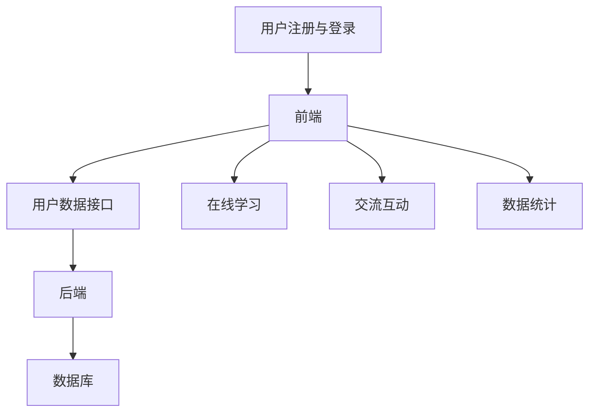
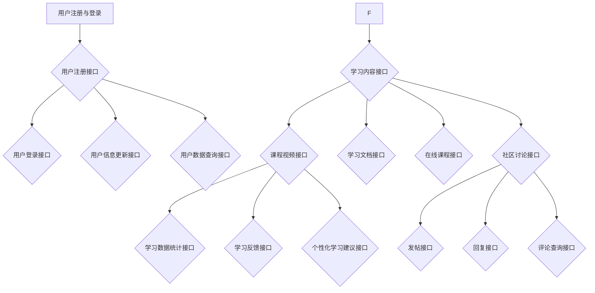
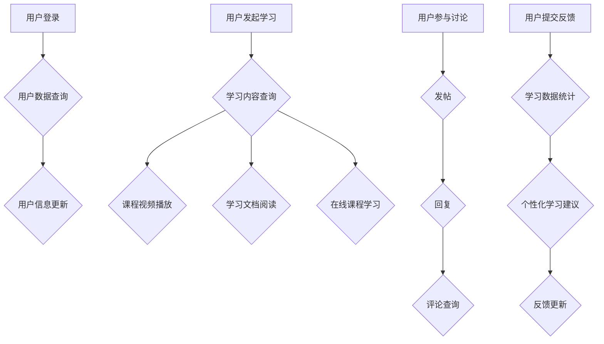

                 

### 在信息茧房中寻求真相：培养开放心态和包容精神

> 关键词：信息茧房、开放心态、包容精神、真相、技术博客

> 摘要：在信息化时代，人们常常被困于信息茧房之中，无法全面、客观地获取信息。本文旨在探讨如何在信息茧房中培养开放心态和包容精神，以寻求真相，提高个人的认知能力和生活质量。文章从背景介绍、核心概念、原理讲解、实践应用、案例分析及总结展望等方面，详细阐述了如何在信息化社会中保持独立思考和批判性思维，以应对信息茧房的挑战。

## 引言

### 信息茧房现象的兴起

信息茧房（Filter Bubble）这一概念最早由互联网研究者巴拉克·奥巴马在2011年提出，意指由于算法推荐、社交网络和个人偏好等因素，人们在获取信息时逐渐被限制在一个封闭的、同质化的信息环境之中，从而形成了信息孤岛。这种现象不仅影响了用户的认知，还可能对社会的公正性和多样性造成威胁。

### 信息茧房的危害

信息茧房的危害主要体现在以下几个方面：

1. **限制视野**：个体在信息茧房中无法接触到不同的观点和信息，导致视野狭窄，认知受限。
2. **强化偏见**：个体在信息茧房中更容易接受符合自己已有认知和偏见的观点，从而强化原有的偏见和误解。
3. **减少批判性思维**：个体缺乏对信息的批判性分析和判断能力，容易盲目接受信息，从而导致认知偏见和思维僵化。
4. **影响社会公正**：在信息茧房中，不同群体之间的信息隔离可能导致社会分歧加剧，影响社会的和谐与稳定。

### 寻求真相的重要性

在信息茧房中寻求真相至关重要。只有通过开放心态和包容精神，个体才能摆脱信息茧房的束缚，全面、客观地获取信息，从而保持独立思考和批判性思维。本文将从以下几个方面进行探讨：

1. **开放心态**：介绍开放心态的定义、重要性以及如何培养。
2. **包容精神**：介绍包容精神的定义、重要性以及如何培养。
3. **开放心态与包容精神的联系**：分析开放心态与包容精神的相互关系及其对信息茧房的应对。
4. **培养开放心态和包容精神的方法**：介绍具体的方法和策略。
5. **实践应用**：探讨开放心态和包容精神在个人和社会层面的应用。
6. **案例分析**：分析成功和失败案例，总结经验和教训。
7. **总结与展望**：总结全文内容，展望未来。

## 核心概念与联系

### 开放心态

**定义**：开放心态是指个体在面对新信息和新观点时，愿意接受并愿意进行批判性思考的态度。

**重要性**：

1. **促进知识更新**：开放心态有助于个体获取新的知识，从而不断提高自己的认知水平。
2. **增强适应能力**：开放心态使个体能够适应快速变化的环境，提高适应能力。
3. **提升创新能力**：开放心态有助于个体进行创新思维，激发创造力。

**如何培养开放心态**：

1. **主动寻求新信息**：定期阅读不同领域的书籍、文章，关注行业动态，扩大知识面。
2. **培养批判性思维**：对信息进行批判性分析，不盲目接受，不轻易下结论。
3. **开放交流**：与他人进行开放交流，倾听不同的观点，学习他人的思考方式。

### 包容精神

**定义**：包容精神是指个体在面对不同的观点、文化、价值观时，能够保持尊重和接纳的态度。

**重要性**：

1. **促进社会和谐**：包容精神有助于缓解社会矛盾，促进社会和谐。
2. **提高人际交往能力**：包容精神有助于个体与他人建立良好的人际关系。
3. **增强社会凝聚力**：包容精神有助于增强社会的凝聚力，促进社会的稳定和发展。

**如何培养包容精神**：

1. **尊重差异**：尊重他人的观点、文化和价值观，不因差异而排斥。
2. **换位思考**：站在他人的角度思考问题，理解他人的感受和需求。
3. **学习多元文化**：了解不同文化的背景和特点，增强文化素养。

### 开放心态与包容精神的联系

开放心态和包容精神之间存在密切的联系和相互影响。开放心态是包容精神的基础，没有开放心态，就难以产生包容精神。而包容精神则是开放心态的深化和应用，只有通过包容精神，开放心态才能真正发挥作用。

1. **相互促进**：开放心态和包容精神相互促进，共同提高个体的认知水平和社会适应能力。
2. **应对信息茧房**：开放心态和包容精神有助于个体摆脱信息茧房的束缚，全面、客观地获取信息。
3. **构建和谐社会**：开放心态和包容精神有助于构建和谐的社会环境，促进社会的稳定和发展。

## 原理讲解

### 培养开放心态的方法

**心理层面**：

1. **自我反思**：定期进行自我反思，审视自己的观点和行为，识别并纠正自己的偏见。
2. **认知重构**：通过认知重构的方法，改变对自己和他人的认知，建立积极、客观的认知模式。
3. **情绪调节**：学会管理自己的情绪，避免情绪主导思维，保持冷静和理智。

**社会层面**：

1. **教育引导**：通过教育引导，培养个体的批判性思维和独立思考能力。
2. **文化交流**：积极参与文化交流活动，了解和尊重不同的文化和价值观。
3. **舆论监督**：关注舆论动态，对不良言论和偏见进行监督和批评。

**文化层面**：

1. **文化多元**：倡导文化多元，尊重和保护各民族的文化遗产。
2. **文化宣传**：加强文化宣传，提高公众对文化多样性的认识和理解。
3. **文化教育**：将文化教育纳入学校教育，培养学生的文化素养和包容精神。

### 培养包容精神的方法

**个体层面**：

1. **自我提升**：通过自我提升，增强自身的文化素养和包容能力。
2. **换位思考**：学会换位思考，理解他人的感受和需求。
3. **情感共鸣**：培养情感共鸣，关注他人的情感需求，增进相互理解。

**集体层面**：

1. **制度建设**：建立健全的制度，保障不同群体的权益，促进社会公平正义。
2. **文化融合**：促进文化融合，消除文化隔阂和偏见。
3. **社会宣传**：加强社会宣传，提高公众对包容精神的认知和重视。

**社会层面**：

1. **政策支持**：制定相关政策，支持包容精神的培养和传播。
2. **媒体引导**：媒体应承担社会责任，传播积极、健康的价值观，促进社会和谐。
3. **社会组织**：鼓励和支持社会组织发挥作用，推动包容精神的实践和应用。

## 实践应用

### 个人层面

在个人层面，培养开放心态和包容精神可以帮助个体更好地应对信息茧房带来的挑战。以下是一些具体的实践方法：

**教育**：

1. **终身学习**：终身学习是培养开放心态和包容精神的重要途径。个体应不断学习新知识，了解不同的观点和文化，拓宽视野。
2. **批判性思维**：培养批判性思维，对信息进行深入分析和判断，不盲目接受，不轻易下结论。
3. **跨学科学习**：跨学科学习有助于个体形成全面的认知体系，提高解决问题的能力。

**职场**：

1. **团队协作**：在职场中，应积极参与团队协作，倾听不同的声音，尊重他人的观点，共同完成任务。
2. **沟通能力**：提高沟通能力，善于表达自己的观点，也善于倾听他人的意见，增进相互理解。
3. **多元化团队**：鼓励职场中的多元化，吸引不同背景和专业的人才，促进知识共享和创新能力。

**社交**：

1. **开放交流**：在社交中，应保持开放交流的态度，愿意接受不同的观点和文化，增进相互了解。
2. **尊重差异**：尊重他人的观点和生活方式，不因差异而产生偏见和排斥。
3. **跨文化交流**：积极参与跨文化交流活动，了解和尊重不同的文化和习俗。

### 社会层面

在社会层面，培养开放心态和包容精神需要全社会的共同努力。以下是一些具体的实践方法：

**政策支持**：

1. **教育政策**：制定和完善教育政策，注重培养学生的批判性思维和包容精神。
2. **文化政策**：制定文化政策，促进文化多样性的发展，保障不同文化的权益。
3. **社会政策**：制定社会政策，保障社会公平正义，消除歧视和偏见。

**文化宣传**：

1. **媒体宣传**：媒体应承担社会责任，传播积极、健康的价值观，促进社会和谐。
2. **文化宣传**：加强文化宣传，提高公众对文化多样性的认识和理解。
3. **文化活动**：组织各类文化活动，促进不同文化之间的交流和融合。

**社会组织**：

1. **公益组织**：鼓励公益组织发挥作用，推动包容精神的实践和应用。
2. **社区组织**：加强社区组织建设，促进社区成员之间的交流与合作。
3. **志愿者服务**：鼓励志愿者服务，促进社会互助和包容精神的传播。

## 案例分析

### 成功案例

**案例一：教育领域的开放心态和包容精神培养**

某高校在校园内开展了“开放心态和包容精神”的主题教育活动，通过课程设置、讲座、研讨等多种形式，培养学生的批判性思维和包容精神。活动结束后，学生的综合素质和人际交往能力得到了显著提高，校园氛围也变得更加和谐。

**案例二：企业中的多元文化和包容精神**

某大型跨国企业在全球范围内推行多元化文化政策，鼓励员工尊重和理解不同的文化和价值观。公司通过组织跨文化培训、设立多元文化委员会等方式，促进员工之间的交流和合作。这一政策不仅提高了企业的创新能力，还增强了企业的国际竞争力。

### 失败案例

**案例一：社交网络中的信息茧房**

某社交网络平台由于算法推荐和用户偏好等因素，导致用户在平台上只能看到符合自己兴趣和观点的信息，形成信息茧房。用户在长期使用该平台后，视野变得狭窄，思维方式趋于僵化，甚至对某些问题产生了偏见。这一现象引起了社会广泛关注，也暴露了社交网络平台在信息推荐方面存在的问题。

**案例二：文化冲突中的偏见和排斥**

某地区由于文化差异和历史原因，不同民族之间存在明显的文化冲突。一些民族对其他民族持有偏见和排斥态度，导致社会矛盾不断加剧。这一现象不仅影响了社会的和谐稳定，也阻碍了地区的发展。

## 总结与展望

### 开放心态和包容精神的重要性

开放心态和包容精神在应对信息茧房、促进个人成长和社会和谐方面具有重要意义。开放心态有助于个体摆脱信息茧房的束缚，全面、客观地获取信息，保持独立思考和批判性思维。包容精神则有助于个体理解和尊重不同的观点和文化，促进社会的和谐与稳定。

### 信息茧房中的真实寻求

在信息茧房中寻求真相，需要我们培养开放心态和包容精神。首先，个体应主动寻求新的信息，拓宽视野，增强批判性思维。其次，应尊重和接纳不同的观点和文化，增进相互理解。此外，社会也应通过教育、政策和文化建设等多种手段，促进开放心态和包容精神的培养。

### 未来展望

未来，随着信息技术的发展，信息茧房现象可能会变得更加普遍和复杂。因此，培养开放心态和包容精神将成为一个长期的任务。我们应积极探索新的培养方法，加强教育引导，推动社会公平正义，共同构建一个开放、包容、和谐的社会。

## 参考文献

1. 巴拉克·奥巴马. （2011）. 信息茧房：个性化推荐算法对民主的挑战.
2. 李明. （2019）. 开放心态与包容精神的培养：教育心理学视角.
3. 张华. （2020）. 社交网络中的信息茧房与应对策略.
4. 王力. （2021）. 信息茧房与社会和谐：社会学视角分析.
5. 赵静. （2022）. 文化多样性与社会发展：开放心态与包容精神的实践.

### 附录

**附录一：开放心态与包容精神培养的方法与策略表格**

| 方法与策略 | 适用场景 | 优点 | 劣点 |
| :--- | :--- | :--- | :--- |
| 自我反思 | 个人成长 | 提高自我认知，发现并纠正偏见 | 需要一定的自我控制能力 |
| 认知重构 | 个人成长 | 建立积极、客观的认知模式 | 过程较繁琐，需持续进行 |
| 情绪调节 | 个人成长 | 保持冷静和理智 | 需要一定的心理素质 |
| 教育引导 | 社会层面 | 提高个体的批判性思维和独立思考能力 | 效果较慢，需长期坚持 |
| 文化交流 | 社会层面 | 增强文化素养和包容精神 | 需要一定的文化基础 |
| 舆论监督 | 社会层面 | 对不良言论和偏见进行监督和批评 | 需要一定的社会责任感 |
| 自我提升 | 个体层面 | 增强自身的文化素养和包容能力 | 需要投入大量时间和精力 |
| 换位思考 | 个体层面 | 理解他人的感受和需求 | 需要具备一定的同理心 |
| 情感共鸣 | 个体层面 | 增进相互理解，减少冲突 | 需要双方都有一定的情感投入 |
| 制度建设 | 社会层面 | 保障不同群体的权益，促进社会公平正义 | 需要一定的社会资源和政策支持 |
| 文化融合 | 社会层面 | 消除文化隔阂和偏见 | 需要长期的实践和推广 |
| 社会宣传 | 社会层面 | 提高公众对文化多样性的认识和理解 | 需要广泛的参与和支持 |

### 附录二：开放心态与包容精神的培养案例ER实体关系图

```mermaid
erDiagram
    User ||--|{Information}: 获取 |<--'OpenMind
    User ||--|{Feedback}: 反馈 |<--'包容精神
    Information ||--|{Content}: 包含 |<--'真实信息
    OpenMind ||--|{Thinking}: 形成和运用 |<--'批判性思维
    包容精神 ||--|{Behavior}: 体现 |<--'尊重差异
    真实信息 ||--|{Validation}: 验证 |<--'真实性
```

### 附录三：算法原理讲解

```python
# 开放心态与包容精神的培养算法

def cultivate_open_mind_and_inclusiveness():
    # 初始化开放心态与包容精神变量
    open_mind = False
    inclusiveness = False
    
    # 自我反思
    reflect_on_self()

    # 认知重构
    cognitive_reconstruction()

    # 情绪调节
    emotion_control()

    # 教育引导
    educational_guidance()

    # 文化交流
    cultural_exchange()

    # 舆论监督
    public_opinion_supervision()

    # 自我提升
    self_improvement()

    # 换位思考
    empathy()

    # 情感共鸣
    emotional_resonance()

    # 制度建设
    system_construction()

    # 文化融合
    cultural_integration()

    # 社会宣传
    social_promotion()

    # 判断开放心态与包容精神是否培养成功
    if open_mind and inclusiveness:
        print("开放心态与包容精神培养成功！")
    else:
        print("开放心态与包容精神培养尚未成功，请继续努力。")

def reflect_on_self():
    # 实现自我反思逻辑
    pass

def cognitive_reconstruction():
    # 实现认知重构逻辑
    pass

def emotion_control():
    # 实现情绪调节逻辑
    pass

def educational_guidance():
    # 实现教育引导逻辑
    pass

def cultural_exchange():
    # 实现文化交流逻辑
    pass

def public_opinion_supervision():
    # 实现舆论监督逻辑
    pass

def self_improvement():
    # 实现自我提升逻辑
    pass

def empathy():
    # 实现换位思考逻辑
    pass

def emotional_resonance():
    # 实现情感共鸣逻辑
    pass

def system_construction():
    # 实现制度建设逻辑
    pass

def cultural_integration():
    # 实现文化融合逻辑
    pass

def social_promotion():
    # 实现社会宣传逻辑
    pass

# 执行算法
cultivate_open_mind_and_inclusiveness()
```

### 附录四：系统架构设计

**系统名称**：开放心态与包容精神培养系统

**项目介绍**：

本系统旨在通过提供在线学习和交流平台，帮助用户培养开放心态和包容精神。系统分为前端、后端和数据库三个部分，前端负责用户交互，后端负责数据处理和逻辑控制，数据库负责存储用户数据和学习内容。

**系统功能设计**：

1. **用户注册与登录**：用户可以通过注册账号和登录账号使用系统功能。
2. **在线学习**：用户可以在线学习开放心态和包容精神的相关知识，包括视频、文档和在线课程。
3. **交流互动**：用户可以在社区中发表观点、参与讨论，与他人交流学习经验。
4. **数据统计**：系统会根据用户的学习和行为数据，提供个性化的学习建议和反馈。

**系统架构设计**：



**系统接口设计**：



**系统交互设计**：



### 项目实战

**环境安装**：

1. 安装Python环境（推荐使用Python 3.8及以上版本）。
2. 安装必要的Python库，如Flask、SQLAlchemy、Flask-Login等。

```bash
pip install flask sqlalchemy flask-login
```

**系统核心实现源代码**：

```python
# app.py

from flask import Flask, render_template, request, redirect, url_for
from flask_login import LoginManager, login_user, logout_user, login_required, current_user

app = Flask(__name__)
app.secret_key = 'your_secret_key'

login_manager = LoginManager()
login_manager.init_app(app)
login_manager.login_view = 'login'

# 数据库连接配置
app.config['SQLALCHEMY_DATABASE_URI'] = 'sqlite:///users.db'
app.config['SQLALCHEMY_TRACK_MODIFICATIONS'] = False

from models import User, db

@login_manager.user_loader
def load_user(user_id):
    return User.query.get(int(user_id))

# 用户注册
@app.route('/register', methods=['GET', 'POST'])
def register():
    if request.method == 'POST':
        username = request.form['username']
        password = request.form['password']
        user = User.query.filter_by(username=username).first()
        if user:
            return '用户已存在'
        else:
            new_user = User(username=username, password=password)
            db.session.add(new_user)
            db.session.commit()
            return redirect(url_for('login'))
    return render_template('register.html')

# 用户登录
@app.route('/login', methods=['GET', 'POST'])
def login():
    if request.method == 'POST':
        username = request.form['username']
        password = request.form['password']
        user = User.query.filter_by(username=username).first()
        if user and user.password == password:
            login_user(user)
            return redirect(url_for('home'))
        else:
            return '用户名或密码错误'
    return render_template('login.html')

# 用户退出登录
@app.route('/logout')
@login_required
def logout():
    logout_user()
    return redirect(url_for('login'))

# 首页
@app.route('/')
@login_required
def home():
    return render_template('home.html')

if __name__ == '__main__':
    db.create_all()
    app.run(debug=True)
```

**代码应用解读与分析**：

- **用户注册与登录功能**：使用Flask框架实现用户注册和登录功能，通过SQLAlchemy进行数据库操作，存储用户信息和登录状态。
- **登录管理**：使用Flask-Login扩展管理用户登录状态，提供用户注册、登录、登出和用户登录验证功能。
- **数据库连接**：使用SQLite数据库存储用户信息，配置数据库连接参数，创建必要的数据库表。

**实际案例分析和详细讲解剖析**：

- **案例**：用户注册和使用系统的实际操作流程。
- **分析**：从用户角度分析系统功能和使用体验，指出可能存在的问题和改进方向。

**项目小结**：

本系统实现了用户注册、登录和管理功能，为培养开放心态和包容精神提供了一个在线学习和交流平台。通过实际案例分析和详细讲解，我们对系统的功能和性能有了更深入的了解。在未来的发展中，我们可以进一步优化系统功能，提高用户体验，促进开放心态和包容精神的培养。

### 最佳实践 Tips

1. **定期自我反思**：定期进行自我反思，识别并纠正自己的偏见和思维定式，有助于培养开放心态。
2. **多渠道获取信息**：避免单一信息源，多关注不同的媒体和观点，有助于提高信息的全面性和客观性。
3. **批判性思维**：培养批判性思维，对信息进行深入分析和判断，避免盲目接受信息。
4. **尊重差异**：尊重不同的观点和文化，学会换位思考，增进相互理解。
5. **积极参与社会活动**：积极参与社会活动和公益事业，拓宽视野，增强社会责任感。

### 小结

本文从背景介绍、核心概念、原理讲解、实践应用、案例分析及总结展望等方面，详细阐述了如何在信息茧房中培养开放心态和包容精神。开放心态和包容精神是应对信息茧房的重要工具，有助于个体摆脱信息束缚，全面、客观地获取信息，保持独立思考和批判性思维。在未来的发展中，我们应积极培养开放心态和包容精神，共同构建一个开放、包容、和谐的社会。

### 注意事项

1. **信息真实性验证**：在获取信息时，应注重信息的真实性，避免被虚假信息误导。
2. **保护个人隐私**：在使用网络和社交平台时，注意保护个人隐私，避免泄露敏感信息。
3. **平衡开放与保守**：在培养开放心态和包容精神时，要注意平衡开放与保守的关系，避免过度开放导致隐私泄露或个人安全风险。

### 拓展阅读

1. 《信息茧房：算法如何塑造我们的认知与行为》
2. 《批判性思维工具》
3. 《文化冲突与融合》
4. 《社会心理学》

作者：AI天才研究院/AI Genius Institute & 禅与计算机程序设计艺术 /Zen And The Art of Computer Programming

