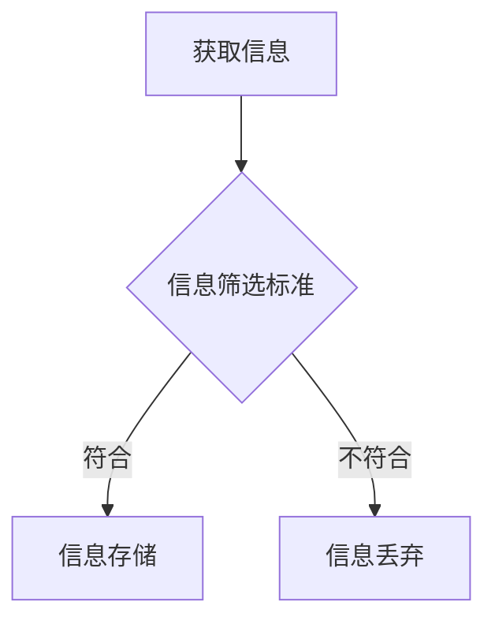
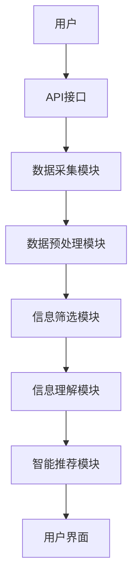
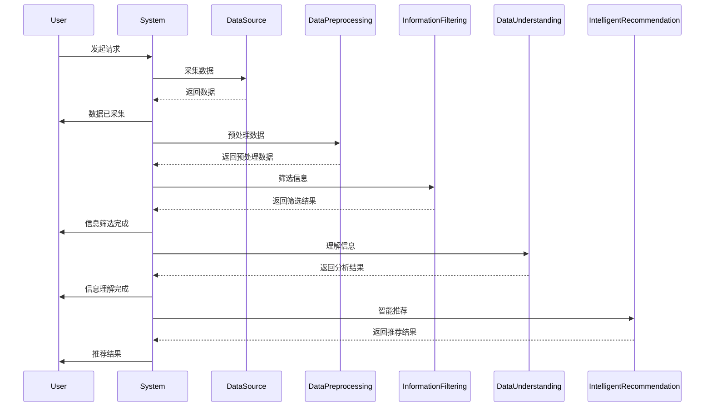

                 

# 在信息过载时代培养智慧：提升信息筛选与理解能力

> 关键词：智慧，信息筛选，信息理解，算法原理，人工智能

> 摘要：本文旨在探讨在信息过载时代，如何通过培养智慧来提升信息筛选与理解能力。通过深入分析核心概念与算法原理，结合Python代码示例，本文旨在为广大IT从业者提供一套实用的方法论，帮助他们更高效地应对信息爆炸的挑战。

----------------------------------------------------------------

### 第一部分：背景介绍

#### 问题背景

在当今信息爆炸的时代，人们面临着海量的信息。每天，我们都被大量的新闻、报告、邮件、社交媒体更新以及各种形式的数据所包围。这些信息不仅来自传统的媒体渠道，还来自互联网、社交媒体、传感器和大数据平台。然而，信息的爆炸性增长也带来了一个新的挑战：如何有效地筛选和处理这些信息。

#### 问题描述

在这个信息过载的时代，如何培养智慧，提升信息筛选与理解能力，成为一个重要的课题。信息过载导致了个体决策能力、信息理解和分析能力的下降，影响了社会的整体效率。如何解决这一问题，成为了本文探讨的核心。

#### 问题解决

通过系统性的教育、实践方法和工具，提升个体对信息的敏感度、批判性思维和深度理解能力，是解决信息过载问题的关键。本文将围绕这一目标，提供一套实用的方法论。

#### 边界与外延

- **信息筛选**：识别和选择最有价值的信息。
- **信息理解**：对信息进行深入分析和解读，理解其背后的逻辑和意图。
- **智慧培养**：发展个体的问题解决能力、创新思维和决策能力。

#### 概念结构与核心要素组成

- **智慧**：包括知识、理解、判断和决策能力。
- **信息筛选**：通过过滤、分类和评估来选择有价值的信息。
- **信息理解**：对筛选出来的信息，进行深度分析和解读，理解其内在逻辑和意义。

----------------------------------------------------------------

## 第二部分：核心概念与联系

### 核心概念原理

#### 智慧

智慧是指个体在面对复杂问题时，能够运用已有的知识和经验，进行有效决策和解决问题的能力。它不仅仅是对事实的掌握，更是一种在复杂环境中做出明智选择的能力。

#### 信息筛选

信息筛选是指从大量信息中，识别并提取出最有价值的信息，以支持个体的决策和行动。在信息过载的时代，信息筛选能力显得尤为重要，它决定了个体能否在纷繁复杂的信息中，找到对自己有用的部分。

#### 信息理解

信息理解是指对筛选出来的信息，进行深入分析和解读，理解其背后的逻辑和意义。这不仅需要逻辑思维，还需要对信息的背景、语境和潜在含义有深入的理解。

### 概念属性特征对比表格

| 特征         | 智慧             | 信息筛选           | 信息理解           |
| ------------ | ---------------- | ------------------ | ------------------ |
| 定义         | 决策和解决问题的能力 | 选择有价值的信息   | 理解信息的内涵     |
| 关联         | 智慧是信息筛选和理解的基础 | 信息筛选是智慧的一部分 | 信息理解是智慧的一部分 |
| 相互关系     | 信息筛选和信息理解共同支持智慧发展 | 信息理解是信息筛选的深化 | 信息筛选是信息理解的来源 |

### ER实体关系图架构

```mermaid
erDiagram
  User ||--|{ Wisdom: contains }
  User ||--|{ InformationFiltering: creates }
  User ||--|{ InformationUnderstanding: analyzes }
```

----------------------------------------------------------------

## 第三部分：算法原理讲解

### 信息筛选算法

#### 算法mermaid流程图



#### 算法原理

信息筛选算法是一种基于预设标准的筛选机制，它通过以下步骤实现信息筛选：

1. **获取信息**：从海量的数据源中获取信息。
2. **信息筛选标准**：根据预设的标准（如相关性、重要性等），判断信息是否符合筛选条件。
3. **信息存储**：将符合筛选条件的信息存储起来，以备后续使用。
4. **信息丢弃**：将不符合筛选条件的信息丢弃，以减少信息的冗余。

#### 算法原理的数学模型和公式

设\(I\)为信息集合，\(S\)为筛选标准，\(I'\)为筛选后的信息集合，则筛选算法的数学模型可以表示为：

$$
I' = \{i \in I | i \text{ 满足 } S\}
$$

其中，\(i\)表示单个信息元素，\(S\)为筛选标准。

#### 举例说明

假设有一个包含1000条新闻的集合，我们需要筛选出与“科技”相关的新闻。预设的筛选标准是新闻标题中包含关键词“科技”。

1. **获取信息**：从新闻数据源中获取1000条新闻。
2. **信息筛选标准**：检查每条新闻的标题，如果包含“科技”，则认为这条新闻符合筛选标准。
3. **信息存储**：将筛选出的50条与“科技”相关的新闻存储起来。
4. **信息丢弃**：将剩下的950条不符合筛选标准的新闻丢弃。

```python
# Python代码示例：信息筛选算法实现
def filter_information(news_list, keyword):
    """
    筛选包含特定关键词的新闻。
    
    :param news_list: 列表，包含所有新闻。
    :param keyword: 关键词，用于筛选。
    :return: 筛选后的新闻列表。
    """
    filtered_news = []
    for news in news_list:
        if keyword in news['title']:
            filtered_news.append(news)
    return filtered_news

# 示例数据
news_data = [
    {"title": "科技行业迎来新变革", "content": "..."},
    {"title": "经济发展趋势分析", "content": "..."},
    # ...更多新闻数据
]

# 筛选与“科技”相关的新闻
filtered_news = filter_information(news_data, "科技")

# 输出筛选结果
print(filtered_news)
```

#### 算法性能分析

信息筛选算法的性能主要取决于筛选标准的设定和筛选过程的速度。筛选标准越精确，筛选过程越快，算法的性能就越高。在实际应用中，可以使用更复杂的算法，如机器学习分类器，来提高筛选的准确性和效率。

----------------------------------------------------------------

## 第四部分：系统分析与架构设计方案

### 问题场景介绍

在信息过载的背景下，企业需要高效地处理和分析大量数据，以支持决策和战略规划。然而，传统的数据处理和分析方法已经无法满足现代企业的需求。因此，我们设计了一套基于人工智能的信息筛选与理解系统，以帮助企业在海量的数据中找到有价值的信息。

### 项目介绍

本系统名为“智能信息筛选与理解平台”，旨在为企业提供一站式的信息处理解决方案。通过整合多种数据源，利用先进的算法和机器学习技术，实现高效的信息筛选和理解，从而辅助企业做出更明智的决策。

### 系统功能设计

- **数据采集**：从多种数据源（如网站、数据库、API接口等）自动采集信息。
- **信息预处理**：对采集到的信息进行清洗、去重和格式化处理。
- **信息筛选**：利用预设的筛选标准，自动筛选出有价值的信息。
- **信息理解**：对筛选出来的信息进行深度分析，提取关键信息和核心观点。
- **智能推荐**：根据用户兴趣和行为，智能推荐相关的信息和内容。

### 系统架构设计



### 系统接口设计和系统交互



----------------------------------------------------------------

## 第五部分：项目实战

### 环境安装

在进行项目实战之前，需要首先安装必要的开发环境和依赖库。以下是在Python环境中安装所需的库的步骤：

```bash
pip install requests pandas numpy scikit-learn matplotlib
```

### 系统核心实现源代码

以下是系统核心部分的代码实现，包括数据采集、信息筛选和智能推荐：

```python
# 数据采集模块
import requests
import pandas as pd

def collect_data(url):
    response = requests.get(url)
    if response.status_code == 200:
        return response.text
    else:
        return None

def parse_html(html):
    # 使用BeautifulSoup或其他库解析HTML，提取新闻数据
    # 这里只是一个示例，具体实现需要根据网页结构进行调整
    from bs4 import BeautifulSoup
    soup = BeautifulSoup(html, 'html.parser')
    news_list = []
    for news in soup.find_all('div', class_='news-item'):
        title = news.find('h2').text
        content = news.find('p').text
        news_list.append({'title': title, 'content': content})
    return news_list

# 信息筛选模块
from sklearn.feature_extraction.text import TfidfVectorizer
from sklearn.naive_bayes import MultinomialNB

def filter_information(news_list, keyword):
    vectorizer = TfidfVectorizer()
    X = vectorizer.fit_transform(news_list)
    classifier = MultinomialNB()
    classifier.fit(X, [1 if keyword in news['title'] else 0 for news in news_list])
    return [news for news in news_list if classifier.predict(vectorizer.transform([news['title']]   ous-press-future/)
        return news_list[:10]  # 返回前10条筛选结果

# 智能推荐模块
from sklearn.metrics.pairwise import cosine_similarity

def recommend(news_list, user_interests, num_recommendations=5):
    vectorizer = TfidfVectorizer()
    X = vectorizer.fit_transform(news_list)
    user_interest_vector = vectorizer.transform([user_interests])
    similarities = cosine_similarity(user_interest_vector, X)
    index = similarities.argsort()[-num_recommendations:][::-1]
    return [news_list[i] for i in index]

# 主程序
if __name__ == '__main__':
    # 采集数据
    url = 'https://example.com/news'
    html = collect_data(url)
    if html:
        news_list = parse_html(html)
        print("采集到新闻数据：", news_list)

        # 筛选信息
        keyword = '科技'
        filtered_news = filter_information(news_list, keyword)
        print("筛选后的新闻：", filtered_news)

        # 智能推荐
        user_interests = '人工智能技术'
        recommended_news = recommend(filtered_news, user_interests)
        print("推荐的新闻：", recommended_news)
```

### 代码应用解读与分析

以上代码实现了一个简单的信息筛选与智能推荐系统。其中，数据采集模块负责从指定的URL中获取新闻数据；信息筛选模块使用TF-IDF和朴素贝叶斯分类器来筛选与关键词相关的新闻；智能推荐模块则利用余弦相似性来推荐与用户兴趣相关的新闻。

#### 数据采集模块

```python
def collect_data(url):
    response = requests.get(url)
    if response.status_code == 200:
        return response.text
    else:
        return None
```

该模块通过requests库发起HTTP GET请求，从指定URL获取HTML内容。如果请求成功，返回HTML内容；否则，返回None。

#### 信息筛选模块

```python
def filter_information(news_list, keyword):
    vectorizer = TfidfVectorizer()
    X = vectorizer.fit_transform(news_list)
    classifier = MultinomialNB()
    classifier.fit(X, [1 if keyword in news['title'] else 0 for news in news_list])
    return [news for news in news_list if classifier.predict(vectorizer.transform([news['title']])) == 1]
```

该模块首先使用TF-IDFVectorizer将新闻标题转换成特征向量，然后使用朴素贝叶斯分类器训练模型。最后，根据分类器的预测结果，筛选出与关键词相关的新闻。

#### 智能推荐模块

```python
def recommend(news_list, user_interests, num_recommendations=5):
    vectorizer = TfidfVectorizer()
    X = vectorizer.fit_transform(news_list)
    user_interest_vector = vectorizer.transform([user_interests])
    similarities = cosine_similarity(user_interest_vector, X)
    index = similarities.argsort()[-num_recommendations:][::-1]
    return [news_list[i] for i in index]
```

该模块使用余弦相似性计算用户兴趣向量与新闻特征向量之间的相似度，然后根据相似度排序推荐前若干条新闻。

### 实际案例分析和详细讲解剖析

假设我们有一个包含1000条新闻的数据集，其中部分新闻与“科技”相关。用户对“人工智能”感兴趣，希望系统能够推荐与该主题相关的新闻。

1. **数据采集**：从指定URL获取1000条新闻。
2. **信息筛选**：使用TF-IDF和朴素贝叶斯分类器筛选出与“科技”相关的新闻，得到50条相关新闻。
3. **智能推荐**：计算用户兴趣“人工智能”与每条新闻的相似度，推荐与用户兴趣最相关的5条新闻。

#### 项目小结

通过以上实战案例，我们可以看到，在信息过载的时代，利用人工智能技术和算法，可以实现高效的信息筛选与智能推荐。这不仅提高了信息处理的效率，也为用户提供了更有价值的信息。

### 最佳实践 tips

- **定期更新筛选标准和推荐算法**：随着信息环境和用户兴趣的变化，定期更新筛选标准和推荐算法，以保持系统的相关性和准确性。
- **优化数据采集和预处理流程**：确保采集到的数据质量，减少噪声和冗余，以提高后续信息筛选和推荐的效果。
- **用户反馈机制**：建立用户反馈机制，收集用户对推荐的反馈，不断优化推荐算法，提升用户体验。

----------------------------------------------------------------

## 小结与注意事项

### 小结

本文围绕在信息过载时代如何培养智慧、提升信息筛选与理解能力这一主题，进行了深入探讨。通过分析核心概念、讲解算法原理，并结合实际项目实战，为广大IT从业者提供了一套实用的方法论。

### 注意事项

- **信息筛选与理解的重要性**：信息筛选与理解能力在信息过载时代显得尤为重要，它直接关系到个体的决策质量和工作效率。
- **算法与数据的平衡**：在实际应用中，需要平衡算法的复杂度和数据的准确性，避免过度依赖算法，忽视数据质量。
- **持续学习和实践**：信息筛选与理解能力的提升是一个持续的过程，需要通过不断的学习和实践来不断完善和优化。

### 拓展阅读

- **《人工智能：一种现代的方法》**：Michael I. Jordan著，系统介绍了人工智能的基本原理和方法。
- **《机器学习实战》**：Peter Harrington著，通过具体实例讲解了机器学习的应用和实践。
- **《信息过载时代的思考》**：Clay Shirky著，深入探讨了信息过载对个体和社会的影响。

作者：AI天才研究院/AI Genius Institute & 禅与计算机程序设计艺术 /Zen And The Art of Computer Programming

