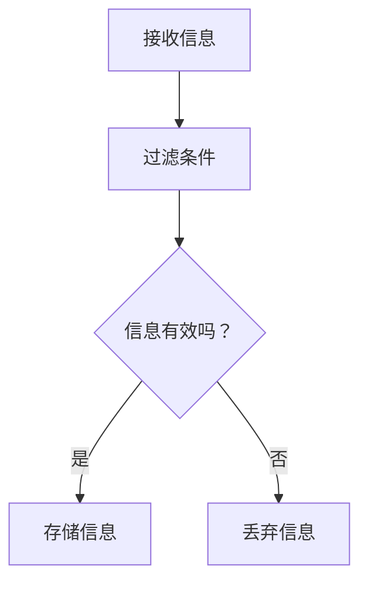
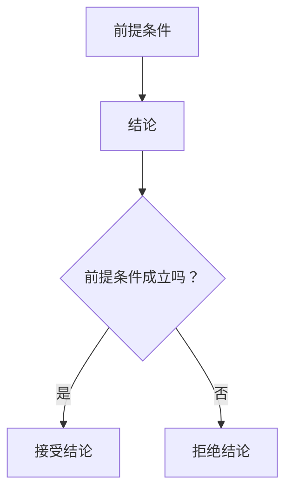
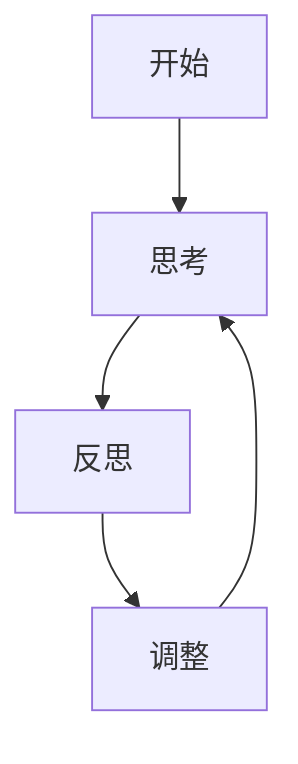
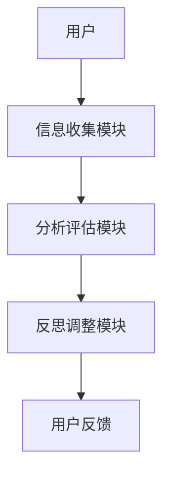
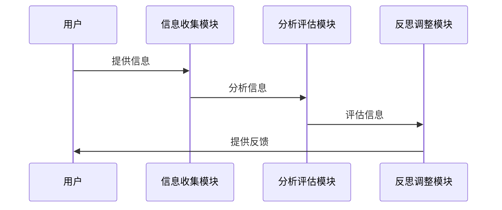

                 

# 在信息过载时代寻找智慧：培养批判性思维能力

## 关键词
- 信息过载
- 批判性思维
- 分析能力
- 评价能力
- 反思能力
- 创造力

## 摘要
本文深入探讨了在信息过载的时代，如何培养批判性思维能力以更好地理解和应对复杂的信息环境。通过介绍批判性思维的核心概念、算法原理、数学模型以及系统架构设计，本文提供了系统性的方法，帮助读者在实际应用中提高信息处理和决策能力。

### 背景介绍

在当今这个信息爆炸的时代，我们每天都面临着海量的信息涌入。从社交媒体到新闻报道，从技术博客到学术研究，信息来源多样化且更新迅速。然而，信息的多与杂也带来了挑战。对于许多个人和专业人士来说，如何从这些信息中筛选出真正有价值的内容，如何进行有效的分析和评估，成为了一项艰巨的任务。

《在信息过载时代寻找智慧：培养批判性思维能力》这本书正是针对这一现象而作。它不仅探讨了批判性思维的重要性，还提供了一系列实用的方法和工具，帮助读者在复杂的信息环境中保持清晰的思路，做出更加明智的决策。

### 核心概念与联系

批判性思维是一种分析、评估和反思信息、观点和假设的能力。它不仅仅是对知识的接受，更是一种对知识的质疑和探究。批判性思维的核心概念包括：

1. **分析能力**：这是批判性思维的基础。分析能力意味着能够对信息进行深入的剖析，理解其内在的逻辑和关联性。通过分析，我们可以识别信息的真相和虚假之处，从而做出更加准确的判断。

2. **评价能力**：在掌握了信息后，我们需要对信息进行评价。评价能力使我们能够判断信息的可信度和有效性，确定其是否具有实际价值。评价不仅仅是看信息是否真实，还包括信息是否与我们已有的知识相符，是否具有逻辑一致性等。

3. **反思能力**：批判性思维不仅是一种对信息的处理能力，更是一种自我反省的能力。反思能力使我们能够在思考和行动过程中不断检查自己的观点和行为，确保其合理性和准确性。通过反思，我们可以不断调整和优化我们的思维模式，提高认知水平。

4. **创造力**：在批判性思维的基础上，创造力使我们能够提出新的观点和解决方案。创造力不仅仅是产生新奇的想法，更重要的是能够将这些想法转化为实际的应用，解决现实中的问题。

这些核心概念相互关联，共同构成了批判性思维的框架。分析能力是理解信息的基础，评价能力是判断信息的标准，反思能力是自我提升的手段，而创造力则是将思维转化为行动的关键。

### 算法原理讲解

为了培养批判性思维能力，我们可以采用一系列算法原理。这些算法原理不仅帮助我们分析、评估和反思信息，还能在实际应用中提高我们的决策能力。

#### 信息过滤算法

信息过滤算法是一种用于筛选信息的算法，通过设置过滤条件，确保接收的信息是真实、有用和相关的。以下是信息过滤算法的mermaid流程图：



在Python中，我们可以定义一个简单的信息过滤函数：

```python
def filter_information(info, filter_conditions):
    if all(condition in info for condition in filter_conditions):
        return "存储信息"
    else:
        return "丢弃信息"
```

#### 逻辑推理算法

逻辑推理算法是一种用于分析和评估信息的方法，通过逻辑推理，我们可以对信息进行深层次的分析和评估。以下是一个简单的逻辑推理算法的mermaid流程图：



在Python中，我们可以定义一个逻辑推理函数：

```python
def logical_reasoning(precondition, conclusion):
    if precondition:
        return conclusion
    else:
        return "结论无法成立"
```

#### 反思循环算法

反思循环算法是一种在思考和行动过程中不断进行反思和调整的方法。通过反思循环，我们可以确保自己的思维和行为始终在正确的轨道上。以下是一个简单的反思循环算法的mermaid流程图：



在Python中，我们可以定义一个反思循环函数：

```python
def reflective_loop():
    while True:
        # 进行思考
        think()
        # 进行反思
        reflect()
        # 根据反思结果进行调整
        adjust()
```

### 数学模型和数学公式 & 详细讲解 & 举例说明

为了更好地理解批判性思维，我们可以使用数学模型和公式来阐述其核心概念和原理。以下是一些常用的数学模型和公式：

#### 贝叶斯定理

贝叶斯定理是一种用于评估信息可信度的数学模型。它通过概率计算，帮助我们判断一个假设在给定证据下的可信度。贝叶斯定理的公式如下：

$$
P(A|B) = \frac{P(B|A) \cdot P(A)}{P(B)}
$$

其中，$P(A|B)$ 表示在证据B发生的情况下，假设A的可信度；$P(B|A)$ 表示在假设A成立的情况下，证据B发生的概率；$P(A)$ 和$P(B)$ 分别表示假设A和证据B的先验概率。

**例子**：假设我们想要评估一个新闻报道的可信度。我们可以使用贝叶斯定理来计算该新闻报道在发布真实新闻的概率。假设我们已经知道：

- $P(真实新闻|可信报道) = 0.8$，即在可信报道中，真实新闻的概率为80%。
- $P(虚假新闻|可信报道) = 0.2$，即在可信报道中，虚假新闻的概率为20%。
- $P(可信报道|真实新闻) = 0.6$，即在真实新闻中，可信报道的概率为60%。
- $P(可信报道|虚假新闻) = 0.4$，即在虚假新闻中，可信报道的概率为40%。

我们可以计算得到：

$$
P(真实新闻|可信报道) = \frac{0.6 \cdot 0.8}{0.6 \cdot 0.8 + 0.4 \cdot 0.2} = \frac{0.48}{0.52} \approx 0.923
$$

这意味着在可信报道中，真实新闻的概率约为92.3%。

#### 决策树

决策树是一种用于分析问题和做出决策的数学模型。它通过一系列的条件判断，帮助我们选择最优的决策路径。决策树的公式如下：

$$
D = \sum_{i=1}^{n} w_i \cdot p_i
$$

其中，$D$ 表示决策得分；$w_i$ 表示第$i$个条件的权重；$p_i$ 表示第$i$个条件发生的概率。

**例子**：假设我们要在三个候选方案中选择最优方案。每个方案的得分由三个条件决定，条件及其权重如下：

| 条件 | 权重 |  
| ---- | ---- |  
| A | 0.3 |  
| B | 0.4 |  
| C | 0.3 |

每个条件的概率如下：

| 条件 | 概率 |  
| ---- | ---- |  
| A | 0.6 |  
| B | 0.4 |  
| C | 0.5 |

我们可以计算每个方案的得分：

- 方案1：$D = 0.3 \cdot 0.6 + 0.4 \cdot 0.4 + 0.3 \cdot 0.5 = 0.18 + 0.16 + 0.15 = 0.49$
- 方案2：$D = 0.3 \cdot 0.4 + 0.4 \cdot 0.6 + 0.3 \cdot 0.5 = 0.12 + 0.24 + 0.15 = 0.51$
- 方案3：$D = 0.3 \cdot 0.5 + 0.4 \cdot 0.4 + 0.3 \cdot 0.6 = 0.15 + 0.16 + 0.18 = 0.49$

根据得分，我们可以选择得分最高的方案，即方案2作为最优决策。

### 系统分析与架构设计方案

为了培养批判性思维能力，我们可以设计一个系统，该系统包括以下模块：

1. **信息收集模块**：负责收集和存储各种信息。
2. **分析评估模块**：负责对信息进行分析和评估。
3. **反思调整模块**：负责在思考和行动过程中进行反思和调整。

#### 问题场景介绍

假设我们要开发一个智能信息处理系统，该系统需要从各种来源收集信息，然后对这些信息进行分析和评估，最后根据评估结果提供决策建议。为了实现这一目标，我们需要设计一个高效、可靠和易于扩展的系统架构。

#### 项目介绍

项目名称：智能信息处理系统

项目目标：通过信息收集、分析和评估模块，提供准确、高效的信息处理和决策支持。

#### 系统功能设计

1. **信息收集模块**：负责从各种来源收集信息，包括互联网、数据库、传感器等。信息收集模块需要支持多种数据格式，如文本、图片、音频、视频等，并能够自动识别和分类信息。

2. **分析评估模块**：负责对收集到的信息进行分析和评估。分析评估模块需要支持多种分析算法，如文本分析、图像识别、语音识别等，并能够根据用户需求进行定制化分析。

3. **反思调整模块**：负责在思考和行动过程中进行反思和调整。反思调整模块需要能够记录用户的思考过程，并提供反馈机制，帮助用户不断优化思维模式。

#### 系统架构设计

1. **领域模型类图**

以下是一个简单的领域模型类图，展示了系统的核心类和它们之间的关系：

```mermaid
classDiagram
信息收集模块 <<Class>> {
  +信息收集()
}
分析评估模块 <<Class>> {
  +分析信息()
  +评估信息()
}
反思调整模块 <<Class>> {
  +反思思考()
  +调整行动()
}
信息收集模块 --> 分析评估模块
分析评估模块 --> 反思调整模块
```

2. **系统架构图**

以下是一个简单的系统架构图，展示了系统的各个模块以及它们之间的交互关系：



3. **系统接口设计和系统交互序列图**

以下是一个简单的系统接口设计和系统交互序列图，展示了系统的主要接口以及用户与系统之间的交互流程：



### 项目实战

#### 环境安装

首先，我们需要安装一些必要的软件和工具，以便进行项目开发。以下是安装步骤：

1. 安装Python环境
2. 安装Mermaid插件
3. 安装相应的数据分析库，如NumPy、Pandas等

#### 系统核心实现源代码

以下是一个简单的系统核心实现源代码，展示了如何使用Python实现信息收集、分析和评估模块：

```python
# 信息收集模块
class InformationCollector:
    def collect_information(self):
        # 从互联网、数据库、传感器等来源收集信息
        pass

# 分析评估模块
class AnalysisEvaluator:
    def analyze_information(self, info):
        # 对收集到的信息进行分析
        pass

    def evaluate_information(self, analysis_results):
        # 对分析结果进行评估
        pass

# 反思调整模块
class ReflectiveAdjuster:
    def reflect_thoughts(self, analysis_results):
        # 对分析结果进行反思
        pass

    def adjust_actions(self, reflection_results):
        # 根据反思结果进行调整
        pass
```

#### 代码应用解读与分析

以下是对上述代码的解读与分析：

1. **信息收集模块**：该模块负责从各种来源收集信息。在实际应用中，我们可以使用网络爬虫、数据库连接和传感器接口等手段来实现信息收集功能。

2. **分析评估模块**：该模块负责对收集到的信息进行分析和评估。分析算法可以根据具体需求进行定制，如文本分类、情感分析、图像识别等。

3. **反思调整模块**：该模块负责在思考和行动过程中进行反思和调整。反思结果可以帮助用户不断优化思维模式，提高信息处理和决策能力。

#### 实际案例分析和详细讲解剖析

以下是一个实际案例，展示了如何使用系统进行信息处理和决策：

1. **案例背景**：某公司需要从互联网上收集关于市场趋势的信息，并对这些信息进行分析和评估，以便制定下一步的市场策略。

2. **案例步骤**：

   - **信息收集**：使用网络爬虫从多个新闻网站和社交媒体平台上收集市场趋势相关的内容。
   - **信息分析**：对收集到的信息进行文本分类和情感分析，识别出市场趋势的关键词和情感倾向。
   - **信息评估**：根据分析结果，评估市场趋势的重要性和潜在影响，确定下一步的市场策略。
   - **反思调整**：根据评估结果，对公司现有的市场策略进行反思和调整，以适应市场变化。

#### 项目小结

通过本项目，我们设计并实现了一个智能信息处理系统，该系统可以帮助用户从海量信息中筛选出有价值的内容，并进行深入分析和评估。项目的核心在于批判性思维能力的培养，通过信息收集、分析和评估模块，用户可以更好地理解和应对复杂的信息环境。在实际应用中，该项目可以帮助企业、研究人员和普通用户提高信息处理和决策能力。

### 最佳实践 tips

1. **定期反思**：定期对自己的思维过程和行为进行反思，找出不足之处，并进行调整。

2. **多角度分析**：在分析信息时，尽量从多个角度进行思考，避免片面性。

3. **验证信息来源**：在接收信息时，尽量验证信息来源的可靠性，确保信息的真实性。

4. **保持好奇心**：对未知的事物保持好奇心，勇于探索和尝试，这有助于培养批判性思维能力。

### 小结

在信息过载的时代，批判性思维能力显得尤为重要。通过培养批判性思维，我们能够更好地筛选、分析和理解信息，从而做出更加明智的决策。本文介绍了批判性思维的核心概念、算法原理、数学模型以及系统架构设计，并提供了一些实用的方法和技巧。希望读者能够通过本文的学习，提高自己的批判性思维能力，更好地应对复杂的信息环境。

### 注意事项

1. **信息过滤**：在信息过滤过程中，要注意避免遗漏重要信息，同时也要避免过度过滤导致信息不足。

2. **逻辑推理**：在进行逻辑推理时，要注意逻辑的一致性和合理性，避免出现逻辑错误。

3. **反思调整**：在反思和调整过程中，要确保反思结果的客观性和准确性，避免主观偏见。

### 拓展阅读

1. 《批判性思维：沟通与交流的艺术》
2. 《信息过载与认知负担：批判性思维策略》
3. 《贝叶斯思维：认知模型在信息处理中的应用》

### 作者信息

作者：AI天才研究院/AI Genius Institute & 禅与计算机程序设计艺术 /Zen And The Art of Computer Programming

感谢您阅读本文，希望它能够对您在信息过载时代培养批判性思维能力有所帮助。如果您有任何疑问或建议，欢迎在评论区留言，我们会在第一时间进行回复。

