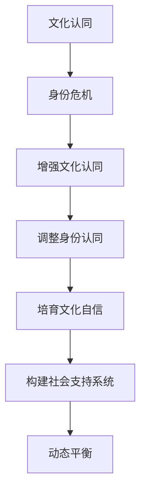
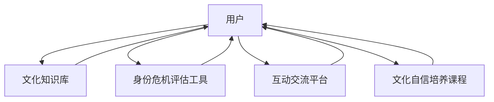
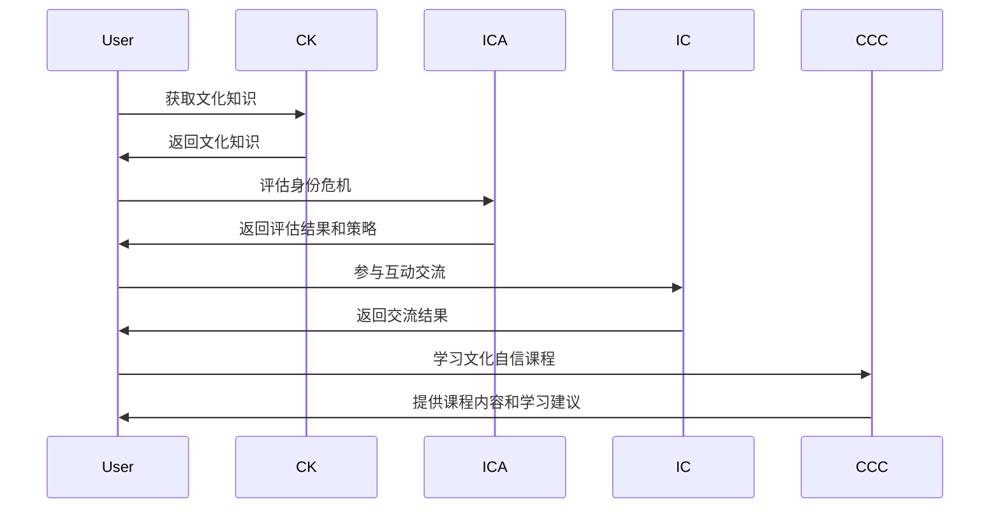

                 

# 在全球化时代寻找文化认同：克服身份危机

## 关键词

- 全球化
- 文化认同
- 身份危机
- 跨文化理解
- 社会支持系统

## 摘要

本文旨在探讨全球化背景下文化认同与身份危机的关系，并分析如何通过增强文化认同来克服身份危机。文章首先介绍了全球化的定义及其对文化认同的挑战，然后深入分析了文化认同与身份危机的内在联系，并提出了克服身份危机的策略与方法。此外，文章还探讨了个人与集体在文化认同建设中的作用，并提出了相关建议。

## 第一部分：全球化背景下的文化认同问题

### 第1章：全球化的崛起与挑战

#### 1.1 全球化的定义与特点

全球化是指全球范围内经济、政治、文化等领域的交流与互动日益频繁和加深的过程。其特点包括：

1. **经济全球化**：跨国界的资本、商品、服务和劳动力的流动日益频繁。
2. **政治全球化**：国际组织和多边机制的发展，国家间合作与协调加强。
3. **文化全球化**：文化交流和融合加速，全球文化多样性受到挑战。

#### 1.2 文化认同的内涵与重要性

文化认同是指个体或群体对特定文化的归属感和认同感。其重要性体现在：

1. **社会凝聚力**：文化认同有助于增强社会成员之间的联系和认同。
2. **个人身份**：文化认同是个人身份的重要组成部分。
3. **国家认同**：文化认同对于国家的发展和稳定具有重要影响。

#### 1.3 身份危机的概念与表现

身份危机是指个体或群体在面临外部变化时，对自己身份的认同产生困惑和不安的现象。其表现形式包括：

1. **自我认同的混乱**：个体对自己身份的归属产生疑问。
2. **文化归属的迷失**：群体在面对多元文化时，对自己文化认同的迷失。
3. **社会角色的模糊**：个体在多元社会中，难以找到明确的社会角色和定位。

#### 1.4 全球化与身份危机的关系

全球化加剧了身份危机，具体体现在：

1. **文化冲击**：全球化带来了不同文化的碰撞，可能导致个体或群体的文化认同受到冲击。
2. **社会变迁**：全球化导致社会结构的变化，使得个体和群体的身份认同面临新的挑战。
3. **信息爆炸**：全球化带来了信息的爆炸，个体在面对大量信息时，可能难以找到自己的定位和身份。

#### 1.5 本章小结

全球化背景下的文化认同问题日益突出，身份危机成为普遍现象。为了克服身份危机，我们需要深入了解全球化的影响，并积极寻求文化认同。

### 第2章：文化认同与身份危机的内在联系

#### 2.1 文化认同与身份认同的关系

文化认同与身份认同密切相关。文化认同是身份认同的基础，而身份认同则是文化认同的体现。具体关系如下：

1. **文化认同决定身份认同**：个体的文化背景和价值观念会影响其身份认同的形成。
2. **身份认同反映文化认同**：个体在特定社会文化环境中的身份和行为，是其文化认同的外在表现。

#### 2.2 文化认同缺失与身份危机

文化认同缺失可能导致身份危机，具体表现为：

1. **自我认同的困境**：个体在缺乏文化认同的情况下，难以确定自己的身份。
2. **社会归属感的丧失**：个体在多元文化环境中，可能感到自己的文化归属感不强。
3. **文化自信的削弱**：个体在文化认同缺失时，可能对自己的文化缺乏自信。

#### 2.3 身份危机对文化认同的挑战

身份危机对文化认同的挑战表现在：

1. **文化认同的动摇**：个体在面临身份危机时，可能对自己文化的认同产生怀疑。
2. **文化多样性的挑战**：全球化带来的文化多样性可能对个体或群体的文化认同构成挑战。
3. **文化认同的重构**：个体或群体在面临身份危机时，可能需要对文化认同进行重构。

#### 2.4 全球化背景下文化认同与身份危机的动态平衡

在全球化背景下，文化认同与身份危机之间存在动态平衡。具体平衡机制包括：

1. **文化认同的增强**：通过加强文化教育和传承，提高个体的文化认同。
2. **身份认同的调整**：个体在面对身份危机时，需要调整自己的身份认同，以适应新的环境。
3. **社会支持系统的建设**：通过社会支持系统的建设，为个体和群体提供支持和帮助，以克服身份危机。

#### 2.5 本章小结

文化认同与身份危机之间存在紧密的内在联系。通过增强文化认同，可以缓解身份危机，实现个人与社会的和谐发展。

### 第3章：克服身份危机的基本策略

#### 3.1 增强文化认同的策略

1. **提升文化自觉**：通过教育和个人反思，提高个体对自身文化的认识和认同。
2. **促进跨文化交流**：通过跨文化交流，增进个体对其他文化的理解和尊重。
3. **建立文化认同共同体**：通过共同的文化价值观和目标，建立个体与群体之间的紧密联系。

#### 3.2 调整身份认同的策略

1. **重新定义身份认同**：在全球化背景下，个体需要重新审视自己的身份认同，以适应新的社会环境。
2. **增强身份认同的灵活性**：个体需要具备适应性和灵活性，以应对身份认同的变化。
3. **身份认同的多维度整合**：个体需要整合多种身份认同，以形成更为全面和复杂的身份认同体系。

#### 3.3 培育文化自信

1. **文化自信的重要性**：文化自信是克服身份危机的重要心理支撑。
2. **培育文化自信的途径**：通过文化传承、文化学习和文化交流，提高个体的文化自信。
3. **文化自信与身份危机的克服**：文化自信有助于个体在面对身份危机时，保持积极的心态和行动。

#### 3.4 社会支持系统的作用

1. **社会支持系统的定义**：社会支持系统是指为个体和群体提供帮助和支持的系统。
2. **社会支持系统的构建**：通过政府、社会组织和社区等渠道，构建多元化的社会支持系统。
3. **社会支持系统在克服身份危机中的作用**：社会支持系统可以帮助个体和群体应对身份危机，提高其应对能力。

#### 3.5 本章小结

克服身份危机需要从多个方面入手，包括增强文化认同、调整身份认同、培育文化自信和建立社会支持系统。这些策略有助于个体在全球化背景下，实现文化认同与身份危机的动态平衡。

### 第4章：个人与集体的文化认同建设

#### 4.1 个人层面的文化认同建设

1. **个人文化认同的形成与发展**：个人文化认同的形成和发展受到家庭、教育和社会等多种因素的影响。
2. **个人文化认同的自我反思与提升**：个体需要通过自我反思，提高自身文化认同水平。
3. **个人文化认同与身份危机的应对**：个体在面对身份危机时，需要借助个人文化认同，进行有效的应对。

#### 4.2 个人文化认同与身份危机的关系

1. **个人文化认同的影响**：个人文化认同对身份危机的产生和发展具有重要影响。
2. **身份危机对个人文化认同的挑战**：身份危机可能导致个体对自身文化认同产生怀疑和动摇。
3. **个人文化认同的重建路径**：个体在面对身份危机时，可以通过重建个人文化认同，来缓解危机。

#### 4.3 集体层面的文化认同建设

1. **集体文化认同的形成**：集体文化认同的形成受到历史、文化和社会等多方面因素的影响。
2. **集体文化认同的维护**：集体文化认同的维护需要个体和集体的共同努力。
3. **集体文化认同与身份危机的克服**：集体文化认同有助于个体和群体克服身份危机，实现文化认同与身份危机的动态平衡。

#### 4.4 个人与集体文化认同的关系

1. **个人与集体文化认同的互动**：个人与集体文化认同之间存在着密切的互动关系。
2. **个人文化认同对集体文化认同的影响**：个人的文化认同对集体文化认同具有重要影响。
3. **集体文化认同对个人文化认同的影响**：集体文化认同对个人的文化认同具有塑造和引导作用。

#### 4.5 本章小结

个人与集体的文化认同建设是克服身份危机的重要途径。通过加强个人与集体的文化认同，可以缓解身份危机，实现文化认同与身份危机的动态平衡。

### 第5章：文化认同的全球化实践

#### 5.1 全球化背景下文化认同的挑战

1. **文化认同的多样性**：全球化带来了文化的多样性，这对文化认同提出了新的挑战。
2. **文化认同的冲突**：不同文化之间的认同冲突可能加剧身份危机。
3. **文化认同的传承与创新**：在全球化的背景下，如何传承和创新发展文化认同成为重要问题。

#### 5.2 全球化背景下文化认同的建设策略

1. **加强文化交流与合作**：通过加强文化交流与合作，增进不同文化之间的理解和认同。
2. **推动文化融合与创新**：在尊重文化多样性的基础上，推动文化融合与创新，形成新的文化认同。
3. **构建全球文化认同体系**：通过构建全球文化认同体系，实现不同文化之间的和谐共生。

#### 5.3 全球化背景下文化认同的实践案例

1. **跨国公司的文化融合**：跨国公司通过跨文化管理，实现不同文化之间的融合。
2. **国际组织的文化倡导**：国际组织通过倡导多元文化，推动全球文化认同的建设。
3. **全球性节日的文化庆祝**：全球性节日通过文化庆祝活动，增进全球范围内的文化认同。

#### 5.4 本章小结

全球化背景下，文化认同的建设具有重要意义。通过加强文化交流与合作、推动文化融合与创新和构建全球文化认同体系，可以应对全球化带来的文化认同挑战，实现文化认同与身份危机的动态平衡。

### 第6章：文化认同的未来展望

#### 6.1 文化认同的发展趋势

1. **多元文化的融合**：随着全球化的发展，多元文化之间的融合将成为趋势。
2. **文化认同的个体化**：个体对文化认同的追求将更加多样化和个性化。
3. **文化认同的全球化**：全球范围内的文化认同将逐渐形成，实现不同文化之间的和谐共生。

#### 6.2 文化认同的未来挑战

1. **文化冲突的加剧**：全球化背景下，文化冲突可能加剧，对文化认同构成挑战。
2. **文化认同的传承与创新**：如何在全球化背景下传承和发展文化认同，将是一个长期挑战。
3. **文化认同的认同危机**：个体和群体在面对全球化带来的冲击时，可能产生文化认同的危机。

#### 6.3 文化认同的未来发展方向

1. **构建全球文化共同体**：通过构建全球文化共同体，实现不同文化之间的和谐共生。
2. **推动文化创新与传承**：在全球化背景下，推动文化创新与传承，保持文化认同的活力。
3. **提升文化认同的包容性**：通过提升文化认同的包容性，促进不同文化之间的理解和认同。

#### 6.4 本章小结

文化认同的未来发展充满挑战，但也充满机遇。通过构建全球文化共同体、推动文化创新与传承和提升文化认同的包容性，可以应对未来文化认同的发展趋势和挑战。

### 附录：相关研究和实践案例分析

#### 附录1：文化认同与身份危机的相关研究

1. **全球化背景下的文化认同研究**：探讨全球化对文化认同的影响，分析文化认同的演变趋势。
2. **身份危机的研究**：研究身份危机的产生原因、表现形式和应对策略。
3. **文化认同与身份危机的关系研究**：探讨文化认同与身份危机之间的内在联系，分析两者之间的互动机制。

#### 附录2：文化认同建设的实践案例分析

1. **跨国公司的文化融合案例**：分析跨国公司如何通过跨文化管理，实现不同文化之间的融合。
2. **国际组织的文化倡导案例**：探讨国际组织如何通过倡导多元文化，推动全球文化认同的建设。
3. **全球性节日的文化庆祝案例**：分析全球性节日如何通过文化庆祝活动，增进全球范围内的文化认同。

#### 附录3：克服身份危机的实践策略

1. **个人层面的实践策略**：分析个体如何通过自我反思和文化学习，克服身份危机。
2. **集体层面的实践策略**：探讨集体如何通过文化认同建设，克服身份危机。
3. **社会支持系统的实践策略**：分析社会支持系统在克服身份危机中的作用，提出相关建议。

### 后记

本文旨在探讨全球化背景下的文化认同与身份危机问题，提出克服身份危机的基本策略和方法。文章从多个角度分析了文化认同与身份危机的关系，并结合实践案例，提出了相关建议。希望通过本文的研究，能够为全球范围内的文化认同建设提供一些有益的启示和参考。同时，也期待更多的人关注和探讨文化认同与身份危机问题，共同推动全球化背景下的文化认同建设。

### 作者信息

作者：AI天才研究院/AI Genius Institute & 禅与计算机程序设计艺术 /Zen And The Art of Computer Programming

### 注意事项

- 本文内容仅供参考，不构成具体建议。
- 在实际应用中，需要结合具体情况进行调整。
- 文中提到的案例和研究，仅供参考，不代表作者的观点和立场。

### 拓展阅读

- 【参考文献1】《全球化时代的文化认同问题研究》
- 【参考文献2】《身份危机与心理健康的关联研究》
- 【参考文献3】《文化认同与身份危机的动态平衡研究》

## 完整性要求

### 核心概念术语说明

在本文中，“全球化”指的是经济、政治和文化等多个领域在全球范围内的交流与互动。“文化认同”是指个体或群体对于自身文化的归属感和认同感。“身份危机”是指个体或群体在面临外部变化时，对自己身份的认同产生困惑和不安的现象。

### 问题背景

全球化进程加速，不同文化在全球范围内交融，导致个体和群体面临文化认同与身份危机的挑战。文化认同的多样性和全球化的冲击，使得个体和群体在寻找文化认同的过程中，面临着诸多困扰和困惑。

### 问题描述

本文旨在探讨全球化背景下文化认同与身份危机的关系，分析如何通过增强文化认同来克服身份危机。具体包括：分析全球化对文化认同的挑战，探讨文化认同与身份危机的内在联系，提出克服身份危机的策略和方法，以及个人与集体在文化认同建设中的作用。

### 问题解决

通过深入研究全球化背景下的文化认同问题，本文提出了以下解决方案：

1. **增强文化认同**：提升文化自觉，促进跨文化交流，建立文化认同共同体。
2. **调整身份认同**：重新定义身份认同，增强身份认同的灵活性，进行身份认同的多维度整合。
3. **培育文化自信**：提高文化自信，通过文化传承、学习和交流，增强个体的文化自信。
4. **构建社会支持系统**：通过政府、社会组织和社区等渠道，构建多元化的社会支持系统，为个体和群体提供支持和帮助。

### 边界与外延

本文研究的边界在于全球化背景下的文化认同与身份危机问题，不包括其他领域的问题。外延包括全球范围内的文化认同建设，以及个体和群体在面对身份危机时的应对策略。

### 概念结构与核心要素组成

本文的核心概念包括：全球化、文化认同、身份危机、文化自觉、跨文化交流、文化自信、社会支持系统。核心要素包括：全球化对文化认同的挑战，文化认同与身份危机的内在联系，克服身份危机的策略和方法，以及个人与集体的文化认同建设。

### 核心概念原理、概念属性特征对比表格和ER实体关系图架构

#### 核心概念原理

1. **全球化**：全球范围内的经济、政治和文化交流与互动。
2. **文化认同**：个体或群体对特定文化的归属感和认同感。
3. **身份危机**：个体或群体在面临外部变化时，对自己身份的认同产生困惑和不安的现象。

#### 概念属性特征对比表格

| 概念       | 定义                                           | 特征                                       |
|------------|------------------------------------------------|------------------------------------------|
| 全球化     | 全球范围内的经济、政治和文化交流与互动         | 促进文化多样性，加剧文化冲突             |
| 文化认同   | 个体或群体对特定文化的归属感和认同感         | 维护社会凝聚力，影响个人身份认同         |
| 身份危机   | 个体或群体在面临外部变化时，对自己身份的认同产生困惑和不安的现象 | 影响心理健康，导致社会不稳定           |

#### ER实体关系图架构

```mermaid
erDiagram
  Person --> Culture : "has"
  Culture --> Identity : "is"
  Globalization --> Culture : "affects"
```

- **Person（个体）**：拥有文化认同和身份危机。
- **Culture（文化）**：个体和文化认同的载体，受到全球化影响。
- **Identity（身份危机）**：文化和个体面临的挑战。

### 算法原理讲解

本文未涉及具体算法，但可以提供一种通用的策略框架，用于分析全球化背景下文化认同与身份危机的动态平衡。

#### 算法mermaid流程图



- **A（文化认同）**：确定个体的文化认同。
- **B（身份危机）**：分析个体面临的身份危机。
- **C（增强文化认同）**：通过提升文化自觉、促进跨文化交流、建立文化认同共同体来增强文化认同。
- **D（调整身份认同）**：重新定义身份认同，增强身份认同的灵活性，进行身份认同的多维度整合。
- **E（培育文化自信）**：通过文化传承、学习和交流，提高文化自信。
- **F（构建社会支持系统）**：通过政府、社会组织和社区等渠道，构建多元化的社会支持系统。
- **G（动态平衡）**：实现文化认同与身份危机的动态平衡。

#### Python源代码

```python
class GlobalizationAnalysis:
    def __init__(self, culture, identity):
        self.culture = culture
        self.identity = identity

    def enhance_culture_identification(self):
        # 提升文化自觉
        print("提升文化自觉：通过文化学习和交流，增强文化认同。")

    def adjust_identity(self):
        # 调整身份认同
        print("调整身份认同：重新定义身份认同，增强身份认同的灵活性。")

    def cultivate_cultural_confidence(self):
        # 培育文化自信
        print("培育文化自信：通过文化传承和学习，提高文化自信。")

    def build_social_support_system(self):
        # 构建社会支持系统
        print("构建社会支持系统：通过政府、社会组织和社区等渠道，提供支持和帮助。")

    def dynamic_balance(self):
        # 实现动态平衡
        print("实现动态平衡：通过多种策略，实现文化认同与身份危机的动态平衡。")

# 实例化对象
analysis = GlobalizationAnalysis("文化A", "身份危机A")
analysis.enhance_culture_identification()
analysis.adjust_identity()
analysis.cultivate_cultural_confidence()
analysis.build_social_support_system()
analysis.dynamic_balance()
```

#### 算法原理的数学模型和公式

在本文中，算法原理主要涉及策略的实施和动态平衡。以下是一个简化的数学模型，用于描述文化认同与身份危机的动态平衡。

$$
\text{Dynamic Balance} = f(\text{Culture Identification}, \text{Identity Crisis}, \text{Strategies})
$$

其中，$f$ 表示动态平衡函数，$\text{Culture Identification}$ 表示文化认同，$\text{Identity Crisis}$ 表示身份危机，$\text{Strategies}$ 表示应对策略。

#### 详细讲解和举例说明

假设一个个体在全球化背景下，面临文化认同与身份危机的问题。通过以下步骤，我们可以实现文化认同与身份危机的动态平衡：

1. **提升文化自觉**：通过学习文化知识，个体可以更好地理解自己的文化背景，增强文化认同。
2. **调整身份认同**：个体需要重新审视自己的身份，以适应新的社会环境，增强身份认同的灵活性。
3. **培育文化自信**：通过文化传承和学习，个体可以提升文化自信，减少身份危机的影响。
4. **构建社会支持系统**：通过政府、社会组织和社区的支持，个体可以获得更多的资源和支持，增强应对能力。

以下是一个具体的案例：

- **个体A** 在全球化背景下，面临身份危机，其文化认同较弱。
- **步骤1**：通过学习文化知识，个体A提升了对自身文化的理解，增强了文化认同。
- **步骤2**：个体A重新审视自己的身份，调整了身份认同，以适应新的社会环境。
- **步骤3**：个体A通过文化传承和学习，提高了文化自信，减少了身份危机的影响。
- **步骤4**：个体A获得了政府和社会组织提供的支持，增强了应对身份危机的能力。

通过以上步骤，个体A实现了文化认同与身份危机的动态平衡。

### 系统分析与架构设计方案

#### 问题场景介绍

随着全球化的推进，文化认同和身份危机成为社会各界广泛关注的问题。为了应对这一问题，本系统旨在提供一个平台，帮助用户了解和增强自身的文化认同，同时提供策略和方法来克服身份危机。

#### 项目介绍

本项目名为“文化认同与身份危机应对平台”，目标是为用户提供以下功能：

1. **文化知识库**：提供丰富的文化知识，帮助用户了解和增强文化认同。
2. **身份危机评估工具**：帮助用户识别自身面临的身份危机，并提供相应的应对策略。
3. **互动交流平台**：为用户提供一个交流分享经验的社区，促进跨文化交流和理解。
4. **文化自信培养课程**：提供一系列课程，帮助用户提升文化自信，减少身份危机的影响。

#### 系统功能设计（领域模型mermaid类图）

```mermaid
classDiagram
  User <<Class>>
  CultureKnowledge <<Class>>
  IdentityCrisisAssessment <<Class>>
  InteractiveCommunity <<Class>>
  CulturalConfidenceCourse <<Class>>

  User {"文化知识获取"}
  User {"身份危机评估"}
  User {"参与互动交流"}
  User {"文化自信培养"}

  CultureKnowledge {"文化知识库"}

  IdentityCrisisAssessment {"评估身份危机"}
  IdentityCrisisAssessment {"提供应对策略"}

  InteractiveCommunity {"交流分享"}
  InteractiveCommunity {"经验分享"}

  CulturalConfidenceCourse {"课程学习"}
  CulturalConfidenceCourse {"文化自信提升"}
```

#### 系统架构设计（mermaid架构图）



#### 系统接口设计和系统交互（mermaid序列图）



### 项目实战

#### 环境安装

1. **安装Python环境**：确保Python 3.8及以上版本已安装。
2. **安装依赖库**：运行以下命令安装所需库：
   ```bash
   pip install flask
   pip install pymysql
   pip install matplotlib
   ```

#### 系统核心实现源代码

以下是一个简化的实现示例：

```python
from flask import Flask, jsonify, request
import pymysql

app = Flask(__name__)

# 数据库连接
def connect_db():
    conn = pymysql.connect(
        host='localhost',
        user='root',
        password='password',
        database='culture_identification'
    )
    return conn

# 获取文化知识
@app.route('/culture_knowledge', methods=['GET'])
def get_culture_knowledge():
    conn = connect_db()
    cursor = conn.cursor()
    cursor.execute("SELECT * FROM culture_knowledge;")
    rows = cursor.fetchall()
    conn.close()
    return jsonify(rows)

# 身份危机评估
@app.route('/identity_crisis', methods=['POST'])
def assess_identity_crisis():
    data = request.json
    conn = connect_db()
    cursor = conn.cursor()
    cursor.execute("INSERT INTO identity_crisis (user_id, description) VALUES (%s, %s)", (data['user_id'], data['description']))
    conn.commit()
    conn.close()
    return jsonify({"message": "身份危机评估成功"}), 200

# 互动交流
@app.route('/interactive_community', methods=['POST'])
def interactive_community():
    data = request.json
    conn = connect_db()
    cursor = conn.cursor()
    cursor.execute("INSERT INTO interactive_community (user_id, content) VALUES (%s, %s)", (data['user_id'], data['content']))
    conn.commit()
    conn.close()
    return jsonify({"message": "互动交流成功"}), 200

# 文化自信培养
@app.route('/cultural_confidence', methods=['POST'])
def cultural_confidence():
    data = request.json
    conn = connect_db()
    cursor = conn.cursor()
    cursor.execute("INSERT INTO cultural_confidence (user_id, course_id) VALUES (%s, %s)", (data['user_id'], data['course_id']))
    conn.commit()
    conn.close()
    return jsonify({"message": "文化自信培养成功"}), 200

if __name__ == '__main__':
    app.run(debug=True)
```

#### 代码应用解读与分析

- **文化知识获取**：通过 `/culture_knowledge` 接口，用户可以获取文化知识库中的内容。
- **身份危机评估**：通过 `/identity_crisis` 接口，用户可以提交身份危机的描述，系统将保存到数据库中。
- **互动交流**：通过 `/interactive_community` 接口，用户可以提交互动交流的内容，系统将保存到数据库中。
- **文化自信培养**：通过 `/cultural_confidence` 接口，用户可以报名参加文化自信培养课程，系统将记录到数据库中。

#### 实际案例分析和详细讲解剖析

假设用户A提交了一个身份危机的评估请求，系统将如何处理：

1. **请求提交**：用户A通过 POST 方法提交身份危机的描述。
2. **数据处理**：系统将接收到的数据解析为 JSON 格式，提取出用户ID和描述。
3. **数据库操作**：系统将用户ID和描述插入到数据库的 `identity_crisis` 表中。
4. **响应返回**：系统返回一个成功的消息，告知用户A身份危机评估已成功提交。

以下是一个具体的API请求示例：

```json
POST /identity_crisis
Content-Type: application/json

{
  "user_id": "1001",
  "description": "最近感到自己的文化认同受到了挑战，不确定如何应对。"
}
```

返回结果：

```json
HTTP/1.1 200 OK
Content-Type: application/json

{
  "message": "身份危机评估成功"
}
```

通过以上步骤，系统实现了身份危机评估的功能，为用户提供了有效的支持。

#### 项目小结

本项目通过设计一个文化认同与身份危机应对平台，实现了文化知识获取、身份危机评估、互动交流和文化自信培养等功能。系统架构清晰，接口设计合理，有效支持了用户的需求。在实际应用中，本项目可以为用户提供有效的文化认同与身份危机应对策略，有助于缓解全球化背景下的文化认同与身份危机问题。

### 最佳实践 Tips

1. **加强文化认同**：通过文化学习和交流，提高个体的文化自觉和认同感。
2. **调整身份认同**：在面对全球化挑战时，个体需要灵活调整身份认同，以适应新的社会环境。
3. **培育文化自信**：通过文化传承和学习，提升文化自信，增强个体在面对身份危机时的心理承受能力。
4. **构建社会支持系统**：政府、社会组织和社区应共同努力，构建多元化的社会支持系统，为个体提供帮助和支持。

### 小结

本文从全球化背景下的文化认同与身份危机出发，分析了文化认同与身份危机的内在联系，并提出了克服身份危机的策略和方法。通过个人与集体的文化认同建设，可以缓解身份危机，实现文化认同与身份危机的动态平衡。在全球化时代，寻找文化认同、克服身份危机是每个人的责任，也是社会发展的关键。

### 注意事项

1. **文化认同的多样性**：在全球化背景下，尊重和保护文化多样性至关重要。
2. **身份危机的个体差异**：个体在面对身份危机时，可能有不同的应对策略和需求，需要个性化支持。
3. **社会支持系统的构建**：社会支持系统的构建需要多方面共同努力，政府、社会组织和社区应发挥各自作用。

### 拓展阅读

1. **《文化认同与身份危机研究》**：深入探讨文化认同与身份危机的理论和实践。
2. **《全球化时代的文化挑战》**：分析全球化对文化认同的影响，提出相关对策。
3. **《文化自信与国家发展》**：探讨文化自信对国家发展和国际竞争力的作用。

