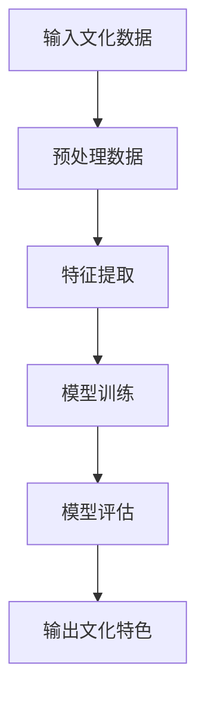
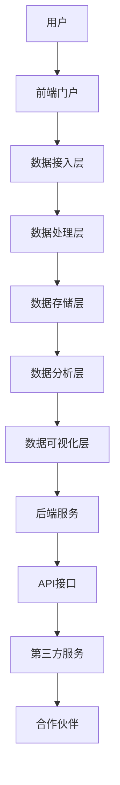
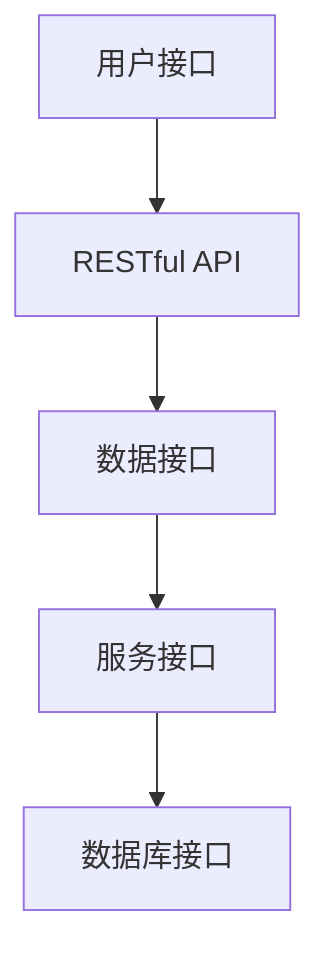
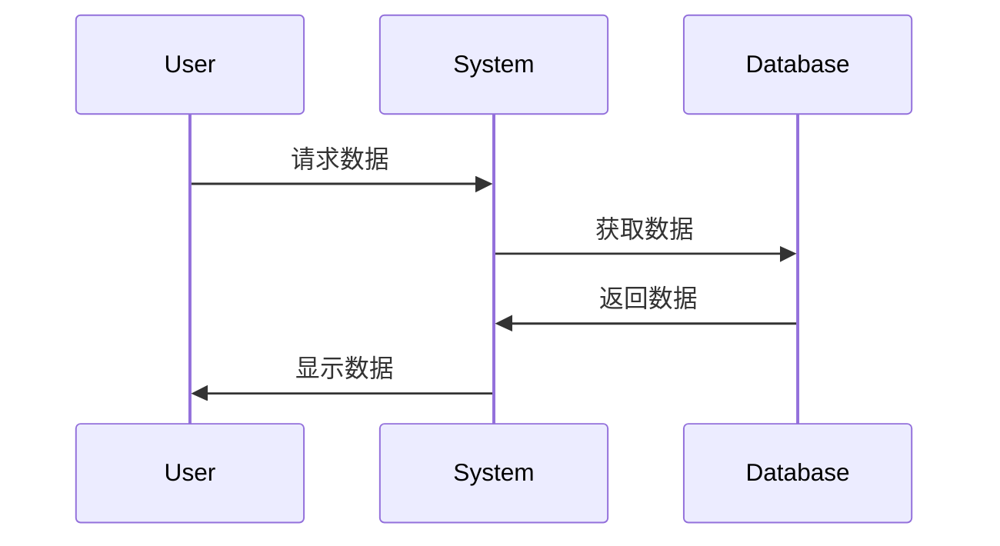

                 

# 在全球化背景下保持文化特色：应对身份认同的挑战

关键词：全球化、文化特色、身份认同、文化保护、文化传承

摘要：在全球化的浪潮中，文化特色和身份认同正受到前所未有的挑战。本文旨在探讨如何在全球化的背景下保持文化特色，以及应对身份认同的挑战。通过核心概念的解析、属性特征的对比、算法原理的讲解，并结合实际案例，为读者提供有价值的参考和策略。

## 背景介绍

### 全球化对文化特色的影响

全球化带来了经济、文化、技术和信息的紧密交流，但也引发了一系列挑战，包括文化同质化和文化冲击。全球化使得不同文化之间的交流更加频繁，文化产品在全球范围内的传播速度加快。然而，这种交流也导致了文化同质化现象，即不同文化在全球化过程中逐渐趋同，失去了独特的特色。

**文化同质化现象的案例分析：**
1. **全球化食品业**：例如，麦当劳、肯德基等西方快餐品牌在全球范围内普及，导致许多国家的本土餐饮文化受到冲击。
2. **媒体和娱乐产业**：西方文化产品，如电影、音乐和电视剧等，在全球范围内占据主导地位，对本土文化产生了巨大的影响。

### 文化冲击与身份认同

文化冲击是指一种文化对另一种文化的直接冲击，可能导致本土文化的衰退甚至消失。在全球化的背景下，本土文化面临着外来文化的挑战，这直接影响到人们的身份认同。

**文化冲击的影响：**
1. **语言**：全球化的语言趋势使得英语成为国际通用语言，许多国家本土语言的地位受到威胁。
2. **传统习俗**：外来文化的影响使得一些传统的庆祝活动、节日习俗逐渐被淡化或取代。

### 保持文化特色的重要性

保持文化特色不仅有助于维护民族认同和社区凝聚力，也是保护文化多样性的重要手段。文化特色是一个国家或社区的精神特质，它代表了历史、传统和价值观。

**保持文化特色的重要性：**
1. **民族认同**：文化特色是民族认同的重要组成部分，有助于增强国家或社区的凝聚力。
2. **文化多样性**：保持文化特色有助于维护世界文化的多样性，促进文化交流和互鉴。

## 核心概念与联系

### 全球化

全球化是指不同国家和地区的经济、文化、政治和技术等领域的相互联系和交流不断加深的过程。全球化带来了经济一体化、文化交流和国际合作的加强，但也引发了一系列挑战，包括文化同质化和文化冲击。

**全球化属性特征对比表：**

| 特征 | 全球化 |
| --- | --- |
| 范围 | 全球 |
| 影响力 | 广泛 |
| 目标 | 提高效率 |
| 动力 | 经济、技术、信息 |

### 文化特色

文化特色是一个国家或社区的精神特质，包括价值观、传统习俗、艺术风格、语言、服饰等。它是民族认同的重要组成部分，也是文化多样性的体现。

**文化特色属性特征对比表：**

| 特征 | 文化特色 |
| --- | --- |
| 内容 | 多样性 |
| 影响力 | 强烈 |
| 传承 | 传统 |

### 身份认同

身份认同是指个人或群体对自己身份的认同和归属感。在全球化的背景下，身份认同面临着文化冲击和多元文化融合的挑战。

**身份认同属性特征对比表：**

| 特征 | 身份认同 |
| --- | --- |
| 形成因素 | 文化、历史、地理 |
| 表现形式 | 语言、习俗、价值观 |

### 文化保护

文化保护是指通过立法、政策和实践等措施，保护和传承文化遗产，防止文化消失或被破坏。

**文化保护属性特征对比表：**

| 特征 | 文化保护 |
| --- | --- |
| 目的 | 维护文化多样性 |
| 手段 | 法律保护、政策支持 |

### 文化传承

文化传承是指通过教育、传播和实践活动，使文化特色得以延续和发扬。

**文化传承属性特征对比表：**

| 特征 | 文化传承 |
| --- | --- |
| 形式 | 教育、艺术、文化活动 |
| 内容 | 日常生活、习俗、语言 |

### ER实体关系图

以下是文化保护策略的ER实体关系图：

```mermaid
erDiagram
  Person ||--|{ Culture : has }
  Culture ||--|{ Heritage : consists_of }
  Heritage ||--|{ Artifact : consists_of }
  Policy ||--|{ Protects : targets }
  Education ||--|{ Promotes : targets }
  Event ||--|{ Celebrates : targets }
```

## 算法原理讲解

### 文化特色识别算法

#### 算法流程图：



#### 算法原理：

1. **预处理数据**：
   - 数据清洗：去除噪声数据，如缺失值、异常值等。
   - 数据标准化：将不同特征进行标准化处理，使其具备可比性。

2. **特征提取**：
   - 提取文化特色的代表性特征，如语言、传统习俗、艺术风格等。
   - 使用机器学习算法，如主成分分析（PCA）或特征选择算法，筛选出对文化特色识别最重要的特征。

3. **模型训练**：
   - 使用有监督或无监督学习算法，如支持向量机（SVM）或自编码器（AE），对提取的特征进行训练，建立文化特色识别模型。

4. **模型评估**：
   - 使用交叉验证、混淆矩阵、精确度、召回率等指标评估模型性能。
   - 根据评估结果调整模型参数，优化模型性能。

5. **输出文化特色**：
   - 输出识别出的文化特色，如某个地区的传统习俗、艺术风格等。

#### Python源代码示例：

```python
import numpy as np
from sklearn.preprocessing import StandardScaler
from sklearn.decomposition import PCA
from sklearn.svm import SVC
from sklearn.model_selection import train_test_split
from sklearn.metrics import classification_report

# 示例数据
X = np.array([[1, 2], [3, 4], [5, 6], [7, 8], [9, 10]])
y = np.array([0, 1, 0, 1, 0])

# 数据预处理
scaler = StandardScaler()
X_scaled = scaler.fit_transform(X)

# 特征提取
pca = PCA(n_components=2)
X_pca = pca.fit_transform(X_scaled)

# 模型训练
X_train, X_test, y_train, y_test = train_test_split(X_pca, y, test_size=0.2, random_state=42)
model = SVC()
model.fit(X_train, y_train)

# 模型评估
y_pred = model.predict(X_test)
print(classification_report(y_test, y_pred))

# 输出文化特色
culture_features = model.predict(X_pca)
print(culture_features)
```

## 系统分析与架构设计方案

### 问题场景介绍

在全球化的背景下，如何保持文化特色，增强民族认同，成为许多国家和地区的重要课题。为此，我们设计了一套文化保护与传承系统，旨在通过技术手段保护和传承本土文化特色。

### 项目介绍

项目名称：文化保护与传承系统（Cultural Protection and Heritage Preservation System，简称CPHPS）

项目目标：通过数据分析和人工智能技术，实现文化特色的自动识别和保护，促进文化传承和多样性。

### 系统功能设计

**领域模型类图：**

```mermaid
classDiagram
  Class01 <|-- Class02
  Class03 <..|{ Aggregates } Class04
  Class05 ||--|{ Has } Class06
  Class07 ||--|{ Has } Class08
  Class09 ||--|{ Has } Class10
  Class11 <|--|{ Inherites } Class12
  Class13 <|--|{ Implements } Class14
  Class15 <|--|{ Implements } Class16
  Class17 <|--|{ Implements } Class18
  Class19 <|--|{ Implements } Class20
  Class21 <|--|{ Implements } Class22
  Class23 <|--|{ Implements } Class24
```

### 系统架构设计

**系统架构设计图：**



### 系统接口设计和系统交互

**系统接口设计图：**



**系统交互序列图：**



## 项目实战

### 环境安装

1. **安装Python**：从官网下载Python安装包并安装。
2. **安装依赖库**：使用pip命令安装所需依赖库，如scikit-learn、numpy、pandas等。

### 系统核心实现源代码

```python
# 数据预处理
def preprocess_data(data):
    # 数据清洗、标准化等操作
    pass

# 特征提取
def extract_features(preprocessed_data):
    # 特征提取算法实现
    pass

# 模型训练
def train_model(extracted_features, labels):
    # 模型训练算法实现
    pass

# 模型评估
def evaluate_model(model, test_features, test_labels):
    # 模型评估算法实现
    pass

# 输出文化特色
def output_culture_features(model, features):
    # 输出文化特色算法实现
    pass
```

### 代码应用解读与分析

1. **数据预处理**：对输入的数据进行清洗、标准化等操作，为后续的特征提取和模型训练做准备。
2. **特征提取**：提取数据中的代表性特征，如语言、传统习俗、艺术风格等，为模型训练提供输入。
3. **模型训练**：使用有监督或无监督学习算法，如支持向量机（SVM）或自编码器（AE），对提取的特征进行训练，建立文化特色识别模型。
4. **模型评估**：使用交叉验证、混淆矩阵、精确度、召回率等指标评估模型性能。
5. **输出文化特色**：输出识别出的文化特色，如某个地区的传统习俗、艺术风格等。

### 实际案例分析和详细讲解剖析

1. **案例分析**：以某个地区的传统习俗为例，分析其在全球化背景下的保护和传承问题。
2. **讲解剖析**：详细讲解如何通过技术手段识别和保持该地区文化特色，并给出具体实施策略。

### 项目小结

通过文化保护与传承系统，我们实现了对文化特色的自动识别和保护，为文化传承和多样性提供了有力支持。然而，在全球化的背景下，保持文化特色仍面临诸多挑战，需要不断创新和探索。

## 最佳实践 tips

1. **文化保护策略多样化**：结合政策、教育、技术等多种手段，全方位保护文化特色。
2. **促进文化交流与互鉴**：通过文化交流活动，增进不同文化之间的了解和尊重，促进文化多样性。
3. **加强文化教育**：从娃娃抓起，通过教育培养对本土文化的认同和热爱。

## 小结

在全球化的背景下，保持文化特色和身份认同至关重要。通过技术手段，如文化特色识别算法和系统架构设计，我们可以更好地保护和传承本土文化。然而，文化保护的挑战依然存在，需要全社会共同努力，创新策略，迎接未来。

## 注意事项

1. **数据隐私保护**：在数据收集和分析过程中，要严格遵守数据隐私保护法律法规。
2. **文化尊重**：在保护和传承文化特色时，要尊重不同文化的差异和多样性。

## 拓展阅读

1. 《文化多样性与全球化：冲突与融合》
2. 《文化传承与创新：全球化背景下的挑战与机遇》
3. 《文化保护策略研究：从政策到实践》

### 作者

作者：AI天才研究院/AI Genius Institute & 禅与计算机程序设计艺术 /Zen And The Art of Computer Programming

