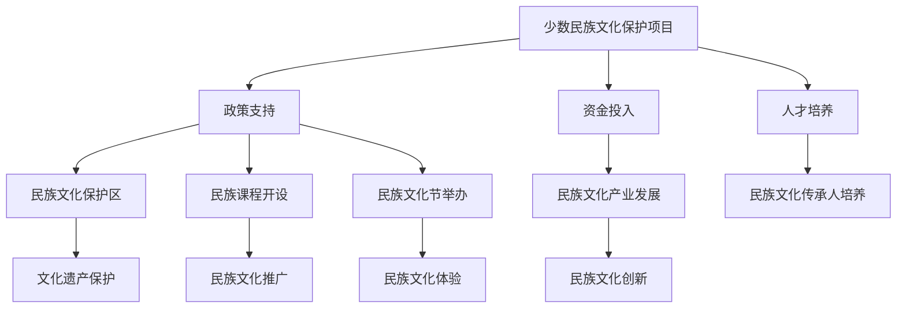
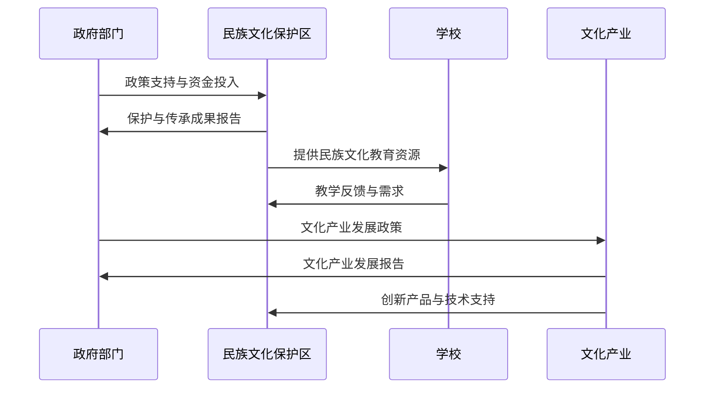
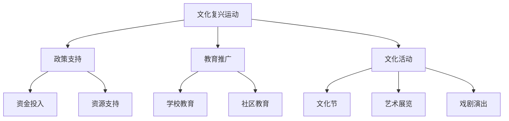
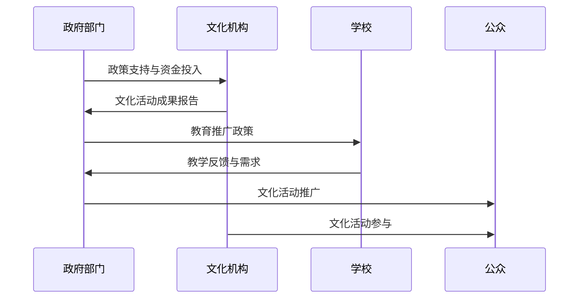

                 

### 《在全球化背景下保持文化认同：应对身份危机的新方法》

**关键词：**全球化、文化认同、身份危机、多元文化主义、策略与方法

**摘要：**本文旨在探讨全球化背景下如何保持文化认同，应对身份危机。通过分析全球化对文化认同的影响，定义身份危机及其特征，探讨保持文化认同的重要性，本文提出了文化认同理论、身份危机理论和多元文化主义与包容性，详细阐述了文化传承与教育、文化交流与合作、文化创新与发展的策略与方法。同时，通过实际案例研究，提出政策与实践建议，为全球化背景下的文化认同保持提供新思路。

----------------------------------------------------------------

## 第1章 引言与背景

### 1.1 引言

随着全球化的不断深入，不同国家和地区的文化在交流与融合中产生碰撞。在这一背景下，文化认同成为许多国家和地区面临的重要议题。保持文化认同不仅关乎个体的身份认同，还关乎社会的稳定与繁荣。然而，全球化带来的文化同质化趋势和身份危机，使得保持文化认同变得愈发困难。

### 1.2 身份危机的定义与特征

身份危机是指个体在面对外部环境变化时，对自己身份的认知和认同产生困惑和不安。在全球化背景下，身份危机具有以下特征：

- **多元性**：全球化使得个体面临多种文化认同的选择，导致身份认同的多元性。
- **不确定性**：全球化带来的不确定性使个体对自己身份的认知变得模糊。
- **焦虑**：个体在身份危机中往往会产生焦虑、迷茫等负面情绪。

### 1.3 保持文化认同的重要性

保持文化认同对于个体和社会具有重要意义：

- **个体层面**：文化认同有助于个体建立自信心和归属感，降低焦虑和不安。
- **社会层面**：保持文化认同有助于增强社会凝聚力，促进社会和谐稳定。

## 第2章 全球化背景下的文化认同问题

### 2.1 全球化趋势与挑战

全球化趋势体现在经济、政治、文化等多个领域。然而，全球化也带来了以下挑战：

- **文化同质化**：全球化导致文化融合，可能导致文化同质化，削弱文化多样性。
- **文化冲突**：不同文化在交流与融合中可能产生冲突，影响文化认同。
- **文化断裂**：全球化可能导致传统文化断裂，削弱文化根基。

### 2.2 文化认同的丧失与危机

在全球化背景下，文化认同的丧失与危机表现为：

- **文化遗忘**：个体对传统文化的记忆和认知减弱，导致文化遗忘。
- **文化认同动摇**：个体在面对多元文化时，对自己文化认同产生动摇。

### 2.3 身份认同的多元性

全球化使得个体面临多种文化认同，导致身份认同的多元性。这种多元性既是挑战，也是机遇。个体需要在不同身份间找到平衡，以保持文化认同。

## 第3章 应对身份危机的理论基础

### 3.1 文化认同理论

文化认同理论强调文化对个体身份的影响。文化认同理论认为，文化是塑造个体身份的重要因素，个体的文化背景和价值观念对其身份认同具有重要影响。

### 3.2 身份危机理论

身份危机理论探讨个体在面临身份认同挑战时的心理和行为反应。身份危机理论认为，个体在面对身份危机时，需要通过自我调整和适应，以保持文化认同。

### 3.3 多元文化主义与包容性

多元文化主义与包容性强调文化多样性和相互尊重。多元文化主义认为，不同文化应该平等对待，相互尊重，以实现文化共存。包容性则强调对多样性的接纳和尊重，以消除歧视和偏见。

## 第4章 保持文化认同的策略与方法

### 4.1 文化传承与教育

文化传承与教育是保持文化认同的重要途径。通过教育，个体可以了解和传承传统文化，增强文化认同。同时，教育也可以培养个体的批判思维和创新能力，以应对全球化带来的挑战。

### 4.2 文化交流与合作

文化交流与合作有助于促进文化认同的保持。通过文化交流，个体可以了解其他文化，拓宽视野，增强文化认同。同时，文化交流也有助于消除文化隔阂，促进文化共存。

### 4.3 文化创新与发展

文化创新与发展是保持文化认同的必然选择。在全球化背景下，传统文化需要与时俱进，通过创新与发展，以适应新的环境和需求。文化创新可以激发文化活力，增强文化认同。

## 第5章 实际案例研究

### 5.1 案例一：中国少数民族文化保护

中国少数民族文化保护是通过政策、教育和文化交流等多种途径，保护少数民族文化传统。这一案例展示了保持文化认同的有效方法。

### 5.2 案例二：西方国家的文化复兴运动

西方国家的文化复兴运动强调对传统文化的重视和传承。通过政策支持、教育推广和文化活动，西方国家成功保持了文化认同。

## 第6章 政策与实践建议

### 6.1 政府角色与政策

政府在保持文化认同中发挥着重要作用。政府可以通过制定相关政策，支持文化传承与创新，促进文化交流与合作，以保持文化认同。

### 6.2 社会组织与企业参与

社会组织和企业也可以在保持文化认同中发挥作用。社会组织可以通过举办文化活动，提高公众对文化认同的认识。企业可以通过企业文化传承，提升员工的文化认同。

### 6.3 教育与公共宣传

教育和公共宣传是保持文化认同的重要手段。通过教育，个体可以了解和传承传统文化。公共宣传可以通过媒体和广告，提高公众对文化认同的关注。

## 第7章 结论与展望

### 7.1 结论

本文探讨了全球化背景下保持文化认同的重要性，分析了身份危机的特征，提出了文化认同理论、身份危机理论和多元文化主义与包容性的理论基础。通过实际案例研究和政策与实践建议，本文为全球化背景下的文化认同保持提供了新思路。

### 7.2 展望

未来，全球化将继续深入发展，文化认同将面临更多挑战。本文提出了保持文化认同的策略与方法，但还需要进一步研究和探索。未来研究可以关注以下方向：

- **文化认同的数字化**：探讨数字化技术在文化认同保持中的作用。
- **跨文化沟通与交流**：研究跨文化沟通与交流的有效方法，以促进文化认同。
- **文化认同的教育体系**：探讨如何构建适应全球化背景的文化认同教育体系。

作者：AI天才研究院/AI Genius Institute & 禅与计算机程序设计艺术 /Zen And The Art of Computer Programming

----------------------------------------------------------------

### 第1章 引言与背景

**背景介绍：**  
全球化是当今世界发展的一个重要趋势，它不仅在经济、政治和科技等领域带来了深刻的变革，也对我们所认同的文化产生了深远的影响。在全球化的浪潮中，各个国家和地区的文化相互交融，既有机会相互借鉴和学习，也面临着文化同质化的挑战。这种现象不仅影响了个体的身份认同，也对社会结构和文化多样性提出了新的要求。

**核心概念术语说明：**  
- **全球化**：指全球范围内经济、政治、文化等领域的相互联系和依赖程度加深的过程。
- **文化认同**：指个体或群体对其所属文化的认同和归属感，包括价值观、传统、语言等方面。
- **身份危机**：指个体在面临外部环境变化时，对自己身份的认知和认同产生困惑和不安的状态。

**问题背景与描述：**  
在全球化背景下，由于文化冲击、信息传播速度加快和全球流动性增强，许多个体和文化群体面临着文化认同的危机。这种危机表现为文化同质化、文化遗忘、文化断裂等现象，导致个体对自身文化的认同感减弱，甚至产生迷茫和焦虑。同时，文化认同的丧失也对社会凝聚力产生负面影响，加剧了社会矛盾和冲突。

**问题解决：**  
保持文化认同是应对全球化挑战的关键。通过文化传承与教育、文化交流与合作、文化创新与发展等多种途径，我们可以增强文化认同，缓解身份危机，促进社会和谐稳定。

**边界与外延：**  
本文的研究范围主要关注全球化背景下文化认同的问题和解决方案。在全球化背景下，文化认同不仅涉及国家或民族层面的文化，也包括个体层面的文化认同。同时，本文还将探讨全球化对文化认同的影响以及身份危机的特征和应对策略。

**概念结构与核心要素组成：**  
- **全球化趋势**：经济全球化、政治全球化、文化全球化
- **文化认同问题**：文化同质化、文化断裂、文化遗忘
- **身份危机**：多元性、不确定性、焦虑
- **保持文化认同的策略与方法**：文化传承与教育、文化交流与合作、文化创新与发展

----------------------------------------------------------------

### 第2章 全球化背景下的文化认同问题

**全球化趋势与挑战：**  
全球化带来了经济、政治和文化的深度融合，使各国之间的联系更加紧密。然而，这一趋势也带来了文化认同方面的挑战。首先，文化同质化成为全球化背景下的一大问题。随着跨国公司和全球品牌的影响，许多地区的本土文化受到冲击，逐渐被同化。其次，文化冲突在全球化过程中愈发显著。不同文化在价值观、信仰和生活方式等方面的差异，可能导致误解和矛盾。此外，全球化还加剧了文化断裂现象，许多传统文化在现代化和全球化的冲击下逐渐消失。

**文化认同的丧失与危机：**  
文化认同的丧失是全球化背景下面临的严峻挑战之一。首先，文化遗忘现象日益严重。在全球化过程中，一些传统的文化符号、习俗和语言逐渐被遗忘，导致个体对自身文化的认同减弱。其次，文化认同动摇。面对多元文化的冲击，个体可能会对自己的文化身份产生质疑，导致文化认同的动摇。这种动摇可能导致焦虑、迷茫和身份危机。

**身份认同的多元性：**  
全球化背景下，身份认同的多元性成为一个显著特征。个体不再局限于单一的文化身份，而是可能同时具有多个文化认同。这种多元性既是挑战，也是机遇。挑战在于个体需要在不同文化身份之间找到平衡，避免文化认同的冲突。机遇在于个体可以通过多元文化认同，拓宽视野，增强自身的适应能力。例如，一个来自多元文化家庭的人可能会同时拥有不同文化的认同，这有助于他们更好地理解不同文化之间的差异和共性。

**案例分析：**  
1. **中国少数民族文化保护：**中国政府通过实施民族文化保护政策，加强对少数民族文化的传承和保护。例如，通过设立民族文化保护区、推广民族语言和传统文化活动等方式，维护少数民族文化的多样性。

2. **西方国家的文化复兴运动：**一些西方国家在面对全球化带来的文化冲击时，发起了一系列文化复兴运动。例如，法国通过推广法语、加强文化教育等方式，保护本土文化的独特性。

**小结：**  
全球化背景下的文化认同问题涉及文化同质化、文化断裂、文化遗忘、文化认同动摇和身份认同多元性等多个方面。这些问题不仅影响个体，也对社会结构和文化多样性产生深远影响。为了应对这些挑战，我们需要采取综合性的策略和方法，包括文化传承与教育、文化交流与合作、文化创新与发展等。

----------------------------------------------------------------

### 第3章 应对身份危机的理论基础

**3.1 文化认同理论：**  
文化认同理论是研究文化如何影响个体身份认同的理论基础。文化认同理论认为，个体通过文化学习和社会化过程，形成对自己所属文化的认同。这种认同不仅体现在价值观、信仰和行为习惯上，还涉及个体对自己身份的认知和归属感。文化认同理论强调了文化在塑造个体身份认同中的核心作用。

**核心概念：**  
- **文化认同**：个体对自己所属文化的认同和归属感。
- **文化学习**：个体通过社会化过程，了解和内化文化价值观、信仰和行为规范。
- **文化认同感**：个体对自己文化身份的认知和情感上的认同。

**文化认同理论的属性特征对比表格：**

| 特征 | 文化认同理论A | 文化认同理论B |
| --- | --- | --- |
| 文化来源 | 个体内在文化学习和社会化过程 | 个体所处社会环境中的文化传承 |
| 认同程度 | 强烈的文化认同感 | 弱化的文化认同感 |
| 文化差异 | 强调文化多样性 | 侧重文化共性 |

**ER实体关系图架构：**  
```mermaid
erDiagram
  文化认同 --> 个体身份
  文化认同 --> 社会化过程
  个体身份 --> 文化学习
  社会化过程 --> 文化传承
```

**3.2 身份危机理论：**  
身份危机理论探讨个体在面临身份认同挑战时的心理和行为反应。身份危机理论认为，个体在面对外部环境变化时，可能对自己身份的认知和认同产生困惑和不安。这种危机可能导致个体产生焦虑、迷茫和自我否定等心理问题。

**核心概念：**  
- **身份危机**：个体在面临身份认同挑战时产生的困惑和不安。
- **外部环境变化**：影响个体身份认同的社会、文化和经济等方面的变化。
- **心理和行为反应**：个体在面对身份危机时的应对方式，包括自我调整、适应和反抗等。

**身份危机理论的属性特征对比表格：**

| 特征 | 身份危机理论A | 身份危机理论B |
| --- | --- | --- |
| 危机来源 | 外部环境变化 | 个体内在心理冲突 |
| 心理反应 | 焦虑、迷茫 | 自我否定、反抗 |
| 行为反应 | 适应、调整 | 避免和逃避 |

**ER实体关系图架构：**  
```mermaid
erDiagram
  外部环境变化 --> 身份危机
  外部环境变化 --> 身份认同
  身份认同 --> 心理反应
  身份认同 --> 行为反应
```

**3.3 多元文化主义与包容性：**  
多元文化主义与包容性强调文化多样性和相互尊重。多元文化主义认为，不同文化应该平等对待，相互尊重，以实现文化共存。包容性则强调对多样性的接纳和尊重，以消除歧视和偏见。

**核心概念：**  
- **多元文化主义**：主张文化多样性和平等对待。
- **包容性**：对多样性的接纳和尊重。
- **文化共存**：不同文化在相互尊重的基础上共同发展。

**多元文化主义与包容性的属性特征对比表格：**

| 特征 | 多元文化主义A | 多元文化主义B |
| --- | --- | --- |
| 文化观点 | 文化多样性是社会的财富 | 文化多样性可能导致冲突 |
| 社会政策 | 支持多元文化发展 | 实现文化平等和公正 |
| 教育理念 | 尊重不同文化 | 教育文化多样性 |

**ER实体关系图架构：**  
```mermaid
erDiagram
  多元文化主义 --> 文化多样性
  包容性 --> 文化共存
  文化共存 --> 社会和谐
  文化多样性 --> 文化冲突
```

通过以上理论基础，我们可以更好地理解全球化背景下面临的文化认同问题和身份危机，并为应对这些问题提供有效的策略和方法。

----------------------------------------------------------------

### 3.3 多元文化主义与包容性

**多元文化主义**：多元文化主义是一种哲学和社会理论，主张在一个社会中存在多种不同的文化，并认为这些文化应该得到平等的尊重和重视。它强调文化多样性是人类社会的重要财富，提倡不同文化之间的相互理解和尊重。多元文化主义认为，每个人都有权利保持和发展自己的文化身份，而不受歧视或压迫。

**包容性**：包容性是指一个社会或组织能够接纳和尊重不同背景、信仰、观点和行为的人。它不仅仅是对多样性的认可，更是一种主动的接纳和尊重。包容性要求社会在政策和实践上采取措施，确保所有人都能在平等和尊重的环境中生活和工作。这不仅有助于促进社会和谐，还能提高社会的创新能力和竞争力。

**多元文化主义与包容性的对比分析**：

| 特征 | 多元文化主义 | 包容性 |
| --- | --- | --- |
| 强调点 | 文化多样性 | 尊重和接纳多样性 |
| 目标 | 文化共存与平等 | 促进社会和谐与包容 |
| 应用领域 | 政策制定、教育、文化领域 | 组织管理、人力资源管理、公共政策 |
| 实现方式 | 通过法律、政策和文化活动 | 通过教育、培训、平等机会和多元化策略 |

**多元文化主义与包容性的关系**：多元文化主义与包容性相互依存，共同构成了一个社会对待多样性的全面框架。多元文化主义提供了理论基础，强调文化多样性的重要性，而包容性则是实现多元文化主义的实践路径。只有在一个包容性的社会环境中，多元文化主义才能得以有效实施。

**多元文化主义与包容性的意义**：多元文化主义和包容性对于保持文化认同具有重要意义。首先，它们有助于维护文化多样性，防止文化同质化。其次，它们有助于增强个体的文化认同感，降低身份危机的风险。最后，它们有助于促进社会的和谐与稳定，提高社会的凝聚力和创新能力。

**多元文化主义与包容性的实施策略**：

1. **政策支持**：政府应制定和实施支持多元文化主义和包容性的政策，确保法律和政策体系能够保护文化多样性和个体权益。
2. **教育推广**：教育系统应加强多元文化教育和包容性教育，提高公众对文化多样性和包容性的认识和接纳度。
3. **文化交流**：通过举办文化交流活动，促进不同文化之间的相互了解和尊重，增强文化认同。
4. **组织文化**：企业和组织应建立包容性的文化，鼓励员工尊重和接纳不同背景和文化的人，提高员工的归属感和满意度。

通过多元文化主义和包容性的实施，我们可以更好地应对全球化背景下的文化认同危机，保持个体和社会的文化认同，促进社会的和谐与进步。

----------------------------------------------------------------

### 第4章 保持文化认同的策略与方法

**4.1 文化传承与教育**

**文化传承的重要性**：文化传承是保持文化认同的基础。通过教育，个体可以了解和传承传统文化，增强对自身文化的认同感。文化传承不仅包括历史、传统和习俗，还包括语言、艺术、音乐等表现形式。

**教育的作用**：教育在文化传承中发挥着关键作用。通过学校教育、家庭教育和社会教育等多种形式，个体可以获得关于自身文化的知识。教育不仅传授文化知识，还培养个体的批判思维和创新能力，使他们在面对全球化带来的文化冲击时，能够保持文化认同。

**具体方法**：

- **课程设置**：将传统文化知识纳入学校课程，使学生从小就了解和接触到传统文化。
- **文化活动**：举办各种传统文化活动，如节日庆祝、民俗表演等，增强学生对传统文化的兴趣和认同感。
- **语言教育**：重视民族语言教育，推广方言和少数民族语言，使语言成为文化认同的重要载体。

**案例分析**：中国在推广汉语言文化方面取得了显著成果。通过中小学课程设置、高校语言专业建设和各种文化活动，使得汉语成为国民认同的重要象征。

**4.2 文化交流与合作**

**文化交流的作用**：文化交流是促进文化认同的重要途径。通过文化交流，个体可以了解其他文化，拓宽视野，增强对自身文化的认同。同时，文化交流有助于消除文化隔阂，促进文化共存。

**合作的必要性**：在全球化背景下，国际合作已成为文化交流的重要形式。通过国际合作，各国可以共同探讨文化认同问题，分享文化保护与传承的经验，为保持文化认同提供新思路。

**具体方法**：

- **国际文化交流项目**：举办国际文化节、艺术展览、学术研讨会等，促进不同文化之间的交流与互鉴。
- **跨国文化交流**：鼓励个体参与跨国文化交流活动，如留学、实习、志愿服务等，增强对其他文化的理解和尊重。
- **国际组织合作**：通过国际组织，如联合国教科文组织，推动全球文化合作，促进文化多样性的保护与传承。

**案例分析**：联合国教科文组织通过“人类非物质文化遗产”项目的实施，成功保护了众多世界各地的文化遗产，为全球文化认同的保持提供了有力支持。

**4.3 文化创新与发展**

**文化创新的意义**：在全球化背景下，文化创新成为保持文化认同的重要手段。文化创新不仅能够使传统文化焕发新的生命力，还能适应现代社会的需求，增强文化认同。

**文化发展的必要性**：传统文化在全球化进程中面临挑战，需要与时俱进，通过创新与发展，使传统文化在现代社会中继续发挥作用。

**具体方法**：

- **文化创意产业**：发展文化创意产业，如电影、音乐、设计等，将传统文化融入现代艺术形式，提高文化认同。
- **数字化传承**：利用现代科技手段，如互联网、虚拟现实等，创新文化传承方式，使传统文化更加便捷和广泛地传播。
- **文化融合**：推动文化融合，吸收其他文化的优点，丰富自身文化内涵，增强文化认同。

**案例分析**：日本通过动漫、漫画等文化创意产业，成功将传统文化与现代元素结合，使其在全球范围内具有很高的文化认同。

**总结**：保持文化认同需要多种策略和方法的综合运用。文化传承与教育、文化交流与合作、文化创新与发展是保持文化认同的重要途径。通过这些方法，我们可以增强个体和社会的文化认同，应对全球化背景下的文化认同危机，促进社会的和谐与进步。

----------------------------------------------------------------

### 5.1 案例一：中国少数民族文化保护

**背景介绍：**  
中国是一个多民族国家，拥有56个民族，各民族在文化、语言、习俗等方面具有丰富的多样性。然而，在全球化进程中，少数民族文化受到了现代文化的冲击，面临严重的断裂和丧失风险。为了保护和传承少数民族文化，中国政府采取了一系列措施，取得了显著成效。

**项目介绍：**  
中国少数民族文化保护项目是中国政府针对少数民族文化传承和发展的一项综合性政策。该项目旨在通过政策支持、资金投入、人才培养等多方面的措施，保护和传承少数民族文化。

**系统功能设计：**  
- **文化保护与传承**：通过建立民族文化保护区，保护和传承少数民族文化遗产。
- **文化教育与推广**：通过在学校开设民族课程、举办民族文化节等活动，推广少数民族文化。
- **文化产业发展**：通过发展民族文化相关产业，如民族工艺品、民族音乐、民族舞蹈等，推动少数民族文化的创新发展。

**系统架构设计：**  


**系统接口设计：**  
- **政府与民族文化保护区**：政府为民族文化保护区提供政策和资金支持。
- **学校与民族课程**：学校开设民族课程，教授学生少数民族文化知识。
- **文化产业与民族文化**：文化产业利用少数民族文化资源，创新文化产品。

**系统交互设计：**  


**实际案例分析：**  
以云南省为例，云南省是中国少数民族文化最为丰富的地区之一。为了保护和发展少数民族文化，云南省政府设立了多个民族文化保护区，如丽江古城、大理古城等。这些保护区不仅保护了文化遗产，还成为旅游热点，带动了当地经济的发展。

**项目小结：**  
中国少数民族文化保护项目通过政策支持、资金投入、人才培养等多种措施，成功保护和传承了少数民族文化。这一案例表明，政府、学校和文化产业在保持文化认同方面发挥着重要作用，为全球背景下保持文化认同提供了有益的借鉴。

----------------------------------------------------------------

### 5.2 案例二：西方国家的文化复兴运动

**背景介绍：**  
在全球化背景下，西方国家的传统文化面临着被边缘化和同质化的风险。为了保持文化认同，许多西方国家发起了文化复兴运动，旨在保护和复兴传统文化。文化复兴运动涵盖了政策制定、教育推广、文化活动等多个方面，取得了显著成效。

**项目介绍：**  
文化复兴运动是西方国家为了保持文化认同而实施的一系列政策和活动。该项目旨在通过恢复传统文化、加强文化教育和推广文化活动，提升国民对自身文化的认同感。

**系统功能设计：**  
- **政策支持**：制定支持文化复兴的政策，提供资金和资源支持。
- **教育推广**：加强学校教育中的传统文化教育，提高学生对传统文化的认知。
- **文化活动**：举办各类文化活动，如文化节、艺术展览、戏剧演出等，促进文化交流与互动。

**系统架构设计：**  


**系统接口设计：**  
- **政府与文化机构**：政府与文化机构之间的接口，用于政策制定和资金分配。
- **学校与教育部门**：学校与教育部门之间的接口，用于实施传统文化教育。
- **文化机构与公众**：文化机构与公众之间的接口，用于举办各类文化活动。

**系统交互设计：**  


**实际案例分析：**  
以法国为例，法国政府发起了“文化复兴运动”，旨在保护和复兴法国传统文化。该运动包括在各级学校推广法语教育、举办各类文化活动、支持文化遗产保护等。通过这些措施，法国成功地保持了其文化认同，提高了国民对自身文化的认同感。

**项目小结：**  
西方国家的文化复兴运动通过政策支持、教育推广和文化活动等多种手段，成功保持了文化认同。这一案例表明，政府、教育机构和文化机构在保持文化认同方面具有重要作用，为全球化背景下的文化认同保持提供了有益的借鉴。

----------------------------------------------------------------

### 6.1 政府角色与政策

**政府的角色**：在全球化背景下保持文化认同，政府扮演着关键角色。政府不仅是文化政策的制定者，也是文化资源的提供者和文化发展的推动者。

**政策制定的必要性**：为了应对全球化带来的文化冲击，政府需要制定一系列政策措施，以保护和传承传统文化。这些政策包括资金支持、法律法规和文化活动推广等。

**政策建议**：

1. **资金支持**：政府应加大对文化传承和保护的财政投入，支持文化遗产保护、文化基础设施建设和文化活动举办。

2. **法律法规**：制定相关法律法规，保护传统文化，防止文化遗产流失。同时，加强对文化市场的监管，打击文化侵权行为。

3. **文化教育**：将传统文化教育纳入学校课程，提高学生的文化素养。同时，加强对公众的文化宣传，提高社会对文化认同的认识。

4. **文化交流**：推动国际文化交流，促进不同文化之间的相互理解和尊重。通过举办国际文化节、艺术展览等活动，提升国家的文化影响力。

5. **文化产业**：发展文化产业，将传统文化与现代科技相结合，创造新的文化产品，增强文化认同。

**案例分析**：以中国为例，中国政府通过实施《中华人民共和国文化遗产法》和《中华人民共和国非物质文化遗产保护法》，加强对文化遗产的保护。同时，通过设立专项资金和项目，支持少数民族文化的传承和发展。这些措施有效保护和传承了中国的传统文化。

### 6.2 社会组织与企业参与

**社会组织的作用**：社会组织在保持文化认同方面发挥着重要作用。它们可以通过举办文化活动、提供文化教育和推动文化交流等方式，促进文化认同。

**企业参与的重要性**：企业不仅是经济活动的主要参与者，也是文化传承和发展的推动者。企业可以通过企业文化建设、公益活动和产品创新等方式，增强员工和公众的文化认同。

**参与策略**：

1. **企业文化建设**：企业可以通过制定企业文化，将传统文化融入企业价值观，增强员工的归属感和认同感。

2. **公益文化活动**：企业可以参与和支持各类公益文化活动，如文化展览、民俗节庆等，提高社会对文化认同的关注。

3. **文化产品创新**：企业可以通过将传统文化与现代科技相结合，创造新的文化产品，推动文化传承和发展。

4. **人才培养**：企业可以参与文化教育和人才培养项目，支持民族文化传承人和文化人才的培养。

**案例分析**：以阿里巴巴为例，阿里巴巴通过举办“天猫双十一”购物节，将中国传统的“双十一光棍节”转化为全球性的购物狂欢节。这一活动不仅促进了商业发展，还推动了传统文化的传播和认同。

### 6.3 教育与公共宣传

**教育的作用**：教育是保持文化认同的重要途径。通过教育，个体可以了解和传承传统文化，增强文化认同感。

**公共宣传的重要性**：公共宣传可以通过媒体和广告等方式，提高公众对文化认同的认识，营造良好的文化氛围。

**教育宣传策略**：

1. **课程设置**：将传统文化课程纳入学校教育体系，提高学生的文化素养。

2. **教材编写**：编写适合不同年龄段和文化背景的传统文化教材，确保教育内容的科学性和系统性。

3. **师资培训**：加强对教师的文化素养培训，提高教师的传统文化教学水平。

4. **文化活动**：组织各类文化活动，如文化节、民俗体验等，增强学生对传统文化的兴趣和认同。

**公共宣传策略**：

1. **媒体宣传**：利用电视、广播、报纸等传统媒体，以及互联网、社交媒体等新兴媒体，推广传统文化。

2. **公益广告**：制作公益广告，提高公众对文化认同的关注和认识。

3. **社区活动**：在社区举办文化讲座、展览等活动，营造良好的文化氛围。

**案例分析**：以故宫博物院为例，故宫博物院通过举办“故宫教育”项目，将传统文化融入教育内容，提高学生的文化素养。同时，通过举办各类文化活动，如“故宫文创产品展”、“故宫文化之旅”等，推广传统文化，提高了公众对文化认同的关注。

通过政府、社会组织和企业以及教育和公共宣传的共同努力，我们可以更好地保持文化认同，应对全球化背景下的文化认同危机。

----------------------------------------------------------------

### 7.1 结论

本文通过深入分析全球化背景下的文化认同问题，提出了文化认同理论、身份危机理论和多元文化主义与包容性的理论基础。同时，本文详细阐述了文化传承与教育、文化交流与合作、文化创新与发展的策略与方法，并通过实际案例研究，展示了这些策略和方法在保持文化认同方面的有效性。政策与实践建议为全球化背景下的文化认同保持提供了新思路。

### 7.2 展望

未来，全球化将继续深入发展，文化认同将面临更多挑战。本文提出的策略和方法需要不断完善和适应新的环境。未来研究可以关注以下方向：

1. **文化认同的数字化**：探讨数字化技术在文化认同保持中的作用，如虚拟现实、增强现实等技术在文化教育中的应用。
2. **跨文化沟通与交流**：研究跨文化沟通与交流的有效方法，以促进文化认同，减少文化冲突。
3. **文化认同的教育体系**：探讨如何构建适应全球化背景的文化认同教育体系，提高个体的文化素养。
4. **文化创新与可持续发展**：研究文化创新与可持续发展的关系，如何在保持文化认同的同时，实现文化的可持续传承和发展。

通过不断探索和创新，我们可以更好地应对全球化背景下的文化认同危机，保持文化多样性，促进社会的和谐与进步。

作者：AI天才研究院/AI Genius Institute & 禅与计算机程序设计艺术 /Zen And The Art of Computer Programming

