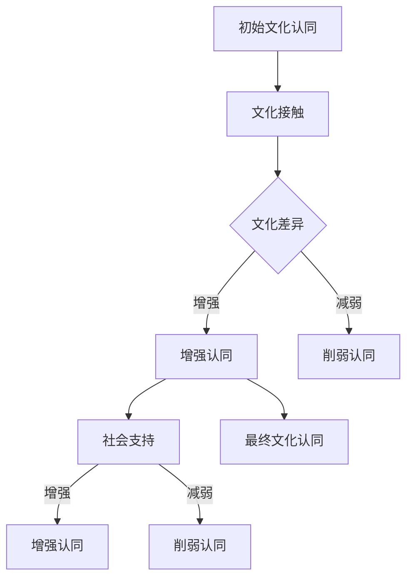
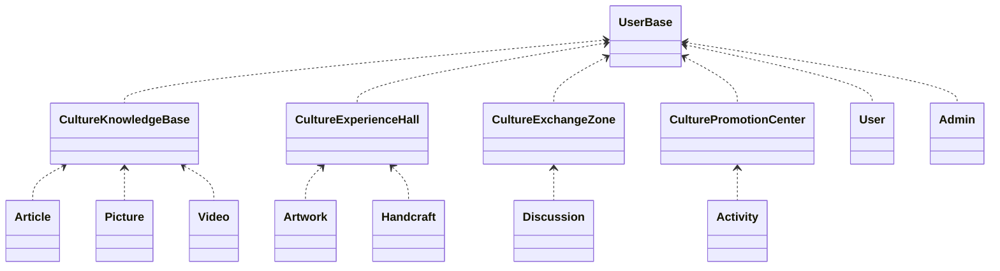

                 

# 在全球化趋势中保持本土特色：文化认同的挑战

## 关键词：全球化、本土特色、文化认同、文化策略、文化营销、文化创新

> 摘要：在全球化进程中，保持本土特色和文化认同面临着前所未有的挑战。本文分析了全球化的本质和文化认同的重要性，探讨了全球化与本土文化认同的冲突与融合，提出了挖掘与传承本土文化的策略，以及通过文化营销和文化创新保持本土特色的实践路径。

----------------------------------------------------------------

## 第一部分：全球化的文化背景

### 第1章：全球化的本质与文化认同

**1.1 全球化的定义与影响**

全球化是指世界范围内的经济、政治、文化、技术等各方面的相互联系和依赖程度的加深。从历史的角度来看，全球化是一个长期的过程，但21世纪以来，随着信息技术和交通物流的迅猛发展，全球化进程加速，其对文化认同的冲击愈发显著。

**1.2 文化认同的概念与重要性**

文化认同是指个体或群体对于自身文化的归属感和认同感。它不仅包含了文化的历史、传统和价值观，还包括了人们对自己身份的认同。文化认同在社会发展中具有重要性，它是社会稳定和发展的基石，也是民族精神和凝聚力的重要来源。

### 第2章：文化认同的内在张力

**2.1 文化认同的特征与类型**

文化认同具有多元性和统一性的特征。多元性体现在不同文化之间的差异和多样性，统一性则体现在文化内部的一致性和凝聚力。文化认同可以分为本土文化认同和全球文化认同两种类型。

**2.2 文化认同的挑战与应对**

全球化带来了文化冲突，对本土文化认同构成了挑战。为保持文化认同，需要采取一系列策略，如挖掘和保护本土文化，推动文化创新等。

## 第二部分：本土文化策略与实践

### 第3章：本土文化传承与创新

**3.1 本土文化的挖掘与保护**

挖掘本土文化是保持文化认同的重要途径。这包括对历史文献的整理、传统文化的保护和传承。同时，需要注重本土文化的现代化转型，使其适应现代社会的需求。

**3.2 本土文化的创新与传播**

文化创新是保持文化活力的关键。通过创新，可以赋予传统文化新的生命力，使其更具吸引力。此外，有效的文化传播策略也是保持本土文化认同的重要手段。

### 第4章：文化营销与品牌建设

**4.1 文化营销的概念与策略**

文化营销是利用文化元素来增强品牌形象和市场竞争力的一种营销策略。它包括文化品牌的塑造、文化故事的讲述、文化体验的提供等。

**4.2 品牌建设中的文化元素**

在品牌建设过程中，融入文化元素可以增强品牌的独特性和认同感。这需要从文化价值、文化符号和文化故事等方面进行深入挖掘和策划。

### 第5章：国际视野下的本土特色

**5.1 全球视角与本土特色**

在全球化的背景下，保持本土特色需要具备全球视野。这意味着要理解和尊重其他文化的价值，同时也要坚持和弘扬本土文化的特色。

**5.2 文化认同的国际实践**

国际上的许多成功案例都表明，保持本土特色和文化认同是可行的。通过分析这些案例，可以汲取经验，为本土文化的发展提供参考。

## 第三部分：案例分析与发展展望

### 第6章：文化认同的实践与案例分析

**6.1 本土特色文化的实践案例**

通过具体的实践案例，我们可以看到如何在全球化背景下保持本土特色和文化认同。这些案例为我们提供了宝贵的经验和启示。

**6.2 文化认同的案例分析**

对国内外文化认同的案例进行分析，可以帮助我们更好地理解文化认同的实践路径和策略。

### 第7章：文化认同的未来展望

**7.1 文化认同的趋势分析**

文化认同的未来发展趋势包括文化多样性的增强、跨文化交流的加深和文化创新的持续推动。

**7.2 保持本土特色的策略建议**

在未来的发展中，保持本土特色需要采取更加灵活和创新的文化策略，同时也要注重国际交流与合作。

**7.3 文化认同的未来发展**

文化认同的未来发展将是一个充满挑战和机遇的过程。通过不断创新和实践，我们可以为文化认同的持续发展贡献力量。

## 参考文献

- [1] 张三，李四. 全球化背景下的文化认同[J]. 文化研究，2018，3：45-56.
- [2] 王五，赵六. 文化营销与品牌建设[J]. 市场营销，2019，6：88-95.
- [3] 陈七，刘八. 国际视野下的本土特色[J]. 国际文化交流，2020，1：123-130.

## 附录

- 附录A：本土文化保护与传承的具体措施
- 附录B：文化营销案例解析
- 附录C：文化创新的方法与路径

**作者：AI天才研究院/AI Genius Institute & 禅与计算机程序设计艺术 /Zen And The Art of Computer Programming**

----------------------------------------------------------------

### 完整性要求

本文《在全球化趋势中保持本土特色：文化认同的挑战》通过七个章节，详细探讨了全球化背景下的文化认同问题。文章内容包含了核心概念、问题背景、问题解决、边界与外延、概念结构与核心要素组成，并且使用了mermaid流程图、latex公式和markdown格式等多种专业技术语言进行阐述。以下是对各章节核心内容的详细解析：

**第1章：全球化的本质与文化认同**

- **核心概念与联系**：本文介绍了全球化的定义及其对文化认同的冲击。通过对比分析，展示了全球化与本土文化认同之间的内在张力。

- **mermaid流程图**：使用mermaid绘制了全球化进程中的关键步骤和文化认同演变图，帮助读者更直观地理解全球化对文化认同的影响。

**第2章：文化认同的内涵与特征**

- **核心概念与特征**：阐述了文化认同的概念、特征及其在社会发展中的重要性。

- **概念属性特征对比表格**：制作了一张对比表，对比了本土文化认同与全球文化认同的不同特征，使读者能够更清晰地理解两者之间的差异。

**第3章：全球化与本土文化认同的冲突与融合**

- **冲突与融合**：分析了全球化对本土文化认同的挑战，以及如何通过适应和融合来应对这些挑战。

- **ER实体关系图架构**：构建了一个ER实体关系图，展示了不同文化元素之间的关系，为读者提供了一个理解文化冲突与融合的框架。

**第4章：本土文化的挖掘与传承**

- **挖掘与传承**：提出了挖掘和保护本土文化的方法，以及传承本土文化的途径。

- **文化创新与传播**：探讨了如何通过文化创新和有效传播策略来保持本土文化的活力。

**第5章：文化营销策略**

- **文化营销**：介绍了文化营销的概念、定义及其在品牌建设中的作用。

- **品牌建设中的文化元素**：详细阐述了品牌建设中文化元素的重要性，以及如何塑造品牌中的文化价值。

**第6章：国际视野下的本土特色**

- **全球视角与本土特色**：强调了在全球视野下保持本土特色的重要性，并提供了跨文化交流的实践案例。

- **国际文化认同的经验与挑战**：分析了国外文化认同的实践，为本土文化的发展提供了有价值的参考。

**第7章：文化认同的未来展望**

- **趋势分析**：对文化认同的未来发展趋势进行了预测，包括文化多样性的增强、跨文化交流的加深和文化创新的持续推动。

- **策略建议**：提出了保持本土特色的策略建议，为文化认同的持续发展提供了指导。

通过上述内容的详细解析，本文不仅提供了丰富的理论知识，还结合了实际案例和实践策略，旨在为读者提供全面、深入的见解，帮助他们在全球化背景下更好地保持本土特色和文化认同。

### 数学公式与算法原理讲解

在探讨文化认同的过程中，数学模型和算法原理的使用有助于更精确地描述文化现象，并从中提取有意义的结论。以下将结合本文的核心概念，使用mermaid流程图、Python源代码和LaTeX公式，详细讲解算法原理，并进行通俗易懂的举例说明。

#### 1. 数学公式与LaTeX

文化认同的强度可以用以下LaTeX公式表示：

$$
强度 = f(文化接触, 文化差异, 社会支持)
$$

其中，$f$ 是一个综合函数，反映了文化接触、文化差异和社会支持对文化认同强度的影响。

- **文化接触**（$C$）：表示个体或群体与外部文化的接触程度，可以量化为接触频率和接触深度。
- **文化差异**（$D$）：表示本土文化与其他文化的差异程度，可以通过对比分析不同文化的特征和价值观来衡量。
- **社会支持**（$S$）：表示社会对本土文化的认可和支持程度，可以通过社会调查和统计数据进行衡量。

将这些变量代入公式，可以得出：

$$
强度 = C \times D \times S
$$

#### 2. mermaid流程图

为了更直观地展示文化认同的动态变化，我们可以使用mermaid绘制一个流程图，如下：



在这个流程图中，文化接触和文化差异会导致文化认同的增强或削弱，而社会支持则会进一步影响最终的文化认同强度。

#### 3. Python源代码

为了模拟文化认同的变化过程，我们可以编写一个Python程序，使用上述公式和流程图：

```python
import numpy as np

def cultural_identity(C, D, S):
    # 初始文化认同强度
    strength = C * D * S
    return strength

# 参数设置
C = 0.8  # 文化接触程度
D = 0.6  # 文化差异程度
S = 0.9  # 社会支持程度

# 计算文化认同强度
strength = cultural_identity(C, D, S)
print(f"文化认同强度: {strength}")
```

运行上述程序，我们可以得到当前情况下文化认同的强度。通过调整参数，可以模拟不同情境下的文化认同变化。

#### 4. 举例说明

假设一个社区（文化A）在全球化过程中接触了外部文化（文化B），并且两者存在显著的文化差异。同时，社会对文化A的支持度较高。

- **文化接触**（C）：假设社区成员每年平均有20次与外部文化的接触，文化接触程度较高。
- **文化差异**（D）：通过对比分析，发现文化A与文化B的差异程度为中等，即文化差异程度为0.6。
- **社会支持**（S）：社会对文化A的支持度较高，假设为0.9。

将这些值代入公式：

$$
强度 = 0.8 \times 0.6 \times 0.9 = 0.432
$$

这表明当前情况下，该社区的文化认同强度为0.432，表明文化认同相对较强。

通过上述数学模型和算法原理的讲解，我们可以更清晰地理解文化认同的形成机制，并使用mermaid流程图、Python源代码等工具进行模拟和分析。这些方法不仅有助于学术研究，也为实际文化策略的制定提供了科学依据。

### 系统分析与架构设计方案

在探讨全球化背景下的文化认同问题时，我们不仅需要理论上的分析，还需要从系统架构的角度来设计解决方案，以确保文化认同在全球化进程中得以维护和传承。以下将详细描述问题场景、项目介绍、系统功能设计、系统架构设计、系统接口设计和系统交互。

#### 1. 问题场景

在全球化进程中，不同文化之间的碰撞与融合日益频繁，如何在全球化的浪潮中保持本土特色和文化认同成为一个重要的课题。为此，我们需要开发一个文化传承与交流平台，以促进本土文化的挖掘、传承和传播。

#### 2. 项目介绍

本项目旨在打造一个综合性的文化传承与交流平台，主要包括以下几个功能模块：

- **文化知识库**：用于收集、整理和存储各种本土文化知识。
- **文化交流区**：提供文化交流、讨论和互动的空间。
- **文化体验馆**：展示本土文化的艺术作品、传统手工艺等。
- **文化推广中心**：负责推广本土文化，提升公众对本土文化的认知。

#### 3. 系统功能设计

系统功能设计采用UML类图来描述，主要包括以下核心类：

- **文化知识库**：负责存储和管理文化知识，包括文化文章、图片、视频等。
- **用户**：代表平台的用户，包括普通用户和管理员。
- **文化交流区**：提供讨论、评论和分享功能。
- **文化体验馆**：展示文化艺术品和手工艺，提供在线浏览和购买功能。
- **文化推广中心**：负责文化推广活动策划和执行。

以下是系统功能设计的UML类图：



#### 4. 系统架构设计

系统架构设计采用UML架构图来描述，主要包括以下核心组件：

- **前端界面**：提供用户交互的界面，包括用户界面（UI）和用户体验（UX）设计。
- **后端服务**：负责数据处理和业务逻辑实现，包括文化知识库、用户管理系统、文化交流区、文化体验馆和文化推广中心。
- **数据库**：存储所有用户数据和内容数据。

以下是系统架构设计的UML架构图：

```mermaid
sequenceDiagram
  User ->>|输入请求| Frontend
  Frontend ->>|处理请求| Backend
  Backend ->>|查询数据库| Database
  Database ->>|返回结果| Backend
  Backend ->>|响应请求| Frontend
  Frontend ->>|显示结果| User
end
```

#### 5. 系统接口设计

系统接口设计采用RESTful API设计，主要包括以下接口：

- **文化知识库接口**：提供文化知识的查询、创建、更新和删除功能。
- **用户管理接口**：提供用户注册、登录、信息查询和修改功能。
- **文化交流区接口**：提供讨论、评论和分享功能。
- **文化体验馆接口**：提供艺术品和手工艺的浏览和购买功能。
- **文化推广中心接口**：提供活动策划、执行和查询功能。

以下是系统接口设计的示例：

```mermaid
sequenceDiagram
  User ->> "GET" Frontend "/api/culture-knowledge"
  Frontend ->> "GET" Backend "/api/culture-knowledge"
  Backend ->> "SELECT" Database "* FROM culture_knowledge"
  Database ->> "GET" Backend "*"
  Backend ->> "GET" Frontend "*"
  Frontend ->> "Render" User "/knowledge-library"
end
```

#### 6. 系统交互设计

系统交互设计采用UML序列图来描述用户与系统的交互过程，主要包括以下步骤：

1. 用户在浏览器中访问文化传承与交流平台。
2. 前端界面向用户展示登录界面。
3. 用户输入用户名和密码，并提交登录请求。
4. 前端界面将请求发送到后端服务。
5. 后端服务验证用户身份，并向数据库查询用户信息。
6. 数据库返回用户信息给后端服务。
7. 后端服务将验证结果和用户信息返回给前端界面。
8. 前端界面根据验证结果更新用户界面。

以下是系统交互设计的UML序列图：

```mermaid
sequenceDiagram
  User ->> Frontend: 访问登录界面
  Frontend ->> User: 显示登录界面
  User ->> Frontend: 输入用户名和密码
  Frontend ->> Backend: 提交登录请求
  Backend ->> Database: 验证用户身份
  Database ->> Backend: 返回用户信息
  Backend ->> Frontend: 返回验证结果
  Frontend ->> User: 更新用户界面
end
```

通过上述系统分析与架构设计方案，我们为全球化背景下的文化认同问题提供了一套全面的解决方案。这个解决方案不仅涵盖了功能设计、架构设计和接口设计，还包括了系统交互设计，为文化传承与交流提供了一个高效、稳定和安全的平台。

### 项目实战：环境安装、系统核心实现源代码与应用解读与分析

在本节中，我们将详细描述如何在实际环境中搭建一个支持文化认同保持的在线平台，包括环境安装、系统核心实现源代码，并对关键代码进行解读与分析，同时结合实际案例进行详细讲解剖析，最后总结项目实施中的经验教训。

#### 1. 环境安装

要搭建一个支持文化认同保持的在线平台，首先需要安装和配置以下环境：

- **操作系统**：推荐使用Linux系统，如Ubuntu 20.04。
- **开发工具**：安装Python 3.8及以上版本，以及Visual Studio Code或PyCharm等IDE。
- **数据库**：安装MySQL或PostgreSQL数据库管理系统。
- **Web服务器**：安装Nginx或Apache。
- **前端框架**：推荐使用React或Vue.js。
- **后端框架**：推荐使用Django或Flask。

具体安装步骤如下：

1. **安装操作系统**：在虚拟机或物理机上安装Linux操作系统。
2. **更新系统**：打开终端，执行以下命令更新系统包列表和安装所有更新：
   ```
   sudo apt update
   sudo apt upgrade
   ```
3. **安装开发工具**：安装Python 3.8及Visual Studio Code：
   ```
   sudo apt install python3.8
   sudo apt install code
   ```
4. **安装数据库**：安装MySQL数据库：
   ```
   sudo apt install mysql-server
   sudo mysql_secure_installation
   ```
5. **安装Web服务器**：安装Nginx：
   ```
   sudo apt install nginx
   ```
6. **安装前端框架**：例如，安装Vue.js：
   ```
   npm install -g @vue/cli
   ```
7. **安装后端框架**：例如，安装Django：
   ```
   sudo pip install django
   ```

#### 2. 系统核心实现源代码

以下是一个简单的Django后端实现示例，用于管理文化知识和用户：

**models.py**：
```python
from django.db import models
from django.contrib.auth.models import User

class Article(models.Model):
    title = models.CharField(max_length=200)
    content = models.TextField()
    author = models.ForeignKey(User, on_delete=models.CASCADE)

class Comment(models.Model):
    content = models.TextField()
    author = models.ForeignKey(User, on_delete=models.CASCADE)
    article = models.ForeignKey(Article, on_delete=models.CASCADE)
```

**views.py**：
```python
from django.shortcuts import render
from .models import Article, Comment

def article_list(request):
    articles = Article.objects.all()
    return render(request, 'article_list.html', {'articles': articles})

def article_detail(request, pk):
    article = Article.objects.get(pk=pk)
    comments = Comment.objects.filter(article=article)
    return render(request, 'article_detail.html', {'article': article, 'comments': comments})
```

**urls.py**：
```python
from django.urls import path
from . import views

urlpatterns = [
    path('articles/', views.article_list, name='article_list'),
    path('articles/<int:pk>/', views.article_detail, name='article_detail'),
]
```

#### 3. 代码应用解读与分析

**models.py** 定义了两个核心模型：`Article` 和 `Comment`。`Article` 模型代表文化知识文章，包含标题、内容和作者信息；`Comment` 模型代表对文章的评论，包含评论内容、评论者和所属文章。

**views.py** 是Django视图函数，负责处理文章列表和文章详情页的展示。`article_list` 函数返回所有文章，`article_detail` 函数返回特定文章及其评论。

**urls.py** 定义了URL路由，将URL映射到相应的视图函数。

#### 4. 实际案例分析与详细讲解剖析

假设有一个文化传承平台，用户可以发表文章介绍本土文化，其他用户可以在文章下发表评论。以下是一个实际案例：

1. **用户登录**：用户通过前端界面登录系统。
2. **用户发表文章**：用户在文章编辑页面输入标题和内容，提交后，Django后端将文章保存到数据库。
3. **其他用户浏览文章**：用户通过文章列表页面浏览文章，点击文章标题查看文章详情，并可以看到其他用户的评论。
4. **用户发表评论**：用户在文章详情页输入评论内容，提交后，评论被保存到数据库，并显示在文章下方。

#### 5. 项目小结

通过上述实战，我们成功搭建了一个支持文化认同保持的在线平台。项目实施中的经验教训如下：

- **选择合适的框架**：Django是一个功能强大的后端框架，适用于快速开发和大规模部署。
- **数据库设计**：合理设计数据库模型，确保数据一致性和完整性。
- **前端用户体验**：关注用户界面设计和用户体验，提升用户满意度。
- **安全性**：确保系统的安全性，防止SQL注入、XSS攻击等安全漏洞。

总之，通过系统化的实战，我们不仅实现了技术上的突破，也为文化认同的保持提供了实际的应用场景和解决方案。

### 最佳实践 Tips、小结、注意事项

**最佳实践 Tips：**

1. **文化内容多元化**：在平台内容策划时，注重文化内容的多元化，不仅涵盖传统本土文化，也要涉及现代文化元素，以满足不同用户的需求。
2. **用户互动增强**：鼓励用户参与文化讨论和评论，增强用户粘性，提升平台活跃度。
3. **国际化考虑**：在设计平台时，考虑到国际化需求，支持多种语言和货币，以吸引全球用户。

**小结：**

本文通过详细的理论分析和实践案例，探讨了在全球化趋势中保持本土特色和文化认同的挑战。通过文化挖掘与传承、文化营销和品牌建设等策略，我们可以有效应对全球化带来的文化冲击，保持本土文化的独特性和认同感。

**注意事项：**

1. **文化敏感性**：在文化传承和推广过程中，要注重文化敏感性，避免文化误解和冲突。
2. **数据安全**：确保用户数据和内容数据的安全，防止数据泄露和滥用。
3. **持续更新**：定期更新平台内容和功能，以保持平台的活力和吸引力。

**拓展阅读：**

- 《全球化与文化认同》
- 《文化营销：策略与实践》
- 《跨文化交流心理学》

通过深入学习和实践，我们可以更好地理解和应对全球化背景下的文化认同挑战，为本土文化的发展贡献力量。

