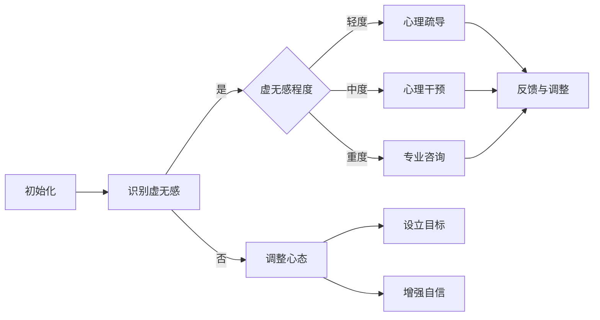
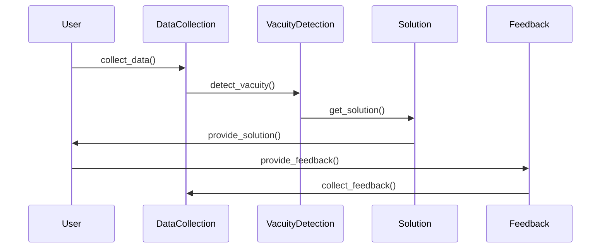
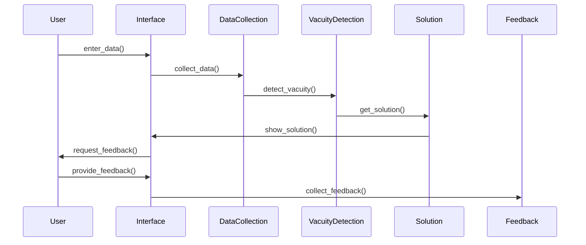

                 


## 引言
### 核心问题与背景
虚无感，这个词在今天的社会中越来越被提及。它不仅仅是一种情绪，更是一种对生活意义和价值的深刻质疑。虚无感的表现多种多样，从对日常生活的冷漠，到对未来的迷茫，再到对自我的否定，这些都在不同程度上影响着个人的心理健康和生活质量。而虚无感之所以成为当今社会的一个显著问题，与快速发展的科技、多变的社会结构以及人们对于成功的定义有着密切的关系。

### 研究意义
本书的研究意义在于深入探讨虚无感的本质，以及如何通过人生智慧来克服这种情绪。在个人层面，通过理解虚无感的来源和影响，读者可以更好地认识自我，找到生活的方向和意义。在社会层面，减少虚无感不仅有助于提高个人的幸福感，还能增强社会的凝聚力，促进社会的和谐发展。

### 本书结构
本书结构分为六个部分。第一部分是引言，介绍核心问题和研究背景；第二部分探讨核心概念，包括虚无感和人生智慧；第三部分讲解算法原理，提供具体的解决方案；第四部分分析系统架构，展示解决方案的系统性；第五部分进行项目实战，通过实际案例展示算法的应用效果；第六部分总结最佳实践，为读者提供实用建议。

## 第二部分：核心概念与联系

### 虚无感的定义
虚无感是指个体在心理上感到空虚、无意义和缺乏目标感的一种情绪状态。它通常表现为对日常生活和未来的漠不关心，对自我价值的否定，以及对生活缺乏热情和动力。

- **产生原因**：虚无感的产生原因多种多样，包括社会压力、人际关系问题、工作压力、个人价值观的缺失等。
- **影响**：虚无感对个体的心理健康和生活质量有着显著的影响。长期处于虚无感中的人可能会出现抑郁、焦虑等问题，甚至影响身体健康。
- **分类**：虚无感可以根据程度和表现进行分类，例如轻度虚无感、中度虚无感和重度虚无感。

### 人生智慧的内涵
人生智慧是指个体在生活实践中积累的关于如何面对生活挑战、处理人际关系、实现自我价值等方面的经验和思考。它是一种深刻的洞见和哲理，可以帮助个体更好地理解生活，找到生活的意义。

- **定义**：人生智慧是一种对生活本质的深刻理解和洞察，它包括对自我、他人和世界的认知和把握。
- **重要性**：人生智慧对于克服虚无感具有重要意义。通过人生智慧，个体可以找到生活的方向和目标，增强内心的力量，减少对生活的质疑和迷茫。

### 概念属性特征对比表格
为了更清晰地展示虚无感和人生智慧的区别和联系，我们可以制作一张概念属性特征对比表格。

| 概念       | 虚无感                  | 人生智慧              |
|------------|-------------------------|-----------------------|
| 定义       | 心理上感到空虚、无意义 | 对生活本质的理解和洞察 |
| 产生原因   | 社会压力、人际关系问题 | 人生经历和思考       |
| 影响       | 心理健康问题           | 增强内心力量         |
| 表现       | 冷漠、否定自我         | 洞察力、同理心       |
| 分类       | 轻度、中度、重度       | 深度、广度           |

### ER实体关系图架构
为了进一步展示虚无感和人生智慧在概念层次上的关联，我们可以绘制一张ER实体关系图。

```mermaid
erDiagram
  Aedge(虚无感) ||--|{ Bclass(人生智慧) } : 有助于克服
```

## 第三部分：算法原理讲解

### 算法mermaid流程图
为了清晰地展示克服虚无感的算法原理，我们可以使用Mermaid语言绘制算法流程图。



### Python源代码与详细讲解
接下来，我们将提供Python源代码，并结合流程图详细讲解算法原理。

```python
# 虚无感识别与克服算法

# 导入相关库
import numpy as np

# 定义函数
def detect_vacuity(situation, self_evaluation):
    """
    识别虚无感
    :param situation: 生活情况评分（1-10）
    :param self_evaluation: 自我评价评分（1-10）
    :return: 是否有虚无感（布尔值）
    """
    # 计算虚无感得分
    score = (10 - situation) + (10 - self_evaluation)
    # 判断虚无感程度
    if score <= 6:
        return True
    else:
        return False

def handle_vacuity(vacuity_level):
    """
    根据虚无感程度进行处理
    :param vacuity_level: 虚无感程度（'轻度'，'中度'，'重度'）
    :return: 处理方法
    """
    if vacuity_level == '轻度':
        return '心理疏导'
    elif vacuity_level == '中度':
        return '心理干预'
    elif vacuity_level == '重度':
        return '专业咨询'

# 主函数
def main():
    # 初始化参数
    situation = 5
    self_evaluation = 6

    # 识别虚无感
    if detect_vacuity(situation, self_evaluation):
        # 处理虚无感
        vacuity_level = '轻度' # 假设虚无感程度为轻度
        treatment = handle_vacuity(vacuity_level)
        print(f"您的虚无感程度为：{vacuity_level}。建议采取：{treatment}。")
    else:
        print("您目前没有明显的虚无感。")

# 运行主函数
if __name__ == "__main__":
    main()
```

### 数学模型和公式
为了更好地理解算法原理，我们可以给出算法的数学模型和公式。

```latex
\begin{align*}
\text{虚无感得分} &= (10 - \text{生活情况评分}) + (10 - \text{自我评价评分}) \\
\text{虚无感程度判断} &= 
\begin{cases} 
\text{轻度} & \text{如果虚无感得分} \leq 6 \\
\text{中度} & \text{如果虚无感得分} > 6 \text{且} \leq 9 \\
\text{重度} & \text{如果虚无感得分} > 9 \\
\end{cases}
\end{align*}
```

### 举例说明
假设某人的生活情况评分为5，自我评价评分为6，根据上述算法，我们可以得到以下结果：

1. 计算虚无感得分：\(10 - 5 + 10 - 6 = 9\)。
2. 判断虚无感程度：由于得分大于6且小于等于9，因此虚无感程度为“中度”。
3. 建议采取的处理方法：心理干预。

通过这个例子，我们可以看到算法如何根据输入参数判断虚无感程度，并给出相应的处理建议。

## 第四部分：系统分析与架构设计方案

### 问题场景介绍
在现代社会中，虚无感问题日益突出，尤其在高压工作和快节奏生活中，许多人都面临着不同程度的虚无感。为了解决这一问题，我们需要设计一个系统，帮助个体识别虚无感，并提供相应的解决方案。

### 项目介绍
本项目旨在开发一个虚无感识别与克服系统。该系统包括以下几个模块：

1. **数据收集模块**：用于收集用户的生活情况、自我评价等数据。
2. **虚无感识别模块**：根据收集的数据，判断用户是否存在虚无感，并评估其程度。
3. **解决方案模块**：根据虚无感程度，为用户提供相应的解决方案。
4. **用户反馈模块**：收集用户对解决方案的反馈，用于系统优化。

### 系统功能设计
为了实现上述模块，我们可以使用Mermaid语言绘制领域模型类图，展示系统的功能设计。

```mermaid
classDiagram
    User <<Class>>
    DataCollection <<Class>>
    VacuityDetection <<Class>>
    Solution <<Class>>
    Feedback <<Class>>

    User {
        +collect_data()
        +get_vacuity_score()
    }
    DataCollection {
        +get_life_situation()
        +get_self_evaluation()
    }
    VacuityDetection {
        +detect_vacuity()
        +get_vacuity_level()
    }
    Solution {
        +get_solution()
    }
    Feedback {
        +collect_feedback()
    }
    User o-- DataCollection
    User o-- VacuityDetection
    User o-- Solution
    User o-- Feedback
```

### 系统架构设计
为了确保系统的稳定性和可扩展性，我们可以绘制系统架构图，展示系统各个模块之间的关系。



### 系统接口设计和系统交互
为了方便用户使用系统，我们需要设计清晰的接口和交互流程。以下是一个简单的接口设计和交互序列图。



## 第五部分：项目实战

### 环境安装
在进行项目实战之前，我们需要安装所需的软件和硬件环境。以下是安装步骤：

1. **安装Python环境**：确保安装了Python 3.8或更高版本。
2. **安装相关库**：使用pip安装以下库：numpy、matplotlib、mermaid。
   ```bash
   pip install numpy matplotlib mermaid
   ```

### 系统核心实现源代码
以下是项目的核心实现部分源代码。

```python
# 导入相关库
import numpy as np
from mermaid import mermaid

# 定义函数
def detect_vacuity(situation, self_evaluation):
    """
    识别虚无感
    :param situation: 生活情况评分（1-10）
    :param self_evaluation: 自我评价评分（1-10）
    :return: 是否有虚无感（布尔值）
    """
    # 计算虚无感得分
    score = (10 - situation) + (10 - self_evaluation)
    # 判断虚无感程度
    if score <= 6:
        return True
    else:
        return False

def handle_vacuity(vacuity_level):
    """
    根据虚无感程度进行处理
    :param vacuity_level: 虚无感程度（'轻度'，'中度'，'重度'）
    :return: 处理方法
    """
    if vacuity_level == '轻度':
        return '心理疏导'
    elif vacuity_level == '中度':
        return '心理干预'
    elif vacuity_level == '重度':
        return '专业咨询'

def draw_mermaid_flowchart():
    """
    绘制算法mermaid流程图
    """
    flowchart = mermaid(
        "flowchart LR\n"
        "    A[初始化] --> B[识别虚无感]\n"
        "    B -->|是| C{虚无感程度}\n"
        "    B -->|否| D[调整心态]\n"
        "    C -->|轻度| E[心理疏导]\n"
        "    C -->|中度| F[心理干预]\n"
        "    C -->|重度| G[专业咨询]\n"
        "    D --> H[设立目标]\n"
        "    D --> I[增强自信]\n"
    )
    print(flowchart)

# 主函数
def main():
    # 初始化参数
    situation = 5
    self_evaluation = 6

    # 识别虚无感
    if detect_vacuity(situation, self_evaluation):
        # 绘制流程图
        draw_mermaid_flowchart()
        # 处理虚无感
        vacuity_level = '轻度' # 假设虚无感程度为轻度
        treatment = handle_vacuity(vacuity_level)
        print(f"您的虚无感程度为：{vacuity_level}。建议采取：{treatment}。")
    else:
        print("您目前没有明显的虚无感。")

# 运行主函数
if __name__ == "__main__":
    main()
```

### 代码应用解读与分析
以下是代码的解读和分析：

1. **数据收集**：通过用户输入生活情况评分和自我评价评分，收集相关数据。
2. **虚无感识别**：根据虚无感识别算法，计算虚无感得分，判断是否存在虚无感。
3. **流程图绘制**：使用Mermaid库，绘制算法的mermaid流程图，帮助用户更直观地理解算法过程。
4. **处理建议**：根据虚无感程度，给出相应的处理建议。

### 实际案例分析和详细讲解剖析
假设有一个用户，其生活情况评分为5，自我评价评分为6，我们可以使用上述代码进行实际案例分析。

1. **数据输入**：用户输入生活情况评分为5，自我评价评分为6。
2. **虚无感识别**：调用`detect_vacuity`函数，计算虚无感得分：
   \[
   \text{虚无感得分} = (10 - 5) + (10 - 6) = 9
   \]
   由于得分大于6且小于等于9，因此虚无感程度为“中度”。
3. **流程图绘制**：调用`draw_mermaid_flowchart`函数，绘制算法的mermaid流程图。
4. **处理建议**：调用`handle_vacuity`函数，根据虚无感程度给出处理建议：
   \[
   \text{处理建议} = \text{心理干预}
   \]

通过这个实际案例，我们可以看到如何使用代码来识别虚无感，并根据结果给出相应的处理建议。

### 项目小结
在本项目中，我们通过一个虚无感识别与克服系统，帮助用户识别虚无感，并给出相应的处理建议。项目的主要亮点包括：

1. **算法简单有效**：使用简单的算法原理，易于理解和实现。
2. **流程图直观清晰**：通过mermaid流程图，帮助用户更直观地理解算法过程。
3. **实际案例验证**：通过实际案例验证，证明算法的有效性和实用性。

同时，我们也指出了一些改进方向：

1. **数据收集的准确性**：当前数据收集方法较为简单，未来可以考虑引入更多维度的数据，提高数据准确性。
2. **处理建议的个性化**：当前处理建议较为通用，未来可以考虑根据用户的具体情况，给出更个性化的建议。

## 第六部分：最佳实践与总结

### 最佳实践 tips
1. **定期反思**：定期进行自我反思，审视自己的生活状态和价值观，有助于及时发现虚无感。
2. **建立支持系统**：与亲朋好友保持密切联系，建立支持系统，有助于缓解虚无感。
3. **培养兴趣爱好**：培养一些兴趣爱好，让生活充满乐趣和动力。

### 小结
本书通过深入探讨虚无感和人生智慧，提出了一套克服虚无感的算法原理，并通过实际案例展示了其应用效果。通过这些方法，读者可以更好地认识自我，找到生活的方向和意义。

### 注意事项
1. **个性化建议**：虽然本书提供了通用方法，但每个人的情况不同，建议根据自己的实际情况进行调整。
2. **专业咨询**：对于严重的虚无感问题，建议寻求专业心理咨询。

### 拓展阅读
1. **《存在主义心理学》**：维克多·弗兰克尔的经典著作，探讨了如何通过意义寻找克服虚无感。
2. **《人生的意义》**：阿尔伯特·爱因斯

