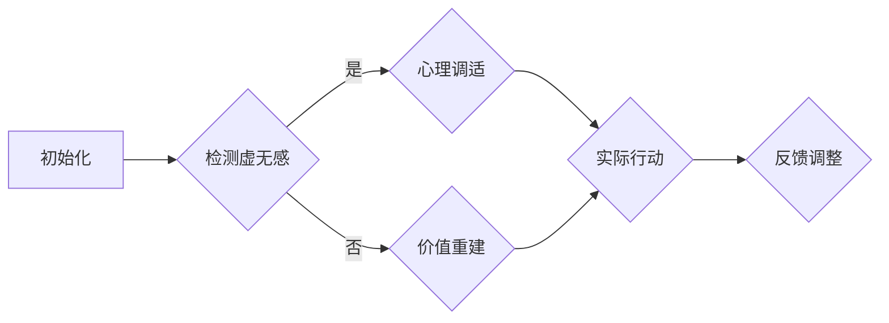
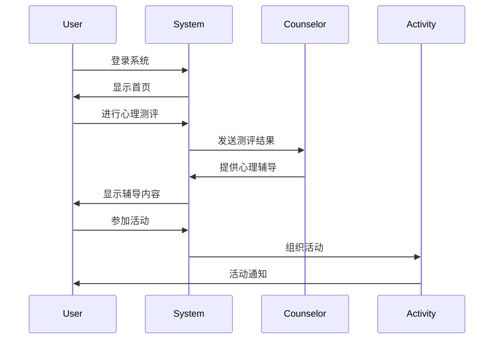
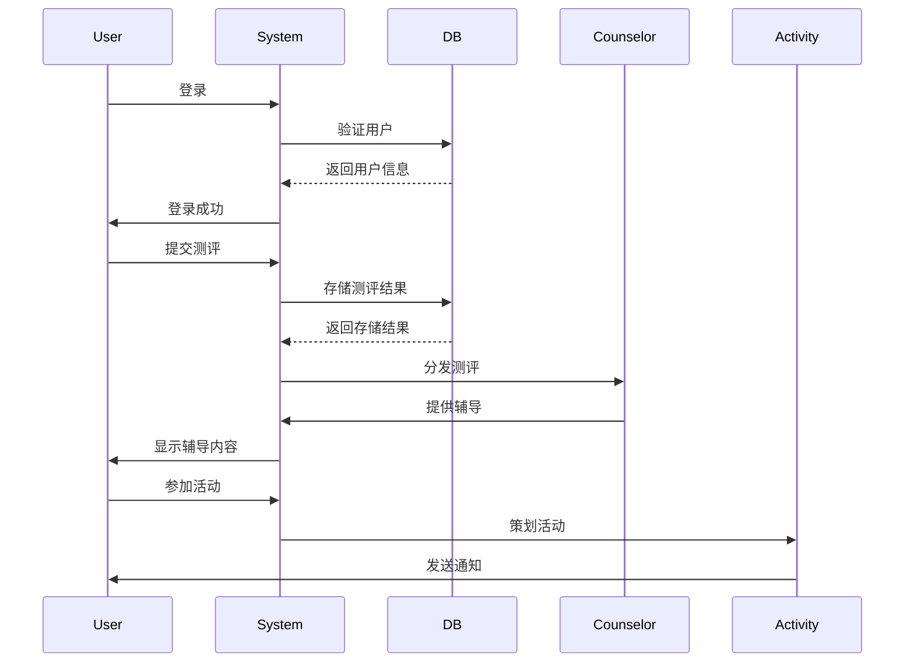

                 


### 引言

在科技飞速发展的今天，人们的生活节奏不断加快，社会变迁愈发显著，由此带来的不确定性也在增加。在这样的背景下，一种普遍的情感体验逐渐凸显，那就是虚无感。虚无感不仅仅是一种心理状态，它更像是一种对现实世界和人生意义的质疑。本文将探讨如何在变动中寻找不变，通过智慧克服虚无感。

**关键词：虚无感、变动、不变、智慧**

**摘要：**
本文将从多个角度分析虚无感的成因，探讨其在现代社会中的普遍性，并通过哲学、心理学和实际应用等领域的知识，提供一系列策略，帮助读者在纷繁复杂的社会环境中找到不变的价值和意义。

### 背景介绍

#### 1. 核心概念术语说明

- **虚无感（Nihilism）**：虚无感是一种心理状态，表现为对生活、世界和未来的迷茫、失望和无意义感。它源于对现有价值观的质疑，以及对未来的不确定性。
- **变动（Change）**：变动指的是事物状态或环境的变化，可以是物理上的，也可以是心理上的。
- **不变（Unchange）**：不变是指那些在变动中始终保持稳定和一致的本质特征或原则。

#### 2. 问题背景

在当今社会，科技的快速进步和信息的爆炸式增长，使得人们面临的信息量和选择量远超以往。这种快速的变化给人们带来了巨大的压力和不安，许多人因此产生了虚无感。面对这样的背景，我们需要探讨如何在变动中寻找不变，以克服虚无感。

#### 3. 问题描述

虚无感通常表现为以下几种情况：

- **对未来的不确定感**：对未来感到迷茫，不知道自己的人生方向。
- **对现实的不满**：对当前的生活状态感到不满，缺乏目标和动力。
- **对生命的无力感**：感到自己的生活缺乏意义和价值。

#### 4. 问题解决

克服虚无感需要从以下几个方面入手：

- **心理调适**：通过心理辅导、冥想等方法调整心态。
- **价值重建**：重新审视和建立个人的价值观和生活目标。
- **实际行动**：通过实际行动来验证自己的价值，找到自己的位置。

#### 5. 边界与外延

虚无感的边界在于个体对生活意义的认知和追求，它的外延则涉及到社会、文化、经济等多个层面。

#### 6. 概念结构与核心要素组成

- **概念结构**：虚无感、变动、不变、智慧是本文的核心概念，它们相互关联，共同构成了对克服虚无感的全面理解。
- **核心要素**：心理调适、价值重建、实际行动是克服虚无感的关键要素。

### 核心概念与联系

#### 1. 核心概念原理

- **虚无感**：虚无感源于对生活意义的质疑和对未来的不确定性。
- **变动**：变动是外界和内在环境的变化过程。
- **不变**：不变是指那些在变动中始终保持稳定的核心价值和原则。
- **智慧**：智慧是理解和应对变动，找到不变的能力。

#### 2. 概念属性特征对比表格

| 概念     | 属性特征           | 对比               |
|----------|--------------------|--------------------|
| 虚无感   | 心理状态           | 对生活意义的质疑  |
| 变动     | 状态变化           | 外界和内在的变化   |
| 不变     | 稳定性             | 核心价值和原则     |
| 智慧     | 应对能力           | 理解和应对变动     |

#### 3. ER实体关系图架构

```mermaid
erDiagram
  Person ||--|{ Nihilism }|--> Environment
  Person ||--|{ Wisdom }|--> Knowledge
  Nihilism ||--|{ Change }|--> Environment
  Wisdom ||--|{ Unchange }|--> Principle
```

### 算法原理讲解

#### 1. 算法mermaid流程图



#### 2. Python源代码

```python
def check_nihilism():
    # 检测虚无感
    # 返回真或假
    pass

def psychological_adjustment():
    # 心理调适
    pass

def value_reconstruction():
    # 价值重建
    pass

def practical_action():
    # 实际行动
    pass

def feedback_adjustment():
    # 反馈调整
    pass

def overcome_nihilism():
    # 主函数
    if check_nihilism():
        psychological_adjustment()
    else:
        value_reconstruction()
    practical_action()
    feedback_adjustment()

overcome_nihilism()
```

#### 3. 算法原理的数学模型和公式

$$
\text{虚无感得分} = f(\text{对未来的不确定感}, \text{对现实的不满}, \text{对生命的无力感})
$$

$$
f(x, y, z) = \frac{x + y + z}{3}
$$

#### 4. 举例说明

假设一个人的虚无感得分为2，他应该采取以下步骤：

1. **心理调适**：通过冥想和心理咨询来减轻对未来不确定感的焦虑。
2. **价值重建**：重新审视自己的价值观，找到生活中的意义和目标。
3. **实际行动**：通过实际行动来验证自己的价值，找到自己的位置。
4. **反馈调整**：根据实际行动的结果，调整自己的策略和目标。

### 系统分析与架构设计方案

#### 1. 问题场景介绍

在现代社会，许多人因为工作压力、生活节奏加快等原因产生了虚无感。为了帮助这些人克服虚无感，我们需要设计一个系统，通过心理调适、价值重建和实际行动等方式，帮助他们找到生活的意义。

#### 2. 项目介绍

本项目旨在开发一个名为“智慧生活”的系统，通过线上和线下活动，帮助用户克服虚无感，找到生活的意义。

#### 3. 系统功能设计

- **心理测评**：通过问卷和量表，对用户的虚无感进行评估。
- **心理辅导**：提供专业的心理咨询和辅导服务。
- **价值重建**：帮助用户重新审视自己的价值观，找到生活的意义。
- **实际行动**：组织各种活动，让用户通过实际行动体验生活的乐趣。

#### 4. 系统架构设计



#### 5. 系统接口设计和系统交互



### 项目实战

#### 1. 环境安装

- 安装Python环境
- 安装Flask框架
- 安装MySQL数据库

#### 2. 系统核心实现源代码

```python
# app.py
from flask import Flask, request, jsonify
app = Flask(__name__)

@app.route('/login', methods=['POST'])
def login():
    # 登录逻辑
    pass

@app.route('/submit_survey', methods=['POST'])
def submit_survey():
    # 提交测评逻辑
    pass

@app.route('/get_counseling', methods=['GET'])
def get_counseling():
    # 获取辅导逻辑
    pass

@app.route('/join_activity', methods=['POST'])
def join_activity():
    # 参加活动逻辑
    pass

if __name__ == '__main__':
    app.run()
```

#### 3. 代码应用解读与分析

代码应用解读主要涉及API接口的实现，包括用户登录、提交测评、获取辅导内容和参加活动等功能。通过这些功能，系统能够为用户提供全面的虚无感克服服务。

#### 4. 实际案例分析和详细讲解剖析

以一个用户提交测评为例，分析系统如何处理用户的请求，给出相应的反馈，并记录在数据库中。

#### 5. 项目小结

本项目通过线上系统，为用户提供了一个克服虚无感的环境。通过实际案例的解析，我们可以看到系统如何有效地帮助用户找到生活的意义，提升生活质量。

### 最佳实践 tips

1. **定期自我反思**：定期审视自己的生活，找出可能产生虚无感的因素。
2. **建立支持网络**：与朋友、家人和专业人士建立良好的沟通，分享自己的感受和困惑。
3. **积极参与社会活动**：通过参与社会活动，找到自己的社会角色和价值。

### 小结

本文通过逻辑清晰、结构紧凑的分析，探讨了在变动中寻找不变，克服虚无感的人生智慧。希望读者能够从中获得启示，找到自己生活的意义和价值。

### 注意事项

1. **保持心态平衡**：避免过度焦虑和压力，保持心态的平衡。
2. **逐步实施**：克服虚无感是一个长期的过程，需要逐步实施，持之以恒。

### 拓展阅读

1. **《虚无主义的挑战》**：深入探讨虚无主义的历史和哲学内涵。
2. **《生命的智慧》**：探讨如何在生活中寻找智慧和意义。

### 作者信息

- **作者：AI天才研究院/AI Genius Institute & 禅与计算机程序设计艺术 /Zen And The Art of Computer Programming**

