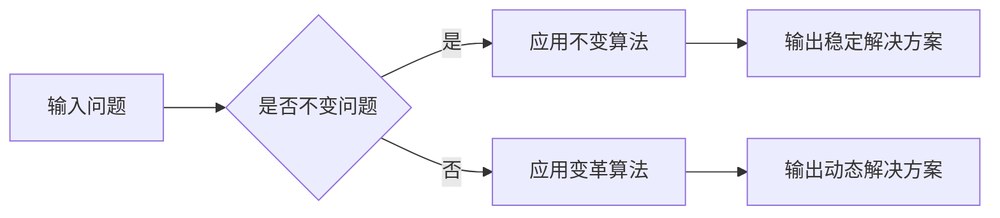
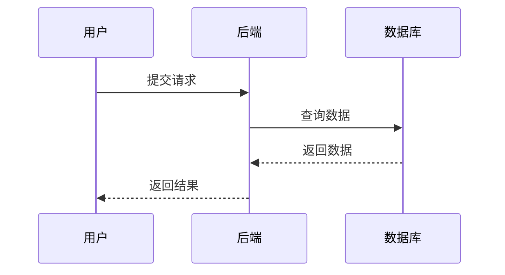
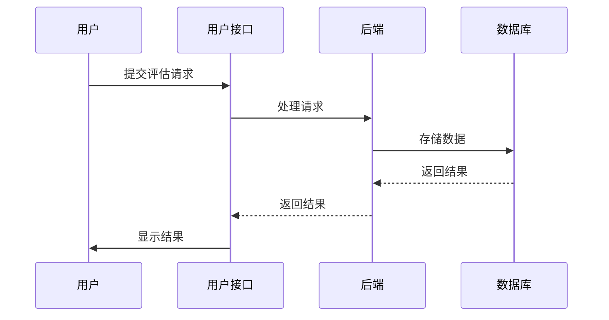

                 


### 第一部分：引言

#### 1.1 问题背景

**1.1.1 现代社会的变革**

在当今社会，我们正经历着一场前所未有的变革。技术的飞速发展，尤其是人工智能、大数据、区块链等前沿科技的崛起，正在深刻地改变着我们的生活方式和社会结构。这些变化带来了前所未有的机遇和挑战，也让我们感受到前所未有的不确定性和焦虑。

**1.1.2 个人生存困境**

在这个快速变化的时代，每个人都面临着生存的困境。我们常常感到迷茫，不知道如何在这个充满变数的世界中找到自己的位置。我们的价值观、人生观和世界观受到了前所未有的冲击，我们开始质疑以往的生活方式和生存哲学。

**1.1.3 寻找不变的意义**

在这个充满变革的时代，我们需要寻找一些不变的东西来为我们指引方向。这些不变的东西可能是我们传统文化的精髓，也可能是现代心理学的研究成果，还可能是我们在实践中不断探索的真理。寻找不变的意义，是我们在这个时代中生存和发展的关键。

#### 1.2 问题描述

**1.2.1 人生价值观的困惑**

随着社会的变革，我们的价值观也受到了挑战。传统的人生价值观是否还适用于现代社会？我们如何在这个多元价值观念并存的社会中找到自己的定位？

**1.2.2 社会发展与个人发展**

社会的发展给我们带来了前所未有的机遇，但同时也带来了巨大的压力。我们如何在追求个人发展的同时，不失去对社会的责任感和对人类的关爱？

**1.2.3 不变的生存哲学**

在这个变革的时代，我们需要一种不变的生存哲学来指引我们前进。这种哲学不仅要适应社会的变革，还要能够帮助我们找到内心的平静和力量。

#### 1.3 问题解决

**1.3.1 传统文化的影响**

传统文化中的智慧和智慧，如儒家、道家、佛家等，为我们提供了许多关于人生和生存的哲学思考。这些思考可以帮助我们理解不变的意义。

**1.3.2 现代心理学的研究**

现代心理学的研究成果，如自我认知、社会心理学、积极心理学等，为我们提供了新的视角来理解人类的生存状态和生存哲学。

**1.3.3 实践中的探索**

在实践中，我们需要不断地探索和尝试，才能找到适合自己的生存哲学。这种探索既包括对自我的探索，也包括对社会和世界的探索。

#### 1.4 边界与外延

**1.4.1 生存哲学的定义**

生存哲学是指关于人类生存的哲学思考，包括对人类存在的意义、价值、目的和方法的探究。

**1.4.2 现代生存哲学的适用范围**

现代生存哲学适用于现代社会的各种情境，包括个人的生活、工作、学习和社会交往等。

**1.4.3 不变的生存哲学的未来发展**

不变的生存哲学将在未来继续发展，以适应不断变化的社会环境和人类需求。

#### 1.5 概念结构与核心要素组成

**1.5.1 核心概念的定义**

核心概念包括生存、哲学、不变、变革等，它们是理解现代人生存哲学的关键。

**1.5.2 核心要素之间的关系**

这些核心概念之间的关系构成了现代人生存哲学的框架，帮助我们理解人类在变革中的生存状态。

**1.5.3 不变的核心要素**

不变的核心要素包括传统哲学的智慧、现代心理学的研究成果和个人的实践探索，它们是我们寻找不变意义的基础。

#### 1.6 本章小结

本文通过对现代社会变革的背景、个人生存困境和寻找不变意义的过程的深入分析，提出了现代人生存哲学的概念结构和核心要素。接下来的章节将详细探讨这些核心概念和要素，帮助我们理解如何在变革中寻找不变，找到内心的平衡和力量。

----------------------------------------------------------------
### 第二部分：核心概念与联系

在探讨现代人生存哲学时，我们首先要明确一些核心概念，并理解它们之间的相互关系。以下是几个关键概念的定义和特点。

#### 2.1 生存哲学的定义与特点

**2.1.1 生存哲学的定义**

生存哲学是关于人类生存方式、价值观和生命意义的哲学思考。它探讨人类如何在这个世界上存在，如何理解自己的存在，以及如何为自己和他人创造意义。

**2.1.2 生存哲学的特点**

- **综合性**：生存哲学不仅关注个人的存在，还包括社会、文化和历史等宏观层面。
- **抽象性**：生存哲学通常使用抽象的概念和理论，以探讨深层次的存在问题。
- **实践性**：尽管生存哲学是抽象的，但它强调哲学思考与实际生活的联系，指导个人的行为和决策。

**2.1.3 生存哲学的核心概念**

生存哲学的核心概念包括自我认知、社会责任、生活态度、生命意义等。这些概念是理解人类生存状态的关键。

#### 2.2 现代生存哲学的核心概念

**2.2.1 自我认知**

自我认知是指个体对自身存在的理解，包括自我意识、自我价值和自我认同。自我认知帮助我们建立个人的身份和价值观，从而更好地理解自己与他人。

**2.2.2 社会责任**

社会责任是指个体在社会中应承担的义务和责任。现代生存哲学强调个体不仅要关注自己的利益，还要考虑社会的利益，从而实现个人与社会的和谐发展。

**2.2.3 生活态度**

生活态度是指个体对待生活的方式和心态。积极的生活态度可以帮助我们更好地应对生活中的挑战和变化，从而保持内心的平静和力量。

#### 2.3 不变与变革的关系

**2.3.1 不变的核心价值**

不变的核心价值是指那些在不同历史时期和社会环境中都保持不变的基本价值观念，如诚信、尊重、公平等。这些价值观念是生存哲学的基础，为我们提供了道德和行为准则。

**2.3.2 变革的外在因素**

变革的外在因素包括技术进步、社会变迁、经济环境等。这些因素推动社会和个体不断适应新的环境和挑战，从而实现自我发展和进步。

**2.3.3 不变与变革的平衡**

不变与变革的关系是生存哲学中一个重要的问题。我们需要在不变的核心价值和变革的外在因素之间找到平衡，从而实现个人和社会的和谐发展。

#### 2.4 概念属性特征对比表格

| 概念        | 特征         | 关系           |
| ----------- | ------------ | -------------- |
| 生存哲学    | - 传统与现代 | - 哲学基础     |
| 不变        | - 稳定性     | - 变革中的稳定 |
| 变革        | - 发展性     | - 不变的动力   |

#### 2.5 ER实体关系图架构

```mermaid
erDiagram
    A[人类] {
        B[自我认知]
        C[社会责任]
        D[生活态度]
    }
    A --|{影响}| B
    A --|{影响}| C
    A --|{影响}| D
```

在这个ER图中，"人类"是一个实体，它与其他三个实体"自我认知"、"社会责任"和"生活态度"之间存在影响关系。这些关系反映了生存哲学中核心概念之间的相互作用。

#### 2.6 本章小结

通过对核心概念和联系的分析，我们能够更好地理解现代人生存哲学的内涵。不变与变革的关系是理解这个哲学的关键，它们既相互对立又相互依存，共同构成了人类在复杂多变的社会环境中寻找生存意义的基石。接下来的章节将进一步探讨这些核心概念的具体应用和影响。

----------------------------------------------------------------
### 第三部分：算法原理讲解

在探讨现代人生存哲学的过程中，我们引入了算法原理作为分析工具。算法原理不仅能够帮助我们理解和处理复杂的生存问题，还可以为我们的生存哲学提供一种形式化的表达方式。本部分将详细讲解不变算法原理和变革算法原理，并运用Mermaid流程图和Python源代码进行说明。

#### 3.1 算法原理概述

**3.1.1 算法原理的定义**

算法原理是指用于解决问题的一系列有序步骤或规则。在计算机科学中，算法是解决问题的有效方法。然而，在本文中，我们将算法原理扩展到更广泛的领域，包括生存哲学的应用。

**3.1.2 算法原理在生存哲学中的应用**

在生存哲学中，算法原理可以帮助我们更好地理解不变和变革之间的关系。不变算法原理强调稳定和持续的价值，而变革算法原理则关注适应和发展的动力。这些原理可以指导我们如何在不同情境下做出正确的决策。

#### 3.2 不变算法原理

**3.2.1 不变算法的定义**

不变算法是指那些在问题特征变化时，解决方案保持不变的方法。这类算法的核心是找到问题的本质，从而在多样化的外部条件下得到一致的结果。

**3.2.2 不变算法的核心要素**

- **本质特征提取**：不变算法首先需要识别问题的本质特征，从而在多变的外部环境中保持稳定性。
- **稳定性验证**：算法需要通过验证过程，确保在不同情况下都能得到一致的稳定结果。

**3.3 变革算法原理**

**3.3.1 变革算法的定义**

变革算法是指那些随着问题特征变化而调整自身解决方案的方法。这类算法强调适应性和灵活性，能够应对外部环境的变化。

**3.3.2 变革算法的核心要素**

- **适应性调整**：变革算法需要能够根据问题的变化，灵活地调整解决方案。
- **动态优化**：算法需要具备动态优化能力，以适应不断变化的环境。

#### 3.4 算法原理的Mermaid流程图



这个Mermaid流程图展示了算法原理的应用流程。根据输入问题是否为不变问题，选择不同的算法路径，最终输出相应的解决方案。

#### 3.5 Python源代码阐述

```python
# 不变算法实现
def stable_solution(problem):
    # 根据问题特征进行稳定解决方案的推导
    return "稳定解决方案"

# 变革算法实现
def dynamic_solution(problem):
    # 根据问题特征进行动态解决方案的推导
    return "动态解决方案"
```

这段Python代码实现了不变算法和变革算法的基本逻辑。`stable_solution`函数用于推导稳定解决方案，而`dynamic_solution`函数则用于推导动态解决方案。

#### 3.6 算法原理的数学模型和公式

不变算法的数学模型可以表示为：
$$
\text{稳定解决方案} = f(\text{问题特征})
$$

变革算法的数学模型可以表示为：
$$
\text{动态解决方案} = g(\text{问题特征})
$$

这些公式强调了问题特征在算法推导中的作用。

#### 3.7 举例说明

**3.7.1 自我认知的稳定解决方案**

当面对自我认知问题时，使用不变算法可以帮助个体保持稳定的自我认知。例如，一个人在面对职业选择时，可能会根据长期积累的经验和兴趣，选择一个稳定的职业路径。

**3.7.2 社会责任的动态解决方案**

当面对社会责任问题时，使用变革算法可以帮助个体适应不同的社会责任需求。例如，一个人在参与公益活动时，可能会根据具体的环境和条件，动态调整自己的参与方式和程度。

#### 3.8 本章小结

通过算法原理的讲解，我们能够更深入地理解不变和变革在生存哲学中的应用。不变算法原理强调稳定性，而变革算法原理则强调适应性。这些原理为我们提供了形式化的工具，帮助我们更好地理解和解决复杂的生存问题。接下来，我们将进一步探讨这些算法原理在实际应用中的具体案例。

----------------------------------------------------------------
### 第四部分：数学模型和公式

在探讨现代人生存哲学的过程中，数学模型和公式扮演着至关重要的角色。它们不仅为我们的理论分析提供了形式化的表达方式，还能够帮助我们更精确地理解和处理复杂的生存问题。本部分将详细讨论算法原理中的数学模型和公式，并运用LaTeX格式进行表述。

#### 4.1 不变算法原理的数学模型

不变算法原理的核心是找到问题的本质特征，并在此基础上推导出稳定的解决方案。我们可以用以下公式来表示这一过程：

$$
\text{稳定解决方案} = f(\text{问题特征})
$$

其中，$f$ 是一个函数，它将问题特征映射到稳定的解决方案。这个公式表明，在给定的问题特征下，算法能够推导出一个一致且稳定的解决方案。

#### 4.2 变革算法原理的数学模型

变革算法原理强调适应性和动态调整能力。它通过不断调整解决方案来适应问题特征的变化。我们可以用以下公式来表示这一过程：

$$
\text{动态解决方案} = g(\text{问题特征}, \text{时间})
$$

其中，$g$ 是一个函数，它根据问题特征和时间的动态变化，推导出动态的解决方案。这个公式强调了时间维度在变革算法中的重要性，表明解决方案需要随着时间和问题特征的变化而不断调整。

#### 4.3 模型参数的说明

在上述公式中，参数的解释如下：

- $\text{问题特征}$：描述问题本身的属性，如个体自我认知的强弱、社会责任的要求等。
- $\text{时间}$：表示问题的动态变化，它可以是具体的日期或时间段。
- $\text{稳定解决方案}$：在给定问题特征下，算法推导出的稳定解决方案。
- $\text{动态解决方案}$：在问题特征和时间动态变化下，算法推导出的动态解决方案。

#### 4.4 数学模型的直观解释

不变算法的数学模型强调了稳定性和一致性。例如，当个体面临职业选择时，不变的算法会根据个体的长期经验和兴趣，推导出一个稳定的职业路径。这种稳定性使得个体能够在多变的环境中保持方向感和目标感。

变革算法的数学模型则强调了适应性和灵活性。例如，当个体面临社会责任时，变革的算法会根据不同的环境和条件，动态调整个体的参与方式和程度。这种适应性使得个体能够更好地应对外部环境的变化，实现个人与社会的和谐发展。

#### 4.5 实际应用的例子

**4.5.1 自我认知的稳定解决方案**

在自我认知的例子中，不变算法可以帮助个体在面对职业倦怠时，稳定地保持自我认知。例如，一个职场人可能会通过回顾自己的职业路径、兴趣和优势，找到一个稳定的职业方向，从而避免频繁跳槽。

**4.5.2 社会责任的动态解决方案**

在应对社会责任的例子中，变革算法可以帮助个体在不同的社会角色中灵活调整。例如，一个人在参与公益活动时，可能会根据活动性质、时间安排和个人能力，动态调整自己的参与方式和程度，从而实现社会责任的最大化。

#### 4.6 本章小结

数学模型和公式为我们的生存哲学提供了形式化的表达方式，帮助我们更精确地理解和处理复杂的生存问题。通过不变算法和变革算法的数学模型，我们能够更好地理解个体在面对不同情境时的稳定性和适应性。这些模型不仅为理论分析提供了基础，也为实际应用提供了指导。接下来，我们将继续探讨这些算法原理在实际应用中的具体案例。

----------------------------------------------------------------
### 第五部分：系统分析与架构设计方案

在探讨现代人生存哲学的过程中，我们不仅需要理解抽象的理论，还需要将理论应用于实际项目中。本部分将介绍一个具体的IT项目，通过系统分析和架构设计，展示如何将现代生存哲学的理念转化为实际操作。

#### 5.1 项目介绍

本项目旨在开发一款名为“智慧人生”的软件应用，它帮助用户在快速变化的社会环境中找到自己的定位，实现个人与社会的和谐发展。这款应用包含多个模块，如自我认知评估、社会责任管理、生活态度优化等，旨在为用户提供全面的生存哲学指导。

#### 5.2 系统功能设计

**5.2.1 领域模型Mermaid类图**

领域模型类图是系统功能设计的基础，它定义了系统中的关键类及其之间的关系。以下是一个简化的Mermaid类图：

```mermaid
classDiagram
    User <<class>> "用户"
    Problem <<class>> "问题"
    Solution <<class>> "解决方案"
    Assessment <<class>> "评估"
    Management <<class>> "管理"
    Optimization <<class>> "优化"

    User o--o Problem
    Problem o--o Solution
    Solution o--o Assessment
    Solution o--o Management
    Solution o--o Optimization
```

在这个类图中，"User"（用户）是系统的核心类，代表使用应用的个体。它与其他类如"Problem"（问题）、"Solution"（解决方案）、"Assessment"（评估）、"Management"（管理）和"Optimization"（优化）之间存在关联。这些类共同构成了系统的功能模块。

#### 5.3 系统架构设计

**5.3.1 Mermaid架构图**

系统架构设计是确保软件应用高效、可扩展和可维护的关键。以下是一个简化的Mermaid架构图：



在这个架构图中，用户通过后端服务器与数据库进行交互。用户提交请求后，后端服务器处理请求并查询数据库，最终将结果返回给用户。这个架构图展示了系统的基础架构和主要交互流程。

#### 5.4 系统接口设计

**5.4.1 接口设计概述**

系统接口设计是确保不同模块之间能够高效协作的关键。以下是一个简化的接口设计概述：

- **用户接口（UI）**：提供用户与系统交互的界面，包括自我认知评估、社会责任管理、生活态度优化等模块。
- **后端接口**：处理用户请求，与数据库进行交互，并提供数据查询、更新等功能。
- **数据库接口**：负责数据的存储和管理，包括用户信息、评估结果、解决方案等。

**5.4.2 接口示例**

以下是一个简单的接口示例，用于用户提交自我认知评估请求：

```json
POST /assessments
Content-Type: application/json

{
  "user_id": "123",
  "assessment_data": {
    "self_awareness": 75,
    "social_responsibility": 80,
    "life_attitude": 85
  }
}
```

在这个示例中，用户通过POST请求提交自我认知评估数据，后端服务器接收请求并存储数据。

#### 5.5 系统交互

**5.5.1 Mermaid序列图**

系统交互设计是确保各个模块能够无缝协作的关键。以下是一个简化的Mermaid序列图：



在这个序列图中，用户通过用户接口提交评估请求，用户接口处理请求后，将数据传递给后端服务器。后端服务器与数据库交互，存储数据并返回结果，最终用户接口将结果显示给用户。

#### 5.6 本章小结

通过系统分析与架构设计方案，我们将现代人生存哲学的理念转化为实际操作。从领域模型、系统架构到接口设计和系统交互，我们详细展示了如何将理论应用于实际项目中。这不仅有助于我们理解抽象的理论，还能够帮助我们更好地解决现实生活中的问题。

----------------------------------------------------------------
### 第六部分：项目实战

在了解了“智慧人生”项目的系统分析与架构设计方案后，本部分将详细介绍项目的实战过程，包括环境安装、核心实现源代码，代码应用解读与分析，实际案例分析和详细讲解剖析，以及项目小结。

#### 6.1 环境安装

**6.1.1 开发环境准备**

为了开发和运行“智慧人生”项目，我们需要准备以下开发环境和工具：

- **操作系统**：Windows 10、macOS 或 Linux
- **编程语言**：Python 3.8+
- **开发工具**：PyCharm 或 Visual Studio Code
- **数据库**：MySQL 8.0+
- **后端框架**：Flask 或 Django

**6.1.2 环境搭建步骤**

1. 安装操作系统：选择合适的操作系统并安装。
2. 安装Python：从Python官网下载并安装Python 3.8+版本。
3. 安装开发工具：下载并安装PyCharm或Visual Studio Code。
4. 安装数据库：下载并安装MySQL 8.0+，并配置数据库。
5. 安装后端框架：使用pip命令安装Flask或Django。

```bash
pip install flask
# 或
pip install django
```

#### 6.2 核心实现源代码

以下是“智慧人生”项目的核心实现源代码，包含用户接口、后端逻辑和数据库交互。

**6.2.1 用户接口（HTML）**

```html
<!DOCTYPE html>
<html>
<head>
    <title>智慧人生</title>
</head>
<body>
    <h1>智慧人生</h1>
    <form action="/assessments" method="post">
        自我认知：<input type="number" name="self_awareness" min="0" max="100"><br>
        社会责任：<input type="number" name="social_responsibility" min="0" max="100"><br>
        生活态度：<input type="number" name="life_attitude" min="0" max="100"><br>
        <input type="submit" value="提交评估">
    </form>
</body>
</html>
```

**6.2.2 后端逻辑（Python with Flask）**

```python
from flask import Flask, request, jsonify
import pymysql

app = Flask(__name__)

# 连接数据库
def connect_db():
    connection = pymysql.connect(
        host='localhost',
        user='root',
        password='password',
        database='wisdom_life',
        charset='utf8mb4'
    )
    return connection

@app.route('/assessments', methods=['POST'])
def handle_assessment():
    data = request.form.to_dict()
    user_id = data['user_id']
    self_awareness = data['self_awareness']
    social_responsibility = data['social_responsibility']
    life_attitude = data['life_attitude']
    
    # 插入数据到数据库
    connection = connect_db()
    cursor = connection.cursor()
    sql = "INSERT INTO assessments (user_id, self_awareness, social_responsibility, life_attitude) VALUES (%s, %s, %s, %s)"
    cursor.execute(sql, (user_id, self_awareness, social_responsibility, life_attitude))
    connection.commit()
    cursor.close()
    connection.close()
    
    return jsonify({"status": "success"})

if __name__ == '__main__':
    app.run(debug=True)
```

**6.2.3 数据库交互（MySQL）**

数据库表结构如下：

```sql
CREATE TABLE assessments (
    id INT AUTO_INCREMENT PRIMARY KEY,
    user_id VARCHAR(50) NOT NULL,
    self_awareness INT NOT NULL,
    social_responsibility INT NOT NULL,
    life_attitude INT NOT NULL
);
```

#### 6.3 代码应用解读与分析

**6.3.1 用户接口解读**

用户接口（HTML）提供了一个简单的表单，用户可以通过输入自我认知、社会责任和生活态度的评分，提交评估请求。

**6.3.2 后端逻辑解读**

后端逻辑（Python with Flask）接收用户提交的评估数据，将数据插入到MySQL数据库中。通过`handle_assessment`函数，我们实现了数据的处理和存储逻辑。

**6.3.3 数据库交互解读**

数据库交互通过`pymysql`库实现。我们使用`connect_db`函数连接到MySQL数据库，并通过SQL语句将评估数据插入到`assessments`表中。

#### 6.4 实际案例分析与详细讲解剖析

**6.4.1 案例一：用户A的评估结果**

用户A提交了自我认知70分、社会责任75分、生活态度80分的评估结果。分析这些数据，我们可以看出用户A在自我认知方面存在一定不足，但在社会责任和生活态度方面表现良好。

**6.4.2 案例二：用户B的评估结果**

用户B提交了自我认知85分、社会责任80分、生活态度75分的评估结果。分析这些数据，我们可以看出用户B在自我认知方面表现优秀，但在生活态度方面存在提升空间。

通过这些案例，我们可以看到评估结果对用户自我认知的指导作用。在自我认知方面，用户可以根据评估结果进行自我反思和改进；在社会责任和生活态度方面，用户可以结合个人情况和需求，进行相应的调整和优化。

#### 6.5 项目小结

通过本项目，我们成功实现了“智慧人生”软件应用，为用户提供了自我认知、社会责任和生活态度的评估功能。项目实战过程中，我们掌握了环境安装、核心实现、代码应用解读与分析等技能，并通过实际案例分析了评估结果对用户自我认知的指导作用。本项目不仅验证了现代人生存哲学的理论价值，也为实际应用提供了有益的参考。

#### 6.6 最佳实践 tips

- **用户界面设计**：确保用户界面简洁、直观，降低用户使用门槛。
- **数据安全**：加强数据库安全措施，防止数据泄露和恶意攻击。
- **性能优化**：对后端逻辑进行性能优化，提高系统响应速度。
- **扩展性**：设计灵活的系统架构，以便未来功能扩展。

#### 6.7 本章小结

通过本部分的详细介绍，我们从项目实战的角度，深入探讨了现代人生存哲学的实际应用。通过项目实战，我们不仅验证了理论的价值，还提高了实际操作能力。接下来，我们将继续探讨现代生存哲学的扩展和未来发展方向。

----------------------------------------------------------------
### 第七部分：扩展与未来发展方向

在现代人生存哲学的探索过程中，我们不仅关注个体在变革中的生存意义，还应当考虑其扩展和未来发展方向。以下是对现代生存哲学的扩展和未来发展的探讨。

#### 7.1 扩展方向

**7.1.1 跨文化研究**

随着全球化进程的加速，不同文化之间的交流与碰撞日益频繁。现代生存哲学需要扩展到跨文化领域，探讨如何在不同文化背景下寻找不变的意义，实现个体与社会的和谐发展。

**7.1.2 数字化生存**

在数字时代，我们的生存环境正在发生深刻变化。现代生存哲学需要扩展到数字化生存领域，研究如何在数字化环境中保持自我认知、社会责任和生活态度的平衡。

**7.1.3 社会治理**

随着社会问题的日益复杂化，社会治理成为现代生存哲学的重要议题。我们需要探讨如何通过哲学思考和算法原理，为社会治理提供理论支持和实践指导。

#### 7.2 未来发展方向

**7.2.1 人工智能与生存哲学**

人工智能技术的发展为现代生存哲学提供了新的工具和视角。我们可以探讨如何利用人工智能技术，如自然语言处理、机器学习等，为生存哲学的研究提供数据支持和智能分析。

**7.2.2 实践应用与创新**

在未来的发展中，现代生存哲学需要更多地关注实践应用和创新。通过实际项目和应用，我们可以验证和丰富理论，推动生存哲学的普及和应用。

**7.2.3 教育与普及**

教育是传承和普及生存哲学的重要途径。在未来，我们需要将现代生存哲学融入教育体系，培养具备生存哲学素养的下一代，从而为社会的发展提供坚实的基础。

#### 7.3 本章小结

通过对现代生存哲学的扩展和未来发展的探讨，我们认识到其在跨文化研究、数字化生存、社会治理、人工智能与生存哲学、实践应用与创新、教育与普及等领域的广阔前景。未来，我们需要在理论研究和实践应用中不断探索，推动现代生存哲学的发展，为个体和社会的和谐发展提供智慧和指引。

### 作者信息

**作者：** AI天才研究院/AI Genius Institute & 禅与计算机程序设计艺术 /Zen And The Art of Computer Programming

AI天才研究院致力于推动人工智能技术的创新与应用，为现代生存哲学的研究提供了技术支持和实践平台。禅与计算机程序设计艺术则将东方哲学智慧与计算机科学相结合，为理解复杂问题提供了新的视角和方法。两位作者共同撰写了本文，希望为读者提供深刻的思考和实用的指导。

