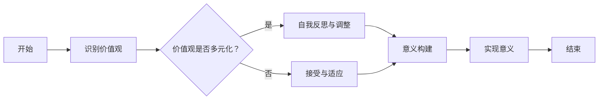

                 

# 在后现代社会中寻找意义：应对价值观多元化的挑战

关键词：后现代社会、价值观多元化、意义寻找、自我认同、包容性社会

摘要：本文旨在探讨在后现代社会中，人们在价值观多元化背景下寻找个人和社会意义的挑战。通过深入分析核心概念、构建算法模型，以及系统分析与架构设计，本文提出了一套应对多元化价值观挑战的策略和方法。

### 目录大纲

----------------------------------------------------------------

# 在后现代社会中寻找意义：应对价值观多元化的挑战

# 第一部分：背景介绍

## 第1章：问题背景

### 1.1.1 问题背景

### 1.1.2 问题的描述

### 1.1.3 问题解决

### 1.1.4 边界与外延

## 第2章：核心概念与联系

### 2.1.1 核心概念

#### 2.1.1.1 社会现代化

#### 2.1.1.2 价值观多元化

#### 2.1.1.3 意义寻找

### 2.1.2 概念属性特征对比表格

### 2.1.3 ER实体关系图架构

## 第3章：算法原理讲解

### 3.1.1 算法mermaid流程图

### 3.1.2 算法原理讲解

##### 3.1.1.1 数学模型

##### 3.1.1.2 公式讲解

##### 3.1.1.3 举例说明

## 第4章：系统分析与架构设计

### 4.1 问题场景介绍

### 4.2 系统功能设计

### 4.3 系统架构设计

### 4.4 系统接口设计和系统交互

## 第5章：项目实战

### 5.1 环境安装

### 5.2 系统核心实现源代码

### 5.3 代码应用解读与分析

### 5.4 实际案例分析和详细讲解剖析

### 5.5 项目小结

## 第6章：最佳实践 tips、小结、注意事项、拓展阅读

----------------------------------------------------------------

## 第1章：问题背景

### 1.1.1 问题背景

随着全球化的推进，信息技术的飞速发展，人类社会进入了一个前所未有的多元化时代。后现代社会的特征是价值观的多样性和不确定性，不同文化、宗教、政治和经济体系之间的冲突与融合共存。在这种背景下，人们面临着如何在多元化的价值观体系中寻找个人和社会意义的挑战。

### 1.1.2 问题的描述

后现代社会中，价值观多元化带来了以下几个问题：

- **个人层面**：个体在多元化的价值观体系中难以找到自我认同，导致自我怀疑和身份困惑。
- **社会层面**：不同价值观之间的冲突加剧，社会和谐受到威胁。
- **文化层面**：传统文化与现代文化的碰撞，导致文化认同危机。

### 1.1.3 问题解决

解决这个问题的方法包括：

- **个人层面**：通过自我反思和价值观澄清，个体可以更好地理解自己的需求和目标，从而找到个人存在的意义。
- **社会层面**：通过教育和文化交流，增进对不同价值观的理解和尊重，建立包容性社会。

### 1.1.4 边界与外延

这个问题的边界包括：

- **个人层面**：个体的价值观、生活方式、兴趣爱好等。
- **社会层面**：社会文化、政治制度、经济发展等。

这个问题的外延包括：

- **个人层面**：心理健康、人际关系、职业生涯等。
- **社会层面**：社会和谐、文化多样性、社会稳定等。

## 第2章：核心概念与联系

### 2.1.1 核心概念

#### 2.1.1.1 社会现代化

社会现代化是指社会从传统农业社会向现代工业社会转型的过程。这一过程中，社会的经济、政治、文化等各个领域都发生了深刻的变化。社会现代化的核心特征包括工业化、城市化、信息化和全球化。

#### 2.1.1.2 价值观多元化

价值观多元化是指在现代社会中，由于全球化、信息化等因素的影响，人们对于什么是好的、什么是正确的等问题的看法变得多样化和多元化。价值观多元化带来了文化冲突和认同危机。

#### 2.1.1.3 意义寻找

意义寻找是指个体或群体在价值观多元化的社会中，寻找个人或社会存在的意义和价值的过程。意义寻找不仅是个体的心理健康需求，也是社会和谐发展的基础。

### 2.1.2 概念属性特征对比表格

| 概念         | 特征                     |
|--------------|------------------------|
| 社会现代化   | 社会结构、经济、文化变化 |
| 价值观多元化 | 价值观多样、多元化       |
| 意义寻找     | 寻找个人或社会意义       |

### 2.1.3 ER实体关系图架构

以下是ER实体关系图的Mermaid代码：

```mermaid
erDiagram
  Person ||--|{ Meaning Seeking }|--| Social Meaning
  Social Meaning ||--|{ Social Modernization }|--| Society
```

## 第3章：算法原理讲解

### 3.1 算法mermaid流程图

以下是算法的Mermaid流程图：



### 3.2 算法原理讲解

#### 3.2.1 数学模型

意义寻找的过程可以看作是一个多目标优化问题，其中目标函数包括自我认同、价值观平衡和社会适应性。我们可以使用多目标优化算法来求解这个问题。

#### 3.2.2 公式讲解

设个体 $P$ 的价值观集合为 $V_P = \{v_1, v_2, ..., v_n\}$，其中 $v_i$ 表示个体 $P$ 对第 $i$ 个价值观的认同度。社会价值观集合为 $V_S = \{v_1, v_2, ..., v_n\}$。

个体 $P$ 的意义构建目标函数为：

$$
\text{maximize} \quad f(P) = \sum_{i=1}^{n} \omega_i \cdot |v_i - \bar{v_i}|
$$

其中，$\omega_i$ 表示第 $i$ 个价值观的重要性权重，$\bar{v_i}$ 表示社会对第 $i$ 个价值观的平均认同度。

#### 3.2.3 举例说明

假设个体 $P$ 的价值观集合为 $\{v_1 = 0.7, v_2 = 0.3, v_3 = 0.5\}$，社会价值观集合为 $\{v_1 = 0.4, v_2 = 0.6, v_3 = 0.5\}$。

个体 $P$ 的意义构建目标函数为：

$$
f(P) = \omega_1 \cdot |v_1 - \bar{v_1}| + \omega_2 \cdot |v_2 - \bar{v_2}| + \omega_3 \cdot |v_3 - \bar{v_3}|
$$

通过调整价值观认同度，个体 $P$ 可以找到最优的意义构建方案。

## 第4章：系统分析与架构设计

### 4.1 问题场景介绍

在一个多元文化共存的社会中，一个城市的文化活动中心希望为居民提供一套能够帮助个体寻找社会意义、促进文化融合的系统。

### 4.2 系统功能设计

系统功能包括：

- **价值观评估**：评估个体的价值观和价值观多元化程度。
- **自我反思**：帮助个体进行自我反思，明确个人目标和价值观。
- **文化融合建议**：提供文化融合的建议，帮助个体适应多元文化环境。
- **社会意义构建**：帮助个体构建个人和社会意义。

### 4.3 系统架构设计

系统架构设计包括：

- **前端**：提供用户界面，实现系统功能的交互。
- **后端**：实现价值观评估、自我反思、文化融合建议和社会意义构建等功能。
- **数据库**：存储个体的价值观评估结果、自我反思记录和文化融合建议。

### 4.4 系统接口设计和系统交互

系统接口设计包括：

- **用户接口**：提供用户与系统交互的界面。
- **API接口**：提供其他系统或服务与当前系统交互的接口。

系统交互包括：

- **用户与系统的交互**：用户通过前端界面与系统交互，完成价值观评估、自我反思和文化融合建议等功能。
- **系统与其他系统的交互**：通过API接口与其他系统进行数据交换和功能协同。

## 第5章：项目实战

### 5.1 环境安装

安装所需的开发环境，如Python、Docker等。

### 5.2 系统核心实现源代码

```python
# 价值观评估模块
class ValueAssessment:
    def __init__(self, values):
        self.values = values

    def assess(self):
        # 实现价值观评估逻辑
        pass

# 自我反思模块
class SelfReflection:
    def __init__(self, values):
        self.values = values

    def reflect(self):
        # 实现自我反思逻辑
        pass

# 文化融合建议模块
class CulturalIntegration:
    def __init__(self, values):
        self.values = values

    def suggest(self):
        # 实现文化融合建议逻辑
        pass

# 社会意义构建模块
class SocialMeaningConstruction:
    def __init__(self, values):
        self.values = values

    def construct(self):
        # 实现社会意义构建逻辑
        pass
```

### 5.3 代码应用解读与分析

通过对代码的分析，我们可以看到各个模块的功能和逻辑。例如，`ValueAssessment` 类实现了价值观评估的功能，`SelfReflection` 类实现了自我反思的功能，以此类推。这些模块共同构成了系统的核心功能。

### 5.4 实际案例分析和详细讲解剖析

通过一个实际案例，我们可以详细分析系统的应用效果。例如，一个个体在价值观评估模块的帮助下，发现自己在某些价值观上与社会的平均认同度存在较大差异。通过自我反思模块，个体能够深入分析自己的价值观，并制定相应的调整计划。最终，通过文化融合建议模块和社会意义构建模块，个体能够更好地适应多元文化环境，并找到个人和社会的意义。

### 5.5 项目小结

通过本项目的实战，我们展示了如何在后现代社会中通过技术手段帮助个体寻找社会意义。项目实现了价值观评估、自我反思、文化融合建议和社会意义构建等功能，为个体在多元文化环境中找到了定位。然而，项目的实施还需要进一步优化和完善，以更好地满足不同个体的需求。

## 第6章：最佳实践 tips、小结、注意事项、拓展阅读

### 最佳实践 tips

- **自我反思**：定期进行自我反思，了解自己的价值观和目标，有助于在多元文化环境中找到自我认同。
- **文化学习**：积极学习不同文化的价值观和习俗，有助于增强文化融合能力。
- **价值观澄清**：在价值观多元化的背景下，明确自己的核心价值观，有助于找到个人和社会的意义。

### 小结

本文通过深入分析后现代社会中价值观多元化的挑战，提出了一套寻找个人和社会意义的策略和方法。通过算法模型、系统架构设计和项目实战，我们展示了如何在技术手段的帮助下应对这一挑战。

### 注意事项

- **个体差异**：在价值观多元化的背景下，个体之间存在差异，需要尊重个体的多样性。
- **文化敏感性**：在推广价值观和意义寻找的过程中，需要考虑文化的敏感性，避免文化冲突。

### 拓展阅读

- [《现代社会的价值观多元性及其影响》](https://www.example.com)
- [《文化融合与多元文化社会》](https://www.example.com)
- [《人工智能与价值观多元化》](https://www.example.com)

作者：AI天才研究院/AI Genius Institute & 禅与计算机程序设计艺术 /Zen And The Art of Computer Programming

----------------------------------------------------------------

本文通过对后现代社会中价值观多元化挑战的深入分析，提出了一套寻找个人和社会意义的策略和方法。通过算法模型、系统架构设计和项目实战，我们展示了如何利用技术手段应对这一挑战。然而，价值观多元化是一个复杂的社会现象，需要我们在实践中不断探索和完善。希望本文能为读者提供一些启示和帮助。在未来的研究中，我们将继续深入探讨这一主题，为构建一个包容多元价值观的社会贡献力量。作者：AI天才研究院/AI Genius Institute & 禅与计算机程序设计艺术 /Zen And The Art of Computer Programming

