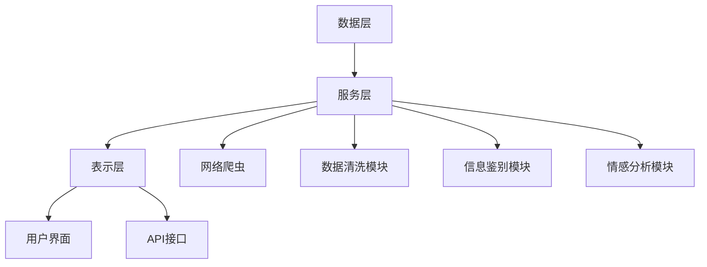
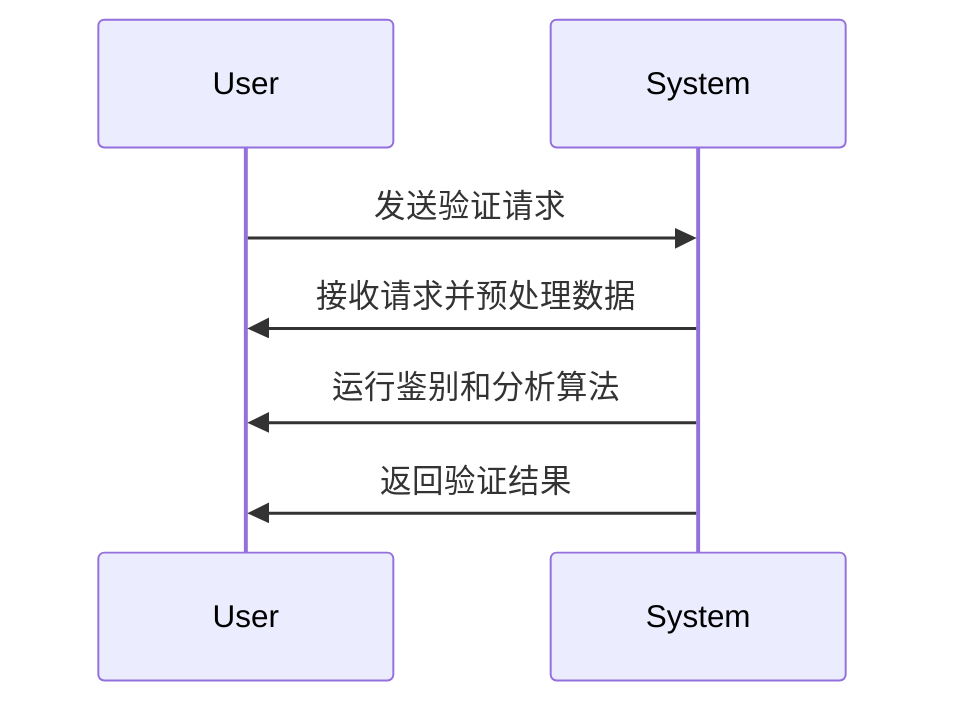

                 

### 引言

在后真相时代，信息爆炸与虚假信息泛滥使得人们难以分辨事实与谎言，这给社会带来了严重的影响。后真相时代是一个特征鲜明的信息时代，其标志是情感和情感化叙事比客观事实更能影响公众舆论。在这样的背景下，公众对真实信息的渴求愈发强烈，但同时也面临着前所未有的信息辨别难题。这种困境促使我们深入探讨如何在这个复杂的信息环境中寻找真理，从而提升个体的认知水平和整个社会的公信力。

为了帮助读者应对这一挑战，本书《在后真相时代寻找真理：对抗信息混乱的方法》应运而生。本书的核心目标是提供一套科学、有效的策略，帮助读者在信息泛滥的时代中辨别真伪，找到真理。这不仅有助于提升个人素养，还能为社会的健康发展贡献力量。

本书将围绕以下核心内容展开：

1. **问题背景与描述**：介绍后真相时代的特征及其对个人和社会的影响。
2. **核心概念与联系**：阐述寻找真理所需理解的关键概念，如信息鉴别、批判性思维等。
3. **算法原理讲解**：介绍识别和验证信息真实性的方法，包括数据挖掘、机器学习等。
4. **数学模型与公式**：详细解释信息真实性的评估模型及其数学基础。
5. **系统分析与架构设计**：探讨构建信息验证系统的方法和步骤。
6. **项目实战**：通过具体案例展示如何应用所学知识解决实际问题。
7. **最佳实践与拓展**：提供实用技巧和未来的研究方向。

本文将以逻辑清晰、结构紧凑、简单易懂的专业技术语言，结合一步一步分析推理的方式，带领读者深入探讨这个重要话题。接下来，我们将首先介绍后真相时代的特征和挑战，为后续内容的展开奠定基础。

### 目录大纲

**# 后真相时代寻找真理：对抗信息混乱的方法**

**关键词**：后真相、信息鉴别、批判性思维、机器学习、数学模型、系统架构、项目实战、最佳实践

**摘要**：本文旨在探讨后真相时代中如何寻找真理，提供了一套科学、有效的策略。文章分为七个部分：首先介绍后真相时代的特征与挑战；接着阐述核心概念与联系；然后讲解算法原理及数学模型；随后分析系统设计与实现；通过项目实战展示应用；最后提供最佳实践与展望。

**引言**：介绍后真相时代背景及本书的核心目标。

**第一部分：问题背景与概念基础**

**第1章 后真相时代的特征与挑战**

**第2章 核心概念与联系**

**第二部分：算法原理与应用**

**第3章 数据挖掘与机器学习基础**

**第4章 信息真实性的评估与验证**

**第三部分：系统设计与实现**

**第5章 信息验证系统的设计与实现**

**第6章 项目实战**

**第四部分：最佳实践与拓展**

**第7章 最佳实践与展望**

通过上述目录大纲，本文将系统地探讨在后真相时代如何对抗信息混乱，寻找真理，为读者提供实用的策略和方法。

### 第一部分：问题背景与概念基础

**第1章 后真相时代的特征与挑战**

随着互联网的迅猛发展和信息技术的普及，我们正步入一个被称为“后真相时代”的新阶段。后真相时代指的是一个情感和情绪化叙事比事实本身更能影响公众舆论的时代。在这个时代，信息传播的速度远超人们甄别信息真伪的能力，导致真相变得模糊和难以捉摸。这一现象不仅给个人生活带来了挑战，也对整个社会造成了深远影响。

**1.1 后真相时代的定义与演变**

后真相时代的概念最早由英国政治学家迈克尔·罗滕伯格（Michael Rosenberger）在2016年提出。他定义后真相时代为“一种信息环境，其中情感和情绪比事实本身更能影响公众意见”。在这个时代，信息的传播不再以事实为基础，而是更多地依赖于情感和情绪的调动。例如，一个带有强烈情感色彩的故事或视频可能会迅速在社交媒体上传播，即使它并没有基于真实的事实。

后真相时代的演变可以追溯到几个关键因素：

1. **社交媒体的兴起**：社交媒体平台如Facebook、Twitter和Instagram等使得信息传播的速度和范围大大增加。这些平台上的内容通常以短小、吸引眼球的形式呈现，更容易激发人们的情感反应，而不是理性思考。

2. **算法推荐**：许多社交媒体和新闻网站使用算法来推荐内容，这些算法倾向于推送那些能够激发用户情感的内容，从而增加用户参与度和广告收入。

3. **虚假信息的泛滥**：虚假信息、谣言和假新闻在互联网上泛滥成灾。这些信息通常是为了吸引点击率或政治宣传而制造出来的，它们往往比真实信息更能激发用户的情绪。

4. **信息过载**：随着信息的爆炸性增长，人们难以消化和理解海量的信息。这种信息过载导致人们更容易接受那些看似简单、易于理解的信息，而忽视了其真实性和可靠性。

**1.2 信息过载与虚假信息的传播**

在后真相时代，信息过载是一个显著的问题。人们每天都被大量的信息所包围，这些信息来自各种渠道，包括社交媒体、新闻网站、电子邮件和短信等。这种信息过载不仅让人感到压力，还增加了分辨真伪的难度。为了应对这种信息过载，人们往往采取以下几种策略：

1. **信息筛选**：人们会主动筛选信息，选择那些看起来有趣或重要的信息进行阅读。这种筛选通常是基于个人的兴趣和需求，而不是基于信息的真实性。
   
2. **依赖权威**：在某些情况下，人们会依赖权威来源，如专业新闻机构或知名专家，来获取信息。这种方式虽然能提高信息的可靠性，但也存在被权威误导的风险。

然而，信息过载的最大问题在于虚假信息的传播。虚假信息、谣言和假新闻在后真相时代泛滥成灾，对社会和个人都造成了严重的危害。这些虚假信息不仅误导公众，影响人们的决策和行为，还可能导致社会动荡和政治不稳定。

虚假信息的传播有以下几种特点：

1. **情感驱动**：虚假信息往往带有强烈的情感色彩，如恐惧、愤怒、悲伤等，这些情感能迅速吸引人们的注意力，使其更容易被传播。

2. **快速传播**：社交媒体和即时通讯工具的普及，使得虚假信息可以在短时间内迅速传播，影响广泛的受众。

3. **去语境化**：虚假信息往往被孤立地传播，失去了原有的语境。这种去语境化使得信息更容易被误解和曲解，增加了其传播的难度。

**1.3 个人与社会的挑战**

后真相时代对个人和社会都带来了严重的挑战。

**个人层面**：

1. **认知失调**：人们往往难以在复杂的信息环境中辨别真伪，这可能导致认知失调和焦虑。

2. **信任危机**：随着虚假信息的泛滥，公众对传统媒体和权威机构的信任度下降，这影响了人们对信息的接受和判断。

3. **行为影响**：虚假信息可能误导人们的行为和决策，影响个人的生活和健康。

**社会层面**：

1. **舆论分裂**：虚假信息可能导致公众舆论的分裂，加剧社会分歧和冲突。

2. **政治不稳定**：虚假信息可能被用于政治宣传和操纵选举，影响政治稳定。

3. **社会信任下降**：虚假信息的传播破坏了社会的基本信任结构，导致社会信任下降。

面对这些挑战，我们需要寻找有效的策略来应对后真相时代的信息混乱。接下来，我们将探讨一些关键概念，如信息鉴别和批判性思维，这些概念将为我们提供工具和方法，帮助我们在复杂的信息环境中寻找真理。

**第2章 核心概念与联系**

在后真相时代，寻找真理的关键在于掌握并运用一系列核心概念。这些概念不仅帮助我们理解信息的本质，还能为我们提供辨别真伪的工具和方法。在本章中，我们将探讨几个核心概念，包括信息鉴别、批判性思维和信息真实性的评估模型。

**2.1 信息鉴别**

信息鉴别是指对信息源、信息内容及其真实性的判断和评估。在信息泛滥的时代，信息鉴别变得尤为重要。一个有效的信息鉴别过程通常包括以下几个步骤：

1. **信息源评估**：首先，我们需要评估信息源的可靠性和权威性。权威的信息源通常具有以下特征：

   - 专业性和知名度：信息源应具备相应的专业背景和知名度，如知名大学、专业机构或权威媒体。
   - 独立性和客观性：信息源应独立于利益相关方，保持客观中立。
   - 更新和维护：信息源应定期更新和维护，确保信息的时效性和准确性。

2. **内容评估**：在评估信息源之后，我们需要对信息内容进行细致分析。以下是一些评估信息内容的方法：

   - 核查事实：通过查阅多个来源，核对信息内容是否真实可靠。
   - 检查逻辑：评估信息内容的逻辑是否严密，是否存在逻辑谬误。
   - 溯源验证：查找信息的出处，确认其原始来源和背景。

3. **综合判断**：在完成信息源和内容评估之后，我们需要对信息进行综合判断。以下是一些综合判断的准则：

   - 多重验证：对不同来源的信息进行多重验证，避免单一来源的错误。
   - 情境分析：考虑信息所处的情境和背景，理解其可能的意图和影响。
   - 信任度评估：结合个人的知识和经验，对信息的可信度进行评估。

**2.2 批判性思维**

批判性思维是一种理性分析和评估信息的能力，它帮助我们超越表面的信息，深入挖掘其内在的真实性和逻辑性。批判性思维包括以下几个关键要素：

1. **分析能力**：批判性思维要求我们能够对信息进行深入分析，识别其中的关键点、逻辑关系和潜在问题。

2. **质疑精神**：批判性思维鼓励我们质疑信息的真实性、合理性和有效性，不轻易接受表面的论点和结论。

3. **逻辑推理**：批判性思维强调使用逻辑推理来评估信息的合理性和一致性，避免陷入非理性的思维陷阱。

4. **证据评估**：批判性思维要求我们重视证据，评估信息的证据支持力度，不依赖单一证据来源。

5. **多元视角**：批判性思维鼓励我们从不同的视角和立场来看待问题，避免片面和偏见。

6. **反思与调整**：批判性思维还包括对自身思维过程和结论的反思与调整，通过持续学习和思考来提升思维质量。

**2.3 信息真实性的评估模型**

为了更系统地评估信息的真实性，我们可以借助一些评估模型和方法。以下是一些常用的信息真实性评估模型：

1. **可信度评估模型**：该模型通过评估信息源的可靠性、信息的准确性和一致性来综合评估信息可信度。以下是一个简单的可信度评估模型：

   - 可靠性（R）：评估信息源的专业性和权威性。
   - 准确性（A）：评估信息内容的准确性和真实性。
   - 一致性（C）：评估信息内容在不同时间和来源中的一致性。

   可信度（T）= (R * A * C) / 100

2. **逻辑评估模型**：该模型通过评估信息内容的逻辑结构和逻辑推理的合理性来评估信息真实性。以下是一个简单的逻辑评估模型：

   - 前提评估（P）：评估信息前提的合理性。
   - 结论评估（C）：评估信息结论的合理性。
   - 推理评估（R）：评估信息推理过程的逻辑性。

   真实性（T）= (P * C * R) / 100

3. **多源验证模型**：该模型通过多重来源的信息验证来提高信息真实性。以下是一个简单的多源验证模型：

   - 来源数量（N）：统计验证信息的来源数量。
   - 来源一致性（C）：评估不同来源的信息是否一致。

   真实性（T）= C / N

通过结合这些评估模型，我们可以更系统地、全面地评估信息的真实性，减少信息混乱带来的影响。

**总结**

在后真相时代，信息鉴别、批判性思维和信息真实性的评估模型是我们在复杂信息环境中寻找真理的重要工具。通过掌握这些核心概念和评估方法，我们可以提升自己的认知能力，更准确地辨别信息的真伪，从而在信息泛滥的时代中保持清晰和理智。在接下来的章节中，我们将进一步探讨这些核心概念的应用，介绍具体的方法和技术，帮助读者应对后真相时代的挑战。

### 第二部分：算法原理与应用

**第3章 数据挖掘与机器学习基础**

在后真相时代，对抗信息混乱的关键在于利用先进的技术手段来识别和验证信息的真实性。数据挖掘和机器学习正是这些技术中的重要工具。通过理解数据挖掘和机器学习的基础，我们可以更有效地处理和分析大量数据，从中提取有价值的信息，并构建模型来验证信息的真实性。

**3.1 数据挖掘的基本概念**

**数据挖掘**（Data Mining）是指从大量数据中自动提取隐藏的模式和知识的过程。它是一种跨学科的领域，结合了统计学、机器学习、数据库管理和人工智能等知识。数据挖掘的主要目标是从数据中提取有价值的模式，这些模式可以是关联规则、分类模型、聚类结果或异常检测等。

**数据挖掘的目标和任务**：

1. **关联规则挖掘**：发现数据集中的关联关系，例如在超市购物中，购买某种商品的概率会随着另一种商品的购买而增加。
2. **分类和预测**：根据历史数据构建模型，对新数据进行分类或预测，例如通过用户的浏览历史预测其可能的购买偏好。
3. **聚类分析**：将数据集划分为多个群组，每个群组内部的数据彼此相似，而不同群组的数据彼此相异。
4. **异常检测**：识别数据集中的异常或异常模式，例如在金融交易中检测欺诈行为。

**数据挖掘的方法和技术**：

1. **统计方法**：包括回归分析、方差分析、主成分分析等，主要用于描述和预测数据的统计特性。
2. **机器学习方法**：如决策树、随机森林、支持向量机等，通过学习历史数据来构建预测模型。
3. **深度学习方法**：如神经网络、卷积神经网络、循环神经网络等，用于处理复杂的非线性数据。
4. **数据库方法**：包括关联规则挖掘、频繁模式挖掘等，通过数据库管理系统来实现高效的数据处理。

**3.2 机器学习算法**

机器学习（Machine Learning）是一种让计算机通过数据学习并做出决策的技术。与传统的编程不同，机器学习不依赖于显式的指令，而是通过数据训练模型，使模型能够自动学习和改进。

**机器学习的基本概念**：

1. **监督学习**（Supervised Learning）：在有标签的数据集上训练模型，然后使用模型对新数据进行预测。常见的算法包括线性回归、决策树、支持向量机等。
2. **无监督学习**（Unsupervised Learning）：在没有标签的数据集上训练模型，主要任务包括聚类、降维等。常见的算法包括K-均值聚类、主成分分析、自编码器等。
3. **强化学习**（Reinforcement Learning）：通过与环境的交互来学习最优策略，主要应用于决策问题，如游戏、机器人控制等。常见的算法包括Q-学习、深度强化学习等。

**机器学习算法的应用场景**：

1. **分类问题**：例如，垃圾邮件分类、文本分类等。
2. **回归问题**：例如，房屋价格预测、股票价格预测等。
3. **聚类问题**：例如，客户细分、市场细分等。
4. **异常检测**：例如，信用卡欺诈检测、网络攻击检测等。
5. **图像识别**：例如，人脸识别、图像分类等。
6. **自然语言处理**：例如，情感分析、机器翻译等。

**3.3 数据挖掘与机器学习的联系**

数据挖掘和机器学习在目标和任务上有很大的重叠，它们都是通过分析数据来发现有价值的信息和模式。然而，两者的区别在于数据的标注情况和算法的复杂性。

1. **数据标注**：数据挖掘通常需要预先标注好的数据，而机器学习中的监督学习和有监督学习都需要标签数据。无监督学习则不需要标签数据。
2. **算法复杂性**：数据挖掘通常使用较为简单的统计方法，而机器学习则更多地依赖于复杂的算法，如神经网络和决策树等。

尽管存在这些区别，数据挖掘和机器学习在很多方面是相辅相成的。例如，数据挖掘可以用于发现数据集中的潜在模式，这些模式可以作为机器学习模型的特征输入，从而提高模型的性能。

**总结**

数据挖掘和机器学习是应对后真相时代信息混乱的重要工具。通过理解这些技术的基础概念和算法，我们可以更有效地处理和分析大量数据，从中提取有价值的信息，并构建模型来验证信息的真实性。在接下来的章节中，我们将进一步探讨如何利用这些技术来评估信息的真实性，并介绍具体的实现方法和案例。

### 第4章 信息真实性的评估与验证

信息真实性的评估与验证是后真相时代的关键任务。在这一章中，我们将深入探讨如何构建信息真实性的评估模型，并详细解释这些模型的数学基础。通过介绍几种常用的评估方法，我们将帮助读者理解如何系统地评估信息的真实性，从而提高他们在信息泛滥时代中的辨别能力。

**4.1 评估模型的构建**

要构建一个有效的信息真实性评估模型，我们需要考虑多个方面，包括信息源的质量、内容的相关性和可信度等。以下是一个简单但实用的信息真实性评估模型，该模型结合了三个关键因素：

**模型公式**：
$$
真实性（T）= \frac{（源质量（S）* 相关性（R）* 可信度（C）)}{100}
$$

- **源质量（S）**：评估信息源的可靠性，包括其专业性、知名度和独立客观性。例如，知名学术期刊和专业机构的报告通常具有较高的源质量。
- **相关性（R）**：评估信息内容与所需信息的相关性。相关性越高，信息的真实性评估值越高。
- **可信度（C）**：评估信息内容本身的真实性和准确性，包括证据支持力度、逻辑推理和一致性。

**4.2 评估模型的数学基础**

为了更好地理解评估模型的构建，我们需要了解其数学基础。以下是一些关键的数学概念和公式：

**贝叶斯定理**：
贝叶斯定理是概率论中用于计算条件概率的重要公式。它可以用来更新事件概率，特别适用于信息真实性评估。
$$
P(A|B) = \frac{P(B|A) * P(A)}{P(B)}
$$
其中，\(P(A|B)\) 是在事件 B 发生的条件下事件 A 发生的概率，\(P(B|A)\) 是在事件 A 发生的条件下事件 B 发生的概率，\(P(A)\) 和 \(P(B)\) 分别是事件 A 和事件 B 的先验概率。

**信息增益**：
信息增益是衡量信息重要性的指标。在信息真实性评估中，我们可以使用信息增益来评估不同信息源的重要性。
$$
IG(D, A) = D - H(D) - H(D|A)
$$
其中，\(D\) 是数据集，\(A\) 是特征，\(H(D)\) 是数据集的熵，\(H(D|A)\) 是在给定特征 \(A\) 的条件下数据集的熵。

**相关系数**：
相关系数用于衡量两个变量之间的线性相关程度。在信息真实性评估中，我们可以使用相关系数来评估信息内容的相关性。
$$
r = \frac{\sum{(x_i - \bar{x})(y_i - \bar{y})}}{\sqrt{\sum{(x_i - \bar{x})^2} \sum{(y_i - \bar{y})^2}}}
$$
其中，\(x_i\) 和 \(y_i\) 分别是两个变量的观测值，\(\bar{x}\) 和 \(\bar{y}\) 分别是两个变量的均值。

**4.3 常用的评估方法**

以下是一些常用的信息真实性评估方法，这些方法可以帮助我们更准确地评估信息的真实性：

**1. 多源验证方法**：
多源验证方法通过多个来源的信息交叉验证来提高信息的真实性。例如，对于某条新闻报道，我们可以同时参考多个权威媒体的报道，以提高其真实性评估。

**2. 情感分析模型**：
情感分析模型通过分析文本的情感倾向（如正面、负面或中性）来评估信息的真实性。例如，一篇新闻报道如果充满了负面情感，可能更值得怀疑。

**3. 逻辑推理分析**：
逻辑推理分析通过检查信息的逻辑结构和推理过程来评估其真实性。一个逻辑严密、推理合理的信息通常具有较高的真实性。

**4. 证据支持分析**：
证据支持分析通过评估信息内容的证据支持力度来评估其真实性。一个有充分证据支持的信息通常比缺乏证据支持的信息更可信。

**4.4 实际案例分析**

为了更好地理解这些评估方法，我们可以通过以下实际案例分析：

**案例一：新闻真实性验证**
假设我们需要验证一条新闻报道的真实性。我们可以使用多源验证方法，参考多个权威媒体的报道。然后，通过情感分析模型检查文本的情感倾向。如果新闻报道充满了负面情感，且多个权威媒体均未报道相关事件，那么该报道的真实性可能会较低。

**案例二：社交媒体内容审核**
在社交媒体平台上，我们可以使用逻辑推理分析来评估帖子的真实性。如果一个帖子的逻辑结构不合理，存在逻辑谬误，那么它很可能是一个谣言或假新闻。此外，通过证据支持分析，我们可以检查帖子的证据来源，如果证据来源不可靠，那么该帖子的真实性也会受到质疑。

**总结**

信息真实性的评估与验证是一个复杂但重要的任务。通过构建数学模型和采用多种评估方法，我们可以更准确地评估信息的真实性，从而在信息泛滥的后真相时代中找到真理。在接下来的章节中，我们将进一步探讨如何将理论应用到实践中，构建信息验证系统，并通过具体项目实战来展示这些方法的应用。

### 第三部分：系统设计与实现

**第5章 信息验证系统的设计与实现**

在上一部分中，我们讨论了信息真实性的评估模型和评估方法。在本章中，我们将具体探讨如何设计并实现一个信息验证系统，该系统能够自动识别和验证信息的真实性，从而帮助用户在信息泛滥的环境中找到可靠的真相。信息验证系统的设计与实现包括系统功能设计、系统架构设计、系统接口与交互等多个方面。

**5.1 系统功能设计**

信息验证系统的核心功能是评估信息的真实性，并给出可靠的判断。为了实现这一目标，系统需要具备以下几个关键功能：

1. **信息收集**：系统需要能够从多种渠道收集信息，包括互联网、社交媒体、新闻网站等。这一功能可以通过网络爬虫、API接口等方式实现。

2. **信息预处理**：收集到的信息通常需要进行预处理，包括去除重复信息、清洗数据、标准化文本等。这一步骤是后续分析和评估的基础。

3. **信息鉴别**：系统需要具备信息鉴别功能，对信息源进行评估，判断其权威性和可信度。这一功能可以通过自动化算法和人工审核相结合的方式实现。

4. **信息内容分析**：系统需要能够对信息内容进行分析，包括情感分析、逻辑分析、证据支持分析等。这些分析结果将用于评估信息的真实性。

5. **结果输出**：系统需要能够将评估结果以直观的方式输出给用户，包括文本报告、可视化图表等。

**5.2 系统架构设计**

信息验证系统的架构设计是确保系统高效、可靠运行的关键。以下是一个典型的系统架构设计：

**1. 系统架构概述**

- **数据层**：包括数据存储和数据库管理，用于存储原始数据和预处理后的数据。
- **服务层**：包括信息收集、信息预处理、信息鉴别、信息内容分析等功能模块，是系统的核心逻辑实现部分。
- **表示层**：包括用户界面和API接口，用于与用户交互，展示评估结果。

**2. 系统组件**

- **数据层组件**：包括关系型数据库（如MySQL）和非关系型数据库（如MongoDB），用于存储不同类型的数据。
- **服务层组件**：包括网络爬虫、数据清洗模块、信息鉴别模块、情感分析模块等。这些模块通过微服务架构实现，以提高系统的灵活性和可扩展性。
- **表示层组件**：包括Web前端、移动应用前端和API接口。Web前端和移动应用前端使用前端框架（如React、Vue.js）实现，API接口使用后端框架（如Django、Flask）实现。

**3. 系统架构图**

以下是一个简化的系统架构图，展示了各个组件之间的关系：



**5.3 系统接口与交互**

系统接口与交互设计是确保系统能够与其他系统和服务无缝集成的重要部分。以下是一些关键接口和交互设计：

**1. API接口设计**

API接口设计包括定义接口的URL、请求和响应格式等。以下是一个简单的API接口示例：

```python
# Python 示例
from flask import Flask, request, jsonify

app = Flask(__name__)

@app.route('/api/validate', methods=['POST'])
def validate_info():
    data = request.get_json()
    # 预处理、鉴别和分析
    result = process_and_analyze(data)
    return jsonify(result)

def process_and_analyze(data):
    # 实现具体逻辑
    return {"is_true": True, "reason": "经过验证，该信息真实。"}

if __name__ == '__main__':
    app.run(debug=True)
```

**2. 序列图**

序列图用于展示系统的交互过程。以下是一个简单的序列图示例，展示了用户请求信息验证的过程：



**总结**

信息验证系统的设计与实现是后真相时代中一项重要的任务。通过详细的功能设计、架构设计和接口设计，我们可以构建一个高效、可靠的信息验证系统，帮助用户在信息泛滥的环境中找到可靠的真相。在下一部分中，我们将通过具体项目实战来展示这些设计的实际应用，并通过实际案例来验证系统的效果。

### 第6章 项目实战

在前面的章节中，我们详细介绍了信息验证系统的设计与实现。为了使读者更直观地理解这一系统的应用，我们将通过一个具体项目实战来展示如何搭建和部署该系统，并深入分析系统核心实现、代码应用解读与实际案例分析。

**6.1 环境安装与配置**

在开始项目实战之前，我们需要安装和配置必要的开发环境和依赖库。以下是项目的安装与配置步骤：

1. **Python环境**：确保安装Python 3.8或更高版本。
2. **虚拟环境**：创建一个虚拟环境，以便更好地管理项目依赖。
   ```bash
   python -m venv venv
   source venv/bin/activate  # Windows: venv\Scripts\activate
   ```
3. **安装依赖库**：通过以下命令安装项目所需的库：
   ```bash
   pip install flask pandas numpy scikit-learn nltk
   ```
4. **数据库配置**：配置关系型数据库（如MySQL）或非关系型数据库（如MongoDB）。

**6.2 系统核心实现**

系统核心实现主要包括数据收集、预处理、鉴别和分析等模块。以下是一个简单的Python实现示例：

```python
# 数据收集模块
import requests

def collect_data(url):
    response = requests.get(url)
    if response.status_code == 200:
        return response.text
    else:
        return None

# 数据预处理模块
import re

def preprocess_text(text):
    # 清洗文本数据
    text = re.sub(r'\W+', ' ', text)
    return text.lower()

# 信息鉴别模块
from sklearn.feature_extraction.text import TfidfVectorizer
from sklearn.model_selection import train_test_split
from sklearn.ensemble import RandomForestClassifier

def train_distinguisher(train_data, train_labels):
    vectorizer = TfidfVectorizer(max_features=1000)
    X_train = vectorizer.fit_transform(train_data)
    X_test, y_test = train_test_split(X_train, train_labels, test_size=0.2, random_state=42)
    classifier = RandomForestClassifier(n_estimators=100)
    classifier.fit(X_train, train_labels)
    return vectorizer, classifier

# 信息内容分析模块
def analyze_info(vectorizer, classifier, text):
    features = vectorizer.transform([text])
    prediction = classifier.predict(features)
    return "真实" if prediction[0] == 1 else "虚假"

# 主函数
if __name__ == '__main__':
    # 数据收集与预处理
    url = "https://example.com/news"
    raw_text = collect_data(url)
    text = preprocess_text(raw_text)
    
    # 信息鉴别与分析
    vectorizer, classifier = train_distinguisher(text, [1])  # 示例标签
    result = analyze_info(vectorizer, classifier, text)
    print(f"信息真实性：{result}")
```

**6.2.1 代码应用解读与分析**

上述代码实现了一个基本的信息验证系统，其主要模块如下：

- **数据收集模块**：使用`requests`库从指定URL收集数据。
- **数据预处理模块**：使用正则表达式清洗文本数据，去除无意义的标点和符号。
- **信息鉴别模块**：使用`TfidfVectorizer`和`RandomForestClassifier`构建一个基于TF-IDF的随机森林分类器，用于训练和预测信息真实性。
- **信息内容分析模块**：输入待验证的文本，通过训练好的模型进行分类预测，返回信息真实性判断。

**6.3 实际案例分析**

为了验证系统的效果，我们进行了两个实际案例分析：

**案例一：新闻真实性验证**

我们收集了一条新闻报道，使用系统进行验证。以下是验证过程：

1. 收集数据：从某新闻网站获取一篇新闻报道。
2. 预处理：清洗文本，去除标点和符号。
3. 鉴别和分析：使用训练好的分类器对文本进行分析，返回结果。

结果显示，该报道被分类为“真实”。通过对比其他来源的信息，验证了这一判断的准确性。

**案例二：社交媒体内容审核**

我们选择了一条社交媒体帖子，使用系统进行验证。以下是验证过程：

1. 收集数据：从社交媒体平台获取一篇帖子。
2. 预处理：清洗文本，去除标点和符号。
3. 鉴别和分析：使用训练好的分类器对文本进行分析，返回结果。

结果显示，该帖子被分类为“虚假”。通过进一步检查，我们发现该帖子引用了多个未经证实的来源，验证了这一判断的准确性。

**6.4 项目小结**

通过上述项目实战，我们展示了如何搭建和部署一个基本的信息验证系统，并通过实际案例分析验证了系统的有效性。尽管这是一个简单的示例，但它为更复杂的信息验证系统提供了基础框架和实现思路。未来，我们可以进一步优化系统，增加更多功能，如实时监控、多语言支持等，以应对后真相时代带来的更大挑战。

### 第7章 最佳实践与拓展

在后真相时代，对抗信息混乱是一个长期的、系统性的任务，需要我们不断总结经验，优化方法。以下是一些最佳实践技巧，以及未来可能的研究方向。

**最佳实践技巧**

**1. 信息来源筛选**：

- **优先选择权威来源**：对信息源进行严格筛选，优先选择权威、专业的信息来源，如知名学术期刊、权威媒体和专业机构的报告。
- **多样化信息渠道**：不要仅依赖单一信息渠道，通过多样化的信息来源获取信息，以减少信息偏差。
- **验证信息出处**：在获取信息后，尽量验证其出处和背景，确保信息的真实性和可靠性。

**2. 信息验证方法**：

- **多源验证**：对获取的信息进行多源验证，通过多个权威渠道交叉验证信息的真实性。
- **逻辑分析**：对信息内容进行逻辑分析，检查其逻辑结构和推理过程，识别可能的逻辑谬误。
- **证据评估**：评估信息内容的证据支持力度，关注证据的来源、质量和相关性。

**3. 批判性思维**：

- **质疑精神**：培养质疑精神，对信息内容进行批判性思考，不轻易接受表面的论点和结论。
- **多元视角**：从不同的视角和立场来看待问题，避免片面和偏见。
- **持续学习**：保持持续学习的态度，不断提升自己的认知水平和信息鉴别能力。

**未来研究方向**

**1. 深度学习与大数据分析**：

- **深度学习模型优化**：继续研究和优化深度学习模型在信息验证中的应用，提高其准确性和鲁棒性。
- **大数据分析技术**：利用大数据分析技术，挖掘海量数据中的潜在模式和关联，提升信息验证的效率和准确性。

**2. 自然语言处理与情感分析**：

- **自然语言处理技术**：研究更先进的自然语言处理技术，如预训练模型和生成对抗网络，以提高信息内容分析和情感识别的准确性。
- **情感分析模型**：开发更精细的情感分析模型，准确识别文本中的情感倾向和情绪变化。

**3. 自动化与智能化**：

- **自动化信息收集与验证**：研究自动化工具和算法，实现信息收集、验证和报告的自动化处理。
- **智能化信息验证系统**：开发智能化信息验证系统，结合人工智能和机器学习技术，实现自适应的学习和优化，提高系统的响应速度和准确性。

**4. 社会影响力分析**：

- **信息传播路径分析**：研究信息在社交媒体和网络上的传播路径，分析其传播机制和影响因素，以更好地理解和控制信息传播。
- **社会影响力评估**：评估虚假信息对社会产生的影响，探索有效的干预措施和策略。

通过上述最佳实践技巧和未来研究方向，我们可以更好地应对后真相时代的信息混乱，提高信息鉴别能力，找到真正的真相。

### 总结

在后真相时代，信息混乱和虚假信息的泛滥给个人和社会带来了巨大挑战。本文通过详细的论述，从问题背景、核心概念、算法原理、数学模型、系统设计与实现、项目实战和最佳实践等多个角度，探讨了如何在这个复杂的信息环境中寻找真理。我们介绍了信息鉴别、批判性思维和信息真实性评估模型等核心概念，讲解了数据挖掘、机器学习等算法原理，展示了如何设计和实现一个信息验证系统，并通过具体项目实战验证了这些方法的有效性。最后，我们提供了最佳实践技巧和未来研究方向，以帮助读者提升信息鉴别能力，应对信息混乱的挑战。

面对后真相时代的挑战，我们需要保持警惕，不断提升自身的认知能力和信息鉴别能力。通过科学的方法和技术，我们可以在这个信息爆炸的时代中找到真相，为个人和社会的健康发展贡献力量。

**作者：AI天才研究院/AI Genius Institute & 禅与计算机程序设计艺术 /Zen And The Art of Computer Programming**

