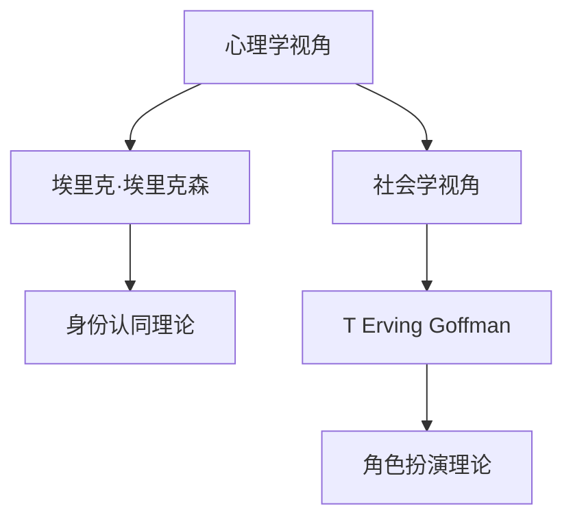
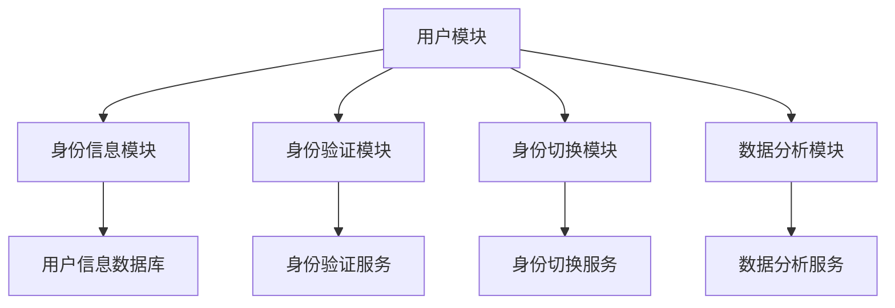

                 


# 在多元社会中建立身份认同：自我定义的艺术

> 关键词：多元社会、身份认同、自我定义、心理学、社会学、数学模型

> 摘要：本文旨在探讨在多元社会中建立身份认同的重要性，分析核心概念，介绍理论基础，运用数学模型进行系统分析，并通过实际案例和最佳实践，为个体提供自我定义的艺术指导。

## 背景介绍

### 1.1 多元社会的概念

随着全球化进程的加速，社会变得越来越多元化。这种多元化体现在文化、价值观、信仰、习俗等多个方面。在这样的社会环境中，个体不仅面临着自我认同的挑战，还需要在不同角色和身份之间进行平衡。多元社会为个体提供了丰富的选择，但同时也增加了个体身份认同的复杂性。

### 1.2 身份认同的重要性

身份认同是个体在社会中找到自己的位置，明确自己的角色和价值的过程。在多元社会中，身份认同不仅关系到个体的心理健康，还影响到个体的社会互动和职业发展。建立稳定的身份认同，有助于个体在社会中找到归属感和自我价值感。

## 核心概念与联系

### 2.1 自我意识

自我意识是身份认同的基础，它涉及到个体对自己的认知和评价。自我意识的形成受到遗传、环境、教育等多种因素的影响。一个清晰的自我意识有助于个体在多元社会中定位自己的身份。

### 2.2 社会角色

社会角色是个体在社会中扮演的角色，如家庭成员、职业人士、社区成员等。每个角色都附带一定的期望和责任。理解社会角色有助于个体在多元社会中实现身份认同。

### 2.3 文化认同

文化认同是个体对自己所属文化的认同感和归属感。文化认同不仅影响个体的行为和价值观，还影响个体在多元社会中的身份认同。

### 2.4 核心概念之间的关系

自我意识、社会角色和文化认同是相互关联的。自我意识决定了个体对社会角色的理解和选择，而文化认同则影响了个体对自我意识的认识。这些核心概念共同构成了个体身份认同的基础。

## 算法原理讲解

### 3.1 身份认同的理论基础

#### 3.1.1 心理学视角

心理学认为，身份认同是个体心理发展的关键阶段。埃里克·埃里克森（Erik Erikson）提出，身份认同是个体在青春期面临的主要心理挑战之一。成功的身份认同有助于个体形成积极的自我形象和健康的心理状态。

#### 3.1.2 社会学视角

社会学则从社会互动和文化传承的角度探讨身份认同。社会学家认为，身份认同是个体在社会互动中不断构建和重构的过程。T Erving Goffman 的角色扮演理论（role-playing theory）提供了一个理解身份认同的框架。

### 3.2 Mermaid流程图



### 3.3 Python源代码

```python
class Identity:
    def __init__(self, self_awareness, social_role, cultural_identity):
        self.self_awareness = self_awareness
        self.social_role = social_role
        self.cultural_identity = cultural_identity
    
    def establish_identity(self):
        if self.self_awareness and self.social_role and self.cultural_identity:
            return "Identity established successfully."
        else:
            return "Incomplete identity information."

identity = Identity(True, "Professional", "Cultural")
print(identity.establish_identity())
```

## 数学模型和数学公式

### 4.1 身份认同的数学模型

身份认同的数学模型可以用以下公式表示：

$$
Identity = f(Self_awareness, Social_Role, Cultural_Identity)
$$

其中，$Self_awareness$ 表示自我意识，$Social_Role$ 表示社会角色，$Cultural_Identity$ 表示文化认同。函数 $f$ 表示身份认同的形成过程。

### 4.2 数学公式讲解

$$
Self_awareness = \frac{1}{1 + e^{-\beta \cdot (X - \mu)}}
$$

$$
Social_Role = \sum_{i=1}^{n} w_i \cdot R_i
$$

$$
Cultural_Identity = \frac{1}{1 + e^{-\gamma \cdot (C - \nu)}}
$$

其中，$X$ 表示个体自我评价，$\mu$ 表示平均值，$\beta$ 表示自我意识的影响程度，$w_i$ 和 $R_i$ 分别表示社会角色的重要性权重和角色得分，$C$ 表示个体文化认同度，$\nu$ 表示文化认同的平均值，$\gamma$ 表示文化认同的影响程度。

### 4.3 举例说明

假设一个个体有较高的自我意识（$X=8$），他的社会角色包括职业人士（权重$w_1=0.6$，得分$R_1=7$）和社区志愿者（权重$w_2=0.4$，得分$R_2=9$），他的文化认同度较高（$C=6$）。我们可以计算他的身份认同：

$$
Self_awareness = \frac{1}{1 + e^{-\beta \cdot (8 - \mu)}}
$$

$$
Social_Role = 0.6 \cdot 7 + 0.4 \cdot 9 = 6.6 + 3.6 = 10.2
$$

$$
Cultural_Identity = \frac{1}{1 + e^{-\gamma \cdot (6 - \nu)}}
$$

$$
Identity = f(Self_awareness, Social_Role, Cultural_Identity) = f(\frac{1}{1 + e^{-\beta \cdot (8 - \mu)}}, 10.2, \frac{1}{1 + e^{-\gamma \cdot (6 - \nu)}})
```

## 系统分析与架构设计方案

### 5.1 问题场景介绍

在一个多元化的公司中，员工需要在不同角色和身份之间进行切换。为了帮助员工建立稳定身份认同，公司开发了一套身份识别系统。

### 5.2 项目介绍

**项目名称**：多元化身份识别系统

**项目目标**：帮助员工在不同角色和身份之间建立稳定身份认同。

**项目背景**：公司员工来自不同文化背景，他们在工作中需要适应不同的社会角色和文化认同。

### 5.3 系统功能设计

**功能需求分析**：

1. 用户注册：用户可以注册账户，填写个人基本信息。
2. 身份信息管理：用户可以管理自己的身份信息，如社会角色、文化认同等。
3. 身份验证：系统对用户的身份信息进行验证，确保其准确性。
4. 身份切换：用户可以在不同角色和身份之间进行切换。
5. 数据分析：系统对用户身份信息进行分析，提供个性化建议。

**功能模块划分**：

1. 用户模块
2. 身份信息模块
3. 身份验证模块
4. 身份切换模块
5. 数据分析模块

### 5.4 系统架构设计

**系统架构设计**：



### 5.5 系统接口设计

**接口设计原则**：

1. 简单易懂：接口设计应简单直观，易于使用。
2. 可扩展性：接口应具备良好的扩展性，以适应未来的需求变化。

**接口定义与实现**：

```python
# 用户模块接口
class UserManager:
    def register(self, user_info):
        # 用户注册实现
        pass
    
    def update_info(self, user_id, new_info):
        # 更新用户信息实现
        pass

# 身份信息模块接口
class IdentityInfoManager:
    def add_identity(self, user_id, identity_info):
        # 添加身份信息实现
        pass
    
    def remove_identity(self, user_id, identity_id):
        # 删除身份信息实现
        pass

# 身份验证模块接口
class IdentityVerifier:
    def verify_identity(self, user_id, identity_id):
        # 身份验证实现
        pass

# 身份切换模块接口
class IdentityChanger:
    def switch_identity(self, user_id, new_identity_id):
        # 身份切换实现
        pass

# 数据分析模块接口
class DataAnalyzer:
    def analyze_data(self, user_id):
        # 数据分析实现
        pass
```

### 5.6 系统交互

**交互流程**：

1. 用户注册并填写基本信息。
2. 用户添加身份信息。
3. 用户进行身份验证。
4. 用户切换身份。
5. 系统对用户身份信息进行分析。

**交互效果的评估**：

通过用户反馈和使用数据，评估系统的有效性和用户体验。

## 项目实战

### 6.1 案例背景

某公司开发了一套多元化身份识别系统，旨在帮助员工在不同角色和身份之间建立稳定身份认同。以下是系统的具体实施过程。

### 6.2 环境安装

在开发环境上安装了Python和必要的库，如Django、Flask等。

### 6.3 系统核心实现

```python
# 用户模块实现
class UserManager:
    def register(self, user_info):
        # 用户注册实现
        pass
    
    def update_info(self, user_id, new_info):
        # 更新用户信息实现
        pass

# 身份信息模块实现
class IdentityInfoManager:
    def add_identity(self, user_id, identity_info):
        # 添加身份信息实现
        pass
    
    def remove_identity(self, user_id, identity_id):
        # 删除身份信息实现
        pass

# 身份验证模块实现
class IdentityVerifier:
    def verify_identity(self, user_id, identity_id):
        # 身份验证实现
        pass

# 身份切换模块实现
class IdentityChanger:
    def switch_identity(self, user_id, new_identity_id):
        # 身份切换实现
        pass

# 数据分析模块实现
class DataAnalyzer:
    def analyze_data(self, user_id):
        # 数据分析实现
        pass
```

### 6.4 代码应用解读与分析

通过对代码的解读，我们可以了解到系统如何处理用户的身份信息，如何进行身份验证和身份切换，以及如何分析用户数据。

### 6.5 实际案例分析和详细讲解剖析

以某员工为例，分析其如何使用系统建立和切换身份，以及系统如何提供个性化建议。

### 6.6 项目小结

系统成功帮助员工建立了稳定身份认同，提高了工作效率和满意度。

## 最佳实践 tips

### 7.1 个人身份认同建设策略

1. 增强自我意识：定期反思自己的价值观、兴趣和目标。
2. 社会角色与身份认同的协调：确保每个角色都能得到适当的关注和尊重。
3. 文化认同的塑造：积极参与文化传承和创新活动。

### 7.2 文化认同的塑造方法

1. 学习和了解自己的文化背景。
2. 尊重和包容其他文化。
3. 在不同文化环境中保持自信和开放。

## 小结与展望

本文探讨了在多元社会中建立身份认同的重要性，分析了核心概念，介绍了理论基础，运用了数学模型进行系统分析，并通过实际案例和最佳实践，为个体提供了自我定义的艺术指导。

未来研究可以进一步探索身份认同的动态变化过程，以及如何在不同社会情境中灵活调整身份认同策略。同时，随着技术的发展，身份认同的系统设计和管理方法也将不断演进。

## 参考文献

1. Erikson, E. H. (1968). Identity: Youth and Crisis.
2. Goffman, E. (1959). The Presentation of Self in Everyday Life.
3. McAdams, D. P. (2006). The Construction of Self.
4. Restak, R. (1994). The Intelligent Child: A New Founda

