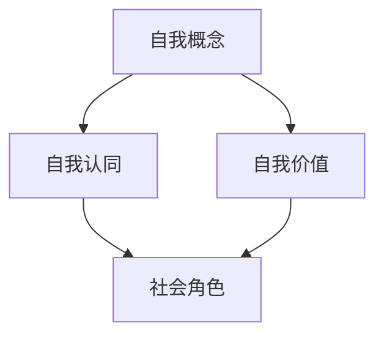

                 

# 在多重角色中寻找核心自我：身份认同探索

## 关键词
- 身份认同
- 多重角色
- 自我探索
- 社会角色
- 心理学
- 算法原理

## 摘要
本文旨在探讨如何在多种社会角色中维持自我认同。随着社会变迁和职业发展的多样性，个人往往需要在不同的角色间转换，这给身份认同带来了挑战。本文首先介绍了身份认同的核心概念，随后分析了多重角色对身份认同的影响，并通过理论与实践案例，提供了寻找核心自我的方法。最后，文章总结了身份认同的挑战与应对策略，为读者提供了一份自我探索的指南。

## 引言

在快节奏的现代社会，个体往往需要在多重角色之间转换，比如职场专业人士、家庭成员、社区志愿者等。每种角色都赋予个人不同的责任和期望，而这些期望有时可能与个人的内在价值观和身份认同相冲突。身份认同是一个深层次的概念，涉及到个体如何理解自我，如何在社会中定位自身。

### 1.1 身份认同的重要性

身份认同不仅影响个人的心理健康，还影响其社会行为。当个体能够清晰认识到自己的身份时，他们更容易建立自尊和自信。此外，身份认同与归属感密切相关，有助于个体在复杂的社会环境中找到自己的位置。

### 1.2 多重角色与核心自我的关系

在多重角色中，核心自我是指那些在所有角色中始终保持不变的基本特质。核心自我不仅提供个体身份的稳定性，也是个体在角色冲突中寻找平衡的关键。

### 1.3 本书结构概述

本书分为七个章节，首先介绍身份认同的概念与背景，接着探讨核心概念与联系，随后通过理论与案例分析，提供寻找核心自我的方法。第五、六章分别讨论自我认同实践与探索，以及身份认同的挑战与应对。最后，总结本书的主要观点，并展望未来的研究方向。

## 身份认同的概念与背景

### 2.1 身份认同的定义与核心要素

身份认同是指个体对于自己的认知和定位，包括自我形象、价值观、信仰和行为准则。核心要素包括自我意识、社会角色、文化背景和价值观。

### 2.2 社会角色与身份认同的关系

社会角色是身份认同的重要组成部分。每种角色都赋予个体不同的期望和责任，这可能会影响个体的自我认同。例如，一个职场人士可能需要在工作中表现出专业和严谨，而在家庭生活中则可能需要表现出关爱和温暖。

### 2.3 当代社会中身份认同的挑战

在当代社会，身份认同面临着诸多挑战，如社会多元化、职业流动性、文化冲突等。这些挑战使得个体在多重角色之间找到核心自我变得更加困难。

## 核心概念与联系

### 3.1 自我概念、自我认同与自我价值

自我概念是个体对自己本质的认知，自我认同是个体对于自己身份的认同，而自我价值是个体对自己价值的判断。这些概念相互联系，共同构成了个体的身份认同。

### 3.2 社会角色多样性对身份认同的影响

社会角色的多样性增加了个体身份认同的复杂性。个体需要在不同的角色中找到平衡，这可能会对核心自我产生影响。

### 3.3 核心概念属性特征对比表格

为了更好地理解自我概念、自我认同与自我价值之间的关系，我们可以通过一个对比表格来分析这些概念的核心属性特征。

| 概念             | 定义                                                       | 核心属性特征                          |
|------------------|------------------------------------------------------------|--------------------------------------|
| 自我概念         | 对自己本质的认知                                           | 主观性、多样性、动态性                |
| 自我认同         | 对自己身份的认同                                           | 稳定性、社会性、多样性                |
| 自我价值         | 对自己价值的判断                                           | 主观性、社会性、相对性                |

### 3.4 ER实体关系图架构的Mermaid流程图

为了更直观地展示核心概念之间的关系，我们可以使用Mermaid流程图来绘制ER（实体关系）图。



在这个ER图中，自我概念、自我认同和自我价值都是核心实体，它们通过自我价值与社交角色相连，展示了这些概念在个体身份认同中的关键作用。

## 理论与案例分析

### 4.1 社会学、心理学对身份认同的理论探讨

社会学家和心理学家对身份认同有着深入的理论探讨。社会学家强调社会结构和角色期望对身份认同的影响，而心理学家则关注个体内在认知和心理过程。例如，埃里克·埃里克森提出的社会化理论认为，个体在不同阶段面临不同的身份危机，通过解决这些危机，个体逐渐形成稳定的身份认同。

### 4.2 多重角色的身份认同案例研究

在一个案例研究中，一位职业女性在职场中是一个高效的经理，在家庭中是一个充满爱心的母亲，在社区中是一个积极参与的志愿者。她通过自我反思和与他人的交流，逐渐认识到自己的核心自我，并在多重角色中找到了平衡。

### 4.3 算法原理讲解与Mermaid流程图

为了帮助个体在多重角色中寻找核心自我，我们可以使用一种名为“角色映射”的算法。这个算法的基本原理是将个体的每个角色映射到其核心特质上，通过比较不同角色的映射结果，找到核心自我。

```python
def role_mapping(roles, core_traits):
    mappings = []
    for role in roles:
        role_mappings = []
        for trait in core_traits:
            role_mappings.append((role, trait, calculate_similarity(role, trait)))
        mappings.append(role_mappings)
    return mappings

def calculate_similarity(role, trait):
    # 这是一个简化的相似度计算函数，可以根据具体需求进行调整。
    return min(len(role.intersection(trait)) for role, trait in combinations(core_traits, 2))
```

通过这个算法，我们可以得到一个矩阵，其中每个元素表示一个角色与其核心特质之间的相似度。通过分析这个矩阵，个体可以找到与自己最相似的角色，从而找到核心自我。

## 自我认同实践与探索

### 5.1 身份认同自我评估工具介绍

为了帮助个体更好地理解自己的身份认同，我们可以使用一些自我评估工具，如“生命线法”、“角色清单法”等。这些工具可以帮助个体梳理自己的角色和价值观，找到核心自我。

### 5.2 实践方法与技巧

个体可以通过以下方法来实践和探索自我认同：
1. 自我反思：定期花时间思考自己在不同角色中的表现和感受。
2. 与他人交流：与家人、朋友、同事分享自己的感受和困惑，寻求反馈。
3. 心理咨询：如果感到困惑，可以寻求专业心理咨询师的帮助。

### 5.3 个案分析与详细讲解

在一个个案中，一位职场女性通过自我反思和与心理咨询师的交流，逐步认识到自己在家庭和职业中的不同需求和期望。她通过设定界限，合理安排时间和精力，最终找到了核心自我，实现了家庭和职业的平衡。

## 身份认同的挑战与应对

### 6.1 当代社会身份认同面临的挑战

在当代社会，身份认同面临着诸如角色冲突、社会期望、文化变迁等挑战。这些挑战可能导致个体在多重角色中感到困惑和压力。

### 6.2 应对多重角色压力的策略

为了应对这些挑战，个体可以采取以下策略：
1. 明确边界：设定清晰的个人边界，保护自己的时间和精力。
2. 寻求支持：与家人、朋友和同事建立良好的支持系统。
3. 自我关怀：定期进行自我反思和放松，关注自己的身心健康。

### 6.3 社会支持系统的重要性

社会支持系统在帮助个体应对身份认同挑战中起着重要作用。通过家庭、社区和组织等支持系统，个体可以获得情感支持、信息资源和实际帮助，从而更好地维持身份认同。

## 总结与展望

通过本文的探讨，我们可以看到身份认同在个体心理健康和社会行为中的重要性。在多重角色中寻找核心自我不仅有助于个体的自我实现，也有助于社会的和谐发展。未来，随着社会变迁和个人发展的不断演进，身份认同研究将继续深入，为个体提供更加有效的自我探索和应对策略。

## 作者信息

- 作者：AI天才研究院/AI Genius Institute & 禅与计算机程序设计艺术 /Zen And The Art of Computer Programming
- 本文内容旨在提供技术视角下的身份认同探讨，不涉及个人心理学或医疗建议。

## 最佳实践 tips

- **定期自我反思**：保持定期自我反思的习惯，有助于更清晰地认识到自己在不同角色中的表现和需求。
- **灵活调整角色**：根据个人情况和社会环境，灵活调整角色的优先级和投入程度。
- **培养自我关怀习惯**：关注自己的身心健康，培养自我关怀的习惯，有助于在多重角色中保持稳定的心态。

## 小结

本文通过对身份认同的深入探讨，提供了在多重角色中寻找核心自我的方法和策略。通过理解身份认同的核心概念和应对挑战的策略，个体可以更好地维持自我认同，实现个人成长和社会贡献。希望本文能够为读者在自我探索的道路上提供一些启示和帮助。

## 注意事项

- 在自我认同的探索过程中，务必保持客观和诚实的态度，避免过度自我批评或自我否定。
- 遇到身份认同相关的挑战时，不要犹豫寻求专业帮助，心理咨询和社会支持都是有效的途径。

## 拓展阅读

- **埃里克·埃里克森的《身份的追寻》**：详细探讨了身份认同的发展过程和重要性。
- **希瑟·库克·亨特的《多重身份的挑战》**：提供了针对多重角色管理的实际策略和建议。

通过阅读这些拓展资源，读者可以进一步深入了解身份认同的复杂性，并在实践中找到更多的应对策略。

