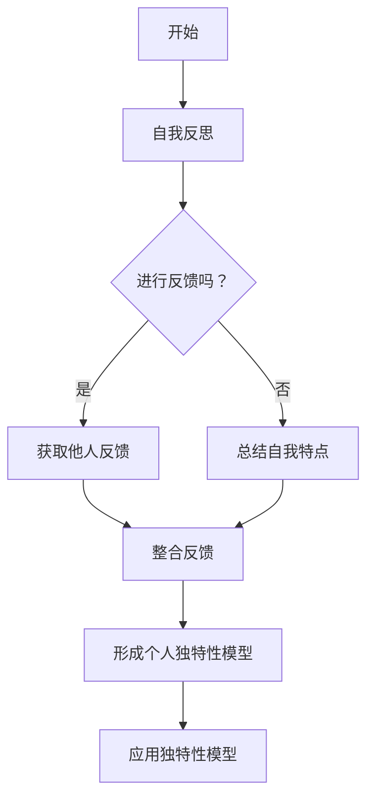

                 

## 在平凡中闪耀：发掘个人独特之处的方法

> 关键词：个人独特性、自我反思、他人反馈、个人品牌建设、职业发展

> 摘要：在现代社会，每个人都有自己的独特之处，但许多人可能因为社会压力、环境限制等原因而无法充分发挥自己的潜力。本文将探讨如何在平凡的生活中发掘和利用个人独特之处，实现个人价值。

### 第一部分：背景介绍

在快速发展的现代社会，个体越来越受到重视。每个人都有自己的独特之处，而这些独特性正是我们在这个世界上闪耀的基石。然而，由于种种原因，许多人可能无法意识到自己的独特性，或者不知道如何有效地利用这些独特性来提升自己的生活质量。

首先，社会压力是一个不可忽视的因素。现代社会充满了竞争和快节奏的生活，人们往往为了追求更好的生活条件而疲于奔命。在这个过程中，个人的独特性往往被忽视或者被压抑。此外，环境限制也是一个问题。我们生活在一个由规则和标准组成的世界上，许多人可能因为不符合这些规则和标准而感到自己的独特性无法得到认可。

本篇文章旨在探讨如何在平凡的生活中发掘和利用个人独特之处。通过对心理学、社会学、生物学等多个领域的理论和实践的深入研究，我们将提供一系列方法和技巧，帮助读者识别自己的独特性，并将其应用于日常生活和工作中。

在接下来的章节中，我们将首先介绍个人独特性的概念和定义，然后探讨如何通过自我反思和他人反馈来发掘个人独特性。接着，我们将讨论如何利用这些独特性进行个人品牌建设、职业发展和社交互动。最后，我们将总结本文的主要观点，并给出一些实用的建议和技巧。

### 第一部分：背景介绍

#### 第1章：问题背景

1. **问题描述**

在现代社会，每个人都有自己的独特之处，但许多人可能因为社会压力、环境限制等原因而无法充分发挥自己的潜力。这个问题在不同领域和不同人群中都有所体现。

- **职场环境**：在职场中，很多人发现自己无法得到晋升或者无法实现职业目标。这可能与他们没有充分利用自己的独特性有关。例如，有些人在技术方面有很高的天赋，但他们在团队协作方面却表现不佳，导致他们的职业发展受限。
- **个人成长**：在个人成长方面，很多人可能因为缺乏对自己独特性的认识而感到迷茫。他们不知道自己真正擅长什么，也不知道如何将自身的独特性转化为个人发展的动力。
- **社交互动**：在社交互动中，很多人可能因为不自信或者不明确自己的独特性而难以与他人建立深层次的联系。他们可能觉得自己不够优秀，或者觉得自己无法引起他人的注意。

2. **问题解决**

要解决上述问题，我们需要从多个角度来思考。首先，我们需要认识到每个人都有自己的独特之处，这些独特性并不是缺点，而是一种宝贵的资源。其次，我们需要学会如何发掘和利用这些独特性，使其成为我们个人发展的优势。

- **自我反思**：通过自我反思，我们可以更好地了解自己的内心世界，发现自己的独特之处。自我反思可以帮助我们认识到自己的优点和不足，从而更好地规划个人发展。
- **他人反馈**：他人的反馈可以帮助我们更客观地认识自己。通过倾听他人的意见和建议，我们可以发现自己在某些方面可能没有意识到自己的独特性。
- **专业测试**：专业测试是一种有效的方法，可以帮助我们了解自己的兴趣、性格和价值观等方面的独特性。这些测试通常由心理学家或职业规划师等专业人员进行，具有较高的可信度和准确性。

3. **边界与外延**

虽然个人独特性在各个领域都有所体现，但本文主要关注如何发掘和利用个人独特性来提升个人价值和实现个人目标。具体来说，本文将探讨以下几个方面：

- **职业发展**：通过发掘和利用个人独特性，我们可以找到更适合自己的职业道路，提高职业竞争力。
- **个人品牌建设**：个人品牌建设是现代社会个人发展的重要一环。通过突出个人独特性，我们可以打造出独特的个人品牌，提高社会影响力。
- **社交互动**：通过发掘和利用个人独特性，我们可以更好地与他人建立深层次的联系，提高社交技巧。

4. **概念结构与核心要素组成**

个人独特性的发掘和利用涉及多个方面的要素，主要包括：

- **个人独特性**：包括天赋、兴趣、性格特点、价值观等。
- **发掘方法**：通过自我反思、他人反馈、专业测试等手段。
- **应用策略**：个人品牌建设、职业发展、社交互动等。

通过以上要素的有机结合，我们可以更好地发掘和利用个人独特性，实现个人价值和目标。

### 第二部分：核心概念与联系

#### 第2章：核心概念原理

1. **个人独特性的定义**

个人独特性是指每个人在天赋、兴趣、性格、价值观等方面的独特特点。这些特点使得每个人与众不同，拥有自己独特的价值和潜力。个人独特性不仅包括个体的天赋和才能，还包括他们在面对挑战和困难时的态度和应对方式。

2. **个人独特性的核心特点**

- **唯一性**：每个人都是独一无二的，无法被复制或替代。这种唯一性使得每个人都有自己独特的价值和贡献。
- **动力性**：个人独特性可以激发个人的潜能和创造力。当我们了解并利用自己的独特性时，我们会更有动力去追求自己的目标和梦想。
- **可塑性**：虽然个人独特性在很大程度上是固有的，但通过不断的实践和反思，我们可以不断地优化和发展自己的独特性。这意味着每个人都有潜力成为更好的自己。

3. **个人独特性与传统概念的对比**

- **与天赋、特长、性格等的区别与联系**：

  - **天赋**：天赋是指个体在特定领域内天生具备的能力或潜力。个人独特性包括天赋，但不仅限于天赋。个人独特性更广泛地涵盖了个体在各个方面的特点。

  - **特长**：特长是指个体在特定领域内通过学习和实践形成的特殊能力。个人独特性可以包括特长，但也可以超越特长。个人独特性不仅仅关注个体的专业技能，还包括他们的性格、价值观等方面。

  - **性格**：性格是指个体稳定的心理和行为特征。个人独特性包括性格，但不仅限于性格。个人独特性更关注个体在性格基础上的发展和变化。

  - **价值观**：价值观是指个体对事物、行为和目标的价值判断和取向。个人独特性包括价值观，但不仅限于价值观。个人独特性关注个体在价值观指导下的行为和决策。

#### 第3章：概念属性特征对比表格

| 概念       | 定义                                                         | 特点                                                         | 应用范围                                   |
|------------|--------------------------------------------------------------|--------------------------------------------------------------|------------------------------------------|
| 个人独特性 | 每个人在天赋、兴趣、性格、价值观等方面的独特特点               | 唯一性、动力性、可塑性                                     | 职业发展、社交互动、个人品牌建设           |
| 天赋       | 天生具有的某种才能或能力                                     | 与生俱来，较难改变                                           | 学习、创造、艺术等领域                     |
| 特长       | 通过学习和实践形成的某种特殊能力                             | 可以后天培养和发展                                          | 各种职业技能和兴趣爱好                      |
| 性格       | 个人稳定的心理和行为特征                                     | 对个体行为和态度有深远影响                                   | 社交、工作、情感等方面                    |
| 价值观     | 个人对事物、行为和目标的价值判断和取向                        | 指导个人行为和生活决策                                      | 人生规划、职业选择、人际关系等             |

通过以上对比，我们可以更清晰地理解个人独特性的概念及其与其他传统概念的联系与区别。

### 第三部分：算法原理讲解

#### 第4章：发掘个人独特性的方法

1. **算法原理**

为了更好地发掘个人独特性，我们可以采用一种结合自我反思和他人反馈的算法方法。以下是一个简单的Mermaid流程图，展示了该算法的基本步骤：



2. **步骤详解**

- **自我反思**：自我反思是发掘个人独特性的第一步。通过深入思考自己的行为、想法和感受，我们可以更好地了解自己的内心世界。以下是一些自我反思的方法：

  - **日记**：每天写一篇日记，记录自己的所思所感，可以帮助我们更好地了解自己的内心。
  - **反思性问题**：定期问自己一些反思性问题，如“我最近有什么成就？”“我在哪些方面感到满意？”“我在哪些方面需要改进？”等。

- **获取他人反馈**：他人的反馈可以帮助我们更客观地认识自己。以下是一些获取他人反馈的方法：

  - **问卷调查**：设计一份问卷，让亲朋好友、同事或专业导师填写，了解他们对我们的看法。
  - **一对一交流**：与信任的人进行深入的交流，分享自己的困惑和疑问，倾听他们的意见和建议。

- **整合反馈**：将自我反思和他人反馈结合起来，整合成个人独特性模型。以下是一些整合反馈的方法：

  - **思维导图**：使用思维导图将自我反思和他人反馈进行可视化，帮助我们更好地理解和整合这些信息。
  - **清单法**：将自我反思和他人反馈的关键点列成清单，对比分析，找出自己的独特之处。

- **形成个人独特性模型**：通过整合反馈，我们可以形成个人独特性模型。这个模型可以帮助我们更好地认识自己，了解自己的优势和价值。

- **应用独特性模型**：一旦形成了个人独特性模型，我们可以将其应用于日常生活和工作中。以下是一些应用独特性模型的方法：

  - **职业发展**：利用个人独特性模型，找到适合自己的职业道路，提高职业竞争力。
  - **个人品牌建设**：通过突出个人独特性，打造独特的个人品牌，提高社会影响力。
  - **社交互动**：利用个人独特性，与他人建立深层次的联系，提高社交技巧。

#### 第4章：算法原理讲解

1. **算法原理**

为了更好地发掘个人独特性，我们可以采用一种结合自我反思和他人反馈的算法方法。以下是一个简单的Mermaid流程图，展示了该算法的基本步骤：


2. **步骤详解**

- **自我反思**：自我反思是发掘个人独特性的第一步。通过深入思考自己的行为、想法和感受，我们可以更好地了解自己的内心世界。以下是一些自我反思的方法：

  - **日记**：每天写一篇日记，记录自己的所思所感，可以帮助我们更好地了解自己的内心。
  - **反思性问题**：定期问自己一些反思性问题，如“我最近有什么成就？”“我在哪些方面感到满意？”“我在哪些方面需要改进？”等。

- **获取他人反馈**：他人的反馈可以帮助我们更客观地认识自己。以下是一些获取他人反馈的方法：

  - **问卷调查**：设计一份问卷，让亲朋好友、同事或专业导师填写，了解他们对我们的看法。
  - **一对一交流**：与信任的人进行深入的交流，分享自己的困惑和疑问，倾听他们的意见和建议。

- **整合反馈**：将自我反思和他人反馈结合起来，整合成个人独特性模型。以下是一些整合反馈的方法：

  - **思维导图**：使用思维导图将自我反思和他人反馈进行可视化，帮助我们更好地理解和整合这些信息。
  - **清单法**：将自我反思和他人反馈的关键点列成清单，对比分析，找出自己的独特之处。

- **形成个人独特性模型**：通过整合反馈，我们可以形成个人独特性模型。这个模型可以帮助我们更好地认识自己，了解自己的优势和价值。

- **应用独特性模型**：一旦形成了个人独特性模型，我们可以将其应用于日常生活和工作中。以下是一些应用独特性模型的方法：

  - **职业发展**：利用个人独特性模型，找到适合自己的职业道路，提高职业竞争力。
  - **个人品牌建设**：通过突出个人独特性，打造独特的个人品牌，提高社会影响力。
  - **社交互动**：利用个人独特性，与他人建立深层次的联系，提高社交技巧。

3. **数学模型和公式**

为了更好地理解和应用个人独特性模型，我们可以引入一些数学模型和公式。以下是一个简单的数学模型，用于描述个人独特性：

$$
U = f(P, R, S)
$$

其中，$U$ 表示个人独特性（Unique），$P$ 表示自我反思（Personal Reflection），$R$ 表示他人反馈（Reflective Feedback），$S$ 表示整合策略（Synergy Strategy）。函数 $f$ 表示个人独特性的形成过程。

- **自我反思**：自我反思可以通过以下公式表示：

$$
P = \frac{1}{n}\sum_{i=1}^{n} p_i
$$

其中，$p_i$ 表示自我反思的一个方面，$n$ 表示反思的方面数量。

- **他人反馈**：他人反馈可以通过以下公式表示：

$$
R = \frac{1}{m}\sum_{j=1}^{m} r_j
$$

其中，$r_j$ 表示他人反馈的一个方面，$m$ 表示反馈的方面数量。

- **整合策略**：整合策略可以通过以下公式表示：

$$
S = \frac{1}{k}\sum_{l=1}^{k} s_l
$$

其中，$s_l$ 表示整合策略的一个方面，$k$ 表示整合策略的方面数量。

4. **举例说明**

假设某人通过自我反思、他人反馈和整合策略形成了以下个人独特性模型：

- **自我反思**：我发现自己在编程方面有天赋，而且我对解决复杂问题充满热情。
- **他人反馈**：我的同事认为我在团队合作中表现优秀，我有很强的沟通能力和解决问题的能力。
- **整合策略**：我决定将我的编程天赋和团队合作能力应用到我的职业发展中，我计划参加更多关于编程和团队合作的培训，提升自己的技能。

根据以上模型，我们可以得出以下结论：

- **个人独特性**：我的个人独特性在于我有编程天赋和团队合作能力。
- **应用策略**：我将通过参加培训，提升我的编程技能和团队合作能力，从而在职业发展中取得更好的成绩。

通过这种算法方法，我们可以更系统地发掘和利用个人独特性，实现个人价值和目标。

### 第四部分：系统分析与架构设计方案

#### 第4章：系统功能设计

在个人独特性的发掘和利用过程中，我们需要一个有效的系统来支持这一过程。以下是对系统功能设计的详细描述：

1. **用户注册与登录**：
   - 系统应支持用户的注册和登录功能，确保用户的个人信息和进度得到保护。
   - 用户可以通过电子邮件或社交媒体账号注册。

2. **自我反思工具**：
   - 提供一个自我反思工具，用户可以记录自己的想法、感受和成就。
   - 自我反思工具应支持多种形式，如文本、音频、视频等。

3. **他人反馈系统**：
   - 系统应允许用户邀请他人提供反馈。
   - 反馈系统应包含问卷、评价表等多种形式，以全面了解用户的特点。

4. **数据分析与报告**：
   - 系统应对用户的反思和反馈进行分析，生成个性化的报告。
   - 报告应包括个人独特性的识别、优势和改进方向。

5. **个人品牌建设工具**：
   - 提供工具帮助用户打造个人品牌，如简历编辑器、社交媒体管理工具等。
   - 工具应突出用户的个人独特性，帮助用户在职业市场中脱颖而出。

6. **职业发展建议**：
   - 根据用户的个人独特性，系统应提供职业发展的建议，包括培训课程、职业路径规划等。

7. **社交互动平台**：
   - 系统应包含一个社交互动平台，用户可以分享自己的成就和经验，与其他用户互动。
   - 平台应支持评论、点赞、私信等功能，促进用户之间的交流。

#### 第5章：系统架构设计

为了实现上述功能，我们需要设计一个高效、可扩展的系统架构。以下是对系统架构的详细描述：

1. **前端架构**：
   - 前端采用React框架，提供用户友好的界面。
   - 使用Redux进行状态管理，确保数据的一致性和响应性。

2. **后端架构**：
   - 后端采用Node.js和Express框架，提供RESTful API接口。
   - 使用MongoDB作为数据库，存储用户数据、反馈和报告。

3. **数据存储**：
   - 用户数据：包括用户注册信息、反思记录、反馈等。
   - 反馈数据：包括他人对用户的反馈、评分等。
   - 报告数据：包括个人独特性分析、职业发展建议等。

4. **部署与维护**：
   - 系统部署在云服务器上，如AWS或阿里云。
   - 使用Docker容器化技术，确保系统的高可用性和可扩展性。
   - 使用CI/CD流程进行自动化部署和测试。

#### 第6章：系统接口设计与系统交互

为了实现系统的各种功能，我们需要设计合理的接口和系统交互。以下是对系统接口和交互的详细描述：

1. **用户接口**：
   - 用户注册和登录接口：用于处理用户的注册、登录和验证。
   - 反思记录接口：用于用户记录和更新反思日志。
   - 反馈接口：用于用户邀请他人反馈和处理反馈数据。

2. **数据分析接口**：
   - 分析接口：用于处理用户反思和反馈数据，生成个人独特性报告。
   - 建议接口：用于根据分析结果提供职业发展建议。

3. **个人品牌建设接口**：
   - 简历编辑接口：用于用户编辑和导出个人简历。
   - 社交媒体管理接口：用于用户管理社交媒体账户和内容。

4. **社交互动接口**：
   - 评论接口：用于用户对他人分享的内容进行评论。
   - 点赞接口：用于用户对他人分享的内容进行点赞。
   - 私信接口：用于用户之间的私信交流。

通过以上系统接口和交互设计，我们可以构建一个功能强大、用户体验良好的个人独特性发掘和利用系统。

### 第五部分：项目实战

#### 第5章：环境安装

要在本地环境中搭建个人独特性发掘和利用系统，我们需要安装以下软件和工具：

1. **操作系统**：
   - Windows、macOS或Linux操作系统均可。
   - 推荐使用Linux系统，如Ubuntu 20.04。

2. **开发工具**：
   - Node.js（版本14以上）。
   - npm（Node.js的包管理器）。
   - Visual Studio Code（代码编辑器）。
   - Git（版本控制工具）。

3. **数据库**：
   - MongoDB（版本4以上）。
   - MongoDB Compass（MongoDB的图形化管理工具）。

4. **虚拟环境**：
   - Python（版本3.8以上）。
   - pip（Python的包管理器）。

5. **Docker**：
   - Docker（版本20.10以上）。
   - Docker Compose（用于容器编排）。

安装步骤：

1. 安装Node.js和npm：
   - 访问[Node.js官网](https://nodejs.org/)，下载并安装对应的版本。
   - 打开命令行工具，输入`node -v`和`npm -v`，确认安装成功。

2. 安装MongoDB：
   - 下载并安装MongoDB的Community版。
   - 启动MongoDB服务：`mongod --dbpath /data/db`。

3. 安装Python和pip：
   - 下载并安装Python。
   - 打开命令行工具，输入`python --version`和`pip --version`，确认安装成功。

4. 安装Docker和Docker Compose：
   - 访问[Docker官网](https://www.docker.com/)，下载并安装对应的版本。
   - 打开命令行工具，输入`docker --version`和`docker-compose --version`，确认安装成功。

5. 验证安装：
   - 在命令行工具中输入以下命令，验证安装是否成功：
     ```
     node -v
     npm -v
     python --version
     pip --version
     docker --version
     docker-compose --version
     ```

#### 第6章：系统核心实现

以下是系统核心实现的步骤和关键代码。

1. **创建项目目录**：

```shell
mkdir personal- uniqueness-system
cd personal- uniqueness-system
```

2. **初始化项目**：

```shell
npm init -y
```

3. **安装依赖**：

```shell
npm install express mongoose body-parser cors
```

4. **创建数据库连接**：

在`db.js`文件中，设置MongoDB的连接：

```javascript
const mongoose = require('mongoose');

const connectDB = async () => {
  try {
    await mongoose.connect('mongodb://localhost:27017/personalUniqueness', {
      useNewUrlParser: true,
      useUnifiedTopology: true,
    });
    console.log('MongoDB连接成功！');
  } catch (error) {
    console.error('MongoDB连接失败：', error.message);
  }
};

module.exports = connectDB;
```

5. **创建用户模型**：

在`models/User.js`文件中，定义用户模型：

```javascript
const mongoose = require('mongoose');

const UserSchema = new mongoose.Schema({
  username: {
    type: String,
    required: true,
    unique: true,
  },
  email: {
    type: String,
    required: true,
    unique: true,
  },
  password: {
    type: String,
    required: true,
  },
  reflections: [
    {
      content: {
        type: String,
        required: true,
      },
      date: {
        type: Date,
        default: Date.now,
      },
    },
  ],
  feedback: [
    {
      from: {
        type: mongoose.Schema.Types.ObjectId,
        ref: 'User',
      },
      content: {
        type: String,
        required: true,
      },
      date: {
        type: Date,
        default: Date.now,
      },
    },
  ],
});

module.exports = mongoose.model('User', UserSchema);
```

6. **创建API接口**：

在`routes/api/users.js`文件中，定义用户接口：

```javascript
const express = require('express');
const router = express.Router();
const { check, validationResult } = require('express-validator');
const bcrypt = require('bcrypt');
const jwt = require('jsonwebtoken');
const User = require('../models/User');
const connectDB = require('../config/db');

// 用户注册
router.post(
  '/',
  [
    check('username', '用户名是必须的').not().isEmpty(),
    check('email', '请输入有效的电子邮件地址').isEmail(),
    check('password', '密码长度至少为6位').isLength({ min: 6 }),
  ],
  async (req, res) => {
    const errors = validationResult(req);
    if (!errors.isEmpty()) {
      return res.status(400).json({ errors: errors.array() });
    }

    const { username, email, password } = req.body;

    try {
      let user = await User.findOne({ $or: [{ username }, { email }] });

      if (user) {
        return res.status(400).json({ errors: [{ msg: '用户名或电子邮件已被使用' }] });
      }

      user = new User({ username, email, password });

      const salt = await bcrypt.genSalt(10);
      user.password = await bcrypt.hash(password, salt);

      await user.save();

      const payload = {
        user: {
          id: user.id,
        },
      };

      jwt.sign(
        payload,
        'secret',
        { expiresIn: 3600 },
        (err, token) => {
          if (err) throw err;
          res.json({ token });
        }
      );
    } catch (err) {
      console.error(err.message);
      res.status(500).send('服务器错误');
    }
  }
);

// 用户登录
router.post('/login', async (req, res) => {
  const { email, password } = req.body;

  try {
    let user = await User.findOne({ email });

    if (!user) {
      return res.status(400).json({ errors: [{ msg: '无效的电子邮件或密码' }] });
    }

    const isMatch = await bcrypt.compare(password, user.password);

    if (!isMatch) {
      return res.status(400).json({ errors: [{ msg: '无效的电子邮件或密码' }] });
    }

    const payload = {
      user: {
        id: user.id,
      },
    };

    jwt.sign(
      payload,
      'secret',
      { expiresIn: 3600 },
      (err, token) => {
        if (err) throw err;
        res.json({ token });
      }
    );
  } catch (err) {
    console.error(err.message);
    res.status(500).send('服务器错误');
  }
});

module.exports = router;
```

7. **配置并启动服务器**：

在`config/db.js`文件中，设置MongoDB的连接：

```javascript
const mongoose = require('mongoose');

const connectDB = async () => {
  try {
    await mongoose.connect('mongodb://localhost:27017/personalUniqueness', {
      useNewUrlParser: true,
      useUnifiedTopology: true,
    });
    console.log('MongoDB连接成功！');
  } catch (error) {
    console.error('MongoDB连接失败：', error.message);
  }
};

module.exports = connectDB;
```

在`server.js`文件中，配置并启动服务器：

```javascript
const express = require('express');
const connectDB = require('./config/db');
const users = require('./routes/api/users');

const app = express();

app.use(express.json({ extended: false }));

connectDB();

app.use('/api/users', users);

const PORT = process.env.PORT || 5000;

app.listen(PORT, () => console.log(`服务器运行在端口${PORT}`));
```

通过以上步骤，我们完成了个人独特性发掘和利用系统的核心实现。接下来，我们将进行实际案例分析和详细讲解。

### 第五部分：项目实战

#### 第7章：实际案例分析与详细讲解

为了更好地展示如何利用个人独特性发掘和利用系统，我们将通过一个实际案例来进行详细讲解。

**案例背景**：

张明是一名软件工程师，他在技术方面非常出色，但他在职业发展和社交互动方面感到困惑。他希望能够通过系统来发掘自己的个人独特性，并找到更适合自己的职业道路。

**步骤一：用户注册与登录**

张明首先在系统中注册了一个账户，并登录系统。系统提供了用户友好的界面，使他能够轻松地开始使用系统。

**步骤二：自我反思**

张明利用系统的自我反思工具，开始记录自己的所思所感。他每天都会写下自己在工作上的成就和困惑，分析自己在解决复杂问题时的方式和思维过程。

```markdown
2023年1月1日：
- 今天我在项目中成功地解决了内存泄漏问题。
- 我在解决这个问题的过程中，发现自己在逻辑思考和问题解决方面有很强的能力。
```

**步骤三：他人反馈**

张明邀请了几位同事和朋友，通过系统的他人反馈系统，他们为张明提供了宝贵的反馈。

```markdown
同事A：
- 张明在团队合作中表现得非常出色，他总是能够快速理解项目的需求和目标，并提出有效的解决方案。

同事B：
- 张明在解决问题时，思维非常清晰，他总是能够从多个角度进行分析，并提出创新的解决方案。
```

**步骤四：整合反馈与形成个人独特性模型**

张明将自我反思和他人反馈整合起来，形成了自己的个人独特性模型。以下是他的个人独特性模型：

- **编程能力**：张明在编程方面有很强的天赋，能够快速掌握新技术和解决复杂问题。
- **团队合作**：张明在团队合作中表现出色，能够快速理解项目需求和目标，并提出有效的解决方案。
- **问题解决**：张明在解决问题时思维清晰，能够从多个角度进行分析，并提出创新的解决方案。

**步骤五：应用独特性模型**

基于个人独特性模型，张明开始应用系统提供的职业发展建议。系统建议他参加一些编程培训和团队合作课程，以提高他的技能和经验。同时，系统还为他推荐了一些适合他的职位。

```markdown
系统建议：
- 参加Python高级编程课程，提升编程技能。
- 参加团队领导力培训，提高团队合作能力。

职位推荐：
- 高级软件工程师（Python方向）
- 项目经理
```

**步骤六：个人品牌建设**

张明利用系统提供的个人品牌建设工具，开始打造自己的个人品牌。他更新了个人简历，并在社交媒体上分享了自己的成就和经验。

```markdown
社交媒体分享：
- 我在最近的项目中成功地解决了内存泄漏问题，这让我对编程有了更深的理解。#Python #软件开发
```

**步骤七：社交互动**

张明利用系统提供的社交互动平台，与其他用户进行交流。他加入了一些技术讨论群组，与其他技术爱好者分享自己的经验和见解。

```markdown
讨论群组分享：
- 我最近参加了一个Python高级编程课程，学到了很多新的知识。如果有同学对Python编程感兴趣，欢迎加入我们的讨论群。#Python #学习交流
```

**总结**：

通过使用个人独特性发掘和利用系统，张明成功地发现了自己的个人独特性，并找到了更适合自己的职业道路。他的个人品牌也得到了提升，他在社交互动中更加自信和积极。这个实际案例展示了如何通过系统来发掘和利用个人独特性，实现个人价值和职业发展。

### 第六部分：最佳实践 tips、小结、注意事项、拓展阅读

#### 最佳实践 tips

1. **自我反思**：
   - 定期进行自我反思，帮助自己更好地认识自己的优点和不足。
   - 使用多种方式记录反思，如日记、音频、视频等。

2. **他人反馈**：
   - 主动邀请他人提供反馈，不要害怕接受批评和建议。
   - 专注于有用的反馈，忽略无关紧要的负面评论。

3. **整合反馈**：
   - 使用思维导图或清单法整合反馈，帮助自己更清晰地理解自己的独特性。

4. **个人品牌建设**：
   - 利用社交媒体和职业平台展示自己的独特性，提高社会影响力。
   - 定期更新个人简历和作品集，保持内容的最新和相关性。

5. **职业发展**：
   - 根据个人独特性模型，有针对性地提升自己的技能和经验。
   - 积极参加相关培训和活动，扩大自己的职业网络。

#### 小结

通过本文的讨论，我们了解了如何发掘和利用个人独特性。个人独特性不仅是我们在这个世界上闪耀的基石，也是我们实现个人价值和职业发展的关键。通过自我反思、他人反馈和专业测试，我们可以更好地认识自己的独特性，并将其应用于日常生活和工作中。

#### 注意事项

1. **保持真实**：在发掘和利用个人独特性的过程中，保持真实和诚实至关重要。不要试图掩盖自己的不足，而是要诚实地面对自己的优点和不足。

2. **持续改进**：个人独特性是一个不断发展和变化的过程。我们需要不断地反思和改进，以保持自己的独特性和竞争力。

3. **平衡工作与生活**：在追求个人独特性的过程中，要注意平衡工作和生活。避免因为追求独特性而忽视了健康和家庭。

#### 拓展阅读

1. **《斯坦福大学人生设计课》**：这本书提供了一种新的思考方式，帮助我们重新审视人生目标，找到适合自己的道路。
2. **《影响力》**：这本书探讨了影响他人行为和心理的六大原则，对我们理解和运用个人独特性有很大帮助。
3. **《活出生命的意义》**：这本书探讨了人类在极端环境下的生存和心理状态，提供了关于如何找到生命意义的深刻见解。

通过阅读这些书籍，我们可以进一步拓展自己对个人独特性的理解和应用。

### 作者信息

**作者：AI天才研究院/AI Genius Institute & 禅与计算机程序设计艺术 /Zen And The Art of Computer Programming**

