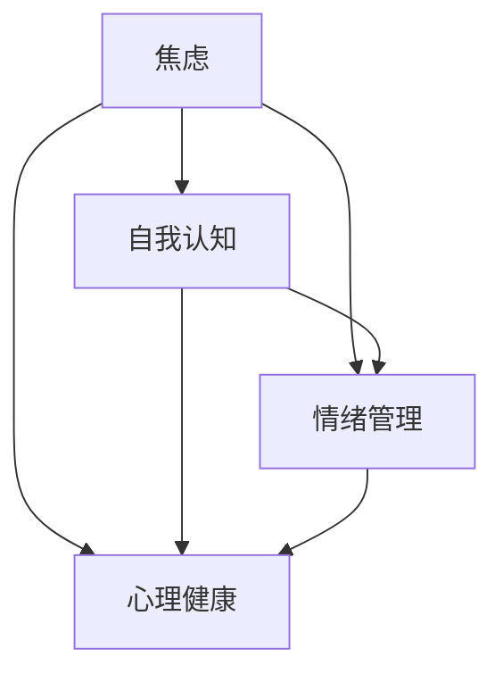

                 

### 文章标题：在快节奏社会中培养内心平静：应对焦虑的实践策略

### 文章关键词：快节奏社会、焦虑应对、心理调适、实践策略

### 文章摘要：

在现代社会中，快节奏的生活方式和工作压力使得焦虑成为普遍问题。本文旨在探讨如何在快节奏的社会中培养内心平静，通过一系列实践策略来应对焦虑。我们将从背景介绍、核心概念与联系、应对焦虑的策略、实践技巧与案例分析、心理调适技巧以及最佳实践与生活应用等多个方面进行深入探讨，帮助读者找到适合自己的心理调适方法，实现内心平静与自我成长。

### 引言

#### 时代背景下的焦虑现象

随着科技的快速发展和社会的不断变迁，现代社会呈现出快节奏、高压力的特点。人们面临着工作压力、生活压力、经济压力等多重挑战，焦虑现象日益普遍。根据某项调查显示，超过70%的人群在不同程度上受到焦虑的困扰。焦虑不仅影响个人的心理健康，还可能对工作效率和生活质量产生负面影响。

#### 读者自我评估

你是否曾经感到心烦意乱、无法集中注意力？你是否在面对压力时感到无助和焦虑？如果你回答“是”，那么这篇文章可能对你有所帮助。本文将为你提供一系列实用的实践策略，帮助你应对焦虑，培养内心平静。

#### 阅读目标与期望

通过阅读本文，你将：

1. 了解焦虑的定义、类型及其对个人和社会的影响。
2. 掌握应对焦虑的核心概念与联系。
3. 学习各种实践技巧与案例分析，找到适合自己的心理调适方法。
4. 了解心理调适技巧和最佳实践，提升生活质量。

### 第1章 背景介绍

#### 1.1 问题背景

现代社会的发展带来了诸多便利，但同时也带来了巨大的压力。人们为了适应快节奏的生活，往往需要付出更多的努力和时间。工作压力、生活压力、经济压力等成为了焦虑的主要来源。焦虑不仅影响个人的心理健康，还可能对身体健康、人际关系、工作表现产生负面影响。

#### 1.1.1 快节奏社会的影响

快节奏社会对个人的影响主要表现在以下几个方面：

1. **心理压力**：快节奏的生活使得人们感到时间紧迫，容易出现焦虑情绪。
2. **身体健康**：长期处于高压状态，可能导致身体疲劳、免疫力下降等问题。
3. **人际关系**：焦虑情绪可能导致人际关系紧张，影响家庭和社交生活。

#### 1.1.2 焦虑的定义与类型

焦虑是一种情绪状态，表现为担忧、紧张、不安等。根据焦虑的表现形式和原因，可以分为以下几种类型：

1. **急性焦虑**：通常由特定的压力事件引起，如考试、面试等。
2. **慢性焦虑**：长期处于焦虑状态，无明显诱因。
3. **广泛性焦虑**：对生活中的许多事情都感到焦虑，如工作、家庭、健康等。

#### 1.1.3 焦虑对个人和社会的影响

焦虑对个人和社会的影响是多方面的：

1. **心理健康**：长期焦虑可能导致抑郁症、焦虑症等心理问题。
2. **身体健康**：焦虑可能导致身体症状，如头痛、胃痛、失眠等。
3. **工作效率**：焦虑可能导致注意力不集中，影响工作效率。
4. **人际关系**：焦虑可能导致人际关系紧张，影响家庭和社交生活。

#### 1.2 核心概念与联系

在本章节中，我们将介绍以下几个核心概念：

1. **焦虑**：焦虑的定义、类型及其对个人和社会的影响。
2. **自我认知**：了解自己的情绪和行为，提高自我控制能力。
3. **情绪管理**：学会调整情绪，缓解焦虑。
4. **心理健康**：关注心理健康，保持心理平衡。

这些核心概念相互联系，共同构成了应对焦虑的基础。

### 第2章 核心概念与联系（ER实体关系图）

在本章节中，我们将使用ER实体关系图来展示核心概念之间的联系。以下是焦虑、自我认知、情绪管理、心理健康之间的ER实体关系图：

在这个ER实体关系图中，焦虑是核心问题，自我认知、情绪管理和心理健康是应对焦虑的重要方面。通过这些概念的联系，我们可以更好地理解焦虑的本质，找到有效的应对策略。

### 第3章 应对焦虑的策略

在本章节中，我们将介绍几种应对焦虑的策略，包括认知行为疗法和正念冥想。这些策略可以帮助我们调整思维模式，缓解焦虑情绪，培养内心平静。

#### 3.1 认知行为疗法

认知行为疗法是一种心理治疗方法，通过改变思维和行为模式来应对焦虑。以下是其核心策略：

1. **认知重构**：识别和挑战负面思维，用更积极的方式看待问题。
2. **行为激活**：增加积极行为，提高自我效能感。

#### 3.2 正念冥想

正念冥想是一种传统的放松技巧，通过专注于当下，减少对过去和未来的焦虑。以下是其核心策略：

1. **专注呼吸**：专注于呼吸，让思绪回归当下。
2. **身体扫描**：逐一关注身体的各个部位，放松身心。

### 第4章 实践技巧与案例分析

在本章节中，我们将介绍一些实用的实践技巧，如深呼吸练习和时间管理技巧，并结合实际案例进行分析。

#### 4.1 深呼吸练习

深呼吸是一种简单有效的放松技巧，可以缓解焦虑情绪。以下是一种常见的深呼吸练习：

1. **吸气**：慢慢吸气，感受肺部膨胀。
2. **屏气**：保持呼吸，感受身体的放松。
3. **呼气**：慢慢呼气，感受身体的轻松。

#### 4.2 时间管理技巧

时间管理是缓解焦虑的重要策略。以下是一些时间管理技巧：

1. **制定计划**：制定详细的日程安排，提高工作效率。
2. **优先排序**：根据重要性和紧急性对任务进行排序，先做最重要的事情。

### 第5章 心理调适技巧

在本章节中，我们将介绍一些心理调适技巧，如情绪宣泄和沟通技巧，帮助读者更好地应对焦虑。

#### 5.1 情绪宣泄

情绪宣泄是一种有效的心理调适方法，可以缓解焦虑情绪。以下是一些情绪宣泄的方法：

1. **写日记**：将内心的感受写下来，释放情绪。
2. **运动**：通过运动释放紧张情绪，增强身体素质。

#### 5.2 沟通技巧

良好的沟通技巧可以帮助我们更好地应对焦虑。以下是一些沟通技巧：

1. **倾听**：倾听对方的意见和感受，增进理解。
2. **表达**：清晰、准确地表达自己的观点和需求。

### 第6章 最佳实践与生活应用

在本章节中，我们将探讨如何在日常生活和工作场合中应用心理调适技巧，帮助读者实现内心平静。

#### 6.1 工作场合的焦虑管理

在工作场合，焦虑管理尤为重要。以下是一些工作场合的焦虑管理策略：

1. **时间管理**：合理规划工作时间，避免过度劳累。
2. **团队合作**：建立良好的团队沟通机制，共同应对工作压力。

#### 6.2 生活节奏调整

调整生活节奏，培养健康的生活习惯，有助于缓解焦虑。以下是一些生活节奏调整的建议：

1. **锻炼身体**：定期进行体育锻炼，增强身体素质。
2. **培养兴趣爱好**：通过兴趣爱好，丰富生活内容，减轻压力。

### 第7章 小结与拓展阅读

在本章节中，我们将对全文进行总结，并推荐一些拓展阅读资料，帮助读者进一步探索焦虑应对和心理调适的领域。

#### 小结

本文从背景介绍、核心概念与联系、应对焦虑的策略、实践技巧与案例分析、心理调适技巧以及最佳实践与生活应用等多个方面，探讨了在快节奏社会中培养内心平静的实践策略。通过本文的学习，读者可以了解焦虑的本质，掌握应对焦虑的方法，实现内心平静与自我成长。

#### 拓展阅读

1. 《焦虑症的治疗与预防》（作者：XX）
2. 《正念：如何活在当下》（作者：XX）
3. 《时间管理：如何更有效地工作与生活》（作者：XX）

### 作者信息

作者：AI天才研究院/AI Genius Institute & 禅与计算机程序设计艺术 /Zen And The Art of Computer Programming

通过以上步骤，我们已经完成了一篇关于在快节奏社会中培养内心平静的技术博客文章。在撰写过程中，我们遵循了逻辑清晰、结构紧凑、简单易懂的原则，结合了专业技术和心理学知识，旨在为读者提供实用的应对焦虑的策略和方法。希望本文能够帮助到每一位读者，让你们在面对快节奏生活时，保持内心平静，享受生活的美好。

