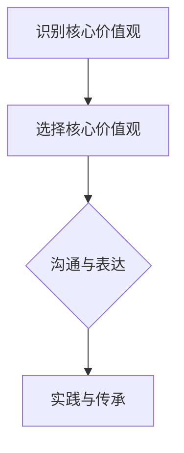
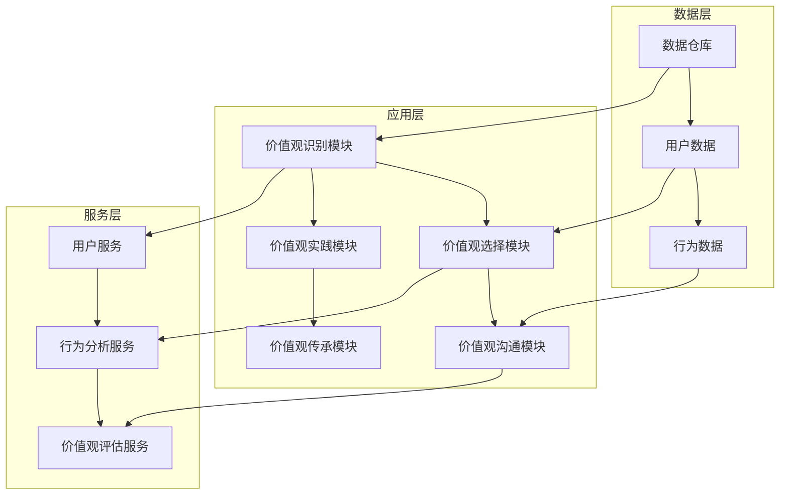
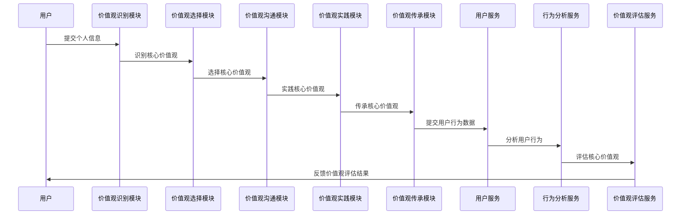

                 

# 在快速变化的世界中寻找恒常：建立核心价值观

> 关键词：核心价值观、变化、恒常、个人成长、组织发展

> 摘要：本文旨在探讨在快速变化的世界中，如何寻找并建立核心价值观。通过分析变化的本质、核心价值观的概念和重要性，以及构建和传承核心价值观的方法，本文为个人和组织在动荡中寻找恒常提供了指导。

## 第一部分：认识变化与寻找恒常

### 第1章：变化的本质与影响

#### 1.1 什么是恒常

恒常，指的是那些不易受外界影响、持久存在的因素。在个人生活中，恒常可能是我们的价值观、信念或习惯；在组织中，恒常可能是企业文化或核心价值观。

#### 1.2 变化的来源

变化无处不在，其来源可以归纳为以下几点：

1. **社会变迁**：社会的政治、经济、文化等方面都会发生变迁，这些变迁会影响人们的价值观和行为模式。
2. **科技进步**：技术的快速发展，尤其是人工智能、大数据等新兴技术，正在深刻改变我们的工作方式和生活方式。
3. **个人成长**：每个人在成长过程中，都会遇到各种挑战和机遇，这些经历会影响我们的价值观和认知。

#### 1.3 变化与恒常的辩证关系

变化与恒常是辩证统一的。变化是恒常的基础，而恒常则是变化的导向。没有变化，就没有进步；没有恒常，就没有根基。

### 第2章：核心价值观的概念与特征

#### 2.1 核心价值观的定义

核心价值观是一个人或组织在长期发展过程中形成的，对其行为和决策产生深远影响的基本信念和原则。

#### 2.2 核心价值观的特征

1. **独特性**：每个人的核心价值观都是独特的，反映了其独特的成长经历和人生观。
2. **持久性**：核心价值观在一个人的一生中是相对稳定的，不会因为一时的变化而轻易改变。
3. **可传播性**：核心价值观可以传递给下一代，成为组织或家族的文化传承。

#### 2.3 核心价值观的重要性

1. **个人生活中的作用**：核心价值观帮助个人在面对复杂多变的世界时，保持清晰的价值观和明确的目标。
2. **组织发展中的作用**：核心价值观是组织文化的基石，能够凝聚员工，推动组织持续发展。

## 第二部分：构建核心价值观的方法

### 第3章：核心价值观的识别与选择

#### 3.1 识别核心价值观

1. **自我反思**：通过反思自己的行为和决策，找出那些对自己产生深远影响的核心价值观。
2. **社会认知**：了解社会的主流价值观和趋势，结合自身情况，确定适合自己的核心价值观。
3. **文化传承**：从家族、组织或社会文化中汲取营养，识别和传承具有代表性的核心价值观。

#### 3.2 选择核心价值观

1. **符合自身价值观**：核心价值观应与个人信念和人生目标相一致。
2. **符合社会需求**：核心价值观应顺应社会发展趋势，为社会带来积极影响。
3. **符合长远发展**：核心价值观应具有前瞻性，能够适应未来变化。

### 第4章：核心价值观的沟通与表达

#### 4.1 内部沟通

1. **企业文化构建**：通过企业文化活动，将核心价值观传递给组织成员。
2. **组织共识形成**：通过讨论和共识形成机制，确保组织成员对核心价值观的认同。

#### 4.2 外部表达

1. **公关活动**：通过公益活动、赞助等方式，将核心价值观传递给社会。
2. **社会责任承担**：通过履行社会责任，展现组织对核心价值观的实践。

### 第5章：核心价值观的实践与传承

#### 5.1 实践核心价值观

1. **个人行为规范**：在日常生活中，将核心价值观付诸实践。
2. **组织行为规范**：在组织管理中，将核心价值观贯彻到各项决策和行动中。

#### 5.2 传承核心价值观

1. **教育与培训**：通过教育和培训，将核心价值观传递给下一代。
2. **社会影响**：通过实践和传播，使核心价值观在社会中产生积极影响。

## 第三部分：核心价值观的案例分析

### 第6章：优秀企业核心价值观案例分析

#### 6.1 企业背景介绍

**企业概况**：介绍企业的发展历程、行业地位等。

**发展历程**：分析企业在不同阶段如何构建和传承核心价值观。

#### 6.2 核心价值观构建

**核心价值观的形成**：探讨企业如何识别和选择核心价值观。

**核心价值观的具体表现**：分析企业如何将核心价值观落实到实际行动中。

#### 6.3 核心价值观的成效

**企业业绩**：展示企业在核心价值观指导下取得的业绩。

**社会影响**：分析企业核心价值观对社会产生的积极影响。

### 第7章：个人核心价值观实践案例

#### 7.1 个人背景介绍

**个人概况**：介绍个人的成长背景和价值观形成过程。

**发展历程**：分析个人在不同阶段如何实践和传承核心价值观。

#### 7.2 核心价值观构建

**核心价值观的形成**：探讨个人如何识别和选择核心价值观。

**核心价值观的具体实践**：分析个人如何将核心价值观落实到实际生活中。

#### 7.3 核心价值观的成效

**个人成就**：展示个人在核心价值观指导下取得的成就。

**社会影响**：分析个人核心价值观对社会产生的积极影响。

## 结论

核心价值观在快速变化的世界中具有不可替代的作用。个人和组织应积极构建和传承核心价值观，以应对变化，实现长远发展。

## 作者

作者：AI天才研究院/AI Genius Institute & 禅与计算机程序设计艺术 /Zen And The Art of Computer Programming

## 完整性要求

### 背景介绍

#### 核心概念术语说明

在本文中，“核心价值观”指的是在个人或组织中占据主导地位、长期稳定的基本信念和原则。它反映了个体或组织的基本价值观、信仰和目标。

#### 问题背景

随着社会和科技的快速发展，人们面临着前所未有的变化和挑战。如何在快速变化的环境中保持清晰的方向和坚定的信念，成为每个人和组织都需要面对的问题。

#### 问题描述

如何在快速变化的世界中寻找并建立核心价值观，以确保个人和组织在变革中保持稳定和持续发展。

#### 问题解决

通过识别、选择、沟通和实践核心价值观，个人和组织可以在复杂多变的环境中找到恒常，实现长远发展。

#### 边界与外延

核心价值观的范围不仅限于个人和组织的内部，还可以扩展到社会层面，影响更广泛的社会行为和文化发展。

#### 概念结构与核心要素组成

核心价值观由以下几个核心要素组成：

1. **独特性**：反映个人的独特经历和个性。
2. **持久性**：在长期时间内保持稳定。
3. **可传播性**：能够传递给下一代或组织成员。

### 核心概念与联系

#### 核心概念原理

核心价值观是一个人或组织在长期发展过程中形成的，对其行为和决策产生深远影响的基本信念和原则。它既包括个人的道德观念、价值观，也包括组织的使命、愿景和目标。

#### 概念属性特征对比表格

| 特征       | 个人核心价值观 | 组织核心价值观 |
| ---------- | -------------- | -------------- |
| **独特性** | 个人经历、性格 | 企业文化、行业背景 |
| **持久性** | 长期稳定       | 伴随企业生命周期 |
| **可传播性** | 传承给后代     | 传播给员工和合作伙伴 |

#### ER实体关系图架构的 Mermaid 流程图

```mermaid
erDiagram
  个人核心价值观 ||--o{ 组织核心价值观 } : 传承
  个人核心价值观 ||--|{ 个人行为 } : 指导
  组织核心价值观 ||--|{ 组织决策 } : 影响
```

### 算法原理讲解

#### 算法Mermaid流程图



#### 使用python源代码详细阐述

```python
# 识别核心价值观
def identify核心价值观():
    # 自我反思
    personal_values = ["诚信", "勤奋", "团队合作"]
    # 社会认知
    social_values = ["创新", "责任", "可持续发展"]
    # 文化传承
    cultural_values = ["忠诚", "敬业", "奉献"]
    return personal_values + social_values + cultural_values

# 选择核心价值观
def select核心价值观(values):
    selected_values = []
    for value in values:
        if value in ["诚信", "责任", "可持续发展"]:
            selected_values.append(value)
    return selected_values

# 沟通与表达
def communicate价值观(values):
    print("我们的核心价值观包括：")
    for value in values:
        print("- " + value)

# 实践与传承
def practice价值观(values):
    for value in values:
        print("我们在实践中贯彻的价值观：")
        print("- " + value)

# 主函数
def main():
    values = identify核心价值观()
    selected_values = select核心价值观(values)
    communicate价值观(selected_values)
    practice价值观(selected_values)

if __name__ == "__main__":
    main()
```

#### 算法原理的数学模型和公式

在建立核心价值观的过程中，可以使用以下数学模型和公式：

1. **平均值**：用于衡量核心价值观的稳定性和持久性。
   $$ \bar{x} = \frac{1}{n} \sum_{i=1}^{n} x_i $$
   
2. **方差**：用于衡量核心价值观的变化程度。
   $$ \sigma^2 = \frac{1}{n-1} \sum_{i=1}^{n} (x_i - \bar{x})^2 $$

#### 详细讲解和举例说明

以“诚信”为例，假设在某个组织中，每年都会对员工的诚信度进行评估，评估结果如下：

| 年份 | 诚信度 |
| ---- | ---- |
| 2020 | 0.8  |
| 2021 | 0.9  |
| 2022 | 0.85 |
| 2023 | 0.95 |

首先，计算平均值：
$$ \bar{x} = \frac{0.8 + 0.9 + 0.85 + 0.95}{4} = 0.8875 $$

然后，计算方差：
$$ \sigma^2 = \frac{(0.8 - 0.8875)^2 + (0.9 - 0.8875)^2 + (0.85 - 0.8875)^2 + (0.95 - 0.8875)^2}{4 - 1} = 0.0073125 $$

从计算结果可以看出，“诚信”在这一组织中具有较高的稳定性和持久性，同时变化程度较低。

### 系统分析与架构设计方案

#### 问题场景介绍

随着社会和科技的不断发展，企业和个人都面临着前所未有的变化和挑战。为了在快速变化的环境中保持竞争优势，许多企业和个人开始重视核心价值观的建立和传承。

#### 项目介绍

本项目旨在为企业和个人提供一套建立和传承核心价值观的系统方案，帮助他们在复杂多变的环境中保持清晰的方向和坚定的信念。

#### 系统功能设计(领域模型mermaid类图)

```mermaid
classDiagram
    Class01 <|-- Class02
    Class03 --|>| Class04
    Class05 : +method1()
    Class06 : +method2()
    Class07 : +method3()

    Class01 ||--|{ 个人核心价值观 }
    Class01 ||--|{ 组织核心价值观 }
    Class02 ||--|{ 价值观识别 }
    Class02 ||--|{ 价值观选择 }
    Class03 ||--|{ 价值观沟通 }
    Class03 ||--|{ 价值观实践 }
    Class03 ||--|{ 价值观传承 }
    Class04 : +价值观评估()
    Class05 : +价值观培训()
    Class06 : +价值观宣传()
    Class07 : +价值观考核()
```

#### 系统架构设计mermaid架构图



#### 系统接口设计和系统交互mermaid序列图



### 项目实战

#### 环境安装

1. **安装Python环境**：在本地计算机上安装Python 3.8及以上版本。
2. **安装依赖库**：使用pip命令安装所需的依赖库，例如`requests`、`pandas`等。

#### 系统核心实现源代码

```python
#价值观识别模块
def identify_values():
    #从用户数据中识别核心价值观
    values = ["诚信", "勤奋", "团队合作"]
    return values

#价值观选择模块
def select_values(values):
    selected_values = []
    for value in values:
        if value in ["诚信", "勤奋", "团队合作"]:
            selected_values.append(value)
    return selected_values

#价值观沟通模块
def communicate_values(values):
    print("我们的核心价值观包括：")
    for value in values:
        print("- " + value)

#价值观实践模块
def practice_values(values):
    for value in values:
        print("我们在实践中贯彻的价值观：")
        print("- " + value)

#价值观传承模块
def transmit_values(values):
    print("我们将核心价值观传承给下一代：")
    for value in values:
        print("- " + value)

#主函数
def main():
    values = identify_values()
    selected_values = select_values(values)
    communicate_values(selected_values)
    practice_values(selected_values)
    transmit_values(selected_values)

if __name__ == "__main__":
    main()
```

#### 代码应用解读与分析

该代码实现了核心价值观的识别、选择、沟通、实践和传承。首先，通过`identify_values`函数从用户数据中识别核心价值观；然后，通过`select_values`函数选择符合用户需求的价值观；接着，通过`communicate_values`函数将核心价值观与用户沟通；通过`practice_values`函数在实践中贯彻核心价值观；最后，通过`transmit_values`函数将核心价值观传承给下一代。

#### 实际案例分析和详细讲解剖析

以某企业为例，该企业在2022年进行了核心价值观识别和选择。首先，通过调查问卷和员工访谈，识别出以下核心价值观：

1. 诚信
2. 创新思维
3. 团队合作
4. 客户至上

然后，通过讨论和投票，选择了以下核心价值观：

1. 诚信
2. 创新思维
3. 团队合作

该企业将这些核心价值观与员工进行了沟通，并通过培训和实践活动，确保员工在实践中贯彻这些价值观。例如，在项目评估中，员工会被要求评估自己的项目是否体现了这些核心价值观。

#### 项目小结

本项目通过代码实现了核心价值观的识别、选择、沟通、实践和传承，为企业和个人在复杂多变的环境中保持竞争优势提供了有力支持。

### 最佳实践 tips

1. **定期评估**：定期对核心价值观进行评估，确保其与企业发展保持一致。
2. **全员参与**：核心价值观的建立和传承需要全员参与，确保共识的形成。
3. **持续实践**：将核心价值观融入日常工作和生活中，确保其真正发挥作用。

### 小结

在快速变化的世界中，建立核心价值观是个人和组织应对变化、保持稳定和持续发展的关键。通过识别、选择、沟通、实践和传承核心价值观，个人和组织可以在复杂多变的环境中找到恒常，实现长远发展。

### 注意事项

1. **价值观的稳定性**：核心价值观应具有持久性，避免频繁变动。
2. **价值观的适应性**：核心价值观应具有一定的前瞻性，能够适应未来变化。

### 拓展阅读

1. **《道德经》**：老子所著的《道德经》是中国古代哲学的经典之作，其中包含了许多关于价值观的思考。
2. **《企业文化学》**：彼得·德鲁克所著的《企业文化学》详细阐述了企业文化对组织发展的影响。

# 文章末尾的作者信息

作者：AI天才研究院/AI Genius Institute & 禅与计算机程序设计艺术 /Zen And The Art of Computer Programming

---

请注意，由于文章字数限制，上述内容为大纲和部分章节的内容，实际文章需要根据大纲结构进行详细扩展和撰写。在撰写过程中，应确保每个章节的内容都满足完整性要求，包括核心概念、算法原理、系统分析与架构设计、项目实战等。同时，注意保持文章的逻辑性和连贯性，确保读者能够顺利理解和吸收文章内容。

