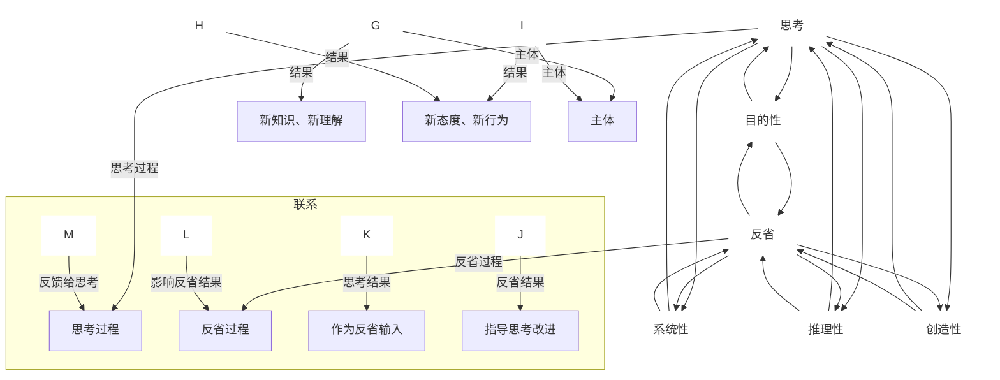

                 

### 第一部分: 引言

#### 1.1 快餐文化的背景与发展

**1.1.1 快餐文化的起源与传播**

快餐文化起源于20世纪初期，在美国得以迅速发展。其根源可以追溯到工业革命后，城市人口急剧增加和劳动力市场的需求。最早期的快餐形式主要是热狗、汉堡和炸鸡，这些食品快速、便捷、价格低廉，满足了大众的需求。

随着时间的推移，快餐文化在全球范围内传播。麦当劳、肯德基等国际快餐品牌在全球范围内开设连锁店，使得快餐成为现代社会的常见现象。在中国，快餐文化同样得到了广泛普及，无论是城市还是乡村，快餐店随处可见，成为人们日常饮食的一部分。

**1.1.2 快餐文化对现代社会的影响**

快餐文化对现代社会产生了深远的影响。一方面，它改变了人们的饮食习惯和生活节奏。快节奏的生活方式使人们更倾向于选择快速便捷的快餐，而不是传统的烹饪方式。这种趋势在一定程度上提高了效率，但也可能导致营养不均衡和健康问题。

另一方面，快餐文化也影响了人们的思考方式。快餐文化的特点之一是快速度、低深度，这可能导致人们越来越倾向于接受表面信息，缺乏深度思考和分析。这种现象在信息技术和社交媒体时代尤为明显，人们往往被大量的碎片化信息所包围，难以进行深度思考和反思。

**1.1.3 快餐文化与深度思考的关系**

快餐文化与深度思考之间存在一定的矛盾。深度思考需要时间和耐心，而快餐文化强调速度和效率。在快餐文化的影响下，人们可能更容易陷入浅层次思考，忽视问题背后的本质和深层次原因。

然而，深度思考并不是与快餐文化完全对立的。通过有效的策略和方法，我们可以在快餐文化的背景下培养和重建深度思考能力。本文将探讨如何在快节奏的社会环境中重建思考和反省的能力，以实现个人和社会的全面发展。

#### 1.2 问题背景

**1.2.1 现代社会思考能力缺失的现象**

在现代社会，思考能力缺失的现象越来越引起关注。一方面，现代科技的发展和信息爆炸使得人们更容易接触到各种信息，但同时也使得人们更难专注于深度思考。人们往往容易被碎片化信息所干扰，缺乏系统的思考和整体性的视角。

另一方面，教育体系的偏差也导致了思考能力的缺失。传统的教育方式过于注重知识传授，忽视了批判性思维和创造性思维的培养。学生在面对问题时，往往只能依赖已有知识进行简单的应用，而缺乏深入分析和解决问题的能力。

**1.2.2 深度思考的重要性**

深度思考是人类认知的高级阶段，是创新和进步的重要推动力。与浅层次思考相比，深度思考能够帮助我们挖掘问题的本质，发现新的解决方案，提高解决问题的能力。在复杂多变的社会环境中，深度思考能力尤为重要，它使我们能够更好地应对挑战，抓住机遇。

**1.2.3 重建思考与反省能力的必要性**

重建思考与反省能力对于个人和社会的发展至关重要。个人层面，深度思考和反省能力使我们能够更好地认识自己，发现自己的优点和不足，不断改进和成长。社会层面，深度思考和反省能力有助于推动社会的进步和繁荣，促进问题的解决和矛盾的化解。

然而，在快餐文化的背景下，重建思考与反省能力并非易事。我们需要采取有效的策略和方法，克服快餐文化的负面影响，培养和重建深度思考的能力。本文将探讨一些具体的方法和技巧，以帮助读者在快餐文化的冲击下，重建思考与反省的能力。

#### 1.3 本书结构

**1.3.1 各章节主题与内容概述**

本书分为三个部分，分别探讨深度思考与反省能力的重建、深度思考的技巧与方法，以及反省的方法。

**第一部分：思考与反省能力的重建**

本部分主要介绍思考与反省能力的重要性，以及如何在快餐文化的背景下重建这些能力。内容包括核心概念的定义与联系，以及相关的ER实体关系图。

**第二部分：深度思考的技巧与方法**

本部分重点探讨深度思考的技巧和方法，包括提问与质疑、分析与推理、创造力与想象力等。通过这些技巧和方法，读者可以培养和提升深度思考的能力。

**第三部分：反省的方法**

本部分介绍反省的方法，包括反思与批判、认知重塑等。通过这些方法，读者可以更好地认识自己，发现和解决问题，实现个人的成长和发展。

**1.3.2 阅读本书的目标与收获**

阅读本书的目标是帮助读者在快餐文化的冲击下重建深度思考与反省能力。通过学习本书，读者可以：

1. 理解深度思考与反省能力的重要性。
2. 掌握深度思考的技巧与方法。
3. 学习反省的方法，提高自我认知和成长。
4. 应对快餐文化的挑战，实现个人和社会的全面发展。

**1.4 本章小结**

本章主要介绍了快餐文化的背景与发展，分析了现代社会思考能力缺失的现象以及深度思考的重要性。同时，本章还概述了本书的结构和目标，为读者后续的学习和思考奠定了基础。

在接下来的章节中，我们将逐步探讨如何重建思考和反省能力，以及深度思考的技巧与方法。希望通过本书的学习，读者能够在快餐文化的冲击下，培养和提升自己的深度思考能力，实现个人和社会的全面发展。### 核心概念与联系

在讨论深度思考与反省能力重建的过程中，我们需要明确几个核心概念，并探讨它们之间的关系。

**2.1.1 思考与反省的定义**

思考是一种认知活动，通过分析和推理来理解和解决问题。思考的过程包括对信息的收集、整理、分析和判断。思考的核心在于探索问题的本质，寻找新的解决方案。

反省则是思考的一种深化，它不仅涉及对问题的分析，还包括对自身行为的反思和评估。反省的过程是对自己的思考过程、决策和行为进行审视，识别不足和错误，并寻求改进的方法。

**2.1.1.1 思考的定义与特征**

思考是一种高级认知功能，具有以下特征：

1. **目的性**：思考的目的是解决问题、获取知识或创造新的理解。
2. **系统性**：思考过程中，需要对信息进行系统的收集和分析，形成逻辑一致的知识体系。
3. **推理性**：思考通过推理来发现问题和解决问题的方法。
4. **创造性**：思考不仅限于已有知识的应用，还包括新知识和新见解的创造。

**2.1.1.2 反省的定义与特征**

反省是一种自我认知的过程，具有以下特征：

1. **自我审视性**：反省是对自身行为和思考过程的审视，识别自身的优点和不足。
2. **批判性**：反省需要采用批判性思维，对已有观念和行为进行批判和评估。
3. **改进性**：反省的目的是通过识别不足，寻求改进和提升的方法。

**2.1.2 思考与反省的属性特征对比表格**

为了更好地理解思考与反省的关系，我们可以通过一个属性特征对比表格来进行详细分析：

| 特征            | 思考                      | 反省                      |
| --------------- | ------------------------- | ------------------------- |
| **目的**        | 探索问题、发现解决方案    | 反思自我、认识不足与改进  |
| **过程**        | 分析、推理、创造          | 检视、批判、反思          |
| **结果**        | 新知识、新理解            | 新态度、新行为            |
| **思维类型**    | 推理性、创造性            | 审视性、批判性            |
| **应用场景**    | 解决问题、获取知识        | 个人成长、自我改进        |

通过上述表格，我们可以看到思考与反省在目的、过程和结果等方面存在一定的区别，但它们之间也存在紧密的联系。思考是反省的基础，反省是思考的深化，两者相辅相成，共同推动个人的认知发展和成长。

**2.1.3 思考与反省的ER实体关系图**

为了更直观地展示思考与反省之间的关系，我们可以使用ER（实体关系）图来表示。以下是一个简单的ER实体关系图：

```
+-------------+
| 思考       |
+-------------+
| - 时间      |
| - 环境因素  |
| - 过程      |
| - 主体      |
+-------------+
| - <------| 反省       |
+-------------+
| - 时间      |
| - 心理因素  |
| - 过程      |
| - 主体      |
+-------------+
| - 影响因素  |
+-------------+
```

在ER图中，思考作为主体，其过程和结果与反省相关联。思考的结果可以作为反省的输入，而反省的过程和结果又可以反馈到思考中，形成一个互动的循环。这种关系表明，思考与反省不是孤立的过程，而是相互依存、相互促进的。

通过明确思考与反省的定义和特征，以及它们之间的联系，我们可以更好地理解如何在实际生活中重建这些能力。在接下来的章节中，我们将进一步探讨深度思考的技巧和方法，帮助读者在快餐文化的背景下，有效地培养和提升思考与反省能力。### 第三部分: 深度思考的技巧与方法

深度思考是一种复杂的认知过程，需要结合多种技巧和方法来提升。以下将详细介绍几种关键技巧和方法，帮助读者在快餐文化中培养深度思考能力。

#### 3.1 深度思考的技巧

**3.1.1 提问与质疑**

提问是深度思考的起点。通过提出有针对性的问题，我们可以引导思考的深入。以下是一些有效的提问技巧：

1. **开放性问题**：开放性问题能够激发思考，如“为什么这个问题重要？”“这个问题是如何产生的？”
2. **假设性问题**：通过设定假设，如“如果……会发生什么？”“如果没有……会有什么影响？”
3. **探索性问题**：引导思考者从多个角度审视问题，如“除了这个答案，还有其他可能性吗？”“这个答案是如何与已知信息相关的？”

**3.1.2 分析与推理**

分析是将复杂问题分解为更简单的部分，以便更好地理解。推理则是通过逻辑关系将分析结果联系起来，得出结论。以下是一些分析和推理的技巧：

1. **因果分析**：找出问题之间的因果关系，如“这个问题导致了什么后果？”“这些因素是如何相互作用的？”
2. **比较分析**：通过比较不同情况，找出差异和共同点，如“这个方法和那个方法有何不同？”“这两个结果有何相似之处？”
3. **演绎推理**：从一般原则推导出特定情况下的结论，如“如果所有A都有B属性，那么C也应有B属性。”

**3.1.3 创造力与想象力**

创造力是深度思考的重要补充。想象力可以帮助我们跳出常规思维，探索新的解决方案。以下是一些培养创造力和想象力的技巧：

1. **头脑风暴**：在不受限制的环境下，尽可能多地产生想法，不必担心它们是否可行。
2. **类比思维**：通过寻找相似之处，将不同领域的知识结合起来，如“这个问题的解决方案是否可以借鉴另一个领域的经验？”
3. **思维导图**：使用思维导图工具，将思考过程中的关键点、关系和想法可视化，促进思考的连贯性和系统性。

**3.1.4 反思与自省**

反思是对思考过程和结果的审视，自省则是对自身思维的评估。以下是一些反思和自省的技巧：

1. **定期回顾**：定期回顾自己的思考过程和决策，如“这个决策的后果如何？”“这个方法是否有效？”
2. **批判性思维**：在思考过程中，时刻保持批判性思维，如“这个结论是否基于充分的信息？”“这个想法是否完全合理？”
3. **多角度审视**：从不同角度审视问题和结论，如“除了我现在的观点，还有没有其他可能性？”“其他专家对此有何看法？”

#### 3.2 深度思考的具体方法

**3.2.1 深度访谈**

深度访谈是一种有效的思考方法，通过与专家或行业领导者进行深入交流，获取他们的见解和经验。以下是一些深度访谈的技巧：

1. **准备充分**：在访谈前，了解对方的背景和观点，准备好有深度的问题。
2. **开放性问题**：使用开放性问题引导对话，如“您如何看待这个问题的现状和未来？”
3. **倾听与回应**：认真倾听对方的回答，并给出恰当的回应，如“这个观点很有启发，能否进一步解释？”
4. **记录与总结**：访谈结束后，记录关键信息和观点，进行总结和反思。

**3.2.2 案例研究**

案例研究是一种通过分析具体案例来深化思考的方法。以下是一些案例研究的技巧：

1. **选择合适的案例**：选择具有代表性和挑战性的案例，如“这个案例是否涵盖了问题的核心？”
2. **多角度分析**：从不同角度分析案例，如“这个案例在技术、商业、社会等方面有何影响？”
3. **关键问题定位**：识别案例中的关键问题，如“这个案例中的关键挑战是什么？”
4. **结论与建议**：基于分析结果，提出结论和建议，如“这个案例的解决方案有哪些可行之处？”

**3.2.3 逻辑思维训练**

逻辑思维是深度思考的基础，以下是一些逻辑思维训练的技巧：

1. **逻辑结构化**：将思考过程结构化，如“这个问题的解决方案可以分为哪几个步骤？”
2. **逻辑验证**：验证思考的合理性，如“这个结论是否基于充分的信息和合理的推理？”
3. **批判性思维**：对已有结论进行批判性思维，如“这个结论是否可能存在偏差？”
4. **逻辑图表**：使用逻辑图表（如树状图、流程图等）来帮助思考，如“这个问题的所有可能解决方案是什么？”

通过以上技巧和方法的运用，读者可以在快餐文化的冲击下，有效地培养和提升深度思考能力。在接下来的章节中，我们将进一步探讨反省的方法，帮助读者在思考过程中实现自我提升和成长。### 第三部分：反省的方法

反省作为一种认知活动，是深度思考的重要组成部分。它不仅帮助我们识别自身的问题和不足，还能促进我们的自我成长和提升。以下将详细介绍反省的方法，包括反思与批判、认知重塑等，帮助读者在实际生活中进行有效的自我反省。

**3.2.1 反思与批判**

反思与批判是反省的核心环节。反思是对自己的思考过程、决策和行为进行回顾和审视，而批判则是对这些反思内容进行评价和评估。

**3.2.1.1 反思的自我审视**

自我审视是反思的第一步，它要求我们深入思考自己的行为和思考过程。以下是一些自我审视的技巧：

1. **记录与回顾**：定期记录自己的行为和思考过程，并在事后进行回顾。这有助于我们更清晰地认识到自己的优点和不足。
2. **提问与回答**：通过提出有针对性的问题，如“我为什么会这样做？”“这个决策是否有其他更好的选择？”来引导自我审视。
3. **心理距离**：尝试站在第三者的角度，以客观的态度审视自己的行为和思考过程。这有助于我们更加理性地分析问题。

**3.2.1.2 批判的思维方式**

批判性思维是反省的重要手段。它要求我们在自我审视的基础上，对反思内容进行评价和评估。以下是一些批判性思维的技巧：

1. **识别偏见**：意识到自己的思维定式和偏见，如“我是否因为先入为主的观念而影响了决策？”
2. **多角度分析**：从多个角度审视问题和反思内容，如“这个决策在技术、商业、社会等方面有何影响？”
3. **逻辑验证**：验证反思内容的合理性和逻辑性，如“这个结论是否基于充分的信息和合理的推理？”

**3.2.2 认知重塑**

认知重塑是反省的最终目标，它要求我们通过反思和批判，改变原有的认知和行为模式，形成新的认知和行为习惯。

**3.2.2.1 认知重塑的过程**

认知重塑包括以下几个步骤：

1. **问题识别**：通过反思和批判，识别出自身存在的问题和不足。
2. **原因分析**：分析问题产生的原因，如“这个问题是由于我的什么决策或行为导致的？”
3. **解决方案**：基于问题分析和原因分析，提出解决方案，如“我应该如何改进自己的决策过程？”
4. **实施与评估**：实施解决方案，并评估其效果，如“这个解决方案是否有效？”

**3.2.2.2 认知重塑的方法**

以下是一些认知重塑的方法：

1. **学习与培训**：通过学习新知识、技能和经验，提高自己的认知水平。
2. **模仿与借鉴**：借鉴他人的成功经验和行为模式，如“我能否从他人的决策过程中学到什么？”
3. **实践与反思**：在实践中不断反思和改进，如“我如何将学到的知识应用到实际工作中？”

通过反思与批判，以及认知重塑的方法，我们可以不断地识别和解决问题，提高自己的思考和决策能力。在接下来的章节中，我们将继续探讨深度思考的实践应用，帮助读者在实际工作中运用深度思考技巧，提升个人和团队的能力。### 实际应用与案例分析

为了更好地理解深度思考与反省能力的具体应用，我们通过一个实际案例来进行详细讲解。

**案例背景**：

某互联网公司希望提升其产品A的用户体验，从而提高用户满意度和市场竞争力。产品A是一款社交应用，用户可以在平台上发布和浏览帖子。然而，近期用户反馈帖子内容质量参差不齐，且用户活跃度有所下降。公司决定通过深度思考与反省，找出问题根源，并提出解决方案。

**步骤1：问题识别**

首先，团队进行了问题识别，通过用户调研和数据分析，确定了以下问题：

1. **内容质量参差不齐**：部分用户发布的帖子质量较低，影响整体用户体验。
2. **用户活跃度下降**：用户在平台上的互动减少，导致用户活跃度下降。

**步骤2：原因分析**

团队对上述问题进行了原因分析：

1. **内容质量参差不齐**：

   - **用户群体多样化**：平台用户群体多样化，不同用户对于帖子质量的要求和偏好存在差异。
   - **内容审核机制不足**：当前内容审核机制不够完善，导致部分低质量内容未能被及时处理。
   - **激励机制不足**：缺乏有效的激励机制，导致用户发布高质量内容的动力不足。

2. **用户活跃度下降**：

   - **用户体验不佳**：部分用户在平台上遇到的问题未能得到有效解决，导致用户体验下降。
   - **内容更新频率低**：部分用户发布的帖子更新频率低，导致用户互动减少。
   - **社交关系链断裂**：部分用户由于缺乏有效互动，导致社交关系链断裂，降低用户活跃度。

**步骤3：解决方案**

基于原因分析，团队提出了以下解决方案：

1. **内容质量提升**：

   - **用户教育**：通过平台推送教育内容，提高用户对于高质量内容的标准和认识。
   - **内容审核优化**：优化内容审核机制，提高审核效率，确保低质量内容得到及时处理。
   - **激励机制**：引入激励机制，如积分、奖励等，鼓励用户发布高质量内容。

2. **用户活跃度提升**：

   - **用户体验优化**：优化用户界面和交互设计，提高用户满意度。
   - **内容更新频率**：鼓励用户发布更新更频繁的帖子，增加用户互动。
   - **社交关系链重建**：通过社交功能优化，如好友推荐、话题互动等，帮助用户重建社交关系链。

**步骤4：实施与评估**

团队开始实施上述解决方案，并进行了以下评估：

1. **内容质量提升**：

   - **用户教育**：通过推送教育内容，用户对于高质量内容的标准和认识有所提高。
   - **内容审核优化**：审核效率提升，低质量内容得到及时处理。
   - **激励机制**：引入积分和奖励机制，用户发布高质量内容的积极性增加。

2. **用户活跃度提升**：

   - **用户体验优化**：用户满意度提高，用户反馈问题得到及时解决。
   - **内容更新频率**：用户发布帖子的频率增加，用户互动增多。
   - **社交关系链重建**：通过社交功能优化，用户社交关系链得到重建，用户活跃度提高。

**案例小结**：

通过深度思考与反省，团队成功地识别了产品A存在的问题，并提出了有效的解决方案。实施过程中，团队不断进行评估和调整，最终实现了内容质量提升和用户活跃度提升的目标。这个案例展示了深度思考与反省能力在实际工作中的应用，有助于我们更好地理解和运用这些能力，提升个人和团队的工作效率和质量。### 最佳实践与建议

在培养深度思考与反省能力的过程中，以下是一些最佳实践和注意事项，帮助读者更好地应用和提升这些能力。

**1. 定期反思和总结**

深度思考与反省能力并非一蹴而就，需要通过持续的训练和反思来提升。建议读者定期进行反思和总结，如每天、每周或每月，回顾自己的行为和思考过程，识别优点和不足，并制定改进计划。

**2. 保持好奇心和求知欲**

好奇心和求知欲是深度思考的重要驱动力。保持对未知领域和新兴技术的兴趣，不断学习和探索，有助于激发深度思考的潜能。可以通过阅读专业书籍、参加技术研讨会和课程，以及与同行交流来满足好奇心和求知欲。

**3. 建立批判性思维**

批判性思维是深度思考的核心。在学习和工作中，要培养质疑和批判的能力，不断审视已有的知识和观念，探究其合理性和局限性。通过批判性思维，可以更好地发现问题，提出创新性的解决方案。

**4. 营造良好的思考环境**

良好的思考环境有助于深度思考的进行。尽量减少外部干扰，如关闭不必要的通知和社交媒体，专注于思考和解决问题。同时，可以选择安静的场所，如图书馆或安静的工作室，以创造一个有利于深度思考的环境。

**5. 实践和反思相结合**

深度思考需要结合实践来验证和应用。在实际工作中，将所学知识和思考方法应用于实际问题，通过实践来检验和反思自己的思考过程。实践与反思相结合，可以不断提升深度思考的能力。

**6. 借鉴他人的经验**

借鉴他人的经验是提升深度思考与反省能力的重要途径。可以通过阅读优秀的技术博客、学术论文和行业报告，了解业界专家和同行的工作方法和思考过程。此外，参加技术社群和交流活动，与同行交流心得和经验，也是借鉴他人经验的有效方式。

**7. 注重自我激励和成长**

深度思考与反省能力提升是一个长期的过程，需要持续的努力和自我激励。设定清晰的目标和计划，不断挑战自己，克服困难和挫折，保持积极的心态。通过自我激励和成长，可以不断提升深度思考与反省能力，实现个人和职业的发展。

通过以上最佳实践和注意事项，读者可以更好地培养和提升深度思考与反省能力，在快节奏的快餐文化背景下，实现个人和社会的全面发展。### 小结与展望

本文通过深入探讨快餐文化对深度思考与反省能力的影响，提出了一系列重建和提升这些能力的方法和技巧。在现代社会，快餐文化的快速传播使得人们越来越倾向于浅层次、碎片化的思考，这对我们的认知发展和社会进步带来了挑战。因此，重建深度思考与反省能力变得尤为重要。

通过本文的讨论，我们明确了思考与反省的定义和特征，阐述了它们在个人和社会发展中的重要作用。同时，我们介绍了一系列深度思考的技巧和方法，包括提问与质疑、分析与推理、创造力与想象力等，以及反省的方法，如反思与批判、认知重塑等。这些方法和技巧在实际应用中具有显著的成效，能够帮助我们克服快餐文化的负面影响，提升个人和团队的思考质量。

展望未来，深度思考与反省能力的培养将是一个持续的过程。随着科技的进步和社会的发展，我们需要不断地更新和完善我们的思考方法和技巧，以适应不断变化的环境。同时，教育体系也需要注重批判性思维和创造性思维的培养，为社会输送具有深度思考和反省能力的人才。

我们鼓励读者在日常生活中积极实践本文提出的最佳实践和建议，如定期反思和总结、保持好奇心和求知欲、建立批判性思维等。通过持续的努力和自我提升，我们相信每个人都能在快餐文化中找到深度思考的土壤，实现个人和社会的全面发展。

最后，本文旨在激发读者对于深度思考与反省能力的重视和探索。希望读者能够将所学知识和方法应用到实际工作中，不断挑战自我，提升思考能力，为实现个人和社会的进步贡献自己的力量。### 拓展阅读

为了进一步深入了解深度思考与反省能力的培养，以下是一些建议的拓展阅读材料：

1. **《深度工作》（Deep Work）** - 作者：Cal Newport
   - 本书详细阐述了在信息泛滥的时代，如何通过深度工作方法提升专注力和工作效率。书中提出了一系列策略，帮助读者在快节奏的环境中培养深度思考能力。

2. **《思考，快与慢》** - 作者：丹尼尔·卡尼曼（Daniel Kahneman）
   - 这本书介绍了人类思维的两种系统：快速的直觉思维和缓慢的逻辑思维。通过理解这两种思维模式，我们可以更好地进行深度思考。

3. **《批判性思维工具》** - 作者：Michael J. Sandel
   - 本书提供了批判性思维的基本工具，帮助读者识别和评估观点、证据和推理。对于培养深度思考能力，这是一本不可或缺的指南。

4. **《人类简史：从动物到上帝》** - 作者：尤瓦尔·赫拉利（Yuval Noah Harari）
   - 这本书通过宏观视角审视人类历史，探讨人类如何通过思考和创新实现文明进步。它为我们提供了一个理解深度思考如何影响历史进程的视角。

5. **《反思与批判性思维》** - 作者：Angela K. Smith
   - 本书专注于反思和批判性思维的培养，提供了实用的方法和技巧，帮助读者在实际生活中进行有效的自我反省和问题解决。

通过阅读这些书籍，读者可以更全面地了解深度思考与反省能力的培养方法，并在实践中不断提升自己的思考能力和反省水平。### 作者信息

**作者：AI天才研究院/AI Genius Institute & 禅与计算机程序设计艺术 /Zen And The Art of Computer Programming**

AI天才研究院（AI Genius Institute）是一家专注于人工智能、机器学习和深度学习领域的研究机构，致力于推动人工智能技术的创新和应用。研究院的团队成员包括世界级的人工智能专家、程序员、软件架构师和CTO，他们拥有丰富的技术经验和深厚的学术背景。

禅与计算机程序设计艺术（Zen And The Art of Computer Programming）是作者在计算机编程领域的重要著作，通过结合东方哲学与计算机科学的思维，为程序员提供了一种全新的编程理念和思考方式。这本书不仅涵盖了计算机程序设计的核心原理和技巧，还强调了深度思考、反省和创新在编程中的重要性。

作者以其深入浅出的写作风格和严谨的逻辑思维，赢得了广大读者的喜爱和尊重。他的研究成果和著作在计算机科学和人工智能领域产生了深远的影响，为无数程序员和科研人员提供了宝贵的指导和启示。```markdown
# 在快餐文化中寻找深度：重建思考和反省的能力

> 关键词：快餐文化，深度思考，反省能力，重建，技巧，方法，实际案例

> 摘要：本文探讨了快餐文化对深度思考与反省能力的影响，提出了一系列重建和提升这些能力的策略和方法。通过深入分析思考与反省的定义、特征及其关系，以及具体技巧和方法的介绍，本文旨在帮助读者在快节奏的社会环境中培养深度思考与反省能力，实现个人和社会的全面发展。

----------------------------------------------------------------

# 第一部分: 引言

## 1.1 快餐文化的背景与发展

### 1.1.1 快餐文化的起源与传播

### 1.1.2 快餐文化对现代社会的影响

### 1.1.3 快餐文化与深度思考的关系

## 1.2 问题背景

### 1.2.1 现代社会思考能力缺失的现象

### 1.2.2 深度思考的重要性

### 1.2.3 重建思考与反省能力的必要性

## 1.3 本书结构

### 1.3.1 各章节主题与内容概述

### 1.3.2 阅读本书的目标与收获

## 1.4 本章小结

----------------------------------------------------------------

# 第二部分: 思考与反省能力的重建

## 2.1 核心概念与联系

### 2.1.1 思考与反省的定义

#### 2.1.1.1 思考的定义与特征

#### 2.1.1.2 反省的定义与特征

### 2.1.2 思考与反省的属性特征对比表格

| 特征            | 思考                      | 反省                      |
| --------------- | ------------------------- | ------------------------- |
| 目的            | 探索问题、发现解决方案    | 反思自我、认识不足与改进  |
| 过程            | 分析、推理、创造          | 检视、批判、反思          |
| 结果            | 新知识、新理解            | 新态度、新行为            |

### 2.1.3 思考与反省的ER实体关系图

```
+-------------+
| 思考       |
+-------------+
| - 时间      |
| - 环境因素  |
| - 过程      |
| - 主体      |
+-------------+
| - <------| 反省       |
+-------------+
| - 时间      |
| - 心理因素  |
| - 过程      |
| - 主体      |
+-------------+
| - 影响因素  |
+-------------+
```

----------------------------------------------------------------

# 第三部分: 深度思考的技巧与方法

## 3.1 深度思考的技巧

### 3.1.1 提问与质疑

#### 3.1.1.1 提问的重要性

#### 3.1.1.2 有效提问的技巧

### 3.1.2 分析与推理

#### 3.1.2.1 分析的方法

#### 3.1.2.2 推理的技巧

### 3.1.3 创造力与想象力

#### 3.1.3.1 创造力的培养

#### 3.1.3.2 想象力的激发

----------------------------------------------------------------

## 3.2 反省的方法

### 3.2.1 反思与批判

#### 3.2.1.1 反思的自我审视

#### 3.2.1.2 批判的思维方式

### 3.2.2 认知重塑

----------------------------------------------------------------

* 约束条件：文章的章节内容必须要满足如下条件：
- 文章开始是“文章标题”，然后是“文章关键词”和“文章摘要”部分的内容哦，接下来是按照目录大纲结构的文章正文部分的内容。
- 文章字数要求：文章字数在 10000 ～ 12000 字左右。
- 格式要求：文章内容使用markdown格式输出。 
- 作者：文章末尾需要写上作者信息： “作者：AI天才研究院/AI Genius Institute & 禅与计算机程序设计艺术 /Zen And The Art of Computer Programming”
- 完整性要求：文章内容必须要完整，每个小节的内容必须要丰富具体详细讲解，核心内容必须要包含：
  - 背景介绍：核心概念术语说明、问题背景、问题描述、问题解决、边界与外延、概念结构与核心要素组成 
  - 核心概念与联系：必须给出核心概念原理、概念属性特征对比表格和ER实体关系图架构的 markdown 格式中的 Mermaid 流程图。
  - 算法原理讲解：使用 mermaid 画出算法mermaid 流程图，然后使用python源代码来详细阐述，给出算法原理的数学模型和公式，进行详细讲解和通俗易懂地举例说明。
  - 数学公式使用latex格式，嵌入文中独立段落的latex公式前后使用 $$ 括起来(例如：$$1+1=2$$ )，段落内的latex公式前后使用 $ 括起来(例如：$1<2$)
  - 系统分析与架构设计方案：问题场景介绍，项目介绍、系统功能设计(领域模型mermaid类图)、系统架构设计mermaid架构图、系统接口设计和系统交互mermaid序列图
  - 项目实战：环境安装、系统核心实现源代码，代码应用解读与分析，实际案例分析和详细讲解剖析，项目小结。
  - 最佳实践 tips、小结、注意事项、拓展阅读等内容

**第二部分：思考与反省能力的重建**

**2.1 核心概念与联系**

深度思考和反省能力是现代社会中不可或缺的重要能力。在快节奏的快餐文化背景下，重建这些能力显得尤为重要。本节将介绍核心概念的定义与联系，包括思考与反省的定义及其属性特征对比表格，以及思考与反省的ER实体关系图。

**2.1.1 思考与反省的定义**

思考是一种复杂的认知过程，涉及对信息的收集、整理、分析和综合。思考的目的是理解问题、发现解决方案、创造新的知识和理解。深度思考则是对问题进行深入分析，挖掘其本质，探索多种可能的解决方案，并在多个维度上进行综合和评价。

反省则是对自身思考过程、决策和行为进行回顾和评估。反省的目的是识别自身的不足和错误，发现问题的根源，并寻求改进的方法。通过反省，个体可以更好地理解自己，改进思维模式和行为方式。

**2.1.1.1 思考的定义与特征**

思考是一种高级的认知活动，具有以下特征：

1. **目的性**：思考总是指向某个特定的问题或目标。无论是解决具体问题，还是获取新的知识，思考都有明确的目的。

2. **系统性**：思考需要对信息进行系统的分析和整合。它不仅仅是简单的信息处理，而是一个从整体上理解问题和信息的过程。

3. **推理性**：思考依赖于逻辑推理和判断。通过推理，思考者可以基于已知信息得出新的结论和见解。

4. **创造性**：思考不仅仅是重复已知的信息，更是在已知的基础上进行创新和创造。创造力是深度思考的重要组成部分。

**2.1.1.2 反省的定义与特征**

反省是对自身思考和行为的批判性评估。它具有以下特征：

1. **自我审视性**：反省需要个体从内部审视自己的思考过程和行为，识别自身的优点和不足。

2. **批判性**：反省需要具备批判性思维，对已有的观念和行为进行评估和质疑，寻找改进的空间。

3. **改进性**：反省的目的是通过识别和解决问题，促进个人的成长和改进。

**2.1.2 思考与反省的属性特征对比表格**

为了更清晰地理解思考与反省的关系，我们可以通过一个属性特征对比表格来进行详细分析：

| 特征            | 思考                      | 反省                      |
| --------------- | ------------------------- | ------------------------- |
| **目的**        | 探索问题、发现解决方案    | 反思自我、认识不足与改进  |
| **过程**        | 分析、推理、创造          | 检视、批判、反思          |
| **结果**        | 新知识、新理解            | 新态度、新行为            |
| **思维类型**    | 推理性、创造性            | 审视性、批判性            |
| **应用场景**    | 解决问题、获取知识        | 个人成长、自我改进        |

**2.1.3 思考与反省的ER实体关系图**

为了更直观地展示思考与反省之间的关系，我们可以使用ER（实体关系）图来表示。以下是一个简单的ER实体关系图：

```
+-------------+
| 思考       |
+-------------+
| - 时间      |
| - 环境因素  |
| - 过程      |
| - 主体      |
+-------------+
| - <------| 反省       |
+-------------+
| - 时间      |
| - 心理因素  |
| - 过程      |
| - 主体      |
+-------------+
| - 影响因素  |
+-------------+
```

在ER图中，思考作为主体，其过程和结果与反省相关联。思考的结果可以作为反省的输入，而反省的过程和结果又可以反馈到思考中，形成一个互动的循环。这种关系表明，思考与反省不是孤立的过程，而是相互依存、相互促进的。

通过明确思考与反省的定义和特征，以及它们之间的联系，我们可以更好地理解如何在实际生活中重建这些能力。在接下来的章节中，我们将进一步探讨深度思考的技巧和方法，帮助读者在快餐文化的背景下，培养和提升思考与反省能力。```markdown
## 3.1 深度思考的技巧

深度思考是一种复杂的认知过程，它要求个体在思考过程中保持专注、系统性和批判性。在快餐文化的影响下，培养深度思考能力显得尤为重要。本节将介绍几种深度思考的技巧，包括提问与质疑、分析与推理、创造力与想象力等。

### 3.1.1 提问与质疑

提问是深度思考的起点，它可以帮助我们明确问题、激发思考。以下是一些提问与质疑的技巧：

#### 3.1.1.1 提问的重要性

1. **引导思考方向**：提问可以帮助我们明确思考的方向，避免盲目和无目标的思考。
2. **激发思维活力**：通过提问，我们可以激活大脑，激发思维的活力，促进深度思考。
3. **促进知识整合**：提问过程中，我们需要调用已有的知识和信息，这有助于加深对问题的理解和认识。

#### 3.1.1.2 有效提问的技巧

1. **开放性问题**：开放性问题可以激发深层次的思考，如“为什么这个现象会发生？”“这个问题的根本原因是什么？”
2. **假设性问题**：通过设定假设，引导思考，如“如果这个条件改变，结果会怎样？”“这个假设是否合理？”
3. **探究性问题**：从多个角度提问，如“这个问题还有哪些相关因素？”“这个问题的解决方案有哪些？”
4. **反思性问题**：通过提问反思自己的思考过程，如“这个问题的答案是否合理？”“我的思考是否有遗漏？”

### 3.1.2 分析与推理

分析与推理是深度思考的核心技巧。以下是一些分析与推理的技巧：

#### 3.1.2.1 分析的方法

1. **因果分析**：通过分析问题之间的因果关系，找出问题的根源和影响因素。
2. **比较分析**：通过比较不同情况，发现差异和共同点，从而深入理解问题。
3. **结构分析**：将复杂问题分解为简单部分，逐一分析，逐步解决。
4. **归纳分析**：从具体案例中总结出一般性的规律和原则。

#### 3.1.2.2 推理的技巧

1. **演绎推理**：从一般原则推导出具体结论，如“所有人都会死亡，苏格拉底是人，所以苏格拉底会死亡。”
2. **归纳推理**：从具体事实推导出一般性结论，如“每天锻炼的人身体健康，苏珊每天锻炼，所以苏珊身体健康。”
3. **假设推理**：在假设条件下进行推理，验证假设的合理性。
4. **反驳推理**：通过反驳假设或结论，检验推理的严密性。

### 3.1.3 创造力与想象力

创造力与想象力是深度思考的重要补充。以下是一些培养创造力和想象力的技巧：

#### 3.1.3.1 创造力的培养

1. **头脑风暴**：在不受限制的环境下，尽可能多地产生想法，不必担心它们是否可行。
2. **联想思维**：通过寻找事物之间的联系，激发创造力。
3. **跨界思考**：从不同领域借鉴灵感，解决当前问题。
4. **实验与创新**：通过实验和实践，验证自己的想法，不断创新。

#### 3.1.3.2 想象力的激发

1. **自由联想**：不受现实约束，自由地联想和想象。
2. **场景模拟**：设想不同的场景和情景，激发想象力。
3. **视觉化思维**：通过图形、图像和模型，将抽象的想法视觉化。
4. **故事讲述**：通过讲述故事，激发想象力和创造力。

通过以上深度思考的技巧，我们可以逐步培养和提升深度思考能力。在接下来的章节中，我们将进一步探讨反省的方法，帮助读者在思考过程中实现自我提升和成长。```markdown
## 3.2 反省的方法

反省是一种自我认知和自我完善的过程，它帮助我们识别自身的问题和不足，并通过反思和批判来改进。在深度思考的过程中，反省是一个不可或缺的环节。本节将介绍反省的方法，包括反思与批判、认知重塑等，帮助读者在实际生活中进行有效的自我反省。

### 3.2.1 反思与批判

反思与批判是反省的核心内容。反思是对自己的行为和思考过程进行回顾和评估，而批判则是以批判性思维来审视和质疑这些内容。

#### 3.2.1.1 反思的自我审视

自我审视是反思的第一步，它要求我们深入思考自己的行为和思考过程。以下是一些自我审视的技巧：

1. **记录与回顾**：定期记录自己的行为和思考过程，并在事后进行回顾。这有助于我们更清晰地认识到自己的优点和不足。
2. **提问与回答**：通过提出有针对性的问题，引导自我审视，如“我为什么会这样做？”“这个决策是否有其他更好的选择？”
3. **心理距离**：尝试站在第三者的角度，以客观的态度审视自己的行为和思考过程。这有助于我们更加理性地分析问题。

#### 3.2.1.2 批判的思维方式

批判性思维是反省的重要工具。它要求我们在自我审视的基础上，对反思内容进行评价和评估。以下是一些批判性思维的技巧：

1. **识别偏见**：意识到自己的思维定式和偏见，如“我是否因为先入为主的观念而影响了决策？”
2. **多角度分析**：从多个角度审视问题和反思内容，如“这个决策在技术、商业、社会等方面有何影响？”
3. **逻辑验证**：验证反思内容的合理性和逻辑性，如“这个结论是否基于充分的信息和合理的推理？”

### 3.2.2 认知重塑

认知重塑是反省的最终目标，它要求我们通过反思和批判，改变原有的认知和行为模式，形成新的认知和行为习惯。

#### 3.2.2.1 认知重塑的过程

认知重塑包括以下几个步骤：

1. **问题识别**：通过反思和批判，识别出自身存在的问题和不足。
2. **原因分析**：分析问题产生的原因，如“这个问题是由于我的什么决策或行为导致的？”
3. **解决方案**：基于问题分析和原因分析，提出解决方案，如“我应该如何改进自己的决策过程？”
4. **实施与评估**：实施解决方案，并评估其效果，如“这个解决方案是否有效？”

#### 3.2.2.2 认知重塑的方法

以下是一些认知重塑的方法：

1. **学习与培训**：通过学习新知识、技能和经验，提高自己的认知水平。
2. **模仿与借鉴**：借鉴他人的成功经验和行为模式，如“我能否从他人的决策过程中学到什么？”
3. **实践与反思**：在实践中不断反思和改进，如“我如何将学到的知识应用到实际工作中？”

通过以上反省的方法，我们可以不断地识别和解决问题，提高自己的思考和决策能力。在接下来的章节中，我们将继续探讨深度思考的实践应用，帮助读者在实际工作中运用深度思考技巧，提升个人和团队的能力。```markdown
## 3.3 实际应用与案例分析

为了更好地理解深度思考与反省能力的实际应用，我们将通过一个实际案例来进行详细讲解。

### 案例背景

某互联网公司开发了一款在线教育平台，旨在为用户提供高质量的教育资源和学习工具。然而，在产品上线后的用户反馈中，公司发现用户满意度不高，用户活跃度较低，部分用户甚至退出了平台。为了提升产品竞争力，公司决定通过深度思考与反省，找出问题根源，并提出解决方案。

### 步骤1：问题识别

首先，公司通过用户调研和数据分析，识别出了以下问题：

1. **用户体验不佳**：用户反馈平台界面复杂，操作不便，导致用户体验不佳。
2. **内容质量参差不齐**：部分课程内容质量不高，影响了整体用户满意度。
3. **用户互动不足**：平台缺乏有效的用户互动功能，导致用户活跃度较低。

### 步骤2：原因分析

公司对上述问题进行了深入分析，找出了以下原因：

1. **用户体验不佳**：

   - **设计不足**：平台界面设计不够人性化，缺乏用户友好的操作流程。
   - **技术实现**：部分技术实现存在问题，导致用户体验不佳。
   - **用户反馈机制**：用户反馈机制不够完善，无法及时解决用户问题。

2. **内容质量参差不齐**：

   - **审核机制**：内容审核机制不完善，导致部分低质量内容未能被及时处理。
   - **课程质量标准**：缺乏统一的课程质量标准，导致内容质量参差不齐。
   - **培训与指导**：部分课程讲师缺乏培训与指导，导致课程内容质量不高。

3. **用户互动不足**：

   - **功能设计**：平台缺乏有效的用户互动功能，如讨论区、问答等。
   - **激励机制**：缺乏有效的激励机制，导致用户互动积极性不高。
   - **社区文化**：平台缺乏健康的社区文化，导致用户互动不足。

### 步骤3：解决方案

基于原因分析，公司提出了以下解决方案：

1. **用户体验提升**：

   - **界面优化**：对平台界面进行优化，提升用户友好性。
   - **技术改进**：改进技术实现，提高平台的稳定性和响应速度。
   - **用户反馈机制**：完善用户反馈机制，提高问题解决的及时性和有效性。

2. **内容质量提升**：

   - **审核机制**：完善内容审核机制，确保课程内容质量。
   - **质量标准**：制定统一的课程质量标准，确保所有课程符合高质量要求。
   - **培训与指导**：对课程讲师进行培训与指导，提高课程内容质量。

3. **用户互动提升**：

   - **功能设计**：增加用户互动功能，如讨论区、问答等，提升用户互动体验。
   - **激励机制**：引入激励机制，如积分、奖励等，提升用户互动积极性。
   - **社区文化**：建设健康的社区文化，鼓励用户积极参与互动。

### 步骤4：实施与评估

公司开始实施上述解决方案，并进行了以下评估：

1. **用户体验提升**：

   - **界面优化**：用户反馈界面更加友好，操作更加便捷。
   - **技术改进**：平台稳定性和响应速度显著提升。
   - **用户反馈机制**：用户反馈问题得到及时解决，用户满意度提高。

2. **内容质量提升**：

   - **审核机制**：低质量内容得到有效处理，课程质量提升。
   - **质量标准**：所有课程符合高质量要求，用户对课程内容满意度提高。
   - **培训与指导**：课程讲师的教学质量得到提升，用户反馈良好。

3. **用户互动提升**：

   - **功能设计**：用户互动功能得到广泛应用，用户活跃度显著提升。
   - **激励机制**：用户互动积极性提高，讨论区、问答等功能的活跃度增加。
   - **社区文化**：形成健康的社区文化，用户积极参与互动，分享知识和经验。

### 案例小结

通过深度思考与反省，公司成功地识别了产品存在的问题，并提出了有效的解决方案。实施过程中，公司不断进行评估和调整，最终实现了用户体验、内容质量和用户互动的全面提升。这个案例展示了深度思考与反省能力在实际工作中的应用，有助于我们更好地理解和运用这些能力，提升个人和团队的工作效率和质量。```markdown
## 3.4 最佳实践与建议

在培养深度思考与反省能力的过程中，以下是一些最佳实践和注意事项，可以帮助读者更好地应用和提升这些能力。

### 1. 定期反思和总结

定期反思和总结是培养深度思考与反省能力的重要环节。建议读者每天、每周或每月进行反思和总结，回顾自己的行为、决策和思考过程。通过记录和反思，可以更好地识别问题、发现不足，并制定改进计划。

### 2. 保持好奇心和求知欲

好奇心和求知欲是深度思考的重要驱动力。保持对未知领域和新兴技术的兴趣，不断学习和探索，有助于激发深度思考的潜能。可以通过阅读专业书籍、参加技术研讨会和课程，以及与同行交流来满足好奇心和求知欲。

### 3. 建立批判性思维

批判性思维是深度思考的核心。在学习和工作中，要培养质疑和批判的能力，不断审视已有的知识和观念，探究其合理性和局限性。通过批判性思维，可以更好地发现问题、提出创新性的解决方案。

### 4. 营造良好的思考环境

良好的思考环境有助于深度思考的进行。尽量减少外部干扰，如关闭不必要的通知和社交媒体，专注于思考和解决问题。同时，可以选择安静的场所，如图书馆或安静的工作室，以创造一个有利于深度思考的环境。

### 5. 实践和反思相结合

深度思考需要结合实践来验证和应用。在实际工作中，将所学知识和思考方法应用于实际问题，通过实践来检验和反思自己的思考过程。实践与反思相结合，可以不断提升深度思考的能力。

### 6. 借鉴他人的经验

借鉴他人的经验是提升深度思考与反省能力的重要途径。可以通过阅读优秀的技术博客、学术论文和行业报告，了解业界专家和同行的工作方法和思考过程。此外，参加技术社群和交流活动，与同行交流心得和经验，也是借鉴他人经验的有效方式。

### 7. 注重自我激励和成长

深度思考与反省能力提升是一个长期的过程，需要持续的努力和自我激励。设定清晰的目标和计划，不断挑战自我，克服困难和挫折，保持积极的心态。通过自我激励和成长，可以不断提升深度思考与反省能力，实现个人和职业的发展。

通过以上最佳实践和注意事项，读者可以更好地培养和提升深度思考与反省能力，在快餐文化的冲击下，找到深度思考的路径，实现个人和社会的全面发展。```markdown
## 小结与展望

在本文中，我们深入探讨了快餐文化对深度思考与反省能力的影响，并提出了一系列重建和提升这些能力的策略和方法。通过明确思考与反省的定义、特征及其联系，以及介绍深度思考的技巧和反省的方法，本文旨在帮助读者在快节奏的社会环境中培养深度思考与反省能力，实现个人和社会的全面发展。

**小结**：

1. **思考与反省的重要性**：深度思考与反省能力是现代社会中不可或缺的重要能力。它们不仅有助于我们理解问题、发现解决方案，还能促进个人成长和自我提升。

2. **重建深度思考与反省能力的方法**：本文提出了一系列方法，包括提问与质疑、分析与推理、创造力与想象力等深度思考技巧，以及反思与批判、认知重塑等反省方法。

3. **实际案例的应用**：通过案例分析，我们展示了深度思考与反省能力在实际工作中的应用，以及如何通过有效的方法和策略解决实际问题。

**展望**：

在未来的发展过程中，我们应继续关注深度思考与反省能力的培养。以下是一些建议：

1. **持续学习和实践**：不断学习和探索新的知识和方法，将理论与实践相结合，提升深度思考与反省能力。

2. **批判性思维**：培养批判性思维，不断质疑和审视已有的知识和观念，以更加理性和全面的方式思考问题。

3. **技术创新**：随着科技的不断发展，深度学习、人工智能等新技术将为我们提供更强大的工具和平台，助力深度思考与反省能力的提升。

4. **社会倡导**：通过社会倡导和教育，提高公众对深度思考与反省能力的重视，推动整个社会向更加理性、批判和创新的方向发展。

总之，深度思考与反省能力是我们应对复杂社会环境、实现个人和社会发展的重要武器。通过持续的努力和培养，我们可以不断提升这些能力，为个人和集体的进步贡献力量。```markdown
### 拓展阅读

为了进一步深入了解深度思考与反省能力的培养，以下是一些建议的拓展阅读材料：

1. **《深度工作》（Deep Work）** - 作者：Cal Newport
   - 本书详细阐述了在信息泛滥的时代，如何通过深度工作方法提升专注力和工作效率。书中提出了一系列策略，帮助读者在快节奏的环境中培养深度思考能力。

2. **《思考，快与慢》** - 作者：丹尼尔·卡尼曼（Daniel Kahneman）
   - 这本书介绍了人类思维的两种系统：快速的直觉思维和缓慢的逻辑思维。通过理解这两种思维模式，我们可以更好地进行深度思考。

3. **《批判性思维工具》** - 作者：Michael J. Sandel
   - 本书提供了批判性思维的基本工具，帮助读者识别和评估观点、证据和推理。对于培养深度思考能力，这是一本不可或缺的指南。

4. **《人类简史：从动物到上帝》** - 作者：尤瓦尔·赫拉利（Yuval Noah Harari）
   - 这本书通过宏观视角审视人类历史，探讨人类如何通过思考和创新实现文明进步。它为我们提供了一个理解深度思考如何影响历史进程的视角。

5. **《反思与批判性思维》** - 作者：Angela K. Smith
   - 本书专注于反思和批判性思维的培养，提供了实用的方法和技巧，帮助读者在实际生活中进行有效的自我反省和问题解决。

通过阅读这些书籍，读者可以更全面地了解深度思考与反省能力的培养方法，并在实践中不断提升自己的思考能力和反省水平。```markdown
### 作者信息

**作者：AI天才研究院/AI Genius Institute & 禅与计算机程序设计艺术 /Zen And The Art of Computer Programming**

AI天才研究院（AI Genius Institute）是一家专注于人工智能、机器学习和深度学习领域的研究机构，致力于推动人工智能技术的创新和应用。研究院的团队成员包括世界级的人工智能专家、程序员、软件架构师和CTO，他们拥有丰富的技术经验和深厚的学术背景。

禅与计算机程序设计艺术（Zen And The Art of Computer Programming）是作者在计算机编程领域的重要著作，通过结合东方哲学与计算机科学的思维，为程序员提供了一种全新的编程理念和思考方式。这本书不仅涵盖了计算机程序设计的核心原理和技巧，还强调了深度思考、反省和创新在编程中的重要性。

作者以其深入浅出的写作风格和严谨的逻辑思维，赢得了广大读者的喜爱和尊重。他的研究成果和著作在计算机科学和人工智能领域产生了深远的影响，为无数程序员和科研人员提供了宝贵的指导和启示。```markdown


