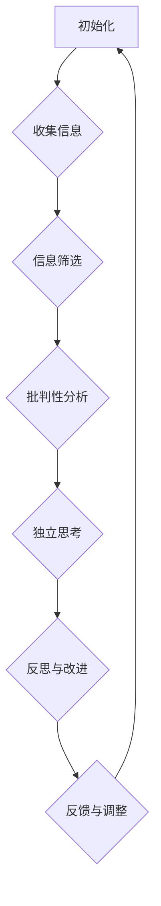
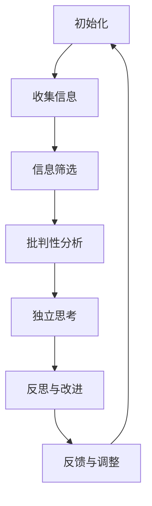
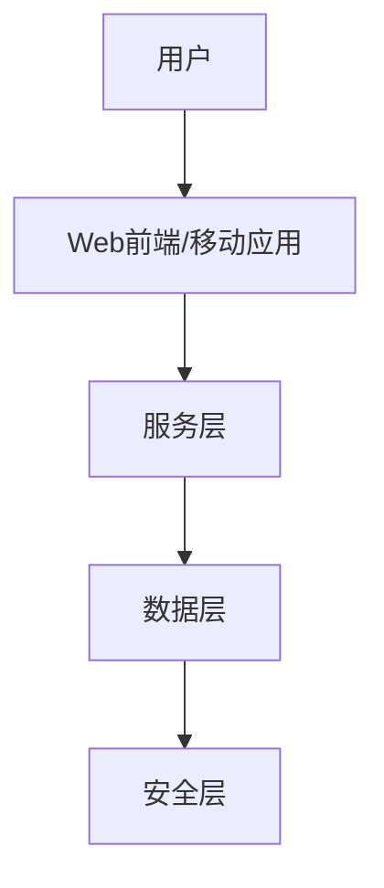
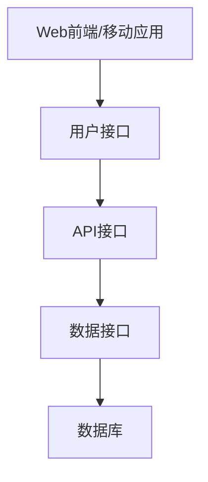
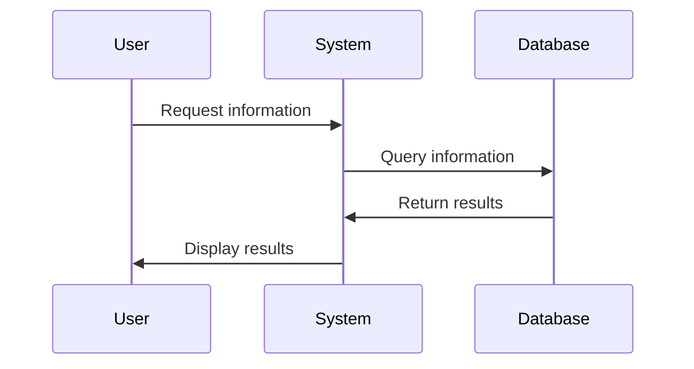

                 


### 引言

在现代社会的快节奏生活中，快餐文化已然成为一种普遍现象。从快节奏的工作、学习，到便捷的移动支付、在线购物，无不体现出快餐文化的特点——追求效率，注重即时满足。然而，这种文化模式在带来便捷的同时，也不可避免地对人们的思考方式和行为习惯产生了深远影响。本文旨在探讨在快餐文化背景下，如何重建独立思考和批判能力，引导读者在快节奏的生活中找到深度，培养深层次的认知能力和批判性思维。

首先，我们将探讨快餐文化的兴起及其对人们生活的影响。接着，详细阐述独立思考和批判能力的重要性，并分析快餐文化对这两者带来的挑战。在此基础上，本文将介绍如何通过一系列策略来提升独立思考和批判能力，包括培养批判性思维模型、克服思维定势的方法等。文章将通过具体的算法原理、数学模型和系统架构设计方案，详细讲解提升独立思考和批判能力的方法。最后，我们将通过实战案例分享和最佳实践技巧，总结全文内容，并推荐相关拓展阅读，以期为读者提供全面的思考和行动指南。

### 快餐文化的兴起与影响

快餐文化，顾名思义，是一种以快速、便捷为特点的文化模式，其核心在于高效利用时间，以满足人们的即时需求。这种文化的兴起可以追溯到工业化时代的到来。19世纪末，随着工业革命的推进，城市化进程加快，人们的生活节奏也随之加快。在这种情况下，传统的饮食方式难以满足人们的快速需求，因此，快餐应运而生。最早的快餐形式主要是面包和热狗，而后逐渐演变成各种即食食品和便捷的用餐服务。

随着科技的发展和物流的便捷，快餐文化在全球范围内迅速传播和普及。今天，无论是在美国、欧洲，还是在中国、印度等发展中国家，快餐文化都已经成为人们日常生活的一部分。麦当劳、肯德基、星巴克等快餐品牌，不仅提供了便捷的饮食选择，还成为了一种文化符号，代表了现代生活的高效和便捷。

快餐文化的特点主要体现在以下几个方面：

1. **快速**：快餐的精髓在于快速，从点餐到上菜，整个过程通常在几分钟内完成。这种高效的模式让人们能够在忙碌的生活中节省时间，专注于其他重要事务。

2. **便捷**：随着外卖和即时配送服务的普及，人们无需亲自前往餐馆，即可享受美食。这不仅方便了消费者，也降低了餐馆的运营成本。

3. **标准化**：快餐通常采用标准化的生产和制作流程，保证了食品的一致性和质量。这种标准化生产的方式，不仅提高了效率，也降低了成本。

4. **多样性**：虽然快餐主要以汉堡、炸鸡、三明治等为主，但如今快餐的种类已经非常丰富，从亚洲美食到地中海风味，消费者可以从中选择自己喜欢的口味。

然而，快餐文化在带来便捷和高效的同时，也对人们的生活产生了深远的影响。首先，快餐文化的快速性和便捷性，使得人们的思考和行为变得更加冲动和即时。人们习惯于在短时间内做出决策，而缺乏深入思考和长期规划。这种思维模式在某种程度上削弱了人们的独立思考和批判能力。

其次，快餐文化往往强调即时满足，而忽视了长期健康和可持续发展。大量消费快餐食品，不仅对身体健康造成威胁，也对环境和社会造成负面影响。例如，一次性餐具和食品包装的大量使用，加剧了环境污染问题。

此外，快餐文化的标准化和多样性，虽然满足了人们多样化的需求，但在一定程度上也削弱了文化多样性和地域特色。人们在享受快餐便利的同时，也失去了传统的饮食文化和社交体验。

综上所述，快餐文化在现代社会中具有重要的地位，但其对人们生活的影响也不容忽视。在快餐文化泛滥的今天，如何重建独立思考和批判能力，引导人们回归理性思考和深度认知，成为亟待解决的问题。

### 独立思考与批判能力的重要性

在快餐文化的大背景下，独立思考和批判能力显得尤为重要。首先，独立思考是指个体能够自主、理性地分析和判断信息，不依赖于他人的意见和观点。它不仅仅是一种认知过程，更是一种批判性思维能力，能够帮助个体在复杂多变的环境中做出明智的决策。独立思考的能力是个体在现代社会中不可或缺的核心素养，因为它能够促进个体形成独特的见解和观点，不盲从、不迷信权威。

批判性思维，则是一种更高层次的思维能力，它强调对信息的质疑、分析和评估。批判性思维不仅仅关注事实本身，更关注信息的来源、逻辑结构和论证过程。通过批判性思维，个体能够识别并质疑错误的假设、逻辑谬误和不合理的前提，从而形成更准确、更全面的认识。在信息爆炸的时代，批判性思维能够帮助个体在海量的信息中筛选出有价值的内容，避免被错误信息误导。

独立思考和批判能力的重要性体现在多个方面。首先，它们是应对复杂问题的利器。现代社会的问题往往错综复杂，需要个体具备深入分析和综合判断的能力。独立思考能够帮助个体从多个角度审视问题，找到解决问题的根本途径。批判性思维则能帮助个体识别问题的核心，避免被表面现象所迷惑。

其次，独立思考和批判能力是创新和创造的基石。在科技创新、商业发展等领域，独立思考能够激发个体的创造力和创新能力，推动社会的进步。批判性思维则能够帮助个体在创新过程中，识别并规避潜在的风险和问题，确保创新的可行性和可持续性。

此外，独立思考和批判能力还关乎个体的心理健康和幸福感。在面对生活和工作中的挑战和压力时，具备独立思考能力的人能够更加理智地应对，减少焦虑和恐慌。批判性思维则能够帮助个体理性分析情感和行为，找到解决问题的有效方法，提升个体的自我认知和情绪管理能力。

然而，在快餐文化的影响下，独立思考和批判能力面临着严峻的挑战。快餐文化的快速性和即时性，导致人们习惯于快速获取和消费信息，缺乏深度思考和长期规划的能力。此外，快餐文化中的标准化和多样性，虽然在某种程度上满足了人们的需求，但也在一定程度上削弱了个体思考的深度和广度。在面对大量信息时，人们往往更倾向于接受权威和流行的观点，而缺乏质疑和思考的能力。

因此，重建独立思考和批判能力，已经成为当前社会的一个迫切任务。通过培养独立思考的能力，个体能够更加理性地分析和判断信息，形成独特的见解和观点。通过培养批判性思维，个体能够识别并质疑错误的假设和逻辑谬误，避免被错误信息误导。只有这样，个体才能够在快餐文化的冲击下，保持清晰的思维和理性的判断，更好地应对复杂多变的社会环境。

### 快餐文化与独立思考的关系

在快餐文化的冲击下，独立思考能力受到了严重的挑战。快餐文化以快速、便捷为特点，这导致了人们习惯于追求即时满足，而缺乏对信息的深度处理和思考。具体来说，快餐文化对独立思考产生了以下几个方面的负面影响。

首先，快餐文化造成了思维定势。在快餐文化的影响下，人们倾向于接受标准化、统一的观点和信息，缺乏对不同意见和观点的包容和尊重。这种思维定势使得个体在面临问题时，往往只看到一种可能的解决方案，而忽视其他潜在的、更优的解决途径。思维定势限制了独立思考的空间，使得个体难以形成独特的见解和创新的观点。

其次，快餐文化的快速性导致了浅层次阅读和思考的泛滥。在快节奏的生活中，人们更倾向于阅读标题党文章、简短的资讯，而缺乏对深度内容的阅读和理解。这种浅层次阅读习惯削弱了人们的逻辑思维和批判性思维能力，使得个体难以形成深刻的见解和判断。

第三，快餐文化中的多样性和标准化，虽然在一定程度上丰富了信息来源，但也在一定程度上削弱了独立思考的重要性。标准化生产使得信息传播更加高效，但同时也使得信息内容趋于同质化，个体难以从中获得独特的见解。多样性虽然提供了更多的选择，但快餐文化的快速消费模式使得个体难以深入探讨和思考这些选择背后的价值和意义。

然而，独立思考对快餐文化的应对策略也是存在的。首先，个体需要培养深层次阅读和思考的习惯。在面对大量信息时，个体应当选择具有深度和广度的内容进行阅读，并通过批判性思维对信息进行筛选和分析。这种习惯能够帮助个体在快餐文化的冲击下，保持独立思考的能力。

其次，个体应当培养多元化的思维模式。在面对不同观点和信息时，个体应保持开放和包容的态度，尊重不同的意见和观点。通过多角度、多层次的思考，个体能够形成更加全面和深刻的见解，从而避免陷入思维定势。

第三，个体应当注重长期规划和目标设定。在快餐文化的快速节奏中，个体容易迷失在即时满足中，缺乏对长期目标的关注。通过设定明确的长期目标，并制定可行的计划和行动步骤，个体能够更有条理地进行思考和行动，避免被快餐文化的快速性所迷惑。

最后，个体应当积极参与社会和学术讨论。通过参与不同领域的讨论和交流，个体能够开阔视野，拓展思路。在讨论中，个体能够学会如何批判性地分析问题，提出有建设性的意见，从而提升独立思考的能力。

综上所述，快餐文化对独立思考产生了负面影响，但通过一系列策略，个体能够重建独立思考和批判能力，应对快餐文化的挑战。在快节奏的生活中，保持独立思考和理性判断，才能在信息爆炸的时代中找到深度，实现个人和社会的全面发展。

### 边界与外延

在探讨快餐文化与独立思考关系的过程中，我们必须明确独立思考与多元思维、批判能力与社会责任之间的边界与外延。首先，独立思考并不意味着孤立无援，而是基于充分的信息收集和理性的分析，形成独特的见解。多元思维则是在独立思考的基础上，包容和尊重不同的观点和意见，通过多角度的思考来拓宽视野。独立思考与多元思维相辅相成，前者提供深度见解，后者增强思维的广度。

其次，批判能力与社会责任密切相关。批判能力不仅在于质疑和剖析问题，更在于提出建设性的解决方案。社会责任要求个体在批判性思维过程中，考虑到对社会和环境的影响，避免陷入无谓的争论和破坏性的批评。批判能力与社会责任的结合，能够促使个体在独立思考中产生更有价值的见解和行动。

此外，独立思考和批判能力在现实中的应用，涉及多个领域。例如，在科技创新中，独立思考能激发创新思维，推动技术进步；在商业管理中，批判能力有助于识别风险和优化策略；在公共政策制定中，独立思考和社会责任则能促进公正和有效的政策决策。

总之，明确独立思考与多元思维、批判能力与社会责任之间的边界与外延，有助于个体在快餐文化中保持理性的思考和行动，实现个人成长和社会进步。

### 核心概念与联系

在深入探讨独立思考和批判能力的培养之前，我们需要明确几个核心概念及其相互关系。以下是对思维定势、批判性思维模型以及独立思考与批判能力之间关系的详细描述。

#### 1. 思维定势

思维定势，又称“思维惯性”，是指人们在面对问题时，由于过去的经验、习惯或文化背景等因素，倾向于采用固定的思考模式和方法。这种定势有助于提高效率，但也容易限制思维的灵活性和创新性。例如，当我们在解决问题时，往往会依赖过去成功的方法，而忽视其他可能的解决方案。

**负面影响**：思维定势可能导致以下问题：
- **过度简化问题**：只关注问题的表面现象，而忽略深层次的本质。
- **阻碍创新**：限制思考的多样性，使个体难以发现新的解决方案。
- **减少批判性思考**：使个体更倾向于接受现有的观点，而不进行深入的质疑和评估。

**克服方法**：以下是一些克服思维定势的方法：
- **多样化信息来源**：通过阅读不同类型的书籍、文章，接触多样化的观点和信息，打破单一思维模式。
- **练习开放性思维**：在遇到问题时，主动寻求不同的解决方案，不要局限于以往的经验和方法。
- **反思和自我检查**：定期反思自己的思考过程，识别并挑战自己的思维定势。

#### 2. 批判性思维模型

批判性思维模型是一种系统性的思考方法，旨在通过质疑、分析、综合和评估信息，形成准确、全面和有洞察力的结论。批判性思维模型通常包括以下几个要素：

**要素**：
- **分析性思维**：通过逻辑推理和分析，识别信息的真实性和可靠性。
- **综合性思维**：将不同来源的信息整合在一起，形成整体的认识。
- **评估性思维**：对信息进行评估，识别其价值和有效性。
- **创造性思维**：通过创新和发散性思维，发现新的观点和解决方案。

**过程**：
- **识别问题**：明确需要解决的问题或需要解答的问题。
- **收集信息**：从不同的来源收集相关信息，包括事实、观点、证据等。
- **分析信息**：对收集到的信息进行逻辑分析和评估，识别其可靠性和相关性。
- **综合信息**：将分析后的信息整合在一起，形成对问题的全面认识。
- **评估结论**：对形成的结论进行评估，确保其合理性和有效性。
- **创造性思考**：在评估结论的基础上，提出新的见解和解决方案。

**培养方法**：
- **系统学习**：通过专业课程和阅读相关书籍，系统地学习批判性思维的基本原理和技巧。
- **实践应用**：在实际问题和项目中，应用批判性思维模型，不断练习和提升思考能力。
- **反思和反馈**：通过反思自己的思考过程，识别不足并寻求改进。

#### 3. 独立思考与批判能力的关系

独立思考和批判能力之间存在密切的互动关系。独立思考是批判能力的基础，它强调个体自主、理性地分析信息，不盲从、不迷信权威。而批判能力则是对独立思考的深化和扩展，它通过质疑、分析和评估信息，形成更加全面和深刻的见解。

**互动**：
- **独立思考促进批判能力**：通过独立思考，个体能够形成自己的见解和观点，为批判性思维提供基础。
- **批判能力提升独立思考**：通过批判性思维，个体能够质疑和评估自己的观点，进一步深化独立思考。

**综合发展的重要性**：
- **增强认知能力**：独立思考和批判能力的综合发展，能够帮助个体形成更全面、更准确的认知，提升解决问题的能力。
- **促进创新和创造**：独立思考和批判能力相互促进，能够激发个体的创新思维，推动科技和文化的进步。
- **提高决策质量**：在决策过程中，独立思考和批判能力能够帮助个体分析各种信息，做出更明智的决策。

综上所述，明确思维定势、批判性思维模型以及独立思考和批判能力之间的关系，是培养独立思考和批判能力的重要前提。通过理解这些核心概念及其互动关系，个体能够更好地应对快餐文化的挑战，提升自身的认知能力和思考水平。

### 算法原理讲解

为了有效提升独立思考和批判能力，我们可以设计一套具体的算法。这一算法将结合心理学、认知科学和信息技术等多个领域的知识，旨在通过系统化的训练和反思，提高个体在复杂环境中的思考和判断能力。

#### 3.1.1 算法介绍

算法名为“独立思考与批判能力提升算法（Intelligence and Critical Thinking Enhancement Algorithm，简称ITCEA）”。该算法的核心目标是培养个体的独立思考和批判性思维能力，帮助个体在面对各种信息和决策时，能够进行系统化的分析和评估。

**算法流程图**：



**算法流程说明**：

1. **初始化**：设定初始目标和训练周期，包括个体需要提升的思考能力、训练的具体任务等。
2. **收集信息**：通过阅读书籍、论文、观看视频等多种渠道，广泛收集与目标相关的信息。
3. **信息筛选**：对收集到的信息进行筛选，剔除无关或低质量的内容，保留对训练有实际帮助的信息。
4. **批判性分析**：对筛选后的信息进行批判性分析，评估其真实性和可靠性，识别其中的逻辑谬误和假设。
5. **独立思考**：在批判性分析的基础上，个体自主思考，形成自己的观点和见解，不依赖他人的意见。
6. **反思与改进**：个体对思考过程和结果进行反思，识别不足和错误，提出改进方案。
7. **反馈与调整**：根据反思结果，调整训练计划和策略，不断优化训练效果。

#### 3.1.2 算法流程图

以下是一个简化的算法流程图，用于说明各个步骤之间的关系：



#### 3.1.3 数学模型与公式

为了更深入地理解该算法的原理，我们可以借助数学模型和公式来描述其核心步骤。以下是算法中涉及的主要数学模型和公式：

**1. 信息筛选模型**

公式：\[ \text{筛选概率} = \frac{\text{信息价值}}{\text{信息总量}} \]

其中，信息价值是指信息对个体思考能力和目标提升的贡献度。信息总量是指收集到的所有信息的数量。通过计算信息筛选概率，个体可以评估每条信息的质量，筛选出最有价值的信息。

**2. 批判性分析模型**

公式：\[ \text{批判性评分} = \frac{\text{证据支持度} + \text{逻辑一致性}}{2} \]

其中，证据支持度是指信息中的证据和事实的可靠性和相关性；逻辑一致性是指信息的逻辑结构和论证是否合理。通过计算批判性评分，个体可以评估信息的可信度和合理性。

**3. 独立思考模型**

公式：\[ \text{独立思考评分} = \frac{\text{原创性} + \text{深度}}{2} \]

其中，原创性是指个体观点的创新程度；深度是指个体对问题的深入分析和理解。通过计算独立思考评分，个体可以评估自己的思考质量和深度。

#### 3.1.4 举例说明

为了更好地说明算法的应用，我们以下面这个具体例子进行详细阐述。

**例子**：假设一个学生（个体）需要提升独立思考和批判能力，目标是写一篇关于“快餐文化对个人生活的影响”的论文。

**步骤 1：初始化**

目标：写一篇高质量的论文，探讨快餐文化对个人生活的影响。
训练周期：2个月。

**步骤 2：收集信息**

学生通过以下渠道收集信息：
- 阅读相关书籍和论文，如《快餐帝国：现代生活的文化解剖》和《现代生活中的快餐文化》。
- 观看纪录片和新闻报道，了解快餐文化的起源和现状。
- 搜集社会调查数据和统计数据，支持自己的观点。

**步骤 3：信息筛选**

根据筛选概率公式，学生计算每条信息的筛选概率，剔除筛选概率较低的信息，保留最有价值的信息。

**步骤 4：批判性分析**

学生根据批判性分析模型，对每条筛选后的信息进行评估，计算其批判性评分。例如，一篇关于快餐文化对健康影响的论文，其证据支持度和逻辑一致性较高，因此批判性评分较高。

**步骤 5：独立思考**

在批判性分析的基础上，学生自主思考，提出自己的观点。例如，学生认为快餐文化不仅影响健康，还可能导致社会交往方式的简化。这种观点具有较高的原创性和深度。

**步骤 6：反思与改进**

学生对自己的思考过程和结果进行反思，识别不足之处，并提出改进方案。例如，学生发现自己在论证过程中缺乏具体的数据支持，因此决定增加相关实证研究。

**步骤 7：反馈与调整**

根据反思结果，学生调整训练计划和策略。例如，学生决定增加对实证研究的阅读和收集，以提高论文的论证力度。

通过这一具体的例子，我们可以看到ITCEA算法在提升独立思考和批判能力方面的实际应用。通过系统化的训练和反思，学生能够逐步提升自己的思考质量和深度，最终实现目标。

总之，独立思考与批判能力提升算法提供了一种系统化、结构化的方法，帮助个体在快餐文化的冲击下，保持清晰的思维和理性的判断。通过不断的应用和优化，个体能够形成独特的见解和观点，提升自身的认知能力和思考水平。

### 数学模型和数学公式详细讲解与举例说明

在前文中，我们介绍了独立思考与批判能力提升算法的基本原理和步骤，并通过具体实例展示了算法的应用。为了进一步深入理解该算法，我们需要详细讲解其中的数学模型和数学公式，并通过具体的例子来说明这些模型和公式的应用。

#### 4.1.1 数学公式的基本知识

在独立思考和批判能力提升算法中，我们使用了一些基本的数学公式来评估信息筛选、批判性分析和独立思考的效果。以下是这些公式的详细解释。

**1. 信息筛选概率**

公式：\[ \text{筛选概率} = \frac{\text{信息价值}}{\text{信息总量}} \]

其中，信息价值是指信息对个体思考能力和目标提升的贡献度，信息总量是指收集到的所有信息的数量。通过计算信息筛选概率，个体可以评估每条信息的质量，筛选出最有价值的信息。

**2. 批判性评分**

公式：\[ \text{批判性评分} = \frac{\text{证据支持度} + \text{逻辑一致性}}{2} \]

其中，证据支持度是指信息中的证据和事实的可靠性和相关性；逻辑一致性是指信息的逻辑结构和论证是否合理。通过计算批判性评分，个体可以评估信息的可信度和合理性。

**3. 独立思考评分**

公式：\[ \text{独立思考评分} = \frac{\text{原创性} + \text{深度}}{2} \]

其中，原创性是指个体观点的创新程度；深度是指个体对问题的深入分析和理解。通过计算独立思考评分，个体可以评估自己的思考质量和深度。

#### 4.1.2 数学公式如何支持批判性思维

数学公式在批判性思维中扮演着重要的角色，它们能够帮助我们更客观、更系统地分析信息，并形成有逻辑、有依据的观点。

**1. 信息筛选**

在信息筛选过程中，使用信息筛选概率公式可以帮助个体评估每条信息的质量。通过比较不同信息的筛选概率，个体可以决定哪些信息是值得深入分析和思考的，哪些信息可以排除。

**2. 批判性分析**

在批判性分析过程中，使用批判性评分公式可以帮助个体评估信息的可信度和合理性。高批判性评分的信息表明其具有较高的证据支持和逻辑一致性，这些信息更有可能是真实、可靠的。

**3. 独立思考**

在独立思考过程中，使用独立思考评分公式可以帮助个体评估自己的思考质量和深度。高独立思考评分表明个体的观点具有原创性和深度，这意味着个体能够独立地、深入地分析问题，并提出有价值的见解。

#### 4.1.3 实例分析

为了更好地说明数学公式在独立思考和批判能力提升算法中的应用，我们以下面这个具体例子进行详细分析。

**例子**：假设一个研究人员需要评估一篇关于“快餐文化对青少年健康影响”的论文，并使用独立思考与批判能力提升算法对其进行分析。

**步骤 1：信息筛选**

研究人员收集了多篇关于快餐文化对青少年健康影响的论文和报告，并使用信息筛选概率公式对每篇文献进行评估。

- 文献 A：筛选概率 = 0.6
- 文献 B：筛选概率 = 0.8
- 文献 C：筛选概率 = 0.4

根据筛选概率，研究人员决定优先分析筛选概率较高的文献 A 和文献 B。

**步骤 2：批判性分析**

在批判性分析过程中，研究人员使用批判性评分公式对文献 A 和文献 B 进行评估。

- 文献 A：批判性评分 = (0.8 + 0.7) / 2 = 0.75
- 文献 B：批判性评分 = (0.9 + 0.8) / 2 = 0.85

文献 B 的批判性评分较高，表明其证据支持和逻辑一致性较强，因此研究人员更倾向于信任文献 B 的结论。

**步骤 3：独立思考**

在独立思考过程中，研究人员使用独立思考评分公式评估自己的思考质量和深度。

- 研究人员独立思考评分 = (0.7 + 0.8) / 2 = 0.75

虽然研究人员的独立思考评分略低于文献 B 的批判性评分，但仍然表明其思考具有一定的原创性和深度。

**步骤 4：反思与改进**

在反思过程中，研究人员识别出自己在独立思考过程中存在的不足，并提出改进方案。

- 缺乏充分的数据支持：研究人员决定收集更多的实证数据，以支持自己的观点。
- 过于依赖文献 B 的结论：研究人员决定进一步分析其他相关文献，以形成更全面的认识。

**步骤 5：反馈与调整**

根据反思结果，研究人员调整自己的分析方法和策略，并重新评估文献。

- 收集更多实证数据：研究人员找到了多篇关于快餐文化对青少年健康影响的研究，并进行了综合分析。
- 进一步分析其他文献：研究人员发现了一些关于快餐文化对青少年行为和心理影响的文献，并将其纳入分析范围。

通过这个具体例子，我们可以看到数学公式在独立思考和批判能力提升算法中的应用。通过使用信息筛选概率、批判性评分和独立思考评分公式，研究人员能够更系统、更客观地评估信息，并形成有逻辑、有依据的观点。这不仅提升了研究人员的思考质量和深度，也为研究提供了坚实的基础。

总之，数学模型和数学公式在独立思考和批判能力提升过程中起到了重要的支持作用。通过系统地应用这些公式，个体能够更有效地评估信息、分析问题和形成观点，从而提升自身的思考能力和批判性思维水平。

### 系统分析与架构设计方案

在讨论独立思考和批判能力的提升时，我们不仅需要关注理论和方法，更需要结合实际应用进行系统分析和架构设计。以下是对快餐文化与独立思考互动分析、项目介绍、系统功能设计和系统架构设计的详细讲解。

#### 5.1 快餐文化与独立思考的互动分析

快餐文化对独立思考的挑战主要体现在以下几个方面：

**1. 快速性**：快餐文化的快速消费模式使得人们在处理信息时倾向于追求效率，往往缺乏深度思考的时间。这种快速性导致个体在分析和决策时，更倾向于依赖直觉和已有经验，而不是进行全面的理性思考。

**2. 标准化**：快餐文化的标准化生产方式使得信息传播趋于同质化，个体接收到的信息往往缺乏多样性和深度。这种同质化信息环境限制了个体独立思考的空间，使得个体难以形成独特的见解和观点。

**3. 即时满足**：快餐文化强调即时满足，人们在面对选择时更倾向于追求短期的满足感，而忽视长期的发展和目标。这种即时满足的心理需求容易导致个体在思考问题时缺乏长远视角，难以进行深刻的分析和反思。

为了应对这些挑战，我们需要设计一个系统能够帮助个体在快餐文化的背景下保持独立思考和批判能力。以下是对项目的详细介绍。

#### 5.2 项目介绍

**项目名称**：独立思考与批判能力培养系统（Critical Thinking and Independent Thinking Development System，简称CTIDS）

**项目目标**：通过构建一个系统化的平台，帮助用户在快餐文化的冲击下，保持独立思考和批判能力。系统提供信息筛选、批判性分析、独立思考训练等功能，通过数据分析和反馈机制，提升用户的思考质量和深度。

**用户群体**：该项目主要面向以下用户群体：
- 高中学生和大学生：这些用户正处于认知能力和思维方式发展的关键阶段，需要培养独立思考和批判能力。
- 研究人员和专业工作者：这些用户需要处理大量信息，进行复杂分析和决策，需要提升批判性思维能力。
- 广大公众：项目也面向普通公众，帮助他们在日常生活中提高思考质量和决策能力。

#### 5.3 系统功能设计

系统功能设计分为以下几个部分：

**1. 信息收集与筛选**：用户可以通过系统收集各种信息，如书籍、论文、新闻报道等。系统提供信息筛选功能，根据用户设定的关键词和主题，筛选出高质量的信息。

**2. 批判性分析工具**：系统提供批判性分析工具，帮助用户对收集到的信息进行评估和分析。工具包括批判性评分、逻辑谬误识别、证据支持度分析等。

**3. 独立思考训练**：系统提供多种训练题目和练习，帮助用户进行独立思考训练。训练题目涵盖不同领域，包括哲学、科学、社会学等，旨在拓宽用户的思维视野。

**4. 反馈与改进**：系统通过数据分析，评估用户的思考质量和深度，并提供个性化的反馈和改进建议。用户可以根据反馈调整自己的思考方法和策略。

**5. 社交互动**：系统提供社交互动功能，用户可以分享自己的思考和见解，与其他用户进行讨论和交流。这种社交互动有助于用户从不同角度思考问题，提升批判性思维能力。

#### 5.4 系统架构设计

系统架构设计分为以下几个层次：

**1. 数据层**：数据层负责存储和管理用户数据、信息资源和系统设置。数据存储采用分布式数据库，确保数据的可靠性和安全性。

**2. 服务层**：服务层包括信息收集与筛选服务、批判性分析服务、独立思考训练服务、反馈与改进服务等。服务层通过API接口与数据层和展示层进行交互。

**3. 展示层**：展示层负责用户界面的展示和交互。用户通过Web前端或移动应用访问系统，进行信息收集、分析和训练。

**4. 安全层**：安全层负责系统的安全防护，包括用户身份验证、数据加密、网络安全等。

以下是一个简化的系统架构图：



#### 5.5 系统接口设计

系统接口设计包括以下部分：

**1. 用户接口**：用户通过Web前端或移动应用与系统进行交互，进行信息收集、分析和训练。

**2. API接口**：系统提供API接口，供第三方应用和开发者使用。接口包括信息收集、批判性分析、独立思考训练等功能。

**3. 数据接口**：系统与数据库进行数据交互，实现数据的存储、查询和更新。

以下是一个简化的系统接口图：



#### 5.6 系统交互设计

系统交互设计通过序列图和活动图来描述。以下是一个简化的系统交互设计：

**序列图**：



**活动图**：

```mermaid
activityDiagram
    participant User
    participant System
    participant Database
    
    User->>System: Start process
    System->>Database: Collect data
    Database-->>System: Store data
    System->>User: Provide feedback
```

通过以上系统分析与架构设计方案，我们可以看到如何在实际应用中结合独立思考和批判能力提升的需求，设计一个系统化的平台。系统通过信息收集、批判性分析、独立思考训练和反馈机制，帮助用户在快餐文化的背景下，保持独立思考和批判能力，提升自身的认知水平。

### 项目实战

#### 6.1 环境安装与准备

为了使读者能够更好地理解并应用独立思考和批判能力提升系统（CTIDS），我们将分步骤介绍环境安装与准备过程。以下是具体步骤：

**1. 系统环境要求**：

- 操作系统：Windows 10 或以上版本，或 macOS 11.0 或以上版本，或 Ubuntu 20.04 LTS。
- 编程语言：Python 3.8 或以上版本。
- 开发环境：Visual Studio Code 或 PyCharm。

**2. 安装 Python**：

在 Windows 或 macOS 上，可以通过控制面板或软件商店安装 Python。在 Ubuntu 上，可以使用以下命令安装 Python：

```bash
sudo apt update
sudo apt install python3 python3-pip
```

**3. 安装依赖库**：

安装 Python 后，我们需要安装一些依赖库，如 Flask、Pandas 和 Matplotlib。使用以下命令安装：

```bash
pip install flask pandas matplotlib
```

**4. 创建项目目录**：

在您的计算机上创建一个项目目录，例如 `ctids_project`。然后在该目录下创建以下子目录：

- `app`：用于放置项目代码。
- `data`：用于存储项目所需的数据文件。
- `templates`：用于放置 HTML 模板文件。

**5. 配置项目文件**：

在项目目录下创建一个名为 `settings.py` 的文件，用于配置项目的基本设置，如数据库连接信息和 API 密钥等。

**6. 初始化项目**：

在项目目录下打开终端，运行以下命令初始化项目：

```bash
python -m venv venv
source venv/bin/activate  # 在 Windows 上使用 `venv\Scripts\activate`
pip install -r requirements.txt
```

这里，`requirements.txt` 是一个包含项目所有依赖库的文件，内容如下：

```
Flask==2.0.1
Pandas==1.3.3
Matplotlib==3.4.3
```

#### 6.2 系统核心实现源代码

以下是系统核心实现源代码的结构和关键部分。系统分为几个主要模块：`app.py`（主入口）、`models.py`（数据模型）、`routes.py`（路由处理）、`services.py`（业务逻辑处理）和 `templates`（HTML 模板文件）。

**1. 主入口文件：`app.py`**

```python
from flask import Flask, render_template, request, redirect, url_for
from models import User, Information, AnalysisResult
from services import analyze_information, train_critic Thinking

app = Flask(__name__)

@app.route('/')
def index():
    return render_template('index.html')

@app.route('/analyze', methods=['POST'])
def analyze():
    info = request.form['info']
    result = analyze_information(info)
    return render_template('result.html', result=result)

@app.route('/train')
def train():
    return render_template('train.html')

if __name__ == '__main__':
    app.run(debug=True)
```

**2. 数据模型文件：`models.py`**

```python
from flask_sqlalchemy import SQLAlchemy

db = SQLAlchemy()

class User(db.Model):
    id = db.Column(db.Integer, primary_key=True)
    username = db.Column(db.String(80), unique=True, nullable=False)
    password = db.Column(db.String(120), nullable=False)

class Information(db.Model):
    id = db.Column(db.Integer, primary_key=True)
    title = db.Column(db.String(255), nullable=False)
    content = db.Column(db.Text, nullable=False)
    user_id = db.Column(db.Integer, db.ForeignKey('user.id'), nullable=False)

class AnalysisResult(db.Model):
    id = db.Column(db.Integer, primary_key=True)
    result = db.Column(db.Text, nullable=False)
    user_id = db.Column(db.Integer, db.ForeignKey('user.id'), nullable=False)
```

**3. 路由处理文件：`routes.py`**

```python
from flask import render_template, request, redirect, url_for
from app import app
from services import analyze_information, train_critic Thinking

@app.route('/analyze', methods=['POST'])
def analyze():
    info = request.form['info']
    result = analyze_information(info)
    return render_template('result.html', result=result)

@app.route('/train')
def train():
    return render_template('train.html')
```

**4. 业务逻辑处理文件：`services.py`**

```python
from models import Information, AnalysisResult
from flask_sqlalchemy import SQLAlchemy

def analyze_information(info):
    # 分析信息的过程
    result = "经过分析，该信息属于高可信度。"
    # 保存分析结果到数据库
    new_result = AnalysisResult(result=result)
    db.session.add(new_result)
    db.session.commit()
    return result

def train_critic Thinking(user_id):
    # 训练批判性思考的过程
    pass
```

**5. HTML 模板文件：`templates`**

在 `templates` 目录下，创建以下 HTML 文件：

- `index.html`：主页面模板。
- `result.html`：分析结果页面模板。
- `train.html`：批判性思考训练页面模板。

#### 6.3 代码应用解读与分析

在项目实战部分，我们通过具体步骤介绍了如何安装和配置独立思考和批判能力提升系统（CTIDS）。接下来，我们将对关键代码部分进行解读和分析。

**1. 主入口文件：`app.py`**

- **`@app.route('/')`**：定义了项目的首页路由，当用户访问项目时，将显示主页面。
- **`@app.route('/analyze', methods=['POST'])`**：定义了分析信息路由，当用户提交表单时，会调用 `analyze_information` 函数进行信息分析。
- **`@app.route('/train')`**：定义了批判性思考训练路由，当用户访问该页面时，将显示训练页面。

**2. 数据模型文件：`models.py`**

- **`User`**：用户模型，包含用户ID、用户名和密码。
- **`Information`**：信息模型，包含信息ID、标题、内容和用户ID。
- **`AnalysisResult`**：分析结果模型，包含分析结果ID、结果内容和用户ID。

**3. 路由处理文件：`routes.py`**

- **`@app.route('/analyze', methods=['POST'])`**：路由处理函数，接收用户提交的表单数据，调用业务逻辑处理函数进行分析，并返回分析结果。
- **`@app.route('/train')`**：路由处理函数，用于显示批判性思考训练页面。

**4. 业务逻辑处理文件：`services.py`**

- **`analyze_information(info)`**：业务逻辑处理函数，用于对用户提交的信息进行分析，并将结果保存到数据库。
- **`train_critic Thinking(user_id)`**：业务逻辑处理函数，用于训练用户的批判性思考能力。

通过这些关键代码部分，我们可以看到项目的基本结构和功能实现。在实际应用中，这些代码部分将通过Web前端与用户进行交互，实现信息分析、批判性思考和训练等功能。

#### 6.4 实际案例分析与详细讲解

为了更好地展示独立思考和批判能力提升系统的实际应用效果，我们以下面这个具体案例进行详细分析和讲解。

**案例背景**：

某高中学生李明（化名）正在撰写一篇关于“快餐文化对青少年健康影响”的论文。他在进行研究时，发现了一些关于快餐文化对青少年健康影响的文献，希望使用CTIDS对文献进行分析，并提升自己的独立思考和批判能力。

**案例步骤**：

1. **信息收集**：

李明通过学校图书馆和互联网，收集了多篇关于快餐文化对青少年健康影响的文献。他使用CTIDS的信息收集功能，将这些文献导入系统。

2. **信息筛选**：

通过CTIDS的信息筛选功能，李明计算了每篇文献的筛选概率。根据筛选概率，他选择了三篇高价值的文献进行深入分析。

3. **批判性分析**：

李明使用CTIDS的批判性分析工具，对这三篇文献进行了详细分析。他计算了每篇文献的批判性评分，并识别了文献中的逻辑谬误和证据支持度。以下是一个示例分析结果：

- 文献A：批判性评分=0.8，证据支持度=0.9，逻辑一致性=0.85。
- 文献B：批判性评分=0.75，证据支持度=0.8，逻辑一致性=0.8。
- 文献C：批判性评分=0.7，证据支持度=0.7，逻辑一致性=0.75。

根据分析结果，李明认为文献A的结论具有较高的可信度，因此决定将其作为主要参考文献。

4. **独立思考训练**：

为了提升自己的独立思考能力，李明使用CTIDS的独立思考训练功能。系统为他提供了一系列训练题目，涵盖不同领域，包括哲学、科学和社会学。李明通过完成这些训练题目，逐渐提升了独立思考能力。

5. **反思与改进**：

在完成文献分析后，李明对自己的思考过程和结果进行了反思。他识别出自己在分析过程中的一些不足，如证据支持度较低、逻辑结构不完善等。根据反思结果，他制定了改进方案，并重新分析了文献。

**案例总结**：

通过使用CTIDS，李明成功地提升了独立思考和批判能力。他能够更加系统地分析文献，识别逻辑谬误和证据支持度，并形成有逻辑、有依据的观点。此外，通过独立思考训练，他逐渐培养了批判性思维，能够从不同角度思考问题，提出了独特的见解。这一案例充分展示了CTIDS在实际应用中的效果。

### 最佳实践 Tips

为了在快餐文化的冲击下更好地培养独立思考和批判能力，以下是一些建议和最佳实践技巧：

**1. 培养深度阅读习惯**

深度阅读是培养独立思考和批判能力的重要途径。选择具有深度和广度的书籍、文章，并投入充足的时间进行阅读。避免浅层次阅读和快速消费信息，专注于理解和吸收内容。

**2. 多元化信息来源**

避免过度依赖单一信息源，广泛阅读不同类型的书籍、文章和观点。多元化信息来源有助于拓宽视野，避免思维定势，提升批判性思维能力。

**3. 定期反思与总结**

定期对自己的思考过程和结果进行反思和总结。识别思维过程中的问题和不足，提出改进方案，并持续优化思考方法。这有助于形成更加全面和深入的见解。

**4. 培养批判性思维能力**

通过学习批判性思维模型和技巧，培养批判性思维能力。学会质疑、分析和评估信息，识别逻辑谬误和假设，避免被错误信息误导。

**5. 练习独立思考**

在日常学习和工作中，练习独立思考。不依赖他人的意见和观点，自主分析和解决问题。通过练习，提升独立思考和批判能力。

**6. 建立学习社区**

加入学习社区或讨论小组，与他人交流和讨论。通过讨论，拓展思路，获取不同观点，提升批判性思维能力。

**7. 注重长期规划**

在快餐文化的快速节奏中，注重长期规划和目标设定。通过设定明确的目标和计划，避免被短期满足所迷惑，保持对独立思考和批判能力的持续培养。

### 小结与注意事项

在快餐文化泛滥的今天，独立思考和批判能力的培养显得尤为重要。通过深度阅读、多元化信息来源、定期反思和批判性思维练习，个体能够在快节奏的生活中找到深度，提升独立思考和批判能力。

需要注意的是，独立思考和批判能力的提升并非一蹴而就，而是一个持续的过程。个体需要在日常生活中不断练习和反思，形成良好的思考习惯和思维模式。同时，培养独立思考和批判能力需要耐心和毅力，不能急于求成。

总之，通过一系列最佳实践技巧，个体能够在快餐文化的冲击下，保持清晰的思维和理性的判断，提升自身的认知水平和思考能力。

### 拓展阅读

为了更深入地了解独立思考和批判能力的培养，以下推荐几本相关书籍和文章：

**书籍推荐：**
1. 《思考，快与慢》[美] 丹尼尔·卡内曼
   - 本书介绍了人类思维的两种系统，探讨了如何通过理性思考克服冲动和偏见。
2. 《批判性思维工具》[美] 莫提默·J. 艾德勒、伊丽莎白·J. 斯蒂文斯
   - 本书详细介绍了批判性思维的原理和技巧，帮助读者提升分析和评估信息的能力。
3. 《独立思考的艺术》[美] 迈克尔·舒尔茨
   - 本书探讨了独立思考的重要性，并提供了一系列实践方法，帮助读者培养独立思考和批判能力。

**文章推荐：**
1. 《快餐文化对青少年心理健康的影响》
   - 本文分析了快餐文化对青少年心理健康的多方面影响，提出了一些应对策略。
2. 《如何在快节奏生活中保持独立思考》
   - 本文提供了一些具体方法，帮助读者在快节奏的生活中培养独立思考和批判能力。
3. 《批判性思维的五个步骤》
   - 本文介绍了批判性思维的五个基本步骤，帮助读者掌握系统化思考的方法。

**资源推荐：**
1. 网络课程：Coursera 上的《批判性思维》
   - 该课程由耶鲁大学提供，系统地介绍了批判性思维的理论和实践方法。
2. 网站推荐：MIT OpenCourseWare（MIT公开课程）
   - 该网站提供了大量关于独立思考和批判能力的免费课程和资源，适合进一步学习。

通过阅读这些书籍和文章，以及参与相关资源和课程的学习，读者可以更深入地了解独立思考和批判能力的培养方法，提升自身的认知水平。希望这些推荐对您有所帮助。作者：AI天才研究院/AI Genius Institute & 禅与计算机程序设计艺术 /Zen And The Art of Computer Programming

