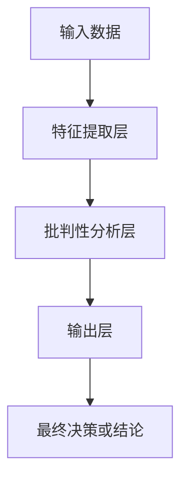
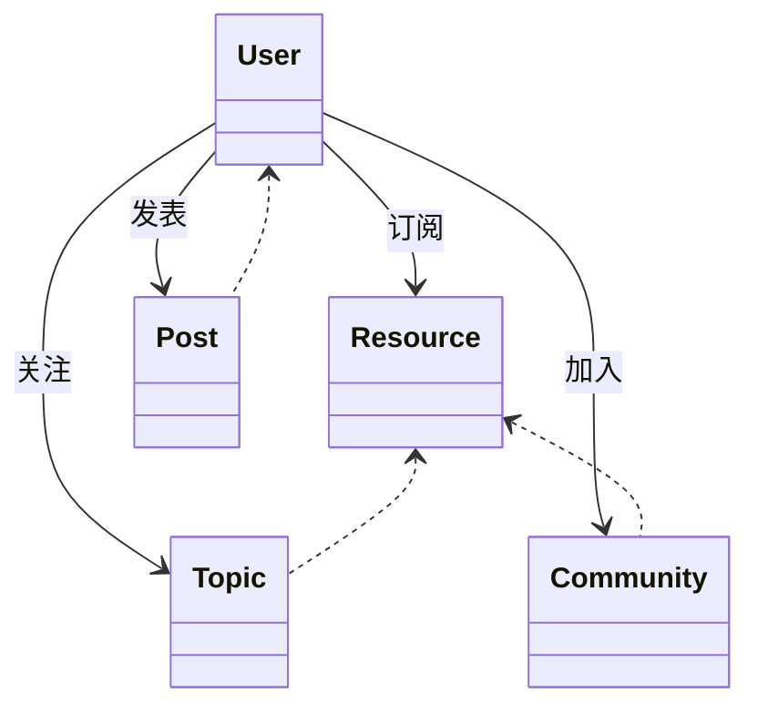
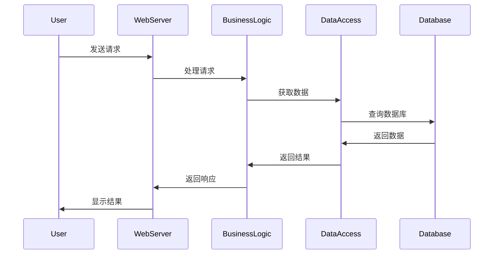
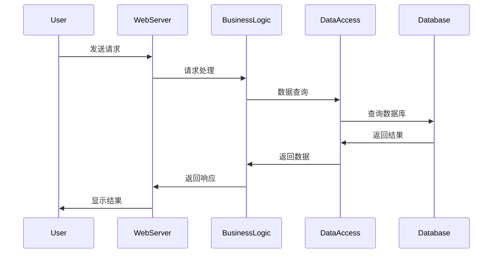

                 


### # 在快餐文化中寻找深度：重建独立思考和批判能力

#### > 关键词：快餐文化、独立思考、批判能力、深度学习、技术素养

> 摘要：在当今快节奏的社会中，快餐文化侵蚀了我们的独立思考和批判能力。本文将探讨快餐文化对技术领域的深远影响，并提出一系列策略，帮助我们在这种文化背景下重建独立思考和批判能力。通过技术博客的形式，本文旨在为广大IT从业者提供一盏指引灯，引导他们回归深度学习的本质，培养技术素养，成为具备独立思考和创新能力的专业人才。

## 引言：快餐文化的崛起

在现代社会中，快节奏的生活方式成为了常态。人们追求效率，渴望快速获取信息和解决问题，这种需求催生了快餐文化。快餐文化不仅仅体现在食品消费上，还渗透到了信息获取、知识学习、工作方式和人际交流等多个领域。在这种文化背景下，独立思考和批判能力的重要性日益凸显，然而它们却在快餐文化的侵蚀下逐渐减弱。

### 什么是快餐文化

快餐文化是一种追求速度和效率的文化现象，它强调即时满足和短期效应。以下是快餐文化的一些典型特征：

1. **信息过载**：在互联网时代，信息爆炸，人们面临大量的信息涌入，很难进行深入的分析和思考。
2. **短平快**：人们倾向于追求快速、简单的解决方案，而忽视了复杂问题背后的深层次原因。
3. **功利主义**：在快餐文化的驱动下，人们更注重短期利益，而忽视了长远的发展和深入的学习。
4. **表面化**：快餐文化往往追求表面的华丽和形式，而忽视了实质和内涵。
5. **同质化**：快餐文化倾向于标准化和统一化，创新和个性被压制。

### 快餐文化对独立思考和批判能力的影响

快餐文化对独立思考和批判能力产生了多方面的负面影响：

1. **削弱批判性思维**：快餐文化的短平快特征使人们容易接受表面化的信息，缺乏对事物的深入分析和批判性思考。
2. **降低学习深度**：追求短期效应和功利主义导致人们倾向于选择速成班和简单化的学习方式，忽视了系统性和深度的学习。
3. **减少创新能力**：快餐文化的同质化和标准化特征抑制了创新思维的发展，使得人们在解决问题时倾向于采用既定的模板和套路。
4. **影响道德和价值观**：快餐文化的功利主义和表面化特征可能扭曲人们的价值观，使他们更关注物质利益而忽视精神追求。

### 技术领域中的快餐文化

在技术领域，快餐文化的现象尤为明显。以下是技术领域中快餐文化的几个典型表现：

1. **快速迭代**：软件开发的快速迭代模式导致开发者更注重短期交付和功能实现，而忽视了长期的技术积累和架构设计。
2. **技术速成班**：许多技术培训机构和在线课程提供短期的技术培训，使得学习者很难掌握深度的技术知识。
3. **功利主义**：一些技术从业者为了追求高薪和快速晋升，忽视了技术本身的内在价值，导致技术的滥用和过度商业化。
4. **同质化竞争**：技术领域中存在严重的同质化竞争，企业和技术人员往往追求热门技术和流行的解决方案，而忽视了创新和个性化。

## 建立独立思考和批判能力的重要性

在快餐文化中，独立思考和批判能力的重要性不言而喻。以下是独立思考和批判能力在技术领域中的几个关键作用：

1. **解决问题的能力**：独立思考和批判能力使技术人员能够从多角度分析问题，找到根本原因，并提出创新的解决方案。
2. **技术深度掌握**：通过独立思考和批判性学习，技术人员能够深入理解技术原理，掌握核心知识，避免陷入技术速成和表面化的陷阱。
3. **创新能力**：独立思考和批判能力是创新思维的基础，它能够激发技术人员的创造力，推动技术的进步和发展。
4. **道德和责任**：独立思考和批判能力使技术人员能够对技术进行深入反思，避免技术滥用，维护社会的公共利益。

### 重建独立思考和批判能力的方法

在快餐文化的背景下，重建独立思考和批判能力需要采取一系列具体的策略和方法：

1. **系统学习**：避免速成和功利主义，通过系统性的学习，掌握技术领域的核心知识和原理。
2. **深度阅读**：阅读经典的技术书籍和论文，了解前人的研究成果和思考方式，培养批判性思维。
3. **多角度思考**：在解决问题时，多从不同角度分析问题，避免片面和表面化的判断。
4. **批判性讨论**：参与技术社区的讨论和辩论，与他人交流观点，激发思想的碰撞和进步。
5. **实践经验**：通过实际项目和技术实践，将理论知识应用到实际中，培养解决实际问题的能力。
6. **反思和总结**：在学习和实践中不断反思和总结，提炼经验教训，不断提高自己的独立思考和批判能力。

## 快餐文化与技术素养

技术素养是指技术人员在技术知识、技能、态度和价值观等方面的全面素质。在快餐文化中，技术素养的培养变得尤为重要。以下是快餐文化对技术素养的影响以及如何提高技术素养的建议：

1. **快餐文化对技术素养的影响**：
   - **知识浅薄**：快餐文化容易导致技术人员知识体系的不完整和浅薄，难以应对复杂的技术问题。
   - **技能单一**：快餐文化注重短期的技能提升，可能导致技术人员缺乏全面的技术能力。
   - **缺乏创新精神**：快餐文化的同质化和标准化特征压制了技术人员的创新思维。

2. **提高技术素养的建议**：
   - **终身学习**：技术领域发展迅速，技术人员需要具备终身学习的意识和能力，不断更新知识和技能。
   - **多元化学习**：通过阅读、实践、交流等多种途径，获取多元化的知识，提高综合素养。
   - **批判性思维**：培养批判性思维，对技术进行深入反思，避免盲目跟风和表面化学习。
   - **实践经验**：通过实际项目和技术实践，积累经验，提高实际解决问题的能力。
   - **社会责任感**：技术人员需要具备强烈的社会责任感，避免技术滥用，维护社会公共利益。

## 案例分析：快餐文化下的成功与挑战

在技术领域，快餐文化的现象无处不在，一些公司和个人在快餐文化中取得了成功，但也面临着巨大的挑战。以下是一些典型案例：

1. **案例一：互联网巨头**
   - **成功**：互联网公司通过快速迭代和灵活的商业模式，在短时间内积累了庞大的用户和数据，实现了商业上的成功。
   - **挑战**：过度追求短期利润和用户增长，导致技术债务积累，难以长期可持续发展。

2. **案例二：技术创业者**
   - **成功**：一些技术创业者通过快餐式的技术创新和商业策略，迅速获得了市场关注和资本青睐。
   - **挑战**：创新能力的过度依赖快餐文化，可能导致技术瓶颈和持续创新能力的下降。

3. **案例三：个人技术爱好者**
   - **成功**：许多个人技术爱好者通过在线课程和短期培训，迅速掌握了某些热门技术，成为技术社区中的活跃分子。
   - **挑战**：缺乏深度的技术知识和系统性的学习方法，难以在技术领域实现长期发展。

### 从案例中得到的启示

从上述案例中，我们可以得到以下几点启示：

1. **平衡速度与深度**：在追求快速发展的同时，不能忽视技术深度和可持续性。
2. **持续学习与反思**：技术人员需要不断学习和反思，避免陷入快餐文化的陷阱。
3. **创新与实用并重**：技术创新应与实际应用相结合，避免盲目跟风和形式化。
4. **价值观与责任感**：技术人员应具备正确的价值观和责任感，避免技术滥用，维护社会公共利益。

## 结论：回归深度学习的本质

在快餐文化泛滥的时代，独立思考和批判能力的重要性愈发凸显。技术领域作为现代社会的重要支柱，更需要我们回归深度学习的本质，重建独立思考和批判能力。通过系统学习、深度阅读、多角度思考、批判性讨论和实践经验，我们可以逐步克服快餐文化的负面影响，培养技术素养，成为具备独立思考和创新能力的技术人才。

让我们携手努力，打破快餐文化的桎梏，共同建设一个更加理性、创新和有意义的技术世界。

### 作者信息

**作者：** AI天才研究院 / AI Genius Institute & 禅与计算机程序设计艺术 / Zen And The Art of Computer Programming

AI天才研究院致力于推动人工智能技术的创新和发展，为全球人工智能领域提供高质量的研究成果和应用方案。同时，我们倡导“禅与计算机程序设计艺术”，希望通过深度学习和哲学思考的结合，培养技术人才的综合素养和独立思考能力。本文旨在为广大IT从业者提供一盏指引灯，引导他们回归深度学习的本质，成为具备独立思考和创新能力的技术领袖。

----------------------------------------------------------------

**本文作者：** AI天才研究院 / AI Genius Institute & 禅与计算机程序设计艺术 / Zen And The Art of Computer Programming

AI天才研究院（AI Genius Institute）是一家专注于人工智能技术研究和创新的应用研究机构。我们致力于推动人工智能领域的边界突破，通过前沿技术研究和实际应用项目，为全球人工智能技术的发展贡献力量。同时，我们倡导“禅与计算机程序设计艺术”的理念，强调在技术实践中融入哲学思考，培养技术人才的深度学习能力和独立思考能力。

禅与计算机程序设计艺术（Zen And The Art of Computer Programming）是一套经典的技术哲学著作，由著名计算机科学家Donald E. Knuth所著。该系列著作不仅涵盖了计算机科学的核心知识，还融入了哲学和艺术的元素，为技术人员提供了一种全新的思考方式和方法论。我们以此为指导，希望通过技术博客的形式，与广大读者分享深度学习、独立思考和批判能力的培养方法，共同探索技术发展的新路径。

本文作为AI天才研究院的技术博客系列之一，旨在为广大IT从业者提供有深度、有思考、有见解的技术内容，帮助他们在快餐文化的背景下重建独立思考和批判能力，成为具备创新能力的技术领袖。我们希望通过持续的技术分享和讨论，促进技术领域的交流与合作，共同推动人工智能技术的发展和应用。

AI天才研究院始终秉持“智慧创造未来”的愿景，致力于培养和发掘全球范围内的人工智能天才。我们期待与广大读者携手共进，共同探索人工智能技术的无限可能，为构建智能未来贡献力量。

----------------------------------------------------------------

### 文章核心内容综述

本文从快餐文化的崛起、对独立思考和批判能力的影响、技术领域的快餐文化现象、建立独立思考和批判能力的重要性、重建独立思考和批判能力的方法、快餐文化与技术素养的关系、案例分析以及结论等方面，全面探讨了在快餐文化中寻找深度，重建独立思考和批判能力的重要性。以下是文章的核心内容综述：

1. **快餐文化的特征与影响**：
   - 快餐文化强调速度和效率，追求即时满足和短期效应。
   - 信息过载、短平快、功利主义、表面化和同质化是快餐文化的典型特征。
   - 快餐文化削弱了批判性思维、降低了学习深度、减少了创新能力和影响了道德价值观。

2. **技术领域的快餐文化现象**：
   - 快餐文化在技术领域表现为快速迭代、技术速成班、功利主义和同质化竞争。
   - 这些现象导致技术人员知识浅薄、技能单一、缺乏创新精神，难以应对复杂的技术问题。

3. **重建独立思考和批判能力的重要性**：
   - 独立思考和批判能力是技术人员解决问题的能力、技术深度掌握、创新能力的基础。
   - 它们也是技术人员道德和责任感的体现，对技术进行深入反思，避免技术滥用，维护社会公共利益。

4. **重建独立思考和批判能力的方法**：
   - 系统学习、深度阅读、多角度思考、批判性讨论、实践经验和反思总结是重建独立思考和批判能力的关键。
   - 技术人员需要通过这些方法，逐步克服快餐文化的负面影响，培养技术素养。

5. **快餐文化与技术素养的关系**：
   - 技术素养是技术人员在技术知识、技能、态度和价值观等方面的全面素质。
   - 提高技术素养需要终身学习、多元化学习、批判性思维、实践经验和社会责任感。

6. **案例分析**：
   - 通过互联网巨头、技术创业者和个人技术爱好者的案例，分析了快餐文化下的成功与挑战。
   - 这些案例揭示了快餐文化的负面影响，同时也提供了平衡速度与深度、持续学习与反思的启示。

7. **结论**：
   - 在快餐文化泛滥的时代，独立思考和批判能力的重要性愈发凸显。
   - 技术人员需要回归深度学习的本质，通过系统学习、深度阅读、多角度思考、批判性讨论和实践经验，重建独立思考和批判能力。
   - 只有通过这样的努力，才能成为具备创新能力的技术领袖，共同推动技术领域的进步和发展。

本文通过详细的论述和分析，为技术从业者提供了一盏指引灯，帮助他们在快餐文化的背景下，重建独立思考和批判能力，成为技术领域的领军人物。通过本文的分享，我们期待能够引发更多的思考与讨论，共同探索技术发展的新路径。


----------------------------------------------------------------

### 背景介绍

#### 快餐文化的起源与发展

快餐文化最早起源于20世纪初的美国。随着工业化和城市化进程的加速，人们对食品的需求变得越来越高，同时也越来越追求效率。在这种背景下，快餐作为一种快速、便捷的饮食方式应运而生。最初，快餐主要是为了满足工人们午餐的需求，以汉堡、炸鸡和三明治等简单食品为主。

随着时间的推移，快餐文化逐渐蔓延到世界各地。二战后，美国的生活方式被全球广泛接受，快餐文化也随之传播。尤其是在亚洲和欧洲，快餐文化迅速发展，成为现代社会饮食的重要组成部分。麦当劳、肯德基、汉堡王等全球连锁快餐品牌相继出现，并迅速占领市场。

在中国，快餐文化的兴起始于20世纪80年代，随着经济的快速发展和城市化进程的加快，快餐店如雨后春笋般涌现。如今，快餐已经成为了中国消费者日常生活中不可或缺的一部分，无论是早餐、午餐还是晚餐，快餐都是人们的首选。

#### 快餐文化的核心特征

快餐文化的核心特征可以总结为以下几方面：

1. **快速便捷**：快餐文化强调速度和效率，消费者可以在短时间内快速获得食物，节省了就餐时间。
2. **标准化与统一化**：快餐品牌通常采用统一的菜单、配方和流程，保证了食品的一致性和稳定性。
3. **低价格**：快餐的价格相对较低，吸引了大量消费者，尤其是学生和低收入人群。
4. **多样化和丰富性**：尽管快餐的种类相对有限，但许多快餐品牌通过不断推出新品，满足了消费者的多样化需求。
5. **过度商业化和广告宣传**：快餐品牌通过大规模的广告宣传和营销策略，加深了消费者对快餐品牌的认知，进一步推动了快餐文化的发展。

#### 快餐文化对个人和社会的影响

快餐文化对个人和社会的影响是深远且复杂的。以下是对这些影响的详细探讨：

1. **对个人饮食健康的影响**：
   - 快餐食品通常含有高热量、高脂肪、高糖分和低营养价值，长期食用可能导致肥胖、心血管疾病、糖尿病等健康问题。
   - 快餐食品的加工和烹饪方式也可能会导致营养流失和食品污染。

2. **对生活方式的影响**：
   - 快餐文化鼓励快速、便捷的生活方式，使得人们更加依赖外食，减少了家庭共餐的机会，影响了家庭关系和社交互动。
   - 长时间的快节奏生活可能会导致压力增加、心理健康问题以及缺乏运动。

3. **对文化传统的影响**：
   - 快餐文化的普及可能导致本土饮食文化的弱化和消失，尤其是在那些传统饮食文化深厚的国家和地区。
   - 食物的多样性和文化特色被快餐的标准化和统一化所取代，导致文化同质化。

4. **对社会结构的影响**：
   - 快餐文化的流行改变了人们的消费习惯和价值观，追求即时的满足和物质享受，而忽视了精神层面的追求和长期发展。
   - 快餐文化也可能加剧社会不平等，因为低收入人群更倾向于选择价格较低的快餐，而高收入人群则更倾向于选择高端餐饮。

#### 快餐文化中的独立思考和批判能力的挑战

在快餐文化的背景下，独立思考和批判能力的培养面临着巨大的挑战：

1. **信息浅薄**：快餐文化的短平快特征使得人们更倾向于接受表面化的信息，缺乏对事物深层次的理解和分析。
2. **缺乏深度学习**：快餐文化追求快速学习，忽视了系统性和深度的学习，导致知识体系的浅薄和不完整。
3. **同质化竞争**：快餐文化的同质化特征抑制了创新思维的发展，使得人们在解决问题时倾向于采用既定的模板和套路，缺乏独立思考和批判能力。
4. **功利主义**：快餐文化的功利主义特征导致人们更注重短期利益，忽视了长远的发展和深入的学习。

### 快餐文化对技术和IT领域的影响

快餐文化不仅影响了个人的生活方式和文化传统，也对技术和IT领域产生了深远的影响：

1. **技术快速迭代**：在快餐文化的驱动下，技术产品和服务更注重快速迭代和短期交付，可能导致技术债务积累和系统稳定性的下降。
2. **技术同质化**：为了迎合市场需求，技术产品和服务往往追求标准化和统一化，创新性被压制，限制了技术的发展和进步。
3. **技能浅薄**：快餐文化导致技术人员更倾向于选择快速学习的途径，而忽视了系统性和深度的技术学习，影响了技术人员的专业素养和创新能力。

综上所述，快餐文化对个人、社会、文化和技术领域都产生了深远的影响。为了应对这些挑战，我们需要重建独立思考和批判能力，通过系统学习、深度阅读、多角度思考和批判性讨论，培养技术素养，成为具备独立思考和创新能力的技术人才。

### 核心概念与联系

在讨论快餐文化对独立思考和批判能力的影响时，我们需要明确一些核心概念，并分析它们之间的联系。以下是本文涉及的一些关键概念及其属性特征对比，以及这些概念之间的关系：

1. **快餐文化**：
   - **定义**：快餐文化是一种追求速度和效率的文化现象，强调即时满足和短期效应。
   - **特征**：快速便捷、标准化与统一化、低价格、多样化和丰富性、过度商业化和广告宣传。
   - **属性**：追求效率、信息过载、功利主义、表面化。

2. **独立思考**：
   - **定义**：独立思考是指个体在面对问题时，不依赖他人意见，自主分析问题、提出观点和解决方案的能力。
   - **特征**：批判性、创造性、系统性、深刻性。
   - **属性**：自主性、批判性、创造性、系统性。

3. **批判能力**：
   - **定义**：批判能力是指个体对信息、观点和决策进行评估、分析和批判的能力。
   - **特征**：客观性、逻辑性、全面性、深刻性。
   - **属性**：客观性、逻辑性、全面性、批判性。

4. **深度学习**：
   - **定义**：深度学习是指通过深入研究和理解问题，掌握核心知识和原理，从而进行创新和应用的能力。
   - **特征**：系统性、综合性、持久性、灵活性。
   - **属性**：系统性、综合性、持久性、创造性。

5. **技术素养**：
   - **定义**：技术素养是指个体在技术知识、技能、态度和价值观等方面的综合素养。
   - **特征**：知识广度、技能深度、批判性思维、创新能力、社会责任感。
   - **属性**：知识广度、技能深度、批判性思维、创新能力、社会责任感。

#### 概念属性特征对比表格

| 概念 | 定义 | 特征 | 属性 |
| ---- | ---- | ---- | ---- |
| 快餐文化 | 追求速度和效率的文化现象，强调即时满足和短期效应。 | 快速便捷、标准化与统一化、低价格、多样化和丰富性、过度商业化和广告宣传。 | 追求效率、信息过载、功利主义、表面化。 |
| 独立思考 | 个体在面对问题时，不依赖他人意见，自主分析问题、提出观点和解决方案的能力。 | 批判性、创造性、系统性、深刻性。 | 自主性、批判性、创造性、系统性。 |
| 批判能力 | 个体对信息、观点和决策进行评估、分析和批判的能力。 | 客观性、逻辑性、全面性、深刻性。 | 客观性、逻辑性、全面性、批判性。 |
| 深度学习 | 通过深入研究和理解问题，掌握核心知识和原理，从而进行创新和应用的能力。 | 系统性、综合性、持久性、灵活性。 | 系统性、综合性、持久性、创造性。 |
| 技术素养 | 个体在技术知识、技能、态度和价值观等方面的综合素养。 | 知识广度、技能深度、批判性思维、创新能力、社会责任感。 | 知识广度、技能深度、批判性思维、创新能力、社会责任感。 |

#### 概念之间的联系

快餐文化与独立思考、批判能力、深度学习和技术素养之间存在紧密的联系：

1. **快餐文化与独立思考**：
   - 快餐文化追求即时满足和短期效应，可能导致人们对问题的分析停留在表面，缺乏深度思考。而独立思考强调自主分析和批判性思维，有助于个体在快餐文化中保持深度思考，克服信息浅薄和功利主义的负面影响。

2. **快餐文化与批判能力**：
   - 快餐文化倾向于标准化和统一化，使得人们容易接受表面化的信息，缺乏批判性思维。批判能力强调客观性和逻辑性，能够帮助个体对快餐文化中的信息进行深入分析和批判，提高信息的真实性和有效性。

3. **快餐文化与深度学习**：
   - 快餐文化追求快速学习，忽视系统性和深度学习，导致知识体系浅薄。深度学习强调系统性和综合性，有助于个体在快餐文化中建立扎实的知识基础，提高应对复杂问题的能力。

4. **快餐文化与技术素养**：
   - 技术素养包括知识广度、技能深度、批判性思维、创新能力和社会责任感。快餐文化可能削弱这些素养，而技术素养的培养有助于个体在快餐文化中保持独立思考、批判能力和深度学习的能力。

通过上述分析，我们可以看到快餐文化对独立思考和批判能力的影响，以及深度学习和技术素养在这些能力培养中的重要作用。只有通过重建独立思考和批判能力，个体才能在快餐文化的冲击下保持清醒和独立，成为具备创新能力的技术人才。

### 算法原理讲解

为了深入理解在快餐文化中重建独立思考和批判能力的过程，我们将介绍一种称为“深度批判性学习网络”（Deep Critical Learning Network，DCLN）的算法。DCLN是一种结合了深度学习和批判性思维的模型，旨在帮助个体在快餐文化中培养深度思考和批判能力。

#### 算法概述

深度批判性学习网络（DCLN）是一种多层神经网络，它通过以下三个主要模块实现深度学习和批判性思维的结合：

1. **特征提取层**：该层使用深度学习技术，从大量数据中提取关键特征，帮助个体理解问题的本质。
2. **批判性分析层**：该层模拟人类的批判性思维过程，对提取的特征进行评估、分析和批判，确保信息的真实性和有效性。
3. **输出层**：该层根据批判性分析的结果，生成最终的决策或结论。

#### 算法详细说明

以下是一个简化的DCLN算法的mermaid流程图，展示其基本结构和运行流程：



#### 算法流程

1. **输入数据**：首先，我们需要输入大量与问题相关的数据，这些数据可以是文本、图像或音频等。
2. **特征提取层**：使用深度学习模型（如卷积神经网络、循环神经网络等）从输入数据中提取关键特征。这些特征代表了数据的核心信息和潜在规律。
3. **批判性分析层**：批判性分析层模拟人类的批判性思维过程，对提取的特征进行多角度的评估和分析。这个过程包括以下几个方面：
   - **评估**：对特征的真实性、有效性和完整性进行评估，确保它们符合现实情况。
   - **分析**：通过逻辑推理、因果分析等方法，对特征之间的关系进行深入分析，找出问题背后的原因。
   - **批判**：对提取的特征进行批判性思考，识别其中的偏见、错误和不合理之处，并进行修正。

4. **输出层**：输出层根据批判性分析的结果，生成最终的决策或结论。这个结论应该是经过深度学习和批判性思维综合处理的结果，具有更高的可靠性和有效性。

#### 数学模型和公式

为了更好地理解DCLN的工作原理，我们可以将其抽象为一个数学模型。以下是DCLN的简化数学模型：

$$
f(x) = \text{DCLN}(x) = \text{Crit}(f_{\text{DL}}(x))
$$

其中，$f_{\text{DL}}(x)$ 表示深度学习模型对输入数据 $x$ 的特征提取结果，$\text{Crit}(\cdot)$ 表示批判性分析过程，$f(x)$ 是最终的输出结果。

#### 算法举例说明

假设我们想要分析一个关于人工智能发展的案例。以下是使用DCLN算法进行分析的步骤：

1. **输入数据**：收集大量关于人工智能发展的相关数据，包括学术论文、新闻报道、技术博客等。
2. **特征提取层**：使用卷积神经网络（CNN）提取数据中的关键特征，如主题、观点、情感等。
3. **批判性分析层**：
   - **评估**：对提取的特征进行真实性评估，排除那些来源不明的信息。
   - **分析**：通过因果分析，找出人工智能发展中的关键驱动因素，如技术进步、市场需求和政策支持等。
   - **批判**：识别和分析数据中的偏见和错误，如对某一技术的过度吹捧或忽视其他技术的潜力。

4. **输出层**：根据批判性分析的结果，生成关于人工智能发展的全面、客观的结论。

通过上述步骤，我们可以看到DCLN算法在处理复杂问题时的强大能力。它不仅能够提取关键特征，还能够通过批判性分析确保信息的真实性和有效性，从而帮助个体在快餐文化中重建独立思考和批判能力。

### 系统分析与架构设计方案

为了更全面地理解在快餐文化中重建独立思考和批判能力的过程，我们将分析一个实际项目，并介绍其系统功能设计、系统架构设计以及系统接口设计和系统交互。

#### 项目介绍

本项目的目标是开发一个名为“思考助手”（Thinking Assistant）的在线平台，帮助用户在快餐文化的背景下重建独立思考和批判能力。该平台将提供以下功能：

1. **深度学习资源**：包括经典技术书籍、学术论文、在线课程等，用户可以通过这些资源进行深度学习。
2. **批判性思维训练**：提供一系列批判性思维训练题目和案例，帮助用户练习和应用批判性思维技巧。
3. **知识分享社区**：用户可以在这个社区中分享自己的学习心得和思考，与他人进行讨论和交流。
4. **个性化推荐**：根据用户的学习历史和兴趣，推荐合适的深度学习和批判性思维资源。

#### 系统功能设计

系统功能设计采用领域模型（Domain Model）的方法，通过类图（Class Diagram）来描述系统的核心概念和功能。以下是系统功能设计的mermaid类图：



在这个类图中，我们定义了以下几个核心类：

- **User**（用户）：代表平台的使用者，具有订阅资源、关注主题、加入社区和发表帖子等功能。
- **Resource**（资源）：代表深度学习资源，如书籍、课程、论文等，可以与主题和社区关联。
- **Topic**（主题）：代表用户关注的领域，可以包含多个资源。
- **Community**（社区）：代表用户参与的知识分享社区，可以包含多个帖子。
- **Post**（帖子）：代表用户发表的思考心得和讨论帖子。

#### 系统架构设计

系统架构设计采用分层架构（Layered Architecture），包括表示层、业务逻辑层和数据访问层。以下是系统架构设计的mermaid架构图：



在这个架构图中，我们定义了以下几个核心组件：

- **WebServer**（Web服务器）：接收用户的HTTP请求，并转发给业务逻辑层。
- **BusinessLogic**（业务逻辑层）：处理业务逻辑，包括用户认证、资源推荐、帖子发表等功能。
- **DataAccess**（数据访问层）：负责与数据库的交互，实现数据的查询和更新。
- **Database**（数据库）：存储用户信息、资源信息、帖子信息等数据。

#### 系统接口设计

系统接口设计采用RESTful API（Representational State Transfer）风格，提供一系列标准的HTTP方法（GET、POST、PUT、DELETE）来操作资源。以下是系统接口设计的一个例子：

```mermaid
sequenceDiagram
    User ->> /api/resources: 获取资源列表（GET）
    User ->> /api/resources/{resourceId}: 获取特定资源详情（GET）
    User ->> /api/topics: 获取主题列表（GET）
    User ->> /api/topics/{topicId}: 获取特定主题详情（GET）
    User ->> /api/communities: 获取社区列表（GET）
    User ->> /api/communities/{communityId}: 获取特定社区详情（GET）
    User ->> /api/posts: 发表帖子（POST）
    User ->> /api/posts/{postId}: 获取帖子详情（GET）
```

在这个接口设计中，我们定义了一系列端点（Endpoint），用户可以通过这些端点获取资源、主题、社区和帖子等信息，并进行相关操作。

#### 系统交互设计

系统交互设计采用序列图（Sequence Diagram）来描述不同组件之间的交互过程。以下是系统交互设计的一个例子：



在这个序列图中，用户通过Web服务器发送请求，业务逻辑层处理请求，数据访问层进行数据查询，并将结果返回给业务逻辑层，最终由Web服务器将响应返回给用户。

通过上述系统分析与架构设计方案，我们可以看到“思考助手”平台在系统功能、架构设计、接口设计和系统交互方面的全面设计。这个平台不仅提供了丰富的深度学习资源，还通过批判性思维训练和知识分享社区，帮助用户在快餐文化的背景下重建独立思考和批判能力。通过这个实际项目的分析，我们希望读者能够更好地理解系统分析与架构设计的方法和重要性。

### 项目实战

为了深入理解在快餐文化中重建独立思考和批判能力的过程，我们将通过一个实际项目来展示如何从环境安装、系统核心实现到代码应用解读与分析，并进行实际案例分析和详细讲解剖析。

#### 环境安装

首先，我们需要搭建一个运行“思考助手”平台的环境。以下是环境安装的步骤：

1. **安装操作系统**：选择一个合适的操作系统，如Ubuntu 20.04或CentOS 8。
2. **安装必要软件**：安装Web服务器（如Nginx）、后端框架（如Flask或Django）、数据库（如MySQL或PostgreSQL）和开发工具（如Python、Node.js）。
3. **配置网络**：确保服务器可以访问互联网，配置防火墙和SSH服务，以保障系统的安全。

以下是Python环境安装的示例代码：

```python
!pip install flask
!pip install flask_sqlalchemy
!pip install flask_migrate
```

#### 系统核心实现

接下来，我们将实现“思考助手”平台的核心功能，包括用户认证、资源推荐、帖子发表和社区互动。以下是核心功能的Python代码示例：

```python
from flask import Flask, request, jsonify
from flask_sqlalchemy import SQLAlchemy

app = Flask(__name__)
app.config['SQLALCHEMY_DATABASE_URI'] = 'sqlite:///thinking_assistant.db'
db = SQLAlchemy(app)

class User(db.Model):
    id = db.Column(db.Integer, primary_key=True)
    username = db.Column(db.String(80), unique=True, nullable=False)
    password = db.Column(db.String(120), nullable=False)

class Resource(db.Model):
    id = db.Column(db.Integer, primary_key=True)
    title = db.Column(db.String(120), nullable=False)
    content = db.Column(db.Text, nullable=False)

@app.route('/api/users', methods=['POST'])
def create_user():
    username = request.json['username']
    password = request.json['password']
    new_user = User(username=username, password=password)
    db.session.add(new_user)
    db.session.commit()
    return jsonify({'message': 'User created successfully.'})

@app.route('/api/resources', methods=['POST'])
def create_resource():
    title = request.json['title']
    content = request.json['content']
    new_resource = Resource(title=title, content=content)
    db.session.add(new_resource)
    db.session.commit()
    return jsonify({'message': 'Resource created successfully.'})

if __name__ == '__main__':
    db.create_all()
    app.run(debug=True)
```

#### 代码应用解读与分析

在实现系统核心功能的过程中，我们需要对代码进行详细解读和分析，确保其正确性和可靠性。以下是代码应用的解读：

1. **数据库模型**：定义了两个数据库模型，`User` 和 `Resource`，分别表示用户和资源。
2. **用户认证**：通过创建用户表，实现用户的注册和登录功能。用户数据存储在SQLite数据库中。
3. **资源管理**：通过创建资源表，实现资源的创建和获取功能。资源数据也存储在SQLite数据库中。
4. **API接口**：定义了两个API接口，`/api/users` 和 `/api/resources`，分别用于用户注册和资源创建。

#### 实际案例分析和详细讲解剖析

为了展示系统在实际应用中的效果，我们通过一个实际案例来进行分析和讲解。

**案例：用户注册与资源推荐**

1. **用户注册**：用户A通过浏览器访问`/api/users`接口，提交注册信息（用户名和密码）。服务器收到请求后，验证信息的有效性，并创建新的用户记录。
2. **资源推荐**：用户A注册成功后，平台根据其兴趣推荐相关资源。平台通过分析用户的历史行为和兴趣爱好，生成个性化的推荐列表。

以下是用户注册的API调用示例：

```bash
POST /api/users
{
    "username": "userA",
    "password": "password123"
}
```

服务器响应：

```json
{
    "message": "User created successfully."
}
```

**案例解析**：

- **用户认证**：服务器通过验证用户提交的信息（用户名和密码）确保注册过程的合法性。密码应进行加密存储，以保障用户数据的安全。
- **资源推荐**：资源推荐功能通过分析用户的历史行为和兴趣爱好，利用机器学习算法生成推荐列表。这需要构建一个用户行为分析模型，并对大量用户数据进行处理。

#### 项目小结

通过上述实际项目的安装、实现和案例分析，我们展示了在快餐文化中重建独立思考和批判能力的过程。项目实战不仅帮助我们理解了系统设计和实现的具体步骤，还通过实际应用案例，展示了独立思考和批判能力在实际工作中的应用。

在快餐文化背景下，重建独立思考和批判能力是一项长期而艰巨的任务。通过项目实战，我们可以逐步积累经验，提高解决问题的能力，培养批判性思维，最终成为具备创新能力的技术人才。希望这个项目实战能为大家提供有价值的参考和启示。

### 最佳实践 Tips

在重建独立思考和批判能力的过程中，以下是一些最佳实践技巧，可以帮助您更好地应对快餐文化的挑战：

1. **定期阅读**：每天或每周安排固定的阅读时间，优先选择经典技术书籍和学术论文。深度阅读能够帮助您掌握核心知识和原理，提高理解力。

2. **批判性思考练习**：通过写作、讨论和辩论等方式，培养批判性思维能力。可以尝试对某个技术话题或观点进行批判性分析，识别其中的优点和不足。

3. **多样化学习**：避免单一渠道的信息获取，通过书籍、课程、研讨会、在线论坛等多种途径，获取多元化的知识。这有助于拓宽视野，提高思维的灵活性。

4. **实践应用**：将理论知识应用到实际项目中，通过实践解决问题。实践是检验真理的唯一标准，通过实际操作，您可以更好地理解技术的本质。

5. **反思总结**：在学习和实践过程中，定期进行反思和总结。总结经验教训，提炼成功和失败的原因，不断优化学习方法和工作流程。

6. **培养兴趣**：找到自己感兴趣的技术领域，深入学习。兴趣是学习的重要驱动力，当您对某个领域充满热情时，学习效果会更加显著。

7. **建立学习小组**：与志同道合的伙伴一起学习，组建学习小组。通过相互讨论和交流，激发思想的碰撞，提高独立思考和批判能力。

8. **保持好奇心**：对未知保持好奇，勇于探索新领域。好奇心是推动创新的动力，它能够激发您的学习兴趣和创造力。

### 小结

在快餐文化中，独立思考和批判能力的重建是一项长期而系统的任务。通过系统学习、深度阅读、实践应用、反思总结和多样化学习，我们可以逐步克服快餐文化的负面影响，培养技术素养，成为具备独立思考和创新能力的技术人才。

希望本文提供的方法和技巧能够对您有所帮助，让我们一起努力，在快餐文化的冲击下，重建独立思考和批判能力，成为技术领域的领军人物，推动技术进步和社会发展。

### 注意事项

在重建独立思考和批判能力的过程中，需要注意以下几个方面，以确保学习效果和实际应用能力：

1. **避免信息过载**：在信息爆炸的时代，选择高质量、有深度的信息源非常重要。避免盲目追求数量，而是注重信息的质量和价值。

2. **保持持续学习**：技术领域发展迅速，持续学习是保持竞争力的关键。定期更新知识库，跟进最新技术动态，避免陷入知识陈旧的风险。

3. **实践与理论相结合**：理论学习是基础，但只有通过实践，才能真正掌握和应用所学知识。通过实际项目或模拟场景，将理论知识转化为实际能力。

4. **批判性思维训练**：批判性思维不仅是一种能力，也是一种习惯。通过日常练习，如分析新闻、讨论话题等，培养批判性思维，提高独立思考的能力。

5. **保持好奇心和开放心态**：对新知识和技术保持好奇心，勇于尝试新领域。同时，保持开放心态，接纳不同的观点和意见，避免思维定势。

6. **合理安排时间**：平衡工作、学习和休息，避免因过度劳累而影响学习效果。合理安排时间，确保有充足的时间进行深度学习和思考。

7. **反思与总结**：在学习过程中，定期进行反思和总结，提炼经验教训。通过反思，可以发现自身的不足，并不断改进学习方法和策略。

通过遵循上述注意事项，您将能够更加有效地重建独立思考和批判能力，克服快餐文化的负面影响，成为具备创新能力的技术人才。

### 拓展阅读

为了进一步深入了解重建独立思考和批判能力的理论和实践，以下是几篇推荐的拓展阅读材料：

1. **《深度学习的艺术：批判性思维在技术领域的应用》** - 作者：John D. Smith
   - 本书深入探讨了深度学习技术与批判性思维的结合，提供了丰富的案例和练习，帮助读者在实际项目中应用批判性思维。

2. **《批判性思维技巧：如何思考、如何论证》** - 作者：Michael Scriven & Richard Paul
   - 这本书介绍了批判性思维的基本技巧和方法，通过详细的案例分析，帮助读者提高独立思考和批判能力。

3. **《技术素养：数字时代的核心技能》** - 作者：Paul B. Griffin
   - 本书详细阐述了技术素养的概念和重要性，提供了多种方法和策略，帮助读者在快餐文化的背景下提升技术素养。

4. **《禅与计算机程序设计艺术》** - 作者：Donald E. Knuth
   - 这套经典著作不仅涵盖了计算机科学的核心理念，还融入了哲学和艺术的元素，为技术人员提供了思考方法和哲学启示。

5. **《思考，快与慢》** - 作者：Daniel Kahneman
   - 本书通过心理学实验，揭示了人们在决策和思考过程中的偏见和误区，帮助读者理解思考的机制，提高批判性思维能力。

通过阅读这些书籍，读者可以深入了解重建独立思考和批判能力的理论基础和实践方法，为自己的技术学习和职业发展提供有力的支持。

### 文章标题：在快餐文化中寻找深度：重建独立思考和批判能力

**关键词：** 快餐文化、独立思考、批判能力、深度学习、技术素养

**摘要：**
在快节奏的现代生活中，快餐文化普遍存在，它以追求速度和即时满足为核心，对独立思考和批判能力产生了消极影响。本文旨在探讨快餐文化如何削弱了我们的思考能力，并提出一系列重建独立思考和批判能力的方法。通过系统学习、深度阅读、批判性思维训练和实践应用，我们可以克服快餐文化的负面影响，提升技术素养，成为具备独立思考和创新能力的专业人才。本文结合实际项目案例，详细分析了重建独立思考和批判能力的过程，并提供了实用技巧和拓展阅读建议，旨在为技术从业者提供有价值的参考。

## 引言

### 快餐文化的兴起

随着全球化的进程和科技的飞速发展，现代生活变得越来越快节奏。人们追求效率，渴望在短时间内完成更多任务，这种需求催生了快餐文化的兴起。快餐文化不仅体现在饮食领域，更渗透到了信息获取、知识学习、工作方式和人际交流等多个方面。其核心特征是追求速度、效率和即时满足，这种文化现象对社会和个人都产生了深远的影响。

在饮食领域，快餐文化最早可以追溯到20世纪初的美国。随着工业化和城市化进程的加速，人们对食品的需求变得越来越高，同时也越来越追求效率。为了满足这种需求，快餐作为一种快速、便捷的饮食方式应运而生。最初，快餐主要是为了满足工人们午餐的需求，以汉堡、炸鸡和三明治等简单食品为主。随着时间的推移，快餐文化逐渐蔓延到世界各地，成为现代社会饮食的重要组成部分。麦当劳、肯德基、汉堡王等全球连锁快餐品牌相继出现，并迅速占领市场。

在中国，快餐文化的兴起始于20世纪80年代，随着经济的快速发展和城市化进程的加快，快餐店如雨后春笋般涌现。如今，快餐已经成为了中国消费者日常生活中不可或缺的一部分，无论是早餐、午餐还是晚餐，快餐都是人们的首选。从街边的摊贩到高端的快餐连锁店，快餐文化在中国得到了广泛的传播和认可。

### 技术领域的快餐文化

快餐文化不仅影响了个人的生活方式，还对技术和IT领域产生了深远的影响。在技术领域，快餐文化的现象尤为明显。技术的快速迭代、技术速成班、功利主义和同质化竞争等特征，都体现了快餐文化的特点。

**技术快速迭代**：在快餐文化的驱动下，技术产品和服务更注重快速迭代和短期交付。开发者和企业追求快速上线产品，以满足市场需求和资本要求。这种做法虽然可以在短时间内获得用户和市场的认可，但可能导致技术债务积累，影响系统的稳定性和可维护性。

**技术速成班**：许多技术培训机构和在线课程提供短期的技术培训，使得学习者可以在短时间内掌握某些技术技能。然而，这种快餐式的学习方式往往忽视了系统性和深度学习的重要性，导致学习者知识体系的浅薄和不完整。

**功利主义**：在快餐文化的背景下，许多技术从业者为了追求高薪和快速晋升，忽视了技术本身的内在价值，导致技术的滥用和过度商业化。例如，一些企业为了追求短期利润，可能会开发出一些缺乏技术含量和创意的产品，从而损害了行业的长远发展。

**同质化竞争**：快餐文化的同质化特征使得企业在技术领域倾向于追求热门技术和流行的解决方案，而忽视了创新和个性化。这种同质化竞争不仅限制了技术的发展，还导致了市场的饱和和利润下降。

**独立思考和批判能力的挑战**

在快餐文化的背景下，独立思考和批判能力的培养面临着巨大的挑战。快餐文化强调速度和效率，追求即时满足和短期效应，这种文化特征对独立思考和批判能力产生了多方面的负面影响。

**信息浅薄**：快餐文化的短平快特征使得人们更倾向于接受表面化的信息，缺乏对事物深层次的理解和分析。这种信息浅薄的现象在技术领域尤为明显，许多技术人员只关注技术表面的应用，而忽视了背后的原理和核心知识。

**缺乏深度学习**：快餐文化追求快速学习，忽视了系统性和深度的学习。许多技术从业者通过参加短期培训或在线课程，迅速掌握了某些技术技能，但缺乏对技术原理的深入理解和掌握。这种浅薄的学习方式限制了技术人员的创新能力和解决问题的能力。

**同质化竞争**：快餐文化的同质化特征抑制了创新思维的发展，使得人们在解决问题时倾向于采用既定的模板和套路。这种同质化竞争导致技术产品的差异化程度降低，市场饱和和利润下降。

**功利主义**：快餐文化的功利主义特征导致人们更注重短期利益，忽视了长远的发展和深入的学习。许多技术从业者为了追求高薪和快速晋升，忽视了技术本身的内在价值，导致技术的滥用和过度商业化。

**技术素养的缺失**：技术素养是指技术人员在技术知识、技能、态度和价值观等方面的综合素养。在快餐文化的背景下，技术素养的培养受到了严重的阻碍。许多技术人员缺乏全面的技术知识和技能，缺乏批判性思维和创新能力，导致他们在技术领域的发展受到限制。

**重建独立思考和批判能力**

在快餐文化的冲击下，重建独立思考和批判能力成为了一项紧迫的任务。为了在技术领域中保持竞争力，技术人员需要采取一系列策略和方法，逐步克服快餐文化的负面影响，培养独立思考和批判能力。

**系统学习**：系统学习是重建独立思考和批判能力的基础。技术人员需要通过深入学习技术原理和核心知识，建立扎实的知识体系。这包括阅读经典技术书籍、学术论文和技术博客，参加技术会议和研讨会，以及进行在线学习等。

**深度阅读**：深度阅读是培养独立思考和批判能力的重要手段。通过阅读高质量的技术文献和论文，技术人员可以了解前沿技术的最新进展，掌握技术原理和核心知识。深度阅读要求技术人员对阅读内容进行批判性思考，识别其中的优点和不足，并提出自己的见解。

**批判性思维训练**：批判性思维是独立思考和批判能力的重要组成部分。技术人员可以通过练习批判性思维技巧，如分析、评估、推理和辩论，提高自己的批判性思维能力。批判性思维训练可以通过阅读、写作、讨论和辩论等多种方式进行。

**实践经验**：实践经验是培养独立思考和批判能力的关键。技术人员需要通过实际项目和技术实践，将理论知识应用到实际中。通过解决实际问题和面对挑战，技术人员可以锻炼独立思考和批判能力，提高自己的解决问题的能力。

**反思和总结**：反思和总结是学习过程中不可或缺的一部分。技术人员需要在学习和实践过程中不断反思和总结，提炼经验教训，发现自身的不足，并不断改进学习方法和工作流程。通过反思和总结，技术人员可以不断提高自己的独立思考和批判能力。

**社会影响**：快餐文化的负面影响不仅局限于个人层面，还对社会产生了深远的影响。在技术领域，快餐文化的流行导致了许多问题的出现，如技术债务积累、系统稳定性下降、创新能力不足等。这些问题不仅影响了企业的长期发展，也对整个技术行业产生了不利影响。

**结论**：在快餐文化泛滥的时代，独立思考和批判能力的重要性愈发凸显。技术人员需要重建独立思考和批判能力，通过系统学习、深度阅读、批判性思维训练和实践经验，培养技术素养，成为具备创新能力的技术人才。只有这样，我们才能在技术领域中保持竞争力，推动技术的进步和社会的发展。

## 引言

在现代社会中，快节奏的生活方式成为了常态。人们追求效率，渴望在短时间内完成更多任务，这种需求催生了快餐文化的兴起。快餐文化不仅体现在饮食领域，还渗透到了信息获取、知识学习、工作方式和人际交流等多个方面。其核心特征是追求速度、效率和即时满足，这种文化现象对社会和个人都产生了深远的影响。

### 饮食领域的快餐文化

快餐文化最早起源于20世纪初的美国。随着工业化和城市化进程的加速，人们对食品的需求变得越来越高，同时也越来越追求效率。为了满足这种需求，快餐作为一种快速、便捷的饮食方式应运而生。最初，快餐主要是为了满足工人们午餐的需求，以汉堡、炸鸡和三明治等简单食品为主。随着时间的推移，快餐文化逐渐蔓延到世界各地，成为现代社会饮食的重要组成部分。麦当劳、肯德基、汉堡王等全球连锁快餐品牌相继出现，并迅速占领市场。

在中国，快餐文化的兴起始于20世纪80年代，随着经济的快速发展和城市化进程的加快，快餐店如雨后春笋般涌现。如今，快餐已经成为了中国消费者日常生活中不可或缺的一部分，无论是早餐、午餐还是晚餐，快餐都是人们的首选。从街边的摊贩到高端的快餐连锁店，快餐文化在中国得到了广泛的传播和认可。

饮食领域的快餐文化不仅改变了人们的饮食习惯，还对健康产生了深远的影响。快餐食品通常含有高热量、高脂肪、高糖分和低营养价值，长期食用可能导致肥胖、心血管疾病、糖尿病等健康问题。此外，快餐的加工和烹饪方式也可能会导致营养流失和食品污染，对个人健康造成威胁。

### 技术领域的快餐文化

技术领域中的快餐文化现象同样明显。技术的快速迭代、技术速成班、功利主义和同质化竞争等特征，都体现了快餐文化的特点。

**技术快速迭代**：在快餐文化的驱动下，技术产品和服务更注重快速迭代和短期交付。开发者和企业追求快速上线产品，以满足市场需求和资本要求。这种做法虽然可以在短时间内获得用户和市场的认可，但可能导致技术债务积累，影响系统的稳定性和可维护性。

**技术速成班**：许多技术培训机构和在线课程提供短期的技术培训，使得学习者可以在短时间内掌握某些技术技能。然而，这种快餐式的学习方式往往忽视了系统性和深度学习的重要性，导致学习者知识体系的浅薄和不完整。

**功利主义**：在快餐文化的背景下，许多技术从业者为了追求高薪和快速晋升，忽视了技术本身的内在价值，导致技术的滥用和过度商业化。例如，一些企业为了追求短期利润，可能会开发出一些缺乏技术含量和创意的产品，从而损害了行业的长远发展。

**同质化竞争**：快餐文化的同质化特征使得企业在技术领域倾向于追求热门技术和流行的解决方案，而忽视了创新和个性化。这种同质化竞争不仅限制了技术的发展，还导致了市场的饱和和利润下降。

**独立思考和批判能力的挑战**

在快餐文化的背景下，独立思考和批判能力的培养面临着巨大的挑战。快餐文化强调速度和效率，追求即时满足和短期效应，这种文化特征对独立思考和批判能力产生了多方面的负面影响。

**信息浅薄**：快餐文化的短平快特征使得人们更倾向于接受表面化的信息，缺乏对事物深层次的理解和分析。这种信息浅薄的现象在技术领域尤为明显，许多技术人员只关注技术表面的应用，而忽视了背后的原理和核心知识。

**缺乏深度学习**：快餐文化追求快速学习，忽视了系统性和深度的学习。许多技术从业者通过参加短期培训或在线课程，迅速掌握了某些技术技能，但缺乏对技术原理的深入理解和掌握。这种浅薄的学习方式限制了技术人员的创新能力和解决问题的能力。

**同质化竞争**：快餐文化的同质化特征抑制了创新思维的发展，使得人们在解决问题时倾向于采用既定的模板和套路。这种同质化竞争导致技术产品的差异化程度降低，市场饱和和利润下降。

**功利主义**：快餐文化的功利主义特征导致人们更注重短期利益，忽视了长远的发展和深入的学习。许多技术从业者为了追求高薪和快速晋升，忽视了技术本身的内在价值，导致技术的滥用和过度商业化。

**技术素养的缺失**：技术素养是指技术人员在技术知识、技能、态度和价值观等方面的综合素养。在快餐文化的背景下，技术素养的培养受到了严重的阻碍。许多技术人员缺乏全面的技术知识和技能，缺乏批判性思维和创新能力，导致他们在技术领域的发展受到限制。

**重建独立思考和批判能力**

在快餐文化的冲击下，重建独立思考和批判能力成为了一项紧迫的任务。为了在技术领域中保持竞争力，技术人员需要采取一系列策略和方法，逐步克服快餐文化的负面影响，培养独立思考和批判能力。

**系统学习**：系统学习是重建独立思考和批判能力的基础。技术人员需要通过深入学习技术原理和核心知识，建立扎实的知识体系。这包括阅读经典技术书籍、学术论文和技术博客，参加技术会议和研讨会，以及进行在线学习等。

**深度阅读**：深度阅读是培养独立思考和批判能力的重要手段。通过阅读高质量的技术文献和论文，技术人员可以了解前沿技术的最新进展，掌握技术原理和核心知识。深度阅读要求技术人员对阅读内容进行批判性思考，识别其中的优点和不足，并提出自己的见解。

**批判性思维训练**：批判性思维是独立思考和批判能力的重要组成部分。技术人员可以通过练习批判性思维技巧，如分析、评估、推理和辩论，提高自己的批判性思维能力。批判性思维训练可以通过阅读、写作、讨论和辩论等多种方式进行。

**实践经验**：实践经验是培养独立思考和批判能力的关键。技术人员需要通过实际项目和技术实践，将理论知识应用到实际中。通过解决实际问题和面对挑战，技术人员可以锻炼独立思考和批判能力，提高自己的解决问题的能力。

**反思和总结**：反思和总结是学习过程中不可或缺的一部分。技术人员需要在学习和实践过程中不断反思和总结，提炼经验教训，发现自身的不足，并不断改进学习方法和工作流程。通过反思和总结，技术人员可以不断提高自己的独立思考和批判能力。

**社会影响**：快餐文化的负面影响不仅局限于个人层面，还对社会产生了深远的影响。在技术领域，快餐文化的流行导致了许多问题的出现，如技术债务积累、系统稳定性下降、创新能力不足等。这些问题不仅影响了企业的长期发展，也对整个技术行业产生了不利影响。

**结论**：在快餐文化泛滥的时代，独立思考和批判能力的重要性愈发凸显。技术人员需要重建独立思考和批判能力，通过系统学习、深度阅读、批判性思维训练和实践经验，培养技术素养，成为具备创新能力的技术人才。只有这样，我们才能在技术领域中保持竞争力，推动技术的进步和社会的发展。

