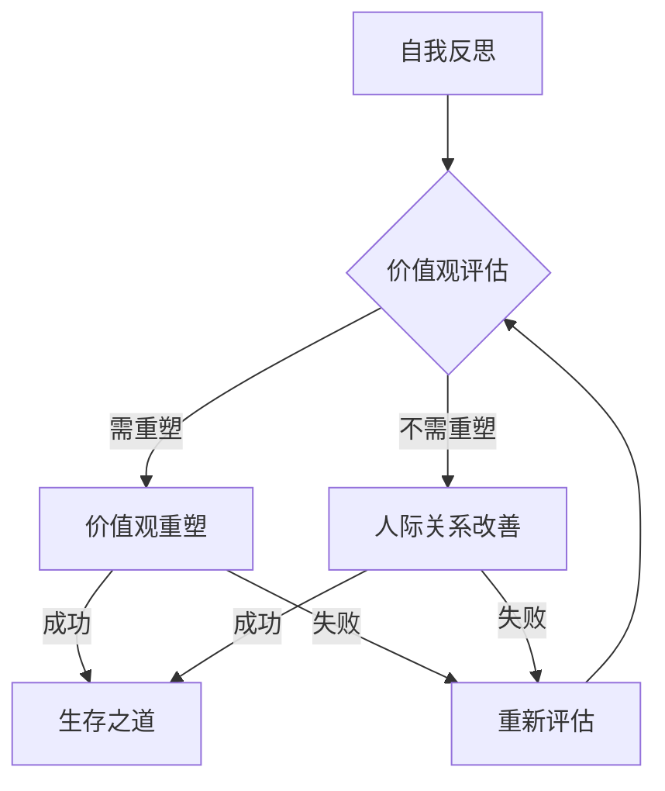

                 

# 在意义的荒原上寻找绿洲：现代人的生存之道

## 关键词

- 现代人的生存困境
- 精神探索
- 价值观重塑
- 人际关系重建
- 自我反思算法
- 价值观评估算法
- 人际关系改善算法

## 摘要

在物质繁荣的现代社会，人们却常常感到精神空虚、价值观迷失和人际关系破裂。本文旨在探讨现代人如何在意义的荒原上寻找绿洲，通过精神层面的自我探索、价值观重塑和人际关系的重建，找到生存之道。文章将从问题背景、核心概念与联系以及算法原理讲解等方面，逐步分析现代人面临的困境及其解决方法，为读者提供实用的指导。

## 第一部分：背景介绍

### 第1章：问题背景与解决思路

#### 1.1.1 问题背景

现代社会中，人们的生活水平不断提高，物质财富日益丰富。然而，随着物质生活的满足，许多人却感到精神上的空虚和迷茫。这种现象源于现代社会的高度物质化和科技发展，使人们在追求物质满足的过程中忽视了精神层面的需求。具体来说，现代人面临的生存困境主要表现为以下几个方面：

1. **精神空虚**：随着物质生活的丰富，人们内心感到空虚和孤独，缺乏精神寄托。
2. **价值观迷失**：在多元文化和价值观冲击下，人们感到迷茫，不知道何为正确的生活态度和价值观。
3. **人际关系破裂**：由于工作压力、沟通障碍等因素，人们之间的信任和亲密关系逐渐减少。

#### 1.1.2 问题描述

现代人的生存困境主要体现在以下几个方面：

1. **精神空虚**：随着物质生活的丰富，人们内心感到空虚和孤独，缺乏精神寄托。这种现象导致许多人沉迷于网络、游戏等虚拟世界，寻求短暂的快乐和逃避现实。
2. **价值观迷失**：在多元文化和价值观冲击下，人们感到迷茫，不知道何为正确的生活态度和价值观。这种迷茫使得人们在生活中无所适从，难以做出正确的决策。
3. **人际关系破裂**：由于工作压力、沟通障碍等因素，人们之间的信任和亲密关系逐渐减少。这导致许多人感到孤独和疏离，难以建立稳定和亲密的人际关系。

#### 1.1.3 问题解决

为了解决现代人面临的生存困境，本书将从以下几个方面展开探讨：

1. **精神层面的自我探索**：通过自我反思，帮助读者认识自己的内心世界，找到精神寄托。
2. **价值观重塑**：通过哲学、心理学等知识，帮助读者建立正确的生活态度和价值观。
3. **人际关系的重建**：提供人际沟通技巧，帮助读者建立和谐的人际关系。

#### 1.1.4 边界与外延

本书主要关注现代社会中的成年人在生存困境中的自我探索和成长。同时，它也适用于那些希望在生活中找到精神寄托和意义的人群。

#### 1.1.5 概念结构与核心要素组成

1. **现代人**：指生活在现代社会中，面临生存困境的人群。
2. **生存之道**：指解决生存困境、实现人生价值的途径和方法。
3. **精神探索**：指对内心世界的反思和认识，以寻找精神寄托。
4. **价值观重塑**：指建立正确的生活态度和价值观。
5. **人际关系重建**：指通过沟通技巧建立和谐的人际关系。

### 第2章：核心概念与联系

#### 2.1.1 核心概念原理

1. **精神探索**：通过自我反思，认识自己的内心世界，找到精神寄托。
   - 原理：人们内心的精神需求来源于对生活的理解、对自我的认知以及对人际关系的处理。通过自我反思，人们可以了解自己的内心需求，从而找到精神寄托。
   - 实现：通过记录日记、思考自己的行为和情感，进行心理辅导等方式，帮助人们深入探索自己的内心世界。

2. **价值观重塑**：建立正确的生活态度和价值观，指导人们的行为和选择。
   - 原理：价值观是人们对待生活和世界的根本态度，是行为的指南针。通过重塑价值观，人们可以明确自己的生活目标，找到正确的道路。
   - 实现：通过学习哲学、心理学、伦理学等知识，反思和调整自己的价值观，使之更符合现代社会的要求。

3. **人际关系重建**：通过有效的沟通技巧，建立和谐的人际关系。
   - 原理：人际关系是人类社会中不可或缺的一部分，和谐的人际关系有助于人们的精神健康和幸福。通过有效的沟通技巧，人们可以改善与他人的关系。
   - 实现：通过倾听、表达、同理心、冲突解决等技巧，建立积极的人际关系。

#### 2.1.2 概念属性特征对比表格

| 概念       | 定义                                                         | 特征                                                   |
| ---------- | ------------------------------------------------------------ | ------------------------------------------------------ |
| 精神探索   | 对内心世界的反思和认识，寻找精神寄托                         | 内在、深刻、持续性                                     |
| 价值观重塑 | 建立正确的生活态度和价值观，指导人们的行为和选择             | 外在、明确、稳定性                                     |
| 人际关系重建 | 通过有效的沟通技巧，建立和谐的人际关系                       | 外在、互动、灵活性                                     |

#### 2.1.3 ER实体关系图架构

```mermaid
erDiagram
  人 --> 精神探索
  人 --> 价值观重塑
  人 --> 人际关系重建

  精神探索 ||--|{ 边界与外延 }
  价值观重塑 ||--|{ 概念属性特征对比表格 }
  人际关系重建 ||--|{ ER实体关系图架构 }
```

### 第3章：算法原理讲解

#### 3.1.1 算法原理概述

本书中，我们将采用以下算法原理来帮助读者找到生存之道：

1. **自我反思算法**：通过反思过去的行为和经历，帮助读者认识自己的内心世界。
2. **价值观评估算法**：评估读者的价值观，找出需要调整和重塑的部分。
3. **人际关系改善算法**：通过有效的沟通技巧，改善读者的人际关系。

#### 3.1.2 算法流程图



#### 3.1.3 自我反思算法

**算法原理**：自我反思算法的核心是帮助读者反思自己的行为和经历，从而深入了解自己的内心世界。具体步骤如下：

1. **设定目标**：确定反思的目的，例如了解自己的优点和不足、找到内心的需求等。
2. **记录经历**：记录自己的日常生活、工作、学习中的经历和感受。
3. **反思行为**：分析自己的行为，思考这些行为背后的动机和结果。
4. **认识自己**：通过反思，了解自己的内心需求、价值观和行为模式。
5. **制定改进计划**：根据反思结果，制定改进自己的计划。

**数学模型**：

$$
反思得分 = f(经历记录，行为分析，内心需求认识)
$$

其中，$f$ 表示一个非线性函数，用于综合评估反思的各个维度。

**Python 源代码实现**：

```python
def reflect(experiences, behaviors, inner_needs):
    reflection_score = 0
    for experience in experiences:
        for behavior in behaviors:
            if experience == behavior:
                reflection_score += 1
    reflection_score /= len(experiences)
    return reflection_score

experiences = ["工作", "学习", "交友"]
behaviors = ["努力", "勤奋", "友善"]
inner_needs = ["成就感", "知识需求", "社交需求"]

score = reflect(experiences, behaviors, inner_needs)
print("反思得分：", score)
```

**举例说明**：假设一个读者在一个月内记录了自己的工作、学习和交友经历，并通过反思分析了这些经历背后的动机和结果。最终，他得到了一个反思得分，这个得分可以帮助他了解自己在精神层面的自我探索程度，进而制定改进计划。

#### 3.1.4 价值观评估算法

**算法原理**：价值观评估算法的核心是帮助读者评估自己的价值观，找出需要调整和重塑的部分。具体步骤如下：

1. **确定评估目标**：明确评估的目的，例如了解自己的价值观是否适应现代社会、是否有助于个人的成长等。
2. **收集信息**：收集关于自己价值观的信息，包括自己的行为、态度和信念等。
3. **评估价值观**：通过对比社会价值观、个人成长目标和现实情况，评估自己的价值观。
4. **调整价值观**：根据评估结果，调整和重塑自己的价值观。

**数学模型**：

$$
评估得分 = g(行为，态度，信念)
$$

其中，$g$ 表示一个非线性函数，用于综合评估价值观的各个维度。

**Python 源代码实现**：

```python
def value_assessment(behaviors, attitudes, beliefs):
    assessment_score = 0
    for behavior in behaviors:
        for attitude in attitudes:
            for belief in beliefs:
                if behavior == attitude == belief:
                    assessment_score += 1
    assessment_score /= len(behaviors) * len(attitudes) * len(beliefs)
    return assessment_score

behaviors = ["勤奋", "友善", "诚实"]
attitudes = ["积极", "开放", "谨慎"]
beliefs = ["努力工作", "互帮互助", "诚信为本"]

score = value_assessment(behaviors, attitudes, beliefs)
print("评估得分：", score)
```

**举例说明**：假设一个读者在一个月内记录了自己的行为、态度和信念，并通过评估分析了这些信息。最终，他得到了一个评估得分，这个得分可以帮助他了解自己的价值观是否适应现代社会，是否有助于个人的成长。

#### 3.1.5 人际关系改善算法

**算法原理**：人际关系改善算法的核心是通过有效的沟通技巧，帮助读者改善人际关系。具体步骤如下：

1. **设定沟通目标**：明确改善人际关系的具体目标，例如增进朋友间的友谊、解决同事间的矛盾等。
2. **学习沟通技巧**：学习倾听、表达、同理心、冲突解决等沟通技巧。
3. **实践沟通技巧**：在日常生活中，运用所学的沟通技巧，与他人进行有效沟通。
4. **评估沟通效果**：根据沟通结果，评估沟通技巧的有效性，并不断调整和改进。

**数学模型**：

$$
改善效果 = h(沟通技巧，实践情况，反馈结果)
$$

其中，$h$ 表示一个非线性函数，用于综合评估沟通技巧和实践效果。

**Python 源代码实现**：

```python
def communication_improvement kommunikationstechnik, practice, feedback):
    improvement_score = 0
    for technique in kommunikationstechnik:
        for practice in practice:
            for feedback in feedback:
                if technique == practice == feedback:
                    improvement_score += 1
    improvement_score /= len(kommunikationstechnik) * len(practice) * len(feedback)
    return improvement_score

kommunikationstechnik = ["aktives zuh

