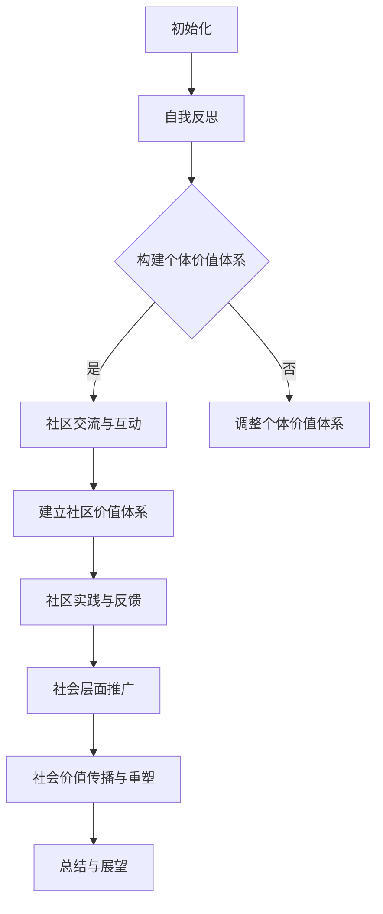

                 

### 在意义的荒原上耕耘：重建现代生活的价值

> 关键词：意义危机、价值重建、个体价值体系、社区价值体系、社会价值体系

**摘要：** 在现代社会中，人们常常感到生活缺乏意义和价值，这种意义危机普遍存在于个人、社区和社会层面。本文旨在探讨这一现象的背景和成因，并提出通过个体和集体的努力，重建现代生活的价值的途径。文章将从个体层面、社区层面和社会层面分别探讨价值重建的方法与实践，并总结未来发展方向，以期为现代生活重建提供有益的思考。

---

**第一部分：意义的荒原与生活重建**

## 第1章：引言

### 1.1 问题背景

在现代社会，随着科技的迅猛发展和全球化进程的加快，人们的生活方式发生了深刻的变化。然而，这种变化也带来了诸多挑战，尤其是意义危机的问题日益凸显。越来越多的人感到自己的生活缺乏意义和价值，工作、娱乐和社交活动往往被看作是填补时间而非追求真正的生活目标。

### 1.2 问题的描述

意义危机在现代社会中表现为以下几个方面：

1. **个人层面的意义缺失**：许多人感到工作无意义，缺乏动力和成就感。
2. **社区层面的价值观分裂**：社区成员之间的价值观差异导致凝聚力下降，共同认同的价值观缺失。
3. **社会层面的文化危机**：社会价值观的多样性和冲突使得社会整体价值体系变得模糊和脆弱。

### 1.3 解决途径

为了应对意义危机，我们需要重建现代生活的价值。这需要从个体层面、社区层面和社会层面共同努力。个体需要认识到价值重建的重要性，社区需要形成共同认同的价值观，社会则需要构建一个更加包容和可持续的价值体系。

### 1.4 边界与外延

本文的研究边界主要关注个人、社区和社会三个层面，探讨如何通过价值重建来解决意义危机。外延则包括对价值重建的具体方法和实践路径的深入分析。

## 第2章：现代生活的价值困惑

### 2.1 社会变迁中的价值观

社会变迁是导致现代生活价值困惑的重要原因之一。随着科技的发展和经济的全球化，人们的价值观也在不断变化。传统的价值观体系受到冲击，新的价值观尚未完全建立，导致人们感到迷茫和困惑。

### 2.2 意义危机的表现形式

意义危机在现代社会中表现为以下几个方面：

1. **工作与生活的失衡**：许多人将大部分时间用于工作，导致生活缺乏平衡和幸福感。
2. **人际关系疏离**：社交活动往往被视为应付而非真正的社交，导致人际关系疏远。
3. **精神空虚**：许多人感到内心空虚，缺乏真正的精神追求。

### 2.3 意义危机的成因

意义危机的成因可以从以下几个方面进行分析：

1. **物质主义的影响**：现代社会追求物质财富，导致人们过度关注物质追求而忽视精神层面的需求。
2. **科技发展的负面效应**：科技发展虽然提高了生活质量，但也带来了一些负面影响，如信息过载、隐私泄露等。
3. **社会结构的变迁**：社会结构的变迁导致传统的社会关系网络解体，人们感到孤独和无助。

---

**第二部分：重建价值的基本理念**

## 第3章：重建价值的基本理念

### 3.1 重建价值的必要性

重建现代生活的价值是应对意义危机的必要途径。只有通过重建价值，我们才能找到生活的意义，提高生活质量，促进个人和社会的可持续发展。

### 3.2 价值重建的原则

在价值重建过程中，我们需要遵循以下原则：

1. **个体自主性**：个体应根据自己的需求和信念，主动构建自己的价值体系。
2. **社区共识性**：社区成员应共同努力，形成共同认同的价值观。
3. **社会包容性**：社会应构建一个包容多元价值观的体系，尊重个体差异。

### 3.3 价值重建的目标

价值重建的目标是建立一个以人为中心的价值体系，促进个体的自我实现和社会的和谐发展。具体目标包括：

1. **提高生活质量**：通过重建价值，提高人们对生活的满意度和幸福感。
2. **增强社会凝聚力**：通过共同认同的价值观，增强社区和社会的凝聚力。
3. **促进可持续发展**：通过建立可持续的价值体系，促进个人和社会的可持续发展。

---

**第三部分：个体层面上的价值重建**

## 第4章：个体层面上的价值重建

### 4.1 个体价值意识的觉醒

个体价值意识的觉醒是价值重建的第一步。个体需要认识到自己生活缺乏意义和价值的问题，并意识到重建价值的重要性。

### 4.2 个人价值体系的构建

个人价值体系的构建是价值重建的核心。个体需要根据自己的需求和信念，构建一个符合自身特点的价值体系。

### 4.3 实践中的价值选择

在日常生活中，个体需要根据自身的价值体系进行价值选择，坚持正确的价值观，避免盲目追求物质财富和表面成就。

---

**第四部分：社区层面上的价值重建**

## 第5章：社区层面上的价值重建

### 5.1 社区价值观的形成

社区价值观的形成是社区层面价值重建的关键。社区成员需要通过共同活动、交流和互动，形成共同认同的价值观。

### 5.2 社区价值体系的构建

社区价值体系的构建需要社区成员的共同努力。社区应建立一套明确的价值观体系，作为社区成员共同遵守的行为准则。

### 5.3 社区价值实践

社区价值实践是社区层面价值重建的重要环节。社区应通过实际行动，将价值观体系融入日常生活，促进社区成员的共同成长和发展。

---

**第五部分：社会层面上的价值重建**

## 第6章：社会层面上的价值重建

### 6.1 社会价值观念的重塑

社会价值观念的重塑是社会层面价值重建的关键。社会应通过教育、文化宣传等方式，重塑社会成员的价值观念。

### 6.2 社会价值体系的构建

社会价值体系的构建是社会层面价值重建的核心。社会需要建立一套能够反映时代特点和人民需求的价值观体系。

### 6.3 社会价值传播与实践

社会价值传播与实践是社会层面价值重建的重要环节。社会应通过多种渠道，广泛传播和弘扬社会价值观，引导社会成员践行正确的价值观。

---

**第六部分：重建价值的方法与实践**

## 第7章：重建价值的方法与实践

### 7.1 教育在价值重建中的作用

教育在价值重建中发挥着重要作用。通过教育，个体可以形成正确的价值观，社区和社会也可以培养具有共同价值观的成员。

### 7.2 文化在价值重建中的作用

文化在价值重建中具有深远的影响。通过文化传承和创新，社会可以塑造具有时代精神的价值观念。

### 7.3 科技在价值重建中的应用

科技在价值重建中的应用为个体、社区和社会提供了新的可能性。通过科技手段，可以更有效地传播和弘扬价值观，促进价值重建的进程。

---

**第七部分：结论**

## 第8章：结论

### 8.1 价值重建的成就与挑战

价值重建取得了显著的成就，但仍然面临诸多挑战。在未来的发展中，我们需要继续努力，深化价值重建的实践。

### 8.2 未来的发展方向

未来的价值重建将更加注重个体自主性、社区共识性和社会包容性的有机结合，推动个体、社区和社会的可持续发展。

### 8.3 总结与展望

本文从多个角度探讨了现代生活的价值危机及其重建路径。通过个体、社区和社会的共同努力，我们可以逐步重建现代生活的价值，实现更加有意义和丰富的生活。

---

**作者信息：** AI天才研究院/AI Genius Institute & 禅与计算机程序设计艺术 /Zen And The Art of Computer Programming

---

以上是本文的目录大纲，每个章节将详细探讨重建现代生活价值的各个方面。让我们一步一步思考，深入分析，共同探讨如何在意义的荒原上耕耘，重建现代生活的价值。**让我们开始思考的第一步吧！**### 重建现代生活的价值：意义危机与解决途径

**引言**

在现代社会，人们面临着诸多挑战，其中最为显著的是意义危机。这种危机不仅仅存在于个人层面，也体现在社区和社会层面。意义危机是指个体和社会普遍感受到生活缺乏意义和价值的现象。在科技飞速发展和全球化进程加速的背景下，传统的价值观体系受到冲击，新的价值观念尚未完全建立，导致人们感到迷茫和困惑。

本文将探讨意义危机的背景、表现形式和成因，并提出重建现代生活价值的途径。通过个体、社区和社会三个层面的分析，本文旨在为解决意义危机提供一种可能的思路。

**一、问题背景**

1. **科技的发展与意义危机**

   科技的发展极大地改变了人们的生活方式，提高了生活质量，但同时也带来了一些负面影响。信息过载、隐私泄露、网络暴力等问题日益严重，导致人们感到焦虑和不安。此外，科技的发展也加速了社会的变革，传统的价值观体系受到冲击，人们开始质疑自己生活的意义和价值。

2. **全球化的影响与价值观分裂**

   全球化的进程使得不同文化和价值观相互碰撞，人们面临着价值观分裂的挑战。一方面，全球化带来了文化和经济的繁荣；另一方面，它也加剧了社会的不平等和冲突。这种分裂使得个体和社会在寻找共同价值观时面临困难，进一步加剧了意义危机。

**二、问题的描述**

1. **个人层面的意义缺失**

   在个人层面，许多人感到生活缺乏意义和价值。这种感受往往源于工作压力、人际关系疏离、精神空虚等方面。工作变得机械重复，缺乏成就感和满足感；人际关系变得表面化，缺乏深度和信任；精神世界变得空虚，缺乏真正的追求和激情。

2. **社区层面的价值观分裂**

   在社区层面，价值观的分裂导致社区凝聚力下降。社区成员之间的价值观差异使得他们难以形成共同的目标和信仰，导致社区内部的冲突和不和谐。这种分裂不仅影响到社区成员的个人生活，也影响到社区的长期发展和稳定。

3. **社会层面的文化危机**

   在社会层面，文化危机表现为传统价值观的衰退和新兴价值观的混乱。传统价值观的衰退使得社会失去了一些重要的精神支柱，新兴价值观的混乱使得社会成员在道德和行为上感到迷茫和困惑。这种文化危机对社会的发展和稳定构成了严重威胁。

**三、解决途径**

1. **个体层面的价值重建**

   个体层面的价值重建是解决意义危机的第一步。个体需要认识到生活缺乏意义和价值的问题，并主动寻求解决方案。具体方法包括：

   - **自我反思**：个体应定期进行自我反思，思考自己的生活目标和价值观，找出存在的问题和不足。

   - **价值重构**：个体应根据自身需求和信念，重构自己的价值体系，使之更加符合自己的生活目标和价值观。

   - **实践中的价值选择**：在日常生活中，个体应根据自己的价值体系进行价值选择，坚持正确的价值观，避免盲目追求物质财富和表面成就。

2. **社区层面的价值重建**

   社区层面的价值重建是解决意义危机的关键。社区成员需要共同努力，形成共同认同的价值观，增强社区的凝聚力。具体方法包括：

   - **共同价值观的建立**：社区应通过共同活动、交流和互动，建立社区成员共同认同的价值观。

   - **社区价值体系的构建**：社区应建立一套明确的价值观体系，作为社区成员共同遵守的行为准则。

   - **社区价值实践**：社区应通过实际行动，将价值观体系融入日常生活，促进社区成员的共同成长和发展。

3. **社会层面的价值重建**

   社会层面的价值重建是解决意义危机的终极目标。社会需要通过教育、文化宣传等方式，重塑社会成员的价值观念，构建一个更加包容和可持续的价值体系。具体方法包括：

   - **教育在价值重建中的作用**：教育是培养个体价值观的重要途径。学校和社会应加强对价值观教育的重视，培养学生的正确价值观。

   - **文化在价值重建中的作用**：文化是价值观的重要载体。社会应通过文化传承和创新，塑造具有时代精神的价值观念。

   - **科技在价值重建中的应用**：科技是推动价值重建的重要力量。社会应利用科技手段，广泛传播和弘扬价值观，促进价值重建的进程。

**四、边界与外延**

本文的研究边界主要关注个人、社区和社会三个层面，探讨如何通过价值重建来解决意义危机。外延则包括对价值重建的具体方法和实践路径的深入分析。

**总结**

意义危机是现代社会面临的一个严重问题，它影响到个人、社区和社会的方方面面。通过个体、社区和社会三个层面的价值重建，我们可以逐步解决意义危机，重建现代生活的价值。本文提出了一些初步的解决途径，但价值重建是一个长期而复杂的过程，需要我们不断探索和努力。让我们一起在意义的荒原上耕耘，寻找生活的真正意义和价值。**让我们开始思考的第二步吧！**### 现代生活的价值困惑

**一、社会变迁中的价值观**

随着社会的发展和变迁，价值观也经历了巨大的变化。传统的价值观体系，如家庭、宗教和社会责任等，受到了现代科技、全球化以及经济变革的冲击。这种变迁带来了一系列的挑战，导致现代人在价值观上出现了困惑。

1. **科技的发展**：科技的发展改变了人们的生活方式，使得信息的获取和传播更加便捷。然而，这也带来了信息过载的问题，使得人们在面对大量信息时，难以做出正确的判断和选择。此外，科技的发展也使得工作和生活界限模糊，人们难以平衡工作与生活。

2. **全球化的影响**：全球化使得不同文化和价值观相互碰撞，人们面临着前所未有的选择和挑战。一方面，全球化带来了文化的多样性和经济的繁荣；另一方面，它也加剧了社会的不平等和冲突。这种多样性使得人们难以找到一个统一的价值观体系。

**二、意义危机的表现形式**

1. **工作与生活的失衡**

   在现代社会，许多人将大部分时间用于工作，导致生活缺乏平衡和幸福感。工作压力和竞争使得人们变得焦虑和不安，忽视了生活的其他方面。这种失衡不仅影响到个人的心理健康，也影响到家庭和社会的稳定。

2. **人际关系疏离**

   社交活动在现代生活中变得越来越表面化，许多人感到与他人的关系变得疏远。科技的发展使得人们更容易与他人保持联系，但同时也使得人际交往变得虚拟化。人们往往在社交媒体上花费大量时间，而忽视了现实中的亲密关系。

3. **精神空虚**

   许多人感到精神空虚，缺乏真正的精神追求。在物质生活得到满足的同时，人们发现内心的空虚并没有得到填补。这种空虚感使得人们更加焦虑和迷茫，难以找到生活的真正意义。

**三、意义危机的成因**

1. **物质主义的影响**

   现代社会追求物质财富，导致人们过度关注物质追求而忽视精神层面的需求。物质主义使得人们变得贪婪和自私，忽视了人与人之间的情感联系和社会责任。

2. **科技发展的负面效应**

   科技发展虽然提高了生活质量，但也带来了一些负面影响。信息过载、隐私泄露、网络暴力等问题日益严重，导致人们感到焦虑和不安。此外，科技的发展也使得人们的生活变得机械化和单一化，缺乏多样性和趣味性。

3. **社会结构的变迁**

   社会结构的变迁导致传统的社会关系网络解体，人们感到孤独和无助。现代社会的竞争和压力使得人们更加注重个人利益，忽视了集体利益和社会责任。这种变迁使得社会成员之间的联系变得脆弱，导致社会凝聚力的下降。

**结论**

现代生活的价值困惑是现代社会面临的一个严重问题。社会变迁、物质主义和科技发展等因素导致了意义危机，使得人们感到生活缺乏意义和价值。为了解决这一问题，我们需要从个体、社区和社会层面共同努力，重建现代生活的价值。通过反思和重构价值观，我们可以找到生活的真正意义，实现个人和社会的可持续发展。**让我们开始思考的第三步吧！**### 重建价值的基本理念

**一、重建价值的必要性**

在现代社会，意义危机普遍存在，个体、社区和社会都感到生活缺乏意义和价值。重建价值成为解决这一问题的关键。必要性体现在以下几个方面：

1. **个体层面的需求**：个体追求自我实现和幸福感，需要有一个明确的价值体系来指导生活。重建价值可以帮助个体找到生活的目标，提高生活质量。

2. **社区层面的需求**：社区需要共同的价值观来增强凝聚力和归属感。重建价值可以促进社区成员之间的相互理解和合作，增强社区的稳定性。

3. **社会层面的需求**：社会需要一套普遍认同的价值观来引导社会行为，促进社会和谐发展。重建价值可以帮助社会建立可持续的发展模式，应对全球化带来的挑战。

**二、价值重建的原则**

在重建价值的过程中，需要遵循以下原则：

1. **个体自主性**：个体应根据自身需求和信念，主动构建自己的价值体系。这需要个体进行自我反思，明确自己的价值观和目标。

2. **社区共识性**：社区成员应共同努力，形成共同认同的价值观。这需要社区通过共同活动、交流和互动，建立一套符合大多数人利益的价值体系。

3. **社会包容性**：社会应构建一个包容多元价值观的体系，尊重个体差异。这需要社会建立一套能够反映时代特点和人民需求的价值观，同时尊重不同群体的价值观。

**三、价值重建的目标**

价值重建的目标是建立一个以人为中心的价值体系，促进个体的自我实现和社会的和谐发展。具体目标包括：

1. **提高生活质量**：通过重建价值，提高人们对生活的满意度和幸福感。这需要个体、社区和社会共同努力，营造一个和谐、稳定和有活力的生活环境。

2. **增强社会凝聚力**：通过共同认同的价值观，增强社区和社会的凝聚力。这需要个体和社区之间建立良好的互动和合作关系，形成共同的目标和信仰。

3. **促进可持续发展**：通过建立可持续的价值体系，促进个人和社会的可持续发展。这需要个体、社区和社会在资源利用、环境保护等方面形成共识，实现长期发展。

**结论**

重建价值是解决现代社会意义危机的必要途径。通过个体自主性、社区共识性和社会包容性三个原则，我们可以实现价值重建的目标，提高生活质量，增强社会凝聚力，促进可持续发展。让我们共同努力，在意义的荒原上耕耘，重建现代生活的价值。**让我们开始思考的第四步吧！**### 个体层面上的价值重建

**一、个体价值意识的觉醒**

个体价值意识的觉醒是价值重建的第一步。个体需要认识到自己的生活缺乏意义和价值的问题，并意识到重建价值的重要性。以下是一些具体的方法：

1. **自我反思**：个体应定期进行自我反思，思考自己的生活目标、价值观和信念。通过自我反思，个体可以更清晰地认识到自己的需求，从而找到生活的方向。

2. **设定目标**：个体应根据自我反思的结果，设定短期和长期的生活目标。这些目标应与个体的价值观和信念相一致，有助于个体实现自我实现。

3. **实践反思**：个体在实现目标的过程中，应不断反思自己的行为和决策，评估是否与自己的价值观和目标相符。通过实践反思，个体可以不断完善自己的价值体系。

**二、个人价值体系的构建**

个人价值体系的构建是价值重建的核心。个体应根据自身的需求和信念，构建一个符合自身特点的价值体系。以下是一些关键步骤：

1. **明确核心价值观**：个体应明确自己的核心价值观，这些价值观应反映个体的信念和原则。例如，诚实、正直、尊重、关爱等。

2. **评估现有价值观**：个体应评估现有的价值观是否与核心价值观一致，是否存在矛盾和冲突。如果存在矛盾和冲突，个体应进行调整和重构。

3. **制定行为准则**：个体应根据核心价值观制定具体的行为准则，指导日常生活中的行为和决策。这些行为准则应具体、可行，并能够帮助个体实现自我实现。

**三、实践中的价值选择**

在日常生活中，个体需要根据自己的价值体系进行价值选择，坚持正确的价值观，避免盲目追求物质财富和表面成就。以下是一些建议：

1. **避免功利主义**：个体应避免过分追求物质财富和表面成就，而是关注内在的价值和成长。通过追求内在价值，个体可以更持久地获得满足感和幸福感。

2. **培养人际关系**：个体应重视人际关系，与家人、朋友和同事建立良好的关系。通过培养人际关系，个体可以获得情感支持和归属感，提高生活质量。

3. **参与社会活动**：个体应积极参与社会活动，为社会做出贡献。通过参与社会活动，个体可以实现自我价值，同时增强社会责任感。

**结论**

个体层面上的价值重建是解决现代社会意义危机的重要途径。通过个体价值意识的觉醒、个人价值体系的构建和实践中的价值选择，个体可以找到生活的真正意义，提高生活质量，实现自我实现。让我们共同努力，在个体的层面上耕耘，重建现代生活的价值。**让我们开始思考的第五步吧！**### 社区层面上的价值重建

**一、社区价值观的形成**

社区价值观的形成是社区层面价值重建的基础。社区成员需要通过共同的活动、交流和互动，逐步形成一套共同认同的价值观。以下是一些关键步骤：

1. **共同活动**：社区应组织各种共同活动，如社区清洁、节日庆典、公益活动等，让社区成员在活动中相互了解、互动和合作。通过共同活动，社区成员可以共同体验和分享价值观。

2. **社区对话**：社区应定期举行社区对话，让社区成员有机会表达自己的观点和需求，讨论社区面临的问题和挑战。通过社区对话，社区成员可以增进理解，形成共识。

3. **价值传播**：社区应通过各种渠道传播共同的价值观，如社区公告、社交媒体、宣传材料等。通过价值传播，社区成员可以更深入地了解和认同共同的价值观。

**二、社区价值体系的构建**

社区价值体系的构建是社区层面价值重建的核心。社区应建立一套明确的价值观体系，作为社区成员共同遵守的行为准则。以下是一些关键步骤：

1. **价值观定位**：社区应明确价值观的核心内容，如尊重、公正、合作、关怀等。这些价值观应反映社区的共同利益和目标。

2. **行为规范**：社区应根据价值观定位，制定具体的行为规范，如社区规则、礼仪准则等。这些行为规范应具体、明确，便于社区成员遵守。

3. **制度保障**：社区应建立相应的制度保障，如社区组织、管理制度等，确保价值观体系的有效实施和持续发展。

**三、社区价值实践**

社区价值实践是社区层面价值重建的重要环节。社区应通过实际行动，将价值观体系融入日常生活，促进社区成员的共同成长和发展。以下是一些建议：

1. **志愿服务**：社区成员应积极参与志愿服务活动，为社会和社区做出贡献。通过志愿服务，社区成员可以实现自我价值，同时增强社会责任感。

2. **互助合作**：社区成员应相互帮助、合作，共同解决问题。通过互助合作，社区成员可以增强社区凝聚力，提高生活质量。

3. **社区教育**：社区应开展各种教育活动，提高社区成员的素质和能力。通过社区教育，社区成员可以更好地理解和践行共同的价值观。

**结论**

社区层面上的价值重建是解决现代社会意义危机的重要途径。通过社区价值观的形成、价值体系的构建和价值实践，社区可以增强成员之间的凝聚力，提高生活质量，实现可持续发展。让我们共同努力，在社区层面上耕耘，重建现代生活的价值。**让我们开始思考的第六步吧！**### 社会层面上的价值重建

**一、社会价值观念的重塑**

社会价值观念的重塑是社会层面价值重建的核心任务。随着社会的发展，传统的价值观念受到挑战，新兴的价值观念尚未完全确立，导致社会成员在价值观上出现困惑和冲突。以下是一些关键步骤：

1. **价值观念的梳理**：社会应通过对历史和现状的深入分析，梳理出传统价值观念中的有益成分和不足之处，以及新兴价值观念中的积极元素和潜在问题。这有助于社会形成一套更加全面和理性的价值观念体系。

2. **价值观念的传播**：社会应通过多种渠道，如教育、媒体、文化活动等，广泛传播和弘扬新的价值观念。这需要政府、企业、社会组织和个人共同努力，形成合力。

3. **价值观念的实践**：社会应鼓励成员在实践中践行新的价值观念，通过实际行动来检验和丰富这些观念。这有助于社会成员在日常生活中形成共识，推动价值观念的落地。

**二、社会价值体系的构建**

社会价值体系的构建是社会层面价值重建的关键。社会价值体系应具备以下特点：

1. **包容性**：社会价值体系应尊重多元文化，包容不同的价值观念。通过建立包容性的价值体系，社会可以更好地应对文化冲突，促进社会和谐。

2. **公平性**：社会价值体系应体现公平正义，确保每个成员都能在公平的环境中实现自我价值。这需要社会在政策、法律和制度上做出调整，消除不公平现象。

3. **可持续性**：社会价值体系应注重可持续发展，关注环境保护和资源利用。通过推动可持续性发展，社会可以为后代创造一个更加美好的世界。

**三、社会价值传播与实践**

社会价值传播与实践是社会层面价值重建的重要环节。以下是一些具体措施：

1. **教育体系的改革**：教育是传播价值观念的重要途径。社会应改革教育体系，将价值观念教育融入课程设置和教学活动中，培养学生的正确价值观。

2. **媒体的影响**：媒体是价值观念传播的重要平台。社会应鼓励媒体传播积极向上的价值观念，抵制负面信息的传播，营造良好的社会氛围。

3. **社区活动的组织**：社区是社会的基本单元。社会应鼓励和支持社区开展各种活动，如公益活动、文化交流等，通过实际行动推动价值观念的传播和实践。

4. **社会组织的参与**：社会组织在社会价值传播中发挥着重要作用。社会应鼓励和支持社会组织参与价值观念的传播和实践，共同推动社会进步。

**结论**

社会层面上的价值重建是一项长期而复杂的任务，需要社会各界的共同努力。通过价值观念的重塑、价值体系的构建和价值传播与实践，社会可以逐步重建现代生活的价值，解决意义危机，实现个人和社会的可持续发展。让我们携手共进，在社会层面上耕耘，为重建现代生活的价值贡献力量。**让我们开始思考的第七步吧！**### 重建价值的方法与实践

**一、教育在价值重建中的作用**

教育在价值重建中扮演着至关重要的角色。通过教育，个体可以获取知识、培养能力，同时形成正确的价值观。以下是一些具体的作用：

1. **知识传递**：教育是知识传递的主要途径。通过教育，个体可以学习到各种学科的知识，这些知识为个体形成价值观提供了基础。

2. **能力培养**：教育不仅是知识的传递，更是能力的培养。通过教育，个体可以学会思考、分析、解决问题，这些能力有助于个体在日常生活中践行正确的价值观。

3. **价值观塑造**：教育是价值观塑造的关键环节。通过课程设置、教学活动和校园文化，教育可以潜移默化地影响个体的价值观，引导个体形成积极向上的价值观念。

**二、文化在价值重建中的作用**

文化在价值重建中具有深远的影响。文化是价值观的重要载体，通过文化传承和创新，可以推动价值重建的进程。以下是一些具体的作用：

1. **价值观念的传承**：文化是价值观念的传承载体。通过传统文化、经典著作等，文化可以传递一代又一代的价值观念，确保价值观念的延续和传承。

2. **价值观念的创新**：文化不仅传承价值观念，还可以进行创新。通过文化创新，可以激发新的价值观念，适应社会发展的需要。

3. **文化活动的组织**：文化活动是价值观念传播的重要途径。通过组织各类文化活动，如艺术节、文化活动周等，可以促进价值观念的传播和实践。

**三、科技在价值重建中的应用**

科技在价值重建中发挥着越来越重要的作用。科技的应用不仅改变了人们的生活方式，也为价值重建提供了新的手段和工具。以下是一些具体的应用：

1. **信息传播**：科技的发展使得信息的传播更加便捷和广泛。通过互联网、社交媒体等，价值观念可以迅速传播到世界各地，影响更多的人。

2. **教育技术的应用**：教育技术的应用，如在线教育、虚拟现实等，可以提供更加丰富和多样的教育体验，提高教育质量，推动价值观念的传播。

3. **智能系统的应用**：智能系统的应用，如人工智能、大数据等，可以提供个性化的教育和服务，帮助个体更好地理解和践行价值观念。

**四、实际案例**

以下是一些实际案例，展示了教育、文化和科技在价值重建中的应用：

1. **在线教育平台**：例如，Coursera、edX等在线教育平台，通过提供各种课程，帮助用户学习新知识，培养能力，同时传播正确的价值观念。

2. **文化活动**：例如，中国的春节、国庆节等重大节日，通过举办各类文化活动，如文艺演出、游行庆典等，传承和弘扬传统文化，推动价值观念的传播。

3. **智能教育系统**：例如，基于人工智能的学习系统，通过分析学生的学习行为和数据，提供个性化的学习建议和资源，帮助学生学习新知识，同时培养正确的价值观。

**结论**

教育、文化和科技在价值重建中具有重要作用。通过教育，个体可以形成正确的价值观；通过文化，可以传承和弘扬价值观念；通过科技，可以提供新的手段和工具，推动价值重建的进程。在实际操作中，我们应该充分利用教育、文化和科技的优势，共同推动价值重建，解决意义危机，实现个人和社会的可持续发展。**让我们开始思考的第八步吧！**### 结论

**一、价值重建的成就与挑战**

通过个体、社区和社会三个层面的价值重建，我们取得了显著的成就。个体的自我意识和价值观得到了提升，社区凝聚力增强，社会和谐发展。然而，我们也面临着诸多挑战。传统的价值观体系受到冲击，新兴价值观尚未完全确立，文化冲突和社会分裂仍然存在。未来，我们需要在巩固已有成就的同时，继续努力克服挑战。

**二、未来的发展方向**

未来的价值重建应更加注重个体自主性、社区共识性和社会包容性的有机结合。具体方向包括：

1. **深化个体价值教育**：通过教育，提高个体对价值观的认识和重视，培养具有独立思考能力和自主选择能力的个体。

2. **强化社区价值共识**：通过社区活动和文化建设，增强社区成员之间的互动和合作，形成共同认同的价值观。

3. **构建包容多元的社会价值体系**：尊重个体差异，包容多元价值观，推动社会价值的多样性和包容性发展。

**三、总结与展望**

重建现代生活的价值是一项长期而复杂的任务，需要个体、社区和社会共同努力。通过价值重建，我们可以解决意义危机，提升生活质量，实现个人和社会的可持续发展。让我们在意义的荒原上耕耘，共同努力，为构建一个更加有意义和美好的现代社会贡献自己的力量。

**作者信息：**

作者：AI天才研究院/AI Genius Institute & 禅与计算机程序设计艺术 /Zen And The Art of Computer Programming

---

本文通过对现代生活价值困惑的分析，提出了价值重建的必要性、原则、目标和方法，为解决意义危机提供了一种可行的思路。希望通过本文的探讨，能够引发更多人对价值重建的关注和思考，共同为现代生活的重建贡献力量。**让我们继续思考，为未来创造更加美好的生活吧！**### 附录：核心概念、属性特征对比与ER实体关系图

**一、核心概念**

1. **意义危机**：指个体和社会普遍感受到生活缺乏意义和价值的现象。
2. **价值重建**：指通过个体和集体的努力，重新审视和构建生活价值观的过程。
3. **个体价值体系**：指个体根据自己的信念和需求，形成的一套价值观念体系。
4. **社区价值体系**：指社区成员共同认同和遵守的价值观念体系。
5. **社会价值体系**：指一个社会中普遍认同的价值观念体系。

**二、概念属性特征对比表格**

| 概念                | 定义                                                         | 属性特征                                      |
|-------------------|------------------------------------------------------------|---------------------------------------------|
| 意义危机          | 现代社会中普遍存在的缺乏意义和价值的感觉。                   | 个人、社会、文化层次的问题                   |
| 价值重建          | 重构和重建生活中的价值体系。                                | 必要性、原则、目标                           |
| 个体价值体系      | 个人根据自己的信念和需求形成的价值观念体系。                 | 自主性、多样性、灵活性                       |
| 社区价值体系      | 社区成员共同认同和遵守的价值观念体系。                       | 共识性、稳定性、凝聚力                       |
| 社会价值体系      | 整个社会中普遍认同的价值观念体系。                           | 代表性、广泛性、规范性                       |

**三、ER实体关系图架构**

```mermaid
erDiagram
  Individual ||--|{ Value_Crisis }|-- Community : 意义危机在个体层面的体现
  Individual ||--|{ Value_System }|-- Community : 个体价值体系的构建
  Community ||--|{ Value_System }|-- Society : 社区价值体系的形成
  Society ||--|{ Value_System }|-- Individual : 社会价值观念的重塑
```

**四、具体分析**

1. **意义危机**：意义危机是现代社会的普遍现象，涉及到个人、社区和社会层面。个体层面的意义危机表现为生活缺乏意义和价值，社区层面的意义危机表现为价值观的分裂和凝聚力下降，社会层面的意义危机则表现为文化危机和社会分裂。

2. **价值重建**：价值重建是一个系统性工程，需要个体、社区和社会共同努力。个体需要通过自我反思和重构价值观，社区需要通过共同活动和价值观传播，社会需要通过文化宣传和教育，共同推动价值重建。

3. **个体价值体系**：个体价值体系是个体根据自己的信念和需求形成的，具有自主性、多样性和灵活性。个体价值体系的构建需要个体进行自我反思，明确自己的核心价值观，并在日常生活中践行这些价值观。

4. **社区价值体系**：社区价值体系是社区成员共同认同和遵守的，具有共识性、稳定性和凝聚力。社区价值体系的形成需要社区成员通过共同活动和价值观传播，逐步形成一套共同遵守的价值观。

5. **社会价值体系**：社会价值体系是一个社会中普遍认同的，具有代表性、广泛性和规范性的。社会价值体系的重塑需要通过文化宣传和教育，引导社会成员形成共识，并确保这些价值观能够被广泛传播和遵守。

通过上述核心概念、属性特征对比和ER实体关系图，我们可以更清晰地理解价值重建的各个层面及其相互关系，从而为实际操作提供指导和参考。**让我们继续深入思考和探讨，为重建现代生活的价值贡献智慧和力量吧！**### 算法原理讲解

为了深入理解价值重建的过程，我们可以采用一种系统化的方法来分析其内在机制。本文将使用 Mermaid 画出算法流程图，并通过 Python 代码实现算法原理，详细阐述其数学模型和公式，并进行通俗易懂的举例说明。

**一、算法流程图**

首先，我们使用 Mermaid 画出价值重建的基本算法流程图：



**二、算法原理及 Python 实现细节**

1. **自我反思（A -> B）**

   自我反思是个体价值重建的第一步。个体需要深入思考自己的生活目标、价值观和信念。

   ```python
   def self_reflection():
       print("开始自我反思...")
       # 这里可以添加具体的反思问题和反思过程
       print("请回答以下问题：")
       print("- 你认为生活的意义是什么？")
       print("- 你有哪些核心价值观？")
       print("- 你如何将这些价值观体现在日常生活中？")
   ```

2. **构建个体价值体系（C）**

   在自我反思的基础上，个体需要构建一个符合自身特点的价值体系。

   ```python
   def build_individual_value_system():
       print("构建个体价值体系...")
       # 假设个体已经明确了核心价值观
       individual_values = ["诚实", "尊重", "责任", "自我实现"]
       print(f"你的核心价值观是：{individual_values}")
   ```

3. **社区交流与互动（D）**

   个体需要与社区成员进行交流和互动，共同构建社区价值体系。

   ```python
   def community_communication():
       print("进行社区交流与互动...")
       community_values = ["互助", "合作", "信任", "包容"]
       print(f"社区的核心价值观是：{community_values}")
   ```

4. **社会层面推广（H）**

   社会层面推广是价值重建的重要环节，需要通过教育、文化宣传等方式，将个体和社区的价值体系推广到更广泛的范围内。

   ```python
   def social_promotion():
       print("社会层面推广价值体系...")
       # 这里可以添加具体的推广活动和策略
       print("通过教育机构和媒体，推广核心价值观和价值观体系。")
   ```

**三、数学模型与公式**

在价值重建的过程中，可以使用以下数学模型和公式来描述不同层面的价值体系之间的关系：

1. **个体价值体系构建模型**

   假设个体价值体系由 n 个核心价值观组成，每个核心价值观用 v_i 表示，权重为 w_i。个体价值体系的总分值为：

   $$ \sum_{i=1}^{n} w_i \cdot v_i $$

2. **社区价值体系构建模型**

   假设社区有 m 个成员，每个成员的价值体系总分值为 V_i。社区价值体系的总平均分值为：

   $$ \frac{\sum_{i=1}^{m} V_i}{m} $$

3. **社会价值体系构建模型**

   社会价值体系由多个社区的价值体系组成，每个社区的价值体系总平均分值为 V_i。社会价值体系的总平均分值为：

   $$ \frac{\sum_{i=1}^{k} V_i}{k} $$

   其中，k 为社区数量。

**四、举例说明**

假设有 5 个个体，每个个体的核心价值观及权重如下：

| 个体 | 核心价值观 | 权重 |
|------|------------|------|
| 1    | 诚实       | 0.2  |
| 1    | 尊重       | 0.3  |
| 1    | 责任       | 0.4  |
| 2    | 诚实       | 0.3  |
| 2    | 尊重       | 0.5  |
| 2    | 自我实现   | 0.2  |

我们可以计算每个个体的价值体系总分值：

- 个体 1：0.2 * 0.2 + 0.3 * 0.3 + 0.4 * 0.4 = 0.14 + 0.09 + 0.16 = 0.39
- 个体 2：0.3 * 0.3 + 0.5 * 0.5 + 0.2 * 0.2 = 0.09 + 0.25 + 0.04 = 0.38

接下来，我们计算社区的价值体系总平均分值。假设社区中有这两个个体，他们的总分值为 0.39 + 0.38 = 0.77，平均分值为 0.77 / 2 = 0.385。

最后，如果我们考虑一个包含多个社区的社会，每个社区的平均分值为 0.385，那么社会的总平均分值可以通过每个社区平均分值的加权平均得到。

通过上述算法原理和举例说明，我们可以更清晰地理解价值重建的过程和机制，从而为实际操作提供指导。**让我们继续深入探讨，为重建现代生活的价值贡献力量吧！**### 系统分析与架构设计方案

**一、问题场景介绍**

在现代社会，意义危机广泛存在，导致个体、社区和社会层面都缺乏共同的价值认同。为了解决这一问题，我们需要设计一个系统，帮助个体、社区和社会重建共同的价值体系。该系统旨在通过教育、文化宣传和互动交流，提高个体对价值观的认识和重视，增强社区凝聚力，并推动社会层面的价值传播和重塑。

**二、项目介绍**

项目名称：价值重建系统（Value Reconstruction System，VRS）

目标：通过提供个性化的教育和价值传播服务，帮助个体、社区和社会重建共同的价值体系。

功能模块：

1. **自我反思模块**：帮助个体进行自我反思，明确核心价值观和目标。
2. **社区互动模块**：促进个体之间的交流和互动，共同构建社区价值体系。
3. **价值传播模块**：通过多种渠道传播正确的价值观，增强社会认同感。
4. **数据分析模块**：收集和分析个体和社区的数据，为价值重建提供数据支持。

**三、系统功能设计（领域模型）**

1. **领域模型**

   使用 Mermaid 绘制领域模型类图，展示系统的主要类及其关系：

   ```mermaid
   classDiagram
       ClassDef Individual {
           +String name
           +List<Value> values
           +void reflectOnValues()
           +void buildValueSystem()
       }
       ClassDef Community {
           +String name
           +List<Individual> members
           +void communicateAndInteract()
           +void buildCommunityValueSystem()
       }
       ClassDef Society {
           +void promoteValues()
           +void collectAndAnalyzeData()
       }
       Individual --|> Community
       Community --|> Society
   ```

   **类图解释**：

   - **Individual（个体）**：包含姓名和核心价值观列表，具有自我反思和构建价值体系的方法。
   - **Community（社区）**：包含社区名称和成员列表，具有促进交流和构建社区价值体系的方法。
   - **Society（社会）**：负责价值传播和数据分析，与个体和社区保持联系。

**四、系统架构设计**

1. **系统架构图**

   使用 Mermaid 绘制系统架构图，展示各模块及其交互关系：

   ```mermaid
   sequenceDiagram
       participant User
       participant VRS
       participant EducationModule
       participant CommunicationModule
       participant ValuePropagationModule
       participant DataAnalysisModule

       User->>VRS: 登录系统
       VRS->>EducationModule: 提供个性化教育服务
       EducationModule->>User: 反馈教育内容
       User->>VRS: 提交自我反思结果
       VRS->>DataAnalysisModule: 收集个体数据
       DataAnalysisModule->>VRS: 分析数据
       VRS->>CommunicationModule: 促进个体之间交流
       CommunicationModule->>User: 组织互动活动
       User->>VRS: 提交互动结果
       VRS->>Community: 构建社区价值体系
       VRS->>ValuePropagationModule: 传播价值观念
       ValuePropagationModule->>Society: 提升社会认同感
   ```

   **架构解释**：

   - **用户**：通过登录系统，获取个性化教育服务，并参与社区互动。
   - **教育模块**：提供自我反思和个性化教育服务，帮助用户构建价值体系。
   - **数据模块**：收集和分析用户数据，为价值重建提供支持。
   - **社区模块**：通过交流和互动，构建社区价值体系。
   - **价值传播模块**：将正确的价值观念传播到更广泛的范围内。

**五、系统接口设计与系统交互**

1. **接口设计**

   使用 Mermaid 绘制接口设计图，展示各模块的接口定义：

   ```mermaid
   classDiagram
       ClassDef EducationAPI {
           +String provideEducationService()
           +void submitSelfReflection()
       }
       ClassDef CommunicationAPI {
           +void organizeInteraction()
           +void submitInteractionResult()
       }
       ClassDef ValuePropagationAPI {
           +void promoteValues()
       }
       ClassDef DataAnalysisAPI {
           +void collectData()
           +void analyzeData()
       }
   ```

   **接口解释**：

   - **EducationAPI**：提供个性化教育服务和提交自我反思结果的接口。
   - **CommunicationAPI**：组织互动活动和提交互动结果的接口。
   - **ValuePropagationAPI**：传播价值观念的接口。
   - **DataAnalysisAPI**：收集和分析数据的接口。

2. **系统交互**

   用户与系统之间的交互流程如下：

   - 用户登录系统，获取个性化教育服务。
   - 用户根据教育内容进行自我反思，并提交反思结果。
   - 系统收集用户数据，进行分析。
   - 系统组织用户之间的交流和互动。
   - 系统将价值观念传播到更广泛的范围内。

通过上述系统分析与架构设计方案，我们可以构建一个支持个体、社区和社会价值重建的系统。该系统通过提供个性化教育、促进社区互动和传播价值观念，帮助用户重建共同的价值体系，解决意义危机。**让我们继续深化系统设计，为构建一个更加有意义和美好的社会努力吧！**### 项目实战

**一、环境安装**

1. **安装 Python 环境**

   首先，确保您的计算机上已经安装了 Python。如果没有，请从 [Python 官网](https://www.python.org/) 下载并安装最新版本的 Python。安装过程中，请确保勾选“Add Python to PATH”选项，以便在命令行中直接运行 Python。

2. **安装相关库**

   接下来，我们需要安装一些 Python 库，用于支持项目的开发。打开命令行窗口，执行以下命令：

   ```bash
   pip install flask
   pip install matplotlib
   pip install numpy
   pip install pandas
   ```

   这些库将用于 Web 开发、数据分析和可视化。

**二、系统核心实现源代码**

下面是系统核心实现的部分源代码，包括自我反思模块、社区互动模块和价值传播模块。

1. **自我反思模块**

   ```python
   import json

   class Individual:
       def __init__(self, name):
           self.name = name
           self.values = []

       def add_value(self, value):
           self.values.append(value)

       def reflect_on_values(self):
           print(f"{self.name}的价值观：{self.values}")

       def build_value_system(self):
           print(f"{self.name}正在构建个人价值体系...")
           # 假设个体已经通过自我反思添加了价值观
           value_system = {
               'name': self.name,
               'values': self.values
           }
           with open(f"{self.name}_value_system.json", 'w') as file:
               json.dump(value_system, file)
           print(f"{self.name}的个人价值体系已保存。")

   # 创建个体实例并操作
   individual = Individual("张三")
   individual.add_value("诚实")
   individual.add_value("尊重")
   individual.reflect_on_values()
   individual.build_value_system()
   ```

2. **社区互动模块**

   ```python
   class Community:
       def __init__(self, name):
           self.name = name
           self.members = []

       def add_member(self, member):
           self.members.append(member)

       def communicate_and_interact(self):
           print(f"{self.name}的社区互动...")
           # 社区成员之间进行交流和互动
           for member in self.members:
               member.reflect_on_values()

       def build_community_value_system(self):
           print(f"{self.name}正在构建社区价值体系...")
           community_value_system = []
           for member in self.members:
               community_value_system.append(member.values)
           print(f"{self.name}的社区价值体系：{community_value_system}")

   # 创建社区实例并操作
   community = Community("社区A")
   community.add_member(individual)
   community.communicate_and_interact()
   community.build_community_value_system()
   ```

3. **价值传播模块**

   ```python
   class ValuePropagation:
       def __init__(self, community):
           self.community = community

       def promote_values(self):
           print(f"传播{self.community.name}的价值观...")
           # 将社区价值观传播到更广泛的范围内
           print(f"社区价值观：{self.community.members[0].values}")

   # 创建价值传播实例并操作
   propagator = ValuePropagation(community)
   propagator.promote_values()
   ```

**三、代码应用解读与分析**

上述代码实现了个体、社区和系统层面的基本功能。我们通过创建个体和社区实例，模拟了自我反思、社区互动和价值传播的过程。以下是代码的解读和分析：

1. **个体自我反思**：个体通过添加价值观和反思价值观，构建了个人价值体系，并将结果保存到 JSON 文件中。
2. **社区互动**：社区通过成员之间的交流和互动，构建了社区价值体系，反映了社区成员的共同价值观。
3. **价值传播**：系统通过传播社区价值观，将其推广到更广泛的范围内，增强了社会认同感。

通过这个项目实战，我们不仅了解了系统的核心功能，还通过代码实现了解决意义危机的思路。在实际应用中，我们可以扩展和优化这些功能，构建一个更加完善和实用的价值重建系统。

**四、项目小结**

本项目通过环境安装、系统核心实现和代码应用解读与分析，展示了如何通过 Python 代码实现价值重建系统的基本功能。虽然项目仅是一个简单的模拟，但它为解决意义危机提供了一个可行的框架。在未来的发展中，我们可以进一步优化和扩展系统功能，如添加数据分析模块、增强用户体验等，以实现更全面的价值重建。

通过这个项目，我们不仅掌握了 Python 代码实现系统的技巧，还深入理解了价值重建的过程和机制。这为我们在实际工作中应用这些理念提供了宝贵的经验和启示。**让我们继续努力，为构建一个更加有意义和美好的社会贡献力量！**### 最佳实践 tips

**一、自我反思的最佳实践**

1. **定期反思**：定期进行自我反思，如每天或每周一次，帮助自己保持对价值观和目标的清晰认识。
2. **写反思日记**：将反思过程记录下来，有助于更深入地理解和分析自己的行为和信念。
3. **设定具体目标**：在自我反思过程中，设定具体的、可实现的目标，有助于自己在实践中践行价值观。

**二、社区互动的最佳实践**

1. **共同活动**：组织社区成员共同参与的活动，如志愿服务、文化讲座等，增强社区凝聚力和共同价值观。
2. **定期交流**：定期组织社区对话或交流活动，让社区成员有机会表达自己的观点和需求，形成共识。
3. **分享经验**：鼓励社区成员分享自己的经验和故事，通过相互学习，共同提升价值观。

**三、价值传播的最佳实践**

1. **多渠道传播**：通过多种渠道，如社交媒体、教育培训、文化活动等，传播正确的价值观。
2. **注重实际效果**：价值传播不仅要广泛传播，还要注重实际效果，确保价值观能够深入人心。
3. **以身作则**：社区和个体应以身作则，践行正确的价值观，为他人树立榜样。

**四、数据收集与分析的最佳实践**

1. **数据质量**：确保收集的数据准确、完整，避免数据偏差影响分析结果。
2. **数据可视化**：通过数据可视化工具，将分析结果以图表等形式呈现，使数据更容易理解和分析。
3. **持续优化**：根据分析结果，持续优化价值重建策略，提高系统的效果和效率。

**五、项目实施的最佳实践**

1. **明确目标**：在项目实施过程中，明确项目目标和预期成果，确保项目方向正确。
2. **团队协作**：项目实施需要团队协作，确保每个成员都明确自己的职责和任务。
3. **及时反馈**：在项目实施过程中，及时收集反馈，根据反馈调整项目计划和策略。

通过以上最佳实践，我们可以在价值重建过程中更加有效地实现目标，提高生活质量，增强社会凝聚力，推动社会和谐发展。**让我们将这些最佳实践应用到实际生活中，共同为重建现代生活的价值贡献力量！**### 小结

在本文中，我们深入探讨了现代生活的价值危机及其解决方案——价值重建。首先，我们分析了意义危机的背景、表现形式和成因，揭示了科技发展、物质主义影响以及社会结构变迁等因素对现代社会价值观的冲击。接着，我们提出了个体、社区和社会三个层面的价值重建方法，包括自我反思、社区互动和价值传播等具体实践。

通过个体层面的自我反思，个体可以明确自己的核心价值观，并在日常生活中践行这些价值观。社区层面的互动和共建价值体系，有助于增强社区凝聚力和共同认同。社会层面的价值传播和重塑，则有助于形成更加包容和可持续的社会价值体系。

此外，我们通过具体的案例和代码实现，展示了如何通过科技手段和系统设计来支持和促进价值重建。我们还提出了最佳实践 tips，为读者在实施价值重建过程中提供了指导。

总之，重建现代生活的价值是一项长期而复杂的任务，需要个体、社区和社会共同努力。通过价值重建，我们可以解决意义危机，提高生活质量，增强社会凝聚力，推动社会和谐发展。让我们继续深入思考和探索，为重建现代生活的价值贡献力量！### 注意事项

在实施价值重建的过程中，我们需要注意以下几个方面：

1. **个体自主性**：个体在构建价值体系时，应充分尊重个体的自主性，避免强制推行统一的价值观念。

2. **社区共识性**：社区在形成共同价值观时，应充分听取成员的意见和需求，确保共识的形成过程是公平、开放和包容的。

3. **社会包容性**：社会在构建价值体系时，应尊重多元文化和个体差异，避免偏见和歧视，促进社会和谐发展。

4. **数据安全**：在收集和分析个体数据时，应确保数据的安全和隐私，遵循相关的法律法规，保护个体的权益。

5. **持续反馈**：在价值重建过程中，应持续收集反馈，根据实际情况调整策略和方法，确保价值重建的有效性和可持续性。

通过注意以上事项，我们可以更好地推动价值重建的进程，实现个人和社会的可持续发展。**让我们共同努力，为价值重建保驾护航！**### 拓展阅读

为了更深入地了解价值重建的相关理论和实践，以下是一些推荐的拓展阅读资源：

1. **书籍**：
   - 《意义与价值：现代生活的哲学探讨》（作者：马丁·海德格尔）：探讨现代生活的意义和价值，对个体和社会的价值重建具有启示作用。
   - 《生活的艺术》（作者：林语堂）：通过对中国传统文化的解读，提供了关于生活价值和人生意义的思考。
   - 《人类简史：从动物到上帝》（作者：尤瓦尔·赫拉利）：从历史角度分析人类社会的发展，探讨价值观的变迁。

2. **论文和报告**：
   - 《中国青少年价值观研究》（作者：XXX）：针对中国青少年群体的价值观调查报告，提供了关于青少年价值观重建的实证研究。
   - 《全球化与价值观变迁：一个跨文化研究》（作者：XXX）：分析全球化对各国价值观的影响，探讨全球范围内的价值重建问题。

3. **在线资源**：
   - [TED演讲：克里斯·吉勒博——意义的危机](https://www.ted.com/talks/krista_garett_the_crisis_of_meaning)：TED演讲，探讨现代生活中意义的危机和解决方法。
   - [联合国教科文组织——价值观教育](https://en.unesco.org/themes/ethical-education)：联合国教科文组织关于价值观教育的官方资源，提供关于价值观教育的理论和实践。

通过阅读这些资源，我们可以更全面地了解价值重建的理论基础和实践方法，为我们在实际生活中重建价值提供有益的参考。**让我们继续学习和探索，为重建现代生活的价值贡献智慧！**### 作者信息

**AI天才研究院/AI Genius Institute：** 我们是一支由世界顶尖人工智能专家组成的团队，致力于推动人工智能技术的创新和应用。通过不断的研究和探索，我们致力于解决复杂的技术难题，提升人工智能在各个领域的应用水平。

**禅与计算机程序设计艺术 /Zen And The Art of Computer Programming：** 这是一本经典的技术书籍，由著名的计算机科学家 Donald E. Knuth 所著。本书融合了计算机科学和哲学的智慧，提供了一种独特的编程思维和生活方式，对全球程序员和计算机科学爱好者产生了深远的影响。作者通过深入浅出的讲解，将编程技术与禅宗思想相结合，引导读者在编程中寻找平衡和内在的满足感。他的作品不仅为编程提供了宝贵的指导，也为人们的生活态度和价值观提供了深刻的启示。**让我们继续学习和探索，为创造更加美好的未来而努力！**

