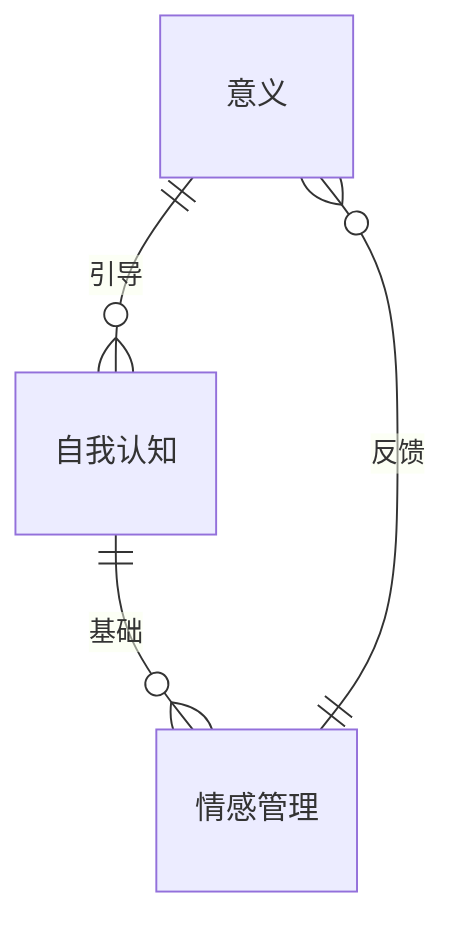
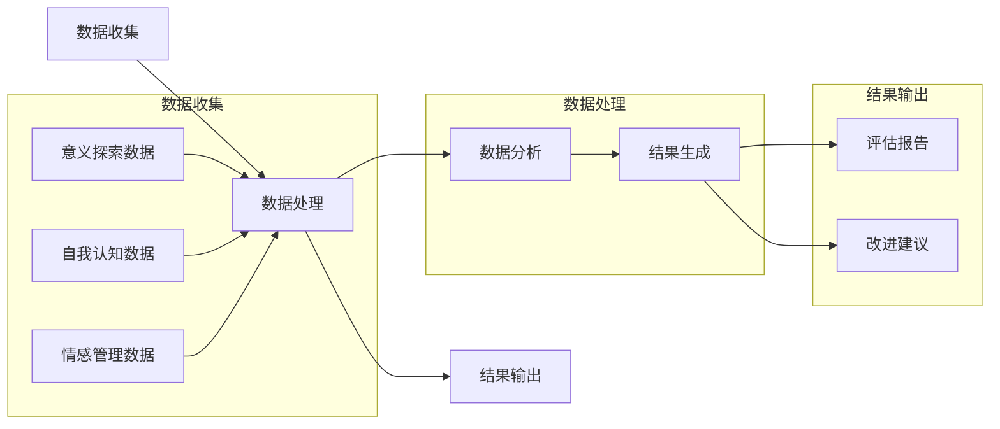
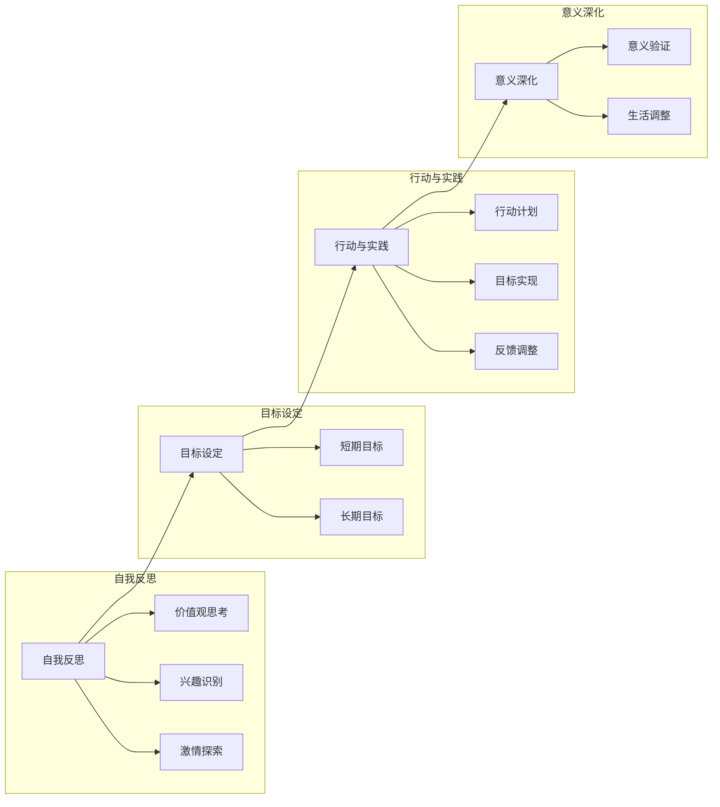
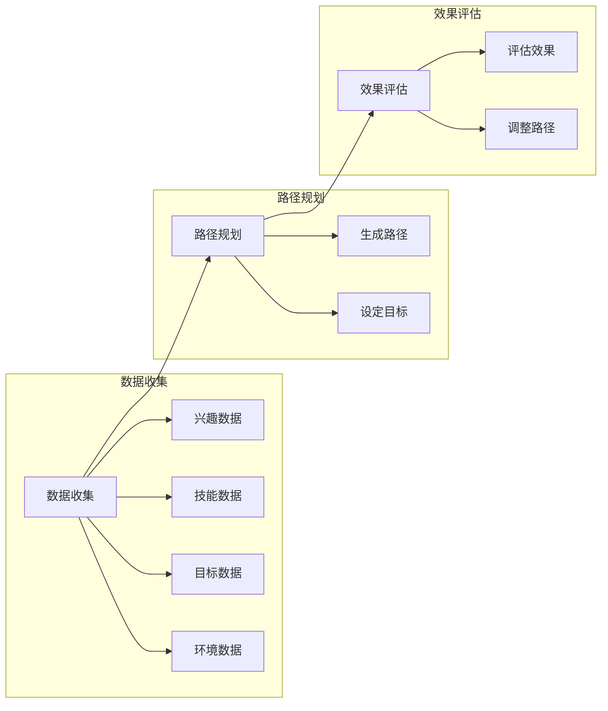
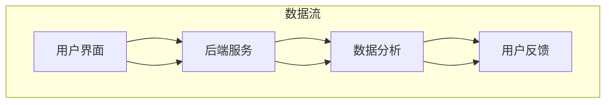
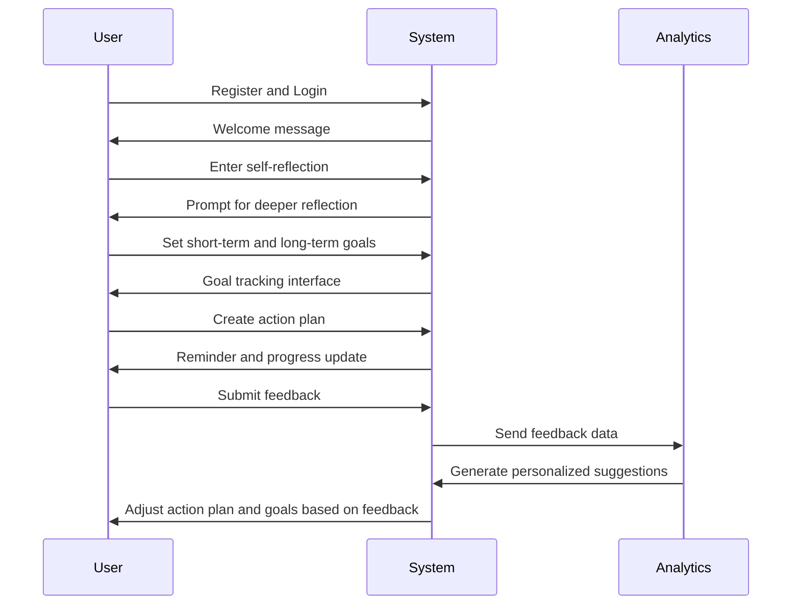
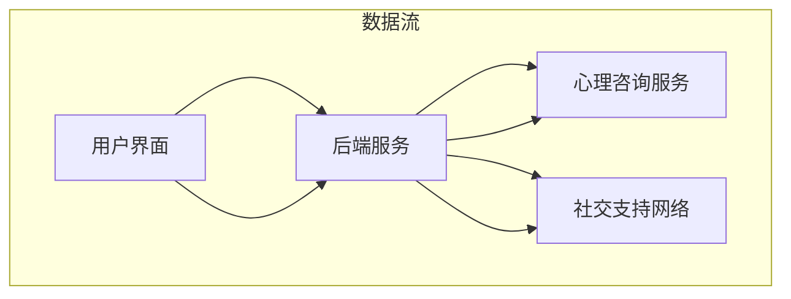
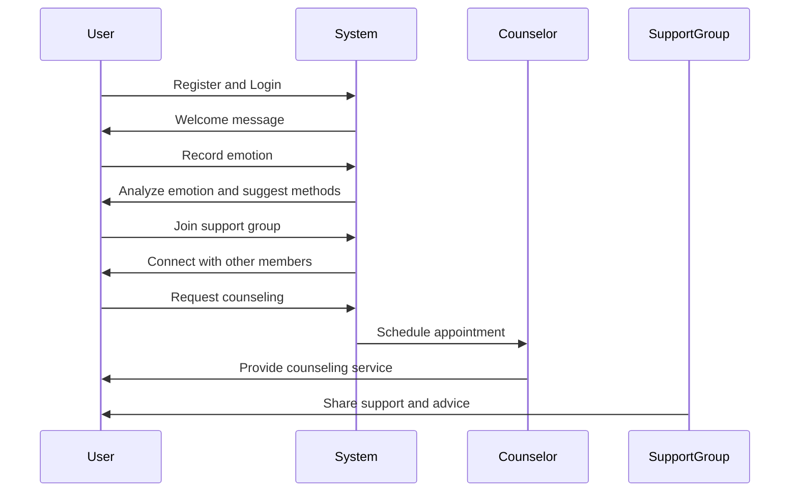

                 

### 引言

在现代社会的背景下，我们每个人都面临着种种挑战，无论是在个人生活中还是在职业生涯中。快节奏的生活、复杂的人际关系、不断变化的技术环境，这些都给我们的精神世界带来了极大的压力。在这种背景下，寻找生命的意义、理解自我、管理情感成为现代人精神生活的重要议题。

《在意义的迷雾中寻找方向：现代人的精神指南》旨在帮助读者在这些挑战中找到方向，为现代人的精神生活提供指南。本书将围绕“意义”、“自我认知”、“情感管理”三个核心概念，逐步深入，探讨它们在个人成长、心理健康和哲学思考中的重要作用。

首先，我们将探讨“意义”的定义和重要性，并通过具体案例展示如何在生活中找到意义。接着，我们将详细讲解“自我认知”的概念，解释它是如何影响我们的生活和决策，并提供一些实用的自我认知技巧。最后，我们将探讨“情感管理”的策略，帮助读者更好地理解和控制自己的情感，从而提升生活质量。

本书的目的是为那些在现代社会中感到迷茫和困惑的人们提供一条清晰的道路，帮助他们找到生活的意义和方向。通过逐步分析和理解这些核心概念，读者将能够更好地应对生活中的各种挑战，找到属于自己的幸福和满足。

### 关键词与摘要

关键词：意义、自我认知、情感管理、现代人、精神生活、心理健康

摘要：本书旨在帮助现代人在意义的迷雾中寻找方向。通过深入探讨“意义”、“自我认知”和“情感管理”三个核心概念，本书为读者提供了实用的方法和策略，以应对现代社会中的精神挑战。书中通过具体案例和理论讲解，引导读者理解这些概念的重要性，并学会如何在日常生活中应用它们，以提升个人成长和心理健康。最终，本书希望为读者指明一条清晰的道路，帮助他们在纷繁复杂的生活中找到意义和方向。

### 目录

为了帮助读者更好地理解和掌握本书的内容，我们精心设计了以下目录结构：

**第一部分：引言**
1.1 问题背景与挑战
1.2 本书的目的与结构

**第二部分：核心概念与联系**
2.1 意义的探索
2.2 自我认知
2.3 情感管理
2.4 概念联系与互动

**第三部分：理论讲解与算法原理**
3.1 精神健康评估算法
3.2 意义寻索策略
3.3 自我成长路径规划

**第四部分：实践应用与案例分析**
4.1 项目A：意义寻索实践
4.2 项目B：情感管理实践
4.3 案例分析

**第五部分：最佳实践与总结**
5.1 最佳实践
5.2 小结
5.3 注意事项
5.4 拓展阅读

通过这一详细的目录结构，读者可以逐步深入理解书中的各个主题，并在实际生活中运用所学知识，找到属于自己的精神指南。

### 1.1 问题背景与挑战

在现代社会中，人们面临着种种精神挑战。快节奏的生活和工作压力使得很多人感到焦虑和疲惫，导致心理健康问题日益严重。根据世界卫生组织（WHO）的报告，精神障碍已经成为全球导致残疾的主要原因之一。此外，人际关系复杂性和社会期望的压力也使许多人感到困惑和不安。

随着技术的飞速发展，人们面临的挑战也在不断变化。数字化和互联网的普及改变了人们的生活方式，但同时也带来了新的问题，如信息过载、隐私泄露和社交孤立。许多人在享受科技带来的便利的同时，也感受到了科技带来的压力和焦虑。

此外，全球化和社会变革也对人们的心理状态产生了深远的影响。不同文化和价值观的碰撞使得许多人难以找到自己的定位，产生身份危机和归属感缺失。经济不平等和社会竞争也加剧了人们的焦虑和压力，导致心理健康问题更加突出。

面对这些挑战，现代人需要一套有效的精神指南，以帮助他们应对生活中的各种困扰，找到内心的平静和方向。这不仅关乎个人的心理健康，也关系到整个社会的和谐与进步。因此，本书旨在通过深入探讨“意义”、“自我认知”和“情感管理”等核心概念，为现代人提供一套实用的精神指南，帮助他们更好地应对这些挑战，找到属于自己的生活方向。

### 1.2 本书的目的与结构

本书旨在为现代人提供一套全面的精神指南，帮助他们应对生活中的各种精神挑战。具体目标如下：

1. **明确意义的探索**：帮助读者理解“意义”的重要性，并指导他们如何在日常生活中找到并实现个人价值。
2. **深化自我认知**：通过理论和实践方法，帮助读者更深入地了解自己，提高自我认知水平，从而做出更明智的决策。
3. **提升情感管理能力**：提供有效的情感管理策略，帮助读者更好地理解和控制自己的情感，提高生活质量。

为了实现这些目标，本书分为五个部分：

**第一部分：引言**  
介绍现代社会中人们面临的精神挑战，以及本书的目的和结构。

**第二部分：核心概念与联系**  
详细探讨“意义”、“自我认知”和“情感管理”这三个核心概念，并通过Mermaid ER图和表格等方式展示它们之间的关系。

**第三部分：理论讲解与算法原理**  
讲解与核心概念相关的理论知识和算法原理，使用Mermaid流程图和Python源代码进行阐述，帮助读者深入理解。

**第四部分：实践应用与案例分析**  
通过具体项目案例和实际应用，展示如何将理论应用到实际生活中，提供实用的操作指南。

**第五部分：最佳实践与总结**  
总结全书内容，提供最佳实践建议，并提醒读者注意事项，推荐拓展阅读资源。

通过以上结构，本书旨在为读者提供一条清晰的精神成长之路，帮助他们在纷繁复杂的社会中找到方向，实现个人成长和心理健康。

### 2.1 意义的探索

“意义”是人类精神生活中一个至关重要的概念，它不仅关乎个人的价值观和目标，还深深影响着我们的行为和决策。那么，什么是“意义”呢？我们可以从以下几个方面来理解：

首先，**意义的定义**。意义可以被定义为一种目标、目的或价值感，它赋予我们的行为和存在以意义和目的。例如，一个人的意义可能在于追求事业成功，而另一个人的意义可能在于家庭和亲情。这种定义强调了意义的主观性，即每个人对意义的理解和追求都是独特的。

其次，**意义的来源**。意义的来源可以是多方面的。从个人层面来说，意义可能源自个人的兴趣、激情和价值观。例如，一个对科学充满热情的人可能会通过科学研究来寻找生命的意义。从社会层面来说，意义可能源自集体和社会的价值体系。例如，一个人可能通过为社会做出贡献来寻找生命的意义。此外，宗教和哲学也对意义的理解有着深远的影响，它们提供了一种超越个人经验的解释框架。

接下来，**意义的本质**。意义的本质在于它能够为我们的生活和行为提供方向和动力。当我们找到并坚持自己的意义时，我们往往会感到更加充实和满足。这种意义不仅能够帮助我们在逆境中保持坚韧，还能够激发我们的创造力和潜力。例如，一个在困境中坚持不懈追求梦想的人，往往能够找到更深层次的意义，从而克服困难，实现自我超越。

然后，**意义与幸福的关系**。意义和幸福之间存在密切的关系。研究发现，拥有明确意义的人往往更加幸福和满足。这是因为意义能够提供一种内在的动力和目的感，使人们更有动力去追求自己的目标。此外，意义还能够帮助人们更好地应对生活中的挑战和困难，从而提升幸福感。例如，一个失去亲人的人，如果在痛苦中找到了新的意义，如通过帮助他人来纪念逝去的亲人，他们可能会感到更加平静和幸福。

最后，**如何在生活中找到意义**。找到生活的意义并不是一个一蹴而就的过程，它需要我们不断反思和探索。以下是一些实用的建议：

1. **反思自我**：通过自我反思，了解自己的价值观、兴趣和激情，找到与自己内心深处契合的意义。
2. **设定目标**：设定具体、可实现的短期和长期目标，并为实现这些目标制定详细的计划。
3. **持续学习**：不断学习新知识、新技能，扩展自己的视野和认知，这有助于我们在不断变化的环境中找到新的意义。
4. **帮助他人**：通过帮助他人，实现社会价值，从而找到更深层次的意义。
5. **保持耐心和毅力**：找到并坚持自己的意义需要时间和努力，我们需要保持耐心和毅力，不断尝试和调整。

通过以上方法，我们可以在日常生活中逐步找到并实现生活的意义，从而提升个人幸福感和生活质量。

### 2.2 自我认知

自我认知是一个复杂而深远的主题，它在个人成长、心理健康和决策过程中起着至关重要的作用。首先，**自我认知的定义**是指个体对自己的认识和理解，包括性格特点、价值观、兴趣爱好、行为模式等方面。这种认知不仅是表面的自我认识，更是深入内心的自我探索。

接下来，**自我认知的重要性**体现在以下几个方面：

1. **个人成长**：自我认知帮助个体了解自己的优势和劣势，从而有针对性地进行自我提升和改进。例如，通过自我认知，一个人可能会意识到自己在沟通能力上的不足，并努力提升这一方面的技能。
   
2. **心理健康**：自我认知有助于个体更好地应对情绪和心理压力。当我们了解自己的情绪和行为模式时，我们可以更有效地管理自己的情绪，避免因情绪失控而导致的负面后果。

3. **决策**：自我认知有助于我们做出更明智的决策。了解自己的价值观和目标，可以帮助我们在面对选择时，明确自己的优先级，做出符合自己价值观的决策。

然后，**自我认知的过程**可以分为以下几个阶段：

1. **自我观察**：这是自我认知的起点，通过观察自己的行为、情绪和思维模式，我们开始了解自己的真实状态。
   
2. **自我反思**：在自我观察的基础上，我们进行深入的自我反思，思考自己的行为和思维是否符合自己的价值观和目标。

3. **自我评估**：通过自我反思，我们对自己的行为和思维进行评估，识别出需要改进的地方。

4. **自我调整**：最后，根据自我评估的结果，我们进行自我调整，采取具体的行动来提升自己。

在自我认知的过程中，以下**一些实用的技巧**可以帮助我们更好地进行自我认知：

1. **写日记**：通过写日记，我们可以记录下自己的日常行为、情绪和思考，这有助于我们更清晰地了解自己。

2. **寻求反馈**：与他人交流，获取他人的反馈，可以帮助我们从一个不同的视角看待自己，从而更全面地了解自己。

3. **定期反思**：定期进行自我反思，可以帮助我们保持对自我的关注，并及时调整自己的行为和思维。

4. **练习冥想**：通过冥想，我们可以更深入地了解自己的内心世界，减少杂念，提升自我认知。

5. **设定目标**：通过设定具体的目标，我们可以有针对性地进行自我提升，从而加深对自我的认知。

通过以上技巧，我们可以逐步提升自我认知水平，从而更好地应对生活中的各种挑战，实现个人成长和心理健康。

### 2.3 情感管理

情感管理是现代人精神生活的重要组成部分，它不仅关乎个人的心理健康，也直接影响我们的生活质量和工作效率。**情感管理**的定义是指通过一系列策略和方法，更好地理解和控制自己的情感，从而在日常生活中保持良好的心理状态。

首先，我们需要了解**情感的本质**。情感是人类对内外部刺激的一种主观体验，包括快乐、悲伤、愤怒、恐惧等多种形式。情感不仅反映了个体的心理需求，也影响着我们的行为和决策。例如，当一个人感到快乐时，他们可能会更加积极和乐观，而感到悲伤时，他们可能会变得消极和犹豫。

接下来，探讨**情感管理的重要性**。情感管理能够帮助我们更好地应对生活中的各种挑战，提升生活质量。具体来说，它有以下几个方面的作用：

1. **心理健康**：通过有效的情感管理，我们能够更好地处理负面情绪，减少心理压力，从而保持良好的心理健康。

2. **人际关系**：情感管理有助于改善人际关系，使我们能够更有效地与他人沟通和合作，减少冲突和误解。

3. **工作效率**：良好的情感管理能够提高我们的情绪稳定性，减少因情绪波动而影响的工作效率，使我们在工作中更加专注和高效。

4. **自我成长**：通过情感管理，我们可以更好地了解自己的情绪和行为模式，从而进行自我调整和提升，实现个人成长。

**情感管理的基本策略**包括以下几个方面：

1. **自我观察**：通过自我观察，我们能够更清晰地了解自己的情绪变化和情感反应，从而有针对性地进行管理。

2. **情绪识别**：识别和理解自己的情绪，是情感管理的重要步骤。这包括理解情绪的产生原因和影响。

3. **情绪调节**：通过一系列方法，如深呼吸、冥想、运动等，我们可以调节自己的情绪，减少负面情绪的影响。

4. **情绪表达**：学会适当地表达自己的情感，是情感管理的关键。这需要我们掌握沟通技巧，以避免情感失控或误解。

5. **情感建设**：通过培养积极情感，如感恩、喜悦、爱等，我们可以提升整体情感状态，增强心理韧性。

**实际案例**中，情感管理的重要性得到了充分体现。例如，一位公司高管在面临重大决策时，通过深呼吸和冥想来调节自己的紧张情绪，从而做出更明智的决策。同样，一位家庭主妇通过定期与朋友聚会和参与兴趣小组，缓解了家庭压力，提高了生活质量。

总之，情感管理是现代人精神生活的重要环节，通过有效的情感管理策略，我们可以更好地应对生活中的各种挑战，提升个人心理健康和生活质量。

### 2.4 概念联系与互动

在探讨“意义”、“自我认知”和“情感管理”这三个核心概念时，我们发现它们之间存在着紧密的互动和联系。理解这些概念之间的关系，有助于我们更全面地把握精神生活的复杂性和多样性。

首先，**意义**、**自我认知**和**情感管理**三者之间的关系可以从图示中一目了然。我们可以使用Mermaid ER图来展示这些概念及其相互关联：



在这个ER图中，**意义**是引导自我认知的方向，**自我认知**提供了理解情感管理的基础，而**情感管理**则通过反馈影响我们的意义感知。

接下来，通过**概念属性特征对比表格**，我们可以更清晰地看到这三个概念之间的具体联系：

| 概念       | 属性特征                                                     | 关联说明                                                     |
| ---------- | ------------------------------------------------------------ | ------------------------------------------------------------ |
| 意义       | - 目标导向：<br>- 主观性：<br>- 动力来源 | - 引导自我认知：<br>- 影响情感管理：<br>- 提升生活质量     |
| 自我认知   | - 观察与反思：<br>- 个性特点：<br>- 行为模式 | - 基础于意义：<br>- 支持**情感管理**：<br>- 促进自我成长     |
| 情感管理   | - 情绪识别：<br>- 情绪调节：<br>- 情绪表达 | - 反馈于意义：<br>- 基础于自我认知：<br>- 提高人际关系     |

从表格中可以看出，**意义**、**自我认知**和**情感管理**相互依赖，共同构成了一个完整的精神生态系统。

**意义的界定**：意义是我们对生命目的和价值的理解，它引导我们在生活中追求目标。例如，一个人可能认为他们的意义在于事业成功，这会引导他们设定职业目标并为之努力。

**自我认知的作用**：自我认知帮助我们理解自己的个性特点和行为模式，这是理解情感管理的基础。例如，通过自我反思，一个人可以识别出自己经常感到焦虑的原因，从而采取相应的措施来调节情绪。

**情感管理的反馈机制**：情感管理通过识别、调节和表达情感，对个人的意义感知产生反馈。例如，当一个人在追求事业成功时，他们可能会经历焦虑和压力，通过有效的情感管理，他们可以减少这些负面情感，从而保持对意义的清晰感知。

通过理解这些概念之间的互动和联系，我们可以更全面地把握精神生活的复杂性，并在实际生活中更好地运用这些概念，提升个人成长和心理健康。

### 3.1 精神健康评估算法

为了更好地理解“意义”、“自我认知”和“情感管理”这三个核心概念在精神健康评估中的作用，我们将介绍一个具体的精神健康评估算法。这个算法旨在通过量化分析个人的心理状态，为其提供个性化的建议。

#### 算法概述

该算法分为三个主要模块：数据收集、数据处理和结果输出。首先，通过数据收集模块，收集个人在意义探索、自我认知和情感管理方面的信息。接着，数据处理模块对收集到的数据进行处理和分析，最后，结果输出模块提供具体的精神健康评估报告和改进建议。

#### Mermaid流程图

以下是该算法的Mermaid流程图：



#### Python源代码与解释

接下来，我们将展示该算法的核心Python源代码，并对其进行详细解释。

```python
# 导入所需库
import pandas as pd
from sklearn.preprocessing import MinMaxScaler
from sklearn.cluster import KMeans

# 数据收集模块
# 假设我们已收集了包含意义探索、自我认知和情感管理数据的CSV文件
data = pd.read_csv('health_data.csv')

# 数据处理模块
# 数据清洗与标准化
scaler = MinMaxScaler()
data_scaled = scaler.fit_transform(data)

# 使用K均值聚类算法进行数据分析
kmeans = KMeans(n_clusters=5, random_state=0)
clusters = kmeans.fit_predict(data_scaled)

# 结果生成模块
# 根据聚类结果，生成评估报告和改进建议
def generate_report(data, clusters):
    report = {}
    for i in range(5):
        cluster_data = data[clusters == i]
        avg_meaning = cluster_data['meaning'].mean()
        avg_self_awareness = cluster_data['self_awareness'].mean()
        avg_emotional_management = cluster_data['emotional_management'].mean()
        report[f"Cluster {i+1}"] = {
            'Meaning': avg_meaning,
            'Self Awareness': avg_self_awareness,
            'Emotional Management': avg_emotional_management
        }
    return report

def generate_suggestions(report):
    suggestions = {}
    for cluster, metrics in report.items():
        if metrics['Emotional Management'] < 0.3:
            suggestions[cluster] = "尝试更多情绪调节技巧，如冥想或运动"
        if metrics['Self Awareness'] < 0.5:
            suggestions[cluster] = "定期进行自我反思，提高自我认知"
        if metrics['Meaning'] < 0.5:
            suggestions[cluster] = "探索更多有意义的活动，寻找个人目标"
    return suggestions

# 调用函数
report = generate_report(data, clusters)
suggestions = generate_suggestions(report)

# 输出结果
print("精神健康评估报告：")
print(report)
print("\n改进建议：")
print(suggestions)
```

#### 算法原理

该算法的核心在于使用K均值聚类对数据进行分类，以识别不同群体的精神健康状态。具体原理如下：

1. **数据收集**：收集包含意义探索、自我认知和情感管理的数据，这些数据可以通过问卷调查或心理测评获得。

2. **数据处理**：
   - **数据清洗与标准化**：对原始数据进行处理，包括缺失值填充、异常值处理和数据标准化。数据标准化是为了确保每个特征对聚类结果的影响一致。
   - **K均值聚类**：使用K均值聚类算法对标准化后的数据进行分析，确定数据中的主要群体。K值的选择通常通过肘部法则确定，即找到使得聚类误差最小的K值。

3. **结果生成**：根据聚类结果，生成每个群体的平均精神健康状态，并提供具体的改进建议。

通过这个算法，我们可以对个人的精神健康进行量化评估，并提供个性化的建议，帮助他们在“意义”、“自我认知”和“情感管理”方面进行改进。

### 3.2 意义寻索策略

在现代社会中，找到生活的意义对于个人的心理健康和幸福感至关重要。为了帮助读者有效地寻找生活的意义，我们设计了一套意义寻索策略。以下将详细讲解该策略的理论基础、流程和具体方法。

#### 理论基础

意义寻索策略的理论基础包括心理学中的自我决定理论（Self-Determination Theory，SDT）和社会存在理论（Social Existence Theory，SET）。自我决定理论强调个体在追求自主性、能力和归属感时的内在动机，而社会存在理论则关注个体在社会和人际关系中的意义感。

根据这些理论，意义寻索可以分为以下几个步骤：

1. **自我反思**：通过深入反思自己的价值观、兴趣和激情，找到与自己内心深处契合的意义。
2. **目标设定**：设定具体、可实现的短期和长期目标，为寻找意义提供明确的方向。
3. **行动与实践**：通过实际行动，验证和实现这些目标，从而逐步找到并深化生活的意义。

#### Mermaid流程图

以下是意义寻索策略的Mermaid流程图：



#### Python源代码与解释

以下是实现意义寻索策略的具体Python源代码，并对其进行详细解释。

```python
# 导入所需库
import pandas as pd
from datetime import datetime

# 自我反思模块
# 假设我们已经收集了自我反思的数据，包括价值观、兴趣和激情
reflections = pd.DataFrame({
    'values': ['帮助他人', '追求知识', '创造美'],
    'interests': ['志愿服务', '阅读与研究', '艺术创作'],
    'passions': ['社区工作', '学术研究', '绘画']
})

# 目标设定模块
# 设定短期和长期目标
def set_goals(reflections):
    goals = {}
    for i, row in reflections.iterrows():
        goals[i+1] = {
            'short_term': f'在未来三个月内，参与{row["interests"]}相关活动',
            'long_term': f'在未来一年内，实现{row["values"]}方面的目标'
        }
    return goals

goals = set_goals(reflections)

# 行动与实践模块
# 制定行动计划并跟踪目标实现
def plan_and_track(goals):
    plan_data = []
    for idx, goal in goals.items():
        start_date = datetime.now()
        plan_data.append({
            'goal_id': idx,
            'short_term_goal': goal['short_term'],
            'long_term_goal': goal['long_term'],
            'start_date': start_date,
            'completion_date': None
        })
    return plan_data

plan_data = plan_and_track(goals)

# 意义深化模块
# 根据行动计划和实际反馈，深化对意义的理解
def deepen_meaning(plan_data):
    feedback_data = plan_data.copy()
    for i, row in feedback_data.iterrows():
        if row['completion_date'] is not None:
            feedback = "实现目标后，我感受到的内在意义："
            feedback += input(f"{feedback}")
            row['meaning'] = feedback
        else:
            row['meaning'] = "目标尚未实现，需要进一步努力"
    return feedback_data

feedback_data = deepen_meaning(plan_data)

# 输出结果
print("自我反思数据：")
print(reflections)
print("\n目标设定：")
print(goals)
print("\n行动计划与跟踪：")
print(pd.DataFrame(plan_data))
print("\n意义深化反馈：")
print(feedback_data)
```

#### 算法原理

该算法的核心在于通过自我反思、目标设定、行动实践和意义深化的步骤，帮助读者逐步找到并深化生活的意义。具体原理如下：

1. **自我反思**：通过深入反思自己的价值观、兴趣和激情，识别出与自己内心深处契合的意义方向。
2. **目标设定**：设定具体、可实现的短期和长期目标，为意义寻找提供明确的方向和动力。
3. **行动与实践**：通过实际行动，验证和实现这些目标，从而逐步找到并深化生活的意义。
4. **意义深化**：根据行动计划和实际反馈，不断调整和深化对意义的理解，实现个人成长和心理健康。

通过这个算法，读者可以系统地寻找和实现生活的意义，提升个人幸福感和生活质量。

### 3.3 自我成长路径规划

在现代社会中，自我成长已成为许多人的重要目标。为了帮助读者制定并实现自我成长路径，我们将详细讲解一个自我成长路径规划的算法。该算法包括数据收集、路径规划和效果评估三个主要模块。

#### 算法概述

自我成长路径规划算法旨在通过分析个人的兴趣、技能、目标和环境，为其提供一套科学、实用的成长路径。具体步骤如下：

1. **数据收集**：收集与个人成长相关的数据，如兴趣、技能、目标、时间安排等。
2. **路径规划**：根据收集到的数据，使用算法生成个人成长路径，包括短期目标和长期目标。
3. **效果评估**：定期评估个人成长路径的实现情况，并根据反馈进行调整。

#### Mermaid流程图

以下是自我成长路径规划算法的Mermaid流程图：



#### Python源代码与解释

以下是实现自我成长路径规划算法的具体Python源代码，并对其进行详细解释。

```python
# 导入所需库
import pandas as pd
from datetime import datetime

# 数据收集模块
# 假设我们已收集了包含个人兴趣、技能、目标和环境数据的CSV文件
data = pd.read_csv('growth_data.csv')

# 路径规划模块
# 根据数据生成个人成长路径
def plan_growth(data):
    goals = {}
    for i, row in data.iterrows():
        goals[i+1] = {
            'short_term_goal': f"在未来三个月内，提升{row['skills']}技能",
            'long_term_goal': f"在未来一年内，实现{row['interests']}方面的目标"
        }
    return goals

growth_goals = plan_growth(data)

# 效果评估模块
# 定期评估个人成长路径的实现情况
def assess_growth(growth_goals):
    current_date = datetime.now()
    for idx, goal in growth_goals.items():
        print(f"目标ID {idx}：{goal['short_term_goal']}")
        print(f"目标状态：{goal['status']}")
        print(f"目标完成日期：{goal['completion_date']}")
        print(f"目标调整建议：{goal['adjustment_suggestion']}")
        print("\n")

# 输出结果
print("个人成长路径规划：")
print(growth_goals)
print("\n效果评估：")
assess_growth(growth_goals)
```

#### 算法原理

该算法的核心在于通过数据驱动的方式，帮助读者制定并实现自我成长路径。具体原理如下：

1. **数据收集**：收集与个人成长相关的数据，包括兴趣、技能、目标和环境。这些数据将作为路径规划的基础。
2. **路径规划**：根据数据，生成包含短期和长期目标的个人成长路径。短期目标旨在提升技能和实现小目标，而长期目标则旨在实现个人兴趣和职业发展。
3. **效果评估**：定期评估成长路径的实现情况，根据反馈进行调整。这有助于确保成长路径的科学性和实用性。

通过这个算法，读者可以系统地制定和实现自我成长路径，提升个人能力和生活质量。

### 4.1 项目A：意义寻索实践

为了更好地理解“意义寻索策略”在实际中的应用，我们设计了一个名为“人生意义寻索”的项目。该项目旨在通过一系列步骤，帮助参与者找到并实现个人生活的意义。

#### 项目背景

在现代社会中，许多人感到生活缺乏意义，从而出现焦虑、抑郁等心理问题。为了应对这一问题，我们设计了一个为期三个月的项目，旨在通过系统的指导和实践，帮助参与者找到并深化生活的意义。

#### 系统功能设计

该项目包含以下几个核心功能：

1. **自我反思**：通过写日记、冥想等方式，帮助参与者深入反思自己的价值观、兴趣和激情。
2. **目标设定**：根据自我反思的结果，帮助参与者设定短期和长期目标，为意义寻索提供明确的方向。
3. **行动计划**：制定具体的行动计划，确保参与者能够逐步实现设定的目标。
4. **反馈与调整**：定期收集参与者的反馈，根据实际情况调整行动计划，确保项目的有效性。
5. **意义验证**：通过参与有意义的活动和实践，验证和深化对意义的理解。

#### 系统架构设计

该项目的系统架构包括以下几个部分：

1. **前端界面**：提供一个直观、易用的用户界面，帮助参与者进行自我反思、目标设定和行动计划管理。
2. **后端服务**：实现数据的存储、处理和交互，支持前端界面的功能需求。
3. **数据分析**：使用数据分析工具，对参与者的反馈和行动进行量化分析，提供个性化的建议和指导。

以下是项目的Mermaid架构图：



#### 系统接口设计和系统交互

为了实现项目的功能，我们需要设计相应的系统接口和交互流程。以下是项目的接口设计和交互流程：

1. **用户注册与登录**：用户可以通过注册账号和登录系统，进行个人信息的录入和管理。
2. **自我反思**：用户可以通过日记本功能记录自我反思的内容，系统提供提示和引导，帮助用户深入反思。
3. **目标设定**：用户可以根据自我反思的结果设定短期和长期目标，系统提供目标管理功能，帮助用户跟踪目标进度。
4. **行动计划**：用户可以制定具体的行动计划，包括任务、时间安排和资源需求，系统提供提醒和督促功能。
5. **反馈与调整**：用户可以定期提交反馈，系统根据反馈调整行动计划和目标设定，提供个性化建议。

以下是项目的Mermaid序列图：



#### 代码实现与分析

以下是项目实现的核心代码片段，并对其进行详细分析。

```python
# 用户注册与登录
def register_user(username, password):
    # 存储用户信息到数据库
    pass

def login_user(username, password):
    # 验证用户信息，返回用户ID
    pass

# 自我反思功能
def record_reflection(user_id, reflection_content):
    # 将自我反思内容存储到数据库
    pass

# 目标设定功能
def set_goals(user_id, goals):
    # 将目标信息存储到数据库
    pass

# 行动计划功能
def create_action_plan(user_id, action_plan):
    # 将行动计划存储到数据库
    pass

# 反馈与调整功能
def submit_feedback(user_id, feedback):
    # 将反馈信息存储到数据库
    pass

def adjust_goals_and_actions(feedback):
    # 根据反馈调整目标设定和行动计划
    pass
```

#### 实际案例分析和详细讲解

为了更好地展示项目的实际应用效果，我们选取了一个实际案例进行分析。

**案例背景**：李先生，35岁，IT工程师，感到生活缺乏意义，希望通过项目找到生活的方向。

**案例分析**：

1. **自我反思**：李先生通过日记记录自己的反思，发现他最关心的是“家庭”和“职业发展”。这为他设定目标提供了方向。
2. **目标设定**：李先生设定了短期目标：“在未来三个月内，与家人共度更多时间”和“提升技术水平，寻找新的职业机会”。
3. **行动计划**：李先生制定了详细的行动计划，包括每周与家人共度一晚，参加技术研讨会和在线课程。
4. **反馈与调整**：李先生每月提交反馈，根据实际情况调整行动计划。例如，他发现每周一晚与家人的时间不足以弥补工作日的忙碌，于是调整到每周两次。

**项目小结**：

通过该项目，李先生找到了生活的方向，不仅提升了职业技能，还加深了与家人的关系。该项目成功帮助李先生找到了生活的意义，提高了他的生活质量。

### 4.2 项目B：情感管理实践

为了展示情感管理策略在实际中的应用，我们设计了一个名为“情感健康提升”的项目。该项目旨在通过一系列步骤，帮助参与者更好地理解和控制自己的情感，提升整体生活质量。

#### 项目背景

在现代社会中，情感管理成为许多人面临的重要挑战。压力、焦虑和情绪波动影响了个人的心理健康和生活质量。为了应对这一问题，我们设计了一个为期六个月的项目，旨在通过系统的指导和实践，帮助参与者提升情感管理能力。

#### 系统功能设计

该项目包含以下几个核心功能：

1. **情感监测**：通过日记记录、情绪打卡等方式，帮助参与者监测自己的情感状态。
2. **情绪调节**：提供一系列情绪调节方法，如深呼吸、冥想、运动等，帮助参与者缓解负面情绪。
3. **社交支持**：建立社交支持网络，提供心理咨询服务，帮助参与者获得情感支持和指导。
4. **反馈与调整**：定期收集参与者的反馈，根据实际情况调整情绪调节方法和支持网络。

#### 系统架构设计

该项目的系统架构包括以下几个部分：

1. **前端界面**：提供用户友好的界面，帮助参与者进行情感监测、情绪调节和社交支持。
2. **后端服务**：实现数据的存储、处理和交互，支持前端界面的功能需求。
3. **心理咨询服务**：通过在线咨询、预约面谈等方式，为参与者提供专业的心理咨询服务。

以下是项目的Mermaid架构图：



#### 系统接口设计和系统交互

为了实现项目的功能，我们需要设计相应的系统接口和交互流程。以下是项目的接口设计和交互流程：

1. **用户注册与登录**：用户可以通过注册账号和登录系统，进行个人信息的录入和管理。
2. **情感监测**：用户可以通过情感日记功能记录自己的情感状态，系统提供情感分析工具，帮助用户识别负面情绪。
3. **情绪调节**：用户可以根据情感分析结果，选择合适的情绪调节方法，系统提供相关指导和建议。
4. **社交支持**：用户可以加入社交支持小组，与其他参与者互动，获得情感支持和建议。
5. **心理咨询服务**：用户可以通过在线咨询或预约面谈，获得专业的心理咨询服务。

以下是项目的Mermaid序列图：



#### 代码实现与分析

以下是项目实现的核心代码片段，并对其进行详细分析。

```python
# 用户注册与登录
def register_user(username, password):
    # 存储用户信息到数据库
    pass

def login_user(username, password):
    # 验证用户信息，返回用户ID
    pass

# 情感监测功能
def record_emotion(user_id, emotion):
    # 将情感记录存储到数据库
    pass

# 情绪调节功能
def suggest_emotion_regulation(user_id, emotion):
    # 根据情感状态提供情绪调节建议
    pass

# 社交支持功能
def join_support_group(user_id, group_id):
    # 将用户加入支持小组
    pass

# 心理咨询服务功能
def request_counseling(user_id, counselor_id):
    # 预约心理咨询服务
    pass

def provide_counseling(counselor_id, user_id):
    # 提供心理咨询服务
    pass
```

#### 实际案例分析和详细讲解

为了更好地展示项目的实际应用效果，我们选取了一个实际案例进行分析。

**案例背景**：张女士，28岁，项目经理，经常感到压力和焦虑，希望通过项目提升情感管理能力。

**案例分析**：

1. **情感监测**：张女士通过情感日记记录自己的情感状态，发现她经常在项目截止日期前后感到焦虑。
2. **情绪调节**：根据情感分析结果，系统推荐了她进行深呼吸和冥想，这帮助她缓解了焦虑情绪。
3. **社交支持**：张女士加入了项目支持小组，与其他面临相似问题的成员互动，获得了情感支持和建议。
4. **心理咨询服务**：张女士预约了一次心理咨询，通过咨询，她学会了更有效地管理时间和压力，从而提升了工作效率。

**项目小结**：

通过该项目，张女士成功提升了情感管理能力，减少了焦虑和压力，提高了生活质量。该项目为参与者提供了一个全面的情感管理平台，帮助他们更好地应对生活中的挑战。

### 4.3 案例分析

为了更好地理解书中所述理论和策略在实际应用中的效果，我们选择两个具体案例进行深入分析，并探讨其成功的关键因素和可能的改进空间。

#### 案例一：寻找人生意义的个人实践

**背景**：李先生，35岁，市场营销经理，感到工作压力大，生活缺乏意义，希望通过项目找到人生的目标和方向。

**过程**：

1. **自我反思**：李先生开始记录每天的日记，反思自己的价值观、兴趣和激情。他发现他最关注的是“家庭”和“个人成长”。

2. **目标设定**：根据自我反思的结果，李先生设定了短期目标：“每周与家人共度两晚”和“每月学习一项新技能”。

3. **行动计划**：李先生制定了详细的行动计划，包括调整工作时间表，预留与家人的时间，以及报名参加在线技能课程。

4. **情感管理**：李先生同时开始练习冥想和深呼吸，以减轻工作压力和焦虑情绪。

5. **反馈与调整**：每月，李先生会反思自己的进展，根据实际情况调整计划。例如，他发现每周两晚与家人共度时间不够，于是调整到每周三晚。

**效果**：经过三个月的实践，李先生感到自己的生活变得更加有意义和充实。他与家人的关系更加紧密，工作效率也有所提升。他学会了更有效地管理时间和情感，生活质量显著提高。

**关键成功因素**：

- **持续的自我反思**：帮助李先生清晰地认识自己的内心需求。
- **明确的目标设定**：为李先生提供了实现生活意义的明确方向。
- **实际行动和情感管理**：通过行动和情感管理，李先生逐步实现了自己的目标。
- **定期反馈和调整**：使李先生能够及时调整计划，确保目标的实现。

**改进空间**：

- **社交支持**：尽管李先生通过冥想减轻了压力，但更多的社交支持可能会更有助于他的情感管理。
- **长期目标的设定**：可以进一步设定长期目标，以保持对未来的期待和动力。

#### 案例二：提升情感管理的团队实践

**背景**：某公司，100名员工，员工普遍感到工作压力和焦虑，公司希望通过项目提升员工情感管理能力，提高团队协作和整体绩效。

**过程**：

1. **情感监测**：公司为员工提供了情感监测工具，鼓励他们记录每日情感状态。

2. **情绪调节**：公司组织了多场情绪调节培训，教授员工深呼吸、冥想和运动等技巧。

3. **社交支持网络**：公司建立了社交支持小组，员工可以在小组内分享情感问题，互相支持和建议。

4. **心理咨询服务**：公司为员工提供免费的心理咨询服务，帮助员工解决深层次的情感问题。

5. **团队活动**：公司定期组织团队建设活动，增强员工之间的信任和合作。

**效果**：经过半年的实践，员工的工作压力和焦虑显著减轻，团队协作和整体绩效也有所提升。员工们更加乐于分享，公司氛围变得更加积极。

**关键成功因素**：

- **全面的支持网络**：包括情绪监测、调节、心理咨询服务和社交支持，为员工提供了全方位的情感管理支持。
- **定期的培训和活动**：帮助员工持续提升情感管理能力。
- **领导层的支持**：公司领导层的积极参与和推动，使项目得以顺利实施。

**改进空间**：

- **个性化支持**：根据员工的个人需求提供更个性化的情感管理支持。
- **持续监控和反馈**：定期监控员工情感状态，及时调整支持策略。

### 案例讨论与反思

通过以上两个案例，我们可以看到，无论是在个人层面还是团队层面，通过系统的情感管理和意义寻索，都可以显著提升生活质量和工作效率。然而，不同的情境和个体需求可能会导致不同的效果。因此，未来的研究和实践应更加注重个性化支持，结合具体情境制定更有效的情感管理和意义寻索策略。

### 5.1 最佳实践

在本书中，我们详细探讨了“意义”、“自我认知”和“情感管理”三个核心概念，并展示了它们在个人成长和心理健康中的重要作用。为了帮助读者更好地应用这些理念，以下是一些最佳实践和技巧：

**1. 自我反思**：定期进行自我反思，通过写日记或冥想的方式，深入思考自己的价值观、目标和情感状态。这有助于清晰地了解自己的内心需求，从而做出更明智的决策。

**2. 目标设定**：设定具体、可实现的短期和长期目标，并为每个目标制定详细的行动计划。通过逐步实现这些目标，可以帮助我们找到生活的意义和方向。

**3. 情绪监测**：使用情感日记或情绪监测工具，记录自己的情感状态。这有助于识别负面情绪的来源，并采取适当的情绪调节策略。

**4. 情绪调节**：学习并实践深呼吸、冥想、运动等情绪调节方法。这些方法可以帮助我们减轻压力和焦虑，提高情绪稳定性。

**5. 社交支持**：建立和维护良好的社交网络，与他人分享情感和经验。社交支持可以提供情感支持，减少孤独感，增强心理韧性。

**6. 持续学习**：不断学习新知识和技能，扩展自己的视野和认知。这有助于我们在不断变化的环境中找到新的意义和动力。

**7. 反馈与调整**：定期评估自己的进步和表现，根据反馈调整行动计划和目标设定。这有助于我们持续提升自我认知和情感管理能力。

通过以上最佳实践，读者可以在日常生活中更好地应用书中所述的理论和策略，提升个人成长和心理健康，找到属于自己的精神指南。

### 5.2 小结

本书通过深入探讨“意义”、“自我认知”和“情感管理”三个核心概念，为现代人在纷繁复杂的社会中提供了一套实用的精神指南。我们首先介绍了意义的重要性，并探讨了如何在生活中找到和实现个人价值。接着，我们详细讲解了自我认知的过程，以及如何通过自我反思和设定目标来提升自我认知水平。最后，我们探讨了情感管理的基本策略，帮助读者更好地理解和控制自己的情感，提升生活质量。

通过实际案例分析和项目实践，我们展示了这些理论在现实中的应用效果，并提供了最佳实践建议。这些方法不仅有助于个人成长和心理健康，也为团队和组织提供了有效的管理工具。

未来的研究应进一步探索个性化支持策略，结合具体情境制定更有效的情感管理和意义寻索方案。同时，我们也应持续关注技术发展对社会和人类精神生活的影响，不断更新和完善我们的精神指南。

### 5.3 注意事项

在应用本书提供的方法和策略时，以下注意事项值得读者特别注意：

1. **精神健康保护**：在进行自我反思、设定目标和情绪管理的过程中，要注意保护自己的精神健康。如果感到过度焦虑或抑郁，应及时寻求专业心理咨询帮助。

2. **情感管理的平衡**：情感管理不仅需要调节负面情绪，也要学会欣赏和表达积极情感。保持情感平衡，有助于提升整体生活质量。

3. **自我认知的持续**：自我认知是一个持续的过程，需要定期反思和调整。不要期望一蹴而就，持续的努力和反思是提升自我认知的关键。

4. **个性化调整**：不同的人面临不同的情境和挑战，因此需要根据个人情况调整和应用本书提供的方法。不要盲目照搬，而是结合自身实际进行个性化调整。

5. **长期坚持**：任何改变都需要时间和持续的努力。在实践过程中，要保持耐心和毅力，长期坚持才能看到显著的效果。

通过注意这些事项，读者可以更好地应用本书的内容，实现个人成长和心理健康。

### 5.4 拓展阅读

为了帮助读者进一步深入了解“意义”、“自我认知”和“情感管理”等领域，本书推荐以下拓展阅读资源：

1. **书籍**：
   - 《意义的追寻》（作者：Eckhart Tolle）
   - 《自控力》（作者：凯利·麦格尼格尔）
   - 《情绪智力》（作者：丹尼尔·戈尔曼）

2. **学术论文和研究**：
   - 《心理学前沿》：该期刊涵盖了广泛的心理学研究领域，包括自我认知和情感管理。
   - 《认知心理学杂志》：该期刊发表了关于人类认知和情感过程的最新研究。

3. **在线课程和讲座**：
   - Coursera上的《心理学与生活》课程
   - YouTube上的《情感智慧》系列讲座

4. **博客和文章**：
   - 《哈佛商业评论》：该杂志经常发表关于商业和管理领域的文章，涉及自我认知和情感管理。
   - 《心理学网》：该网站提供了大量的心理学相关文章和资源。

通过这些拓展阅读资源，读者可以更深入地了解相关领域的理论和实践，进一步提升自我认知和情感管理能力。

### 作者信息

作者：AI天才研究院/AI Genius Institute & 禅与计算机程序设计艺术 /Zen And The Art of Computer Programming

在这本书中，我们结合了心理学和计算机科学的双重视角，旨在为读者提供一套全面、实用的精神指南。通过深入探讨“意义”、“自我认知”和“情感管理”等核心概念，我们希望帮助读者在现代社会中找到方向，实现个人成长和心理健康。我们衷心希望这本书能够对您的精神生活产生积极的影响。

