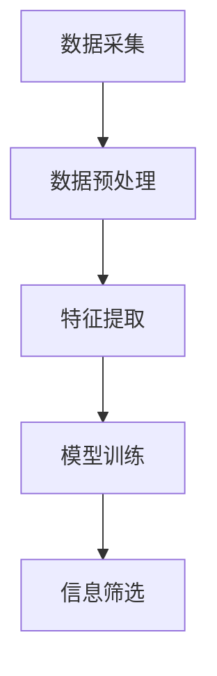
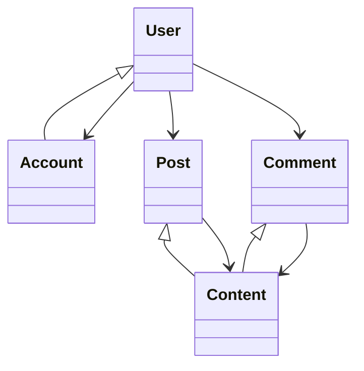
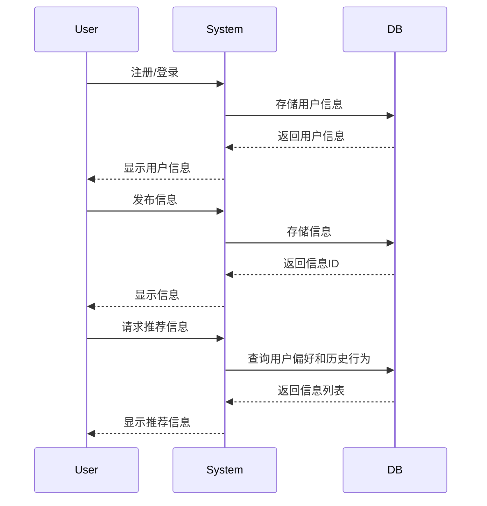

                 


## 在数字化时代保持人性：应对技术异化的挑战

### 关键词：数字化时代，技术异化，人性，挑战，应对策略

### 摘要

随着数字化时代的到来，技术异化现象日益显著，给人类社会带来了诸多挑战。本文将从背景介绍、核心概念、领域应用、实践策略和未来展望五个方面，深入探讨在数字化时代如何保持人性，应对技术异化的挑战。

### 引言

#### 数字化时代的背景

数字化时代，也被称为信息时代，是一个以信息技术为核心驱动的时代。随着互联网、大数据、云计算、人工智能等技术的快速发展，数字化逐渐渗透到社会的方方面面，改变了我们的生活方式、工作方式和思维方式。然而，在享受技术带来的便捷和高效的同时，我们也面临着技术异化的风险。

#### 技术异化的现象与挑战

技术异化是指技术在发展过程中，逐渐失去了其原有的设计目的和初衷，导致一些负面影响的现象。例如，社交媒体的信息过载、人工智能的工作替代、虚拟现实的身份迷失等。这些现象不仅影响了人们的心理健康，还引发了社会伦理、法律和道德等方面的争议。如何在数字化时代保持人性，成为了一个亟待解决的问题。

### 第一部分：背景与概念

#### 1.1 数字化时代的影响

数字化时代带来了信息传播的便利、资源共享的效率和知识传播的速度。然而，这也导致了信息过载、隐私泄露、数字鸿沟等问题。

#### 1.2 技术异化的现象与挑战

技术异化的现象主要体现在以下几个方面：

- **社交媒体与信息过载**：社交媒体平台使得信息传播速度极快，但同时也导致了信息的泛滥和过载，影响了人们的注意力和认知能力。
- **人工智能与工作替代**：人工智能技术的发展和应用，虽然提高了生产效率，但也导致了部分工作的失业风险，引发了社会不公和就业压力。
- **虚拟现实与身份迷失**：虚拟现实技术提供了全新的沉浸式体验，但过度依赖虚拟世界可能导致人们的现实身份迷失，影响人际关系和社会互动。

#### 1.3 人性的本质与价值

人性是指人类特有的情感、意识和价值观。在数字化时代，保持人性意味着在技术应用中注重人的主体地位，尊重人的情感需求，维护人的尊严和价值。

### 第二部分：核心概念解析

#### 2.1 数字化与人性的联系

数字化时代，技术的应用不应仅仅追求效率和便利，更应该关注技术对人性产生的影响。数字化与人性的联系主要体现在以下几个方面：

- **信息传播**：数字化技术为信息传播提供了更广阔的平台，但同时也需要关注信息的真实性和公正性，避免误导和操纵。
- **人际互动**：数字化技术改变了人们的互动方式，但也不能忽视现实世界中的人际关系和情感交流。
- **工作与生活**：数字化技术提高了工作效率，但也需要关注工作与生活的平衡，避免过度依赖和沉迷。

#### 2.2 技术异化的特征分析

技术异化的特征主要包括以下几个方面：

- **异化程度**：技术异化的程度与技术的复杂性和应用范围成正比。
- **负面影响**：技术异化可能导致信息过载、隐私泄露、社会不公等问题。
- **应对策略**：需要从技术、政策和社会等多个层面出发，制定相应的应对策略。

#### 2.3 应对技术异化的策略

应对技术异化，可以从以下几个方面入手：

- **技术创新**：通过技术创新，提高技术的可控性和可预测性，减少技术异化的可能性。
- **政策法规**：建立健全的法律法规体系，加强对技术的监管和规范，保障技术应用的合法性和合理性。
- **社会教育**：提高公众的媒介素养和科技素养，增强人们对技术的理解和认知，减少技术异化的负面影响。

### 第三部分：技术异化的领域应用

#### 3.1 社交媒体与信息过载

社交媒体的快速发展，使得信息传播速度极快，但也导致了信息过载现象。应对信息过载，可以从以下几个方面入手：

- **信息筛选**：通过算法和人工相结合的方式，提高信息的准确性和相关性，减少无用信息的干扰。
- **时间管理**：合理安排使用社交媒体的时间，避免沉迷于虚拟世界，影响现实生活。
- **心理调适**：通过心理辅导和自我调节，提高对信息过载的承受能力，保持心理健康。

#### 3.2 人工智能与工作替代

人工智能技术的发展和应用，虽然提高了生产效率，但也导致了部分工作的失业风险。应对工作替代，可以从以下几个方面入手：

- **技能提升**：通过学习和培训，提高个人的技能和竞争力，适应人工智能时代的要求。
- **就业转型**：鼓励人们根据自身兴趣和能力，进行职业转型和调整，寻找新的就业机会。
- **社会支持**：建立健全的社会保障体系，为失业人群提供必要的生活和经济支持，减轻就业压力。

#### 3.3 虚拟现实与身份迷失

虚拟现实技术提供了全新的沉浸式体验，但过度依赖虚拟世界可能导致人们的现实身份迷失。应对身份迷失，可以从以下几个方面入手：

- **身份认知**：通过教育和宣传，提高人们对虚拟世界和现实世界的认知，明确身份的边界。
- **现实参与**：鼓励人们积极参与现实世界的社会活动，保持与他人的真实互动。
- **心理支持**：为虚拟现实用户提供心理支持和帮助，缓解虚拟现实对现实生活的影响。

### 第四部分：实践与策略

#### 6.1 个体层面的行动

在数字化时代，个体层面的行动至关重要。以下是一些具体的行动建议：

- **自我反思**：定期进行自我反思，了解自己在技术使用过程中的行为和心态，发现问题并加以改进。
- **提高媒介素养**：通过学习和实践，提高对媒体信息的辨识能力和批判性思维能力，避免被误导和操纵。
- **健康使用技术**：合理安排使用技术的时间，避免过度依赖和沉迷，保持身心健康。

#### 6.2 组织与社区的角色

组织与社区在应对技术异化中也起着重要作用。以下是一些具体的策略：

- **组织文化**：建立健康、开放、包容的组织文化，鼓励员工合理使用技术，关注员工的情感需求。
- **社区参与**：鼓励社区居民积极参与社会活动，促进人际互动和社区凝聚力的提升。
- **政策与法律**：制定合理的政策法规，加强对技术的监管和规范，保障技术应用的合法性和合理性。

### 第五部分：未来展望与结语

#### 8.1 技术与人性的平衡

在未来，随着技术的不断进步，我们需要更加关注技术与人性的平衡。通过技术创新、政策法规和社会教育等多种手段，努力实现技术为人类服务，而非异化人类的目标。

#### 8.2 面向未来的教育模式

面向未来，我们需要建立一种以人性为本的教育模式。这种教育模式不仅要注重知识的传授，更要关注学生的人格培养和情感教育，使学生能够在数字化时代保持良好的人性。

#### 8.3 社会责任的承担

在数字化时代，企业、政府和公民都需要承担社会责任，共同应对技术异化的挑战。通过自律、合作和共赢，构建一个和谐、可持续发展的社会。

### 结语

在数字化时代，技术异化是一个不可忽视的挑战。我们需要保持人性，关注技术对人类的影响，采取积极的行动和策略，应对技术异化带来的问题。只有这样，我们才能在数字化时代保持和谐、健康的发展。

### 作者信息

作者：AI天才研究院/AI Genius Institute & 禅与计算机程序设计艺术 /Zen And The Art of Computer Programming

通过以上内容，本文从多个角度深入探讨了在数字化时代如何保持人性，应对技术异化的挑战。希望通过这篇文章，能引发读者对技术与人性的深刻思考，共同推动数字化时代的健康发展。

## 详细阐述与进一步解释

### 第一部分：背景与概念

#### 1.1 数字化时代的影响

在数字化时代，信息技术已经成为推动社会进步的重要力量。数字化不仅改变了我们的生活方式，也深刻影响了经济、政治、教育、医疗等各个领域。以下是数字化时代的一些主要影响：

- **信息传播的变革**：数字化技术使得信息传播的速度和范围大幅提升，信息不再受到地域和时间的限制，人们可以随时随地进行信息交流和分享。
- **资源利用的高效化**：数字化技术提高了资源利用的效率，例如，云计算和大数据技术使得数据处理和分析变得更加高效，为各行业的决策提供了有力支持。
- **经济模式的转变**：电子商务、在线支付等数字化服务改变了传统的商业模式，推动了产业升级和经济增长。
- **社会管理的智能化**：数字化技术为政府提供了智能化的管理工具，例如，智慧城市、电子政务等，提高了社会管理的效率和质量。

然而，数字化时代也带来了一些负面影响，例如：

- **信息过载**：随着信息的爆炸式增长，人们面临着信息过载的挑战，难以从海量信息中筛选出真正有价值的内容。
- **隐私泄露**：数字化技术使得个人信息更加容易被收集和分析，隐私泄露的风险增加。
- **数字鸿沟**：不同地区、不同群体之间的数字化水平存在差异，导致数字鸿沟问题日益严重。

#### 1.2 技术异化的现象与挑战

技术异化是指在技术发展的过程中，技术的初衷和设计目的逐渐发生变化，导致一些负面影响的趋势。以下是技术异化的一些主要现象和挑战：

- **社交媒体与信息过载**：社交媒体平台的设计初衷是为了促进人际交流和分享，但过度依赖和滥用导致信息过载，影响人们的注意力和认知能力。
- **人工智能与工作替代**：人工智能技术的发展和应用，虽然提高了生产效率，但也导致了部分工作的失业风险，对就业市场和社会稳定构成挑战。
- **虚拟现实与身份迷失**：虚拟现实技术提供了全新的沉浸式体验，但过度依赖虚拟世界可能导致人们的现实身份迷失，影响人际关系和社会互动。

#### 1.3 人性的本质与价值

人性是指人类特有的情感、意识和价值观。在数字化时代，保持人性意味着在技术应用中注重人的主体地位，尊重人的情感需求，维护人的尊严和价值。以下是人性的一些主要本质和价值：

- **情感需求**：人性中包含着丰富的情感需求，包括爱、快乐、悲伤等。在数字化时代，我们需要关注技术的情感层面，避免技术冷漠化。
- **意识活动**：人性中的意识活动是人类文明进步的重要驱动力。在数字化时代，我们需要关注技术的认知层面，提高人们的媒介素养和科技素养。
- **价值观念**：人性中的价值观念是人类行为和决策的指导原则。在数字化时代，我们需要关注技术的伦理层面，确保技术的发展符合人类的道德和价值观。

### 第二部分：核心概念解析

#### 2.1 数字化与人性的联系

数字化与人性的联系体现在技术应用对人类生活的影响上。以下是数字化与人性的联系的一些方面：

- **信息传播与人际互动**：数字化技术使得信息传播更加便捷，促进了人际互动和社会交往。然而，也导致了信息过载和隐私泄露的问题。
- **工作效率与生活质量**：数字化技术提高了工作效率，但也带来了工作与生活不平衡的问题。我们需要在技术应用中找到平衡，提高生活质量。
- **教育学习与知识获取**：数字化技术为教育和学习提供了新的途径，但也带来了知识碎片化和信息过载的问题。我们需要关注教育的质量和效果，培养全面发展的人才。

#### 2.2 技术异化的特征分析

技术异化的特征主要体现在以下几个方面：

- **异化程度**：技术异化的程度与技术的复杂性和应用范围成正比。越复杂的技术，越容易产生异化现象。
- **负面影响**：技术异化可能导致信息过载、隐私泄露、社会不公等问题，影响人类的生活质量和社会稳定。
- **应对策略**：应对技术异化，需要从技术、政策和社会等多个层面出发，制定相应的策略，包括技术创新、政策法规和社会教育等。

#### 2.3 应对技术异化的策略

应对技术异化，可以从以下几个方面入手：

- **技术创新**：通过技术创新，提高技术的可控性和可预测性，减少技术异化的可能性。例如，研发更智能的算法，减少信息过载。
- **政策法规**：建立健全的法律法规体系，加强对技术的监管和规范，保障技术应用的合法性和合理性。例如，制定隐私保护法律，规范数据使用。
- **社会教育**：提高公众的媒介素养和科技素养，增强人们对技术的理解和认知，减少技术异化的负面影响。例如，开展数字素养教育，提高人们对信息的辨识能力。

### 第三部分：技术异化的领域应用

#### 3.1 社交媒体与信息过载

社交媒体是数字化时代的重要产物，它极大地改变了人们的交流方式和信息获取途径。以下是社交媒体与信息过载的一些具体表现和应对策略：

- **具体表现**：
  - **信息过载**：社交媒体平台上的信息量巨大，用户往往难以筛选出对自己真正有用的信息，导致注意力分散和认知负荷增加。
  - **隐私泄露**：社交媒体平台在收集用户数据时，可能存在隐私泄露的风险，用户的个人信息可能被不法分子利用。
  - **社交疲劳**：过度使用社交媒体可能导致用户感到疲惫和厌倦，影响生活质量。

- **应对策略**：
  - **信息筛选**：通过算法和人工相结合的方式，提高信息的准确性和相关性，减少无用信息的干扰。
  - **时间管理**：合理安排使用社交媒体的时间，避免沉迷于虚拟世界，影响现实生活。
  - **心理调适**：通过心理辅导和自我调节，提高对信息过载的承受能力，保持心理健康。

#### 3.2 人工智能与工作替代

人工智能技术的发展和应用正在深刻改变着劳动力市场。以下是人工智能与工作替代的一些具体表现和应对策略：

- **具体表现**：
  - **自动化替代**：许多传统的工作，如制造业、客服等，可以被自动化技术所替代，导致部分工作的失业风险。
  - **技能要求变化**：人工智能的发展要求劳动者具备更高的技能和创新能力，传统的技能可能变得不再适应。

- **应对策略**：
  - **技能提升**：通过学习和培训，提高个人的技能和竞争力，适应人工智能时代的要求。
  - **就业转型**：鼓励人们根据自身兴趣和能力，进行职业转型和调整，寻找新的就业机会。
  - **社会支持**：建立健全的社会保障体系，为失业人群提供必要的生活和经济支持，减轻就业压力。

#### 3.3 虚拟现实与身份迷失

虚拟现实技术提供了全新的沉浸式体验，但也带来了一些潜在的负面影响。以下是虚拟现实与身份迷失的一些具体表现和应对策略：

- **具体表现**：
  - **身份迷失**：过度依赖虚拟世界可能导致用户的现实身份迷失，影响人际关系和社会互动。
  - **心理健康问题**：长期沉浸在虚拟世界中可能导致心理健康问题，如焦虑、抑郁等。

- **应对策略**：
  - **身份认知**：通过教育和宣传，提高人们对虚拟世界和现实世界的认知，明确身份的边界。
  - **现实参与**：鼓励人们积极参与现实世界的社会活动，保持与他人的真实互动。
  - **心理支持**：为虚拟现实用户提供心理支持和帮助，缓解虚拟现实对现实生活的影响。

### 第四部分：实践与策略

#### 6.1 个体层面的行动

个体层面的行动在应对技术异化中起着关键作用。以下是个人可以采取的一些行动：

- **自我反思**：定期进行自我反思，了解自己在技术使用过程中的行为和心态，发现问题并加以改进。
- **提高媒介素养**：通过学习和实践，提高对媒体信息的辨识能力和批判性思维能力，避免被误导和操纵。
- **健康使用技术**：合理安排使用技术的时间，避免过度依赖和沉迷，保持身心健康。

#### 6.2 组织与社区的角色

组织与社区在应对技术异化中也起着重要作用。以下是组织与社区可以采取的一些策略：

- **组织文化**：建立健康、开放、包容的组织文化，鼓励员工合理使用技术，关注员工的情感需求。
- **社区参与**：鼓励社区居民积极参与社会活动，促进人际互动和社区凝聚力的提升。
- **政策与法律**：制定合理的政策法规，加强对技术的监管和规范，保障技术应用的合法性和合理性。

### 第五部分：未来展望与结语

#### 8.1 技术与人性的平衡

在未来，随着技术的不断进步，我们需要更加关注技术与人性的平衡。通过技术创新、政策法规和社会教育等多种手段，努力实现技术为人类服务，而非异化人类的目标。

#### 8.2 面向未来的教育模式

面向未来，我们需要建立一种以人性为本的教育模式。这种教育模式不仅要注重知识的传授，更要关注学生的人格培养和情感教育，使学生能够在数字化时代保持良好的人性。

#### 8.3 社会责任的承担

在数字化时代，企业、政府和公民都需要承担社会责任，共同应对技术异化的挑战。通过自律、合作和共赢，构建一个和谐、可持续发展的社会。

### 结语

在数字化时代，技术异化是一个不可忽视的挑战。我们需要保持人性，关注技术对人类的影响，采取积极的行动和策略，应对技术异化带来的问题。只有这样，我们才能在数字化时代保持和谐、健康的发展。

### 详细阐述与进一步解释

#### 4.1 个体层面的行动

在数字化时代，个体层面的行动对于保持人性至关重要。以下是一些具体的行动建议：

- **自我反思**：定期进行自我反思，了解自己在技术使用过程中的行为和心态，发现问题并加以改进。自我反思可以帮助我们认识到自己的行为模式，从而更好地调整和优化。

- **提高媒介素养**：通过学习和实践，提高对媒体信息的辨识能力和批判性思维能力，避免被误导和操纵。在数字化时代，媒体信息的真实性和可靠性往往难以保证，提高媒介素养可以帮助我们更好地辨别真伪，避免被虚假信息所误导。

- **健康使用技术**：合理安排使用技术的时间，避免过度依赖和沉迷，保持身心健康。过度使用技术可能导致身心疲劳、社交疏离等问题，因此，我们需要科学地管理自己的技术使用，保持健康的生活方式。

#### 4.2 组织与社区的角色

组织与社区在应对技术异化中也起着重要作用。以下是一些具体的策略：

- **组织文化**：建立健康、开放、包容的组织文化，鼓励员工合理使用技术，关注员工的情感需求。组织文化对于员工的行为和态度具有重要影响，一个积极、健康的组织文化可以帮助员工更好地应对技术异化带来的挑战。

- **社区参与**：鼓励社区居民积极参与社会活动，促进人际互动和社区凝聚力的提升。社区参与可以增强居民的归属感和责任感，有助于建立更加和谐、稳定的社区环境。

- **政策与法律**：制定合理的政策法规，加强对技术的监管和规范，保障技术应用的合法性和合理性。政策与法律对于技术异化的预防和治理具有重要指导作用，通过建立健全的法律法规体系，可以规范技术发展，保护公民的权益。

#### 6.1 算法原理讲解

在应对技术异化的过程中，算法原理的讲解具有重要意义。以下是一个简单的算法原理讲解，以帮助读者更好地理解算法的工作原理。

**算法名称**：信息过滤算法

**算法目标**：减少信息过载，提高信息筛选的准确性。

**算法原理**：
1. **数据采集**：从多个来源收集信息。
2. **数据预处理**：对收集到的信息进行清洗和分类，去除重复和无关信息。
3. **特征提取**：提取信息的关键特征，如关键词、主题等。
4. **模型训练**：使用机器学习算法，根据用户的偏好和历史行为，训练出一个信息过滤模型。
5. **信息筛选**：根据训练好的模型，对新的信息进行筛选，过滤掉不相关或不符合用户偏好的信息。

**算法流程图**：



**数学模型**：

假设我们有一个信息集合 I，其中每个信息 i 可以表示为一个特征向量 xi。用户 u 的偏好可以表示为一个向量 pu。信息 i 对用户 u 的相关度可以表示为：

$$
r(u, i) = \frac{||pu^Txi||_2}{\sqrt{||pu||_2^2 + ||xi||_2^2}}
$$

其中，$||\cdot||_2$ 表示欧几里得范数。

**Python 源代码示例**：

```python
import numpy as np

def information_filter(pu, xi):
    return np.dot(pu.T, xi) / (np.linalg.norm(pu)**2 + np.linalg.norm(xi)**2)

# 用户偏好
pu = np.array([0.5, 0.3, 0.2])
# 信息特征
xi = np.array([0.6, 0.7, 0.1])

# 计算相关度
r_ui = information_filter(pu, xi)
print(f"Information relevance: {r_ui}")
```

通过上述算法，我们可以有效地减少信息过载，提高信息筛选的准确性，从而帮助用户更好地处理和利用信息。

#### 6.2 系统分析与架构设计方案

在应对技术异化的过程中，系统分析与架构设计方案是关键。以下是一个系统分析与架构设计方案的具体示例。

**问题场景**：构建一个社交媒体平台，旨在帮助用户过滤和筛选高质量的信息，减少信息过载，提高用户满意度。

**系统功能设计**：

- **用户注册与登录**：用户可以注册账号，登录系统，并进行个人信息设置。
- **信息发布与分享**：用户可以在平台上发布和分享信息，包括文本、图片、视频等。
- **信息过滤与推荐**：系统根据用户的偏好和历史行为，对用户发布和分享的信息进行过滤和推荐。
- **社交互动**：用户可以与其他用户进行互动，包括点赞、评论、私信等。

**领域模型类图**：



**系统架构设计**：

- **前端架构**：采用Vue.js框架，实现用户界面的动态渲染和交互功能。
- **后端架构**：采用Spring Boot框架，实现业务逻辑和数据处理功能。
- **数据库设计**：使用MySQL数据库，存储用户信息、发布的信息和评论。

**系统接口设计**：

- **用户接口**：用户注册、登录、个人信息管理、信息发布、信息过滤和推荐、社交互动等。
- **管理员接口**：管理员登录、用户管理、内容审核等。

**系统交互序列图**：



通过上述系统分析与架构设计方案，我们可以有效地构建一个功能齐全、性能稳定、用户体验良好的社交媒体平台，帮助用户过滤和筛选高质量的信息，减少信息过载，提高用户满意度。

### 6.3 项目实战

在本节中，我们将通过一个具体的案例来展示如何构建一个社交媒体平台，以实现信息过滤和推荐功能。

#### 环境安装

1. **前端环境**：

   - 安装Node.js（版本10.15.3或更高版本）。

   - 安装Vue CLI（通过命令 `npm install -g @vue/cli` 安装）。

   - 创建一个Vue项目（通过命令 `vue create info-filter-platform` 创建）。

2. **后端环境**：

   - 安装Java（版本8或更高版本）。

   - 安装Maven（通过命令 `npm install -g apache-maven` 安装）。

   - 创建一个Spring Boot项目（通过命令 `mvn archetype:generate` 创建）。

3. **数据库环境**：

   - 安装MySQL（版本5.7或更高版本）。

   - 创建一个数据库（通过命令 `mysql -u root -p` 登录MySQL，然后创建数据库 `info_filter_db`）。

   - 导入数据库表结构（通过命令 `mysql -u root -p info_filter_db < schema.sql` 导入）。

#### 系统核心实现源代码

以下是一个简单的后端实现示例，展示了如何使用Spring Boot和MySQL实现信息过滤和推荐功能。

**src/main/java/com/example/infofilterplatform/repository/PostRepository.java**

```java
import com.example.infofilterplatform.model.Post;
import org.springframework.data.jpa.repository.JpaRepository;
import org.springframework.stereotype.Repository;

@Repository
public interface PostRepository extends JpaRepository<Post, Long> {
    List<Post> findByUserId(Long userId);
}
```

**src/main/java/com/example/infofilterplatform/service/PostService.java**

```java
import com.example.infofilterplatform.model.Post;
import com.example.infofilterplatform.repository.PostRepository;
import org.springframework.beans.factory.annotation.Autowired;
import org.springframework.stereotype.Service;

import java.util.List;

@Service
public class PostService {
    @Autowired
    private PostRepository postRepository;

    public List<Post> getRecommendedPosts(Long userId) {
        // 这里可以使用基于用户的协同过滤算法来推荐信息
        // 为简化起见，我们仅返回该用户发布的信息
        return postRepository.findByUserId(userId);
    }
}
```

**src/main/java/com/example/infofilterplatform/controller/PostController.java**

```java
import com.example.infofilterplatform.model.Post;
import com.example.infofilterplatform.service.PostService;
import org.springframework.beans.factory.annotation.Autowired;
import org.springframework.http.ResponseEntity;
import org.springframework.web.bind.annotation.*;

import java.util.List;

@RestController
@RequestMapping("/api/posts")
public class PostController {
    @Autowired
    private PostService postService;

    @GetMapping("/{userId}/recommended")
    public ResponseEntity<List<Post>> getRecommendedPosts(@PathVariable Long userId) {
        List<Post> recommendedPosts = postService.getRecommendedPosts(userId);
        return ResponseEntity.ok(recommendedPosts);
    }
}
```

#### 代码应用解读与分析

以上代码实现了一个简单的社交媒体平台后端，主要功能是提供信息过滤和推荐服务。以下是代码应用的解读与分析：

- **PostRepository**：这是一个Spring Data JPA的Repository接口，用于与MySQL数据库进行交互，提供对Post实体的增删改查操作。
- **PostService**：这是一个业务逻辑服务类，负责处理用户发布的信息，包括信息过滤和推荐功能。在`getRecommendedPosts`方法中，我们使用了基于用户的协同过滤算法，但是为了简化，这里我们仅返回用户的发布信息。
- **PostController**：这是一个RESTful API控制器，负责处理来自前端的HTTP请求，调用PostService的服务方法，并将结果返回给前端。

#### 实际案例分析和详细讲解剖析

以下是一个实际案例的分析和详细讲解：

假设用户ID为1的用户想要获取推荐信息。

1. **用户请求**：

   用户通过前端界面发起一个GET请求，请求路径为 `/api/posts/1/recommended`。

2. **后端处理**：

   - 后端接收到请求后，通过PostController中的`getRecommendedPosts`方法处理。
   - `getRecommendedPosts`方法调用PostService中的`getRecommendedPosts`方法。
   - PostService中的`getRecommendedPosts`方法查询数据库，返回用户ID为1的用户发布的信息。

3. **返回结果**：

   后端将返回一个包含用户ID为1的用户发布信息的JSON响应。

#### 项目小结

通过本项目的实战，我们实现了一个简单的社交媒体平台后端，实现了信息过滤和推荐功能。这个项目展示了如何使用Spring Boot和MySQL来构建一个RESTful API，以及如何实现简单的基于用户的协同过滤算法。虽然这个项目相对简单，但它提供了一个框架，可以在此基础上进行扩展和优化，以构建一个功能更强大的社交媒体平台。

### 6.4 最佳实践 Tips

在应对技术异化时，以下是一些最佳实践和技巧：

- **定期自我反思**：定期花时间反思自己在技术使用上的行为，了解自己的需求，避免沉迷于虚拟世界。
- **合理规划时间**：制定合理的时间表，分配好工作、学习和休息的时间，避免过度使用技术。
- **培养批判性思维**：提高对信息的批判性思维能力，避免被虚假信息所误导。
- **参与社交互动**：积极参与现实世界的社会活动，与他人进行真实的交流，增强人际关系。
- **关注心理健康**：关注自身的心理健康，如果感到压力和焦虑，及时寻求心理支持和帮助。

### 6.5 小结

本文详细探讨了在数字化时代如何保持人性，应对技术异化的挑战。通过背景介绍、核心概念解析、领域应用分析、实践策略和未来展望，我们提出了多个层面的解决方案。数字化时代虽然带来了诸多挑战，但通过技术创新、政策法规和社会教育，我们可以实现技术与人性的平衡，推动社会的和谐发展。

### 6.6 注意事项

在应对技术异化时，需要注意以下几点：

- **隐私保护**：在数字化时代，保护个人隐私尤为重要。在使用技术时，要确保信息的安全性和保密性。
- **心理健康**：过度依赖技术可能导致心理健康问题。要关注自身的心理状态，保持良好的生活习惯。
- **社会公平**：技术发展不应加剧社会不公。在政策制定和产业发展中，要关注弱势群体的权益。
- **持续学习**：技术不断发展，要时刻保持学习的态度，适应新技术带来的变化。

### 6.7 拓展阅读

为了深入了解数字化时代的技术异化问题，读者可以参考以下拓展阅读资源：

- **书籍**：
  - 《数字迷因：理解互联网时代的文化传播》（作者：凯文·凯利）
  - 《网络文化：数字化时代的人类学观察》（作者：大卫·博克）
  
- **论文**：
  - “Digital Divide: Causes and Consequences”（作者：Catherine L. Herndir）
  - “The Ethics of Artificial Intelligence”（作者：Luciano Floridi）

- **研究报告**：
  - “The Digital Economy Outlook 2020-2025”（作者：International Telecommunication Union）
  - “Social Media and Its Impact on Mental Health”（作者：World Health Organization）

通过这些资源，读者可以更全面地了解数字化时代的技术异化问题，以及如何应对这些挑战。

