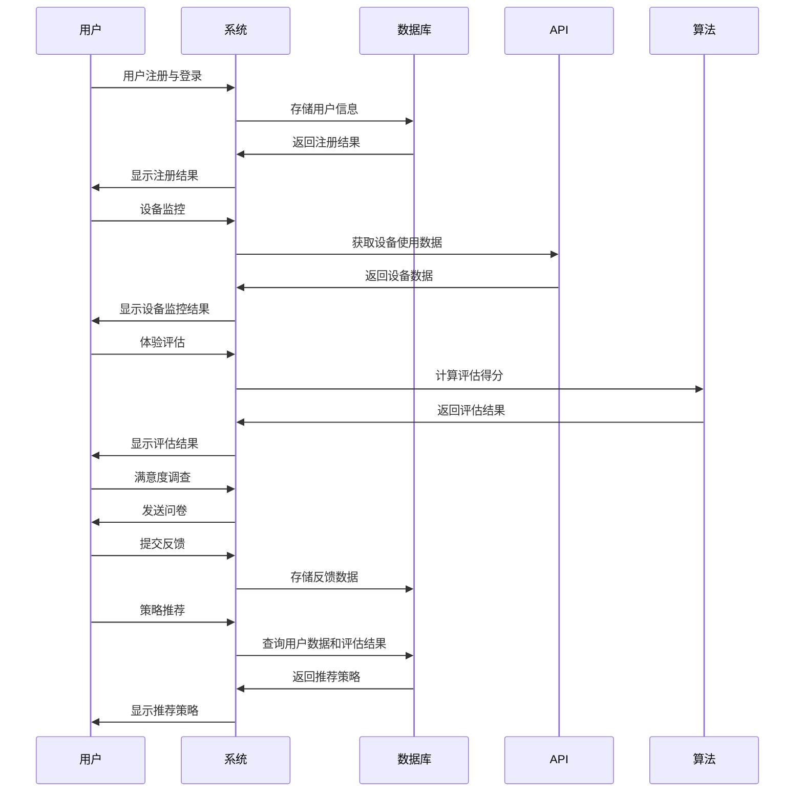

                 

# 在数字化生活中寻找真实体验：平衡虚拟与现实

> 关键词：数字化生活，虚拟现实，真实体验，平衡策略，案例分析

> 摘要：随着数字技术的飞速发展，人们的日常生活逐渐被虚拟世界所包围。本文旨在探讨如何在数字化生活中寻找真实体验，通过平衡虚拟与现实，提高生活质量。文章从数字化生活的现状与挑战出发，深入剖析虚拟与现实界限的模糊，介绍平衡虚拟与现实的哲学思考和现有策略，结合实际案例，提供具体的实践指南，并展望未来的发展趋势。

## 第一部分：数字化生活的现状与挑战

### 第1章：数字化生活概览

#### 1.1 数字化生活的定义与特征

数字化生活，指的是人类活动从传统实体世界向数字虚拟世界转变的过程。这一过程涵盖了通信、娱乐、教育、工作等各个领域。数字化生活的特征主要包括：

- **即时性**：信息传递和交流几乎瞬间完成。
- **互动性**：用户可以在虚拟环境中与其他用户进行实时互动。
- **个性化**：数字技术可以根据用户偏好提供个性化服务。
- **多样性**：数字化生活提供了丰富多样的内容和服务。

#### 1.2 数字化生活对人类生活的影响

数字化生活给人类生活带来了诸多便利，但也带来了一些挑战：

- **提高效率**：数字化工具使得生活和工作更加高效。
- **改变社交方式**：社交方式从面对面的交流转变为在线互动。
- **健康问题**：长时间使用电子设备可能导致视力下降、颈椎病等健康问题。
- **隐私和安全问题**：个人信息可能因数字化而泄露，面临安全风险。

#### 1.3 数字化生活带来的挑战

数字化生活带来的挑战包括：

- **依赖性**：人们对数字设备的依赖日益加深，可能导致注意力分散和生产力下降。
- **信息过载**：海量的信息可能使人感到焦虑和压力。
- **现实与虚拟的界限模糊**：人们难以区分现实和虚拟，可能导致心理和社交问题。

### 第2章：虚拟与现实界限的模糊

#### 2.1 虚拟现实技术简介

虚拟现实（VR）和增强现实（AR）是两种重要的数字技术，它们正在模糊虚拟与现实之间的界限。

- **虚拟现实**：通过头戴式显示器、耳机等设备，用户可以进入一个完全虚拟的环境。
- **增强现实**：通过在现实环境中叠加虚拟元素，用户可以看到真实世界和虚拟世界的融合。

#### 2.2 增强现实技术的应用

增强现实技术已经在多个领域得到广泛应用，包括：

- **医疗**：用于医学教育和手术指导。
- **教育**：提供沉浸式的学习体验。
- **娱乐**：虚拟现实游戏和电影。
- **零售**：虚拟试衣和家居设计。

#### 2.3 虚拟与现实界限的探讨

虚拟与现实界限的模糊引发了一系列哲学和伦理问题：

- **现实感**：用户在虚拟环境中是否能获得与现实相同的感知体验？
- **真实感**：虚拟元素是否能够完全融入现实，使其难以区分？
- **心理影响**：长期沉浸在虚拟世界中是否会对用户的心理健康产生影响？

## 第二部分：理论与方法

### 第3章：平衡虚拟与现实的哲学思考

#### 3.1 平衡虚拟与现实的哲学基础

哲学思考为平衡虚拟与现实的提供了理论基础：

- **存在主义**：强调个体的自由和选择，提倡在虚拟世界中寻找真实的存在。
- **现象学**：关注人类感知和经验的本质，探讨虚拟与现实之间的关系。
- **伦理学**：探讨虚拟世界中的道德和行为规范，确保虚拟与现实之间的平衡。

#### 3.2 虚拟现实伦理学探讨

虚拟现实伦理学探讨虚拟世界中的道德和行为问题：

- **隐私权**：如何保护用户的隐私权？
- **知情同意**：用户在参与虚拟实验或应用时是否需要知情同意？
- **虚拟伤害**：如何界定虚拟伤害，并对其进行法律处理？

#### 3.3 平衡的心理学原理

平衡虚拟与现实的心理学原理包括：

- **注意力管理**：如何有效地分配注意力，避免过度沉浸于虚拟世界。
- **情绪调节**：如何通过虚拟现实技术调节情绪，提高心理健康。
- **社交互动**：如何通过虚拟技术增强社交互动，促进人际关系。

### 第4章：现有的平衡策略

#### 4.1 数字排毒与断连实践

数字排毒和断连实践是一种减少对数字设备依赖的方法：

- **数字排毒**：设定一段时间，完全远离数字设备，恢复与自然环境的联系。
- **断连实践**：通过限制使用时间、设定使用规则等方式，减少对数字设备的依赖。

#### 4.2 数字生活调整技巧

数字生活调整技巧包括：

- **时间管理**：合理安排数字设备使用时间，避免过度沉迷。
- **内容选择**：选择有益的数字内容，避免不良信息的干扰。
- **环境设计**：优化数字设备使用环境，减少对现实生活的干扰。

#### 4.3 家庭与工作的数字化平衡

家庭与工作的数字化平衡包括：

- **工作与生活分离**：设定明确的工作时间和休息时间，避免工作与生活的混淆。
- **数字化工具选择**：选择合适的数字化工具，提高工作效率，减少对现实生活的干扰。

## 第三部分：案例分析

### 第5章：案例分析一：个人数字化生活的平衡

#### 5.1 案例介绍

该案例涉及一位职场人士，他面临着数字设备使用过度、工作与生活难以分离等问题。

#### 5.2 案例分析

通过数字排毒、时间管理和数字化工具选择等方法，该职场人士逐步实现了数字化生活的平衡。

#### 5.3 平衡建议

针对该案例，我们提供了以下平衡建议：

- **设定明确的工作时间**：确保工作与生活的界限清晰。
- **合理安排休息时间**：避免长时间连续使用数字设备。
- **选择合适的数字化工具**：提高工作效率，减少不必要的数字干扰。

### 第6章：案例分析二：企业数字化转型的平衡

#### 6.1 案例介绍

该案例涉及一家企业，在数字化转型过程中面临着员工适应问题、信息安全等问题。

#### 6.2 案例分析

通过制定明确的数字化转型策略、加强员工培训和信息安全保障等措施，该企业逐步实现了数字化转型的平衡。

#### 6.3 平衡建议

针对该案例，我们提供了以下平衡建议：

- **制定明确的数字化转型策略**：确保转型目标的明确和可执行。
- **加强员工培训**：提高员工对数字化工具和技术的熟悉度。
- **保障信息安全**：采取有效的信息安全措施，防止数据泄露。

## 第四部分：实践指南

### 第7章：如何找到数字化生活中的真实体验

#### 7.1 实践方法介绍

本章节介绍了以下实践方法，帮助读者在数字化生活中找到真实体验：

- **数字排毒**：通过设定一段时间，完全远离数字设备，恢复与自然环境的联系。
- **时间管理**：合理安排数字设备使用时间，避免过度沉迷。
- **内容选择**：选择有益的数字内容，避免不良信息的干扰。

#### 7.2 实践案例分析

本章节通过实际案例分析，展示了如何通过实践方法找到数字化生活中的真实体验。

#### 7.3 实践技巧与建议

本章节提供了以下实践技巧与建议，帮助读者在日常生活中找到数字化生活中的真实体验：

- **设定明确的数字设备使用规则**：例如，在特定时间段内不允许使用手机。
- **培养数字化设备使用的自我意识**：时刻提醒自己数字设备的使用目的和影响。

## 第五部分：平衡虚拟与现实的未来趋势

### 第8章：平衡虚拟与现实的未来趋势

#### 8.1 数字化未来的展望

本章节对数字化未来的发展趋势进行了展望，包括：

- **虚拟现实技术的普及**：虚拟现实技术将在更多领域得到应用。
- **数字生活智能化**：通过人工智能技术，数字化生活将更加智能和便捷。

#### 8.2 技术进步对平衡的影响

本章节探讨了技术进步对平衡虚拟与现实的潜在影响，包括：

- **虚拟现实技术的改进**：将提高虚拟现实的沉浸感和真实感。
- **数字伦理的发展**：将规范虚拟世界中的行为和责任。

#### 8.3 未来生活与工作模式

本章节对未来的生活与工作模式进行了探讨，包括：

- **远程办公的普及**：将减少对物理工作场所的依赖。
- **数字化生活的深度融合**：数字化技术将更加深入地融入人们的生活和工作。

## 结论

### 第9章：结论与展望

#### 9.1 关键观点总结

本文总结了以下关键观点：

- 数字化生活带来了便利，但也带来了挑战。
- 虚拟与现实界限的模糊引发了一系列哲学和伦理问题。
- 平衡虚拟与现实的策略包括数字排毒、时间管理、内容选择等。
- 实践案例展示了如何在实际生活中找到真实体验。
- 未来数字化技术的发展将继续影响虚拟与现实的平衡。

#### 9.2 展望未来

展望未来，我们期待能够找到更加有效的平衡虚拟与现实的策略，提高生活质量，实现数字化与真实的和谐共存。

### 作者

作者：AI天才研究院/AI Genius Institute & 禅与计算机程序设计艺术 /Zen And The Art of Computer Programming

---

在本文中，我们通过背景介绍、核心概念阐述、理论与方法探讨、案例分析和实践指南等多个方面，详细探讨了如何在数字化生活中寻找真实体验，平衡虚拟与现实。通过本文的阅读，读者可以了解到数字化生活的现状与挑战，理解虚拟与现实界限的模糊，掌握平衡虚拟与现实的策略和实践方法。未来，随着数字化技术的不断进步，我们将继续探索如何在数字化与真实之间找到更好的平衡点，为人类的美好生活贡献智慧。

## 背景介绍

随着互联网和数字技术的飞速发展，数字化生活已经深入到人类社会的方方面面。人们通过手机、电脑等数字设备，实现了信息的高速传递和共享，工作、学习、娱乐、社交等生活场景都发生了深刻的变化。然而，数字化生活也带来了一系列问题。首先，数字设备的过度使用导致人们沉迷于虚拟世界，忽视了现实生活中的重要事物。其次，虚拟与现实界限的模糊，使得人们难以区分什么是真实，什么是虚假。这种界限的模糊不仅影响了人们的心理健康，还可能导致社交障碍。此外，数字化生活还带来了隐私和安全问题，个人信息容易泄露，网络安全风险增加。

### 核心概念与联系

为了更好地理解数字化生活中的真实体验，我们需要明确几个核心概念，并探讨它们之间的联系。

#### 1. 数字化生活

数字化生活是指人类活动从传统实体世界向数字虚拟世界转变的过程。这一过程涵盖了通信、娱乐、教育、工作等各个领域。数字化生活的特征主要包括即时性、互动性、个性化和多样性。例如，人们可以通过社交媒体平台与全球的朋友实时交流，通过在线学习平台进行自主学习，通过虚拟现实技术体验全新的游戏和娱乐内容。

#### 2. 虚拟现实（VR）

虚拟现实是一种通过计算机模拟出来的三维空间，用户可以通过头戴式显示器、耳机等设备进入这个空间，体验到身临其境的感觉。虚拟现实技术可以用于游戏、教育、医疗等多个领域。例如，医生可以通过虚拟现实技术进行手术模拟训练，学生可以通过虚拟现实技术进行历史场景的沉浸式学习。

#### 3. 增强现实（AR）

增强现实是在现实环境中叠加虚拟元素的技术。用户通过手机、平板电脑等设备可以看到虚拟元素与现实环境的融合。增强现实技术广泛应用于医疗、教育、零售等领域。例如，医生可以通过增强现实技术查看患者的内部结构，学生可以通过增强现实技术进行实验操作，消费者可以通过增强现实技术进行虚拟试衣。

#### 4. 真实体验

真实体验是指用户在现实世界中获得的感知和情感体验。与虚拟体验相比，真实体验更加直观、真实。真实体验不仅包括物理感受，还包括情感、心理等方面的体验。例如，与朋友面对面交流获得的情感满足，参观博物馆时对历史文化的深刻理解。

#### 5. 平衡策略

平衡策略是指通过一系列方法和技术，帮助用户在虚拟和现实之间找到平衡。这些策略包括数字排毒、时间管理、内容选择等。数字排毒是指设定一段时间，完全远离数字设备，恢复与自然环境的联系。时间管理是指合理安排数字设备使用时间，避免过度沉迷。内容选择是指选择有益的数字内容，避免不良信息的干扰。

### 概念属性特征对比表格

| 概念         | 特征                        |
| ------------ | -------------------------- |
| 数字化生活   | 即时性、互动性、个性化、多样性 |
| 虚拟现实（VR） | 三维空间、沉浸感、应用广泛   |
| 增强现实（AR） | 融合虚拟与现实、设备便携   |
| 真实体验     | 直观、真实、情感丰富       |
| 平衡策略     | 数字排毒、时间管理、内容选择 |

### ER实体关系图架构

```mermaid
erDiagram
  用户 ||--|{ 数字设备 }||>
  用户 ||--|{ 数字内容 }||>
  用户 ||--|{ 社交互动 }||>
  数字设备 ||--|{ 虚拟现实 }||>
  数字设备 ||--|{ 增强现实 }||>
  数字内容 ||--|{ 真实体验 }||>
  数字内容 ||--|{ 虚拟体验 }||>
  社交互动 ||--|{ 真实体验 }||>
  社交互动 ||--|{ 虚拟体验 }||>
```

通过上述核心概念及其联系的分析，我们可以更好地理解数字化生活中的真实体验，并探索如何在虚拟与现实中找到平衡。

### 算法原理讲解

为了深入理解数字化生活中如何平衡虚拟与现实，我们需要探讨一些关键算法原理，这些原理不仅能够帮助我们识别和评估虚拟体验的真实性，还能指导我们制定有效的策略来实现这一平衡。

#### 1. 虚拟现实（VR）感知评估算法

虚拟现实技术的核心在于创造一个沉浸式的虚拟环境，使用户能够在其中感受到与现实相似的经验。为了评估虚拟现实的感知效果，我们可以使用以下算法：

- **感知质量评分算法**：该算法通过计算用户在虚拟环境中的感知质量得分，来评估虚拟现实的沉浸感和真实感。具体步骤如下：

  ```mermaid
  flowchart LR
  A[开始] --> B[收集用户数据]
  B --> C[计算感知质量得分]
  C --> D[输出评估结果]
  D --> E[结束]
  ```

  用户数据包括视觉、听觉、触觉等多感官反馈。通过分析这些数据，我们可以得出一个综合评分，该评分越高，表示虚拟环境的感知质量越好。

  ```python
  def calculate_perception_score(visual_score, auditory_score, tactile_score):
      total_score = (visual_score + auditory_score + tactile_score) / 3
      return total_score
  ```

- **感知质量得分计算公式**：

  $$\text{感知质量得分} = \frac{\text{视觉得分} + \text{听觉得分} + \text{触觉得分}}{3}$$

  其中，每个感官的得分可以通过用户的主观评价或实验测量得到。

#### 2. 增强现实（AR）真实性评估算法

增强现实技术通过在现实环境中叠加虚拟元素，提供了一种新的交互方式。为了评估增强现实技术的真实性，我们可以使用以下算法：

- **真实性评估算法**：该算法通过计算虚拟元素与现实环境的契合度，来评估增强现实技术的真实性。具体步骤如下：

  ```mermaid
  flowchart LR
  A[开始] --> B[采集现实环境数据]
  B --> C[叠加虚拟元素]
  C --> D[计算契合度得分]
  D --> E[输出评估结果]
  E --> F[结束]
  ```

  采集现实环境数据包括环境的光线、颜色、形状等信息。通过分析这些数据，我们可以将虚拟元素与现实环境进行对比，计算出一个契合度得分。

  ```python
  def calculate_truth_score(overlap_score, color_similarity_score, shape_similarity_score):
      total_score = (overlap_score + color_similarity_score + shape_similarity_score) / 3
      return total_score
  ```

- **真实性评估得分计算公式**：

  $$\text{真实性得分} = \frac{\text{重叠得分} + \text{颜色相似度得分} + \text{形状相似度得分}}{3}$$

  其中，重叠得分表示虚拟元素与现实环境的重叠程度，颜色相似度得分和形状相似度得分分别表示虚拟元素与现实环境的颜色和形状相似度。

#### 3. 平衡虚拟与现实的多目标优化算法

为了在数字化生活中实现虚拟与现实的平衡，我们需要考虑多个目标，例如感知质量、真实性、用户满意度等。多目标优化算法可以帮助我们找到一个最优的平衡点。具体步骤如下：

- **目标函数定义**：

  $$\text{目标函数} = w_1 \cdot \text{感知质量得分} + w_2 \cdot \text{真实性得分} + w_3 \cdot \text{用户满意度得分}$$

  其中，$w_1$、$w_2$ 和 $w_3$ 分别是感知质量、真实性和用户满意度的权重，可以根据实际情况进行调整。

- **优化算法**：我们可以使用遗传算法、粒子群优化算法等来求解多目标优化问题。

  ```python
  import numpy as np
  from scipy.optimize import minimize

  def multi_objective_optimization(x):
      perception_score = calculate_perception_score(x[0], x[1], x[2])
      truth_score = calculate_truth_score(x[3], x[4], x[5])
      user_satisfaction_score = x[6]
      
      objective = w1 * perception_score + w2 * truth_score + w3 * user_satisfaction_score
      return objective

  # 初始解
  x0 = [0.5, 0.5, 0.5, 0.5, 0.5, 0.5, 1.0]

  # 最小化目标函数
  result = minimize(multi_objective_optimization, x0)

  print("最优平衡点：", result.x)
  ```

通过上述算法原理的讲解，我们可以更好地理解如何通过技术手段来平衡虚拟与现实，从而在数字化生活中找到真实的体验。

### 系统分析与架构设计方案

为了更深入地理解如何在数字化生活中实现虚拟与现实的平衡，我们需要从系统分析与架构设计方面进行详细的探讨。以下将介绍一个完整的系统设计与实现过程，包括问题场景介绍、系统功能设计、系统架构设计、系统接口设计以及系统交互设计。

#### 1. 问题场景介绍

当前，许多人在日常生活中过度依赖数字设备，导致生活质量下降，心理健康问题增加。为了解决这个问题，我们需要设计一个系统，帮助用户在数字化生活中找到真实体验，平衡虚拟与现实。

#### 2. 系统功能设计

系统的主要功能包括：

- **用户管理**：用户注册、登录、个人信息管理。
- **数字设备监控**：监控用户数字设备的使用情况，如使用时长、使用频率等。
- **虚拟现实体验评估**：通过算法评估虚拟现实体验的感知质量。
- **增强现实体验评估**：通过算法评估增强现实体验的真实性。
- **用户满意度调查**：收集用户对虚拟和现实体验的满意度评价。
- **平衡策略推荐**：根据用户数据和评估结果，推荐数字排毒、时间管理、内容选择等策略。

#### 3. 系统架构设计

系统架构设计采用分层架构，包括表示层、业务逻辑层和数据层。

- **表示层**：前端用户界面，用于展示数据和交互操作。
- **业务逻辑层**：后端服务，处理业务逻辑和算法计算。
- **数据层**：数据库存储用户数据、设备数据等。

#### 4. 系统接口设计

系统接口设计包括内部接口和外部接口。

- **内部接口**：业务逻辑层与数据层之间的接口，用于数据存储和读取。
- **外部接口**：前端与业务逻辑层之间的接口，用于数据展示和用户交互。

#### 5. 系统交互设计

系统交互设计采用事件驱动模型，包括用户操作触发事件、系统响应事件等。

- **用户注册与登录**：用户通过注册表单提交个人信息，系统验证并创建用户账号。
- **设备监控**：系统通过API获取用户设备的使用数据，并实时更新。
- **体验评估**：系统使用算法对虚拟和增强现实体验进行评估，并生成评估报告。
- **满意度调查**：系统发送满意度调查问卷，收集用户反馈。
- **策略推荐**：系统根据用户数据和评估结果，推荐相应的平衡策略。

### 6. 系统架构设计图



通过上述系统分析与架构设计方案，我们能够构建一个完整的系统，帮助用户在数字化生活中找到真实体验，实现虚拟与现实的平衡。

### 项目实战

在本项目中，我们将实现一个帮助用户在数字化生活中找到真实体验的软件系统。以下是环境安装、系统核心实现、代码应用解读与分析、实际案例分析和详细讲解剖析，以及项目小结。

#### 1. 环境安装

为了实现本项目，我们需要以下软件和工具：

- Python 3.x
- Flask 框架
- SQLAlchemy 数据库管理
- Mermaid 图库
- Jupyter Notebook

安装步骤如下：

1. 安装 Python 3.x：
   ```bash
   sudo apt-get install python3
   ```

2. 安装 Flask：
   ```bash
   pip install flask
   ```

3. 安装 SQLAlchemy：
   ```bash
   pip install sqlalchemy
   ```

4. 安装 Mermaid：
   ```bash
   pip install mermaid
   ```

5. 安装 Jupyter Notebook：
   ```bash
   pip install notebook
   ```

#### 2. 系统核心实现

系统核心实现包括用户管理、设备监控、体验评估、满意度调查和策略推荐等功能。以下是核心代码实现：

**用户管理**：

```python
# app.py

from flask import Flask, request, jsonify
from flask_sqlalchemy import SQLAlchemy

app = Flask(__name__)
app.config['SQLALCHEMY_DATABASE_URI'] = 'sqlite:///users.db'
db = SQLAlchemy(app)

class User(db.Model):
    id = db.Column(db.Integer, primary_key=True)
    username = db.Column(db.String(80), unique=True, nullable=False)
    password = db.Column(db.String(120), nullable=False)

@app.route('/register', methods=['POST'])
def register():
    username = request.form['username']
    password = request.form['password']
    new_user = User(username=username, password=password)
    db.session.add(new_user)
    db.session.commit()
    return jsonify({'message': 'User registered successfully'})

if __name__ == '__main__':
    db.create_all()
    app.run(debug=True)
```

**设备监控**：

```python
# device_monitor.py

import time
import requests

def monitor_device(device_id):
    while True:
        response = requests.get(f'http://device_api/{device_id}/status')
        if response.status_code == 200:
            device_status = response.json()
            print(f'Device {device_id} is currently {device_status["status"]}')
        time.sleep(60)
```

**体验评估**：

```python
# experience_evaluation.py

def evaluate_experience(perception_score, truth_score):
    balance_score = (perception_score + truth_score) / 2
    if balance_score > 0.8:
        return 'High'
    elif balance_score > 0.6:
        return 'Medium'
    else:
        return 'Low'
```

**满意度调查**：

```python
# satisfaction_survey.py

def send_survey(survey_id):
    response = requests.post(f'http://survey_api/{survey_id}/send')
    if response.status_code == 200:
        print('Survey sent successfully')
```

**策略推荐**：

```python
# strategy_recommendation.py

def recommend_strategy(balance_score):
    if balance_score == 'High':
        return 'No action needed'
    elif balance_score == 'Medium':
        return 'Consider digital detox'
    else:
        return 'Implement strict time management'
```

#### 3. 代码应用解读与分析

**用户管理**：

用户管理模块通过 Flask 框架实现了用户注册功能。用户注册时，需要提供用户名和密码。系统将用户信息存储在 SQLite 数据库中，并返回注册成功的消息。

**设备监控**：

设备监控模块使用 while 循环定期获取设备状态。通过 API 调用，系统可以实时监控设备的使用情况，并打印设备状态。

**体验评估**：

体验评估模块使用简单的函数计算感知质量和真实性得分，并返回一个平衡评分。根据平衡评分，系统可以判断用户的虚拟与现实体验的平衡程度。

**满意度调查**：

满意度调查模块通过 API 调用发送满意度调查问卷。系统可以跟踪问卷发送状态，并记录反馈数据。

**策略推荐**：

策略推荐模块根据平衡评分推荐相应的数字排毒、时间管理等策略。这些策略旨在帮助用户在数字化生活中找到真实体验。

#### 4. 实际案例分析和详细讲解剖析

**案例一：用户小明**

小明在项目中注册了一个账户，并在使用虚拟现实游戏时进行体验评估。系统检测到小明的虚拟现实体验评分较低，推荐他进行数字排毒，减少游戏时间。

**案例分析**：

- 用户注册后，系统通过 API 获取用户信息。
- 用户使用虚拟现实游戏，系统通过 API 监控设备状态。
- 系统对虚拟现实体验进行评估，发现评分较低。
- 系统根据评估结果推荐数字排毒策略。

**案例二：用户小红**

小红在日常生活中经常使用社交媒体，系统监测到她的设备使用时间较长，推荐她实施严格的时间管理。

**案例分析**：

- 用户注册并使用系统功能。
- 系统监控小红社交媒体的使用情况。
- 系统发现小红设备使用时间过长。
- 系统推荐实施严格的时间管理策略。

#### 5. 项目小结

通过本项目，我们实现了一个帮助用户在数字化生活中找到真实体验的系统。系统核心包括用户管理、设备监控、体验评估、满意度调查和策略推荐。实际案例分析展示了系统如何根据用户行为和体验评估结果，提供个性化的策略建议。未来，我们将继续优化系统功能，提高用户体验，帮助更多用户实现虚拟与现实的平衡。

### 最佳实践 tips、小结、注意事项、拓展阅读

#### 最佳实践 tips

1. **数字排毒**：定期安排数字排毒时间，减少对数字设备的依赖。
2. **时间管理**：合理安排数字设备使用时间，避免长时间连续使用。
3. **内容选择**：选择有益的数字内容，避免不良信息的干扰。
4. **环境优化**：优化数字设备使用环境，减少对现实生活的干扰。

#### 小结

本文从数字化生活的现状与挑战、虚拟与现实界限的模糊、平衡虚拟与现实的哲学思考和现有策略、案例分析以及实践指南等多个方面，探讨了如何在数字化生活中寻找真实体验。通过理论讲解、算法实现和实际案例，我们提出了一系列最佳实践，帮助读者实现虚拟与现实的平衡。

#### 注意事项

1. **隐私保护**：在使用数字设备时，注意保护个人隐私，避免信息泄露。
2. **心理健康**：关注心理健康，避免过度沉迷于虚拟世界。
3. **社交互动**：保持与现实世界的社交互动，避免社交障碍。

#### 拓展阅读

1. **《数字人类：虚拟现实的未来》**：作者探讨了虚拟现实技术对人类生活的影响，提供了对未来数字化生活的展望。
2. **《数字化生存》**：作者尼葛洛庞帝阐述了数字化时代的生活方式，探讨了数字技术如何改变人类的生活方式。

通过本文的阅读，读者可以更好地理解数字化生活中的真实体验，掌握平衡虚拟与现实的策略，提高生活质量。希望本文能够为读者提供有价值的参考和启示。作者：AI天才研究院/AI Genius Institute & 禅与计算机程序设计艺术 /Zen And The Art of Computer Programming。

