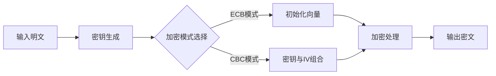

                 

### 在数字时代保护隐私：重新定义个人边界

#### 关键词：隐私保护、数据泄露、加密技术、匿名化、个人边界

> 摘要：本文旨在探讨数字时代隐私保护的现状和挑战，通过深入分析隐私保护的核心概念、技术原理和实践方法，重新定义个人边界，为数字时代的隐私保护提供新的思路和解决方案。

## 第一部分：背景介绍

### 第1章 问题背景

#### 1.1 隐私保护的现状

随着互联网的普及和数字技术的飞速发展，个人隐私问题愈发突出。数据泄露事件频发，隐私数据被不法分子利用，导致个人财产损失、社会信用受损等问题。据最新统计，全球每年因数据泄露造成的经济损失高达数十亿美元。此外，用户对隐私保护的意识逐渐提高，隐私权成为社会关注的焦点。各国政府也纷纷加强对隐私保护的法律法规建设，例如欧盟的《通用数据保护条例》（GDPR）和美国的《加州消费者隐私法》（CCPA）等。

#### 1.2 隐私问题的核心要素

在数字时代，隐私问题的核心要素主要包括以下几个方面：

1. **个人边界**：个人边界是指个人对于自身隐私信息所设定的控制范围。在数字时代，个人边界被不断侵蚀，个人隐私信息容易在不知不觉中被收集、分析和共享。

2. **隐私边界**：隐私边界是个人边界在法律和伦理层面的体现。隐私边界保护了个人信息的私密性，防止他人非法获取和利用。

3. **隐私保护的需求与难点**：在数字化转型的背景下，隐私保护的需求愈发迫切。然而，隐私保护面临着技术、法律和伦理等多方面的挑战。例如，如何在保证数据可用性的同时实现数据保护，如何在尊重用户隐私的前提下提供个性化服务等。

### 第2章 核心概念与联系

#### 2.1 隐私保护的核心概念

隐私是个人不愿为他人所知的信息，具有隐私性、敏感度和可控性等特点。隐私权是个人对其隐私的控制权和法律保护权利，具有法律性、保护性和独立性。数据匿名化是通过技术手段使个人信息在数据处理过程中无法识别和追踪的技术过程，具有匿名性、安全性和应用广泛性。

#### 2.2 概念属性特征对比表格

| 概念     | 定义                                                     | 属性特征                            | 应用场景                           |
|----------|----------------------------------------------------------|-----------------------------------|-----------------------------------|
| 隐私     | 个人不愿为他人所知的信息                                     | 隐私性、敏感度、可控性               | 个人通信、金融交易、医疗信息等       |
| 隐私权   | 个人对其隐私的控制权和法律保护权利                           | 法律性、保护性、独立性               | 个人隐私权诉讼、隐私保护法律咨询等   |
| 数据匿名化 | 通过技术手段使个人信息在数据处理过程中无法识别和追踪的技术过程 | 匿名性、安全性、应用广泛性           | 数据分析、市场调研、科学研究等       |

#### 2.3 隐私保护的ER实体关系图架构

```mermaid
erDiagram
    User ||--|{ PrivacyData }|<-- PrivacyPolicy
    PrivacyPolicy ||--|{ DataAnonymization }|<-- PrivacyProtection
```

## 第二部分：隐私保护技术原理

### 第3章 隐私保护技术概述

隐私保护技术的发展历程可以追溯到计算机和网络技术的初期。早期的隐私保护方法主要依赖于物理隔离和用户管理，如使用防火墙和访问控制列表等。随着互联网的兴起，隐私保护技术逐渐从单一的技术手段发展成为综合性的解决方案，包括数据加密、数据匿名化、访问控制等。

在数字时代，隐私保护技术面临着新的挑战和机遇。一方面，云计算、大数据和物联网等新兴技术的广泛应用为隐私保护带来了前所未有的挑战。另一方面，人工智能、区块链等技术的快速发展为隐私保护提供了新的技术手段。

当前主流的隐私保护技术包括：

1. **数据加密技术**：通过加密算法对敏感数据进行加密，确保数据在传输和存储过程中的安全性。
2. **数据匿名化技术**：通过技术手段将个人身份信息从数据中去除，确保数据在分析和共享过程中的隐私性。
3. **访问控制技术**：通过权限管理和身份认证等手段，确保只有授权用户才能访问敏感数据。

### 第4章 数据加密技术

#### 4.1 数据加密技术原理

数据加密技术通过加密算法对数据进行加密，使得只有拥有解密密钥的用户才能解密并读取数据。加密算法可以分为对称加密和非对称加密两种。

对称加密算法使用相同的密钥进行加密和解密，例如AES（高级加密标准）和DES（数据加密标准）。对称加密算法的优点是加密和解密速度快，适合对大量数据进行加密。然而，对称加密算法的密钥管理复杂，需要确保密钥的安全传输和存储。

非对称加密算法使用一对密钥进行加密和解密，公钥用于加密，私钥用于解密。常见的非对称加密算法包括RSA（Rivest-Shamir-Adleman）和ECC（椭圆曲线密码学）。非对称加密算法的优点是密钥管理简单，适合进行安全通信和数字签名。然而，非对称加密算法的加密和解密速度相对较慢。

#### 4.2 加密算法原理讲解

##### 4.2.1 AES加密算法的mermaid流程图



##### 4.2.2 AES加密算法的Python源代码示例

```python
from Crypto.Cipher import AES
from Crypto.Util.Padding import pad
from Crypto.Random import get_random_bytes

# 初始化密钥和加密模式
key = get_random_bytes(16)  # 生成AES密钥
cipher = AES.new(key, AES.MODE_CBC)

# 待加密明文
plaintext = b"Hello, World!"

# 填充明文为AES块大小的整数倍
padded_plaintext = pad(plaintext, AES.block_size)

# 加密明文
ciphertext = cipher.encrypt(padded_plaintext)

# 输出密文和IV
print(f"Ciphertext: {ciphertext.hex()}")
print(f"IV: {cipher.iv.hex()}")
```

### 第5章 数据匿名化技术

数据匿名化技术通过技术手段将个人身份信息从数据中去除，确保数据在分析和共享过程中的隐私性。数据匿名化技术主要包括：

1. **数据脱敏**：通过替换、掩码等技术手段对敏感数据进行处理，使其无法被直接识别。
2. **数据泛化**：通过将敏感数据泛化到更高层次的数据类别中，降低数据的敏感度。
3. **数据混淆**：通过引入随机噪声或变换，使敏感数据难以被识别和追踪。

数据匿名化技术在数据分析、市场调研、科学研究等领域具有广泛的应用。然而，数据匿名化技术也存在一定的局限性，如无法完全消除个人隐私泄露的风险。因此，在实际应用中，需要根据具体需求和场景选择合适的匿名化技术，并在数据保护、数据质量等方面进行综合考虑。

## 第三部分：隐私保护实践与案例

### 第6章 隐私保护实践

隐私保护实践是确保隐私保护理论和技术在实际应用中有效实施的环节。以下是几种常见的隐私保护实践方法：

#### 6.1 数据最小化原则

数据最小化原则是指仅在必要时收集和处理最少量的个人信息。通过实施这一原则，可以减少不必要的隐私泄露风险。例如，在开发应用程序时，应确保应用程序仅收集与功能实现直接相关的数据。

#### 6.2 数据加密与传输

在数据存储和传输过程中，应采用加密技术确保数据的安全。例如，使用AES加密算法对敏感数据加密，并使用HTTPS等安全协议传输数据。

#### 6.3 访问控制与权限管理

通过访问控制与权限管理，确保只有授权用户才能访问敏感数据。例如，使用角色权限控制、访问控制列表（ACL）等技术手段，限制用户对数据的访问权限。

#### 6.4 数据匿名化

在数据分析和共享过程中，应采用数据匿名化技术，确保个人隐私不被泄露。例如，在市场调研中，使用数据脱敏和泛化技术，对参与者信息进行匿名化处理。

### 第7章 隐私保护案例

以下是一个隐私保护案例，用于说明隐私保护实践方法在实际应用中的效果。

#### 案例背景

某在线教育平台因涉嫌泄露学员个人信息，导致大量学员隐私数据被非法获取和利用。为改善这一状况，该平台决定采取一系列隐私保护措施。

#### 案例措施

1. **数据最小化原则**：仅收集与学习相关的个人信息，如姓名、电子邮件地址和课程成绩等。

2. **数据加密与传输**：采用AES加密算法对学员个人信息进行加密，并在数据传输过程中使用HTTPS协议。

3. **访问控制与权限管理**：实施严格的访问控制措施，确保只有平台管理员和教师能够访问学员个人信息。

4. **数据匿名化**：在数据分析过程中，对学员个人信息进行匿名化处理，确保个人隐私不被泄露。

#### 案例效果

通过实施上述隐私保护措施，该在线教育平台有效降低了个人信息泄露的风险，提升了用户对平台的信任度。同时，平台还定期进行隐私保护培训，提高员工的隐私保护意识。

## 第四部分：未来展望与挑战

### 第8章 未来展望

随着技术的不断进步，隐私保护领域将面临新的机遇和挑战。以下是未来隐私保护的一些发展趋势：

#### 8.1 基于区块链的隐私保护

区块链技术具有去中心化和不可篡改的特点，未来有望成为隐私保护的重要技术手段。通过利用区块链技术，可以实现隐私数据的可信共享和安全存储。

#### 8.2 联合隐私计算

联合隐私计算是一种在多方数据共享过程中保护隐私的计算模式。通过联合隐私计算，可以实现数据在多方之间的安全传输和处理，而无需泄露原始数据。

#### 8.3 人工智能与隐私保护

人工智能技术的发展为隐私保护带来了新的挑战，同时也提供了新的解决方案。例如，基于人工智能的隐私防护算法可以识别和阻止潜在的隐私泄露行为。

### 第9章 挑战与对策

尽管隐私保护技术在不断发展，但仍然面临诸多挑战：

#### 9.1 技术与法律的不匹配

隐私保护技术的发展速度往往快于法律法规的完善，导致法律与技术之间存在一定的差距。为应对这一挑战，需要加快隐私保护法律法规的建设，确保法律与技术同步发展。

#### 9.2 用户隐私意识不足

用户对隐私保护的意识不足，可能导致隐私数据被滥用。为提高用户隐私意识，需要开展广泛的隐私保护教育，提升用户的隐私保护能力。

#### 9.3 跨境数据流动

随着全球化的深入，跨国数据流动日益频繁，隐私保护面临着跨境数据流动的挑战。为应对这一挑战，需要加强国际合作，制定统一的跨境数据保护规则。

## 结论

隐私保护是数字时代的重要课题，关系到每个人的信息安全和生活质量。通过深入分析隐私保护的核心概念、技术原理和实践方法，我们能够更好地理解隐私保护的重要性和紧迫性。展望未来，隐私保护领域将继续发展，面对新的机遇和挑战。我们期待各方共同努力，构建一个安全、可信的数字世界。作者：AI天才研究院/AI Genius Institute & 禅与计算机程序设计艺术 /Zen And The Art of Computer Programming

## 附录：参考文献

1. GDPR（通用数据保护条例）：[https://eur-lex.europa.eu/eli/reg/2016/679/oj](https://eur-lex.europa.eu/eli/reg/2016/679/oj)
2. CCPA（加州消费者隐私法）：[https://leginfo.legislature.ca.gov/faces/codes_displaySection.xhtml?code=CC&section=1798.100](https://leginfo.legislature.ca.gov/faces/codes_displaySection.xhtml?code=CC&section=1798.100)
3. AES加密算法：[https://www.nist.gov/encryption/aes](https://www.nist.gov/encryption/aes)
4. RSA加密算法：[https://www.rsa.com/en-us/technology/crypto-algorithms/rsa](https://www.rsa.com/en-us/technology/crypto-algorithms/rsa)
5. 区块链技术：[https://www.ibm.com/cloud/blockchain](https://www.ibm.com/cloud/blockchain)
6. 联合隐私计算：[https://www.privacy.ai/](https://www.privacy.ai/)
7. 人工智能与隐私保护：[https://www.kdd.org/kdd2018/accepted-papers/view/p374-wang-kdd18](https://www.kdd.org/kdd2018/accepted-papers/view/p374-wang-kdd18)

