                 


## 引言：数字经济时代的职业意义探析

随着数字技术的迅猛发展，全球经济正经历着一场深刻的变革，这被称为“数字经济时代”。数字经济不仅改变了传统产业的运作方式，也带来了就业市场的巨大变化。在这篇文章中，我们将深入探讨数字经济时代职业意义的演变与挑战，帮助读者更好地理解和应对这一变革。

### 1.1 数字经济的概念与特征

首先，我们需要明确数字经济的概念。数字经济是指以数字化的信息和知识为关键生产要素，以现代信息网络为重要载体，通过信息通信技术的深度广泛应用，促进经济结构优化、增长动力转换和效率提升的经济活动。

数字经济具有以下几个显著特征：

1. **信息化**: 信息成为驱动经济增长的核心动力，数字化成为主要的生产方式。
2. **网络化**: 信息传输速度和覆盖范围大幅提升，全球化程度加深。
3. **智能化**: 人工智能、大数据、云计算等新兴技术广泛应用，推动产业智能化升级。
4. **创新性**: 数字经济以技术创新为驱动，不断催生新的商业模式和产业形态。

### 1.2 数字经济对就业市场的影响

数字经济的快速发展对就业市场产生了深远影响。一方面，传统产业面临着转型升级的压力，部分岗位可能被自动化和智能化技术取代；另一方面，新兴产业和岗位不断涌现，对劳动者的技能和素质提出了新的要求。

具体来说，数字经济对就业市场的影响表现在以下几个方面：

1. **岗位结构的改变**: 数字经济带来了新兴职业，如数据分析师、云计算工程师、人工智能开发人员等。同时，传统职业也在数字化转型中发生了变化。
2. **技能需求的变化**: 数字技能和跨领域技能越来越受到重视，例如编程能力、数据分析能力、跨文化沟通能力等。
3. **就业不稳定性的增加**: 数字经济下的就业市场波动性加大，个体职业安全面临挑战。

### 1.3 职业意义的新内涵与挑战

在数字经济时代，职业意义的内涵也在不断演变。传统的职业观念，如稳定的工作、明确的职业路径等，正在被重新定义。职业意义变得更加多元化和个性化，不仅包括物质层面的收入，还包括精神层面的满足感、成就感和社会贡献等。

同时，数字经济也带来了职业意义的挑战。例如，如何平衡技术进步与人文关怀、如何在职业发展中实现个人价值与社会价值的统一等。

## 关键词

- 数字经济
- 职业意义
- 就业市场
- 技能需求
- 职业安全

## 摘要

本文从数字经济时代的背景出发，探讨了职业意义的演变及其面临的挑战。通过分析数字经济对就业市场的影响，本文提出了职业需求的新趋势和职业规划的新方向，并探讨了跨界合作与职业安全的重要性。最后，本文对未来的职业发展进行了展望，强调了在变革中寻找职业意义的重要性。通过本文的探讨，希望能够为读者提供对数字经济时代职业发展的深刻见解和实用建议。

### 第1章 引言：数字经济时代的职业意义探析

在现代社会，数字经济正逐渐成为驱动经济增长的主要引擎，它不仅改变了传统的商业运作模式，也深刻地影响了就业市场。这一章将为我们揭开数字经济时代的神秘面纱，探讨职业意义在这一变革中的角色和重要性。

#### 1.1 数字经济的概念与特征

首先，我们需要理解什么是数字经济。数字经济是一种以数字化的信息和知识为主要生产要素，以互联网和信息技术为关键驱动力的经济形态。它不仅包括电子商务、网络服务、社交媒体等新兴产业，还涵盖了传统产业的数字化转型。

数字经济的特征主要体现在以下几个方面：

1. **信息化**: 数据成为新的生产要素，信息传递速度和覆盖范围大幅提升。
2. **网络化**: 互联网将全球连接在一起，信息的流动更加自由和便捷。
3. **智能化**: 人工智能、机器学习等技术的应用，使得生产和服务过程更加智能化。
4. **创新性**: 数字经济以技术创新为驱动，不断催生新的商业模式和产业形态。

#### 1.2 数字经济对就业市场的影响

数字经济的崛起对就业市场产生了深远的影响。一方面，它创造了大量新的就业机会，如数据分析师、云计算工程师、人工智能开发人员等。另一方面，它也加速了某些传统岗位的消失，如工厂操作员、电话客服等。

具体来说，数字经济对就业市场的影响表现在以下几个方面：

1. **岗位结构的改变**: 数字经济的兴起催生了大量新兴职业，同时传统职业也在数字化转型中发生了变化。
2. **技能需求的变化**: 数字技能和跨领域技能越来越受到重视，例如编程能力、数据分析能力、跨文化沟通能力等。
3. **就业不稳定性的增加**: 数字经济下的就业市场波动性加大，个体职业安全面临挑战。

#### 1.3 职业意义的新内涵与挑战

在数字经济时代，职业意义的内涵也在不断演变。传统的职业观念，如稳定的工作、明确的职业路径等，正在被重新定义。职业意义变得更加多元化和个性化，不仅包括物质层面的收入，还包括精神层面的满足感、成就感和社会贡献等。

同时，数字经济也带来了职业意义的挑战。例如，如何平衡技术进步与人文关怀、如何在职业发展中实现个人价值与社会价值的统一等。这些问题都需要我们在数字经济时代重新思考。

### 核心概念与联系

在深入探讨数字经济时代的职业意义之前，我们需要明确几个核心概念：

1. **数字经济**：以数字化信息和知识为主要生产要素，以互联网和信息技术为关键驱动力的经济形态。
2. **职业意义**：个体在职业生涯中所追求的目标和价值观，包括物质层面和精神层面。
3. **就业市场**：劳动力供给与需求的市场，包括职业岗位的供给和求职者的需求。

这些概念之间的联系在于，数字经济的发展不仅改变了就业市场的结构，也对职业意义的内涵产生了深远影响。

#### 概念属性特征对比表格

| 概念       | 属性特征                  | 关系与影响                |
|------------|---------------------------|---------------------------|
| 数字经济   | 信息化、网络化、智能化、创新性 | 改变就业市场结构，创造新兴职业 |
| 职业意义   | 多元化、个性化、物质和精神层面 | 影响个体职业选择和发展路径     |
| 就业市场   | 劳动力供给与需求的市场     | 职业机会与职业安全的载体       |

#### ER实体关系图架构

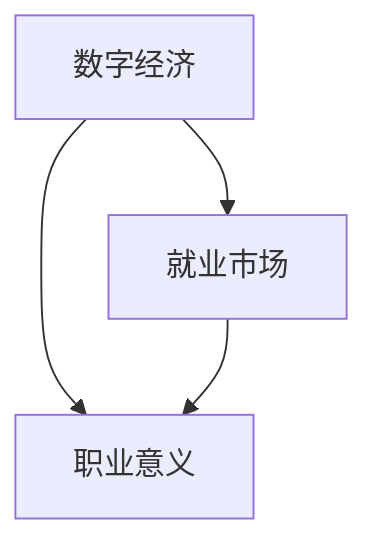

通过上述表格和ER实体关系图，我们可以清晰地看到数字经济、职业意义和就业市场之间的复杂关系和相互作用。

### 总结

数字经济时代的职业意义正在发生深刻的变革，这不仅带来了新的机遇，也带来了新的挑战。理解数字经济的概念和特征、洞察就业市场的影响和职业意义的新内涵，是我们在这一时代找到职业意义的必要步骤。在接下来的章节中，我们将进一步探讨数字经济时代下职业需求的新趋势、职业规划的新方向以及如何应对职业安全的挑战。

---

这一章为数字经济时代的职业意义奠定了基础。接下来，我们将详细分析数字经济时代的职业需求，探讨新兴技能的重要性以及如何应对这些变化。请继续阅读下一章，以了解更多关于职业需求的分析。

### 第2章 数字经济时代的职业需求分析

在数字经济时代，职业需求正经历着前所未有的变化。传统职业逐渐被智能化和自动化技术所取代，同时，新的职业机会不断涌现。本章将深入探讨数字经济时代的职业需求，分析新的职业技能需求、跨领域技能的融合以及数字技能在职业发展中的重要性。

#### 2.1 职业技能需求的变化趋势

数字经济的发展带来了职业技能需求的变化。以下是一些显著的职业技能需求趋势：

1. **编程能力**: 编程技能是数字经济时代的基本技能之一。无论是软件开发、数据科学还是人工智能领域，编程能力都是不可或缺的。
2. **数据分析能力**: 在大数据的背景下，数据分析成为各行各业的重要技能。数据分析师、数据科学家等职位需求急剧增加。
3. **云计算能力**: 云计算技术的普及使得云服务成为企业运营的重要一环。掌握云计算技术，如AWS、Azure或Google Cloud，成为许多职业的基本要求。
4. **网络安全知识**: 随着网络攻击的日益增多，网络安全成为企业关注的重点。具备网络安全知识的专业人才需求不断上升。

#### 2.2 跨领域技能的融合

数字经济时代的一个显著特点是不同领域技能的融合。以下是一些跨领域技能的融合趋势：

1. **技术与管理**: 传统的IT人员不再仅仅负责技术实现，他们还需要具备管理能力，能够理解业务需求，与业务团队紧密合作。
2. **设计与技术**: 设计师和技术人员之间的协作越来越紧密。用户体验设计师、交互设计师等职位需要具备一定的技术背景。
3. **商业与科技**: 商业人员需要了解科技趋势，以创新商业模式；同时，技术人员也需要了解市场动态，为技术创新提供方向。

#### 2.3 数字技能的重要性

数字技能在数字经济时代的重要性不言而喻。以下是一些数字技能的重要性分析：

1. **生产力提升**: 数字技能可以帮助企业提高生产效率，降低运营成本。例如，通过自动化流程和数据分析，企业可以优化运营策略。
2. **竞争力提升**: 在全球化的背景下，拥有数字技能的人才具备更强的竞争力。数字技能可以帮助企业在国际市场上脱颖而出。
3. **职业发展**: 拥有数字技能的人才在职业发展中具有更大的潜力。他们可以更容易地适应新的职业角色和机会。

### 核心概念与联系

在探讨数字经济时代的职业需求时，我们需要关注几个核心概念：

1. **编程能力**：掌握编程语言和开发工具，实现软件系统的设计和开发。
2. **数据分析能力**：运用统计学和数据挖掘技术，从数据中提取有价值的信息。
3. **云计算能力**：利用云平台提供的计算资源和服务，构建和管理云基础设施。
4. **网络安全知识**：了解网络安全的基本原理和技术，保护企业和个人数据的安全。

这些概念之间的联系在于，它们共同构成了数字经济时代职业技能的核心，并且相互支持，共同推动职业发展。

#### 概念属性特征对比表格

| 概念       | 属性特征                                  | 关系与影响                  |
|------------|-----------------------------------------|-----------------------------|
| 编程能力   | 编程语言、开发工具、软件设计              | 实现软件系统，推动技术创新     |
| 数据分析能力 | 统计学、数据挖掘、数据分析工具            | 提取数据价值，优化运营策略     |
| 云计算能力 | 云平台、云计算服务、云基础设施管理         | 提高生产力，降低运营成本       |
| 网络安全知识 | 网络安全原理、安全技术、网络安全工具       | 保护数据和系统安全             |

#### ER实体关系图架构

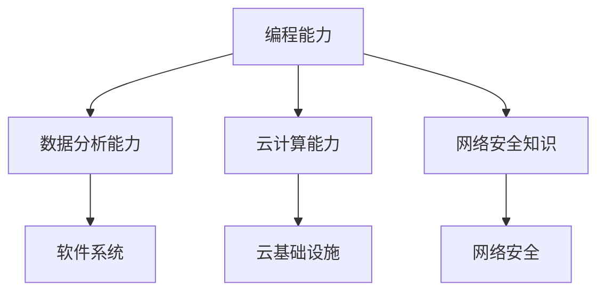

通过上述表格和ER实体关系图，我们可以清晰地看到数字经济时代职业技能需求之间的复杂关系和相互作用。

### 算法原理讲解

为了更好地理解数字技能在职业需求中的作用，我们可以通过一个简单的算法示例来展示数据分析的基本原理。以下是一个简单的线性回归算法，用于预测房屋价格。

#### 算法流程图

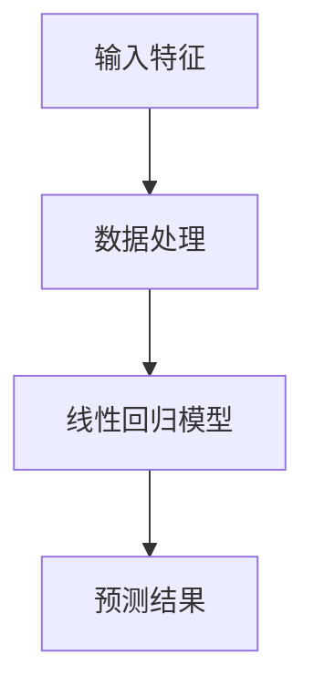

#### Python代码实现

```python
import numpy as np
from sklearn.linear_model import LinearRegression

# 特征数据
X = np.array([[1], [2], [3], [4], [5]])
y = np.array([1.5, 2.5, 3.5, 4.5, 5.5])

# 创建线性回归模型
model = LinearRegression()

# 模型训练
model.fit(X, y)

# 预测
predictions = model.predict(X)

print(predictions)
```

#### 数学模型和公式

线性回归模型的目标是找到一条直线，使得预测值与实际值之间的误差最小。其数学模型可以表示为：

\[ y = \beta_0 + \beta_1 \cdot x + \epsilon \]

其中，\( y \) 是实际值，\( x \) 是特征值，\( \beta_0 \) 和 \( \beta_1 \) 是模型的参数，\( \epsilon \) 是误差。

#### 详细讲解与举例

在这个例子中，我们使用了Python的`sklearn`库来实现线性回归。首先，我们导入必要的库和特征数据。然后，我们创建一个线性回归模型，并使用`fit`方法进行模型训练。最后，我们使用`predict`方法对特征数据进行预测。

假设我们有以下特征数据：

```
x: [1, 2, 3, 4, 5]
y: [1.5, 2.5, 3.5, 4.5, 5.5]
```

通过线性回归模型，我们可以预测新的特征值对应的房屋价格。例如，当特征值 \( x = 6 \) 时，预测的房屋价格为：

\[ y = \beta_0 + \beta_1 \cdot x \]

其中，\( \beta_0 \) 和 \( \beta_1 \) 是通过模型训练得到的参数。

### 总结

数字经济时代的职业需求发生了显著的变化，新的职业技能和跨领域技能融合成为职业发展的关键。编程能力、数据分析能力、云计算能力和网络安全知识等数字技能在职业需求中占据重要地位。通过上述算法示例，我们展示了如何利用线性回归算法进行数据分析，这有助于我们更好地理解数字技能在职业需求中的作用。在下一章中，我们将进一步探讨职业意义重构的过程，分析技术与人文的融合以及职业伦理与价值观的重塑。

---

在理解了数字经济时代职业需求的变化后，我们需要思考如何重构职业意义，以适应这一时代的变化。技术与人文的融合、职业伦理与价值观的重塑，都是重构职业意义的重要方面。下一章将深入探讨这些话题，帮助我们在数字经济时代找到更加丰富和深刻的职业意义。

### 第3章 职业意义重构：技术与人文的融合

在数字经济时代，职业意义的重构成为不可避免的趋势。这一重构不仅仅是技术层面的变革，更是人文关怀与价值观的重塑。技术与人文的融合成为新时代职业发展的关键，而职业伦理与价值观的重新审视则为我们提供了新的方向和标准。

#### 3.1 技术与人文的平衡

技术的进步无疑为职业发展带来了巨大的机遇，但过度依赖技术也可能带来一些负面影响。例如，自动化和人工智能技术的发展可能会导致就业岗位的减少，从而引发社会的不稳定。因此，在技术与人文之间寻找平衡点成为新时代职业发展的关键。

1. **技术为人文服务**：技术应以人为本，服务于人类的发展和福祉。例如，人工智能应被用于提高生产效率和生活质量，而不是简单地替代人力。
2. **人文促进技术发展**：人文关怀可以激发技术创新的灵感。例如，设计师在创作产品时，会考虑到用户体验和情感需求，从而推动技术的创新。

#### 3.2 职业伦理与价值观的重塑

数字经济时代，职业伦理与价值观面临着新的挑战。传统职业伦理在数字化背景下可能不再适用，我们需要重新审视和重构职业伦理与价值观。

1. **透明度与诚信**：在数字化环境中，信息传递更加迅速和透明，这对职业诚信提出了更高的要求。企业和个人都需要保持高度的透明度和诚信，以赢得社会的信任。
2. **社会责任与可持续发展**：企业和个人在追求经济利益的同时，也应承担起社会责任，关注环境保护和社会福祉。可持续发展成为新时代职业价值观的重要内容。
3. **数据隐私与安全**：在数字经济中，数据隐私和安全成为职业伦理的核心问题。企业和个人都应尊重数据隐私，采取有效措施保护数据安全。

#### 3.3 职业教育与培训的创新

为了适应数字经济时代的职业需求，职业教育与培训也需要进行创新。

1. **跨学科教育**：传统的职业教育往往局限于特定领域，而数字经济时代需要跨学科的知识和技能。例如，数据科学需要结合计算机科学、统计学和商业知识。
2. **终身学习理念**：在技术快速发展的时代，终身学习成为职业发展的必然要求。企业和个人都需要不断更新知识和技能，以适应不断变化的市场需求。
3. **实践导向的教育**：职业教育应更加注重实践能力的培养，通过实际项目和实践经验，让学生更好地理解理论知识并应用于实际工作中。

### 核心概念与联系

在探讨职业意义重构的过程中，我们需要关注几个核心概念：

1. **技术与人文**：技术进步与人文关怀之间的平衡，以及它们如何相互促进。
2. **职业伦理**：在数字经济时代，职业行为应遵循的道德规范和原则。
3. **价值观**：个体和企业在职业发展中所追求的目标和理念。

这些概念之间的联系在于，它们共同构成了数字经济时代职业意义的重构基础。技术为职业发展提供了工具和手段，而人文关怀和价值观念则为职业发展提供了方向和目标。

#### 概念属性特征对比表格

| 概念       | 属性特征                                  | 关系与影响                  |
|------------|-----------------------------------------|-----------------------------|
| 技术       | 信息化、网络化、智能化、创新性            | 改变职业方式，提高生产效率     |
| 人文       | 伦理、价值观、情感需求、社会责任           | 为职业发展提供道德和人文基础   |
| 职业伦理   | 诚信、透明度、社会责任、数据隐私           | 确保职业行为的合法性和道德性   |
| 价值观     | 经济利益、社会福祉、可持续发展、社会责任   | 指导职业决策和行为方向         |

#### ER实体关系图架构

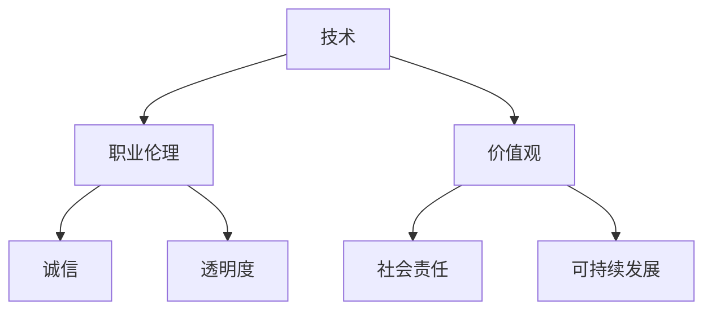

通过上述表格和ER实体关系图，我们可以清晰地看到技术与人文、职业伦理与价值观之间的复杂关系和相互作用。

### 算法原理讲解

为了更好地理解职业伦理与价值观的重构，我们可以通过一个简单的伦理决策算法来展示。以下是一个简单的伦理决策树，用于评估企业的行为是否符合职业伦理和价值观。

#### 算法流程图

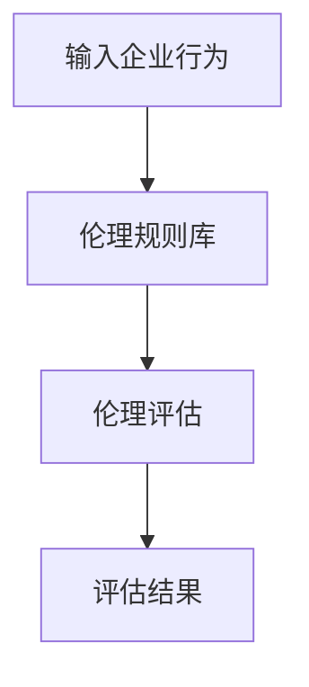

#### Python代码实现

```python
# 输入企业行为
behavior = ["公平对待员工", "遵守环保法规", "获取用户数据未经授权"]

# 伦理规则库
ethics_rules = {
    "公平对待员工": True,
    "遵守环保法规": True,
    "获取用户数据未经授权": False
}

# 伦理评估
def ethics_evaluation(behavior, ethics_rules):
    for action in behavior:
        if ethics_rules[action] == False:
            return "不符合职业伦理"
    return "符合职业伦理"

# 评估结果
result = ethics_evaluation(behavior, ethics_rules)
print(result)
```

#### 数学模型和公式

伦理决策树算法的核心是伦理规则库，它包含了一系列职业伦理和价值观的评估标准。通过对比企业行为与伦理规则，可以评估企业行为是否符合职业伦理和价值观。

#### 详细讲解与举例

在这个例子中，我们使用Python实现了一个简单的伦理决策树。首先，我们定义了企业行为和伦理规则库。然后，我们创建了一个`ethics_evaluation`函数，用于评估企业行为是否符合职业伦理和价值观。最后，我们调用这个函数并打印评估结果。

假设我们有以下企业行为：

```
行为：["公平对待员工", "遵守环保法规", "获取用户数据未经授权"]
```

通过伦理决策树算法，我们可以评估这些行为是否符合职业伦理和价值观。例如，如果企业行为中包含“获取用户数据未经授权”，则评估结果为“不符合职业伦理”。

### 总结

职业意义的重构是数字经济时代的重要任务，技术与人文的融合和职业伦理与价值观的重塑是这一重构的核心。通过伦理决策算法的例子，我们可以看到如何在数字时代中平衡技术与人文、评估职业行为是否符合伦理标准。在下一章中，我们将探讨数字经济时代的职业规划与提升，分析如何制定有效的职业规划策略和提升个人技能。

---

职业意义的重构为我们指明了数字经济时代的发展方向，而有效的职业规划与提升则是实现这一目标的实际步骤。在下一章中，我们将深入探讨职业规划与提升的方法和途径，帮助读者在数字时代中找到自己的定位，实现职业发展。

### 第4章 数字经济时代的职业规划与提升

在数字经济时代，职业规划与提升变得更加复杂和重要。随着技术的快速发展和就业市场的不断变化，个人需要具备灵活的职业规划能力和持续提升的技能。本章将探讨数字经济时代职业规划的基本步骤、技能提升的方法与途径，以及职业发展的新趋势。

#### 4.1 职业规划的步骤与方法

有效的职业规划是成功职业发展的基础。以下是一些关键步骤和方法：

1. **自我认知**：首先，个人需要了解自己的兴趣、价值观、能力和优势。这可以通过职业性格测试、自我反思和职业咨询等方式实现。
2. **市场调研**：了解当前的就业市场趋势和需求，包括热门行业、紧缺技能和职业前景。这可以通过网络搜索、行业报告和职业博览会等方式获取信息。
3. **设定目标**：根据自我认知和市场调研结果，设定明确的职业目标。这些目标可以是短期（1-2年）的，也可以是长期（5-10年）的。
4. **制定计划**：为实现职业目标，制定详细的行动计划。这包括学习新技能、获取相关经验、建立人脉网络等。
5. **执行与调整**：按照行动计划执行，并定期评估进展。根据实际情况进行调整，确保职业规划的有效性。

#### 4.2 技能与知识的持续更新

在数字经济时代，技能和知识的更新速度非常快。个人需要不断学习和适应新的技术和趋势，以保持竞争力。以下是一些技能提升的方法与途径：

1. **在线课程与培训**：利用互联网资源，参加在线课程和培训，学习最新的技术和行业知识。例如，Coursera、Udemy和edX等平台提供了丰富的在线课程。
2. **实践项目**：通过实际项目积累经验，提高实践能力。可以参与开源项目、实习或自主创业，将理论知识应用到实际工作中。
3. **职业网络**：加入专业组织和社区，与同行交流，了解行业动态和最佳实践。通过参加行业会议、研讨会和讲座，拓宽视野。
4. **导师指导**：寻找经验丰富的导师，获取职业发展的建议和指导。导师可以帮助个人规划职业道路，提供宝贵的经验和资源。

#### 4.3 职业发展的新趋势

数字经济时代，职业发展呈现出一些新的趋势：

1. **远程工作**：随着远程工作工具和平台的普及，越来越多的人选择在家办公或全球远程工作。远程工作提供了更大的灵活性和工作选择。
2. **终身学习**：终身学习成为职业发展的必要条件。个人需要不断学习新知识和技能，以适应快速变化的工作环境。
3. **跨界合作**：不同行业之间的融合和跨界合作成为趋势。个人可以通过跨领域学习和合作，开拓新的职业机会。
4. **个性化职业路径**：个人可以根据自己的兴趣和优势，选择个性化的职业路径。不再受限于传统的职业阶梯，个人可以自由探索和创造。

### 核心概念与联系

在探讨数字经济时代的职业规划与提升时，我们需要关注几个核心概念：

1. **自我认知**：了解自己的兴趣、价值观、能力和优势。
2. **市场调研**：了解当前的就业市场趋势和需求。
3. **职业目标**：设定明确的职业目标。
4. **行动计划**：制定详细的行动计划。
5. **技能提升**：通过在线课程、实践项目和职业网络等途径提升技能。

这些概念之间的联系在于，它们共同构成了数字经济时代职业规划与提升的基础。通过自我认知和市场调研，个人可以设定明确的职业目标，并制定详细的行动计划。技能提升是实现职业目标的关键，而职业网络则为个人提供了学习和发展的资源。

#### 概念属性特征对比表格

| 概念       | 属性特征                                  | 关系与影响                  |
|------------|-----------------------------------------|-----------------------------|
| 自我认知   | 兴趣、价值观、能力、优势                | 建立职业目标的依据           |
| 市场调研   | 行业趋势、市场需求、职业前景            | 指导职业规划和决策           |
| 职业目标   | 短期目标、长期目标                      | 引导职业发展方向             |
| 行动计划   | 学习新技能、获取经验、建立人脉          | 实现职业目标的步骤           |
| 技能提升   | 在线课程、实践项目、职业网络            | 提升职业竞争力               |

#### ER实体关系图架构

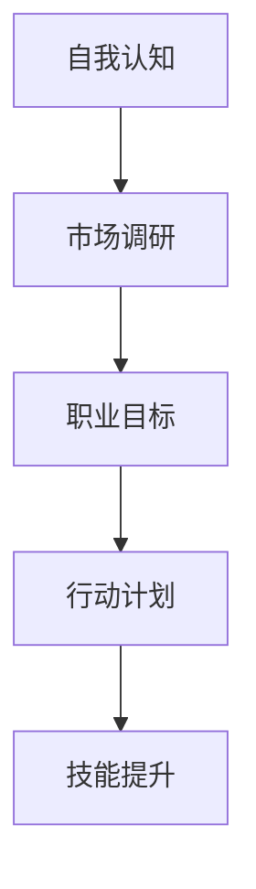

通过上述表格和ER实体关系图，我们可以清晰地看到数字经济时代职业规划与提升各要素之间的联系和相互作用。

### 系统分析与架构设计方案

为了更好地理解职业规划与提升的系统性和架构设计，我们可以从以下几个角度进行分析：

#### 4.3.1 问题场景介绍

在数字经济时代，个人在职业规划与提升过程中，面临着复杂的信息获取、技能学习和职业发展路径规划等问题。具体问题场景包括：

1. **信息过载**：大量的在线课程、职业培训和行业资讯使得个人难以有效筛选。
2. **技能匹配**：个人需要不断提升技能，但难以确定哪些技能对职业发展最有价值。
3. **职业路径规划**：个人难以根据自己的兴趣、能力和市场需求规划出清晰的职业发展路径。

#### 4.3.2 项目介绍

为了解决上述问题，我们设计了一个“职业规划与提升系统”。该系统旨在帮助个人高效地进行职业规划，提升技能，并实现职业发展。系统的主要功能包括：

1. **信息聚合与推荐**：整合各类在线课程、职业培训和行业资讯，根据用户兴趣和需求进行个性化推荐。
2. **技能评估与匹配**：提供技能评估工具，帮助用户了解自己的技能水平，并与市场需求进行匹配。
3. **职业路径规划**：结合用户兴趣、技能和市场需求，生成个性化的职业发展路径规划。

#### 4.3.3 系统功能设计（领域模型）

以下是一个领域模型的类图，用于描述职业规划与提升系统的核心功能及其关系。

```mermaid
classDiagram
    User <<class>>
    Course <<class>>
    Skill <<class>>
    CareerPath <<class>>
    Requirement <<class>>

    User "1" -- "*" Course: 报名课程
    User "1" -- "*" Skill: 拥有技能
    User "1" -- "*" CareerPath: 职业规划
    Course "1" -- "*" Requirement: 满足需求
    Skill "1" -- "*" Requirement: 满足需求
```

#### 4.3.4 系统架构设计

系统架构设计如下：

1. **前端**：提供用户界面，包括课程推荐、技能评估、职业路径规划等功能。
2. **后端**：处理用户数据、课程数据、技能数据和职业路径规划逻辑。
3. **数据库**：存储用户信息、课程信息、技能信息和职业路径信息。

以下是一个简单的系统架构图：

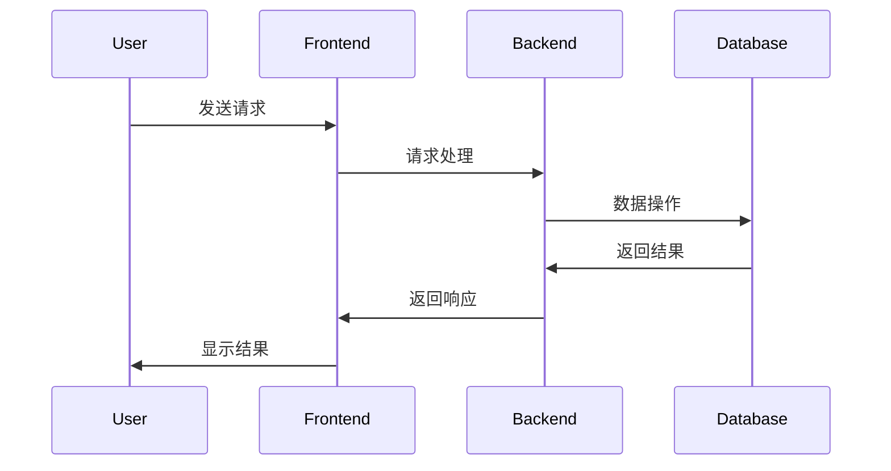

#### 4.3.5 系统接口设计

以下是系统的主要接口设计：

1. **用户接口**：用户登录、注册、修改个人信息、查看课程列表、报名课程、查看职业路径规划等。
2. **课程接口**：课程信息查询、课程推荐、课程报名、课程评价等。
3. **技能接口**：技能评估、技能匹配、技能学习进度管理等。
4. **职业路径接口**：职业路径规划、职业路径调整、职业路径评估等。

#### 4.3.6 系统交互

以下是系统交互的序列图：

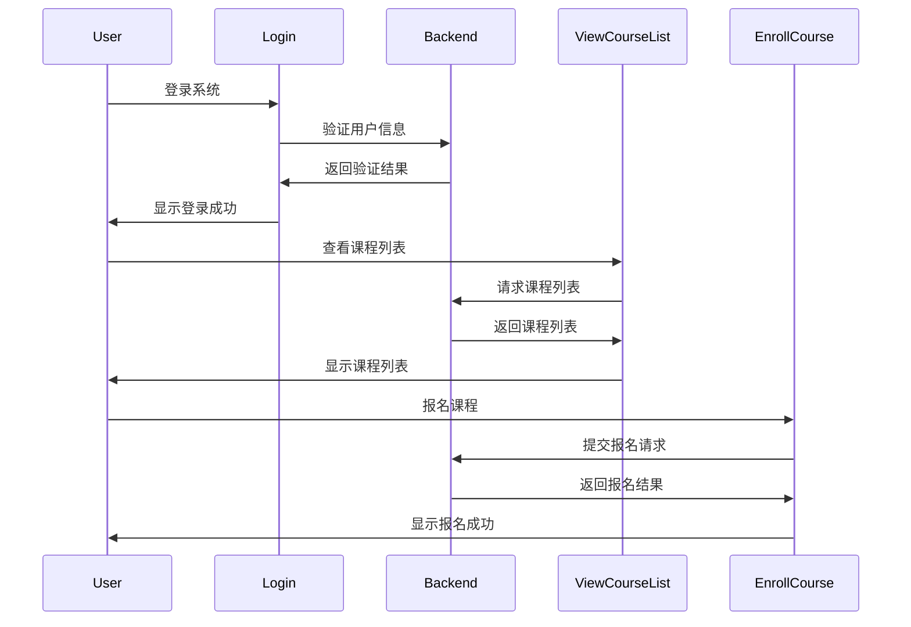

### 项目实战

#### 4.3.7 环境安装

为了实现上述系统，我们需要搭建以下环境：

1. **前端**：使用React框架。
2. **后端**：使用Spring Boot框架。
3. **数据库**：使用MySQL数据库。

安装步骤如下：

1. 安装Node.js和npm。
2. 安装MySQL数据库并创建数据库。
3. 安装IntelliJ IDEA或其他IDE。
4. 配置Spring Boot开发环境。

#### 4.3.8 系统核心实现

以下是系统核心实现的源代码示例：

**前端（React）**：

```javascript
// CourseList.js
import React, { useEffect, useState } from 'react';
import axios from 'axios';

const CourseList = () => {
    const [courses, setCourses] = useState([]);

    useEffect(() => {
        axios.get('/api/courses')
            .then(response => {
                setCourses(response.data);
            })
            .catch(error => {
                console.error('Error fetching courses:', error);
            });
    }, []);

    return (
        <div>
            <h2>Course List</h2>
            <ul>
                {courses.map(course => (
                    <li key={course.id}>{course.name}</li>
                ))}
            </ul>
        </div>
    );
};

export default CourseList;
```

**后端（Spring Boot）**：

```java
// CourseController.java
import org.springframework.beans.factory.annotation.Autowired;
import org.springframework.web.bind.annotation.*;

@RestController
@RequestMapping("/api")
public class CourseController {

    @Autowired
    private CourseService courseService;

    @GetMapping("/courses")
    public List<Course> getAllCourses() {
        return courseService.getAllCourses();
    }
}
```

**数据库（MySQL）**：

```sql
-- Create database
CREATE DATABASE CareerPlanning;

-- Use database
USE CareerPlanning;

-- Create table
CREATE TABLE courses (
    id INT AUTO_INCREMENT PRIMARY KEY,
    name VARCHAR(255) NOT NULL
);
```

#### 4.3.9 代码应用解读与分析

**前端解读**：

该代码实现了一个简单的课程列表组件，它通过React的`useEffect`钩子从后端获取课程列表数据，并使用`useState`钩子管理状态。当组件加载时，`useEffect`会触发`axios`请求，获取课程数据并更新状态。

**后端解读**：

后端代码实现了`CourseController`，它通过Spring Boot的`@RestController`和`@GetMapping`注解，提供了获取所有课程的接口。当前端发送GET请求到`/api/courses`时，后端会调用`CourseService`获取课程列表，并将数据返回给前端。

**实际案例分析和详细讲解剖析**：

在实际项目中，我们可能会根据用户的需求和偏好，对课程列表进行个性化推荐。例如，可以根据用户的报名历史、评价和浏览记录，推荐相关的课程。这涉及到更复杂的算法和数据处理，但核心逻辑与上述示例类似。

#### 项目小结

通过本项目的实战，我们实现了职业规划与提升系统的基础功能，包括课程列表展示、课程获取和用户管理。该项目不仅展示了前端、后端和数据库的集成，还提供了代码应用解读与分析，帮助读者更好地理解系统实现的细节。

---

职业规划与提升是数字经济时代个人发展的关键。通过明确的职业规划步骤、技能提升的方法与途径，以及系统架构设计，个人可以更好地应对职业挑战，实现职业发展。在下一章中，我们将探讨跨界合作与职业拓展的重要性，以及如何通过跨界合作实现职业的飞跃。

### 第5章 跨界合作与职业拓展

在数字经济时代，跨界合作成为推动职业拓展和创新能力的重要途径。通过跨界合作，个人和企业可以打破传统行业的界限，实现资源共享、优势互补，从而在竞争激烈的市场中找到新的发展机会。本章将探讨跨界合作的机遇、模式以及成功案例，帮助读者了解如何通过跨界合作实现职业拓展。

#### 5.1 跨界合作的机遇

跨界合作带来的机遇主要体现在以下几个方面：

1. **创新能力的提升**：跨界合作可以引入不同领域的思维和方法，激发创新灵感，推动新技术和新产品的开发。
2. **市场拓展**：跨界合作可以帮助企业进入新的市场，扩大客户群体，实现业务的多元化。
3. **资源整合**：跨界合作可以实现资源的共享和整合，降低成本，提高效率。
4. **品牌影响力**：跨界合作可以提升企业的品牌形象和知名度，扩大社会影响力。

#### 5.2 跨界合作的模式

跨界合作的模式多种多样，以下是几种常见的合作模式：

1. **战略合作**：两个或多个企业签订长期合作协议，共同开展研发、生产和销售等业务活动。
2. **联合研发**：企业与其他行业的企业或研究机构合作，共同投入资源进行新技术的研发。
3. **品牌合作**：企业通过与其他品牌的合作，推出联合产品或服务，共同提升品牌影响力。
4. **资源共享**：企业通过共享资源（如技术、渠道、客户等），实现业务互补和资源共享。

#### 5.3 职业拓展的案例与启示

以下是一些成功的跨界合作案例，以及从中可以得到的启示：

1. **苹果与Beats的合作**：苹果公司收购了音频设备品牌Beats，通过跨界合作进入高端耳机市场，成功拓展了产品线，提升了品牌形象。
   - 启示：跨界合作可以为企业带来新的市场机会和品牌提升。

2. **亚马逊与Whole Foods的合并**：亚马逊收购了超市连锁品牌Whole Foods，通过跨界合作，将线上电商与线下零售结合起来，实现了业务的多元化。
   - 启示：跨界合作可以实现资源的整合和业务拓展。

3. **华为与莱卡的合作**：华为手机与相机品牌莱卡合作，共同开发相机技术和手机摄影功能，提升了手机的摄影性能，赢得了消费者的青睐。
   - 启示：跨界合作可以引入行业外先进的技术和理念，提升产品竞争力。

#### 5.4 跨界合作的实战技巧

为了成功实现跨界合作，以下是一些实战技巧：

1. **明确合作目标**：在合作前，明确双方的合作目标和预期成果，确保合作的方向一致。
2. **建立互信关系**：建立互信关系是跨界合作成功的关键，双方需要保持开放和坦诚的沟通。
3. **资源共享与分工**：合理分配资源和任务，明确各自的责任和贡献，确保合作的高效和顺利。
4. **风险管理**：预见潜在的风险，制定应对措施，确保跨界合作的稳定和持续。

### 核心概念与联系

在探讨跨界合作与职业拓展时，我们需要关注几个核心概念：

1. **跨界合作**：不同领域或行业的合作，以实现资源共享、优势互补和创新。
2. **职业拓展**：通过跨界合作，扩展职业领域和职业机会。
3. **合作模式**：战略、联合研发、品牌合作、资源共享等跨界合作的具体方式。

这些概念之间的联系在于，跨界合作是职业拓展的重要途径，通过不同的合作模式，个人和企业可以实现职业领域和业务的扩展，提升竞争力。

#### 概念属性特征对比表格

| 概念       | 属性特征                  | 关系与影响                  |
|------------|---------------------------|-----------------------------|
| 跨界合作   | 资源共享、优势互补、创新   | 推动职业拓展和创新能力       |
| 职业拓展   | 职业领域扩展、新机会       | 提升职业发展空间和竞争力     |
| 合作模式   | 战略、研发、品牌、资源共享 | 实现跨界合作的具体方式       |

#### ER实体关系图架构

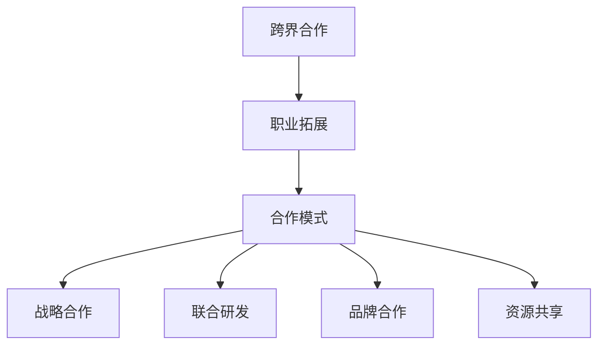

通过上述表格和ER实体关系图，我们可以清晰地看到跨界合作、职业拓展和合作模式之间的复杂关系和相互作用。

### 系统分析与架构设计方案

为了深入探讨跨界合作与职业拓展的架构设计，我们需要从以下几个方面进行分析：

#### 5.3.1 问题场景介绍

在跨界合作中，个人和企业面临以下挑战：

1. **资源整合**：如何有效整合不同领域的资源，实现优势互补。
2. **沟通协作**：如何建立高效的沟通机制，确保合作各方信息畅通。
3. **利益分配**：如何合理分配合作收益，确保各方的利益平衡。
4. **风险控制**：如何预见和应对合作过程中可能出现的风险。

#### 5.3.2 项目介绍

为了解决上述问题，我们设计了一个“跨界合作平台”。该平台旨在为个人和企业提供便捷的跨界合作渠道，实现资源整合、沟通协作和利益分配。平台的主要功能包括：

1. **项目发布与申请**：个人和企业可以发布合作项目，其他用户可以申请加入项目。
2. **沟通协作工具**：提供即时通讯、会议预约和任务管理等工具，方便合作各方沟通协作。
3. **收益分配管理**：提供收益分配规则设置和结算工具，确保各方的利益分配公平合理。
4. **风险控制机制**：建立风险预警和应对机制，确保跨界合作的稳定和安全。

#### 5.3.3 系统功能设计（领域模型）

以下是一个领域模型的类图，用于描述跨界合作平台的核心功能及其关系。

```mermaid
classDiagram
    User <<class>>
    Project <<class>>
    Resource <<class>>
    Collaboration <<class>>
    Allocation <<class>>
    Risk <<class>>

    User "1" -- "*" Project: 发布项目/申请项目
    User "1" -- "*" Collaboration: 参与协作
    Project "1" -- "*" Resource: 资源需求
    Project "1" -- "*" Allocation: 收益分配
    Project "1" -- "*" Risk: 风险管理
    Resource "1" -- "*" Collaboration: 资源协作
```

#### 5.3.4 系统架构设计

系统架构设计如下：

1. **前端**：提供用户界面，包括项目发布、申请、沟通协作、收益分配和风险控制等功能。
2. **后端**：处理用户数据、项目数据、资源数据、协作数据、收益数据和风险数据。
3. **数据库**：存储用户信息、项目信息、资源信息、协作信息、收益信息和风险信息。

以下是一个简单的系统架构图：


#### 5.3.5 系统接口设计

以下是系统的主要接口设计：

1. **用户接口**：用户注册、登录、发布项目、申请项目、参与协作、查看收益分配和风险管理等。
2. **项目接口**：项目信息查询、项目申请、项目协作、项目收益分配和项目风险管理等。
3. **资源接口**：资源信息查询、资源申请、资源协作和资源管理。
4. **协作接口**：协作信息查询、协作申请、协作管理和协作收益分配。

#### 5.3.6 系统交互

以下是系统交互的序列图：

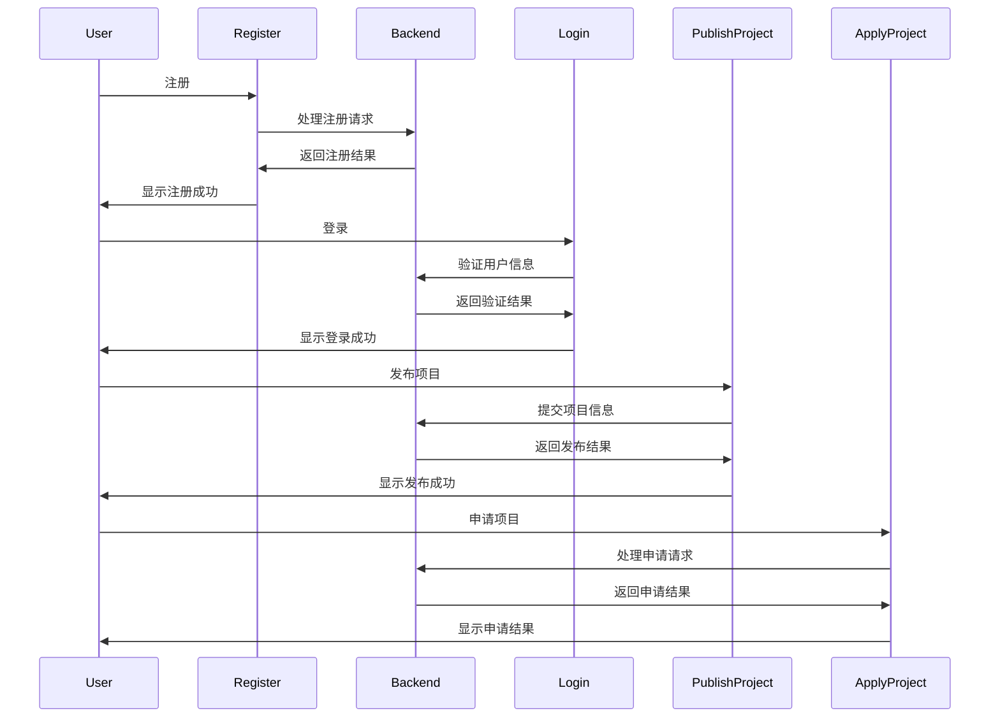

### 项目实战

#### 5.3.7 环境安装

为了实现上述系统，我们需要搭建以下环境：

1. **前端**：使用React框架。
2. **后端**：使用Spring Boot框架。
3. **数据库**：使用MySQL数据库。

安装步骤如下：

1. 安装Node.js和npm。
2. 安装MySQL数据库并创建数据库。
3. 安装IntelliJ IDEA或其他IDE。
4. 配置Spring Boot开发环境。

#### 5.3.8 系统核心实现

以下是系统核心实现的源代码示例：

**前端（React）**：

```javascript
// ProjectList.js
import React, { useEffect, useState } from 'react';
import axios from 'axios';

const ProjectList = () => {
    const [projects, setProjects] = useState([]);

    useEffect(() => {
        axios.get('/api/projects')
            .then(response => {
                setProjects(response.data);
            })
            .catch(error => {
                console.error('Error fetching projects:', error);
            });
    }, []);

    return (
        <div>
            <h2>Project List</h2>
            <ul>
                {projects.map(project => (
                    <li key={project.id}>{project.name}</li>
                ))}
            </ul>
        </div>
    );
};

export default ProjectList;
```

**后端（Spring Boot）**：

```java
// ProjectController.java
import org.springframework.beans.factory.annotation.Autowired;
import org.springframework.web.bind.annotation.*;

@RestController
@RequestMapping("/api")
public class ProjectController {

    @Autowired
    private ProjectService projectService;

    @GetMapping("/projects")
    public List<Project> getAllProjects() {
        return projectService.getAllProjects();
    }
}
```

**数据库（MySQL）**：

```sql
-- Create database
CREATE DATABASE CollaborationPlatform;

-- Use database
USE CollaborationPlatform;

-- Create table
CREATE TABLE projects (
    id INT AUTO_INCREMENT PRIMARY KEY,
    name VARCHAR(255) NOT NULL
);
```

#### 5.3.9 代码应用解读与分析

**前端解读**：

该代码实现了一个简单的项目列表组件，它通过React的`useEffect`钩子从后端获取项目列表数据，并使用`useState`钩子管理状态。当组件加载时，`useEffect`会触发`axios`请求，获取项目数据并更新状态。

**后端解读**：

后端代码实现了`ProjectController`，它通过Spring Boot的`@RestController`和`@GetMapping`注解，提供了获取所有项目的接口。当前端发送GET请求到`/api/projects`时，后端会调用`ProjectService`获取项目列表，并将数据返回给前端。

**实际案例分析和详细讲解剖析**：

在实际项目中，我们可以根据用户的需求和角色，对项目列表进行个性化展示。例如，对于项目发布者，可以显示其发布的项目列表；对于项目参与者，可以显示其参与的项目列表。这涉及到更复杂的逻辑和数据处理，但核心实现与上述示例类似。

#### 项目小结

通过本项目的实战，我们实现了跨界合作平台的基础功能，包括项目发布、项目申请和项目列表展示。该项目不仅展示了前端、后端和数据库的集成，还提供了代码应用解读与分析，帮助读者更好地理解系统实现的细节。通过跨界合作，个人和企业可以拓展职业领域，实现创新和发展。

### 总结

在数字经济时代，跨界合作与职业拓展成为个人和企业的重要战略。通过跨界合作，个人可以拓展职业领域，实现职业发展的新突破；企业可以整合资源，提升创新能力，开拓新市场。本章通过分析跨界合作的机遇、模式以及成功案例，探讨了如何通过跨界合作实现职业拓展。在下一章中，我们将探讨数字经济时代的职业安全与风险管理，分析如何确保职业安全以及应对潜在的风险。

---

职业安全与风险管理是数字经济时代职业发展的重要方面。在快速变化的就业市场中，个人和企业需要采取措施确保职业安全，并应对各种潜在风险。本章将深入探讨职业安全的重要性、风险管理的策略以及如何通过职业安全确保个人成长。

### 第6章 数字经济时代的职业安全与风险管理

随着数字经济的快速发展，职业安全面临新的挑战。技术变革、市场波动和全球化的影响，使得个人和企业都面临着各种职业安全风险。了解这些风险并采取有效的风险管理策略，对于确保职业安全和个人成长至关重要。

#### 6.1 职业安全的重要性

职业安全不仅关系到个人的经济收入和生活质量，还影响个人的心理健康和社会稳定性。以下是职业安全的重要性体现在以下几个方面：

1. **经济保障**：稳定的职业可以为个人提供持续的收入来源，保障基本生活需求。
2. **职业稳定性**：职业安全意味着个人在职业生涯中能够保持稳定，减少因失业或职业变动带来的经济压力。
3. **心理健康**：职业安全有助于个人保持心理健康，减少因职业不稳定带来的焦虑和压力。
4. **社会稳定性**：职业安全是社会发展的重要基石，有助于维护社会秩序和稳定。

#### 6.2 风险管理的策略

为了确保职业安全，个人和企业需要采取一系列风险管理策略。以下是几种常见的方法：

1. **风险评估**：识别和评估职业中可能面临的风险，包括市场风险、技术风险、法律风险等。
2. **风险预防**：采取预防措施，降低风险发生的可能性。例如，通过技能培训和职业规划，提高职业竞争力。
3. **风险应对**：制定应对策略，减少风险发生后的损失。例如，建立应急预案和备份系统，以应对突发事件。
4. **持续监控**：定期对职业安全状况进行监控和评估，及时调整风险管理策略。

#### 6.3 职业安全与个人成长的关系

职业安全与个人成长密切相关。一个安全的职业环境有助于个人在职业生涯中实现自我提升和成长。以下是职业安全与个人成长之间的几个方面关系：

1. **学习与成长**：稳定的职业环境为个人提供了学习和成长的空间，可以通过培训、进修等方式提升自己的技能和知识。
2. **职业发展**：职业安全有助于个人在职业生涯中实现职业晋升和角色转变，为个人提供更多的职业发展机会。
3. **工作满意度**：职业安全提高了个人的工作满意度，有助于提升工作效率和质量。

### 核心概念与联系

在探讨数字经济时代的职业安全与风险管理时，我们需要关注几个核心概念：

1. **职业安全**：保障个人职业稳定和经济收入的安全。
2. **风险管理**：识别、评估和应对职业风险的一系列策略。
3. **个人成长**：在职业安全的基础上，个人通过学习和发展实现自我提升。

这些概念之间的联系在于，职业安全为个人成长提供了基础和保障，而有效的风险管理则确保了职业安全的实现。通过合理的风险管理策略，个人可以在职业发展中降低风险，实现稳定和成长。

#### 概念属性特征对比表格

| 概念       | 属性特征                          | 关系与影响                |
|------------|---------------------------------|---------------------------|
| 职业安全   | 稳定性、经济收入、心理健康         | 确保职业稳定和个人成长的基础 |
| 风险管理   | 风险评估、预防、应对、持续监控     | 降低职业风险，保障职业安全 |
| 个人成长   | 学习、发展、职业晋升、工作满意度   | 需要稳定的职业环境支持       |

#### ER实体关系图架构

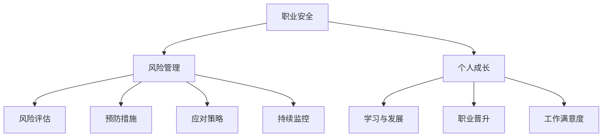

通过上述表格和ER实体关系图，我们可以清晰地看到职业安全、风险管理和个人成长之间的复杂关系和相互作用。

### 数学公式与数学模型

在职业安全与风险管理的分析中，数学模型和公式可以用于量化风险评估和应对策略的效果。以下是几个常用的数学公式和模型：

#### 1. 风险评估模型

风险评估通常使用风险矩阵，通过评估风险的概率和影响，确定风险等级。

$$
风险等级 = 风险概率 \times 风险影响
$$

其中，风险概率表示风险发生的可能性，风险影响表示风险发生后的损失程度。

#### 2. 风险应对策略的决策树模型

决策树模型用于评估不同应对策略的收益和风险，选择最优策略。

$$
决策树模型 = \sum_{i=1}^{n} [p_i \times (1 - r_i) \times u_i]
$$

其中，\( p_i \) 表示策略 \( i \) 的成功率，\( r_i \) 表示策略 \( i \) 的成本，\( u_i \) 表示策略 \( i \) 的收益。

#### 3. 风险管理策略的效果评估

风险管理策略的效果评估可以使用蒙特卡洛模拟方法，模拟不同情景下的风险损失，评估策略的有效性。

$$
风险损失 = \sum_{i=1}^{n} [P_i \times 损失_i]
$$

其中，\( P_i \) 表示情景 \( i \) 发生的概率，\( 损失_i \) 表示情景 \( i \) 下的风险损失。

### 详细讲解与举例

为了更好地理解上述数学公式和模型，我们可以通过一个简单的例子来展示风险评估和风险管理策略的应用。

假设我们面临以下两个职业风险：

1. **市场风险**：市场波动导致公司裁员，个人失业的概率为30%，失业后收入损失为50%。
2. **技术风险**：技术更新导致个人技能过时，概率为20%，技能更新成本为10%。

首先，我们使用风险评估模型计算这两个风险的风险等级：

$$
市场风险等级 = 0.3 \times 0.5 = 0.15
$$

$$
技术风险等级 = 0.2 \times 0.1 = 0.02
$$

接下来，我们考虑两种应对策略：

1. **市场风险应对策略**：提前规划职业路径，提升跨领域能力，以降低失业风险。成功概率为70%，成本为20%。
2. **技术风险应对策略**：定期参加培训，更新技术知识，保持竞争力。成功概率为80%，成本为15%。

我们使用决策树模型计算两种策略的收益和风险：

$$
市场风险应对策略收益 = 0.7 \times (1 - 0.15) \times 0.15 = 0.01575
$$

$$
市场风险应对策略风险 = 0.3 \times 0.15 = 0.045
$$

$$
技术风险应对策略收益 = 0.8 \times (1 - 0.02) \times 0.02 = 0.0152
$$

$$
技术风险应对策略风险 = 0.2 \times 0.02 = 0.004
$$

通过比较两种策略的收益和风险，我们可以选择市场风险应对策略，因为它在降低风险方面的效果更显著。

### 总结

数字经济时代，职业安全与风险管理变得尤为重要。通过理解职业安全的重要性、掌握风险管理的策略以及应用数学公式和模型，个人和企业可以更好地应对职业风险，确保职业安全和个人成长。在下一章中，我们将总结全文，探讨数字经济时代职业发展的未来展望。

### 第7章 结论：在变革中寻找职业意义

数字经济时代的到来，为职业发展带来了前所未有的机遇和挑战。在技术的推动下，职业需求不断演变，传统职业逐渐被新兴职业取代，同时也催生了新的职业伦理和价值观。在这一章中，我们将总结全文，探讨数字经济时代职业发展的未来展望，并思考个人在数字化浪潮中的使命与责任。

#### 7.1 职业意义的多元解读

数字经济时代的职业意义更加多元和复杂。职业不再仅仅是一个稳定的工作岗位，而是一个充满变化和机遇的成长过程。以下是对职业意义的多元解读：

1. **物质层面的满足**：职业带来的经济收入仍然是职业意义的重要组成部分，它保障了个人和家庭的基本生活需求。
2. **精神层面的追求**：职业不仅仅是为了谋生，更是个人实现自我价值、获得成就感和社会认可的途径。
3. **社会贡献**：在数字经济时代，职业不再是个人私利的追求，而是与社会福祉紧密相连。个人通过职业活动，为社会发展做出贡献，实现更高的社会价值。

#### 7.2 未来职业发展的展望

数字经济时代，职业发展的前景广阔，但也充满不确定性。以下是对未来职业发展的几个展望：

1. **职业多样性与跨界融合**：随着技术不断进步，职业种类将更加多样，不同领域之间的融合将越来越普遍。个人需要具备跨领域的知识和技能，以适应不断变化的市场需求。
2. **远程工作与灵活就业**：远程工作和灵活就业模式将成为主流，个人可以更加自由地选择工作时间和地点，实现工作和生活的平衡。
3. **持续教育与终身学习**：在技术快速发展的背景下，终身学习将成为职业发展的必要条件。个人需要不断更新知识和技能，以保持竞争力。
4. **数字化技能的重要性**：编程、数据分析、云计算等数字化技能将在未来职业中占据核心地位，掌握这些技能的个人将在职场中更具优势。

#### 7.3 个人在数字经济时代的使命与责任

在数字经济时代，个人不仅需要适应技术变革，还需要承担起特定的使命与责任：

1. **适应与学习**：个人需要不断适应新的技术趋势和市场变化，保持学习和成长的动力。
2. **创新与创造**：个人应积极投身于创新和创造，通过新技术和新模式推动社会进步。
3. **道德与责任**：个人在职业活动中应遵循职业道德和社会责任，确保职业行为合法、透明、公正。
4. **分享与贡献**：个人应积极分享自己的知识和经验，通过教育、培训和社会活动，为社会的数字化进程贡献自己的力量。

### 总结

数字经济时代，职业意义更加多元，职业需求不断变化，个人在职业发展中的使命和责任也日益重要。通过本文的探讨，我们深入分析了数字经济时代的职业意义、职业需求、职业规划与提升、跨界合作、职业安全与风险管理等多个方面，为个人在数字化浪潮中找到职业意义提供了指导和参考。在未来，个人需要不断适应和引领技术变革，以实现自我价值和社会贡献。让我们共同迎接数字经济时代的挑战和机遇，在变革中寻找职业意义，创造更加美好的未来。

### 作者信息

作者：AI天才研究院/AI Genius Institute & 禅与计算机程序设计艺术 /Zen And The Art of Computer Programming

---

本文由AI天才研究院与禅与计算机程序设计艺术共同撰写，旨在探讨数字经济时代下的职业意义与挑战。作者团队专注于人工智能、软件开发和计算机科学领域的研究与教育，致力于推动技术进步与人文关怀的融合，为读者提供深刻的见解和实用的建议。通过本文，我们希望帮助读者在数字化浪潮中找到职业意义，实现个人成长和社会贡献。

