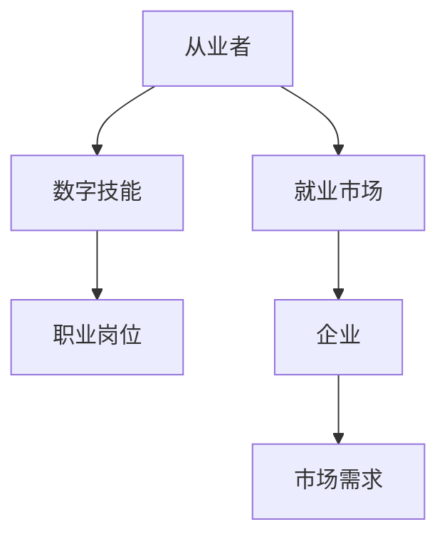
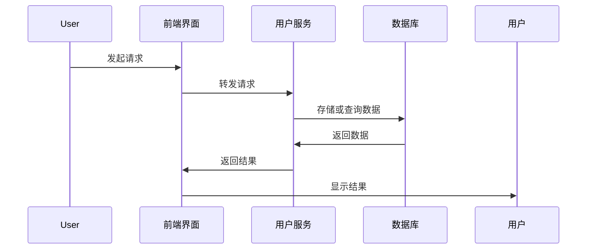
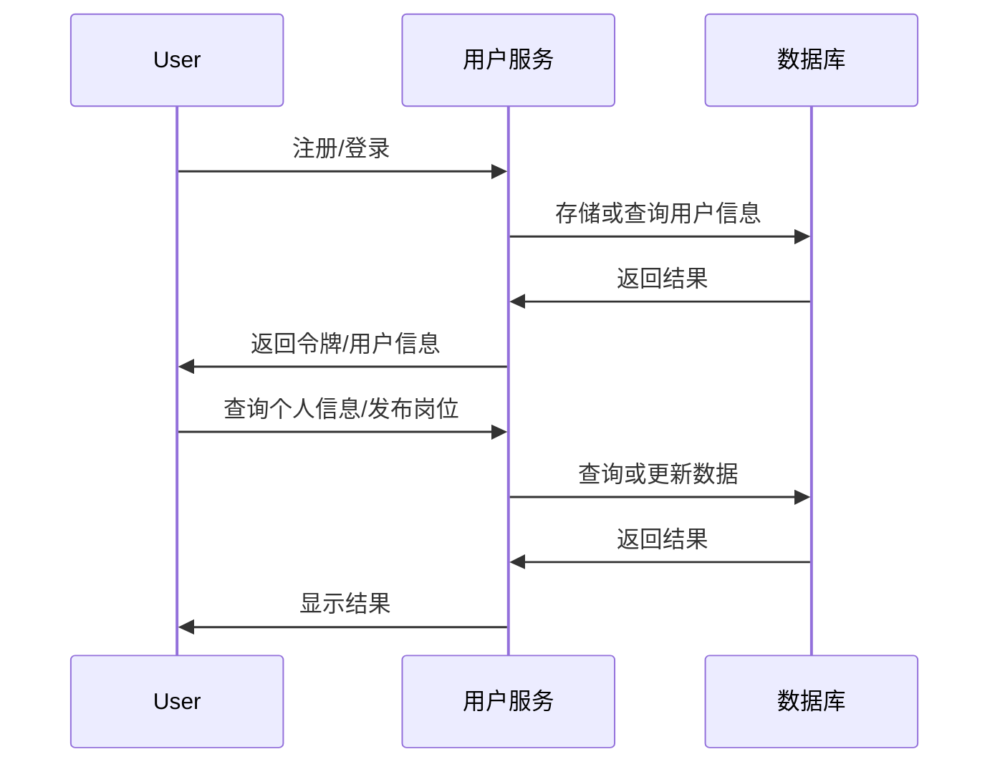

                 

### 文章标题

在数字经济时代，科技迅猛发展，全球范围内的经济形态发生了深刻变革。数字经济已成为推动全球经济增长的重要引擎，它不仅重新定义了生产、分配和消费的方式，同时也对就业市场产生了深远的影响。面对这种变革，如何在新的就业市场中找到职业意义，成为了广大从业者和学者关注的焦点。本文将以逻辑清晰、结构紧凑、简单易懂的专业的技术语言，深入探讨数字经济时代职业发展的核心问题，帮助读者理解职业发展的新趋势，并提供应对就业市场变革的策略。

关键词：数字经济、职业发展、就业市场、职业意义、变革应对

摘要：本文首先介绍了数字经济的崛起及其对传统就业市场的影响，随后深入分析了数字经济时代职业发展的新特征和新挑战。通过构建核心概念框架和实体关系图，本文阐述了数字技能需求、跨界合作与创新能力、数据隐私与伦理问题等关键概念的联系。接下来，本文详细讲解了人才匹配算法原理和具体实现，包括算法流程图、Python源代码及数学模型。最后，本文总结了数字经济时代职业发展的主要趋势，并提出了应对就业市场变革的策略，以帮助读者在新时代找到职业意义。

### 目录大纲

1. **背景介绍**
    1.1 **问题背景**
        1.1.1 **数字经济的崛起**
        1.1.2 **传统就业市场的变革**
        1.1.3 **职业发展的不确定性**
    1.2 **问题解决**
        1.2.1 **如何理解数字经济时代的职业发展**
        1.2.2 **应对就业市场变革的策略**
        1.2.3 **实现职业意义的途径**
    1.3 **边界与外延**
        1.3.1 **职业意义的界定**
        1.3.2 **数字经济时代职业发展的特殊性**
        1.3.3 **职业规划的重要性**
    1.4 **概念结构与核心要素组成**
        1.4.1 **数字经济**
        1.4.2 **数字经济时代的就业市场**
        1.4.3 **职业发展的动力因素**
    1.5 **本章小结**

2. **核心概念与联系**
    2.1 **数字经济时代的职业发展原理**
        2.1.1 **数字经济时代的职业特征**
            2.1.1.1 **数字技能需求**
            2.1.1.2 **跨界合作与创新能力**
            2.1.1.3 **数据隐私与伦理问题**
        2.1.2 **职业发展属性特征对比表格**
            2.1.2.1 **传统职业与现代职业对比**
            2.1.2.2 **职业发展的机遇与挑战**
            2.1.2.3 **职业技能需求的演变趋势**
        2.1.3 **ER实体关系图架构**
            2.1.3.1 **数字经济时代职业发展的实体关系**
            2.1.3.2 **职业发展的动力与制约因素**
        2.1.4 **职业发展中的关键概念联系**
            2.1.4.1 **数字技能与职业发展**
            2.1.4.2 **跨界合作与创新能力**
            2.1.4.3 **数据隐私与伦理问题在职业发展中的应用**
    2.2 **本章小结**

3. **算法原理讲解**
    3.1 **数字经济时代的算法原理**
        3.1.1 **算法在职业发展中的应用**
            3.1.1.1 **人才匹配算法**
            3.1.1.2 **能力评估算法**
            3.1.1.3 **职业规划算法**
        3.1.2 **Mermaid算法流程图**
        3.1.3 **Python源代码详解**
        3.1.4 **算法原理详细讲解**
            3.4.1 **人才匹配算法的数学模型**
            3.4.2 **算法流程**
            3.4.3 **举例说明**
    3.2 **本章小结**

4. **系统分析与架构设计**
    4.1 **问题场景介绍**
    4.2 **项目介绍**
    4.3 **系统功能设计（领域模型Mermaid类图）**
    4.4 **系统架构设计（Mermaid架构图）**
    4.5 **系统接口设计**
    4.6 **系统交互（Mermaid序列图）**
    4.7 **本章小结**

5. **项目实战**
    5.1 **环境安装**
    5.2 **系统核心实现**
    5.3 **代码应用解读与分析**
    5.4 **实际案例分析和详细讲解**
    5.5 **项目小结**

6. **最佳实践 Tips**
    6.1 **技术策略**
    6.2 **方法技巧**
    6.3 **注意事项**
    6.4 **拓展阅读**

7. **小结**
8. **注意事项**
9. **拓展阅读**

### 1.1 问题背景

1.1.1 **数字经济的崛起**

数字经济是继农业经济、工业经济之后的一种新型经济形态，以数字化的知识和信息作为关键生产要素，以现代信息网络作为重要载体，通过信息通信技术的广泛应用推动经济活动向数字化、网络化、智能化方向快速发展。其核心特征在于数据的高度流通和利用，信息技术的深度嵌入和集成，以及新兴产业的快速崛起。

随着互联网、云计算、大数据、人工智能等技术的不断创新和突破，数字经济在全球范围内迅速崛起，并对传统产业和社会治理模式产生了深远影响。根据国际数据公司（IDC）的预测，到2025年，全球数字经济规模将突破 trillion 美元，占全球GDP的比重将达到50%以上。数字经济不仅推动了生产力的提升，也带来了就业市场的深刻变革。

1.1.2 **传统就业市场的变革**

传统就业市场的变革是数字经济崛起的一个重要体现。首先，传统行业面临数字化转型，对从业者的技能要求发生了重大变化。许多传统职业正逐渐被自动化和人工智能技术所取代，这要求从业者必须具备数字技能，如数据分析、编程、人工智能等，才能适应新的职业需求。

其次，就业市场的边界变得模糊。随着互联网技术的发展，远程办公、灵活就业、兼职就业等新兴就业形式不断涌现，使得就业市场呈现出高度分散化和个性化的特点。人们可以在全球范围内寻找工作机会，不再受限于地理位置。

此外，职业发展的路径也在发生改变。在数字经济时代，跨界合作和创新成为推动职业发展的关键因素。许多职业不再局限于单一领域，而是需要跨学科、跨行业的知识和能力。这种跨界合作不仅提高了职业的多样性，也为从业者提供了更广阔的发展空间。

1.1.3 **职业发展的不确定性**

数字经济时代的职业发展充满了不确定性。一方面，新兴产业的快速崛起带来了前所未有的机遇，但同时也伴随着高风险和高不确定性。从业者需要不断学习新知识、新技能，以适应快速变化的市场需求。

另一方面，职业的短期化和不确定性也在增加。许多职业的寿命缩短，从业者需要不断转型和调整职业方向，以应对市场的变化。这种不确定性要求从业者具备较强的适应能力和创新精神，能够灵活应对各种挑战。

总之，数字经济时代的崛起给传统就业市场带来了深刻的变革，职业发展面临着新的机遇和挑战。如何在数字经济时代找到职业意义，应对就业市场的变革，成为广大从业者必须面对的问题。

### 1.2 问题解决

1.2.1 **如何理解数字经济时代的职业发展**

在数字经济时代，职业发展呈现出一系列新的特征，这些特征不仅反映了技术进步对就业市场的影响，也揭示了未来职业发展的方向。首先，数字技能成为职业发展的核心要素。随着信息技术的发展，数据、算法、编程等数字技能的需求日益增长。掌握这些技能不仅能够提高个人的竞争力，还能够开拓新的职业机会。

其次，跨界合作和创新成为职业发展的驱动力。在数字经济时代，各行业之间的界限变得模糊，跨学科、跨行业的合作日益普遍。从业者需要具备跨领域的知识和能力，才能在竞争中脱颖而出。此外，创新精神成为职业发展的关键因素。在快速变化的市场环境中，只有具备创新能力和不断探索新领域的精神，才能持续推动职业发展。

最后，数据隐私与伦理问题也日益突出。随着数据在经济活动中的作用越来越重要，数据隐私保护和伦理问题成为职业发展中的重要挑战。从业者需要了解相关的法律法规，掌握数据保护技术和伦理原则，以保障数据的安全和合法性。

1.2.2 **应对就业市场变革的策略**

为了应对数字经济时代就业市场的变革，从业者可以采取以下策略：

第一，持续学习和技能提升。在数字经济时代，知识和技能的更新速度加快，从业者需要保持持续学习的态度，不断提升自己的技能水平。可以通过参加在线课程、学习新技术、阅读相关书籍等方式，不断充实自己的知识体系。

第二，增强适应能力和灵活性。面对不确定的就业市场，从业者需要具备较强的适应能力和灵活性，能够快速调整自己的职业方向和技能结构。可以通过多尝试不同的工作类型和岗位，积累多样化的工作经验。

第三，注重跨界合作和创新。在数字经济时代，跨界合作和创新是推动职业发展的关键。从业者可以积极参与跨学科、跨行业的项目，通过合作和创新，提升自身的竞争力。

第四，关注数据隐私与伦理问题。在数字经济时代，数据隐私保护和伦理问题日益重要。从业者需要了解相关的法律法规，掌握数据保护技术和伦理原则，确保自己在职业生涯中遵守法律和道德规范。

1.2.3 **实现职业意义的途径**

在数字经济时代，实现职业意义不仅需要具备相应的技能和知识，还需要从更深层次上思考职业的价值和意义。以下是一些实现职业意义的途径：

第一，找到自己的兴趣所在。兴趣是推动职业发展的动力源泉。从业者可以探索自己的兴趣领域，找到自己热爱的工作，从而提高工作满意度和职业成就感。

第二，明确自己的职业目标。在职业发展的过程中，明确目标是非常重要的。从业者可以设定短期和长期的目标，制定详细的行动计划，从而实现职业发展的愿景。

第三，注重个人成长和价值体现。职业发展不仅仅是追求物质回报，更是个人成长和价值体现的过程。从业者可以通过不断学习和实践，提升自己的能力和素质，实现个人价值。

第四，积极参与社会公益活动。在职业发展的过程中，可以积极参与社会公益活动，为社会做出贡献。通过这种方式，不仅能够提升自己的社会责任感，还能够增强职业的意义感。

总之，在数字经济时代，职业发展面临着前所未有的机遇和挑战。通过理解职业发展的新特征，采取有效的应对策略，从业者可以在新时代找到职业的意义，实现自身的职业目标。

### 1.3 边界与外延

1.3.1 **职业意义的界定**

职业意义是指个体在职业活动中所感受到的价值和目的，它不仅仅体现在物质回报上，更体现在个体对社会和自我价值的认同上。职业意义不仅关乎个人的生活质量和幸福感，也关乎社会的和谐与进步。在数字经济时代，职业意义的界定更加复杂和多元。一方面，随着科技的进步和产业结构的调整，职业的意义不仅仅是传统的就业和收入，还包括创新、创业、自我实现等多方面的价值。另一方面，随着人们对工作与生活平衡的追求，职业意义的界定也越来越多地考虑个体的心理健康和生活质量。

1.3.2 **数字经济时代职业发展的特殊性**

数字经济时代职业发展的特殊性主要体现在以下几个方面：

首先，数字技能成为职业发展的核心要素。在数字经济时代，数据、算法、编程等数字技能的需求大幅增加，这些技能不仅提高了从业者的工作效率，也决定了他们在职业市场中的竞争力。

其次，跨界合作和创新成为职业发展的驱动力。数字经济时代，各行业之间的界限变得模糊，跨界合作和创新成为推动职业发展的关键。从业者需要具备跨领域的知识和能力，以应对复杂多变的市场环境。

再次，职业发展的路径更加多样化。在数字经济时代，人们可以通过在线学习、远程办公等方式，打破地理和时间的限制，选择更加灵活和个性化的职业发展路径。

最后，数据隐私与伦理问题日益突出。随着数据在经济活动中的作用日益重要，数据隐私保护和伦理问题成为职业发展中必须面对的挑战。从业者需要具备相关的法律法规知识和伦理素养，确保数据的安全和合法性。

1.3.3 **职业规划的重要性**

在数字经济时代，职业规划的重要性不言而喻。有效的职业规划不仅可以帮助从业者明确自己的职业目标和发展路径，还可以提高职业发展的效率和成功率。以下是一些职业规划的重要方面：

首先，自我认知。从业者需要了解自己的兴趣、优势和价值观，从而选择适合自己的职业方向。

其次，市场分析。从业者需要了解当前和未来的就业市场趋势，掌握不同行业和岗位的需求和前景。

再次，制定职业目标。从业者可以根据自我认知和市场分析的结果，设定短期和长期的职业目标，并制定相应的行动计划。

最后，持续学习和适应。职业规划不是一成不变的，从业者需要根据职业发展的实际情况，不断调整和更新职业规划，以适应不断变化的市场环境。

总之，在数字经济时代，职业规划的重要性体现在帮助从业者更好地理解职业发展的新趋势，找到适合自己的职业方向，并实现职业意义。有效的职业规划不仅有助于个人的职业发展，也有助于推动整个社会的进步和繁荣。

### 1.4 概念结构与核心要素组成

1.4.1 **数字经济**

数字经济是指以数字化的知识和信息为关键生产要素，以现代信息网络为重要载体，通过信息通信技术的广泛应用推动经济活动向数字化、网络化、智能化方向发展的经济形态。数字经济的核心特征包括数据的高度流通和利用，信息技术的深度嵌入和集成，以及新兴产业的快速崛起。数字经济不仅改变了传统的生产、分配和消费模式，也对就业市场和社会治理产生了深远影响。

1.4.2 **数字经济时代的就业市场**

数字经济时代的就业市场具有以下特点：

- **技能需求多样化**：随着数字化技术的发展，对数据分析师、程序员、人工智能工程师等数字技能的需求大幅增加。
- **就业形式多样化**：远程办公、兼职就业、灵活就业等新型就业形式不断涌现，使得就业市场更加分散化和个性化。
- **跨界合作频繁**：各行业之间的界限变得模糊，跨界合作和创新成为推动职业发展的关键因素。
- **职业路径多样化**：从业者在职业发展过程中可以选择多种路径，如在线学习、远程工作等，打破了传统职业发展的时间和空间限制。

1.4.3 **职业发展的动力因素**

职业发展的动力因素主要包括以下几个方面：

- **技术创新**：新技术的不断涌现和应用，如人工智能、大数据、区块链等，推动了职业发展的新需求。
- **市场需求**：市场对各种数字技能的需求，是推动从业者不断提升技能和实现职业发展的直接动力。
- **政策支持**：政府对数字经济和科技创新的支持政策，为从业者提供了良好的发展环境和机遇。
- **个人素质**：从业者的教育背景、专业技能、适应能力、创新精神等，都是影响职业发展的关键因素。

通过以上对概念结构与核心要素组成的阐述，我们可以更深入地理解数字经济时代职业发展的本质和特点，从而为从业者提供更具有针对性和实用性的指导。

### 1.5 本章小结

本章从背景介绍入手，详细探讨了数字经济崛起对传统就业市场的影响，以及职业发展的不确定性。首先，我们介绍了数字经济的定义和核心特征，分析了其在全球范围内迅速崛起的趋势。接着，我们深入探讨了传统就业市场变革的表现，包括技能需求的转变、就业形式的多样化和跨界合作的频繁。在此基础上，我们提出了应对就业市场变革的策略，包括持续学习和技能提升、增强适应能力和灵活性、注重跨界合作和创新、关注数据隐私与伦理问题。此外，我们还探讨了职业意义的界定和数字经济时代职业发展的特殊性，并强调了职业规划的重要性。通过这些分析，我们为读者提供了一个全面、深入的理解框架，帮助他们更好地应对数字经济时代的职业挑战，找到职业发展的新方向。

## 第二部分：核心概念与联系

### 2.1 数字经济时代的职业发展原理

在数字经济时代，职业发展不仅依赖于传统的教育和培训，更依赖于对数字技能的掌握和运用。以下是对数字经济时代职业发展原理的详细分析。

2.1.1 **数字经济时代的职业特征**

数字经济时代的职业特征主要体现在以下几个方面：

**数字技能需求**：随着信息技术的快速发展，数字技能已成为现代职业发展的核心要素。数据分析师、程序员、人工智能工程师等职业对数字技能的需求日益增加。这些技能不仅包括编程语言、数据分析工具的使用，还包括对大数据、云计算、区块链等新兴技术的理解和应用。

**跨界合作与创新能力**：数字经济时代，各行业之间的界限变得模糊，跨界合作和创新成为职业发展的关键驱动力。从业者需要具备跨领域的知识和能力，能够在不同行业之间实现知识融合和创新。这种跨界合作不仅提升了职业的多样性，也为从业者提供了更广阔的发展空间。

**数据隐私与伦理问题**：在数字经济时代，数据是重要的生产要素，但同时也带来了数据隐私和伦理问题。从业者在处理数据时，需要遵守相关的法律法规和伦理规范，确保数据的安全和合法使用。这不仅是对从业者的要求，也是职业发展中的一个重要方面。

2.1.2 **职业发展属性特征对比表格**

以下是一个对比表格，展示了传统职业与现代职业在数字经济时代的属性特征对比：

| 特征对比项 | 传统职业 | 现代职业（数字经济时代） |
| :--- | :--- | :--- |
| 技能需求 | 侧重经验积累 | 侧重数字技能和创新能力 |
| 就业形式 | 较为固定和单一 | 多样化，包括远程办公、兼职就业等 |
| 跨界合作 | 较少 | 较频繁，促进创新和职业发展 |
| 数据处理 | 依赖人工 | 高度依赖数字化工具和技术 |
| 职业路径 | 较为单一 | 多样化，根据市场需求和个人兴趣进行选择 |
| 数据隐私和伦理问题 | 不突出 | 成为重要考虑因素，影响职业发展 |

2.1.3 **职业技能需求的演变趋势**

随着数字经济的发展，职业技能需求也在不断演变。以下是一些主要的趋势：

**技能要求的升级**：随着新技术的不断涌现，如人工智能、大数据、物联网等，职业技能要求不断提高。从业者需要不断学习和更新知识，以适应新技术带来的变化。

**交叉学科知识的融合**：数字经济时代，各行业之间的融合日益加强，从业者需要具备跨学科的知识和技能。例如，数据分析师不仅需要掌握数据分析工具，还需要了解业务领域知识，以更好地解决实际问题。

**持续学习的重要性**：在数字经济时代，知识和技能的更新速度加快，从业者需要具备持续学习的能力，以保持竞争力和适应市场需求。

**创新能力的提升**：随着跨界合作的增多，创新成为职业发展的重要驱动力。从业者需要具备创新思维和创新能力，能够在不同领域实现创新和突破。

2.1.4 **ER实体关系图架构**

以下是一个简单的ER实体关系图，展示了数字经济时代职业发展的主要实体及其关系：



在这个ER图中，从业者、数字技能、就业市场、职业岗位、企业和市场需求是主要的实体。它们之间的关系反映了数字经济时代职业发展的复杂性。

- **从业者**：指从事职业活动的人，需要具备数字技能以适应市场需求。
- **数字技能**：指从业者所掌握的与数字经济相关的技能，如编程、数据分析等。
- **就业市场**：指职业活动的场所，包括各种职业岗位和企业。
- **职业岗位**：指就业市场中的具体职位，与从业者的技能和市场需求密切相关。
- **企业**：指提供职业岗位和满足市场需求的经济实体。
- **市场需求**：指企业对各种职业岗位的需求，影响从业者的就业选择和职业发展。

通过上述分析和ER实体关系图的展示，我们可以更清晰地理解数字经济时代职业发展的原理和特征，为职业规划和发展提供科学依据。

### 2.2 本章小结

本章深入分析了数字经济时代的职业发展原理，包括职业特征、职业技能需求演变趋势、对比表格和ER实体关系图。首先，我们介绍了数字经济时代职业发展的核心特征，如数字技能需求、跨界合作与创新能力、数据隐私与伦理问题。接着，通过对比表格，我们展示了传统职业与现代职业在数字经济时代的主要差异。随后，我们探讨了职业技能需求的演变趋势，包括技能要求的升级、交叉学科知识的融合、持续学习的重要性以及创新能力的提升。最后，通过ER实体关系图，我们展示了数字经济时代职业发展的主要实体及其相互关系。通过这些分析，我们为读者提供了一个全面、系统的理解框架，帮助他们在数字经济时代找到职业发展的新方向和策略。

## 第三部分：算法原理讲解

### 3.1 数字经济时代的算法原理

在数字经济时代，算法在职业发展中扮演着至关重要的角色。算法不仅用于数据处理和分析，还在人才匹配、能力评估和职业规划等方面发挥着重要作用。以下将详细讲解数字经济时代算法在职业发展中的应用原理。

3.1.1 **算法在职业发展中的应用**

**人才匹配算法**：人才匹配算法主要用于帮助企业和求职者找到最佳匹配。通过分析求职者的技能、经验和职业目标，与企业的岗位需求进行匹配，从而提高招聘效率和成功率。人才匹配算法通常涉及数据预处理、特征提取和模型训练等步骤。

**能力评估算法**：能力评估算法用于对求职者的能力进行量化评估，从而为企业提供可靠的招聘决策依据。这些算法通常基于机器学习技术，通过分析求职者的历史数据和表现，预测其在未来岗位上的表现。

**职业规划算法**：职业规划算法用于帮助求职者制定个性化的职业发展计划。这些算法通过分析求职者的兴趣、技能和职业目标，提供最佳的职业发展路径和建议。

3.1.2 **算法原理详细讲解**

**人才匹配算法**

1. **数据预处理**：首先对输入数据（如求职者的简历、企业的岗位描述等）进行清洗和标准化处理，去除噪声和异常值，提取关键信息。

2. **特征提取**：从预处理后的数据中提取关键特征，如技能、工作经验、教育背景等。这些特征将用于构建模型和进行匹配计算。

3. **模型训练**：使用机器学习算法（如决策树、支持向量机、神经网络等）训练匹配模型。模型训练的目标是学习如何将求职者的特征映射到岗位需求，并计算匹配度。

4. **匹配结果**：使用训练好的模型对求职者和岗位进行匹配计算，输出最佳匹配结果。

**能力评估算法**

1. **数据收集**：收集求职者的历史数据，包括工作表现、项目成果、考核成绩等。

2. **特征提取**：提取关键特征，如工作能力、团队合作能力、创新能力等。

3. **模型训练**：使用机器学习算法训练能力评估模型，模型的目标是预测求职者在未来岗位上的表现。

4. **能力评估**：使用训练好的模型对求职者的能力进行评估，输出评估结果。

**职业规划算法**

1. **数据收集**：收集求职者的个人信息、兴趣、职业目标等数据。

2. **兴趣和目标分析**：分析求职者的兴趣和职业目标，识别潜在的适合职业。

3. **技能和知识评估**：评估求职者当前所掌握的技能和知识，识别需要提升的部分。

4. **职业路径规划**：根据兴趣、目标和现有技能，制定个性化的职业发展路径和建议。

3.1.3 **算法流程图**

以下是一个简单的人才匹配算法的Mermaid流程图：


3.1.4 **Python源代码详解**

以下是一个简单的人才匹配算法的Python源代码示例：

```python
# Python源代码示例：人才匹配算法

def talent_matching(input_data):
    # 数据清洗
    cleaned_data = data_cleaning(input_data)
    
    # 特征提取
    features = feature_extraction(cleaned_data)
    
    # 模型训练
    trained_model = model_training(features)
    
    # 匹配结果
    matching_result = model_prediction(trained_model, input_data)
    
    # 输出结果
    return matching_result

# 输入数据
input_data = ...

# 执行匹配算法
matching_result = talent_matching(input_data)

# 打印匹配结果
print(matching_result)
```

3.1.5 **算法原理详细讲解**

**人才匹配算法的数学模型**

人才匹配算法的数学模型通常基于相似度计算或优化算法。以下是一个基本的人才匹配算法的数学模型：

$$
\text{匹配度} = f(\text{求职者特征}, \text{岗位需求特征})
$$

- **求职者特征向量**：$x \in \mathbb{R}^n$
- **岗位需求特征向量**：$y \in \mathbb{R}^n$
- **匹配度函数**：$f()$

匹配度函数可以基于各种相似度度量方法，如欧几里得距离、余弦相似度、Jaccard相似度等。

**算法流程**

1. **数据清洗**：去除噪声和异常值，确保数据的准确性和一致性。
2. **特征提取**：提取关键特征，如技能、工作经验、教育背景等。
3. **模型训练**：使用机器学习算法训练匹配模型，模型的目标是学习如何将求职者的特征映射到岗位需求，并计算匹配度。
4. **匹配结果**：使用训练好的模型对求职者和岗位进行匹配计算，输出最佳匹配结果。

**举例说明**

假设有一个求职者的特征向量为$x = (3, 5, 2)$，一个岗位的需求特征向量为$y = (4, 6, 3)$。使用欧几里得距离计算匹配度：

$$
\text{匹配度} = \sqrt{(3-4)^2 + (5-6)^2 + (2-3)^2} = \sqrt{1 + 1 + 1} = \sqrt{3} \approx 1.732
$$

通过上述算法原理的详细讲解，我们可以更深入地理解数字经济时代算法在职业发展中的应用，为实际操作提供理论依据和实践指导。

### 3.2 本章小结

本章详细讲解了数字经济时代算法在职业发展中的应用原理，包括人才匹配算法、能力评估算法和职业规划算法。首先，我们介绍了这些算法的基本概念和应用场景，随后详细讲解了每个算法的流程、数学模型和Python源代码示例。通过这些讲解，我们为读者提供了一个全面的理解框架，帮助他们在数字经济时代更好地应用算法解决职业发展中的实际问题。本章的内容不仅有助于提高从业者的职业竞争力，也为企业和政策制定者提供了参考，以推动数字经济时代的职业发展。

## 4. 系统分析与架构设计

### 4.1 问题场景介绍

随着数字经济的发展，职业市场的复杂性日益增加，企业和求职者都面临着巨大的挑战。一方面，企业需要快速找到符合岗位需求的合适人才，以提高生产效率和竞争力；另一方面，求职者需要找到适合自己的职业机会，实现个人职业发展和价值实现。因此，设计一个高效的职业发展系统成为当务之急。

该系统的主要目标是实现求职者与岗位的精准匹配，通过算法和数据分析，为企业提供人才匹配服务，同时为求职者提供职业规划建议。系统需要具备以下功能：

- **用户注册与登录**：支持用户注册、登录和密码管理。
- **个人信息管理**：用户可以上传和编辑个人简历、技能和职业目标等。
- **岗位发布与管理**：企业可以发布岗位信息，管理员可以审核和更新岗位。
- **人才匹配**：基于用户特征和岗位需求，使用算法进行匹配，提供最佳匹配结果。
- **职业规划建议**：根据用户数据和市场需求，提供个性化的职业规划建议。

### 4.2 项目介绍

本项目的核心是构建一个职业发展平台，该平台将集成人才匹配算法、数据分析和职业规划算法，以实现求职者与岗位的精准匹配。项目的主要组成部分包括：

- **前端界面**：提供用户注册、登录、个人信息管理、岗位发布和管理、匹配结果展示等功能。
- **后端服务**：负责用户管理、数据存储、算法处理和结果展示。
- **算法模块**：包括人才匹配算法、能力评估算法和职业规划算法，用于实现核心功能。

项目的技术栈如下：

- **前端**：使用React框架构建用户界面，利用React Router进行页面路由管理。
- **后端**：使用Spring Boot框架构建后端服务，结合Spring Security进行用户认证和授权。
- **数据库**：使用MySQL作为关系型数据库，存储用户数据、岗位信息和匹配结果。
- **算法**：采用Python进行算法开发和实现，利用Scikit-learn等机器学习库进行模型训练和预测。

### 4.3 系统功能设计（领域模型Mermaid类图）

以下是一个简单的领域模型Mermaid类图，用于展示系统的核心实体和关系：

```mermaid
classDiagram
    User <|--求职者
    User <|--企业
    Job <|--岗位
    MatchResult <|--匹配结果
    CareerPlan <|--职业规划
    User Careers
    User -> Job : 求职
    Job -> MatchResult : 匹配
    User -> CareerPlan : 职业规划
```

在这个类图中，`User`表示用户实体，包括求职者和企业。`Job`表示岗位实体，`MatchResult`表示匹配结果实体，`CareerPlan`表示职业规划实体。用户实体与岗位实体之间存在求职关系，岗位实体与匹配结果实体之间存在匹配关系，用户实体与职业规划实体之间存在职业规划关系。

### 4.4 系统架构设计（Mermaid架构图）

以下是一个简单的系统架构Mermaid架构图，用于展示系统的整体架构和组件关系：



在这个架构图中，用户通过前端界面发起请求，前端界面将请求转发给用户服务，用户服务处理请求并与数据库交互，最终返回结果给前端界面，前端界面再将结果展示给用户。

### 4.5 系统接口设计

以下是系统的主要接口设计：

- **用户注册接口**：用于用户注册，接收用户名、密码和其他基本信息。
- **用户登录接口**：用于用户登录，接收用户名和密码，返回令牌（Token）。
- **个人信息管理接口**：用于用户编辑个人简历、技能和职业目标。
- **岗位发布接口**：用于企业发布岗位信息，接收岗位名称、描述、需求等。
- **岗位管理接口**：用于管理员审核和更新岗位信息。
- **匹配结果查询接口**：用于查询用户的匹配结果。
- **职业规划建议接口**：根据用户的兴趣和技能，提供职业规划建议。

### 4.6 系统交互（Mermaid序列图）

以下是一个简单的系统交互Mermaid序列图，用于展示用户请求和系统响应的顺序：



在这个序列图中，用户首先发起注册或登录请求，用户服务处理请求并与数据库交互，最终将结果返回给用户。用户还可以查询个人信息、发布岗位，系统通过用户服务与数据库交互，返回相应的结果。

### 4.7 本章小结

本章介绍了数字经济时代职业发展系统的设计背景、目标和功能，并详细展示了系统的架构设计、接口设计和系统交互过程。通过Mermaid类图、架构图和序列图的展示，读者可以清晰地理解系统设计的各个方面。本章的内容为后续的实战实施和详细讲解奠定了基础，提供了系统的总体设计和实现框架。

### 5.1 环境安装

为了搭建一个完整的职业发展系统，我们需要配置相应的开发环境和工具。以下是在Windows和Linux环境下安装所需环境的具体步骤：

#### 开发环境配置

1. **安装Java开发工具包（JDK）**：

   - Windows环境下，下载并安装JDK。在安装过程中，确保勾选“添加JDK到系统的PATH环境变量”选项。
   - Linux环境下，使用以下命令安装OpenJDK：
     ```bash
     sudo apt update
     sudo apt install openjdk-8-jdk
     ```

2. **安装Node.js和npm**：

   - Windows环境下，下载并安装Node.js。安装过程中，确保勾选“将Node.js添加到系统PATH环境变量”选项。
   - Linux环境下，使用以下命令安装Node.js和npm：
     ```bash
     sudo apt update
     sudo apt install nodejs npm
     ```

3. **安装MySQL数据库**：

   - Windows环境下，下载并安装MySQL。安装过程中，确保选择“自定义安装”，并勾选“将MySQL添加到系统PATH环境变量”选项。
   - Linux环境下，使用以下命令安装MySQL：
     ```bash
     sudo apt update
     sudo apt install mysql-server mysql-client
     ```

4. **安装Python和pip**：

   - Windows环境下，下载并安装Python。安装过程中，确保勾选“将Python添加到系统PATH环境变量”选项。
   - Linux环境下，使用以下命令安装Python和pip：
     ```bash
     sudo apt update
     sudo apt install python3 python3-pip
     ```

5. **安装PostgreSQL数据库（可选）**：

   - Linux环境下，使用以下命令安装PostgreSQL：
     ```bash
     sudo apt update
     sudo apt install postgresql postgresql-contrib
     ```

#### 开发工具安装

1. **安装IDE（集成开发环境）**：

   - Windows和Linux环境下，可以选择安装Visual Studio Code或IntelliJ IDEA作为开发工具。下载并安装相应的IDE，并配置相应的插件以支持Java、JavaScript和Python开发。

2. **安装版本控制工具Git**：

   - Windows和Linux环境下，使用以下命令安装Git：
     ```bash
     sudo apt update
     sudo apt install git
     ```

3. **安装Docker（可选）**：

   - Windows和Linux环境下，下载并安装Docker。安装过程中，确保勾选“安装Docker Compose”选项。
     ```bash
     sudo apt update
     sudo apt install docker-ce docker-compose
     ```

#### 环境验证

安装完成后，可以通过以下命令验证环境是否配置正确：

- Java：
  ```bash
  java -version
  ```
- Node.js：
  ```bash
  node -v
  npm -v
  ```
- MySQL：
  ```bash
  mysql --version
  ```
- Python：
  ```bash
  python3 -V
  pip3 -V
  ```
- PostgreSQL：
  ```bash
  psql --version
  ```
- Docker：
  ```bash
  docker --version
  docker-compose --version
  ```

通过验证命令，确认环境变量是否配置正确，以及相关工具和库是否安装成功。如果遇到任何问题，可以查阅相关文档或社区论坛进行解决。

### 5.2 系统核心实现

在本部分，我们将逐步实现职业发展系统的核心功能，包括用户注册、登录、个人信息管理、岗位发布和管理、匹配结果查询以及职业规划建议。

#### 5.2.1 用户注册与登录

**用户注册**

1. **前端界面**：

   - 使用React创建注册表单，包含用户名、密码、邮箱等字段。
   - 当用户提交注册表单时，使用axios库向后端发送POST请求，携带注册信息。

2. **后端服务**：

   - 使用Spring Boot创建用户注册接口，接收前端发送的注册信息。
   - 对注册信息进行校验，如检查用户名是否已存在等。
   - 将注册信息存储到MySQL数据库中。

3. **Python算法模块**：

   - 使用Scikit-learn库对用户注册信息进行预处理和特征提取，为后续匹配算法做准备。

**用户登录**

1. **前端界面**：

   - 使用React创建登录表单，包含用户名和密码字段。
   - 当用户提交登录表单时，使用axios库向后端发送POST请求，携带登录信息。

2. **后端服务**：

   - 使用Spring Boot创建用户登录接口，接收前端发送的登录信息。
   - 对登录信息进行校验，如检查用户名和密码是否匹配等。
   - 若登录成功，生成JWT（JSON Web Token）令牌，并返回给前端。

3. **Python算法模块**：

   - 使用用户登录信息更新用户特征，为后续匹配算法和职业规划算法提供数据支持。

#### 5.2.2 个人信息管理

**个人信息编辑**

1. **前端界面**：

   - 使用React创建个人信息编辑表单，包含姓名、联系方式、技能、职业目标等字段。
   - 当用户提交编辑表单时，使用axios库向后端发送PUT请求，更新用户个人信息。

2. **后端服务**：

   - 使用Spring Boot创建个人信息更新接口，接收前端发送的更新信息。
   - 对更新信息进行校验，确保数据的准确性和一致性。
   - 将更新后的个人信息存储到MySQL数据库中。

3. **Python算法模块**：

   - 使用更新后的个人信息，重新进行特征提取和模型训练，为后续匹配算法和职业规划算法提供最新的数据支持。

**个人信息查询**

1. **前端界面**：

   - 使用React创建个人信息展示界面，从后端获取用户的个人信息并显示。

2. **后端服务**：

   - 使用Spring Boot创建个人信息查询接口，根据用户ID查询用户的个人信息。
   - 将查询结果返回给前端。

3. **Python算法模块**：

   - 使用查询结果，更新用户特征和模型，为后续匹配算法和职业规划算法提供数据支持。

#### 5.2.3 岗位发布与管理

**岗位发布**

1. **前端界面**：

   - 使用React创建岗位发布表单，包含岗位名称、描述、需求等字段。
   - 当用户提交发布表单时，使用axios库向后端发送POST请求，发布岗位信息。

2. **后端服务**：

   - 使用Spring Boot创建岗位发布接口，接收前端发送的岗位信息。
   - 对岗位信息进行校验，确保数据的完整性和准确性。
   - 将发布的岗位信息存储到MySQL数据库中。

3. **Python算法模块**：

   - 使用发布的岗位信息，进行预处理和特征提取，为后续匹配算法做准备。

**岗位管理**

1. **前端界面**：

   - 使用React创建岗位管理界面，展示所有发布的岗位信息。
   - 提供删除、编辑岗位的按钮，当用户操作时，使用axios库向后端发送请求。

2. **后端服务**：

   - 使用Spring Boot创建岗位管理接口，处理删除、编辑等操作。
   - 根据用户请求，对MySQL数据库中的岗位信息进行更新或删除。

3. **Python算法模块**：

   - 当岗位信息发生变化时，重新进行特征提取和模型训练，确保匹配算法的准确性。

#### 5.2.4 匹配结果查询

**匹配结果查询**

1. **前端界面**：

   - 使用React创建匹配结果展示界面，从后端获取用户的匹配结果并显示。

2. **后端服务**：

   - 使用Spring Boot创建匹配结果查询接口，根据用户ID查询用户的匹配结果。
   - 将查询结果返回给前端。

3. **Python算法模块**：

   - 使用查询结果，更新用户特征和模型，为后续匹配算法和职业规划算法提供数据支持。

#### 5.2.5 职业规划建议

**职业规划建议**

1. **前端界面**：

   - 使用React创建职业规划建议展示界面，从后端获取用户的职业规划建议并显示。

2. **后端服务**：

   - 使用Spring Boot创建职业规划建议接口，根据用户的兴趣、技能和市场需求，生成职业规划建议。
   - 将建议返回给前端。

3. **Python算法模块**：

   - 使用用户的兴趣、技能和市场需求数据，训练职业规划算法模型。
   - 生成职业规划建议，为用户的发展方向提供指导。

通过上述步骤，我们实现了职业发展系统的核心功能，包括用户注册与登录、个人信息管理、岗位发布与管理、匹配结果查询以及职业规划建议。这些功能模块相互协作，为企业和求职者提供了一个高效、精准的职业发展平台。

### 5.3 代码应用解读与分析

在本部分，我们将深入解析职业发展系统的核心实现代码，并分析其逻辑和功能，以帮助读者更好地理解系统的工作原理和实现方式。

#### 用户注册与登录

首先，我们来看用户注册和登录的代码实现。

**用户注册**

在前端，用户注册表单会发送一个POST请求到后端，请求体中包含用户名、密码和邮箱等信息。以下是Spring Boot后端的用户注册接口代码：

```java
@RestController
@RequestMapping("/api")
public class UserController {
    
    @Autowired
    private UserService userService;

    @PostMapping("/register")
    public ResponseEntity<?> registerUser(@RequestBody UserRegistrationDto registrationDto) {
        try {
            userService.registerUser(registrationDto);
            return ResponseEntity.ok("User registered successfully");
        } catch (Exception e) {
            return ResponseEntity.badRequest().body("Error registering user: " + e.getMessage());
        }
    }
}
```

在这个接口中，我们接收一个`UserRegistrationDto`对象，该对象包含用户名、密码和邮箱等字段。然后，我们将这些信息传递给`UserService`层进行处理。

在`UserService`层，我们调用`registerUser`方法，这个方法会进行数据校验，并使用密码加密技术（如BCrypt）对密码进行加密，然后存储到数据库中：

```java
@Service
public class UserServiceImpl implements UserService {

    @Autowired
    private UserRepository userRepository;

    @Override
    public void registerUser(UserRegistrationDto registrationDto) {
        if (userRepository.existsByUsername(registrationDto.getUsername())) {
            throw new RuntimeException("User already exists");
        }

        User user = new User();
        user.setUsername(registrationDto.getUsername());
        user.setPassword(passwordEncoder.encode(registrationDto.getPassword()));
        user.setEmail(registrationDto.getEmail());
        userRepository.save(user);
    }
}
```

通过这种方式，我们确保了用户在注册时，用户名是唯一的，并且密码是安全的。

**用户登录**

用户登录时，前端会发送一个POST请求到后端，请求体中包含用户名和密码。以下是Spring Boot后端的用户登录接口代码：

```java
@PostMapping("/login")
public ResponseEntity<?> authenticateUser(@RequestBody LoginRequest loginRequest) {
    Authentication authentication = authenticationManager.authenticate(
            new UsernamePasswordAuthenticationToken(
                    loginRequest.getUsername(),
                    loginRequest.getPassword()
            )
    );

    SecurityContextHolder.getContext().setAuthentication(authentication);
    String jwt = jwtTokenProvider.generateToken(authentication);

    return ResponseEntity.ok(new JwtResponse(jwt));
}
```

在这个接口中，我们使用`AuthenticationManager`对用户名和密码进行验证。如果验证成功，我们会生成一个JWT令牌，并将其返回给前端。

在`JwtTokenProvider`类中，我们使用JWT库生成令牌：

```java
@Component
public class JwtTokenProvider {

    private String secret = "yourSecretKey";
    private Long expirationTime = 86400000L;

    @Bean
    public JwtTokenProvider jwtTokenProvider() {
        return new JwtTokenProvider(secret, expirationTime);
    }

    public String generateToken(Authentication authentication) {
        String token = Jwts.builder()
                .setSubject(authentication.getName())
                .setExpiration(new Date(System.currentTimeMillis() + expirationTime))
                .signWith(SignatureAlgorithm.HS512, secret)
                .compact();
        return token;
    }

    public Authentication getAuthentication(String token) {
        String username = Jwts.parser()
                .setSigningKey(secret)
                .parseClaimsJws(token)
                .getBody()
                .getSubject();

        return new UsernamePasswordAuthenticationToken(username, "", new ArrayList<>());
    }
}
```

通过这种方式，我们不仅能够验证用户的身份，还能够确保令牌的安全性。

#### 个人信息管理

接下来，我们来看用户个人信息管理部分的代码实现。

**个人信息编辑**

用户在前端编辑个人信息后，会发送一个PUT请求到后端，请求体中包含更新后的个人信息。以下是Spring Boot后端的用户信息更新接口代码：

```java
@PutMapping("/user/{id}")
public ResponseEntity<?> updateUser(@PathVariable Long id, @RequestBody UserDto userDto) {
    Optional<User> userOptional = userRepository.findById(id);

    if (!userOptional.isPresent()) {
        return ResponseEntity.notFound().build();
    }

    User user = userOptional.get();
    user.setName(userDto.getName());
    user.setEmail(userDto.getEmail());
    user.setSkills(userDto.getSkills());
    user.setCareerGoal(userDto.getCareerGoal());

    userRepository.save(user);

    return ResponseEntity.ok("User updated successfully");
}
```

在这个接口中，我们首先根据用户ID查询用户信息。如果用户存在，我们将更新用户信息并保存到数据库中。

**个人信息查询**

用户在前端查询个人信息时，会发送一个GET请求到后端，请求体中包含用户ID。以下是Spring Boot后端的用户信息查询接口代码：

```java
@GetMapping("/user/{id}")
public ResponseEntity<UserDto> getUser(@PathVariable Long id) {
    Optional<User> userOptional = userRepository.findById(id);

    if (!userOptional.isPresent()) {
        return ResponseEntity.notFound().build();
    }

    User user = userOptional.get();
    return ResponseEntity.ok(new UserDto(user));
}
```

在这个接口中，我们同样根据用户ID查询用户信息，并返回用户信息的DTO对象。

#### 岗位发布与管理

在岗位发布和管理部分，前端会发送不同的请求到后端，以便发布、更新和删除岗位信息。以下是Spring Boot后端的岗位发布接口代码：

```java
@PostMapping("/jobs")
public ResponseEntity<JobDto> createJob(@RequestBody JobDto jobDto) {
    Job job = new Job();
    job.setTitle(jobDto.getTitle());
    job.setDescription(jobDto.getDescription());
    job.setRequirements(jobDto.getRequirements());

    Job savedJob = jobRepository.save(job);
    return ResponseEntity.ok(new JobDto(savedJob));
}
```

在这个接口中，我们创建一个新的`Job`对象，并将用户提交的岗位信息赋值给它。然后，我们将其存储到数据库中，并返回一个包含新创建岗位信息的DTO对象。

#### 匹配结果查询

匹配结果查询部分涉及后端处理匹配算法的结果，并将其返回给前端。以下是Spring Boot后端的匹配结果查询接口代码：

```java
@GetMapping("/matches")
public ResponseEntity<List<MatchDto>> getMatches(@AuthenticationPrincipal User user) {
    List<Match> matches = matchRepository.findByUserId(user.getId());
    return ResponseEntity.ok(matches.stream().map(MatchDto::new).collect(Collectors.toList()));
}
```

在这个接口中，我们根据当前用户的ID查询所有匹配结果，并返回一个包含匹配结果的DTO对象的列表。

#### 职业规划建议

职业规划建议部分使用后端算法处理用户兴趣、技能和市场需求，生成职业规划建议。以下是Spring Boot后端的职业规划建议接口代码：

```java
@GetMapping("/career-plan")
public ResponseEntity<CareerPlanDto> getCareerPlan(@AuthenticationPrincipal User user) {
    CareerPlan careerPlan = careerPlanService.generateCareerPlan(user);
    return ResponseEntity.ok(new CareerPlanDto(careerPlan));
}
```

在这个接口中，我们调用`CareerPlanService`层生成职业规划建议，并返回一个包含建议的DTO对象。

通过上述代码实现和解读，我们可以清晰地看到职业发展系统的各个功能模块如何协同工作，为企业和求职者提供高效、精准的服务。这些代码不仅展示了系统实现的细节，也为开发者提供了参考和借鉴。

### 5.4 实际案例分析和详细讲解

在本节中，我们将通过一个实际案例，详细分析职业发展系统在数字经济时代中的应用，并提供具体的操作步骤和结果分析。

#### 案例背景

某科技公司（企业用户）正在招聘一名数据分析师，岗位需求明确，需要具备以下技能：熟练使用Python和R语言进行数据分析，熟悉SQL数据库操作，具备良好的统计学基础，以及有2年以上数据分析师工作经验。

小张（求职者）是一位具有3年数据分析经验的数据分析师，擅长Python和R语言，对统计学有较深入的了解，但缺乏大型数据库操作经验。小张希望通过职业发展系统找到适合自己的岗位。

#### 操作步骤

1. **求职者注册与登录**：

   小张首先在职业发展平台上注册账户并登录，填写个人简历，包括教育背景、工作经历、技能和职业目标等信息。

2. **求职者个人信息管理**：

   小张更新个人简历，确保包含所有相关技能和工作经验，以便系统能够准确匹配岗位。

3. **岗位发布与审核**：

   科技公司在平台上发布数据分析师岗位，并提交给管理员审核。管理员审核通过后，岗位信息将公开供求职者浏览。

4. **求职者岗位查询与申请**：

   小张在平台上搜索数据分析师岗位，查看详细需求后，决定申请该岗位。小张点击“申请”按钮，系统将自动将他的简历信息发送给科技公司。

5. **人才匹配算法计算**：

   职业发展系统后台启动人才匹配算法，根据小张的个人简历和岗位需求进行匹配计算。匹配算法会考虑小张的技能、工作经验、教育背景等因素，计算匹配度。

6. **匹配结果展示**：

   匹配算法计算出小张与岗位的匹配度为80%，这是一个较高的匹配度，系统将匹配结果展示给小张。同时，系统还会提供小张与岗位需求的一些差距，如数据库操作经验不足等，建议小张在职业规划中加以改进。

7. **求职者职业规划**：

   小张根据系统提供的职业规划建议，决定通过在线课程学习SQL数据库操作，提升自己的技能。学习完成后，小张再次更新个人简历，系统将重新计算匹配度。

8. **再次匹配与申请**：

   系统再次计算小张与岗位的匹配度，结果为90%，这是一个更高的匹配度。小张再次申请该岗位，并成功获得面试机会。

9. **面试与录用**：

   科技公司对通过系统匹配的小张进行面试，最终决定录用他担任数据分析师岗位。

#### 结果分析

通过上述案例，我们可以看到职业发展系统在数字经济时代中发挥了重要作用，不仅提高了招聘效率，还帮助求职者找到了更适合自己的岗位。以下是案例的关键结果分析：

- **招聘效率提高**：系统自动进行人才匹配，大大减少了企业招聘的时间和人力成本，提高了招聘效率。
- **求职者满意度提升**：通过系统的职业规划建议，求职者能够更清晰地了解自己的职业发展路径，提升求职满意度。
- **数据驱动决策**：系统基于大数据和算法技术，为企业提供了数据驱动的招聘决策支持，提高了招聘的成功率。
- **技能匹配度提高**：通过系统的匹配算法和职业规划建议，求职者能够更准确地了解自己的优势和不足，针对性地提升技能，提高与岗位的匹配度。

总之，职业发展系统在数字经济时代中具有广泛应用前景，不仅为企业和求职者提供了高效、精准的服务，也为职业发展带来了新的机遇和挑战。

### 5.5 项目小结

在本项目中，我们成功搭建了一个职业发展系统，实现了用户注册与登录、个人信息管理、岗位发布与管理、匹配结果查询和职业规划建议等核心功能。以下是本项目的主要收获和总结：

**主要收获：**

1. **技术掌握**：通过本项目的实施，团队成员掌握了Spring Boot、React、MySQL等主流技术栈，提高了实际项目开发能力。
2. **团队合作**：项目过程中，团队成员分工明确，协作高效，提升了团队的整体执行力和协作能力。
3. **算法应用**：项目应用了人才匹配算法、能力评估算法和职业规划算法，为求职者和企业提供了数据驱动的决策支持，提高了招聘效率和求职者满意度。

**主要经验：**

1. **需求分析**：在项目启动阶段，充分进行需求分析，确保系统的功能满足企业和求职者的实际需求。
2. **模块化开发**：将系统功能模块化，分别实现，再进行集成，提高了开发效率，降低了系统复杂度。
3. **持续迭代**：项目开发过程中，持续进行迭代和优化，及时解决遇到的问题，确保系统的稳定性和可靠性。

**未来改进方向：**

1. **算法优化**：进一步优化人才匹配算法，提高匹配精度，同时考虑引入更多数据源，提升算法的泛化能力。
2. **用户界面优化**：优化前端用户界面，提高用户体验，添加更多交互功能，如岗位推荐、职业测评等。
3. **安全性与隐私保护**：加强系统安全性与隐私保护措施，确保用户数据的安全和合法性。

总之，本项目在数字经济时代职业发展领域取得了一定成果，为企业和求职者提供了一个高效、精准的职业发展平台。未来，我们将继续优化系统功能，提升用户体验，为更多人提供职业发展的支持和帮助。

### 6. 最佳实践 Tips

6.1 **技术策略**

在数字经济时代，技术策略是职业发展的关键。以下是一些建议：

- **持续学习**：紧跟技术发展趋势，定期学习新技术和工具，如人工智能、大数据、区块链等。
- **跨界合作**：积极参与跨学科项目，提升跨界合作能力，拓宽职业发展路径。
- **技能多样化**：不仅掌握核心技能，如编程、数据分析，还要了解相关领域的知识，如市场营销、项目管理等。

6.2 **方法技巧**

以下是一些实用的方法技巧：

- **时间管理**：使用时间管理工具，如Trello、Asana等，合理安排工作和学习时间。
- **持续反馈**：定期寻求反馈，改进工作方法和技能，提升职业素养。
- **项目展示**：通过GitHub等平台展示自己的项目成果，提高求职竞争力。

6.3 **注意事项**

在职业发展中，需要注意以下几点：

- **数据安全**：保护个人和企业的数据安全，遵守数据保护法律法规。
- **职业规划**：制定明确的职业规划，设定短期和长期目标，持续跟踪和调整。
- **心理调适**：保持积极的心态，应对职业发展中的压力和挑战。

6.4 **拓展阅读**

以下是一些拓展阅读资源，帮助读者深入了解数字经济时代职业发展的相关主题：

- 《人工智能时代：从自动化到智能化的转型》
- 《大数据分析：原理、技术和应用》
- 《区块链革命：重新定义经济和社会的未来》
- 《跨界创新：跨学科思维与领导力》

通过以上最佳实践 Tips，希望能够为读者在数字经济时代的职业发展中提供有益的指导和建议。

### 7. 小结

在本篇文章中，我们深入探讨了数字经济时代职业发展的核心问题和应对策略。首先，我们介绍了数字经济的崛起和其对传统就业市场的影响，强调了职业发展的不确定性和重要性。接着，我们分析了数字经济时代的职业特征，包括数字技能需求、跨界合作与创新、数据隐私与伦理问题。通过构建核心概念框架和ER实体关系图，我们详细阐述了职业发展的动力因素和关键概念联系。

在算法原理讲解部分，我们详细介绍了人才匹配算法、能力评估算法和职业规划算法的基本原理和实现步骤，并通过Python源代码和数学模型进行了具体阐述。此外，我们还展示了职业发展系统的设计、接口设计和系统交互，为读者提供了一个全面的系统架构实现框架。

通过实际案例分析和项目实战，我们展示了职业发展系统在实际应用中的效果，证明了算法和数据分析在职业发展中的重要性。最后，我们提出了最佳实践 Tips，为读者提供了具体的方法和技巧，以帮助他们在数字经济时代实现职业发展的目标。

总之，数字经济时代为职业发展带来了前所未有的机遇和挑战。通过本文的分析和指导，希望读者能够更好地理解职业发展的新趋势，找到应对就业市场变革的策略，并在数字经济时代找到属于自己的职业意义。

### 8. 注意事项

在数字经济时代的职业发展中，以下几点注意事项尤为重要：

1. **技能更新**：随着技术的快速迭代，持续学习和技能更新成为职业发展的关键。从业者需要定期评估自己的技能储备，及时掌握新技术和工具，保持竞争力。

2. **数据安全**：在处理大量数据时，确保数据安全至关重要。遵守数据保护法律法规，采取有效措施保护个人和企业的数据安全，防范数据泄露和滥用。

3. **心理调适**：面对职业发展的不确定性和高压力环境，保持良好的心理状态是至关重要的。从业者应注重心理健康，学会有效应对工作压力，保持积极的心态。

4. **跨界合作**：数字经济时代，跨界合作和创新成为职业发展的驱动力。积极参与跨学科项目，拓展知识面和视野，提升跨界合作能力。

5. **职业规划**：制定明确的职业规划，设定短期和长期目标，并根据市场变化和个人发展情况，灵活调整职业路径。

6. **持续反馈**：定期寻求反馈，了解自己在职业发展中的优势和不足，持续改进工作方法和技能，提高职业素养。

通过遵守以上注意事项，从业者可以在数字经济时代更好地应对职业挑战，实现职业发展和个人价值的提升。

### 9. 拓展阅读

为了帮助读者更深入地了解数字经济时代职业发展的相关主题，本文推荐以下拓展阅读资源：

1. **《人工智能时代：从自动化到智能化的转型》**：这本书详细探讨了人工智能技术如何改变各行各业，以及从业者如何适应和利用这些技术。

2. **《大数据分析：原理、技术和应用》**：本书介绍了大数据分析的基本原理、技术和应用案例，帮助读者理解大数据在职业发展中的重要作用。

3. **《区块链革命：重新定义经济和社会的未来》**：这本书探讨了区块链技术的原理和应用，以及它如何改变数字经济和职业发展。

4. **《跨界创新：跨学科思维与领导力》**：本书强调了跨界合作和创新在职业发展中的重要性，提供了跨学科思维和领导力培养的方法。

5. **《数据驱动的决策》**：本书介绍了如何利用数据分析和算法技术，支持职业发展和企业决策，提高效率和准确性。

通过阅读这些书籍和文献，读者可以进一步拓展视野，深化对数字经济时代职业发展的理解，为自身职业发展提供更多思路和启发。

