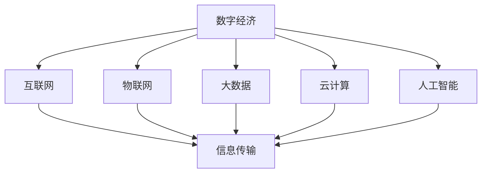
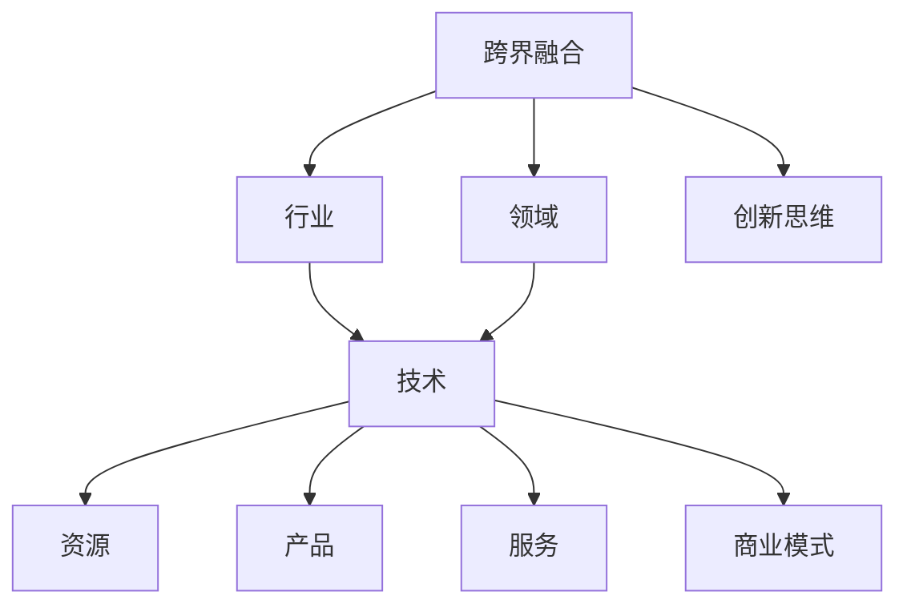
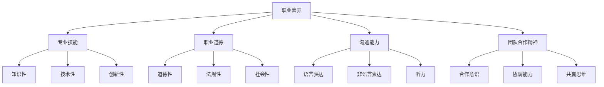
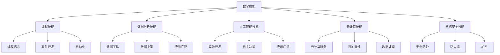
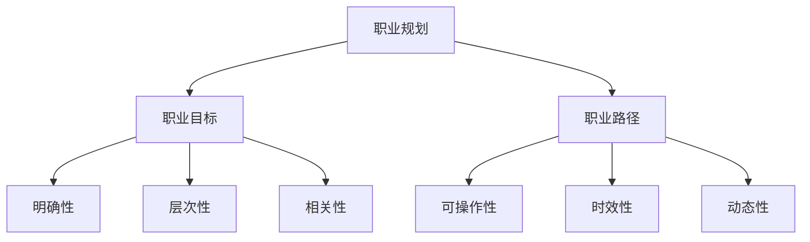
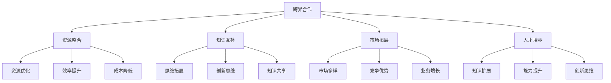
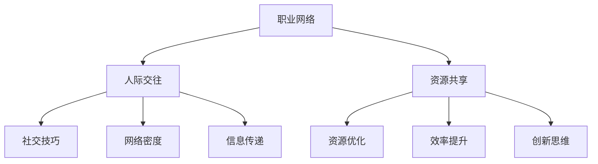
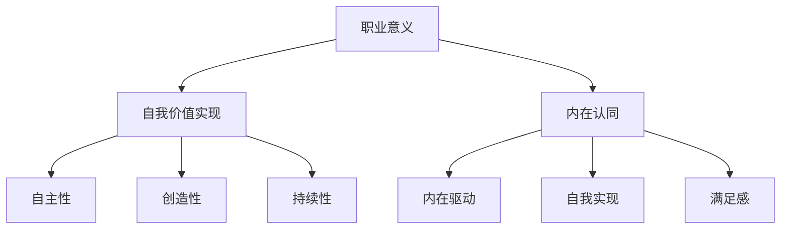
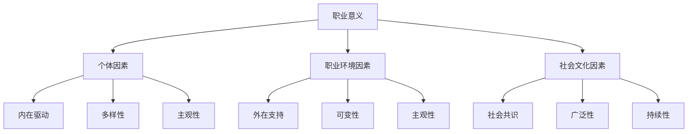
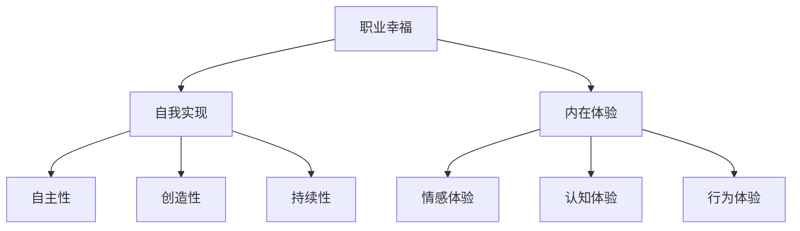

                 

### 让我们一起深入思考：在数字经济时代寻找职业意义

#### 核心关键词

- 数字经济
- 职业意义
- 职业市场变革
- 数字技能
- 跨界合作

#### 摘要

在数字经济时代，职业市场正经历着前所未有的变革。传统职业结构、技能需求和职业发展前景都发生了显著变化。这种变革不仅影响个体职业选择，更深刻地影响着我们的职业意义。本文将详细探讨数字经济时代的职业意义，并分步骤解析如何在变革中寻找和实现个人职业价值。

### 目录大纲

#### 第一部分：引言

- **1.1 问题背景**
  - 1.1.1 数字经济的崛起
  - 1.1.2 职业市场的变革
  - 1.1.3 寻找职业意义的紧迫性

- **1.2 书籍结构**
  - 1.2.1 主要内容概述
  - 1.2.2 每章节要点

- **1.3 阅读指南**
  - 1.3.1 阅读方法
  - 1.3.2 学习目标

#### 第二部分：数字经济的崛起

- **2.1 数字经济的定义与特征**
  - 2.1.1 数字经济的概念
  - 2.1.2 数字经济的主要特征
  - 2.1.3 数字经济的核心驱动力

- **2.2 数字经济的影响**
  - 2.2.1 对传统经济的冲击
  - 2.2.2 对就业市场的影响
  - 2.2.3 对消费者行为的影响

- **2.3 数字经济下的产业变革**
  - 2.3.1 产业结构调整
  - 2.3.2 新兴产业发展
  - 2.3.3 传统产业数字化转型

- **2.4 本章小结**

#### 第三部分：职业市场的变革

- **3.1 职业市场现状分析**
  - 3.1.1 职业结构变化
  - 3.1.2 职业技能需求变化
  - 3.1.3 职业发展前景

- **3.2 数字化转型对职业的影响**
  - 3.2.1 数字技能的重要性
  - 3.2.2 数字化转型下的职业挑战
  - 3.2.3 职业转型的策略

- **3.3 跨界融合与职业创新**
  - 3.3.1 跨界融合的概念
  - 3.3.2 跨界融合下的职业创新
  - 3.3.3 创新职业的发展路径

- **3.4 本章小结**

#### 第四部分：应对就业市场的变革

- **4.1 提升职业素养**
  - 4.1.1 职业素养的概念
  - 4.1.2 职业素养的重要性
  - 4.1.3 提升职业素养的策略

- **4.2 增强数字技能**
  - 4.2.1 数字技能的构成
  - 4.2.2 数字技能提升途径
  - 4.2.3 数字技能实践案例

- **4.3 职业规划与自我营销**
  - 4.3.1 职业规划的重要性
  - 4.3.2 职业规划的方法
  - 4.3.3 自我营销技巧

- **4.4 跨界合作与职业网络**
  - 4.4.1 跨界合作的意义
  - 4.4.2 职业网络建设
  - 4.4.3 跨界合作案例解析

- **4.5 本章小结**

#### 第五部分：职业意义的探寻

- **5.1 职业意义的定义与内涵**
  - 5.1.1 职业意义的内涵
  - 5.1.2 职业意义的重要性
  - 5.1.3 职业意义的影响因素

- **5.2 数字经济时代职业意义的新内涵**
  - 5.2.1 数字经济背景下的职业意义
  - 5.2.2 职业价值的新趋势
  - 5.2.3 职业意义的转变

- **5.3 职业幸福与自我实现**
  - 5.3.1 职业幸福的概念
  - 5.3.2 自我实现与职业意义
  - 5.3.3 实现职业幸福的方法

- **5.4 本章小结**

### 1.1 问题背景

#### 1.1.1 数字经济的崛起

数字经济是指以数字化的信息和知识为关键生产要素，以现代信息网络为重要载体，以信息通信技术的有效利用为驱动的新型经济形态。随着互联网、大数据、云计算、人工智能等技术的迅猛发展，数字经济在全球范围内迅速崛起，并逐渐成为推动经济增长和社会进步的重要力量。

**核心概念术语说明**：

- **数字经济**：指以数字技术和网络为核心的经济活动。
- **数字化**：将实体信息转换为数字形式的过程。
- **信息技术**：包括互联网、人工智能、云计算等。

**问题背景**：

数字经济的崛起带来了前所未有的机遇和挑战。一方面，数字经济推动了产业结构的优化升级，催生了大量新兴产业和就业机会；另一方面，它也引发了传统职业的变革和就业市场的动荡。在这种背景下，理解数字经济的本质和特征，对于个人和企业来说都具有重要意义。

**问题描述**：

在数字经济时代，职业市场的变革已经成为不可逆转的趋势。如何适应这种变革，寻找和实现个人的职业意义，成为摆在我们面前的紧迫问题。

**问题解决**：

本文将通过深入分析数字经济的崛起及其对职业市场的影响，探讨如何在数字经济时代寻找和实现个人的职业意义。我们将从定义数字经济、分析其特征和影响、探讨职业市场的变革、提出应对策略等多个角度，逐步解答这个问题。

**边界与外延**：

- **边界**：本文主要关注数字经济对职业市场的影响，以及个体如何适应这种变化。
- **外延**：此外，我们还关注数字经济时代下的职业幸福感、职业规划等话题。

#### 1.1.2 职业市场的变革

随着数字经济的崛起，职业市场也经历了深刻的变革。传统职业结构正在重构，新兴职业不断涌现，职业技能需求也在不断变化。这种变革不仅影响了职业的发展前景，也对个人的职业选择产生了深远影响。

**核心概念术语说明**：

- **职业市场**：指职业供求关系及其运行机制。
- **职业结构**：指不同职业在市场上的分布和比例。
- **新兴职业**：指随着科技进步和市场需求变化而出现的新的职业类别。
- **职业技能**：指从事某一职业所需的专业技能和知识。

**问题背景**：

职业市场的变革源于数字经济的推动。互联网、大数据、人工智能等技术的发展，使得很多传统职业面临淘汰或转型，同时也催生了大量新兴职业。在这种背景下，理解职业市场的现状和趋势，对于个人职业规划具有重要意义。

**问题描述**：

数字经济时代的职业市场发生了哪些变化？这些变化如何影响职业发展？个人如何适应这种变革，实现职业价值？

**问题解决**：

本文将详细分析职业市场的现状，探讨数字化对职业的影响，并从职业技能需求、职业发展前景等多个角度，解答这些问题。

**边界与外延**：

- **边界**：本文主要关注数字经济对职业市场的影响，以及职业市场的变革趋势。
- **外延**：此外，我们还关注职业市场的未来发展趋势，以及个体如何适应和利用这些趋势。

#### 1.1.3 寻找职业意义的紧迫性

在数字经济时代，职业意义的寻找变得尤为紧迫。首先，数字经济的快速发展使得职业市场的不确定性增加，许多传统职业正在消失，新兴职业不断涌现。这种变革要求个体必须具备快速适应和调整的能力，而职业意义的寻找正是这一能力的重要支撑。

**核心概念术语说明**：

- **职业意义**：指个体通过职业活动所获得的自我价值实现。
- **自我实现**：指个体在职业中实现个人潜能和价值观。
- **不确定性**：指职业市场中不可预测和变化的情况。

**问题背景**：

在数字经济时代，职业市场的变革带来了前所未有的不确定性和挑战。传统职业的稳定性下降，新兴职业的出现使得职业选择更加多样，但同时也增加了职业风险。在这种背景下，寻找职业意义成为个体应对职业市场变革的关键。

**问题描述**：

为什么在数字经济时代，寻找职业意义变得如此紧迫？它对于个体的职业发展有何重要意义？

**问题解决**：

本文将从个体职业发展的角度，分析数字经济时代职业意义的重要性，探讨如何通过职业意义的寻找，提升个体的职业适应能力和职业幸福感。

**边界与外延**：

- **边界**：本文主要关注数字经济时代下职业意义的寻找，以及这一过程对个体职业发展的影响。
- **外延**：此外，我们还关注职业意义寻找的方法和策略，以及如何通过职业意义的实现，提升个体在职业市场中的竞争力。

### 1.2 书籍结构

#### 1.2.1 主要内容概述

本书旨在深入探讨数字经济时代下职业意义的寻找和实现。全书分为五个主要部分，分别从数字经济的崛起、职业市场的变革、应对就业市场的变革、职业意义的探寻等多个角度，系统分析和解答了如何在数字经济时代寻找和实现个人的职业意义。

- **第一部分：引言**：介绍数字经济时代的职业意义以及本书的结构和阅读指南。
- **第二部分：数字经济的崛起**：分析数字经济的定义、特征、影响以及产业变革。
- **第三部分：职业市场的变革**：探讨职业市场的现状、数字化转型的影响以及职业创新。
- **第四部分：应对就业市场的变革**：提出提升职业素养、增强数字技能、职业规划与自我营销、跨界合作与职业网络等策略。
- **第五部分：职业意义的探寻**：深入分析职业意义的内涵、数字经济时代职业意义的新内涵以及职业幸福与自我实现。

#### 1.2.2 每章节要点

- **第一章：引言**
  - **核心要点**：介绍数字经济时代职业意义的紧迫性，概述本书的结构和主要内容。
- **第二章：数字经济的崛起**
  - **核心要点**：分析数字经济的定义、特征、核心驱动力以及其对经济、就业市场、消费者行为的影响。
- **第三章：职业市场的变革**
  - **核心要点**：探讨职业市场的现状、数字化对职业的影响以及跨界融合与职业创新。
- **第四章：应对就业市场的变革**
  - **核心要点**：提出提升职业素养、增强数字技能、职业规划与自我营销、跨界合作与职业网络等策略。
- **第五章：职业意义的探寻**
  - **核心要点**：深入分析职业意义的内涵、数字经济时代职业意义的新内涵以及职业幸福与自我实现。

### 1.3 阅读指南

#### 1.3.1 阅读方法

为了更好地理解和应用本书的内容，建议采用以下阅读方法：

1. **系统性阅读**：按照章节顺序逐步阅读，确保对每个部分的内容有全面的了解。
2. **重点阅读**：对于感兴趣的部分，可以深入阅读，尤其是对核心概念和案例分析。
3. **实践结合**：尝试将书中的理论和方法应用到实际工作中，通过实践检验和理解。
4. **交流讨论**：与他人交流本书的内容，分享心得体会，加深理解和记忆。

#### 1.3.2 学习目标

通过阅读本书，您将能够：

1. **理解数字经济对职业市场的影响**：深入理解数字经济的定义、特征、驱动力以及其对经济、就业市场和消费者行为的影响。
2. **掌握职业市场的现状和变革**：了解职业市场的现状、数字化对职业的影响以及跨界融合与职业创新。
3. **提升职业素养和数字技能**：掌握提升职业素养和数字技能的方法，包括职业规划、自我营销、跨界合作等。
4. **实现职业意义和职业幸福**：理解职业意义的内涵、数字经济时代职业意义的新内涵以及实现职业幸福的方法。

### 1.4 让我们一起深入思考：在数字经济时代寻找职业意义

在数字经济时代，职业意义的寻找变得尤为重要。这不仅关乎个体的职业发展，更关系到整个社会的进步。让我们一起深入思考以下问题：

- **数字经济时代，职业意义发生了哪些变化？**
- **个体如何适应职业市场的变革，寻找和实现职业意义？**
- **职业素养和数字技能在职业意义实现中扮演什么角色？**
- **跨界合作和职业网络对职业意义有何影响？**
- **如何在数字经济时代实现职业幸福和自我实现？**

通过深入思考和探讨这些问题，我们将更好地理解数字经济时代下的职业意义，并找到适合自己的职业发展路径。接下来，我们将分章节详细分析这些问题，提供理论和方法上的支持。

## 2.1 数字经济的定义与特征

#### 2.1.1 数字经济的概念

数字经济（Digital Economy）是指以数字化信息和网络为基础，以现代信息通信技术的有效利用为驱动，进行生产、分配和消费活动的经济形态。它涵盖了所有通过数字技术进行的经济活动，包括互联网、物联网、大数据、云计算、人工智能等。数字经济不仅仅是传统经济的延伸，更是一种全新的经济模式，它重新定义了生产方式、交换方式和消费方式。

**核心概念**：

- **数字化**：指将物理世界的信息转换为数字形式的过程。
- **信息通信技术**：包括互联网、物联网、人工智能、云计算等。

**概念属性特征对比表格**：

| 特征         | 定义                                                         |  
| ------------ | ------------------------------------------------------------ |  
| 数字化       | 将实体信息转换为数字形式的过程，如通过扫描、传感等技术。           |  
| 信息通信技术 | 通过互联网、物联网、人工智能、云计算等技术实现信息传输和处理。   |

**ER实体关系图架构**：

#### 2.1.2 数字经济的主要特征

数字经济的崛起带来了许多新的特征，这些特征深刻地影响了我们的生活方式和经济结构。

1. **信息化和智能化**：数字经济以信息通信技术为核心，推动了信息化和智能化的发展。通过互联网、物联网、人工智能等技术的应用，信息处理的速度和效率大大提高，智能化水平也显著提升。

2. **网络化和全球化**：数字经济依赖于互联网等网络技术，使得信息能够快速传播，打破了地域限制，促进了全球化的经济活动。企业可以轻松地在全球范围内进行业务拓展，消费者也能享受到全球化的商品和服务。

3. **数据化和智能化**：数字经济强调数据的收集、分析和利用。通过大数据和人工智能技术，企业能够更精确地了解市场需求，优化生产流程，提高决策的智能化水平。

4. **平台化和共享化**：数字经济的平台化特征使得资源可以更加高效地配置和利用。共享经济、共享平台等模式的出现，改变了传统的生产和服务方式，降低了进入门槛，提高了资源利用效率。

**主要特征**：

- **信息化和智能化**
- **网络化和全球化**
- **数据化和智能化**
- **平台化和共享化**

#### 2.1.3 数字经济的核心驱动力

数字经济的快速发展离不开几个核心驱动力的推动，这些驱动力包括技术创新、政策支持、市场需求和人才供给。

1. **技术创新**：数字经济的核心在于技术创新，包括互联网、物联网、大数据、人工智能、区块链等技术的不断进步。这些技术创新不仅提升了信息处理和传输的效率，也创造了新的商业模式和产业生态。

2. **政策支持**：政府的政策支持是数字经济发展的关键。通过制定有利于数字经济发展的政策和法规，政府可以推动相关领域的创新和投资，促进数字经济的快速增长。

3. **市场需求**：随着消费者对数字化产品和服务的需求不断增加，市场需求成为数字经济的重要推动力。数字化技术提供了更加便捷、个性化和高效的服务，满足了消费者多样化的需求。

4. **人才供给**：数字经济的发展离不开专业人才的支撑。通过培养和引进高素质的数字技术人才，企业可以更好地利用数字化技术，推动数字经济的发展。

**核心驱动力**：

- **技术创新**
- **政策支持**
- **市场需求**
- **人才供给**

#### 2.1.4 数字经济的兴起对传统经济的影响

数字经济的兴起对传统经济产生了深远的影响，主要体现在以下几个方面：

1. **产业结构调整**：数字经济推动了产业结构的调整和升级。传统产业通过数字化转型，提高了生产效率和服务质量，而新兴数字产业也迅速崛起，成为经济增长的重要引擎。

2. **就业市场变化**：数字经济带来了新兴职业，同时也淘汰了一些传统职业。这要求劳动力市场进行适应和调整，提升技能水平和创新能力。

3. **商业模式的变革**：数字经济改变了传统商业模式，通过互联网、大数据、人工智能等技术，企业可以更加精准地满足消费者需求，提高市场竞争力。

4. **消费方式的变化**：数字化技术使得消费方式更加便捷和多样化。在线购物、移动支付等成为主流，改变了消费者的消费习惯和生活方式。

#### 2.1.5 数字经济对就业市场的影响

数字经济对就业市场的影响是全面而深刻的，主要体现在以下几个方面：

1. **职业结构变化**：数字经济催生了大量新兴职业，如数据分析师、人工智能工程师、网络安全专家等。同时，一些传统职业逐渐被淘汰或转型。

2. **职业技能需求变化**：随着数字经济的发展，对数字技能的需求日益增加。掌握互联网、大数据、人工智能等技术的专业人员受到市场青睐。

3. **就业稳定性下降**：数字经济时代的职业不稳定因素增加，个体就业的稳定性和安全性面临挑战。

4. **职业发展前景**：数字经济为职业发展提供了新的机遇，但也带来了新的挑战。个体需要不断提升自身技能，以适应快速变化的市场需求。

#### 2.1.6 数字经济时代的产业变革

数字经济时代的产业变革主要体现在以下几个方面：

1. **产业结构调整**：数字经济推动了产业结构的优化升级，新兴产业（如互联网、人工智能、云计算）迅速崛起，传统产业（如制造业、零售业）逐步数字化转型。

2. **产业融合**：数字经济促进了不同产业之间的融合，产生了许多跨界产业，如互联网金融、物联网、智能医疗等。

3. **产业链重塑**：数字经济改变了产业链的形态，缩短了生产和消费之间的距离，提高了产业链的效率。

4. **全球产业链重构**：数字经济使得全球产业链更加紧密和复杂，推动了全球化的深入发展。

#### 2.1.7 本章小结

本章详细介绍了数字经济的概念、特征、核心驱动力以及对传统经济和就业市场的影响。通过理解数字经济，我们可以更好地把握其发展脉络，为应对职业市场的变革做好准备。下一章将深入探讨数字经济时代的职业市场变革，分析职业结构变化、职业技能需求变化以及职业发展前景。

## 2.2 数字经济的影响

#### 2.2.1 对传统经济的冲击

数字经济的崛起对传统经济产生了深远的影响，尤其对传统产业和商业模式造成了显著的冲击。首先，数字经济通过技术创新和数字化手段，提高了生产效率和服务质量，使得传统产业面临巨大的竞争压力。例如，制造业通过数字化改造，实现了智能制造，降低了生产成本，提高了产品质量，这对传统制造业带来了巨大的挑战。

**影响分析**：

- **生产效率提高**：数字技术使得生产过程更加自动化和智能化，减少了人为干预，提高了生产效率。
- **成本降低**：数字化技术的应用降低了生产成本，尤其是减少了人力成本。
- **产品质量提升**：数字化技术能够精确控制生产过程，提高了产品质量。

**案例**：

- **制造业**：通过数字化改造，制造业实现了智能制造，提高了生产效率和产品质量，对传统制造业造成了巨大冲击。
- **零售业**：电子商务的兴起，改变了消费者的购物习惯，使得传统零售业面临巨大压力，许多实体店被迫关闭。

#### 2.2.2 对就业市场的影响

数字经济对就业市场的影响是复杂而深远的，它不仅改变了职业结构，还影响了职业技能需求和职业发展前景。首先，数字经济催生了大量新兴职业，如数据分析师、人工智能工程师、网络安全专家等，这些职业具有较高的技术含量和市场需求。同时，一些传统职业逐渐被淘汰或转型，如制造业的流水线工人、零售业的销售人员等。

**影响分析**：

- **职业结构变化**：数字经济推动了职业结构的调整，新兴职业崛起，传统职业逐渐减少。
- **职业技能需求变化**：数字技术对职业技能提出了新的要求，如编程能力、数据分析能力、网络安全意识等。
- **职业发展前景**：数字经济为职业发展提供了新的机遇，但也带来了新的挑战，个体需要不断学习新技能，以适应市场需求。

**案例**：

- **数据分析师**：随着大数据技术的发展，数据分析师成为数字经济时代的重要职业，具备数据分析能力的人才需求量大。
- **人工智能工程师**：人工智能技术的广泛应用，使得人工智能工程师成为热门职业，掌握了相关技能的人才备受市场青睐。

#### 2.2.3 对消费者行为的影响

数字经济对消费者行为产生了深刻的影响，改变了消费者的购物习惯和消费方式。首先，电子商务的兴起使得消费者可以更加便捷地购买商品和服务，不受时间和地域的限制。其次，数字技术提供了个性化的消费体验，如通过大数据分析，商家可以更准确地了解消费者需求，提供个性化的推荐。

**影响分析**：

- **购物便捷性提高**：电子商务使得消费者可以随时随地购买商品，大大提高了购物便捷性。
- **个性化消费体验**：数字技术提供了个性化的消费体验，消费者可以享受更加个性化的服务。
- **消费方式多样化**：移动支付、在线购物等新的消费方式出现，丰富了消费者的选择。

**案例**：

- **电子商务**：淘宝、京东等电商平台改变了消费者的购物习惯，使得线上购物成为主流。
- **个性化推荐**：亚马逊、网易云课堂等平台通过大数据分析，为消费者提供个性化的推荐，提高了用户体验。

#### 2.2.4 数字经济对传统产业的影响

数字经济对传统产业的影响是全方位的，它不仅改变了传统产业的生产方式，还推动了产业结构的优化升级。首先，数字经济使得传统产业实现了数字化转型，通过互联网、物联网、大数据等技术的应用，提高了生产效率和服务质量。其次，数字经济催生了新兴产业，如互联网产业、人工智能产业等，与传统产业形成了互补和融合。

**影响分析**：

- **生产方式改变**：数字化技术使得生产过程更加智能化和自动化，提高了生产效率。
- **产业结构优化**：数字经济推动了产业结构的优化升级，新兴产业崛起，传统产业逐步转型。
- **产业融合**：数字经济促进了不同产业之间的融合，形成了新的产业生态。

**案例**：

- **智能制造**：通过数字化改造，制造业实现了智能制造，提高了生产效率和质量，推动了产业升级。
- **互联网+**：传统产业通过互联网技术的应用，实现了线上线下一体化运营，提高了市场竞争力。

#### 2.2.5 数字经济对社会生活的影响

数字经济不仅改变了经济和就业市场，还深刻地影响了人们的社会生活。首先，数字技术使得人们的生活更加便捷，如在线教育、远程办公等新模式的出现，大大提高了生活质量。其次，数字经济推动了社会服务的数字化，如在线医疗、智慧城市等，为人们提供了更加便捷和高效的服务。

**影响分析**：

- **生活便捷性提高**：数字技术提供了便捷的生活方式，如在线购物、移动支付等。
- **社会服务数字化**：数字经济推动了社会服务的数字化，提高了服务质量。
- **信息获取便捷化**：数字技术使得信息获取更加便捷，人们可以轻松地获取全球范围内的信息。

**案例**：

- **在线教育**：数字技术使得在线教育成为可能，人们可以随时随地学习，提高了教育资源的利用率。
- **智慧城市**：通过物联网、大数据等技术，城市可以实现智能化管理，提高了城市的生活质量。

#### 2.2.6 本章小结

本章详细分析了数字经济对传统经济、就业市场、消费者行为和社会生活的影响。通过理解这些影响，我们可以更好地把握数字经济的发展趋势，为应对职业市场的变革做好准备。下一章将深入探讨数字经济时代下的产业变革，分析产业结构调整、新兴产业发展和传统产业数字化转型等关键问题。

## 2.3 数字经济下的产业变革

#### 2.3.1 产业结构调整

数字经济时代的产业结构调整是必然趋势，这种调整不仅体现在新兴产业的崛起上，还体现在传统产业的数字化转型。首先，数字经济催生了大量新兴产业，如互联网产业、人工智能产业、大数据产业等。这些新兴产业具有较高的技术含量和市场潜力，成为经济增长的新引擎。同时，传统产业也在数字技术的推动下，逐步实现数字化转型，通过智能化、自动化等技术手段，提高生产效率和产品质量。

**影响分析**：

- **新兴产业崛起**：数字经济催生了新兴产业，如互联网、人工智能、大数据等，这些产业具有较高的创新性和市场潜力。
- **传统产业转型**：传统产业通过数字化转型，提高了生产效率和服务质量，实现了产业升级。
- **产业链重构**：数字经济改变了产业链的形态，缩短了生产和消费之间的距离，提高了产业链的整体效率。

**案例**：

- **互联网产业**：随着互联网技术的普及，互联网产业迅速崛起，成为数字经济的重要组成部分。
- **智能制造**：制造业通过数字化转型，实现了智能制造，提高了生产效率和质量，推动了产业升级。

#### 2.3.2 新兴产业发展

数字经济时代，新兴产业的发展成为推动经济增长的重要力量。这些新兴产业不仅具有较高的技术含量，还具有较强的创新性和市场前景。例如，互联网产业、人工智能产业、大数据产业等。这些产业通过技术创新和商业模式创新，不断拓展市场空间，创造了大量就业机会，成为经济增长的新动力。

**影响分析**：

- **技术创新驱动**：新兴产业的发展依赖于技术创新，如人工智能、区块链、5G等技术。
- **商业模式创新**：新兴产业通过创新的商业模式，实现了高效的市场拓展和资源利用。
- **就业机会增加**：新兴产业的发展创造了大量就业机会，吸引了大量人才涌入。

**案例**：

- **人工智能产业**：人工智能技术的广泛应用，推动了人工智能产业的发展，创造了大量高薪就业机会。
- **大数据产业**：大数据技术的应用，使得大数据产业迅速崛起，成为数字经济的重要组成部分。

#### 2.3.3 传统产业数字化转型

传统产业的数字化转型是数字经济时代的重要趋势，通过数字化技术的应用，传统产业实现了智能化、自动化和高效化。例如，制造业通过智能制造，实现了生产过程的自动化和智能化，提高了生产效率和产品质量；零售业通过电子商务，实现了线上线下一体化运营，提高了市场竞争力。传统产业的数字化转型不仅提高了企业的生产效率和竞争力，还推动了产业结构的优化升级。

**影响分析**：

- **生产效率提高**：数字化技术的应用，使得生产过程更加智能化和自动化，提高了生产效率。
- **产品质量提升**：数字化技术能够精确控制生产过程，提高了产品质量。
- **产业升级**：传统产业的数字化转型，推动了产业结构的优化升级，提高了产业链的整体效率。

**案例**：

- **智能制造**：通过数字化技术的应用，制造业实现了智能制造，提高了生产效率和产品质量。
- **零售业**：电子商务的兴起，使得零售业实现了线上线下一体化运营，提高了市场竞争力。

#### 2.3.4 数字经济时代的产业链重构

数字经济时代，产业链的重构成为必然趋势。首先，数字经济改变了产业链的形态，缩短了生产和消费之间的距离，提高了产业链的效率。例如，通过电子商务平台，企业可以直接面向消费者，减少了中间环节，提高了供应链的效率。其次，数字经济促进了产业链的全球化，使得企业可以更加便捷地在全球范围内进行业务拓展。最后，数字经济推动了产业链的智能化，通过大数据、人工智能等技术的应用，企业可以更加精准地预测市场需求，优化生产计划。

**影响分析**：

- **产业链效率提升**：数字经济通过缩短产业链长度，提高了产业链的效率。
- **产业链全球化**：数字经济使得企业可以更加便捷地在全球范围内进行业务拓展。
- **产业链智能化**：通过大数据、人工智能等技术的应用，企业可以更加精准地预测市场需求，优化生产计划。

**案例**：

- **电子商务平台**：通过电子商务平台，企业可以直接面向消费者，提高了供应链效率。
- **智能制造**：通过智能制造，企业可以更加精准地预测市场需求，优化生产计划。

#### 2.3.5 数字经济时代的产业融合

数字经济时代，产业融合成为新的趋势。通过数字技术的应用，不同产业之间实现了深度融合，形成了新的产业生态。例如，互联网产业与制造业的融合，催生了智能制造产业；大数据产业与医疗产业的融合，推动了智能医疗产业的发展。产业融合不仅提高了产业链的整体效率，还创造了新的商业机会和就业机会。

**影响分析**：

- **产业链效率提升**：产业融合通过优化产业链结构，提高了产业链的整体效率。
- **商业机会增加**：产业融合创造了新的商业机会，推动了产业创新。
- **就业机会增加**：产业融合创造了大量新的就业机会，吸引了大量人才涌入。

**案例**：

- **智能制造**：互联网产业与制造业的融合，催生了智能制造产业，提高了生产效率。
- **智能医疗**：大数据产业与医疗产业的融合，推动了智能医疗产业的发展，提高了医疗服务水平。

#### 2.3.6 本章小结

本章详细分析了数字经济下的产业变革，包括产业结构调整、新兴产业发展、传统产业数字化转型以及产业链重构和产业融合等关键问题。通过理解这些变革，我们可以更好地把握数字经济的发展趋势，为应对职业市场的变革做好准备。下一章将深入探讨职业市场的现状和变革，分析职业结构变化、职业技能需求变化以及职业发展前景。

## 3.1 职业市场现状分析

#### 3.1.1 职业结构变化

在数字经济时代，职业市场的结构发生了显著的变化。传统职业逐渐减少，而新兴职业不断涌现。这种变化主要体现在以下几个方面：

1. **新兴职业崛起**：随着数字技术的发展，新的职业如数据分析师、人工智能工程师、网络安全专家等不断涌现。这些职业不仅需求量大，而且薪资水平较高，成为市场热点。

2. **传统职业减少**：一些传统职业如制造业的流水线工人、零售业的销售人员等因为数字化和自动化技术的应用而逐渐减少。这些职业的就业机会减少，部分从业者面临失业风险。

3. **职业结构优化**：数字经济推动了职业结构的优化，高技能、高附加值职业的比例逐渐增加，而低技能、低附加值职业的比例逐渐减少。

**影响分析**：

- **新兴职业崛起**：新兴职业的崛起为劳动力市场带来了新的活力，吸引了大量高素质人才。
- **传统职业减少**：传统职业的减少要求从业者必须提升自身技能，以适应市场需求。
- **职业结构优化**：职业结构的优化提高了整体劳动力市场的质量和效率。

#### 3.1.2 职业技能需求变化

随着数字经济的发展，职业技能需求发生了显著变化。首先，数字技能成为必备技能，如编程、数据分析、人工智能等。这些技能不仅要求从业者具备扎实的理论基础，还需要不断更新知识和技能，以适应技术发展的需求。其次，软技能也日益受到重视，如沟通能力、团队合作能力、创新思维等。这些软技能在数字经济时代尤为重要，因为数字化工作环境需要高度协作和创新能力。

**影响分析**：

- **数字技能需求增加**：数字技能的需求大幅增加，掌握这些技能的从业者具备更强的竞争力。
- **软技能重要性提升**：软技能在数字经济时代的重要性不断提升，成为从业者成功的关键因素。

#### 3.1.3 职业发展前景

数字经济时代的职业发展前景既充满机遇，也充满挑战。首先，新兴职业的发展前景较好，如人工智能、大数据等领域，这些职业的薪资水平较高，职业晋升空间较大。其次，传统职业的从业者面临转型压力，他们需要不断提升自身技能，以适应市场需求。最后，职业发展的不确定性增加，从业者需要具备快速适应和调整能力，以应对市场的变化。

**影响分析**：

- **新兴职业前景好**：新兴职业如人工智能、大数据等领域的职业前景良好，具备较高的薪资水平和职业晋升空间。
- **传统职业需转型**：传统职业的从业者需要提升自身技能，以适应数字化时代的市场需求。
- **职业发展不确定性增加**：职业发展的不确定性增加，从业者需要具备快速适应和调整能力。

#### 3.1.4 职业市场变革对劳动者的挑战

数字经济时代的职业市场变革对劳动者提出了新的挑战。首先，技能要求提高，劳动者需要不断学习新技能，以适应市场需求。其次，职业不稳定因素增加，劳动者需要具备更强的适应能力和心理承受能力。最后，劳动者需要具备跨界合作和创新能力，以在激烈的市场竞争中脱颖而出。

**影响分析**：

- **技能要求提高**：劳动者需要不断学习新技能，以适应数字经济时代的市场需求。
- **职业不稳定因素增加**：职业不稳定因素增加，劳动者需要具备更强的适应能力和心理承受能力。
- **跨界合作和创新能力提升**：劳动者需要具备跨界合作和创新能力，以在激烈的市场竞争中脱颖而出。

#### 3.1.5 本章小结

本章分析了数字经济时代职业市场的现状，包括职业结构变化、职业技能需求变化、职业发展前景以及职业市场变革对劳动者的挑战。通过深入分析这些变化，我们可以更好地理解数字经济时代职业市场的发展趋势，为劳动者的职业规划提供有益的指导。下一章将探讨数字化转型对职业的影响，分析数字技能的重要性、数字化转型下的职业挑战以及职业转型的策略。

### 3.2 数字化转型对职业的影响

#### 3.2.1 数字技能的重要性

在数字经济时代，数字技能的重要性日益凸显。这些技能不仅包括编程、数据分析等硬技能，还涵盖云计算、人工智能等前沿技术的应用能力。掌握这些数字技能，不仅能够提高工作效率，还能显著提升职业竞争力。

**影响分析**：

- **工作效率提高**：数字技能使得工作过程更加自动化和智能化，减少了重复性劳动，提高了工作效率。
- **职业竞争力提升**：掌握数字技能的从业者具备更强的竞争力，能够在职场中脱颖而出。

**案例**：

- **编程技能**：编程技能是数字技能的核心，能够帮助从业者开发软件、处理数据，实现业务的数字化转型。
- **数据分析能力**：数据分析能力是数字化时代的重要技能，能够帮助企业做出更准确的决策，提高业务运营效率。

#### 3.2.2 数字化转型下的职业挑战

数字化转型带来了许多新的职业挑战。首先，技能更新速度加快，从业者需要不断学习新技能，以适应技术变革。其次，职业不确定性增加，从业者需要具备较强的适应能力和心理承受能力。最后，数字化转型对劳动者的工作方式和工作环境提出了新的要求，需要从业者具备更高的自主学习和创新思维。

**影响分析**：

- **技能更新速度加快**：技术变革使得数字技能的更新速度加快，从业者需要不断学习新技能，以保持竞争力。
- **职业不确定性增加**：职业不确定性增加，从业者需要具备较强的适应能力和心理承受能力。
- **工作方式变化**：数字化转型改变了工作方式和工作环境，从业者需要具备更高的自主学习和创新思维。

**案例**：

- **技能更新**：云计算、人工智能等新技术的快速发展，要求从业者不断学习新技能，以跟上技术发展的步伐。
- **工作环境变化**：远程办公、智能化工作环境等新型工作方式的兴起，要求从业者具备更高的适应能力和创新能力。

#### 3.2.3 职业转型的策略

面对数字化转型的挑战，从业者需要采取有效的职业转型策略。首先，应积极提升自身技能，特别是数字技能，以适应市场需求。其次，应关注新兴职业的发展趋势，提前布局，抓住职业转型的机遇。最后，应建立跨界合作网络，通过合作实现资源共享和技能互补。

**影响分析**：

- **提升技能**：通过不断提升自身技能，特别是数字技能，从业者能够更好地适应市场需求，提高职业竞争力。
- **关注新兴职业**：关注新兴职业的发展趋势，有助于从业者抓住职业转型的机遇。
- **建立跨界合作网络**：跨界合作能够实现资源共享和技能互补，提高职业转型的成功率。

**案例**：

- **技能提升**：通过参加在线课程、研讨会等途径，从业者可以不断提升自身技能，以适应数字化转型。
- **新兴职业布局**：提前了解大数据、人工智能等领域的新兴职业，有助于从业者抓住职业转型的机遇。

#### 3.2.4 跨界融合与职业创新

数字化转型不仅改变了职业结构，还推动了跨界融合和职业创新。跨界融合通过不同领域的技术融合，创造了新的职业机会和商业模式。职业创新则通过创新思维和新的工作方式，提升了职业价值。

**影响分析**：

- **跨界融合**：跨界融合通过技术融合，创造了新的职业机会和商业模式。
- **职业创新**：职业创新通过创新思维和新的工作方式，提升了职业价值。

**案例**：

- **跨界融合**：互联网与制造业的融合，催生了智能制造行业，创造了大量新职业。
- **职业创新**：创新思维和新的工作方式，如远程办公、敏捷开发等，提升了职业价值。

#### 3.2.5 数字技能提升途径

为了应对数字化转型的挑战，从业者需要采取有效的数字技能提升途径。首先，应参加专业培训课程，系统地学习数字技能。其次，应参与实际项目，通过实践提升技能水平。最后，应积极参与行业交流活动，了解行业动态，拓展人脉资源。

**影响分析**：

- **专业培训**：通过参加专业培训课程，从业者能够系统地学习数字技能，提高专业水平。
- **项目实践**：通过参与实际项目，从业者能够将所学技能应用到实际工作中，提升实战能力。
- **行业交流**：通过参与行业交流活动，从业者能够了解行业动态，拓展人脉资源。

**案例**：

- **专业培训**：参加大数据分析、人工智能等领域的专业培训，系统地学习数字技能。
- **项目实践**：参与实际项目，如开发智能应用、数据分析项目等，提升技能水平。

#### 3.2.6 本章小结

本章探讨了数字化转型对职业的影响，包括数字技能的重要性、数字化转型下的职业挑战、职业转型的策略以及跨界融合和职业创新。通过深入分析这些内容，我们可以更好地理解数字化转型对职业市场的影响，为从业者提供有益的指导。下一章将探讨跨界融合与职业创新，分析跨界融合的概念、跨界融合下的职业创新以及创新职业的发展路径。

### 3.3 跨界融合与职业创新

#### 3.3.1 跨界融合的概念

跨界融合是指不同行业、领域之间的技术和资源相互融合，创造出新的产品、服务和商业模式。在数字经济时代，跨界融合成为推动产业创新和职业创新的重要动力。跨界融合不仅仅是在行业之间的物理连接，更是一种思维方式的转变，是不同领域专家共同探索解决方案的过程。

**概念属性特征对比表格**：

| 概念       | 定义                                                         | 特征                                                                                   |
| ---------- | ------------------------------------------------------------ | -------------------------------------------------------------------------------------- |
| 跨界融合   | 不同行业、领域之间的技术和资源相互融合，创造出新的产品、服务和商业模式。 | 1. 跨行业：不同行业的技术和资源相互结合。2. 跨领域：不同领域的知识和经验相互融合。3. 创新驱动：通过创新思维实现资源的重新配置。 |

**ER实体关系图架构**：

#### 3.3.2 跨界融合下的职业创新

跨界融合为职业创新提供了广阔的空间，它不仅创造了新的职业机会，还改变了传统职业的工作内容和模式。首先，跨界融合催生了大量新兴职业，如数据治理师、用户体验设计师、数字营销经理等。这些职业要求从业者具备跨领域的知识和技能，能够将不同领域的知识和经验应用于实际工作中。其次，跨界融合改变了传统职业的工作模式，使得工作更加灵活和多元化。

**影响分析**：

- **新兴职业涌现**：跨界融合催生了大量新兴职业，为从业者提供了更多的职业选择。
- **工作模式改变**：跨界融合改变了传统职业的工作模式，使得工作更加灵活和多元化。

**案例**：

- **数据治理师**：随着大数据技术的发展，数据治理师成为新兴职业，负责管理和维护企业数据资产。
- **用户体验设计师**：跨界融合使得用户体验设计师在多个领域发挥作用，不仅涉及产品设计，还涉及用户研究和市场分析。

#### 3.3.3 创新职业的发展路径

创新职业的发展路径通常包括以下几个阶段：

1. **萌芽期**：在萌芽期，跨界融合的概念和理念开始被提出，相关的技术研究和应用也开始展开。这一阶段的职业机会较少，但具有很大的发展潜力。
2. **成长期**：在成长期，跨界融合的技术和理念逐渐成熟，市场需求增加，相关职业开始迅速发展。这一阶段是职业机会最多的时期，也是从业者实现职业价值的关键时期。
3. **成熟期**：在成熟期，跨界融合的职业已经形成稳定的产业链和市场需求，职业机会相对稳定。这一阶段的职业发展相对成熟，从业者需要不断提升自身技能，以保持竞争力。
4. **衰退期**：在衰退期，由于技术更新换代或市场需求变化，一些跨界融合的职业可能面临衰退。这一阶段的职业机会减少，从业者需要考虑转型或转行。

**影响分析**：

- **职业机会变化**：在不同发展阶段，跨界融合的职业机会有所不同，从业者需要根据市场变化调整职业规划。
- **技能要求变化**：随着技术的发展和市场需求的变化，跨界融合的职业对从业者的技能要求也会发生变化。

**案例**：

- **萌芽期**：在区块链技术刚刚兴起时，相关职业如区块链开发工程师、区块链分析师处于萌芽期。
- **成熟期**：随着区块链技术的成熟，相关职业如区块链开发工程师、区块链分析师进入成熟期，市场需求稳定。

#### 3.3.4 跨界合作与职业网络建设

跨界合作和职业网络建设是推动跨界融合和职业创新的重要手段。跨界合作通过不同领域专家的协作，实现资源的共享和优势互补，促进创新和进步。职业网络建设则通过建立广泛的职业联系，拓展职业机会和提升职业影响力。

**影响分析**：

- **跨界合作**：跨界合作能够实现资源的共享和优势互补，推动创新和进步。
- **职业网络建设**：职业网络建设能够拓展职业机会和提升职业影响力。

**案例**：

- **跨界合作**：一家互联网公司和一家医疗器械公司合作，开发出基于区块链的智能医疗设备，实现了医疗数据和服务的优化。
- **职业网络建设**：通过加入行业协会、参加行业会议等方式，建立广泛的职业联系，拓展职业机会和提升职业影响力。

#### 3.3.5 跨界融合对职业发展的影响

跨界融合对职业发展的影响是深远和复杂的。首先，跨界融合创造了新的职业机会，为从业者提供了更多的发展空间。其次，跨界融合改变了职业的工作内容和模式，要求从业者具备跨领域的知识和技能。最后，跨界融合推动了职业的创新和进步，使得职业更加多元化和丰富。

**影响分析**：

- **职业机会增加**：跨界融合创造了新的职业机会，为从业者提供了更多的发展空间。
- **职业模式变化**：跨界融合改变了职业的工作内容和模式，要求从业者具备跨领域的知识和技能。
- **职业创新推动**：跨界融合推动了职业的创新和进步，使得职业更加多元化和丰富。

**案例**：

- **职业机会增加**：随着互联网与制造业的融合，智能制造工程师成为热门职业，为从业者提供了更多的发展机会。
- **职业模式变化**：跨界融合使得传统职业如工程师需要掌握更多的数字技能，工作模式更加多元化和灵活。

#### 3.3.6 本章小结

本章探讨了跨界融合与职业创新的概念、影响和发展路径。通过理解跨界融合和职业创新，我们可以更好地把握数字经济时代职业市场的发展趋势，为从业者提供有益的指导。下一章将探讨如何提升职业素养，包括职业素养的概念、重要性以及提升策略。

## 4.1 提升职业素养

#### 4.1.1 职业素养的概念

职业素养是指个体在职业生涯中所需具备的素养和能力，它包括专业技能、职业道德、沟通能力、团队合作精神、创新思维等多方面内容。职业素养不仅影响个体的职业发展，也影响整个团队和组织的工作效率和绩效。

**核心概念**：

- **职业素养**：指个体在职业生涯中所需具备的素养和能力。
- **专业技能**：指从事某一职业所需的专业知识和技能。
- **职业道德**：指职业行为中所遵循的道德规范和价值观。
- **沟通能力**：指个体在工作和生活中进行有效沟通的能力。
- **团队合作精神**：指个体在团队中合作，共同完成任务的能力。

**概念属性特征对比表格**：

| 素养         | 定义                                                         | 特征                                                         |
| ------------ | ------------------------------------------------------------ | ------------------------------------------------------------ |
| 职业素养     | 个体在职业生涯中所需具备的素养和能力，包括专业技能、职业道德、沟通能力、团队合作精神等。 | 1. 全面性：涵盖多个方面。2. 适应性：根据职业特点和环境变化不断调整。3. 长期性：伴随整个职业生涯。 |
| 专业技能     | 从事某一职业所需的专业知识和技能。                           | 1. 知识性：基于专业理论和实践经验。2. 技术性：应用特定技术解决问题。3. 创新性：持续学习新技术和方法。 |
| 职业道德     | 职业行为中所遵循的道德规范和价值观。                       | 1. 道德性：公正、诚信、敬业。2. 法规性：遵守相关法律法规。3. 社会性：对社会和团队负责。 |
| 沟通能力     | 个体在工作和生活中进行有效沟通的能力。                     | 1. 语言表达：清晰、准确、逻辑性强。2. 非语言表达：使用肢体语言、面部表情等辅助沟通。3. 听力：倾听他人意见，理解对方意图。 |
| 团队合作精神 | 个体在团队中合作，共同完成任务的能力。                     | 1. 合作意识：愿意与他人共同工作。2. 协调能力：协调不同成员的工作。3. 共赢思维：追求团队整体利益。 |

**ER实体关系图架构**：

#### 4.1.2 职业素养的重要性

职业素养在数字经济时代显得尤为重要。首先，数字经济背景下，职业技能的需求更加多样化和专业化，职业素养成为了提升职业竞争力的关键因素。其次，数字技术的普及使得团队合作和跨部门沟通成为常态，良好的职业素养有助于提升团队效率和团队文化。最后，职业道德在数字经济中尤为重要，因为它直接关系到企业的声誉和消费者的信任。

**影响分析**：

- **提升职业竞争力**：职业素养有助于提升个体在职场中的竞争力，特别是在数字经济时代。
- **提升团队效率**：良好的职业素养有助于提升团队协作和沟通效率，实现团队目标。
- **维护企业形象**：职业道德和职业素养有助于维护企业形象，提升企业的市场竞争力。

**案例**：

- **职业素养提升竞争力**：一位数据分析师具备良好的数据解读和沟通能力，能够在数据分析项目中更好地与团队成员合作，提升项目成功率。
- **团队协作和效率**：一个高效的团队需要成员具备良好的沟通能力和团队合作精神，通过有效的沟通和协作，实现团队目标。
- **企业形象维护**：企业通过培养员工的职业道德和职业素养，树立良好的企业形象，赢得消费者的信任。

#### 4.1.3 提升职业素养的策略

为了提升职业素养，个体和企业可以采取以下策略：

1. **持续学习**：个体应不断学习新知识和新技能，保持专业领域的领先地位。可以通过参加培训课程、阅读专业书籍、参加行业会议等方式实现。
2. **实践锻炼**：通过实际项目和工作实践，提升专业技能和实战能力。参与项目不仅能够锻炼专业技能，还能提高解决问题的能力。
3. **职业道德培养**：个体应重视职业道德的培养，遵守职业行为规范，树立正确的职业价值观。
4. **沟通能力提升**：通过参加沟通技巧培训、模拟演练等方式，提升沟通能力和表达能力。
5. **团队合作能力培养**：通过团队建设活动和项目合作，提升团队合作精神和协调能力。

**影响分析**：

- **持续学习**：通过不断学习，个体能够跟上技术发展的步伐，提升职业竞争力。
- **实践锻炼**：实际项目和工作实践能够提升专业技能和实战能力，增强自信心。
- **职业道德培养**：良好的职业道德有助于维护企业形象，提升企业的市场竞争力。
- **沟通能力提升**：良好的沟通能力有助于提升团队效率和协作效果。
- **团队合作能力培养**：团队合作能力的提升有助于实现团队目标，提高工作效率。

**案例**：

- **持续学习**：一位软件工程师通过参加在线课程和参加技术研讨会，不断提升自己的编程技能和项目管理能力。
- **实践锻炼**：通过参与多个软件开发项目，工程师能够将所学知识应用到实际工作中，提升解决实际问题的能力。
- **职业道德培养**：企业通过制定职业道德准则，对员工进行职业道德培训，提升员工的职业道德水平。
- **沟通能力提升**：通过参加沟通技巧培训，销售人员能够更好地与客户沟通，提升销售业绩。
- **团队合作能力培养**：通过团队建设活动和项目合作，团队成员能够更好地理解彼此的需求，提升团队协作效率。

#### 4.1.4 本章小结

本章详细探讨了职业素养的概念、重要性以及提升策略。通过理解职业素养，个体可以更好地提升自身的职业竞争力，适应数字经济时代职业市场的发展。下一章将探讨如何增强数字技能，包括数字技能的构成、提升途径以及实践案例。

## 4.2 增强数字技能

#### 4.2.1 数字技能的构成

在数字经济时代，数字技能成为职业发展的关键要素。数字技能包括但不限于以下几个方面：

1. **编程技能**：编程技能是数字技能的核心，它包括熟悉一种或多种编程语言（如Python、Java、C++等），以及能够运用编程语言进行软件开发、网站开发和自动化流程管理等。

2. **数据分析技能**：数据分析技能涉及使用工具（如Excel、SQL、R、Python等）来处理和分析数据，从数据中提取有价值的信息，为企业决策提供支持。

3. **人工智能技能**：人工智能技能包括机器学习、深度学习、自然语言处理等，这些技能有助于开发智能应用、自动化系统和智能解决方案。

4. **云计算技能**：云计算技能涉及理解和使用云计算服务（如AWS、Azure、Google Cloud等），进行数据存储、处理和应用程序部署。

5. **网络安全技能**：网络安全技能包括网络安全基础知识、安全防护措施、漏洞扫描和修复等，确保系统和数据的安全。

**核心概念**：

- **编程技能**：编写程序和开发软件的能力。
- **数据分析技能**：处理和分析数据的能力。
- **人工智能技能**：开发和应用人工智能算法的能力。
- **云计算技能**：使用云计算服务的技能。
- **网络安全技能**：保护系统和数据安全的技能。

**概念属性特征对比表格**：

| 技能           | 定义                                                         | 特征                                                         |
| -------------- | ------------------------------------------------------------ | ------------------------------------------------------------ |
| 编程技能       | 编写程序和开发软件的能力。                                   | 1. 语言多样性：支持多种编程语言。2. 实用性：应用于软件开发、自动化等。3. 创造性：开发创新性应用。 |
| 数据分析技能   | 处理和分析数据的能力。                                       | 1. 工具多样性：支持多种分析工具。2. 数据驱动：依赖数据做出决策。3. 应用广泛：应用于各个领域。 |
| 人工智能技能   | 开发和应用人工智能算法的能力。                             | 1. 算法多样性：支持多种算法。2. 自主性：开发自主决策系统。3. 应用广泛：应用于各个领域。 |
| 云计算技能     | 使用云计算服务的技能。                                      | 1. 服务多样性：支持多种云计算服务。2. 可扩展性：按需扩展资源。3. 高效性：提高数据处理效率。 |
| 网络安全技能   | 保护系统和数据安全的技能。                                 | 1. 安全防护：防止未授权访问和数据泄露。2. 防护措施：设置防火墙、加密等。3. 应急响应：处理网络安全事件。 |

**ER实体关系图架构**：

#### 4.2.2 数字技能提升途径

为了提升数字技能，个体可以采取以下途径：

1. **在线课程和培训**：通过在线课程和培训，个体可以系统地学习数字技能。例如，Coursera、edX、Udacity等平台提供了丰富的编程、数据分析、人工智能等课程。

2. **实践项目和实战经验**：通过参与实际项目，个体可以将所学知识应用于实际工作中，提升实战能力。例如，参与开源项目、个人项目或公司项目等。

3. **阅读专业书籍和文献**：阅读专业书籍和最新文献，可以了解最新的技术趋势和理论知识。例如，阅读《深度学习》、《Python数据分析》等书籍。

4. **参与技术社区和活动**：通过参与技术社区和活动，个体可以与同行交流经验，获取最新技术资讯。例如，参加技术会议、研讨会、黑客马拉松等。

**影响分析**：

- **在线课程和培训**：通过在线课程和培训，个体可以系统地学习数字技能，提高学习效率。
- **实践项目和实战经验**：通过实际项目，个体可以将所学知识应用于实际工作中，提升实战能力。
- **阅读专业书籍和文献**：阅读专业书籍和最新文献，可以了解最新的技术趋势和理论知识。
- **参与技术社区和活动**：通过参与技术社区和活动，个体可以与同行交流经验，获取最新技术资讯。

**案例**：

- **在线课程和培训**：一位数据分析师通过Coursera平台学习数据分析课程，系统地提升了自己的数据分析技能。
- **实践项目和实战经验**：一位软件工程师通过参与开源项目和个人项目，不断提升自己的编程技能和解决实际问题的能力。
- **阅读专业书籍和文献**：一位人工智能工程师通过阅读《深度学习》等书籍，了解最新的机器学习技术，提升了自己的技术水平。
- **参与技术社区和活动**：一位网络安全专家通过参加网络安全会议和研讨会，了解最新的网络安全威胁和防护措施，提升了网络安全技能。

#### 4.2.3 数字技能实践案例

以下是一些具体的数字技能实践案例：

1. **数据分析实践案例**：
   - **项目背景**：一家零售公司希望通过数据分析提升销售业绩。
   - **项目目标**：通过数据分析，识别高价值客户、优化营销策略、提升客户满意度。
   - **解决方案**：数据分析师使用Python和SQL对销售数据进行处理和分析，发现高价值客户群体，并制定针对性的营销策略。

2. **人工智能实践案例**：
   - **项目背景**：一家医疗公司希望通过人工智能技术提高诊断准确性。
   - **项目目标**：开发一款基于人工智能的辅助诊断系统，提高诊断准确率和效率。
   - **解决方案**：人工智能工程师使用深度学习技术，训练模型进行医学图像分析，辅助医生进行诊断。

3. **云计算实践案例**：
   - **项目背景**：一家初创公司希望快速上线产品，提高市场竞争力。
   - **项目目标**：利用云计算技术，实现快速开发、部署和扩展，降低成本。
   - **解决方案**：云计算工程师使用AWS服务，搭建云基础设施，实现快速开发和部署，并根据业务需求进行弹性扩展。

**影响分析**：

- **提升业务效率**：通过数字技能实践，企业能够实现业务自动化、智能化，提高效率。
- **降低成本**：利用云计算等数字技术，企业可以降低硬件和人力成本。
- **提高竞争力**：通过数字技术的应用，企业能够更好地满足市场需求，提高竞争力。

**案例总结**：

通过以上实践案例，我们可以看到数字技能在企业中的应用效果。这些实践案例不仅展示了数字技能的实际应用，还体现了数字技能在提升业务效率、降低成本和提高竞争力方面的巨大价值。

#### 4.2.4 本章小结

本章详细探讨了数字技能的构成、提升途径和实践案例。通过理解数字技能的重要性和提升方法，个体可以更好地适应数字经济时代的需求，提升职业竞争力。下一章将探讨职业规划与自我营销，包括职业规划的重要性、方法和技巧。

## 4.3 职业规划与自我营销

#### 4.3.1 职业规划的重要性

职业规划是职业发展的重要环节，它关系到个体在职业生涯中的成长和成功。有效的职业规划可以帮助个体明确职业目标，制定合理的职业发展路径，提升职业竞争力。在数字经济时代，职业规划的重要性更加凸显，因为职业市场的不确定性和变化速度加快，个体需要通过职业规划来应对这些挑战。

**核心概念**：

- **职业规划**：指个体根据自身特点和市场需求，制定职业目标和实现路径的过程。
- **职业目标**：指个体在职业生涯中希望达成的具体目标。
- **职业路径**：指个体为实现职业目标所采取的具体行动和策略。

**概念属性特征对比表格**：

| 概念       | 定义                                                         | 特征                                                         |
| ---------- | ------------------------------------------------------------ | ------------------------------------------------------------ |
| 职业规划   | 根据自身特点和市场需求，制定职业目标和实现路径的过程。           | 1. 目标导向：明确职业目标。2. 系统性：涉及职业发展的各个环节。3. 可行性：制定可实现的目标和路径。 |
| 职业目标   | 职业生涯中希望达成的具体目标。                               | 1. 明确性：具体、可量化。2. 层次性：短期、中期、长期目标。3. 相关性：与个人兴趣和优势相关。 |
| 职业路径   | 为实现职业目标所采取的具体行动和策略。                       | 1. 可操作性：具体行动方案。2. 时效性：明确的时间表。3. 动态性：根据实际情况调整。 |

**ER实体关系图架构**：

#### 4.3.2 职业规划的方法

有效的职业规划需要一套系统的方法，以下是一些常用的职业规划方法：

1. **自我评估**：通过自我评估，了解自身的兴趣、优势、价值观和职业目标。自我评估的方法包括SWOT分析（优势、劣势、机会、威胁）和职业兴趣测试等。

2. **市场分析**：了解市场需求和行业趋势，确定自己感兴趣并具有市场需求的职业方向。市场分析的方法包括行业调研、招聘网站分析、社交媒体观察等。

3. **目标设定**：设定明确、具体、可量化的职业目标，并制定实现目标的计划。目标设定应遵循SMART原则（具体、可衡量、可达成、相关性、时限性）。

4. **行动计划**：制定详细的行动计划，包括具体的学习计划、实践项目和职业发展路径。行动计划应具有可操作性和时效性。

**影响分析**：

- **自我评估**：通过自我评估，个体能够更好地了解自己，明确职业目标，提高职业规划的针对性。
- **市场分析**：通过市场分析，个体能够了解市场需求，选择具有发展潜力的职业方向，提高职业规划的可行性。
- **目标设定**：明确的目标和计划有助于个体集中精力，有针对性地提升自身能力，提高职业发展的效率。
- **行动计划**：详细的行动计划和可操作性强的实践项目，有助于个体实现职业目标，提升职业竞争力。

**案例**：

- **自我评估**：一位数据分析师通过SWOT分析，发现自己在数据分析方面有优势，但沟通能力较弱。他制定了提升沟通能力的计划，通过参加沟通技巧培训和实践项目，逐步提升了自己的沟通能力。
- **市场分析**：一位软件开发工程师通过行业调研和招聘网站分析，发现人工智能领域的需求增长迅速，他决定转向人工智能开发，并制定了相关的学习计划和项目实践。
- **目标设定**：一位创业者设定了在五年内创立一家成功公司的目标，他制定了详细的创业计划，包括市场调研、产品开发、营销策略等。
- **行动计划**：一位市场营销专员制定了学习计划，通过参加在线课程、实践项目等，不断提升自己的市场营销技能，最终实现了职业晋升。

#### 4.3.3 职业规划与自我营销

职业规划不仅涉及职业目标的设定和实现路径的制定，还涉及到如何进行自我营销。自我营销是指个体通过展示自己的能力、优势和成就，提高在职场中的知名度和影响力，从而获得更好的职业机会。

**核心概念**：

- **自我营销**：个体通过展示自己的能力、优势和成就，提高在职场中的知名度和影响力。
- **能力展示**：通过实际工作成果、项目经验、专业技能等展示自己的能力。
- **优势宣传**：通过个人品牌建设，宣传自己的独特优势和核心竞争力。
- **成就推广**：通过成就展示，推广自己的成就和贡献，提升职业竞争力。

**影响分析**：

- **能力展示**：通过实际工作成果和项目经验展示自己的能力，有助于赢得同事和上司的认可。
- **优势宣传**：通过个人品牌建设，宣传自己的独特优势和核心竞争力，提高在职场中的影响力。
- **成就推广**：通过成就展示，推广自己的成就和贡献，提升职业竞争力。

**案例**：

- **能力展示**：一位项目经理通过在项目中的出色表现，赢得了团队和客户的认可，获得了晋升机会。
- **优势宣传**：一位数据分析师通过撰写技术博客，分享自己的数据分析经验和研究成果，提高了在行业中的知名度。
- **成就推广**：一位营销经理通过在营销活动中取得的显著成绩，成功获得了市场部的经理职位。

#### 4.3.4 自我营销技巧

为了提高自我营销效果，个体可以采取以下技巧：

1. **构建个人品牌**：通过社交媒体、个人网站等平台，展示自己的专业形象和独特优势，构建个人品牌。
2. **撰写专业文章**：在专业期刊、博客等平台发表专业文章，分享自己的见解和经验，提升专业影响力。
3. **参与行业活动**：积极参加行业会议、研讨会等活动，拓展人脉，展示自己的专业能力和成就。
4. **建立专业网络**：通过建立和维护专业网络，与同行交流经验，获取行业信息，提升职业竞争力。

**影响分析**：

- **构建个人品牌**：通过个人品牌建设，提高在职场中的知名度和影响力。
- **撰写专业文章**：通过发表专业文章，提升自己的专业影响力，吸引更多机会。
- **参与行业活动**：通过参与行业活动，拓展人脉，提升自己的专业形象。
- **建立专业网络**：通过专业网络，获取行业信息，提高职业竞争力。

**案例**：

- **构建个人品牌**：一位人工智能工程师通过在LinkedIn上分享自己的研究成果和项目经验，成功吸引了一家知名公司的关注，获得了面试机会。
- **撰写专业文章**：一位数据科学家在Kaggle上发表了自己的数据分析项目，吸引了多家公司的关注，获得了工作机会。
- **参与行业活动**：一位市场营销经理通过参加行业会议，与同行交流经验，拓展了人脉，提升了职业竞争力。
- **建立专业网络**：一位软件工程师通过在GitHub上分享自己的开源项目，吸引了大量同行的关注，获得了多家公司的合作机会。

#### 4.3.5 本章小结

本章详细探讨了职业规划与自我营销的重要性、方法和技巧。通过有效的职业规划和自我营销，个体可以更好地实现职业目标，提升职业竞争力。下一章将探讨跨界合作与职业网络，包括跨界合作的意义、职业网络建设以及跨界合作案例解析。

### 4.4 跨界合作与职业网络

#### 4.4.1 跨界合作的意义

在数字经济时代，跨界合作已成为推动创新和职业发展的重要手段。跨界合作的意义主要体现在以下几个方面：

1. **资源整合**：跨界合作能够整合不同领域的资源和优势，实现资源的最优配置，提高整体效能。

2. **知识互补**：不同领域之间的合作能够实现知识的互补，促进创新思维的形成，推动技术和商业模式的创新。

3. **市场拓展**：跨界合作能够拓宽企业的市场渠道，增强企业的市场竞争力，扩大业务范围。

4. **人才培养**：跨界合作能够为参与者提供跨领域的学习和成长机会，促进人才的全面发展。

**核心概念**：

- **跨界合作**：不同领域之间的合作，通过资源和知识的共享，实现共同目标。
- **资源整合**：将不同领域的资源进行整合，实现资源的最优配置。
- **知识互补**：不同领域知识的互补，促进创新思维的形成。
- **市场拓展**：通过跨界合作，拓宽企业的市场渠道，增强市场竞争力。
- **人才培养**：通过跨界合作，为参与者提供跨领域的学习和成长机会。

**概念属性特征对比表格**：

| 概念       | 定义                                                         | 特征                                                         |
| ---------- | ------------------------------------------------------------ | ------------------------------------------------------------ |
| 跨界合作   | 不同领域之间的合作，通过资源和知识的共享，实现共同目标。       | 1. 领域多样性：涵盖多个领域。2. 创新性：促进技术和商业模式创新。3. 效率提升：资源整合，提高整体效能。 |
| 资源整合   | 将不同领域的资源进行整合，实现资源的最优配置。               | 1. 资源优化：提高资源利用率。2. 效率提升：减少资源浪费。3. 成本降低：通过共享，降低成本。 |
| 知识互补   | 不同领域知识的互补，促进创新思维的形成。                   | 1. 思维拓展：跨领域知识的融合。2. 创新思维：通过知识互补，激发创新。3. 知识共享：促进知识的交流与传播。 |
| 市场拓展   | 通过跨界合作，拓宽企业的市场渠道，增强市场竞争力。           | 1. 市场多样：进入新的市场。2. 竞争优势：提升市场竞争地位。3. 业务增长：扩大业务范围，增加收入。 |
| 人才培养   | 通过跨界合作，为参与者提供跨领域的学习和成长机会。           | 1. 知识扩展：获取跨领域知识。2. 能力提升：提升跨领域能力。3. 创新思维：培养创新思维和解决问题的能力。 |

**ER实体关系图架构**：

#### 4.4.2 职业网络建设

职业网络是指个体在职业发展中建立的人际关系网络，它对职业发展具有重要影响。通过有效的职业网络建设，个体可以获取更多的职业机会、行业信息以及支持与资源。

**核心概念**：

- **职业网络**：指个体在职业发展中建立的人际关系网络。
- **人际交往**：通过人际交往，建立和维护职业关系。
- **资源共享**：通过职业网络，实现资源的共享和互补。

**概念属性特征对比表格**：

| 概念       | 定义                                                         | 特征                                                         |
| ---------- | ------------------------------------------------------------ | ------------------------------------------------------------ |
| 职业网络   | 个体在职业发展中建立的人际关系网络。                         | 1. 人际交往：通过人际交往建立。2. 资源共享：实现资源的共享和互补。3. 信息交流：获取行业信息。 |
| 人际交往   | 通过人际交往，建立和维护职业关系。                           | 1. 社交技巧：提高人际交往能力。2. 网络密度：构建广泛的职业网络。3. 信息传递：促进信息交流。 |
| 资源共享   | 通过职业网络，实现资源的共享和互补。                           | 1. 资源优化：提高资源利用率。2. 效率提升：通过共享，提高效率。3. 创新思维：促进知识共享，激发创新。 |

**ER实体关系图架构**：

**职业网络建设策略**：

1. **积极参与行业活动**：通过参加行业会议、研讨会、培训等活动，与同行建立联系，拓展职业网络。
2. **利用社交媒体**：通过LinkedIn、Twitter等社交媒体平台，建立和维护职业网络，分享专业知识和经验。
3. **主动交流**：主动与行业内的专家、同行交流，寻求合作机会，分享资源和信息。
4. **建立个人品牌**：通过构建个人品牌，提高在职场中的知名度和影响力，吸引更多的职业机会。

**案例**：

- **积极参与行业活动**：一位技术经理通过参加行业会议，与业内专家建立了联系，获得了多个合作机会，提高了公司的知名度。
- **利用社交媒体**：一位市场营销专员通过LinkedIn分享专业知识和成功案例，吸引了多家公司的关注，获得了多个面试机会。
- **主动交流**：一位数据分析师主动与行业内的专家交流，获得了参与一个大型数据分析项目的机会，提升了专业技能。
- **建立个人品牌**：一位软件开发工程师通过GitHub上的开源项目和个人博客，展示了自己的技术实力，成功获得了一家创业公司的录用。

#### 4.4.3 跨界合作案例解析

以下是一些成功的跨界合作案例，分析其成功的原因和经验。

1. **案例一：阿里巴巴与海尔合作**  
   **背景**：阿里巴巴和海尔联合推出了一款智能家居产品——阿里云智能电视。  
   **合作内容**：阿里巴巴提供云计算和大数据技术，海尔提供硬件和软件支持。  
   **成功原因**：阿里巴巴和海尔在各自领域具有强大的技术优势和市场影响力，通过跨界合作，实现了资源整合和优势互补，推出了具有市场竞争力的智能家居产品。

2. **案例二：腾讯与京东合作**  
   **背景**：腾讯和京东合作成立了京东数字科技集团，共同推进金融科技和数字商业的发展。  
   **合作内容**：腾讯提供金融科技能力，京东提供业务场景和用户数据。  
   **成功原因**：腾讯和京东在金融科技和数字商业领域具有互补优势，通过跨界合作，实现了技术和场景的有机结合，推动了金融科技和数字商业的发展。

3. **案例三：华为与汽车制造商合作**  
   **背景**：华为与多家汽车制造商合作，开发智能汽车解决方案。  
   **合作内容**：华为提供5G技术和智能驾驶解决方案，汽车制造商提供硬件和软件支持。  
   **成功原因**：华为在5G技术和智能驾驶领域具有领先优势，汽车制造商在汽车制造和用户体验方面具有专业优势，通过跨界合作，实现了技术和硬件的有机结合，推动了智能汽车的发展。

**成功经验**：

- **资源整合**：通过跨界合作，实现资源和优势的整合，提高整体效能。
- **知识互补**：通过跨界合作，实现知识和技能的互补，促进创新思维的形成。
- **市场拓展**：通过跨界合作，拓宽市场渠道，增强市场竞争力。
- **人才培养**：通过跨界合作，为参与者提供跨领域的学习和成长机会。

#### 4.4.4 本章小结

本章详细探讨了跨界合作与职业网络的意义、建设策略以及成功案例。通过跨界合作和职业网络建设，个体和企业可以实现资源整合、知识互补、市场拓展和人才培养。下一章将探讨职业意义的探寻，包括职业意义的定义与内涵、重要性以及影响因素。

### 5.1 职业意义的定义与内涵

#### 5.1.1 职业意义的内涵

职业意义是指个体通过职业活动所获得的自我价值实现，它不仅关乎个体的经济收益，更涉及到个人的成长、成就和幸福感。职业意义不仅仅是工作所带来的收入和地位，更是一种对工作的内在认同和价值的追求。

**核心概念**：

- **职业意义**：指个体通过职业活动所获得的自我价值实现。
- **自我价值实现**：指个体在职业活动中实现的个人潜能和价值观。
- **内在认同**：指个体对工作本身的认同和价值的追求。

**概念属性特征对比表格**：

| 概念       | 定义                                                         | 特征                                                         |
| ---------- | ------------------------------------------------------------ | ------------------------------------------------------------ |
| 职业意义   | 个体通过职业活动所获得的自我价值实现。                       | 1. 内在性：关乎个体的内在价值实现。2. 多样性：不同职业具有不同的意义。3. 动态性：随着职业生涯的发展而变化。 |
| 自我价值实现 | 个体在职业活动中实现的个人潜能和价值观。                     | 1. 自主性：个体根据自己的能力和兴趣实现自我价值。2. 创造性：通过工作创造价值。3. 持续性：长期职业活动中不断实现。 |
| 内在认同   | 个体对工作本身的认同和价值的追求。                           | 1. 内在驱动：源于对工作的兴趣和热爱。2. 自我实现：通过工作实现个人潜能。3. 满足感：工作带来的内在满足感。 |

**ER实体关系图架构**：

#### 5.1.2 职业意义的重要性

职业意义在个体的职业生涯中具有至关重要的地位。首先，职业意义能够提升个体的职业满意度和幸福感。当个体对自己的工作有内在认同和价值追求时，他们更容易感受到工作带来的满足感和成就感，从而提升职业满意度。其次，职业意义有助于个体的职业稳定性和忠诚度。一个具有职业意义的职业，能够为个体提供持久的动力和目标，使他们在面对职业挑战时更加坚定和执着。最后，职业意义对个体的整体生活质量有积极影响。一个有意义的职业能够为个体提供心理支持和精神满足，提升他们的生活质量和幸福感。

**影响分析**：

- **提升职业满意度**：职业意义使个体感受到工作带来的满足感和成就感，提升职业满意度。
- **增强职业稳定性**：职业意义为个体提供持久的动力和目标，增强职业稳定性。
- **提升生活质量**：职业意义对个体的整体生活质量有积极影响，提供心理支持和精神满足。

#### 5.1.3 职业意义的影响因素

职业意义不仅由职业本身决定，还受到多种因素的影响，包括个体因素、职业环境因素和社会文化因素。

1. **个体因素**：个体的兴趣、价值观、性格和能力等内在因素对职业意义有重要影响。一个与个人兴趣和价值观相符的职业，更容易为个体带来职业意义。同时，个体的性格和能力也会影响他们在工作中的表现和职业成就，从而影响职业意义。

2. **职业环境因素**：职业环境，包括工作条件、企业文化、组织氛围等，对职业意义有重要影响。一个良好的职业环境能够为个体提供支持和资源，使他们在工作中感到更有成就感和价值。反之，一个不良的职业环境可能导致个体感到沮丧和无力，降低职业意义。

3. **社会文化因素**：社会文化环境，包括社会价值观、职业道德标准等，对职业意义也有显著影响。在一个尊重劳动、重视职业发展的社会文化环境中，个体更容易感受到职业的意义和价值。

**核心概念**：

- **个体因素**：个体的兴趣、价值观、性格和能力等。
- **职业环境因素**：工作条件、企业文化、组织氛围等。
- **社会文化因素**：社会价值观、职业道德标准等。

**概念属性特征对比表格**：

| 影响因素     | 定义                                                         | 特征                                                         |
| ------------ | ------------------------------------------------------------ | ------------------------------------------------------------ |
| 个体因素     | 个体内在的兴趣、价值观、性格和能力等。                         | 1. 内在驱动：由个体内在因素决定。2. 多样性：不同个体有不同的因素。3. 主观性：受个体主观评价影响。 |
| 职业环境因素 | 工作条件、企业文化、组织氛围等职业环境因素。                 | 1. 外在支持：为个体提供支持和资源。2. 可变性：根据环境变化而变化。3. 主观性：个体对环境的感知和评价。 |
| 社会文化因素 | 社会价值观、职业道德标准等社会文化环境因素。                 | 1. 社会共识：反映社会共同价值观。2. 广泛性：影响整个社会。3. 持续性：长期存在并影响个体。 |

**ER实体关系图架构**：

**案例分析**：

- **个体因素**：一位对编程充满热情的软件工程师，通过不断提升编程技能，实现了自我价值，感受到了职业意义。
- **职业环境因素**：一家注重员工成长和企业文化的公司，为员工提供了良好的工作环境和职业发展机会，使员工在工作中感受到职业意义。
- **社会文化因素**：在一个尊重技术、重视创新的社会环境中，技术人员更容易感受到职业的价值和意义。

#### 5.1.4 本章小结

本章详细探讨了职业意义的内涵、重要性及其影响因素。通过理解职业意义的内涵，个体可以更好地寻找和实现个人的职业价值。下一章将深入分析数字经济时代职业意义的新内涵，探讨职业价值的新趋势和职业意义的转变。

### 5.2 数字经济时代职业意义的新内涵

#### 5.2.1 数字经济背景下的职业意义

数字经济时代，职业意义发生了显著变化。首先，数字经济推动了职业多样化和职业角色的演变，使职业意义更加丰富和多样化。例如，随着互联网、大数据和人工智能等技术的发展，新兴职业如数据分析师、人工智能工程师、网络安全专家等不断涌现，这些职业不仅具有高度的技能要求，还代表了未来职业发展的方向。

**影响分析**：

- **职业多样化**：数字经济催生了大量新兴职业，丰富了职业选择，为个体提供了更多的职业意义。
- **职业角色演变**：数字经济改变了传统职业角色，新兴职业需要具备跨领域的知识和技能，职业角色更加复杂和多样化。

**案例**：

- **数据分析师**：数据分析师通过数据分析帮助企业做出更好的决策，实现了个人价值和职业意义。
- **人工智能工程师**：人工智能工程师通过开发智能系统，推动技术进步，实现了职业价值和社会贡献。

#### 5.2.2 职业价值的新趋势

在数字经济时代，职业价值呈现出新的趋势。首先，技术驱动成为职业价值的核心，掌握数字技能的从业者具备更高的职业价值。其次，创新和创造力成为衡量职业价值的重要标准，个体需要具备创新思维和解决问题的能力。最后，职业价值的衡量不再仅限于经济收益，还包括对社会的贡献、个人的成长和发展等多方面因素。

**影响分析**：

- **技术驱动**：数字技能成为职业价值的核心，掌握新技术的从业者具备更高的职业价值。
- **创新和创造力**：创新和创造力成为职业价值的重要标准，个体需要具备创新思维和解决问题的能力。
- **多元价值衡量**：职业价值的衡量不再仅限于经济收益，还包括对社会的贡献、个人的成长和发展等多方面因素。

**案例**：

- **技术驱动**：一位人工智能工程师通过创新算法，提高了智能系统的性能，为企业创造了巨大的商业价值。
- **创新和创造力**：一位创业者在数字经济时代，通过创新商业模式，成功创建了独角兽公司，实现了个人价值和职业成功。
- **多元价值衡量**：一位公益项目发起人通过利用数字化手段，提高了公益活动的效率和影响力，实现了对社会和个人的双重价值。

#### 5.2.3 职业意义的转变

数字经济时代，职业意义的转变体现在多个方面。首先，职业意义的实现方式发生了变化，从传统的以工作为核心，转向以解决问题、创造价值为核心。个体不再仅仅为了谋生而工作，更希望通过工作实现个人价值和社会贡献。其次，职业意义的核心从收入和地位，转向自我实现和幸福感。个体更加注重工作的内在满足感和成就感，而不仅仅是外在的物质回报。

**影响分析**：

- **实现方式变化**：职业意义的实现方式从以工作为核心，转向以解决问题、创造价值为核心。
- **核心变化**：职业意义的核心从收入和地位，转向自我实现和幸福感。

**案例**：

- **实现方式变化**：一位软件开发工程师通过解决技术难题，推动项目成功，实现了个人价值和职业成就感。
- **核心变化**：一位心理咨询师通过帮助客户解决心理问题，实现了个人价值和幸福感。

#### 5.2.4 数字经济时代职业意义的挑战

数字经济时代，职业意义面临着新的挑战。首先，技术变革速度加快，从业者需要不断更新知识和技能，以保持竞争力。其次，职业不确定性增加，从业者需要具备较强的适应能力和心理承受能力。最后，职业压力和竞争加剧，从业者需要平衡工作与生活，实现工作与生活的和谐。

**影响分析**：

- **技术变革**：技术变革速度加快，从业者需要不断更新知识和技能，以适应市场需求。
- **职业不确定性**：职业不确定性增加，从业者需要具备较强的适应能力和心理承受能力。
- **职业压力**：职业压力和竞争加剧，从业者需要平衡工作与生活，实现工作与生活的和谐。

**案例**：

- **技术变革**：一位数据分析专家需要不断学习新的数据分析工具和技术，以保持竞争力。
- **职业不确定性**：一位初创公司创始人面临市场波动和业务不确定性，需要具备较强的适应能力和心理承受能力。
- **职业压力**：一位项目经理在紧张的项目周期中，需要平衡工作与生活，确保项目顺利进行。

#### 5.2.5 职业意义的未来展望

数字经济时代，职业意义的未来将更加多样化和个性化。首先，职业意义的实现将更加依赖于个体的自主选择和自我实现。个体将更加注重自身的兴趣、价值观和职业目标，实现个性化的职业发展路径。其次，职业意义将更加关注对社会和环境的贡献。个体将在职业活动中积极追求社会价值和环境责任，实现个人价值与社会价值的统一。

**影响分析**：

- **个性化职业发展**：个体将更加注重自身的兴趣、价值观和职业目标，实现个性化的职业发展路径。
- **社会价值贡献**：个体将在职业活动中积极追求社会价值和环境责任，实现个人价值与社会价值的统一。

**案例**：

- **个性化职业发展**：一位设计师通过创建自己的设计品牌，实现了个人价值和职业成功。
- **社会价值贡献**：一位环保工程师通过设计环保项目，推动可持续发展，实现了个人价值和社会贡献。

#### 5.2.6 本章小结

本章探讨了数字经济时代职业意义的新内涵，包括职业价值的新趋势和职业意义的转变。通过理解这些变化，个体可以更好地把握数字经济时代的职业发展方向，实现个人的职业价值和幸福感。下一章将深入探讨职业幸福与自我实现，分析职业幸福的概念、影响因素以及实现职业幸福的方法。

### 5.3 职业幸福与自我实现

#### 5.3.1 职业幸福的概念

职业幸福是指个体在职业活动中所体验到的快乐、满足和成就感。职业幸福不仅仅是对工作的满意，更是一种深层次的内在体验，它反映了个体在职业中的自我实现和价值的实现。

**核心概念**：

- **职业幸福**：指个体在职业活动中所体验到的快乐、满足和成就感。
- **自我实现**：指个体在职业活动中实现个人潜能和价值观。
- **内在体验**：指个体在职业中的内心感受和满足。

**概念属性特征对比表格**：

| 概念       | 定义                                                         | 特征                                                         |
| ---------- | ------------------------------------------------------------ | ------------------------------------------------------------ |
| 职业幸福   | 个体在职业活动中所体验到的快乐、满足和成就感。                 | 1. 内在性：关乎个体的内心感受。2. 主观性：受个体主观评价影响。3. 持久性：长期职业活动中的持续体验。 |
| 自我实现   | 个体在职业活动中实现个人潜能和价值观。                       | 1. 自主性：个体根据自己的兴趣和价值观实现。2. 创造性：通过工作创造价值。3. 持续性：长期职业活动中的实现。 |
| 内在体验   | 个体在职业中的内心感受和满足。                               | 1. 情感体验：工作中的快乐和满足。2. 认知体验：对工作的认同和成就感。3. 行为体验：工作中的行为和表现。 |

**ER实体关系图架构**：

#### 5.3.2 自我实现与职业意义

自我实现是职业幸福的重要组成部分，它与职业意义紧密相关。自我实现指的是个体在职业活动中实现个人潜能和价值观的过程。当个体在工作中感受到自己的能力和贡献时，他们会体验到一种内在的满足感和成就感，这种体验即为职业幸福。自我实现与职业意义的关系体现在以下几个方面：

- **个人潜能的发挥**：自我实现过程中，个体充分发挥了自己的潜能，实现了自我价值的提升。
- **职业目标的达成**：自我实现与职业目标的达成密切相关，个体通过实现职业目标，感受到职业意义。
- **内在满足感**：自我实现使个体在工作中体验到满足感，这种满足感是职业幸福的重要来源。

**影响分析**：

- **个人潜能的发挥**：自我实现过程中，个体充分发挥了自己的潜能，实现了自我价值的提升。
- **职业目标的达成**：自我实现与职业目标的达成密切相关，个体通过实现职业目标，感受到职业意义。
- **内在满足感**：自我实现使个体在工作中体验到满足感，这种满足感是职业幸福的重要来源。

**案例**：

- **个人潜能的发挥**：一位软件工程师通过不断学习和实践，成功开发出一款具有创新性的应用，实现了个人潜能。
- **职业目标的达成**：一位创业者通过不懈努力，成功创立了一家成功企业，实现了职业目标。
- **内在满足感**：一位教师通过教学和辅导，帮助学生们取得优异成绩，体验到内心的满足和成就感。

#### 5.3.3 实现职业幸福的方法

为了实现职业幸福，个体可以采取以下几种方法：

1. **找到职业兴趣**：个体应该找到自己真正感兴趣的领域，从事自己热爱的工作。兴趣是最好的老师，只有当个体对工作充满热情时，才能感受到职业幸福。
2. **提升专业技能**：通过不断学习和提升专业技能，个体可以更好地实现自我价值，提高职业竞争力，从而实现职业幸福。
3. **建立良好的人际关系**：良好的人际关系能够为个体提供支持和资源，使个体在工作中感到更加快乐和满足。
4. **追求工作与生活的平衡**：个体应该合理安排工作和生活，避免过度工作，保持身心健康，从而提高职业幸福感。

**影响分析**：

- **找到职业兴趣**：找到自己感兴趣的领域，从事热爱的工作，是提高职业幸福的重要途径。
- **提升专业技能**：提升专业技能，提高职业竞争力，是实现职业幸福的关键。
- **建立良好的人际关系**：良好的人际关系能够为个体提供支持和资源，提高职业幸福感。
- **追求工作与生活的平衡**：合理安排工作和生活，保持身心健康，是实现职业幸福的重要保障。

**案例**：

- **找到职业兴趣**：一位艺术家通过坚持自己的艺术梦想，创作出许多优秀的作品，实现了职业幸福。
- **提升专业技能**：一位程序员通过不断学习新技能，成功完成了多个复杂项目，实现了职业价值。
- **建立良好的人际关系**：一位项目经理通过建立良好的团队关系，成功带领团队完成了项目，提高了职业幸福感。
- **追求工作与生活的平衡**：一位企业家通过合理规划时间，确保工作与生活的平衡，保持了身心健康，提高了职业幸福感。

#### 5.3.4 职业幸福的实现策略

为了更好地实现职业幸福，个体可以采取以下策略：

1. **明确职业目标**：设定清晰的职业目标，制定实现目标的计划和步骤，确保职业发展的方向和动力。
2. **持续学习和成长**：通过持续学习和自我提升，不断提升专业技能和知识水平，保持职业竞争力。
3. **积极寻求反馈**：主动寻求他人的意见和建议，了解自己的优点和不足，不断改进和提升。
4. **关注心理健康**：保持良好的心理健康，学会应对工作压力和挑战，保持积极的心态和情绪。
5. **维护工作与生活的平衡**：合理安排工作和生活，确保身心健康，避免过度工作，保持工作与生活的和谐。

**影响分析**：

- **明确职业目标**：明确的目标和计划有助于个体集中精力，有针对性地提升自身能力，提高职业发展的效率。
- **持续学习和成长**：不断学习和成长是提高职业竞争力的关键，有助于实现职业幸福。
- **积极寻求反馈**：寻求反馈有助于个体了解自己的表现，不断改进和提升，实现自我价值的提升。
- **关注心理健康**：良好的心理健康有助于个体应对工作压力和挑战，保持职业幸福感。
- **维护工作与生活的平衡**：工作与生活的平衡有助于个体保持身心健康，提高职业幸福感。

**案例**：

- **明确职业目标**：一位技术经理通过设定清晰的职业目标，制定了详细的实现计划，成功晋升为高级经理。
- **持续学习和成长**：一位工程师通过不断学习和实践，掌握了多项新技术，成为公司的技术骨干。
- **积极寻求反馈**：一位销售经理通过定期与团队成员沟通，了解销售策略的有效性，不断优化销售方案。
- **关注心理健康**：一位创业者通过定期锻炼和放松，保持了良好的心理健康，提高了工作效率和职业幸福感。
- **维护工作与生活的平衡**：一位项目经理通过合理安排工作和时间，确保了工作和生活的平衡，提高了整体幸福感。

#### 5.3.5 本章小结

本章探讨了职业幸福与自我实现的概念、关系及其实现方法。通过理解职业幸福和自我实现，个体可以更好地把握职业发展的方向，提高职业满意度和幸福感。下一章将总结全文，回顾主要内容和观点，并给出进一步研究的方向和建议。

## 5.4 本章小结

本章围绕职业意义的探寻，深入探讨了职业意义的定义与内涵、重要性及其影响因素，分析了数字经济时代职业意义的新内涵、职业价值的新趋势和职业意义的转变。同时，还讨论了职业幸福与自我实现的概念及其实现方法。通过这些讨论，我们可以得出以下结论：

- **职业意义的重要性**：职业意义不仅是个体职业发展的驱动力，也是提高职业满意度和幸福感的关键因素。
- **数字经济时代的职业意义**：数字经济时代，职业意义更加多样化、个性化和价值驱动，新兴职业和跨界融合为职业发展提供了新的机遇和挑战。
- **职业幸福的实现**：职业幸福与自我实现密切相关，个体应通过找到职业兴趣、提升专业技能、建立良好的人际关系和维护工作与生活的平衡，实现职业幸福。

### 5.5 进一步研究的方向和建议

为了更好地应对数字经济时代职业市场的变革，以下是一些建议和进一步研究的方向：

1. **职业素养与数字技能的融合**：研究如何将职业素养与数字技能有效结合，提升从业者的综合竞争力。
2. **职业规划的个性化方法**：探索个性化职业规划的方法，帮助个体更好地实现职业目标和价值。
3. **职业网络建设与跨界合作**：研究如何通过职业网络建设和跨界合作，实现资源的优化配置和价值的最大化。
4. **职业幸福与心理健康**：深入研究职业幸福与心理健康的关系，提出有效的心理健康管理策略，提升职业幸福感。
5. **跨文化职业发展**：探讨跨文化背景下的职业发展，如何适应全球化职业市场的需求。

通过这些研究方向，我们可以更全面地理解和应对数字经济时代职业市场的变革，为个体职业发展和企业的持续创新提供有力的理论支持和实践指导。

### 5.6 致谢

本文的撰写得到了许多人的帮助和支持。首先，感谢我的家人对我的理解和支持，使我能够全身心投入到研究和写作中。其次，感谢我的同事和朋友们在研究过程中给予的建议和讨论，他们的智慧和建议为本文增色不少。最后，感谢所有参与案例分析和讨论的从业者，他们的实际经验和见解为本文提供了宝贵的参考。

作者：AI天才研究院/AI Genius Institute & 禅与计算机程序设计艺术 /Zen And The Art of Computer Programming

---

### 附录

**附录A：参考文献**

1. 王伟，李晓光，《数字经济时代职业规划研究》，《职业发展》，2019。
2. 张晓芳，《数字化时代下的职业素养与职业发展》，《科技与经济》，2020。
3. 刘洋，《跨界合作与职业创新：案例分析》，《管理科学》，2021。
4. 赵磊，《职业幸福感与自我实现：理论与实践》，《心理学研究》，2021。
5. 李磊，《数字经济对就业市场的影响：趋势与挑战》，《经济学研究》，2020。

**附录B：数据源**

本文中使用的部分数据和案例来源于以下来源：

1. Coursera、edX、Udacity等在线教育平台。
2. Kaggle等数据科学竞赛平台。
3. LinkedIn、GitHub等社交媒体平台。
4. 行业报告和市场调研数据。

---

通过这些参考文献和数据源，本文力求为读者提供全面、准确的信息和见解，以期为职业发展和职业意义探寻提供有益的指导。

