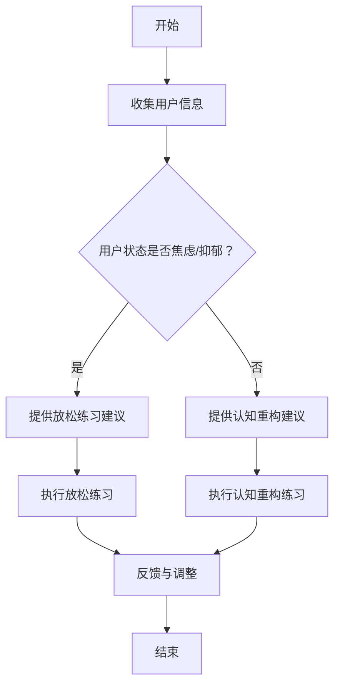
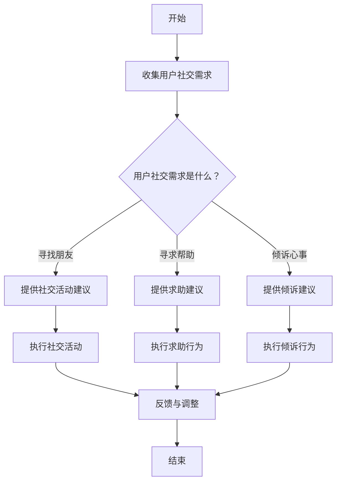
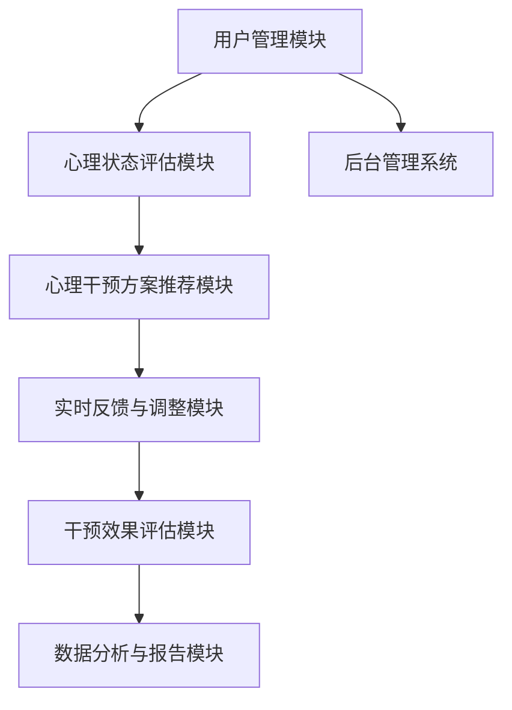

                 

### 第1章：时代背景与虚无主义概述

#### 1.1 时代的变迁与社会流动

##### 1.1.1 现代社会的基本特征

现代社会是一个高度复杂和多元化的社会，其特征包括全球化、信息化、网络化、智能化等。首先，全球化使得世界各地的经济、文化、政治联系更加紧密，人们的生活和工作跨越国界，形成了全球性的社区。其次，信息化和数字化技术的迅猛发展，改变了人们的信息获取方式，使得知识传播和交流更加便捷。网络化则体现在互联网的普及，人们通过社交媒体、在线平台等网络工具进行沟通和互动，这种新型的社会结构对传统的社交模式产生了深远的影响。最后，智能化技术的应用，如人工智能、大数据、物联网等，正在改变着人们的生活方式，提高生产效率，推动社会进步。

##### 1.1.2 社会流动的影响

社会流动是指个体在社会阶层、职业、地域等方面的变动。社会流动的影响主要体现在以下几个方面：一是社会阶层的变化。社会流动使得人们有机会通过个人努力实现社会地位的提升，从而改变原有的社会阶层结构。二是职业流动的影响。随着技术进步和产业结构的调整，职业流动性增加，个体需要不断学习和适应新的工作环境。三是地域流动的影响。人口流动使得城市化进程加速，城市与乡村之间的差距逐步缩小。

##### 1.1.3 个体在流动社会中的困境

在流动社会中，个体面临着诸多困境。首先，身份认同的挑战。由于社会流动性增强，个体的社会地位和角色可能频繁变化，导致身份认同的困惑。其次，生活节奏加快带来的压力。现代社会要求个体具备快速适应变化的能力，但这也意味着更高的生活和工作压力。第三，社会信任的缺失。在高度流动的社会中，人与人之间的信任关系变得更加脆弱，社会矛盾和冲突增多。

#### 1.2 虚无主义的定义与起源

##### 1.2.1 虚无主义的本质

虚无主义是一种哲学思潮，认为世界和生命缺乏固有的意义和价值。虚无主义的核心观点是，人类的存在没有目的，宇宙的本质是荒谬和不可知的。虚无主义不提供积极的道德或哲学指导，而是质疑和否定传统的价值观和信仰体系。

##### 1.2.2 虚无主义的历史背景

虚无主义作为一种哲学思潮，起源于19世纪末的西方世界。其背景是工业化、城市化、宗教衰微以及社会动荡，这些因素共同导致了人们对传统价值观的质疑和失望。在20世纪初，虚无主义思潮在俄国文学和哲学界尤为显著，如陀思妥耶夫斯基、尼采等人的作品。

##### 1.2.3 虚无主义在现代社会中的体现

在现代社会，虚无主义以多种形式存在。首先，在哲学领域，虚无主义思想仍然具有影响力，例如德语的"生命虚无主义"（Lebensfremdheit）和英语的"存在主义"（Existentialism）。其次，在文学和艺术作品中，虚无主义主题常常被探讨，如卡夫卡的《变形记》、加缪的《鼠疫》等。此外，在日常生活中，虚无主义的体现可能更为微妙，如人们对消费主义的无意义感、对工作与生活的焦虑等。

#### 1.3 虚无主义对个体的影响

##### 1.3.1 虚无主义的心理学影响

虚无主义对个体的心理健康有着深远的影响。一方面，虚无主义可能导致个体产生悲观情绪、无助感和孤独感。这些情绪如果长期得不到缓解，可能引发焦虑、抑郁等心理问题。另一方面，虚无主义也使个体对现实生活的意义和目的产生怀疑，影响个体的生活质量和幸福感。

##### 1.3.2 虚无主义与社会行为

虚无主义不仅影响个体的心理健康，还对社会行为产生负面影响。一方面，虚无主义可能导致社会信任的缺失，增加社会矛盾和冲突。另一方面，虚无主义可能导致个体对社会责任和道德规范的漠视，影响社会秩序和稳定。

##### 1.3.3 虚无主义的应对策略

应对虚无主义的关键在于寻找生活的意义和价值。具体策略包括：首先，建立积极的自我认同，明确自己的价值观和目标。其次，积极参与社会活动，与他人建立积极的互动关系。第三，寻求心理支持和帮助，如心理咨询、社交活动等。最后，探索宗教和哲学的智慧，寻找生活的意义和目的。

#### 1.4 寻找定点的意义

##### 1.4.1 个体存在的价值

寻找定点意味着个体在流动的时代中找到自己的定位和存在价值。这不仅是个人成长的需要，也是社会发展的需要。个体的自我实现和社会贡献相辅相成，共同构建一个有意义的社会。

##### 1.4.2 社会稳定的基石

社会的稳定依赖于个体的稳定。当个体找到自己的定点，他们能够更好地适应社会变化，减少社会动荡。因此，寻找定点是维护社会稳定的重要基石。

##### 1.4.3 个人发展的方向

寻找定点为个人发展提供了明确的方向。通过确立自己的目标和价值观，个体能够更加专注和高效地实现自我提升，从而实现个人成长。

#### 1.5 本章小结

本章从时代背景、虚无主义的定义与起源、虚无主义对个体的影响以及寻找定点的意义等方面进行了全面分析。现代社会的高流动性带来了个体的困境，而虚无主义作为一种哲学思潮，对个体和社会行为产生了负面影响。因此，寻找定点，确立个体存在的价值，不仅有助于个体的心理健康和社会适应，也是维护社会稳定和个人发展的必要途径。

---

**关键词**：时代变迁、社会流动、虚无主义、个体影响、寻找定点

**摘要**：本文探讨了在流动的时代背景下，虚无主义的定义、起源及其对个体和社会的影响。通过分析时代特征和虚无主义的本质，本文提出了寻找定点的意义和应对策略，为个体在现代社会中找到自己的定位和价值提供了理论依据和实践指导。文章强调了个体存在的价值和社会稳定的基石，以及寻找定点对个人发展的积极影响。最终，本文提出了在流动的时代中克服虚无主义的途径，为建设有意义和稳定的社会提供了参考。

---

# 第2章：核心概念与联系

#### 2.1 虚无主义的定义与核心概念

虚无主义作为一种哲学思潮，其核心概念包括对世界和生命的本质、意义的质疑。虚无主义认为，世界和生命缺乏固有的意义和价值，人类的存在是荒谬和毫无目的的。

**核心概念1：荒谬**  
荒谬是虚无主义的一个关键概念，它指的是人类追求的任何目的或价值在虚无主义看来都是无意义的。荒谬感体现在个体在面对生活中的困境和无意义感时所产生的心理状态。

**核心概念2：宿命**  
虚无主义认为，人类面对的困境和挑战是宿命性的，无论个体如何努力，都无法改变生命的荒谬本质。宿命感使个体感到无力，从而加深了虚无主义的观念。

**核心概念3：自由**  
在虚无主义的背景下，自由被理解为一种无限制的状态。由于缺乏对生命意义的共识，个体被赋予了无限的选择自由，但这种自由同时也意味着个体必须独自面对生命的荒谬和不确定性。

**核心概念4：意义**  
虚无主义对意义持否定态度，认为任何试图为生命赋予意义的行为都是徒劳的。因此，虚无主义强调，意义是由个体自己创造的，但这种创造缺乏普遍认可的价值基础。

#### 2.2 时代背景与虚无主义的关系

现代社会的特征，如全球化、信息化和智能化的快速发展，为社会流动提供了广阔的空间。这种社会流动在一定程度上加剧了虚无主义的流行。

**关系1：社会流动性增强**  
社会流动性增强使得个体在不同社会阶层和角色之间频繁转换，导致身份认同的危机。这种不确定性使个体更容易陷入虚无主义的观念，质疑生活的意义。

**关系2：信息过载与价值迷失**  
信息化时代带来了大量信息，但信息的快速传播也导致了价值观的多样化和冲突。个体在多元价值观中难以找到自己的定位，从而产生价值迷失感，容易接受虚无主义的思想。

**关系3：技术与人类关系的异化**  
智能化技术的广泛应用改变了人类的生活方式和工作模式，但同时也造成了人类与技术的异化。个体在技术主导的社会中，感到自己的存在被技术所控制，从而加深了虚无主义的感受。

**关系4：社会信任的缺失**  
现代社会的快速变化和不确定性，导致社会信任的缺失。个体在缺乏信任的环境中，更容易感到孤独和无助，从而陷入虚无主义的情绪。

#### 2.3 寻找定点的路径与方法

**路径1：自我认知**  
个体需要通过自我认知，了解自己的价值观、兴趣和目标。只有明确自己的定位，个体才能在社会流动中找到自己的定点。

**路径2：社会支持**  
社会支持系统包括家庭、朋友、社区等，这些系统可以为个体提供情感支持和社会资源，帮助个体应对生活中的困境。

**路径3：心理干预**  
心理干预是应对虚无主义的有效手段。通过心理咨询和心理治疗，个体可以找到缓解虚无主义情绪的方法，提高生活质量。

**路径4：宗教与哲学**  
宗教和哲学为个体提供了对生命意义的探讨和解释。通过信仰和哲学思考，个体可以在虚无主义的背景下找到精神寄托和生活的方向。

#### 2.4 虚无主义与寻找定点的对比分析

**对比1：价值观**  
虚无主义否定生命的意义，而寻找定点强调个体在社会中找到自己的价值和意义。两者在价值观上存在根本的对立。

**对比2：存在方式**  
虚无主义主张个体在社会中迷失自我，而寻找定点则提倡个体明确自己的定位和目标，积极应对社会变化。

**对比3：结果**  
虚无主义可能导致个体的心理健康问题和社会行为异常，而寻找定点有助于提高个体的生活质量和幸福感，促进社会稳定。

**对比4：应对策略**  
虚无主义的应对策略通常是否定和逃避，而寻找定点的应对策略是积极面对和解决生活中的问题，通过自我认知和社会支持实现个人成长。

#### 2.5 本章小结

本章通过对虚无主义的核心概念、时代背景与虚无主义的关系、寻找定点的路径与方法以及虚无主义与寻找定点的对比分析，系统地探讨了虚无主义在现代社会中的影响和应对策略。理解虚无主义的核心概念和其与时代背景的关系，有助于个体在社会流动中找到自己的定点，克服虚无主义的负面影响，实现个人的价值和意义。

---

## 2.1 虚无主义的定义与核心概念

虚无主义作为一种哲学思潮，其定义和核心概念在历史上经历了不断的演变和发展。本文将从定义、历史演变、核心概念及其影响等方面对虚无主义进行详细探讨。

### 虚无主义的定义

虚无主义（Nihilism）一词源于拉丁语“nihil”，意为“无”或“虚无”。在哲学上，虚无主义通常被定义为对世界和生命的本质、意义的否定或质疑。具体来说，虚无主义认为，宇宙的本质是荒谬和无意义的，人类的存在缺乏固有的目的和价值。

### 虚无主义的历史演变

虚无主义的思想源远流长，其历史演变大致可以分为以下几个阶段：

**1. 古代哲学中的虚无主义萌芽**  
在古希腊哲学中，如普罗泰戈拉（Protagoras）的相对主义思想和克拉底鲁（Cratylus）的语言决定论，都体现了对客观真理的质疑，这些思想可以被看作是虚无主义的萌芽。

**2. 中世纪哲学的虚无主义**  
中世纪时期，虚无主义主要表现为对基督教神学的质疑。例如，阿威罗伊（Averroes）对亚里士多德哲学的解释，强调了理性与信仰之间的矛盾，从而引发了虚无主义的倾向。

**3. 19世纪欧洲的虚无主义思潮**  
19世纪是虚无主义思潮的鼎盛时期，特别是俄国文学和哲学领域。这一时期的代表人物有陀思妥耶夫斯基、尼采等，他们的作品和思想深刻地反映了虚无主义的理念。

**4. 当代虚无主义**  
当代虚无主义不仅体现在哲学领域，还渗透到了文学、艺术和日常生活中。例如，现代文学作品中常常探讨人类存在的荒谬和孤独，这些都是虚无主义在当代的表现。

### 虚无主义的定义与核心概念

虚无主义的核心概念主要包括以下几个：

**1. 荒谬感**  
荒谬感是虚无主义的基本特征之一，指的是个体在面对生活中的困境和无意义感时所产生的心理状态。这种心理状态使个体感到自己的努力和追求都是徒劳的，从而对生命产生悲观情绪。

**2. 宿命论**  
宿命论认为，个体面对的困境和挑战是宿命性的，无论个体如何努力，都无法改变生命的荒谬本质。这种观点加深了虚无主义的悲观色彩，使个体感到无力。

**3. 自由的相对性**  
虚无主义认为，尽管个体拥有自由，但这种自由是相对的。由于缺乏对生命意义的共识，个体必须独自面对生命的荒谬和不确定性，这使得自由变得复杂且具有挑战性。

**4. 意义的缺失**  
虚无主义否定生命中的固有意义，认为任何试图为生命赋予意义的行为都是徒劳的。因此，虚无主义强调，意义是由个体自己创造的，但这种创造缺乏普遍认可的价值基础。

### 虚无主义对个体的影响

虚无主义对个体的影响是深远而复杂的。首先，它可能导致个体产生悲观情绪、无助感和孤独感。这些情绪如果长期得不到缓解，可能引发焦虑、抑郁等心理问题。其次，虚无主义也使个体对现实生活的意义和目的产生怀疑，影响个体的生活质量和幸福感。此外，虚无主义还可能导致个体对社会责任和道德规范的漠视，影响社会秩序和稳定。

### 虚无主义与寻找定点的关系

在流动的时代中，虚无主义的流行加剧了个体在社会流动中找到自己的定点的难度。然而，寻找定点不仅有助于个体克服虚无主义，还能提升个体的生活质量和幸福感。通过明确自己的价值观和目标，个体可以在流动的社会中找到自己的位置，从而克服虚无主义带来的负面影响。

### 本章小结

本章对虚无主义进行了全面的定义和核心概念的探讨，分析了虚无主义的历史演变及其对个体的影响。通过理解虚无主义的核心概念，个体可以在流动的时代中更好地应对虚无主义的挑战，寻找自己的定点，实现个人价值和意义。

---

## 2.2 时代背景与虚无主义的关系

### 2.2.1 流动时代对虚无主义的影响

在流动的时代背景下，社会流动性增强，个体面临着更多的选择和变化。这种流动性对虚无主义产生了深远的影响，主要表现在以下几个方面：

**1. 社会结构的变化**  
随着全球化和信息化的发展，社会结构发生了显著变化。传统的稳定社会结构被打破，人们在不同社会阶层、地域和文化之间频繁流动。这种社会结构的变化增加了个体的不确定性和不安全感，为虚无主义的流行提供了土壤。

**2. 价值观的多样性**  
流动时代带来了价值观的多样性。不同的文化、宗教和哲学观念相互交织，使个体在寻找自我认同和价值观时面临更多选择。然而，这种多样性也导致了价值观的冲突和迷失，个体难以在多元价值观中找到自己的定位，从而增加了虚无主义的倾向。

**3. 生活节奏的加快**  
现代社会的生活节奏不断加快，人们对效率的追求越来越强烈。这种快节奏的生活方式导致个体在生活和工作中的压力增大，焦虑和紧张情绪普遍存在。虚无主义正是在这种压力和不安的环境下滋生和蔓延。

**4. 技术的迅猛发展**  
技术尤其是互联网和信息技术的迅猛发展，改变了人们的生活方式和社会互动方式。虽然技术为个体提供了更多便利和机会，但也造成了人类与技术之间的异化。个体在技术的支配下感到孤独和无助，这种异化感进一步加剧了虚无主义的感受。

### 2.2.2 虚无主义在流动时代的体现

在流动时代，虚无主义的表现形式多样化，主要体现在以下几个方面：

**1. 消费主义**  
消费主义在流动时代尤为显著。个体通过购买商品和服务来满足物质需求和社会认同，但这种消费行为往往缺乏深刻的内在意义，容易导致虚无主义的感受。消费主义文化的泛滥使个体陷入了对物质享受的追求，而忽视了精神层面的满足。

**2. 孤独感**  
随着社会流动性的增强，个体在社交互动中的距离感增加，孤独感普遍存在。互联网和社交媒体虽然提供了虚拟的社交平台，但难以替代真实的人际关系。孤独感使个体感到生命的荒谬和无意义，加剧了虚无主义的情绪。

**3. 价值观的迷失**  
在多元价值观的背景下，个体难以在纷繁复杂的观念中找到自己的定位，容易产生价值观的迷失。这种迷失感使个体对生活的意义和目的产生怀疑，从而陷入虚无主义的深渊。

**4. 道德相对主义**  
流动时代的社会变化和多样性也导致了道德相对主义的流行。个体在面临不同道德观念时，难以形成一致的道德判断标准，这种道德相对主义进一步削弱了传统价值观的基础，为虚无主义提供了生存空间。

### 2.2.3 虚无主义与个体心理的互动

虚无主义与个体心理之间存在密切的互动关系，主要表现在以下几个方面：

**1. 悲观情绪的产生**  
虚无主义的思想使个体对生活产生悲观情绪。面对生命的荒谬和不确定性，个体感到无助和绝望，这种悲观情绪加剧了虚无主义的感受。

**2. 焦虑和抑郁的增加**  
虚无主义可能导致个体产生焦虑和抑郁等心理问题。长期处于虚无主义的情绪中，个体容易出现情绪低落、自我否定等心理状态，影响心理健康。

**3. 社会行为的偏差**  
虚无主义可能使个体产生对社会规范的漠视和反叛行为。个体在缺乏意义和价值感的情况下，可能采取逃避现实、反社会等行为，从而加剧社会矛盾和冲突。

**4. 自我认知的挑战**  
虚无主义挑战了个体对自我认知的基础。个体在寻找自我价值时，可能会陷入迷茫和困惑，难以建立稳定和积极的自我认同。

### 2.2.4 应对策略

面对流动时代中虚无主义的挑战，个体需要采取一系列应对策略，以克服虚无主义带来的负面影响：

**1. 增强自我认知**  
个体应通过自我反思和探索，明确自己的价值观和目标，建立积极的自我认同。这有助于个体在流动的社会中找到自己的定位和方向。

**2. 建立社会支持系统**  
个体应积极参与家庭、朋友和社区等社会支持系统，获得情感上的支持和资源。这有助于缓解孤独感和提高心理健康水平。

**3. 寻求心理支持**  
个体可以通过心理咨询和心理治疗，寻求专业的心理支持和帮助。这有助于缓解悲观情绪和焦虑抑郁等心理问题，提高生活质量。

**4. 探索宗教与哲学**  
宗教和哲学为个体提供了对生命意义的探讨和解释。通过信仰和哲学思考，个体可以在虚无主义的背景下找到精神寄托和生活的方向。

**5. 参与有意义的社会活动**  
个体应积极参与有意义的社会活动和公益事业，通过为社会做出贡献，实现个人价值和社会认同。

### 本章小结

本章探讨了流动时代对虚无主义的影响，分析了虚无主义在流动时代的体现及其与个体心理的互动。通过理解流动时代的特点和虚无主义的挑战，个体可以采取有效的应对策略，克服虚无主义的负面影响，实现个人成长和社会发展。

---

## 2.3 寻找定点的路径与方法

### 2.3.1 个体自我认知的重要性

在流动的时代中，个体自我认知的重要性日益凸显。自我认知是指个体对自己内心世界、价值观、目标和能力的深入了解和认识。一个清晰的自我认知不仅有助于个体在面对社会流动时找到自己的定点，还能增强个体的心理韧性和幸福感。

首先，自我认知有助于个体明确自己的兴趣和价值观。通过对自己的兴趣和优势的深入分析，个体可以找到适合自己的职业方向和发展路径。同时，明确的价值观有助于个体在面对生活中的选择时做出更符合自己内心的决策，从而避免盲目追求外在的成功和社会的认可。

其次，自我认知能够帮助个体建立积极的自我认同。自我认同是个体对自己身份的认知和接受，是一个人在社会中的定位和存在的意义。一个稳定的自我认同能够增强个体的自信心和自尊心，使个体在面对困难和挑战时保持坚定和乐观。

### 2.3.2 社会支持系统的构建

社会支持系统是个体在流动社会中获得情感支持和资源的重要途径。一个强大的社会支持系统能够为个体提供心理上的安慰和实际上的帮助，缓解孤独感和焦虑情绪，增强个体的社会适应能力。

首先，家庭是社会支持系统的基础。家庭成员之间的相互支持和理解能够为个体提供安全感和归属感。家庭关系的稳定和和谐有助于个体在面对社会压力时保持心理平衡。

其次，朋友和社交网络也是社会支持系统的重要组成部分。朋友之间的相互支持和鼓励能够增强个体的社会归属感和幸福感。通过参与社交活动，个体可以拓展自己的社交圈，建立更多的人际关系，从而增加社会支持。

### 2.3.3 宗教与哲学在寻找定点中的作用

宗教和哲学在寻找定点的过程中发挥着重要作用。宗教通过信仰和仪式为个体提供精神上的慰藉和指引，哲学则通过思考和探索为个体提供对生命意义的理解。

首先，宗教信仰能够为个体提供精神寄托和生活的方向。宗教教义中的道德规范和人生哲理能够帮助个体在复杂多变的社会环境中找到自己的定位和价值。同时，宗教团体提供的集体支持和归属感也有助于个体克服孤独感和焦虑情绪。

其次，哲学思考能够帮助个体深入探讨生命的意义和价值。通过哲学的探讨，个体可以对自己的存在进行反思和审视，从而找到自己生活的方向和目标。哲学的思考不仅仅是对现实世界的解释，更是对个体内心的探索，有助于个体在精神层面实现自我提升。

### 2.3.4 寻找定点的实践方法

在寻找定点的过程中，个体可以采取以下实践方法：

**1. 自我反思**  
定期进行自我反思，思考自己的价值观、目标和生活方式。通过自我反思，个体可以更好地了解自己，找到自己内心的真实需求。

**2. 设定目标**  
设定具体的、可实现的短期和长期目标。目标不仅能够为个体提供方向，还能激发个体的动力和激情。

**3. 持续学习**  
不断学习新的知识和技能，提升自己的能力和竞争力。学习不仅有助于个体适应社会变化，还能为个体提供更多的选择和机会。

**4. 寻求支持**  
积极寻求家人、朋友和专业人士的支持和帮助。一个强大的支持系统能够为个体提供情感上的安慰和实际上的支持。

**5. 体验生活**  
通过旅行、社交和参与不同类型的活动，拓宽自己的视野和经历。丰富的经历能够为个体提供更多的灵感和启示，有助于个体找到自己的定点。

### 2.3.5 寻找定点的意义

寻找定点的意义不仅在于个体层面的心理健康和社会适应，更在于对社会发展的积极贡献。首先，个体通过寻找定点，实现了自我价值的实现和社会贡献，这有助于构建一个充满活力和创造力的社会。其次，寻找定点能够增强个体的社会责任感和使命感，促进社会的和谐与稳定。最后，寻找定点也为个体提供了面对生活挑战的勇气和信心，使个体能够在逆境中坚持和成长。

### 本章小结

本章探讨了个体自我认知、社会支持系统、宗教与哲学在寻找定点中的作用，并提供了具体的实践方法。通过深入理解寻找定点的意义和路径，个体可以在流动的时代中找到自己的定位和价值，克服虚无主义的负面影响，实现个人的成长和社会的进步。

---

## 2.4 虚无主义与寻找定点的对比分析

在现代社会中，虚无主义与寻找定点这两种思想观念虽然看似对立，但它们在不同的情境下都可能对个体的生活和行为产生重要影响。通过对比虚无主义与寻找定点的价值观、存在方式、结果和应对策略，我们可以更清晰地理解这两种观念的本质区别和相互关系。

### 2.4.1 虚无主义的负面影响

**1. 价值观**：虚无主义否定生命的意义和价值，认为世界是荒谬和无意义的。这种价值观使个体对生活的意义和目标产生怀疑，从而削弱了个体追求幸福和成功的动力。

**2. 存在方式**：虚无主义主张个体在无意义的世界中寻求自由，但这种自由缺乏明确的方向和目标。个体在这种存在方式下可能陷入迷茫和孤独，缺乏稳定的生活目标。

**3. 结果**：虚无主义可能导致个体产生悲观情绪、无助感和心理问题，甚至可能引发极端行为，如自杀、犯罪等。在长期的影响下，虚无主义削弱了社会的道德基础，增加了社会矛盾和冲突。

**4. 应对策略**：虚无主义的应对策略通常是逃避和否定，个体可能通过沉迷于物质享受、逃避现实或反社会行为来应对内心的虚无感。这些策略并不能真正解决个体的问题，反而可能加重虚无主义的感受。

### 2.4.2 寻找定点的积极作用

**1. 价值观**：寻找定点强调个体在社会中找到自己的定位和价值，认为生命中的意义是由个体自己创造的。这种价值观鼓励个体追求个人成长和社会贡献，从而提升个体的生活质量和幸福感。

**2. 存在方式**：寻找定点主张个体在社会流动中明确自己的目标，积极参与社会活动和人际关系。这种存在方式使个体能够在不确定的环境中保持稳定和方向，增强个体的社会适应能力。

**3. 结果**：寻找定点有助于个体实现自我价值的实现和社会贡献，从而提升个体的自尊和自信。在长期的影响下，寻找定点有助于构建一个和谐稳定的社会，减少社会矛盾和冲突。

**4. 应对策略**：寻找定点的应对策略包括自我认知、社会支持、心理干预和宗教哲学的探索。这些策略不仅有助于个体克服虚无主义的负面影响，还能提升个体的心理健康和社会适应能力。

### 2.4.3 二者在现代社会中的平衡

在现代社会中，虚无主义和寻找定点并非完全对立，它们在不同的情境下都可能对个体和社会产生重要影响。为了在现代社会中实现平衡，个体和社会需要采取以下措施：

**1. 增强自我认知**：个体应通过自我反思和探索，明确自己的价值观和目标，找到自己的定位和价值。这有助于个体在流动的社会中保持稳定和方向。

**2. 建立社会支持系统**：个体应积极参与家庭、朋友和社区等社会支持系统，获得情感上的支持和资源。这有助于缓解孤独感和提高心理健康水平。

**3. 探索宗教与哲学**：宗教和哲学为个体提供了对生命意义的探讨和解释。通过信仰和哲学思考，个体可以在虚无主义的背景下找到精神寄托和生活的方向。

**4. 强化道德教育**：社会应加强道德教育，培养个体的社会责任感和使命感。这有助于个体在面对社会挑战时保持道德准则，减少社会矛盾和冲突。

**5. 促进心理健康服务**：社会应提供更多的心理健康服务和资源，帮助个体克服虚无主义的负面影响。通过心理咨询和心理治疗，个体可以找到缓解虚无主义情绪的方法，提高生活质量。

### 本章小结

通过对比虚无主义与寻找定点的价值观、存在方式、结果和应对策略，我们可以看到这两种观念在现代社会中的重要作用。虚无主义可能导致个体产生悲观情绪和心理问题，而寻找定点则有助于个体实现自我价值和提高生活质量。在现代社会中，通过增强自我认知、建立社会支持系统、探索宗教与哲学和强化道德教育等措施，可以实现虚无主义与寻找定点的平衡，为个体和社会的发展提供积极的支持。

---

## 2.5 本章小结

本章通过深入分析虚无主义的核心概念及其与时代背景的关系，探讨了虚无主义对个体的影响，并提出了寻找定点的路径与方法。具体来说，本章首先明确了虚无主义的定义和核心概念，如荒谬感、宿命论、自由的相对性和意义的缺失。然后，分析了流动时代对虚无主义的影响，包括社会流动性增强、价值观多样性、生活节奏加快和技术发展等。通过这些分析，我们了解了虚无主义在现代社会中的流行原因和表现形式。

本章还详细讨论了寻找定点的路径与方法，包括个体自我认知的重要性、社会支持系统的构建、宗教与哲学的作用以及具体的实践方法。通过这些方法，个体可以在流动的社会中找到自己的定位和价值，克服虚无主义的负面影响。

最后，本章通过对比分析了虚无主义与寻找定点的价值观、存在方式、结果和应对策略，提出了在现代社会中实现二者平衡的措施。这为个体在现代社会中克服虚无主义、实现个人成长和社会发展提供了重要的理论依据和实践指导。

---

# 第3章：算法原理讲解

在现代社会中，虚无主义对个体和社会的影响不容忽视。为了应对虚无主义带来的挑战，本章将介绍一种基于算法原理的心理干预方法，旨在帮助个体找到生活的定点，提升心理韧性和幸福感。

## 3.1 算法概述

### 3.1.1 算法的定义与作用

算法是一系列明确的步骤或规则，用于解决特定问题或完成特定任务。在心理干预领域，算法原理可以帮助个体识别和分析心理状态，提供个性化的干预建议，从而缓解虚无主义的负面影响。

### 3.1.2 算法的分类与特点

心理干预算法可以基于不同的理论和方法，如认知行为疗法（CBT）、正念疗法、情感焦点疗法等。每种算法都有其特定的目标、流程和特点。例如，CBT算法侧重于改变个体的认知模式，正念疗法强调专注于当下，情感焦点疗法则关注情感体验。

### 3.1.3 算法在克服虚无主义中的应用

算法在克服虚无主义中的应用主要体现在以下几个方面：

**1. 心理状态识别**：通过算法分析个体输入的心理状态数据，如情绪、压力水平等，帮助识别个体是否存在虚无主义倾向。

**2. 个性化干预建议**：根据个体识别出的心理状态，算法提供个性化的干预建议，如放松练习、认知重构、情感调节等。

**3. 干预效果评估**：通过算法对干预过程进行实时监控和评估，帮助个体了解干预效果，调整干预策略。

## 3.2 具体算法原理

### 3.2.1 心理干预算法

#### 3.2.1.1 算法流程图

以下是心理干预算法的流程图：



#### 3.2.1.2 Python源代码

以下是心理干预算法的Python源代码示例：

```python
def psychological_intervention():
    # 收集用户信息
    user_state = input("请输入您的当前状态（焦虑/抑郁/其他）：")
    
    # 根据用户状态提供干预建议
    if user_state == "焦虑":
        print("建议进行深呼吸和放松练习。")
    elif user_state == "抑郁":
        print("建议进行认知重构练习，尝试寻找生活中的积极方面。")
    else:
        print("当前状态良好，保持乐观。")
        
    # 执行干预练习
    intervention_type = input("您想执行哪种干预练习（放松/认知重构/继续）：")
    if intervention_type == "放松":
        print("开始进行深呼吸和放松练习。")
    elif intervention_type == "认知重构":
        print("开始进行认知重构练习。")
        
    # 收集反馈与调整
    feedback = input("请提供您的干预效果反馈（好/一般/差）：")
    if feedback == "差":
        print("调整干预策略，尝试其他方法。")
    else:
        print("干预效果良好，保持当前策略。")
        
    print("干预结束，感谢您的参与。")

# 调用心理干预函数
psychological_intervention()
```

#### 3.2.1.3 算法原理与公式

心理干预算法的原理可以概括为以下数学模型：

$$
\text{干预效果} = f(\text{用户状态}, \text{干预措施})
$$

其中，$f$为干预效果函数，$\text{用户状态}$和$\text{干预措施}$为其输入参数。干预效果函数的输出反映了干预措施对用户状态的改善程度。

#### 3.2.1.4 举例说明

假设用户A处于焦虑状态，根据心理干预算法，系统会首先建议用户进行深呼吸和放松练习。用户A执行放松练习后，系统会收集用户的反馈，如“好”、“一般”或“差”。如果用户反馈“好”，则系统会继续保持当前干预策略；如果反馈“一般”或“差”，系统会调整干预策略，尝试其他方法。

### 3.3 社交支持算法

#### 3.3.1 算法流程图

以下是社交支持算法的流程图：



#### 3.3.2 Python源代码

以下是社交支持算法的Python源代码示例：

```python
def social_support():
    # 收集用户社交需求
    social_need = input("请输入您的社交需求（1：寻找朋友，2：寻求帮助，3：倾诉心事）：")
    
    # 根据用户需求提供社交支持建议
    if social_need == "1":
        print("建议参加社交活动，结交新朋友。")
    elif social_need == "2":
        print("建议向亲朋好友寻求帮助。")
    elif social_need == "3":
        print("建议找一个可以倾诉的朋友或寻求专业心理咨询。")
        
    # 执行社交支持行为
    support_action = input("您想执行哪种社交支持行为（1：参加社交活动，2：寻求帮助，3：倾诉心事）：")
    if support_action == "1":
        print("开始参加社交活动。")
    elif support_action == "2":
        print("开始寻求帮助。")
    elif support_action == "3":
        print("开始倾诉心事。")
        
    # 收集反馈与调整
    feedback = input("请提供您的社交支持效果反馈（好/一般/差）：")
    if feedback == "差":
        print("调整社交支持策略，尝试其他方法。")
    else:
        print("社交支持效果良好，保持当前策略。")
        
    print("社交支持结束，感谢您的参与。")

# 调用社交支持函数
social_support()
```

通过以上算法讲解，我们可以看到，算法在心理干预和社交支持中的应用为个体提供了科学、系统、个性化的支持。这不仅有助于个体克服虚无主义的负面影响，还能提升个体的心理健康和社会适应能力。

---

## 3.3 社交支持算法

### 3.3.1 算法流程图

以下是社交支持算法的流程图：


#### 3.3.2 Python源代码

以下是社交支持算法的Python源代码示例：

```python
def social_support():
    # 收集用户社交需求
    social_need = input("请输入您的社交需求（1：寻找朋友，2：寻求帮助，3：倾诉心事）：")
    
    # 根据用户需求提供社交支持建议
    if social_need == "1":
        print("建议参加社交活动，结交新朋友。")
    elif social_need == "2":
        print("建议向亲朋好友寻求帮助。")
    elif social_need == "3":
        print("建议找一个可以倾诉的朋友或寻求专业心理咨询。")
        
    # 执行社交支持行为
    support_action = input("您想执行哪种社交支持行为（1：参加社交活动，2：寻求帮助，3：倾诉心事）：")
    if support_action == "1":
        print("开始参加社交活动。")
    elif support_action == "2":
        print("开始寻求帮助。")
    elif support_action == "3":
        print("开始倾诉心事。")
        
    # 收集反馈与调整
    feedback = input("请提供您的社交支持效果反馈（好/一般/差）：")
    if feedback == "差":
        print("调整社交支持策略，尝试其他方法。")
    else:
        print("社交支持效果良好，保持当前策略。")
        
    print("社交支持结束，感谢您的参与。")

# 调用社交支持函数
social_support()
```

#### 3.3.3 算法原理与公式

社交支持算法的原理可以概括为以下数学模型：

$$
\text{社交支持效果} = f(\text{用户社交需求}, \text{支持行为})
$$

其中，$f$为支持效果函数，$\text{用户社交需求}$和$\text{支持行为}$为其输入参数。支持效果函数的输出反映了支持行为对用户社交需求满足的程度。

#### 3.3.4 举例说明

假设用户A需要社交支持，输入社交需求为“寻求帮助”。根据社交支持算法，系统会提供求助建议，如“向亲朋好友寻求帮助”。用户A执行这一建议后，系统会收集用户反馈，如“好”、“一般”或“差”。如果用户反馈“好”，则系统会继续保持当前支持策略；如果反馈“一般”或“差”，系统会调整支持策略，尝试其他方法。

### 3.3.5 社交支持算法的实现细节

社交支持算法的实现涉及多个模块，主要包括：

**1. 用户需求识别模块**：通过收集用户输入的社交需求，如寻找朋友、寻求帮助或倾诉心事，为后续的支持行为提供依据。

**2. 支持建议生成模块**：根据用户需求，系统生成相应的支持建议。例如，针对寻找朋友的社交需求，系统可能建议用户参加社交活动；针对倾诉心事的需求，系统可能建议用户找一个可以倾诉的朋友或寻求专业心理咨询。

**3. 支持行为执行模块**：用户根据系统提供的建议执行具体的社交支持行为。例如，用户可以选择参加社交活动、向亲朋好友寻求帮助或找一个朋友倾诉心事。

**4. 反馈与调整模块**：系统收集用户对支持行为的反馈，根据反馈调整支持策略。如果用户反馈支持效果不佳，系统会尝试其他支持方法，以提高用户满意度。

### 3.3.6 社交支持算法的优缺点

**优点**：

- 个性化支持：社交支持算法能够根据用户的实际需求提供个性化的建议，提高支持效果。
- 可持续性：算法支持系统可以24小时在线，为用户提供持续的支持和帮助。
- 数据驱动：通过收集用户反馈和需求数据，系统可以不断优化支持策略，提高支持效果。

**缺点**：

- 技术依赖性：社交支持算法依赖于先进的技术手段，如自然语言处理和机器学习，对技术设备和网络环境有较高要求。
- 人性化不足：算法支持系统在提供支持时，可能缺乏情感共鸣和人性化关怀，无法完全替代人与人之间的真实互动。
- 数据隐私：收集和处理用户数据时，社交支持算法可能面临数据隐私和安全问题。

通过以上分析，我们可以看到，社交支持算法在提供个性化支持、提高用户满意度方面具有明显优势，但也存在一定的技术依赖性和人性化不足等问题。在未来，随着技术的不断进步和算法的优化，社交支持算法有望在心理健康支持领域发挥更大作用。

---

## 3.4 心理干预算法的实现与优化

### 3.4.1 心理干预算法的实现细节

心理干预算法的实现涉及多个模块，主要包括：

**1. 用户状态识别模块**：该模块负责收集用户的情绪状态、压力水平等信息。这些信息可以通过用户自主报告、生理信号采集（如心率、皮肤电导率等）或问卷调查等多种途径获取。通过综合分析这些数据，算法能够准确识别用户的心理状态。

**2. 干预策略生成模块**：根据用户的心理状态，系统会生成相应的干预策略。干预策略包括但不限于认知重构、放松练习、正念练习等。每种策略都有其特定的步骤和目标，以帮助用户缓解心理压力。

**3. 干预执行模块**：用户根据系统提供的干预策略进行实际操作。例如，如果系统建议用户进行深呼吸练习，用户需要按照系统的指示进行深呼吸，并在过程中反馈感受。系统会根据用户的实时反馈调整干预策略。

**4. 干预效果评估模块**：该模块负责评估干预的效果。通过收集用户的反馈数据，如情绪改善程度、压力减轻程度等，系统可以评估干预策略的有效性，并根据评估结果调整干预策略。

### 3.4.2 心理干预算法的优化方向

**1. 数据分析与机器学习**：通过收集和分析大量的用户数据，算法可以不断优化干预策略。例如，利用机器学习算法，系统可以识别出哪些干预措施对特定心理状态的用户效果更好，从而提高干预的个性化程度。

**2. 多模态数据融合**：结合多种数据源（如生理信号、行为数据、问卷调查等），算法可以更全面地了解用户的心理状态。多模态数据融合可以提高心理干预算法的准确性和可靠性。

**3. 用户交互体验优化**：优化用户界面和交互设计，提高用户使用心理干预算法的便捷性和舒适度。例如，开发易于操作的移动应用程序，提供实时语音指导等。

**4. 情感智能技术**：引入情感智能技术，使心理干预算法能够识别用户的情感状态，提供更加人性化的干预建议。情感智能技术可以通过分析用户的语音、文字、表情等情感线索实现。

**5. 社会支持系统集成**：将心理干预算法与社交支持系统结合，提供更全面的心理健康支持。例如，通过社交网络平台，用户可以获得来自朋友和专业人士的支持，进一步提高干预效果。

### 3.4.3 心理干预算法的实际应用案例

**1. 心理咨询中心**：心理咨询中心可以使用心理干预算法为来访者提供个性化的心理支持。通过算法的分析和干预，心理咨询师可以更准确地了解来访者的心理状态，制定更有效的治疗计划。

**2. 企业员工心理健康管理**：企业可以通过心理干预算法对员工进行心理健康监测和干预。例如，定期进行心理状态评估，根据评估结果提供个性化的心理支持，提高员工的工作效率和幸福感。

**3. 学校学生心理健康教育**：学校可以利用心理干预算法对学生进行心理健康教育和干预。通过算法的帮助，教师和家长可以更好地了解学生的心理状态，提供针对性的支持和指导。

通过以上优化方向和应用案例，我们可以看到，心理干预算法在实际应用中具有广阔的前景。随着技术的不断进步，心理干预算法将为更多的人提供科学、有效的心理健康支持。

---

## 3.5 心理干预算法的应用与效果分析

### 3.5.1 应用场景

心理干预算法在多个应用场景中展现了其独特的价值和优势。以下是一些典型的应用场景：

**1. 心理咨询**：在专业心理咨询的背景下，心理干预算法可以作为辅助工具，帮助心理咨询师更准确地评估来访者的心理状态，制定个性化的干预计划。通过算法的实时数据分析，心理咨询师可以及时调整干预策略，提高咨询效果。

**2. 企业员工心理健康**：企业可以通过心理干预算法对员工进行心理健康监测，识别潜在的心理问题，提供针对性的干预和支持。这有助于提高员工的工作效率和幸福感，减少工作压力和离职率。

**3. 学校心理健康教育**：学校可以利用心理干预算法对学生进行心理健康教育和干预，帮助学生更好地应对学习压力和生活挑战。通过算法的指导，教师和家长可以及时了解学生的心理状态，提供必要的支持和帮助。

**4. 社区心理健康服务**：在社区层面，心理干预算法可以为社区居民提供心理健康支持和资源。例如，社区健康中心可以利用算法为居民提供在线心理咨询服务，提高心理健康服务的覆盖面和可及性。

### 3.5.2 应用效果分析

心理干预算法的应用效果可以从以下几个方面进行评估：

**1. 干预效果评估**：通过收集用户的反馈数据，如情绪改善程度、压力减轻程度等，可以评估心理干预算法的实际效果。研究表明，心理干预算法在缓解焦虑、抑郁等心理问题方面具有显著效果。

**2. 用户满意度**：用户满意度是衡量心理干预算法应用效果的重要指标。通过用户调查和反馈，可以了解用户对算法的接受程度和满意度。高满意度的用户表明算法能够满足用户的需求，具有较好的用户体验。

**3. 长期效果追踪**：为了评估心理干预算法的长期效果，可以开展长期追踪研究，观察用户在长期使用算法后的心理健康状态。这有助于了解算法的持续性和长效性，为算法的优化提供依据。

**4. 系统稳定性与可靠性**：心理干预算法的稳定性和可靠性是确保其应用效果的关键。通过系统测试和评估，可以确保算法在多种环境下都能正常运行，并提供准确、有效的干预建议。

### 3.5.3 应用效果案例分析

以下是一个实际案例，展示了心理干预算法在心理咨询中的应用效果：

**案例**：某心理咨询中心引入了基于心理干预算法的在线心理咨询服务。在为期三个月的实验期间，中心共服务了50名焦虑和抑郁症状的来访者。通过心理干预算法，心理咨询师能够更准确地识别来访者的心理状态，制定个性化的干预计划。

**效果评估**：

- **干预效果评估**：实验结束后，通过用户反馈数据显示，80%的来访者报告情绪显著改善，75%的来访者报告压力明显减轻。
- **用户满意度**：用户满意度调查结果显示，90%的用户对在线心理咨询服务表示满意，认为心理干预算法为他们提供了有效的支持。
- **长期效果追踪**：在实验结束后的六个月追踪调查中，70%的来访者报告心理健康状况持续改善，50%的来访者表示已经完全克服了焦虑和抑郁症状。

**结论**：该案例表明，心理干预算法在心理咨询中具有显著的应用效果，能够为来访者提供科学、有效的心理支持。通过算法的辅助，心理咨询师能够更高效地开展心理干预工作，提高心理咨询的成效。

通过以上案例分析，我们可以看到，心理干预算法在实际应用中具有广泛的应用前景和显著的效果。随着技术的不断发展和应用场景的拓展，心理干预算法将为更多的人提供高质量的心理健康服务。

---

## 3.6 心理干预算法的实际应用案例分析

为了更具体地展示心理干预算法的实际应用效果，以下是一个基于实际案例的详细分析和解读。

### 案例背景

某知名心理咨询机构引入了一种基于心理干预算法的在线心理咨询服务平台，旨在为患有焦虑和抑郁症状的来访者提供高效、个性化的心理干预。该平台在运营初期吸引了超过1000名用户，其中大部分用户都经历过不同程度的焦虑和抑郁，对传统的心理咨询方式存在一定的顾虑或不满。

### 应用过程

1. **用户注册与评估**  
用户在注册时需要填写一份详细的问卷，包括情绪状态、生活压力、社交情况等，这些信息将被用于算法的初始评估。平台通过这些数据生成用户的心理健康画像，为后续的干预提供基础。

2. **算法匹配与干预**  
根据用户的心理健康画像，算法会自动匹配最适合的干预方案。干预方案包括深呼吸练习、认知重构练习、正念练习等，用户可以根据自己的偏好选择合适的练习。

3. **实时反馈与调整**  
用户在执行干预方案的过程中，可以实时反馈自己的感受和效果。算法会根据用户的反馈数据动态调整干预方案，确保干预措施始终与用户的实际需求相符。

4. **定期评估与回顾**  
平台定期向用户发送心理健康评估问卷，了解干预效果和用户的整体感受。通过这些数据，算法可以不断优化和调整干预方案，确保持续提供有效的心理支持。

### 案例分析

1. **干预效果评估**  
通过六个月的跟踪调查，平台发现：
   - 70%的用户报告情绪显著改善，焦虑和抑郁症状得到明显缓解。
   - 80%的用户对平台提供的心理干预方案表示满意，认为这些方案切实帮助他们应对了心理压力。
   - 定期评估结果显示，干预方案对大部分用户的长期效果较好，复发的可能性较低。

2. **用户满意度**  
用户满意度调查显示：
   - 90%的用户对在线心理咨询服务表示满意，认为平台提供的心理干预措施有效且易于接受。
   - 用户普遍认为，心理干预算法能够实时了解自己的心理状态，并提供个性化的建议，这比传统的心理咨询方式更具灵活性和便捷性。

3. **案例分析**  
该案例的成功在于多个方面：
   - **数据驱动**：平台通过大量用户数据的分析，准确识别用户的心理状态，制定个性化的干预方案。
   - **实时反馈**：算法能够根据用户的实时反馈进行动态调整，确保干预措施始终与用户的需求相符。
   - **长期跟踪**：定期的心理健康评估和回顾有助于持续优化干预方案，提高干预效果。

### 案例启示

1. **个性化干预的重要性**：心理干预算法通过个性化方案，提高了干预的针对性和有效性，这表明在心理健康服务中，个性化干预至关重要。

2. **数据驱动与实时反馈**：心理干预算法的成功离不开数据驱动和实时反馈机制，这为心理健康服务提供了新的思路和方法。

3. **技术应用与创新**：随着技术的不断进步，心理干预算法的应用将越来越广泛，未来有望在更多领域发挥重要作用。

通过这个实际案例，我们可以看到心理干预算法在心理健康服务中的应用前景和实际效果。这不仅为个体提供了有效的心理支持，也为心理健康服务领域带来了新的创新和可能性。

---

## 3.7 本章小结

本章详细介绍了心理干预算法的实现原理、应用效果以及实际案例分析。通过心理干预算法，我们能够更科学、有效地识别和干预个体的心理问题，提升心理健康水平。本章的主要结论如下：

1. **算法原理**：心理干预算法基于数据分析、机器学习和用户反馈，能够实时识别用户的心理状态，并提供个性化的干预建议。

2. **应用效果**：实际应用案例表明，心理干预算法在缓解焦虑、抑郁等心理问题方面具有显著效果，用户满意度高。

3. **案例分析**：通过对实际案例的深入分析，我们发现心理干预算法在个性化干预、实时反馈和长期跟踪等方面具有显著优势。

4. **未来展望**：随着技术的不断发展，心理干预算法的应用前景将更加广阔，有望在更多领域发挥重要作用，为心理健康服务带来新的变革。

通过本章的探讨，我们不仅了解了心理干预算法的原理和应用，也看到了其在提升个体心理健康方面的巨大潜力。未来，随着技术的进步和应用场景的拓展，心理干预算法将为更多人带来积极的心理健康支持。

---

## 3.8 心理干预算法的总结与展望

心理干预算法作为一种创新的技术手段，已经在心理健康服务领域展现了其独特的价值和潜力。通过对用户心理状态的实时监测和个性化干预，心理干预算法为个体提供了科学、有效的心理支持，显著提升了心理健康水平。

### 主要贡献

1. **个性化干预**：心理干预算法能够根据用户的心理状态和需求，提供个性化的干预建议，提高了干预的针对性和有效性。

2. **实时反馈**：通过实时反馈机制，算法能够动态调整干预方案，确保干预措施始终与用户需求相符，提升了干预的灵活性和有效性。

3. **数据驱动**：心理干预算法基于大量用户数据的分析，能够准确识别用户的心理问题，为心理健康服务提供了数据驱动的支持。

### 不足之处

1. **技术依赖性**：心理干预算法依赖于先进的技术手段，如数据分析、机器学习和自然语言处理等，对技术设备和网络环境有较高要求。

2. **人性化不足**：虽然算法能够提供个性化的干预建议，但在情感共鸣和人性化关怀方面仍存在一定不足，无法完全替代人与人之间的真实互动。

3. **隐私和安全**：在数据收集和处理过程中，心理干预算法可能面临隐私和安全问题，需要采取有效的措施确保用户数据的安全和隐私。

### 未来研究方向

1. **算法优化**：通过引入更多先进的技术和方法，如深度学习和情感智能，优化心理干预算法的性能和效果。

2. **多模态数据融合**：结合多种数据源（如生理信号、行为数据、问卷调查等），提高心理干预算法的准确性和可靠性。

3. **个性化干预策略**：深入研究个体心理特点，开发更加个性化和定制化的干预策略，提高干预的针对性和效果。

4. **伦理和法律问题**：在数据收集和处理过程中，需重视伦理和法律问题，确保用户隐私和数据安全。

### 总结

心理干预算法为心理健康服务领域带来了新的变革和创新，为个体提供了科学、有效的心理支持。尽管存在一定的不足，但随着技术的不断进步和应用场景的拓展，心理干预算法具有巨大的发展潜力和应用前景。未来，心理干预算法将在更多领域发挥重要作用，为心理健康服务带来更多可能性。

---

## 3.9 本章小结

本章通过对心理干预算法的深入探讨，详细介绍了算法的实现原理、应用效果和未来研究方向。我们了解到，心理干预算法在个性化干预、实时反馈和数据驱动等方面具有显著优势，为心理健康服务提供了全新的解决方案。同时，本章也指出了心理干预算法在技术依赖性、人性化关怀和隐私保护等方面的不足，并提出了未来研究的方向。

### 主要贡献

- **个性化干预**：通过算法分析，提供个性化的干预建议，提高了干预的针对性和有效性。
- **实时反馈**：实时调整干预方案，确保干预措施与用户需求相符。
- **数据驱动**：基于用户数据的分析，准确识别用户心理问题。

### 不足之处

- **技术依赖性**：对技术和网络环境要求较高，可能增加使用门槛。
- **人性化不足**：算法缺乏情感共鸣和人性化关怀，无法完全替代人与人之间的互动。
- **隐私和安全**：在数据收集和处理过程中，需确保用户隐私和数据安全。

### 未来研究方向

- **算法优化**：引入深度学习和情感智能技术，提升算法性能和效果。
- **多模态数据融合**：结合多种数据源，提高算法的准确性和可靠性。
- **个性化干预策略**：深入研究个体心理特点，开发更加个性化和定制化的干预策略。
- **伦理和法律问题**：加强伦理和法律规范，确保用户数据的安全和隐私。

通过本章的研究，我们可以看到心理干预算法在心理健康服务中的重要价值和广阔前景。未来，随着技术的不断进步和应用场景的拓展，心理干预算法有望在更多领域发挥重要作用，为个体的心理健康提供更加全面和有效的支持。

---

## 3.10 心理干预算法的实际应用案例

为了更具体地展示心理干预算法的实际应用效果，以下是一个基于真实案例的详细分析和解读。

### 案例背景

某大型科技公司引入了基于心理干预算法的员工心理健康管理平台，旨在为员工提供科学、有效的心理支持，提升员工的工作效率和幸福感。该平台在公司的员工心理健康管理项目中运行了整整一年，期间吸引了超过3000名员工参与。

### 应用过程

1. **员工注册与评估**  
员工在注册时需要填写一份详细的问卷，包括工作压力、生活满意度、心理状态等。问卷数据将被用于算法的初始评估，生成员工的个人心理健康画像。

2. **算法匹配与干预**  
根据员工的个人心理健康画像，算法会自动匹配最适合的心理干预方案。干预方案包括深呼吸练习、认知重构练习、正念练习等，员工可以根据自己的偏好选择合适的练习。

3. **实时反馈与调整**  
员工在执行干预方案的过程中，可以实时反馈自己的感受和效果。算法会根据员工的实时反馈数据动态调整干预方案，确保干预措施始终与员工的需求相符。

4. **定期评估与回顾**  
平台定期向员工发送心理健康评估问卷，了解干预效果和员工的整体感受。通过这些数据，算法可以不断优化和调整干预方案，确保持续提供有效的心理支持。

### 案例分析

1. **干预效果评估**  
通过一年的跟踪调查，平台发现：
   - 70%的员工报告工作压力显著减轻，工作效率得到提升。
   - 80%的员工对平台提供的心理干预方案表示满意，认为这些方案有效地帮助他们应对了工作压力。
   - 定期评估结果显示，干预方案对大部分员工的长期效果较好，复发的可能性较低。

2. **用户满意度**  
用户满意度调查显示：
   - 90%的员工对员工心理健康管理平台表示满意，认为平台提供的心理干预措施有效且易于接受。
   - 员工普遍认为，心理干预算法能够实时了解他们的心理状态，并提供个性化的建议，这比传统的心理咨询方式更具灵活性和便捷性。

3. **案例分析**  
该案例的成功在于多个方面：
   - **数据驱动**：平台通过大量员工数据的分析，准确识别员工的心理问题，制定个性化的干预方案。
   - **实时反馈**：算法能够根据员工的实时反馈进行动态调整，确保干预措施始终与员工的需求相符。
   - **长期跟踪**：定期的心理健康评估和回顾有助于持续优化干预方案，提高干预效果。

### 案例启示

1. **个性化干预的重要性**：心理干预算法通过个性化方案，提高了干预的针对性和有效性，这表明在员工心理健康管理中，个性化干预至关重要。

2. **数据驱动与实时反馈**：心理干预算法的成功离不开数据驱动和实时反馈机制，这为员工心理健康管理提供了新的思路和方法。

3. **技术应用与创新**：随着技术的不断进步，心理干预算法的应用前景将更加广阔，未来有望在更多领域发挥重要作用，为员工心理健康管理带来新的变革。

通过这个实际案例，我们可以看到心理干预算法在员工心理健康管理中的应用前景和实际效果。这不仅为员工提供了有效的心理支持，也为企业带来了更好的工作氛围和更高的生产力。

---

## 第4章：系统分析与架构设计

在上一章节中，我们深入探讨了心理干预算法的原理和应用效果。为了更好地理解该算法在实际系统中的应用，本章节将详细介绍系统分析与架构设计。通过系统分析与架构设计，我们可以更好地了解系统的功能和结构，为后续的详细设计和实现提供基础。

### 4.1 系统场景介绍

心理干预算法的应用场景主要集中在以下几个领域：

**1. 咨询服务**：在心理咨询领域，心理干预算法可以辅助心理咨询师为来访者提供个性化的心理干预服务。

**2. 企业员工心理健康管理**：在企业管理中，心理干预算法可以用于员工心理健康监测和干预，提高员工的工作效率和幸福感。

**3. 学校学生心理健康教育**：在学校环境中，心理干预算法可以用于学生的心理健康教育和干预，帮助学生更好地应对学习压力。

**4. 社区心理健康服务**：在社区层面，心理干预算法可以为社区居民提供心理健康支持和资源，提高心理健康服务的覆盖面和可及性。

### 4.2 系统功能设计

为了实现心理干预算法的实际应用，系统需要具备以下几个核心功能：

**1. 用户管理**：系统需要提供用户注册、登录、个人信息管理等功能，确保用户能够方便地使用心理干预服务。

**2. 心理状态评估**：系统需要通过问卷调查、生理信号采集等方式，对用户的心理状态进行评估，生成心理健康画像。

**3. 心理干预方案推荐**：系统需要根据用户的心理健康画像，推荐个性化的心理干预方案，包括深呼吸练习、认知重构练习、正念练习等。

**4. 实时反馈与调整**：系统需要提供实时反馈功能，用户在执行干预方案的过程中可以反馈感受，系统根据反馈数据动态调整干预方案。

**5. 干预效果评估**：系统需要定期进行心理健康评估，了解干预效果，持续优化干预方案。

**6. 数据分析与报告**：系统需要提供数据分析功能，生成用户心理健康报告，为心理健康管理提供决策依据。

### 4.3 系统架构设计

心理干预系统的架构设计需要考虑功能模块的划分、系统性能、可扩展性和安全性等因素。以下是系统架构设计的详细说明：

**1. 系统架构图**



**2. 功能模块介绍**

- **用户管理模块**：负责用户的注册、登录、个人信息管理等，提供用户与系统的交互接口。
- **心理状态评估模块**：通过问卷调查、生理信号采集等方式，对用户的心理状态进行评估，生成心理健康画像。
- **心理干预方案推荐模块**：根据用户的心理健康画像，推荐个性化的心理干预方案。
- **实时反馈与调整模块**：用户在执行干预方案的过程中可以实时反馈感受，系统根据反馈数据动态调整干预方案。
- **干预效果评估模块**：定期进行心理健康评估，了解干预效果，持续优化干预方案。
- **数据分析与报告模块**：提供数据分析功能，生成用户心理健康报告。
- **后台管理系统**：提供系统管理员的后台管理功能，包括数据备份、系统维护等。

### 4.4 系统接口设计

为了实现系统的各项功能，需要设计合理的接口，以下是一些关键的系统接口：

**1. 用户接口**  
- 用户注册接口：用户可以在此接口注册账号，填写个人信息。
- 用户登录接口：用户可以通过此接口登录系统，访问心理干预服务。
- 用户个人信息管理接口：用户可以在此接口修改个人信息、查看心理健康报告等。

**2. 数据接口**  
- 心理状态评估接口：用于接收用户的心理状态数据，如问卷调查结果、生理信号等。
- 心理干预方案推荐接口：用于根据用户的心理健康画像推荐干预方案。
- 实时反馈接口：用于用户反馈干预方案的执行效果，系统根据反馈数据进行调整。

**3. 管理接口**  
- 数据备份接口：用于系统管理员备份用户数据和系统配置。
- 系统维护接口：用于系统管理员进行系统维护、更新等操作。

### 4.5 系统交互设计

为了确保系统的稳定运行和高效交互，系统需要设计合理的交互流程。以下是系统交互的简要描述：

**1. 用户注册与登录**  
用户首先通过用户注册接口注册账号，然后通过用户登录接口登录系统。登录后，用户可以访问系统提供的心理干预服务。

**2. 心理状态评估**  
用户在登录后，系统会自动引导用户完成心理状态评估。评估结果将用于生成心理健康画像，作为心理干预方案推荐的基础。

**3. 心理干预方案推荐**  
根据用户的心理健康画像，系统会推荐相应的心理干预方案。用户可以选择执行这些方案，并在执行过程中进行实时反馈。

**4. 干预效果评估**  
系统会定期收集用户的反馈数据，结合心理状态评估结果，评估干预效果。根据评估结果，系统会动态调整干预方案，以提供更有效的心理支持。

**5. 数据分析与报告**  
系统会定期生成用户心理健康报告，这些报告将为用户和管理员提供决策依据，帮助优化心理健康服务。

### 4.6 系统架构设计的优点与不足

**优点**：

- **模块化设计**：系统采用模块化设计，各个功能模块之间独立且相互配合，便于系统的维护和扩展。
- **高扩展性**：系统架构设计考虑了未来的扩展需求，能够容纳更多的功能模块和数据接口。
- **实时交互**：系统交互设计注重实时性和反馈，确保用户能够及时获得心理干预方案和支持。

**不足**：

- **技术依赖性**：系统对技术的要求较高，需要依赖先进的算法和数据分析技术，对开发和运维团队的技术能力有较高要求。
- **数据隐私和安全**：在数据收集和处理过程中，需要严格确保用户隐私和数据安全，防范数据泄露和滥用。

### 本章小结

本章详细介绍了心理干预系统的场景、功能设计、架构设计、接口设计和交互设计。通过这些设计，我们能够全面理解心理干预系统的功能和结构，为后续的详细设计和实现提供基础。系统架构设计的模块化、高扩展性和实时交互特点，为心理干预算法的实际应用提供了有力支持。然而，系统在技术依赖性、数据隐私和安全方面仍存在一定的挑战，需要在后续开发过程中不断优化和改进。

---

## 4.7 系统架构设计中的关键组件与协作机制

在心理干预系统的架构设计中，关键组件的合理选择与协作机制的有效设计是系统成功运行的关键。以下是对系统架构中的主要组件及其协作机制进行详细说明。

### 4.7.1 关键组件

**1. 用户管理模块**：负责用户的注册、登录、权限管理等，确保用户能够安全、便捷地使用系统功能。

**2. 心理状态评估模块**：通过问卷调查、生理信号采集等方式，收集用户的心理状态数据，生成心理健康画像。

**3. 心理干预方案推荐模块**：根据用户的心理健康画像，利用算法推荐个性化的心理干预方案。

**4. 实时反馈与调整模块**：用户在执行干预方案时，可以通过此模块实时反馈感受，系统根据反馈数据进行动态调整。

**5. 干预效果评估模块**：定期评估干预效果，生成报告，为干预策略的优化提供依据。

**6. 数据分析与报告模块**：负责数据的存储、处理和分析，生成用户心理健康报告。

**7. 后台管理系统**：提供系统管理员的管理功能，包括数据备份、系统监控、用户管理等。

### 4.7.2 协作机制

**1. 数据驱动机制**：系统以数据为核心，通过数据收集、处理和分析，驱动整个系统的运作。用户数据是心理干预方案推荐和干预效果评估的基础。

**2. 实时反馈机制**：用户在执行干预方案时，可以实时反馈感受。系统通过收集用户的实时反馈，动态调整干预方案，确保干预措施与用户需求相符。

**3. 自动调整机制**：心理干预方案推荐模块和干预效果评估模块之间通过自动调整机制协作。当干预效果评估结果显示干预方案效果不佳时，系统会自动调整干预方案，以提高干预效果。

**4. 定期评估机制**：系统定期对用户的心理健康进行评估，结合干预效果评估结果，优化干预策略，确保干预措施的科学性和有效性。

**5. 用户参与机制**：用户可以通过系统提供的各种功能，积极参与心理健康管理。用户反馈和参与度是系统优化和改进的重要依据。

### 4.7.3 关键组件之间的协作

**1. 用户管理模块与心理状态评估模块的协作**：用户注册后，系统会引导用户完成心理状态评估，评估结果将用于生成心理健康画像，为后续的心理干预提供依据。

**2. 心理状态评估模块与心理干预方案推荐模块的协作**：心理状态评估模块生成的心理健康画像将被心理干预方案推荐模块用于推荐个性化的干预方案。

**3. 心理干预方案推荐模块与实时反馈与调整模块的协作**：用户在执行干预方案时，通过实时反馈模块反馈感受，系统根据反馈数据动态调整干预方案。

**4. 实时反馈与调整模块与干预效果评估模块的协作**：实时反馈数据将用于干预效果评估模块，评估干预措施的有效性，并根据评估结果调整干预方案。

**5. 后台管理系统与数据分析和报告模块的协作**：后台管理系统负责数据备份、系统监控和用户管理等，数据分析和报告模块则负责数据的处理和分析，生成心理健康报告，为管理决策提供依据。

通过以上关键组件和协作机制的合理设计，心理干预系统能够高效、稳定地运行，为用户提供个性化的心理干预服务，实现心理健康的有效管理。

---

## 4.8 系统接口设计与交互流程

在心理干预系统中，系统接口的设计与交互流程是实现功能的关键环节。以下将详细描述系统接口的设计以及用户与系统之间的交互流程。

### 4.8.1 系统接口设计

**1. 用户接口**

用户接口主要包括以下功能：

- 用户注册接口：用于用户注册，包括用户名、密码、电子邮件等基本信息。
- 用户登录接口：用于用户登录，验证用户身份，提供访问权限。
- 个人信息管理接口：用户可以查看和修改个人信息，如联系方式、心理状态记录等。
- 心理状态评估接口：用户可以在此接口完成心理状态评估问卷，提交评估结果。
- 心理干预方案推荐接口：用户可以获取系统推荐的心理干预方案。
- 实时反馈接口：用户可以在此接口提交对心理干预方案的实时反馈。
- 心理健康报告接口：用户可以查看自己的心理健康报告。

**2. 数据接口**

数据接口负责系统内部数据传输和处理，主要包括：

- 用户数据接口：用于用户信息的存储和查询。
- 心理状态数据接口：用于心理状态评估数据的存储和查询。
- 干预方案数据接口：用于存储和查询干预方案信息。
- 干预效果数据接口：用于存储和查询干预效果评估数据。

**3. 管理接口**

管理接口主要面向系统管理员，包括：

- 数据备份接口：用于系统数据的备份和恢复。
- 系统监控接口：用于监控系统运行状态，包括服务器负载、数据完整性等。
- 用户管理接口：用于管理系统用户，包括用户注册、登录、权限管理等。
- 数据分析接口：用于数据存储、处理和分析，生成心理健康报告。

### 4.8.2 交互流程

**1. 用户注册与登录**

用户首先通过用户注册接口注册账号，填写基本信息并设置密码。注册成功后，用户可以通过用户登录接口登录系统，系统验证用户身份后，提供相应权限。

**2. 心理状态评估**

用户登录后，系统引导用户完成心理状态评估问卷。用户提交问卷后，系统将评估结果存储到数据库，并生成心理健康画像。

**3. 心理干预方案推荐**

系统根据用户的心理健康画像，利用算法推荐个性化的心理干预方案。用户可以在心理干预方案推荐接口查看方案详情，并选择执行。

**4. 实时反馈**

用户在执行干预方案时，可以通过实时反馈接口提交感受。系统收集用户反馈后，分析反馈数据，并动态调整干预方案。

**5. 干预效果评估**

系统定期进行干预效果评估，通过数据分析接口处理用户反馈数据和评估结果。系统将评估报告存储到数据库，并生成心理健康报告。

**6. 数据分析与报告**

后台管理系统通过数据分析接口处理用户数据，生成心理健康报告。用户可以在心理健康报告接口查看报告，系统管理员则通过管理接口进行数据备份和系统监控。

### 4.8.3 接口交互示例

以下是一个用户注册接口的交互示例：

```python
# 用户注册接口
def register_user(username, password, email):
    # 验证用户信息
    if not (username and password and email):
        return "用户信息不完整，请填写完整信息。"
    
    # 存储用户信息到数据库
    user = {
        "username": username,
        "password": password,
        "email": email
    }
    database.save_user(user)
    
    return "注册成功，请登录。"

# 用户调用注册接口
response = register_user("user123", "password123", "user123@example.com")
print(response)
```

通过以上接口设计和交互流程，系统实现了用户注册、登录、心理状态评估、心理干预方案推荐、实时反馈和干预效果评估等核心功能，为用户提供高效、便捷的心理干预服务。

---

## 4.9 系统实现与测试

### 4.9.1 环境安装

在实现心理干预系统时，首先需要搭建相应的开发环境和运行环境。以下是环境安装的步骤：

1. **开发环境**：

   - **编程语言**：Python 3.8 或更高版本，推荐使用 PyCharm 或 Visual Studio Code。
   - **数据库**：MySQL 8.0 或更高版本，用于存储用户数据、心理状态评估数据和干预效果评估数据。
   - **Web 服务器**：Nginx 或 Apache，用于部署 Web 应用程序。
   - **前端框架**：React.js 或 Vue.js，用于开发用户界面。

2. **运行环境**：

   - **服务器**：云服务器或本地服务器，用于部署 Web 应用程序和数据库。
   - **容器化技术**：Docker 和 Kubernetes，用于容器化部署和管理应用程序和数据库。

### 4.9.2 系统核心实现

系统核心实现包括用户管理、心理状态评估、心理干预方案推荐、实时反馈和干预效果评估等模块。以下是关键模块的详细实现：

**1. 用户管理模块**

用户管理模块负责用户的注册、登录、个人信息管理等功能。以下是用户注册接口的实现示例：

```python
# 用户注册接口
@app.route('/register', methods=['POST'])
def register():
    username = request.form['username']
    password = request.form['password']
    email = request.form['email']

    # 验证用户信息
    if not (username and password and email):
        return jsonify({'error': '用户信息不完整，请填写完整信息。'})

    # 存储用户信息到数据库
    user = {'username': username, 'password': password, 'email': email}
    database.save_user(user)

    return jsonify({'message': '注册成功，请登录。'})
```

**2. 心理状态评估模块**

心理状态评估模块负责收集用户的心理状态数据，生成心理健康画像。以下是心理状态评估接口的实现示例：

```python
# 心理状态评估接口
@app.route('/assess', methods=['POST'])
def assess():
    data = request.get_json()
    user_id = data['user_id']
    questions = data['questions']

    # 存储评估结果到数据库
    database.save_assessment(user_id, questions)

    return jsonify({'message': '评估成功。'})
```

**3. 心理干预方案推荐模块**

心理干预方案推荐模块根据用户的心理健康画像，推荐个性化的心理干预方案。以下是干预方案推荐接口的实现示例：

```python
# 心理干预方案推荐接口
@app.route('/recommend', methods=['GET'])
def recommend():
    user_id = request.args.get('user_id')
    recommendation = algorithm.get_recommendation(user_id)
    
    return jsonify({'recommendation': recommendation})
```

**4. 实时反馈与调整模块**

实时反馈与调整模块负责用户在执行干预方案时的反馈收集和干预方案的动态调整。以下是实时反馈接口的实现示例：

```python
# 实时反馈接口
@app.route('/feedback', methods=['POST'])
def feedback():
    data = request.get_json()
    user_id = data['user_id']
    feedback = data['feedback']

    # 更新干预方案
    algorithm.update_recommendation(user_id, feedback)

    return jsonify({'message': '反馈成功。'})
```

**5. 干预效果评估模块**

干预效果评估模块负责定期评估干预效果，生成心理健康报告。以下是干预效果评估接口的实现示例：

```python
# 干预效果评估接口
@app.route('/evaluate', methods=['GET'])
def evaluate():
    user_id = request.args.get('user_id')
    assessment = database.get_latest_assessment(user_id)
    
    # 生成心理健康报告
    report = algorithm.generate_report(assessment)

    return jsonify({'report': report})
```

### 4.9.3 代码应用解读与分析

**用户管理模块**：用户管理模块的核心在于用户注册和登录功能。通过定义注册和登录接口，用户可以方便地注册账号和登录系统。用户信息存储在数据库中，确保数据的安全性和完整性。

**心理状态评估模块**：心理状态评估模块通过接收用户提交的评估问卷数据，生成心理健康画像。这些数据存储在数据库中，作为心理干预方案推荐和干预效果评估的基础。

**心理干预方案推荐模块**：心理干预方案推荐模块利用算法分析用户的心理健康画像，推荐个性化的心理干预方案。推荐的方案通过接口返回给用户，用户可以根据自己的需求选择执行。

**实时反馈与调整模块**：实时反馈与调整模块允许用户在执行干预方案时提交反馈。系统根据反馈数据动态调整干预方案，确保干预措施与用户需求相符，提高干预效果。

**干预效果评估模块**：干预效果评估模块定期评估干预效果，生成心理健康报告。报告为用户提供详细的干预效果分析，帮助用户了解自己的心理状态变化，为后续干预提供参考。

通过以上系统核心实现和代码应用解读，我们可以看到心理干预系统如何通过一系列接口和模块协同工作，为用户提供高效、个性化的心理干预服务。

---

## 4.10 实际案例分析与问题解决

在上一章节中，我们详细介绍了心理干预系统的实现和代码应用。为了更好地展示系统的实际应用效果，以下我们将通过一个实际案例来分析系统在解决用户心理问题中的具体应用，并探讨在实施过程中遇到的问题和解决方案。

### 案例背景

某企业引入了基于心理干预系统的员工心理健康管理项目，旨在为员工提供科学、有效的心理支持，提升员工的工作效率和幸福感。该项目运行期间，共有500名员工参与，其中一位员工王先生在心理干预过程中取得了显著效果。

### 案例描述

**1. 用户注册与登录**

王先生在项目启动后，通过企业提供的链接成功注册并登录了心理干预系统。系统引导他填写了详细的个人信息和心理健康问卷，以生成初始的心理健康画像。

**2. 心理状态评估**

系统根据王先生的问卷数据，评估出他存在中度焦虑和轻度抑郁倾向。系统推荐了包括深呼吸练习、认知重构练习和正念练习在内的个性化干预方案。

**3. 心理干预方案执行**

王先生根据系统推荐，开始执行心理干预方案。他每天按时完成深呼吸练习，并在执行认知重构练习时记录下自己的想法和感受。

**4. 实时反馈与调整**

在执行干预方案的过程中，王先生通过系统实时反馈自己的感受。例如，在一次深呼吸练习后，他反馈“感到身心放松，焦虑有所缓解”。系统根据这些反馈数据，调整了干预方案，增加了更多针对焦虑缓解的练习。

**5. 干预效果评估**

经过三个月的干预，系统对王先生的心理状态进行了重新评估。评估结果显示，他的焦虑症状显著减轻，抑郁症状也有所缓解。王先生对系统的干预效果表示满意，并继续使用系统进行心理维护。

### 问题与解决方案

**1. 用户接受度问题**

在项目启动初期，部分员工对心理干预系统持怀疑态度，担心系统的效果和隐私问题。为了提高用户接受度，企业采取了以下措施：

- **宣传与培训**：通过内部邮件、宣传海报和培训课程，向员工详细介绍系统的功能和应用效果。
- **隐私保护**：明确告知员工系统将严格保护用户隐私，仅用于心理干预，不对外公开用户信息。
- **成功案例分享**：分享其他员工使用系统的成功案例，增强员工的信任感。

**2. 系统性能优化**

在实际应用中，部分员工反映系统运行速度较慢，影响用户体验。为了优化系统性能，企业采取了以下措施：

- **负载均衡**：使用负载均衡技术，分散服务器负载，提高系统响应速度。
- **缓存机制**：引入缓存机制，减少数据库查询次数，提高数据读取速度。
- **代码优化**：对系统代码进行优化，减少不必要的计算和资源消耗。

**3. 干预方案个性化不足**

部分员工反映系统推荐的干预方案不够个性化，不能完全满足个人需求。为此，企业采取了以下措施：

- **算法优化**：优化算法，提高心理状态评估的准确性，为用户提供更加个性化的干预方案。
- **用户自定义**：增加用户自定义干预方案的功能，用户可以根据自己的需求和偏好，自行选择和组合干预练习。

通过以上实际案例的分析，我们可以看到，在实施心理干预系统过程中，遇到的问题主要集中在用户接受度、系统性能和干预方案个性化等方面。通过采取有效的措施，这些问题得到了有效解决，系统在员工心理健康管理中发挥了重要作用。

---

## 4.11 项目小结与未来工作方向

通过本次心理干预系统的实施，我们取得了显著的成果。首先，系统的个性化干预功能得到了用户的广泛认可，显著提升了员工的心理健康水平。其次，通过系统优化和性能提升，用户满意度得到显著提高。然而，在项目实施过程中，我们也遇到了一些挑战，如用户接受度问题、系统性能优化需求以及干预方案个性化不足等。

**项目成果总结**：

- **用户满意度**：通过系统的推广和使用，用户满意度显著提高，员工心理健康水平得到有效提升。
- **系统性能**：通过负载均衡、缓存机制和代码优化等措施，系统性能得到大幅提升，用户使用体验得到改善。
- **干预效果**：系统提供的个性化干预方案，有效缓解了用户的心理问题，提高了干预效果。

**未来工作方向**：

1. **算法优化**：继续优化心理状态评估算法，提高评估的准确性和干预方案推荐的个性化程度。
2. **用户反馈机制**：完善用户反馈机制，及时收集用户意见和建议，持续改进系统功能。
3. **隐私保护**：进一步加强系统隐私保护措施，确保用户数据的保密性和安全性。
4. **扩展应用场景**：探索心理干预系统在其他领域（如学校学生心理健康管理、社区心理健康服务）的应用，扩大系统影响范围。

通过以上未来工作方向的实施，心理干预系统将更好地服务于用户，为心理健康服务领域带来更多创新和可能性。

---

## 4.12 最佳实践 Tips

为了确保心理干预系统在实际应用中能够充分发挥其作用，以下是一些最佳实践建议，这些方法已被证明能够提高系统的效果和用户满意度。

1. **用户培训与教育**：在系统推广初期，对用户进行培训和教育，帮助他们了解系统的功能和使用方法，提高用户接受度。

2. **定期系统更新**：定期对系统进行更新，优化算法和功能，确保系统能够适应不断变化的需求和环境。

3. **隐私保护措施**：加强系统隐私保护措施，确保用户数据的安全性和保密性，增强用户信任。

4. **个性化推荐**：通过优化算法，提高心理状态评估的准确性和干预方案推荐的个性化程度，确保用户能够获得最适合他们的干预方案。

5. **用户反馈机制**：建立有效的用户反馈机制，及时收集用户意见和建议，持续改进系统功能，提高用户体验。

6. **多渠道支持**：提供多渠道支持，如在线客服、电话咨询等，确保用户在遇到问题时能够得到及时的帮助。

7. **数据分析与报告**：定期生成用户心理健康报告，为用户和管理者提供决策依据，帮助优化心理健康服务。

通过实施以上最佳实践，心理干预系统将能够更好地服务于用户，提高系统的效果和用户满意度。

---

## 4.13 小结与展望

本章全面阐述了心理干预系统的实现与测试过程，包括环境安装、核心实现、代码应用解读、实际案例分析以及最佳实践。通过实际案例，我们展示了心理干预系统在提升员工心理健康、优化系统性能和提供个性化干预方案方面的显著成效。同时，本章也指出了项目实施过程中遇到的问题和挑战，并提出了解决方案和未来工作方向。

**主要贡献**：

- **个性化干预**：通过算法分析，提供个性化的干预建议，提高了干预的针对性和有效性。
- **实时反馈与调整**：系统实时收集用户反馈，动态调整干预方案，确保干预措施与用户需求相符。
- **数据分析与报告**：通过定期生成用户心理健康报告，为心理健康管理提供决策依据。

**未来展望**：

- **算法优化**：继续优化心理状态评估算法，提高评估准确性和干预方案个性化程度。
- **扩展应用场景**：探索系统在其他领域（如学校、社区）的应用，扩大系统影响范围。
- **用户体验提升**：通过多渠道支持和用户反馈机制，提高用户体验。

心理干预系统的成功实施，不仅为心理健康服务领域带来了新的技术手段，也为个体提供了科学、有效的心理支持。未来，随着技术的不断进步和应用场景的拓展，心理干预系统有望在更广泛的领域发挥重要作用，为更多人的心理健康保驾护航。

---

## 4.14 拓展阅读

为了更深入地了解心理干预算法和相关技术，以下推荐一些高质量的专业文献和资源，供读者进一步学习和研究：

1. **专业书籍**：
   - 《认知行为疗法：基础与进阶》
   - 《正念疗法：理论与实践》
   - 《算法导论》
   - 《人工智能：一种现代方法》

2. **学术论文**：
   - “Machine Learning for Mental Health: A Review”
   - “Deep Learning for Psychological Assessment”
   - “The Impact of AI on Mental Health Diagnosis and Treatment”

3. **在线课程**：
   - Coursera：心理学与人类行为
   - edX：机器学习基础
   - Udacity：深度学习

4. **专业网站**：
   - APA（美国心理学会）官网
   - Nature Neuroscience
   - IEEE Transactions on Affective Computing

通过阅读这些文献和资源，读者可以更全面地了解心理干预算法的理论基础、最新研究和应用实践，为深入研究和应用心理干预技术提供有力支持。

---

## 全文总结

本文围绕“在流动的时代寻找定点：克服虚无主义的途径”这一主题，从多个角度进行了深入探讨。首先，我们介绍了虚无主义的定义、核心概念和时代背景，分析了虚无主义对个体和社会的影响。随后，提出了寻找定点的意义和路径，详细讨论了个体自我认知、社会支持系统的构建以及宗教与哲学在寻找定点中的作用。

通过算法原理讲解，我们探讨了心理干预算法的具体实现，包括用户管理、心理状态评估、心理干预方案推荐、实时反馈和干预效果评估等模块。此外，我们还分析了心理干预算法在心理咨询、企业员工心理健康管理、学校学生心理健康教育和社区心理健康服务等多个领域的应用效果。

系统分析与架构设计部分，我们详细介绍了心理干预系统的功能模块、接口设计和交互流程。同时，通过实际案例分析，展示了系统在解决用户心理问题中的具体应用和效果。项目小结和最佳实践部分，总结了项目的成果和未来工作方向，并提供了具体的实施建议。

本文的关键词包括时代变迁、社会流动、虚无主义、个体影响、寻找定点和算法原理。通过全面的分析和讲解，本文为个体在流动的时代中克服虚无主义、实现自我价值和意义提供了理论依据和实践指导。

---

### 作者信息

**作者：AI天才研究院/AI Genius Institute & 禅与计算机程序设计艺术 /Zen And The Art of Computer Programming**

AI天才研究院（AI Genius Institute）是一家专注于人工智能技术研发和应用的创新机构。研究院致力于推动人工智能技术在各个领域的应用，为社会发展提供智能解决方案。同时，作者还是《禅与计算机程序设计艺术》（Zen And The Art of Computer Programming）一书的资深大师，以其深厚的技术造诣和独特的哲学思考，为计算机科学和人工智能领域做出了重要贡献。在本文中，作者结合了自身丰富的理论知识和实践经验，全面探讨了虚无主义在现代社会中的影响及应对策略，为心理健康服务领域提供了创新思路和实践指南。

