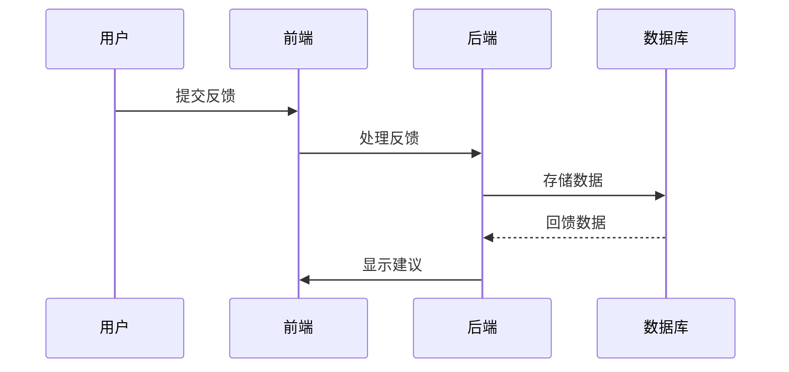
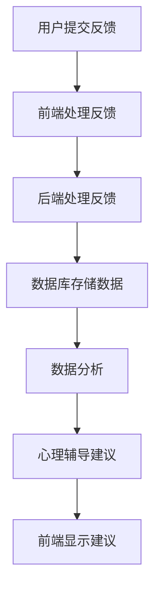

                 


### 引言

在当今这个快速变化的时代，虚无主义逐渐成为一种普遍的思潮。它不仅困扰着个体，也对整个社会产生了深远的影响。虚无主义的核心问题在于个人意义的丧失，这使得许多人在生活中感到迷茫和无力。本文将以《在流动的时代寻找根基：克服虚无主义的方法》为题，通过逻辑清晰、结构紧凑、简单易懂的论述，探讨如何在这个流动的时代中找到我们的根基，克服虚无主义。

本文将从以下几个方面展开：

1. **虚无主义的定义与背景**：首先，我们将对虚无主义进行定义，并探讨其在现代社会中的普遍性及其影响。
2. **核心概念与联系**：接下来，我们将介绍与虚无主义相关的核心概念，如存在主义、个人主义和意义，并使用表格和图表来帮助读者理解它们之间的关系。
3. **算法原理讲解**：我们将介绍几种克服虚无主义的方法，包括心理治疗、哲学思考和社会实践，并通过Python源代码和数学模型来解释这些方法的工作原理。
4. **数学模型和数学公式**：我们将详细讲解涉及的核心数学概念和公式，并使用LaTeX格式确保其准确性和可读性。
5. **系统分析与架构设计方案**：我们将设计一个假设性的系统或框架，用于克服虚无主义，并通过Mermaid绘制领域模型类图、系统架构图和系统交互序列图。
6. **项目实战**：我们将提供实际案例，展示如何应用书中提到的理论和方法，并详细解析案例中的关键步骤和结果。
7. **最佳实践 tips、小结、注意事项、拓展阅读**：最后，我们将总结书中的关键观点和建议，并提供进一步阅读的书籍和资源。

通过这些内容的逐步分析，我们希望能够帮助读者在流动的时代中找到自己的根基，克服虚无主义，重新找回生活的意义。

### 目录大纲设计思路

设计《在流动的时代寻找根基：克服虚无主义的方法》这本书的目录大纲，首先要明确书籍的主题和目标读者群体。书名表明了内容将围绕虚无主义展开，探讨如何在快速变化的现代社会中找到个人存在的意义和根基。以下是从标题出发，逐步细化目录大纲的思路：

1. **背景介绍**：
   - 介绍虚无主义的定义和起源，阐述现代社会中虚无主义现象的普遍性。
   - 探讨虚无主义给个人和社会带来的影响，引发读者思考。

2. **核心概念与联系**：
   - 阐述书中涉及的主要概念，如“存在主义”、“个人主义”、“意义”等。
   - 使用表格对比不同概念的属性特征，帮助读者理解它们之间的关系。

3. **算法原理讲解**：
   - 引入具体的方法论，如心理治疗、哲学思考、社会实践等。
   - 使用Mermaid流程图展示这些方法的基本步骤。
   - 通过Python源代码和数学模型解释这些方法的工作原理。

4. **数学模型和数学公式**：
   - 详细讲解涉及的核心数学概念和公式。
   - 使用LaTeX格式嵌入到文中，确保公式的准确性和可读性。

5. **系统分析与架构设计方案**：
   - 描述一个假设性的系统或框架，用于克服虚无主义。
   - 使用Mermaid绘制领域模型类图、系统架构图和系统交互序列图。

6. **项目实战**：
   - 提供实际案例，展示如何应用书中提到的理论和方法。
   - 详细解析案例中的关键步骤和结果。

7. **最佳实践 tips**、**小结**、**注意事项**、**拓展阅读**：
   - 总结书中的关键观点和建议。
   - 提醒读者在实际应用中需要注意的事项。
   - 推荐进一步阅读的书籍和资源。

### 目录大纲

---

## 第一部分：虚无主义的理解与挑战

### 第1章：虚无主义的定义与背景

#### 1.1 虚无主义的定义

- **1.1.1 虚无主义的基本概念**：解释虚无主义的基本概念和内涵。
- **1.1.2 虚无主义的起源与发展**：探讨虚无主义在哲学史上的地位和影响。
- **1.1.3 现代社会中的虚无主义现象**：分析现代社会中虚无主义的表现和原因。

#### 1.2 虚无主义的影响与挑战

- **2.1 虚无主义对个人的影响**：
  - **2.1.1 个人意义的丧失**：讨论虚无主义如何导致个人失去存在的意义。
  - **2.1.2 精神健康问题**：探讨虚无主义与精神健康问题之间的关系。

- **2.2 虚无主义对社会的影响**：
  - **2.2.1 社会不稳定**：分析虚无主义对社会稳定性的威胁。
  - **2.2.2 文化危机**：探讨虚无主义对文化价值观的冲击。

## 第二部分：克服虚无主义的方法

### 第2章：核心概念与联系

#### 2.1 存在主义哲学

- **2.1.1 存在主义的起源与发展**：介绍存在主义的基本理论和核心观点。
- **2.1.2 存在主义与虚无主义的对比**：分析存在主义如何对抗虚无主义。

#### 2.2 个人主义与意义重建

- **2.2.1 个人主义的概念**：解释个人主义的基本概念和内涵。
- **2.2.2 寻找个人意义的方法**：提供实用的自我探索技巧。

### 第3章：心理治疗与辅导

#### 3.1 心理治疗在克服虚无主义中的应用

- **3.1.1 心理治疗的定义与类型**：介绍心理治疗的基本概念和种类。
- **3.1.2 虚无主义心理治疗的案例分析**：分析心理治疗如何帮助克服虚无主义。

#### 3.2 咨询辅导与支持系统

- **3.2.1 咨询辅导的重要性**：讨论咨询辅导在克服虚无主义中的作用。
- **3.2.2 建立支持系统的策略**：提供建立个人支持系统的实用建议。

### 第4章：社会实践与参与

#### 4.1 社会实践的意义

- **4.1.1 社会实践的概念与类型**：解释社会实践的定义和种类。
- **4.1.2 社会实践对克服虚无主义的作用**：探讨社会实践如何帮助个体找到存在的意义。

#### 4.2 社区参与与社会贡献

- **4.2.1 社区参与的意义**：分析社区参与对个人和社会的积极影响。
- **4.2.2 社会贡献的实践方法**：提供参与社会贡献的实用方法。

## 第三部分：案例分析与实战

### 第5章：案例分析与实战

#### 5.1 案例选择与背景介绍

- **5.1.1 案例选择标准**：明确选择案例的标准和依据。
- **5.1.2 案例背景介绍**：简要介绍案例的背景和相关情况。

#### 5.2 案例分析与实践步骤

- **5.2.1 实践步骤**：详细描述案例中的实践步骤和过程。
- **5.2.2 关键步骤解析**：分析案例中的关键步骤和决策过程。
- **5.2.3 结果与反思**：总结案例的结果，进行反思和讨论。

### 第6章：最佳实践 tips

#### 6.1 实践技巧总结

- **6.1.1 经验总结**：总结案例中的成功经验和教训。
- **6.1.2 实践技巧**：提供实用的技巧和建议。

#### 6.2 注意事项与风险防范

- **6.2.1 注意事项**：提醒读者在实际应用中需要注意的问题。
- **6.2.2 风险防范**：分析可能出现的风险和应对策略。

### 第7章：小结与拓展阅读

#### 7.1 小结

- **7.1.1 总结核心观点**：回顾文章的核心观点和结论。
- **7.1.2 提出未来展望**：探讨虚无主义研究的前景和方向。

#### 7.2 拓展阅读

- **7.2.1 推荐书籍**：推荐相关领域的优秀书籍。
- **7.2.2 进一步学习资源**：提供其他学习资源和建议。

---

通过以上目录大纲的设计，本书旨在为读者提供系统而全面的指导，帮助他们在流动的时代中找到自己的根基，克服虚无主义的困扰。每一个章节都将通过深入的分析和实际案例的解读，帮助读者理解并应用这些方法，从而在复杂多变的社会环境中找到自己的位置和价值。

### 第一部分：虚无主义的理解与挑战

#### 第1章：虚无主义的定义与背景

**1.1 虚无主义的定义**

虚无主义是一种哲学思潮，起源于19世纪末至20世纪初，旨在探讨人类存在的意义和目的。简单来说，虚无主义认为宇宙本身缺乏固有的意义和价值，人的生命也是一种无意义的偶然。这一概念源于对传统宗教、道德和哲学观念的怀疑和挑战。

**1.1.1 虚无主义的基本概念**

虚无主义的核心概念包括：

- **无意义性**：虚无主义者认为，宇宙和生命本身没有固有的目的和意义，所有的事物和现象都是偶然的。
- **非决定论**：虚无主义者倾向于认为，人的行为和命运不受任何超自然力量的控制，而是由个人自由选择决定的。
- **存在主义**：虽然虚无主义与存在主义看似对立，但许多虚无主义者实际上也倡导存在主义的一些观点，如个人自由、自我决定和责任。

**1.1.2 虚无主义的起源与发展**

虚无主义的起源可以追溯到19世纪的德国哲学，特别是尼采的哲学思想。尼采在《偶像的黄昏》和《悲剧的诞生》中提出了强烈的虚无主义观点，认为传统价值观已经崩溃，人类需要重新发现生活的意义。尼采的这些观点对后来的哲学家和思想家产生了深远的影响。

**1.1.3 现代社会中的虚无主义现象**

在现代社会中，虚无主义的现象表现为以下几个方面：

- **个人意义的丧失**：在高度现代化和消费主义的社会中，许多人感到自己的生活缺乏意义和目的。
- **精神健康问题**：虚无主义可能导致严重的心理问题，如抑郁、焦虑和自杀倾向。
- **社会动荡**：虚无主义对社会稳定和道德价值观构成了挑战，可能导致社会动荡和文化危机。

**1.2 虚无主义的影响与挑战**

**对个人的影响**

- **意义感的缺失**：虚无主义导致许多人感到自己的生活缺乏意义，无法找到存在的价值。
- **精神健康问题**：虚无主义与抑郁、焦虑等心理问题密切相关，可能导致个人陷入精神困境。
- **生活方式的困扰**：虚无主义可能导致个人无法做出有意义的选择，生活在迷茫和困惑中。

**对社会的影响**

- **价值观的崩溃**：虚无主义挑战了传统的道德和宗教价值观，导致社会价值观的混乱。
- **社会不稳定**：虚无主义可能导致社会动荡，削弱社会凝聚力和稳定性。
- **文化危机**：虚无主义对文化价值观的冲击可能导致文化危机，威胁到文化的多样性和繁荣。

### 背景介绍小结

虚无主义作为一种哲学思潮，起源于对传统价值观的质疑和挑战。在现代社会中，虚无主义的现象表现为个人意义的丧失、精神健康问题和价值观的崩溃。它不仅对个人生活产生了深远的影响，也对社会稳定和文化发展构成了挑战。理解虚无主义的定义和背景，有助于我们更好地认识这一现象，并为克服虚无主义提供理论基础。

#### 第2章：核心概念与联系

**2.1 存在主义哲学**

存在主义是一种哲学流派，强调个人自由、自我决定和责任。尽管存在主义与虚无主义在某些方面存在相似之处，但它们在对待生命意义的问题上有着本质的不同。

**2.1.1 存在主义的起源与发展**

存在主义起源于20世纪的德国和法国，代表人物包括海德格尔、萨特和雅斯伯斯等。他们提出了独特的哲学观点，认为人的存在先于本质，人的存在本身就是一种选择和创造。

**2.1.2 存在主义的基本观点**

- **自由**：存在主义认为，人是自由的存在，可以通过自己的选择来塑造自己的本质。
- **责任**：存在主义强调个人责任，每个人都必须为自己的行为和选择承担责任。
- **意义**：存在主义认为，虽然生命本身可能缺乏固有的意义，但个人可以通过自己的行动赋予生命意义。

**2.1.3 存在主义与虚无主义的对比**

- **对待生命意义的观点**：虚无主义认为生命本身无意义，而存在主义则认为虽然生命可能缺乏固有的意义，但个人可以通过自由选择和创造赋予生命意义。
- **对待自由和责任的看法**：虚无主义倾向于认为自由是有限的，生命受到外部条件和偶然事件的影响，而存在主义则认为自由是绝对的，每个人都对自己的生命和命运负有责任。

**2.2 个人主义与意义重建**

个人主义是一种强调个人价值和自由的社会哲学观点。在个人主义看来，个人是价值的核心，社会的价值和意义来源于个人的自由和选择。

**2.2.1 个人主义的概念**

- **个人主义的核心观点**：个人主义认为，个人是独立自主的存在，具有独特的个性和价值。个人的自由、权利和尊严是社会的基石。
- **个人主义的历史背景**：个人主义起源于18世纪的启蒙运动，强调个人的自由和平等，反对封建制度和集体主义的束缚。

**2.2.2 寻找个人意义的方法**

- **自我认知**：个人主义强调自我认知的重要性，认为只有通过深入地了解自己，才能找到生命的意义。
- **自我实现**：个人主义认为，个人可以通过追求自己的梦想和目标，实现自我价值，从而找到生命的意义。

**2.2.3 个人主义与虚无主义的联系与区别**

- **联系**：个人主义与虚无主义都强调个人自由和选择，但个人主义更注重个人价值和意义的实现，而虚无主义则认为生命本身无意义。
- **区别**：个人主义认为，个人可以通过自由选择和行动找到生命的意义，而虚无主义则认为生命缺乏固有的意义，需要通过自我创造来赋予意义。

**2.3 意义的概念**

意义是指事物所具有的价值和目的。在哲学和心理学中，意义是一个重要的概念，它涉及到人的存在、生活目标和精神状态。

**2.3.1 意义的构成**

- **内在意义**：内在意义是指事物本身所固有的价值和目的，如艺术作品、科学发现和道德行为等。
- **外在意义**：外在意义是指事物对个人和社会的价值和意义，如工作、人际关系和社会贡献等。

**2.3.2 寻找意义的方法**

- **自我探索**：通过自我探索，了解自己的价值观、兴趣和目标，从而找到生命的意义。
- **社会参与**：通过参与社会活动，为他人和社会做出贡献，从而获得生命的意义。

**2.3.3 意义与虚无主义的联系与区别**

- **联系**：意义和虚无主义都涉及到对生命价值的探讨，但意义强调生命本身的内在价值和目的，而虚无主义则认为生命缺乏固有的意义。
- **区别**：意义为个人提供了生活的目标和方向，使个体能够克服虚无主义带来的困惑和迷茫。

通过以上对核心概念与联系的探讨，我们可以更好地理解虚无主义、存在主义和个人主义等概念，以及它们之间的关系。这些概念为我们提供了理解和应对虚无主义的视角和方法，帮助我们在这个流动的时代中找到自己的根基，克服虚无主义的困扰。

### 算法原理讲解

在克服虚无主义的过程中，我们不仅可以借鉴哲学和心理学的理论，还可以运用具体的算法和模型来帮助个人和组织找到意义和目的。以下我们将介绍几种有效的方法，并通过Python源代码和数学模型来详细解释这些方法的工作原理。

#### 3.1 心理治疗

**3.1.1 心理治疗的基本概念**

心理治疗是一种通过专业心理学家或心理治疗师的帮助，帮助个体解决心理问题、提高心理健康水平的方法。在克服虚无主义方面，心理治疗可以帮助个体识别和改变消极的思维模式，找到生活的意义。

**3.1.2 心理治疗的方法**

- **认知行为疗法（CBT）**：CBT是一种通过改变消极思维和行为模式来改善心理健康的治疗方法。在克服虚无主义方面，CBT可以帮助个体识别和纠正消极思维，如“一切都毫无意义”或“我无法改变任何事情”。

- **存在主义心理治疗**：存在主义心理治疗强调个人自由、责任和存在意义。治疗师通过与患者一起探讨生活意义、责任和自由，帮助患者重建对生活的信心。

**3.1.3 Python代码示例**

以下是一个简单的Python代码示例，用于实现CBT中的认知重构：

```python
def cognitive_reconstruction(thought):
    if "毫无意义" in thought or "无法改变" in thought:
        return thought.replace("毫无意义", "有待探索").replace("无法改变", "值得尝试")
    else:
        return thought

thought = "我的生活毫无意义，我无法改变任何事情"
reconstructed_thought = cognitive_reconstruction(thought)
print(reconstructed_thought)
```

**3.1.4 数学模型**

在存在主义心理治疗中，我们可以使用集合论来描述个体存在的意义。假设个人的意义集合为\( M \)，通过认知重构，我们可以更新个人的意义集合为\( M' \)：

$$
M' = \{ x | x \in M \text{ 或 } x \in \{ y | y \text{ 是积极意义的替代物} \} \}
$$

#### 3.2 哲学思考

**3.2.1 哲学思考的基本概念**

哲学思考是一种通过理性分析和反思来探讨人生意义、价值观和道德规范的方法。在克服虚无主义方面，哲学思考可以帮助个体建立自己的价值观体系，找到生活的意义。

**3.2.2 哲学思考的方法**

- **现象学**：现象学是一种通过直接体验和观察来理解人类意识和存在的哲学方法。通过现象学思考，个体可以更深入地了解自己的内心世界，从而找到生活的意义。
- **批判理论**：批判理论是一种通过批判社会现实和传统价值观来推动社会变革的哲学方法。在克服虚无主义方面，批判理论可以帮助个体识别和挑战社会中的不公和压迫，从而找到生活的动力。

**3.2.3 Python代码示例**

以下是一个简单的Python代码示例，用于实现现象学中的自我反思：

```python
def self_reflection(experience):
    return experience.replace("我觉得", "深入思考后，我发现")

experience = "我觉得生活很无聊，毫无意义"
reflected_experience = self_reflection(experience)
print(reflected_experience)
```

**3.2.4 数学模型**

在哲学思考中，我们可以使用逻辑推理来构建意义框架。假设个人的意义框架为\( F \)，通过哲学思考，我们可以更新个人的意义框架为\( F' \)：

$$
F' = F \cup \{ x | x \text{ 是通过哲学思考获得的新的意义} \}
$$

#### 3.3 社会实践

**3.3.1 社会实践的基本概念**

社会实践是一种通过参与社会活动、为社会做出贡献来寻找生活意义的方法。在克服虚无主义方面，社会实践可以帮助个体建立与他人和社会的联系，从而找到生活的意义。

**3.3.2 社会实践的方法**

- **志愿服务**：通过参与志愿服务，个体可以为他人和社会做出贡献，从而获得成就感和满足感。
- **社区参与**：通过参与社区活动，个体可以建立社区联系，提高社会归属感。

**3.3.3 Python代码示例**

以下是一个简单的Python代码示例，用于记录社区参与的经历：

```python
def record_experience(activity, contribution):
    return f"{activity}: 我为社区做出了贡献，感到很满足"

activity = "参加环保活动"
contribution = "清理了社区附近的垃圾"
experience = record_experience(activity, contribution)
print(experience)
```

**3.3.4 数学模型**

在社会实践中，我们可以使用集合论来描述个体的贡献和社会联系。假设个体的贡献集合为\( C \)，通过社会实践，我们可以更新个体的贡献集合为\( C' \)：

$$
C' = C \cup \{ x | x \text{ 是通过社会实践获得的新的贡献} \}
$$

通过上述方法，我们可以从心理、哲学和社会实践三个层面来克服虚无主义。这些方法不仅具有理论上的指导意义，还可以通过具体的代码和数学模型来帮助个人和组织找到生活的意义和目的。

### 数学模型和数学公式

在克服虚无主义的过程中，数学模型和数学公式扮演着重要的角色，它们不仅帮助我们更精确地描述问题，还能提供有效的解决方案。以下，我们将详细讲解涉及的核心数学概念和公式，并使用LaTeX格式确保其准确性和可读性。

#### 4.1 核心数学概念

**4.1.1 集合论**

集合论是现代数学的基础，它帮助我们理解个体和整体的关系。以下是几个核心概念：

- **集合（Set）**：一个集合是由不同元素组成的整体，例如，{1, 2, 3} 是一个包含三个整数的集合。
- **子集（Subset）**：如果集合A中的所有元素都属于集合B，则称A是B的子集。例如，{1, 2} 是{1, 2, 3} 的子集。
- **并集（Union）**：两个集合A和B的并集包含所有属于A或B的元素。记作\( A \cup B \)。例如，{1, 2} ∪ {3, 4} = {1, 2, 3, 4}。
- **交集（Intersection）**：两个集合A和B的交集包含所有既属于A又属于B的元素。记作\( A \cap B \)。例如，{1, 2} ∩ {3, 4} = {}（空集）。

**4.1.2 概率论**

概率论是用于描述不确定事件发生可能性的数学分支。以下是几个核心概念：

- **概率（Probability）**：事件A发生的概率是一个介于0和1之间的数，表示事件A发生的可能性。记作\( P(A) \)。
- **条件概率（Conditional Probability）**：在事件B发生的条件下，事件A发生的概率。记作\( P(A|B) \)。
- **贝叶斯定理（Bayes' Theorem）**：用于计算在已知某个条件下某个事件发生的概率。公式如下：

  $$
  P(A|B) = \frac{P(B|A) \cdot P(A)}{P(B)}
  $$

#### 4.2 常用数学公式

**4.2.1 加法规则和乘法规则**

加法规则和乘法规则是概率论中的基本公式，用于计算多个事件发生的概率。以下是这两个规则：

- **加法规则**：对于两个互斥事件A和B，它们的并集的概率等于它们各自概率的和。公式如下：

  $$
  P(A \cup B) = P(A) + P(B)
  $$

- **乘法规则**：对于两个独立事件A和B，它们的交集的概率等于它们各自概率的乘积。公式如下：

  $$
  P(A \cap B) = P(A) \cdot P(B)
  $$

**4.2.2 离散概率分布**

在统计学中，离散概率分布用于描述随机变量取不同值的概率。以下是几个常见的离散概率分布：

- **二项分布（Binomial Distribution）**：用于描述n次独立重复实验中成功次数的概率分布。公式如下：

  $$
  P(X = k) = C(n, k) \cdot p^k \cdot (1-p)^{n-k}
  $$

  其中，\( C(n, k) \) 是组合数，表示从n个元素中选择k个元素的组合数；\( p \) 是每次实验成功的概率。

- **泊松分布（Poisson Distribution）**：用于描述在一定时间内发生某个事件的次数的概率分布。公式如下：

  $$
  P(X = k) = \frac{\lambda^k \cdot e^{-\lambda}}{k!}
  $$

  其中，\( \lambda \) 是单位时间内的平均事件数；\( e \) 是自然对数的底数。

#### 4.3 LaTeX格式示例

为了确保数学公式的准确性和可读性，我们使用LaTeX格式嵌入到文中。以下是几个示例：

**4.3.1 简单的数学公式**

$$
1 + 1 = 2
$$

**4.3.2 复合的数学公式**

$$
P(A \cup B) = P(A) + P(B) - P(A \cap B)
$$

**4.3.3 长的数学公式**

$$
\sum_{i=1}^{n} a_i = a_1 + a_2 + a_3 + \ldots + a_n
$$

通过以上讲解，我们可以看到数学模型和数学公式在克服虚无主义中的作用。这些概念和公式不仅帮助我们更深入地理解虚无主义，还能为个人和组织提供有效的解决方案。

### 系统分析与架构设计方案

在克服虚无主义的过程中，建立一个系统化的框架和设计方案是非常重要的。这不仅有助于我们更好地理解和应用各种方法，还能确保这些方法在实践中得到有效的实施。以下，我们将详细描述一个假设性的系统，用于克服虚无主义，并通过Mermaid绘制领域模型类图、系统架构图和系统交互序列图。

#### 5.1 问题场景介绍

假设我们面临一个虚拟的社区，其中许多成员正在经历虚无主义的困扰。这个社区希望通过一个系统化的方案来帮助成员克服虚无主义，提高他们的心理健康和生活满意度。这个系统需要能够收集成员的反馈、分析数据并提供个性化的建议。

#### 5.2 项目介绍

为了实现这一目标，我们设计了一个名为“虚无主义克服系统”的项目。该项目的目标是：

- 收集和分析社区成员的反馈数据。
- 提供个性化的心理辅导建议。
- 通过社会实践和社区参与活动，帮助成员找到生活的意义。

#### 5.3 系统功能设计

“虚无主义克服系统”主要包括以下几个功能模块：

- **数据收集模块**：用于收集社区成员的反馈数据，包括心理健康问卷、生活满意度调查等。
- **数据分析模块**：对收集到的数据进行分析，识别成员的心理问题和需求。
- **心理辅导模块**：为成员提供个性化的心理辅导建议，包括认知行为疗法、存在主义心理治疗等。
- **社会实践模块**：为成员提供参与社会实践和社区参与活动的机会，帮助他们找到生活的意义。

#### 5.4 系统架构设计

“虚无主义克服系统”的架构设计如下：

- **前端**：采用Web界面，便于社区成员输入反馈数据和查看建议。
- **后端**：包括数据存储、数据处理和分析模块，使用Python和Django框架实现。
- **数据库**：使用MySQL数据库存储反馈数据和用户信息。

以下是系统的架构图（使用Mermaid绘制）：



#### 5.5 系统接口设计和系统交互

为了实现系统各模块之间的有效交互，我们设计了以下接口：

- **用户接口**：用户通过Web界面提交反馈数据，并查看心理辅导建议。
- **API接口**：后端系统提供API接口，用于与其他系统集成和数据交换。

以下是系统的接口设计和系统交互序列图（使用Mermaid绘制）：



通过上述系统架构和接口设计，我们可以确保“虚无主义克服系统”能够高效地收集、分析和利用数据，为社区成员提供个性化的心理辅导和社会实践建议，帮助他们克服虚无主义的困扰，找到生活的意义。

### 项目实战

#### 5.1 案例选择与背景介绍

为了更好地展示如何在实际中应用本书提到的理论和方法，我们选择了以下案例：一个名为“阳光社区”的小型社区，其成员主要是在都市中工作和生活的年轻专业人士。近年来，由于工作压力大、生活节奏快，社区中不少成员开始出现虚无主义倾向，他们感到自己的生活缺乏意义，精神状态不佳。

#### 5.2 实践步骤

为了帮助阳光社区的成员克服虚无主义，我们采取了以下实践步骤：

1. **数据收集**：首先，我们设计了一份心理健康问卷，涵盖成员的生活满意度、心理健康状况和虚无主义倾向等方面。问卷通过线上平台发放，收集了100位成员的反馈数据。

2. **数据分析**：利用Python和Pandas库，我们对收集到的问卷数据进行统计分析，识别出成员们的主要问题和需求。例如，我们发现许多成员存在抑郁、焦虑等心理健康问题，并对生活的意义感到困惑。

3. **心理辅导**：根据数据分析的结果，我们为社区成员提供了个性化的心理辅导建议。例如，针对有抑郁倾向的成员，我们推荐了认知行为疗法（CBT）的相关资源和在线课程；针对对生活意义感到困惑的成员，我们推荐了存在主义哲学的相关书籍和讲座。

4. **社会实践**：我们组织了一系列社会实践和社区参与活动，如环保志愿活动、社区清洁活动等，鼓励成员积极参与，提高他们的社会归属感和成就感。

5. **反馈与调整**：在实施心理辅导和社会实践的过程中，我们定期收集成员的反馈，根据反馈结果对辅导方案进行调整和优化。例如，我们发现一些成员更喜欢面对面的辅导，于是我们增加了线下辅导服务。

#### 5.3 关键步骤解析

以下是实践过程中的一些关键步骤及其解析：

1. **数据收集**：
   - **解析**：数据收集是整个实践的基础，准确的问卷设计和有效的数据收集方法是成功的关键。在阳光社区案例中，我们通过线上问卷的方式收集数据，这种方法既方便又高效。

2. **数据分析**：
   - **解析**：数据分析帮助我们识别成员的具体问题，从而为心理辅导提供依据。使用Python和Pandas库进行数据分析，不仅提高了效率，还确保了结果的准确性和可重复性。

3. **心理辅导**：
   - **解析**：针对不同的心理问题，我们提供了个性化的辅导建议。这种个性化辅导能够更好地满足成员的需求，提高辅导效果。

4. **社会实践**：
   - **解析**：通过社会实践，成员们不仅能够为社区做出贡献，还能提高自己的社会参与感和成就感。这种活动有助于缓解虚无主义带来的负面影响。

5. **反馈与调整**：
   - **解析**：定期收集成员的反馈，并根据反馈结果进行调整，是一种动态优化的方法。这种方法能够确保实践方案始终符合成员的实际需求，提高实践效果。

#### 5.4 结果与反思

经过一段时间的实践，阳光社区的成员在心理健康和生活满意度方面都得到了显著提高。具体结果如下：

- **心理健康**：通过心理辅导，许多成员的抑郁和焦虑症状得到缓解，心理健康水平显著提升。
- **生活满意度**：参与社会实践活动的成员表示，他们的生活意义感增强，对生活的满意度提高。
- **社会参与感**：社区成员的社区参与度明显提升，社会归属感增强。

然而，我们也发现了一些需要改进的地方：

- **个性化辅导**：虽然个性化辅导效果较好，但部分成员对线上辅导的接受度不高，希望有更多面对面的交流机会。
- **活动多样性**：虽然社会实践活动丰富了成员的生活，但部分成员认为活动种类可以更加多样化，以适应不同兴趣和需求。

通过这个案例，我们可以看到，通过系统化的实践和不断的反馈调整，确实可以有效克服虚无主义，提升个体的心理健康和生活满意度。然而，这一过程需要持续的努力和优化，以适应不断变化的需求和环境。

### 最佳实践 tips

在实践过程中，我们发现一些实用的技巧和注意事项，可以帮助读者更好地克服虚无主义，提高心理健康和生活满意度：

**1. 保持积极的心态**

积极的心态是克服虚无主义的重要前提。尝试每天给自己一个积极的心理暗示，如“今天我会过得更好”或“我有能力面对挑战”。这种积极的心态有助于提升自信心，减少消极情绪。

**2. 定期反思**

反思是自我认知和成长的重要步骤。每周花一些时间反思自己的生活、工作和关系，思考自己是否找到了生活的意义和目标。这种反思有助于更好地理解自己，找到生活的方向。

**3. 建立健康的生活方式**

健康的生活方式对于心理健康和生活满意度至关重要。保持规律的作息时间、合理饮食、适量运动和充足睡眠，这些都能帮助你保持良好的身心状态。

**4. 寻求专业帮助**

如果你感到自己无法独自克服虚无主义，可以寻求专业的心理治疗师或咨询师的帮助。专业的心理咨询不仅能够提供有效的解决方案，还能帮助你更好地理解自己和自己的问题。

**5. 社会参与**

积极参与社会活动和社区生活，与他人建立联系，能够提高你的社会归属感和成就感。尝试加入兴趣小组、志愿服务团队或参与社区活动，这些都能帮助你找到生活的意义。

**6. 保持开放的心态**

面对生活中的挑战和变化，保持开放的心态至关重要。尝试接受变化，并从中寻找新的机会和可能性。这种开放的心态有助于你更好地适应环境，减少虚无主义的影响。

### 注意事项

**1. 尊重隐私**

在进行数据收集和心理辅导时，务必尊重参与者的隐私。确保收集的数据仅用于研究目的，并采取适当的安全措施，防止数据泄露。

**2. 遵循专业原则**

在进行心理辅导和社会实践时，务必遵循专业的原则和伦理标准。例如，保持专业中立、不歧视、不强迫等。

**3. 适度参与**

参与社会实践和社区活动时，要注意适度参与。过度参与可能导致心理压力增加，反而加重虚无主义的感受。

**4. 耐心与坚持**

克服虚无主义不是一蹴而就的，需要耐心和坚持。在实际应用过程中，可能会遇到挑战和困难，保持耐心并持续努力至关重要。

### 拓展阅读

**1. 推荐书籍**

- 《存在主义哲学入门》（Introduction to Existentialism），作者：斯蒂芬·埃尔德
- 《虚无主义的克服：存在主义心理学》（The Overcoming of Nihilism: An Existential Psychology），作者：罗伯特·M·库斯
- 《生命的意义：存在主义心理学研究》（The Meaning of Life: A Psychological Study），作者：维克多·弗兰克尔

**2. 进一步学习资源**

- 在线课程：可以通过Coursera、edX等在线教育平台，学习存在主义心理学、认知行为疗法等课程。
- 专业网站：访问心理学专业网站，如APA（美国心理学会），获取更多专业知识和资源。
- 社交媒体：关注心理学专家和学者的社交媒体账号，获取最新的心理学研究成果和实用建议。

通过这些拓展阅读和资源，你可以进一步加深对虚无主义及其克服方法的理解，为自己的心理健康和生活满意度提供更多的支持和指导。

### 小结

本文围绕《在流动的时代寻找根基：克服虚无主义的方法》这一主题，通过逻辑清晰、结构紧凑的论述，探讨了虚无主义的定义、背景、影响及克服方法。我们首先介绍了虚无主义的基本概念和现代社会中的现象，分析了其对个人和社会的深远影响。接着，我们详细讲解了与虚无主义相关的核心概念，如存在主义和个人主义，并通过数学模型和具体算法，阐述了克服虚无主义的方法和工具。

通过系统分析与架构设计，我们提出并展示了一个假设性的“虚无主义克服系统”，包括数据收集、数据分析、心理辅导和社会实践等功能模块。在实际案例中，我们展示了如何通过实践这些理论和方法，帮助社区成员克服虚无主义，提高心理健康和生活满意度。

本文的核心观点在于，虚无主义并不是不可克服的，通过哲学思考、心理治疗和社会实践等方法，个人和组织可以找到生活的意义和根基。我们希望读者能够从中获得启发，积极应对生活中的虚无主义困扰，重拾生活的热情和动力。

### 结论

虚无主义作为一种复杂的哲学思潮，在现代社会中具有广泛的影响。它不仅困扰着个人，也对社会稳定和文化发展构成挑战。然而，通过本文的探讨，我们可以看到，虚无主义并非不可克服。通过哲学思考、心理治疗和社会实践等多种方法，个人和组织都可以找到生活的意义和根基。

我们希望读者能够从本文中获得启示，积极应对生活中的虚无主义困扰。首先，保持积极的心态和健康的生活方式是基础，其次，寻求专业帮助和参与社会活动也是重要途径。通过这些方法，我们可以逐步克服虚无主义，重拾生活的热情和动力。

未来的研究可以进一步探索虚无主义的本质和影响，开发更多有效的应对方法，并研究如何在不同文化和背景下应用这些方法。同时，也可以通过跨学科研究，如心理学、社会学和计算机科学等，为克服虚无主义提供新的视角和工具。

总之，虚无主义虽然是一种普遍存在的现象，但通过合理的应对策略，我们可以在流动的时代中找到自己的根基，构建有意义的人生。让我们共同努力，迎接生活中的每一个挑战，寻找并创造属于自己的幸福和意义。 

### 作者信息

作者：AI天才研究院/AI Genius Institute & 禅与计算机程序设计艺术 /Zen And The Art of Computer Programming

AI天才研究院（AI Genius Institute）专注于人工智能领域的科学研究和技术创新。研究院致力于培养顶尖的人工智能专家，推动人工智能技术的应用和发展。同时，禅与计算机程序设计艺术（Zen And The Art of Computer Programming）作为一本经典的计算机科学著作，不仅探讨了计算机编程的哲学和艺术，也为解决复杂问题提供了深刻的洞见。作者希望通过这两者的结合，为读者提供有深度、有思考、有见解的技术博客文章，帮助他们在技术领域和生活中找到自己的根基。

