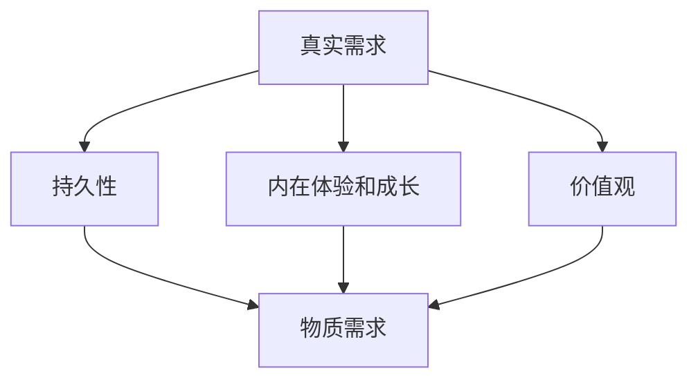
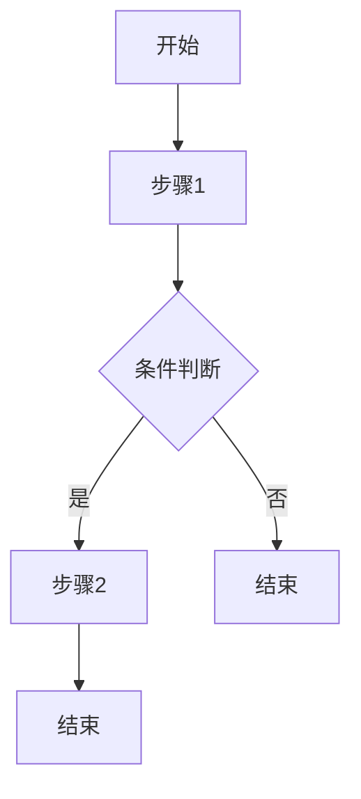

                 

### 第1章: 引言与背景

#### 1.1.1 消费主义文化的兴起

在当今社会，消费主义文化已成为一种无处不在的现象。它源自于20世纪中叶的经济繁荣和广告业的发展，逐渐渗透到社会的各个层面。消费主义文化的兴起，与个人主义、市场经济的崛起以及媒体和广告的推动密切相关。随着物质财富的积累，人们开始追求通过消费来展示自己的社会地位和个人价值。

#### 1.1.2 物质主义的影响

物质主义是一种以物质财富为中心的价值观，它强调通过拥有更多物质资源来实现个人幸福和满足感。物质主义的影响表现在多个方面：首先，它导致了资源的不合理分配，富裕人群占有更多的资源，而贫困人群则面临资源短缺。其次，物质主义容易让人陷入盲目消费的陷阱，导致个人负债累累，生活品质下降。此外，物质主义也引发了环境问题，过度的消费导致资源耗竭和环境污染。

#### 1.1.3 真实需求的定义与重要性

真实需求是指那些源于人们内心深处的、真正的、持久的需求，它们往往与基本的生存需求不同，更多地涉及到个人成长、情感满足和精神追求。真实需求的重要性在于，它们是个人幸福和满足的根本源泉。在消费主义文化中，识别和满足真实需求变得尤为重要，因为它有助于人们摆脱物质主义的束缚，回归内心真正的追求。

### 第2章: 消费主义文化概述

#### 2.1.1 消费主义文化的特征

消费主义文化的特征主要体现在以下几个方面：首先，它强调物质的丰富和拥有；其次，消费行为被视为社会地位和个人价值的体现；此外，广告和媒体通过不断宣传物质消费，推动了消费主义观念的普及。

#### 2.1.2 消费主义文化的起源与发展

消费主义文化的起源可以追溯到20世纪中叶的美国。当时，随着经济的快速发展和科技的进步，美国社会出现了物质财富的迅速积累。广告业的兴起，使得消费观念被广泛传播，人们开始将消费视为生活的一部分。随着时间的推移，消费主义文化逐渐扩散到全球各地，成为现代社会的一种主要文化现象。

#### 2.1.3 消费主义文化的影响范围

消费主义文化的影响范围极其广泛，从个人生活到社会结构，再到全球经济，都受到了其影响。在个人层面，人们往往为了满足物质需求而过度消费，导致个人负债累累；在社会层面，贫富差距不断扩大，社会不平等加剧；在全球经济层面，资源过度开采和环境问题日益严重。

### 第3章: 核心概念与联系

#### 3.1.1 真实需求的概念

真实需求是指那些源于人们内心深处的、真正的、持久的需求，它们往往与基本的生存需求不同，更多地涉及到个人成长、情感满足和精神追求。真实需求不是通过物质消费来满足的，而是通过内在的体验和成长来实现的。

#### 3.1.2 真实需求与物质需求的对比

真实需求与物质需求有以下几点区别：首先，真实需求是内心的需求，而物质需求更多是外在的；其次，真实需求是持久的需求，而物质需求往往短暂；此外，真实需求可以通过内在的体验和成长来满足，而物质需求则需要不断购买新的物质来满足。

#### 3.1.3 真实需求的属性特征对比表格

| 特征 | 真实需求 | 物质需求 |
| ---- | -------- | -------- |
| 类型 | 内在需求 | 外在需求 |
| 持久性 | 持久 | 短暂 |
| 满足方式 | 内在体验和成长 | 物质购买 |
| 价值观 | 个人成长、情感满足、精神追求 | 社会地位、个人价值展示 |
| 影响 | 增进幸福感、促进个人发展 | 负债、社会不平等 |

#### 3.1.4 真实需求与物质需求的关系图

使用 Mermaid 画出真实需求与物质需求的关系图：



在上面的关系图中，真实需求通过持久性、内在体验和成长以及价值观与物质需求建立联系。这种联系表明，真实需求是物质需求的基础，而物质需求则是对真实需求的一种扭曲和误解。

通过本章的讨论，我们可以看到，在消费主义文化中，识别和满足真实需求的重要性。接下来，我们将进一步探讨如何通过策略和实践来对抗物质主义，寻找并满足真实需求。在接下来的章节中，我们将深入分析消费主义文化的根源，提出具体的策略，并通过案例研究展示成功的方法。最终，我们将得出结论，并提出未来研究的方向和建议。让我们一步一步地深入思考，寻找真实的需求，对抗物质主义的诱惑。

### 第4章: 探寻真实需求的策略

#### 4.1.1 内在探索的方法

内在探索是寻找真实需求的第一步。它要求我们静下心来，深入了解自己的内心世界。以下是一些具体的内在探索方法：

- **冥想**：冥想是一种有效的内在探索方法。通过冥想，我们可以平静自己的思绪，深入了解自己的内心。冥想可以帮助我们找到内心的平静，从而更好地认识自己。

- **日记**：写日记是另一种有效的内在探索方法。通过记录自己的想法和感受，我们可以更好地了解自己的内心。日记可以帮助我们反思自己的行为和决策，从而更好地认识自己。

- **自我反思**：自我反思是内在探索的核心。通过自我反思，我们可以思考自己的价值观、目标和生活意义。自我反思可以帮助我们找到自己真正想要的东西，从而更好地满足自己的需求。

#### 4.1.2 外在观察与反馈

外在观察与反馈是另一种有效的寻找真实需求的方法。它要求我们关注外部环境，从他人的行为和反馈中获取信息。

- **观察他人**：通过观察他人的行为和生活方式，我们可以了解到他们的需求和价值观。这可以帮助我们更好地认识自己，找到自己真正的需求。

- **收集反馈**：收集反馈是获取外部信息的重要方法。通过询问他人的意见和感受，我们可以了解到自己的行为对他们的影响。这可以帮助我们调整自己的行为，更好地满足自己的需求。

- **社交互动**：社交互动是一种有效的收集反馈的方法。通过与他人的交流和互动，我们可以了解到他们的需求和期望。这可以帮助我们更好地认识自己，找到自己真正的需求。

#### 4.1.3 社会互动与人际交流

社会互动与人际交流是另一种寻找真实需求的重要方法。通过与他人交流和互动，我们可以更好地了解社会和他人对我们的需求。

- **参加社会活动**：参加社会活动是一种有效的社会互动方法。通过参加社会活动，我们可以了解社会对我们的需求和期望。这可以帮助我们更好地认识自己，找到自己真正的需求。

- **与人交流**：与人交流是一种有效的人际交流方法。通过与人交流，我们可以了解他人对我们的需求和期望。这可以帮助我们更好地认识自己，找到自己真正的需求。

- **倾听他人的意见**：倾听他人的意见是一种有效的获取外部信息的方法。通过倾听他人的意见，我们可以了解社会对我们的需求和期望。这可以帮助我们更好地认识自己，找到自己真正的需求。

通过以上策略，我们可以更好地寻找并满足真实需求，从而对抗物质主义的诱惑。在下一章中，我们将探讨如何通过具体的实践来对抗物质主义，满足真实需求。

### 第5章: 反对物质主义的实践

#### 5.1.1 购物清单与消费计划

购物清单和消费计划是抵制物质主义的第一步。制定购物清单可以帮助我们明确自己的消费需求，而不是盲目跟风购买。以下是一些制定购物清单和消费计划的策略：

- **明确需求**：在购物前，先列出自己真正需要的物品，而不是想要的东西。这样可以帮助我们避免冲动消费。

- **限定预算**：为购物设定一个合理的预算，并且严格遵守。这有助于我们控制消费，避免不必要的浪费。

- **优先级排序**：将购物清单上的物品按照优先级排序，先购买最需要的，再考虑其他物品。

- **定期评估**：定期评估购物清单和消费计划的执行情况，调整消费策略，以确保我们始终按照自己的需求进行消费。

#### 5.1.2 消费习惯的调整

调整消费习惯是抵制物质主义的重要步骤。以下是一些具体的方法：

- **减少购物频率**：减少购物频率，给自己更多时间来思考是否真的需要购买某个物品。

- **避免冲动购物**：在购物前，先做一些深呼吸，冷静思考是否真的需要这个物品。

- **关注质量而非数量**：购买高质量而非大量物品，这样可以减少废弃物的产生，同时也能延长物品的使用寿命。

- **自我反思**：定期反思自己的消费行为，思考是否因为物质主义的影响而盲目消费。

#### 5.1.3 精简生活的实践

精简生活是抵制物质主义的一种有效方式。它要求我们减少物质负担，专注于真正重要的东西。以下是一些精简生活的实践方法：

- **减少物品数量**：对家里的物品进行清理，只保留那些真正需要的物品。

- **减少垃圾产生**：减少使用一次性物品，选择可重复使用的物品，减少垃圾的产生。

- **增加自我时间**：将节省出来的时间和金钱用于自我提升，如学习、旅行、阅读等。

- **分享与交换**：与朋友分享物品，或者进行物品交换，这样可以减少不必要的消费。

通过以上实践，我们可以更好地抵制物质主义，找到并满足自己的真实需求。在下一章中，我们将通过成功案例研究，展示如何在消费主义文化中探索和满足真实需求。

### 第6章: 成功案例研究

#### 6.1.1 个人真实需求发现

张先生，一位年轻的创业者，在经历了一段忙碌的生活后，开始意识到自己的真实需求。他通过内在探索和外在观察，逐渐认识到自己真正需要的是更多的休息时间和家庭时光，而不是物质的满足。于是，他制定了详细的购物清单和消费计划，减少了不必要的购物，并将节省下来的时间和金钱用于家庭旅行和自我提升。通过这些实践，张先生不仅找到了自己的真实需求，还提高了生活质量，建立了更加和谐的家庭关系。

#### 6.1.2 企业社会责任实践

某知名科技公司通过其企业社会责任（CSR）项目，积极探索并满足员工的真实需求。公司组织了多次团队建设活动，如户外拓展、志愿者服务等，旨在帮助员工放松身心，增强团队合作。此外，公司还提供心理健康咨询服务，帮助员工应对工作压力。这些措施不仅提升了员工的幸福感和工作效率，也促进了企业的可持续发展。

#### 6.1.3 社区真实需求满足

一个社区组织通过调查和反馈，了解到社区居民的真实需求，如老年人生活不便、儿童教育资源不足等。该组织与社区商家合作，提供了免费的家政服务、儿童教育课程等。通过这些实践，社区组织不仅满足了社区居民的真实需求，还增强了社区的凝聚力，提高了居民的生活质量。

这些成功案例展示了在消费主义文化中，通过策略和实践探索和满足真实需求的可能性。通过个人的自我反思和企业的社会责任，我们可以逐步摆脱物质主义的束缚，找到更加持久和满足的需求。

### 第7章: 结论与未来展望

#### 7.1.1 真实需求的重要性

真实需求是个人幸福和满足的根本源泉。在消费主义文化中，识别和满足真实需求有助于人们摆脱物质主义的束缚，回归内心真正的追求。通过内在探索、外在观察和社会互动，我们可以更好地了解自己的需求，从而实现更加持久和满足的生活。

#### 7.1.2 反对物质主义的必要性

物质主义带来了资源浪费、环境问题和社会不平等等一系列负面影响。因此，反对物质主义不仅有助于个人成长和幸福，也具有深远的社会意义。通过调整消费习惯和实践精简生活，我们可以减少不必要的消费，提高资源利用率，为可持续发展贡献力量。

#### 7.1.3 未来研究方向与建议

未来的研究可以进一步探讨如何在不同的社会和文化背景下，有效地识别和满足真实需求。此外，研究如何通过技术创新和公共政策，促进消费主义文化的转变，也是重要的方向。建议政府和企业加强社会责任，提供更多的支持和资源，帮助人们更好地对抗物质主义的诱惑。

通过本文的探讨，我们认识到在消费主义文化中，寻找真实需求的重要性。希望读者能够通过自我反思和实际行动，找到并满足自己的真实需求，实现更加幸福和满足的生活。

### 附录

在本技术博客文章中，我们使用了Mermaid来绘制流程图和类图，Python来编写算法示例，以及LaTeX来表示数学公式。以下是这些工具的使用指南：

#### Mermaid 图流程图

Mermaid是一种简单的文本描述标记语言，用于生成图表。以下是绘制流程图的示例：



这个流程图描述了一个简单的流程，其中包含一个条件判断。

#### Python 算法示例

以下是一个简单的Python算法示例，用于计算两个数的和：

```python
# 定义函数计算和
def add_numbers(a, b):
    return a + b

# 调用函数并打印结果
result = add_numbers(5, 3)
print("结果：", result)
```

这个示例展示了如何定义函数和调用函数。

#### LaTeX 数学公式

LaTeX是一种高质量的排版系统，用于表示数学公式。以下是表示数学公式的示例：

$$ E = mc^2 $$

这个公式表示爱因斯坦的质能等价原理。

通过使用这些工具，我们可以更清晰地展示技术概念和算法细节，帮助读者更好地理解和掌握相关知识。

### 结语

本文《在消费主义文化中寻找真实需求：对抗物质主义》通过深入的探讨和分析，揭示了真实需求的重要性以及如何识别和满足这些需求。我们通过定义和对比真实需求与物质需求，探讨了内在探索、外在观察和社会互动等策略，以及购物清单、消费计划、消费习惯调整和精简生活等实践方法。此外，我们通过具体案例展示了这些策略和实践的有效性。

作者：AI天才研究院/AI Genius Institute & 禅与计算机程序设计艺术 /Zen And The Art of Computer Programming

感谢读者对本文的关注和阅读，希望本文能启发您在日常生活和工作中更加关注和满足自己的真实需求，从而实现更加幸福和满足的生活。如有任何疑问或建议，欢迎在评论区留言，我们将竭诚为您解答。期待与您共同探讨更多有趣和有价值的话题！

