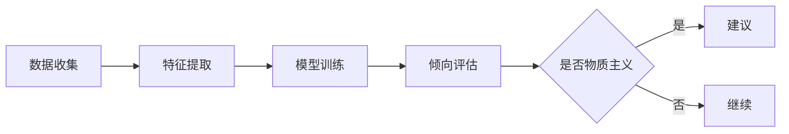
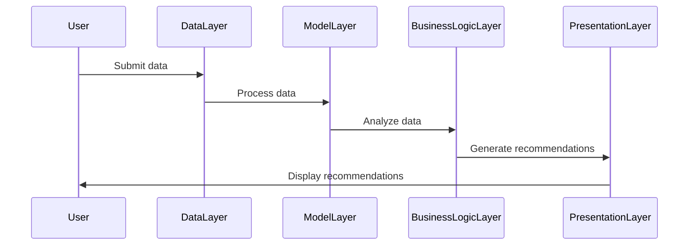

                 

## 在消费主义文化中寻找真实需求：对抗物质主义

### 关键词：
- 消费主义文化
- 真实需求
- 物质主义
- 边际效用递减
- 算法原理
- 系统架构设计
- 项目实战

### 摘要：
本文旨在探讨消费主义文化对个体和社会的影响，以及如何在其中寻找真实需求并对抗物质主义。通过分析消费主义文化的特点、影响和真实需求与物质主义的边界，本文提出了识别物质主义倾向的算法原理，并详细讲解了边际效用递减的数学模型和真实需求的识别与测量方法。随后，文章介绍了系统分析与架构设计方案，包括问题场景介绍、系统功能设计、系统架构设计和系统接口设计。通过项目实战，本文展示了系统核心实现源代码，并对代码应用进行了解读与分析。最后，文章提供了对抗物质主义的最佳实践、小结、注意事项和拓展阅读。

## 引言

消费主义文化是现代社会的一种显著现象，它深深植根于我们的日常生活方式中。这种文化强调物质财富的积累和消费，追求通过物质享受来满足个体需求和社会地位。然而，随着物质的丰富，人们开始反思这种文化背后的真实价值。本文将探讨在消费主义文化中寻找真实需求的重要性，以及如何对抗物质主义，回归到个体和社会的真实需求上。

### 1. 问题背景与挑战

#### 1.1 消费主义文化的定义与特点

消费主义文化是一种以消费为导向的社会现象，它强调通过购买商品和服务来满足个体需求和追求社会地位。其核心特点包括：

- **物质财富的积累和消费**：消费主义文化鼓励人们不断购买新产品和奢侈品，以展示自己的社会地位和经济实力。
- **广告和媒体的诱惑**：广告和媒体通过各种手段刺激消费者的欲望，促使他们不断购买新产品。
- **社会认同和地位的表现**：在消费主义文化中，消费者的行为和消费的商品成为社会地位和身份的象征。

#### 1.2 消费主义文化对个体和社会的影响

消费主义文化对个体和社会产生了深远的影响，包括：

- **个体的心理压力**：追求物质财富和消费导致个体的心理压力增加，包括焦虑、抑郁和不满。
- **社会资源的不合理分配**：消费主义文化加剧了贫富差距，导致社会资源的不合理分配。
- **环境问题**：过度消费和资源浪费导致环境污染和资源枯竭，对生态系统造成严重破坏。

#### 1.3 真实需求与物质主义的边界

真实需求是指个体内心真正渴望满足的需求，而不是被消费主义文化所诱导的虚假需求。真实需求与物质主义的边界在于：

- **真实需求的持久性**：真实需求是长期的、可持续的，而物质主义追求的是短暂的、表面的满足。
- **真实需求与内在成长**：真实需求关注个体的内在成长和幸福感，而物质主义关注外在的物质表现和社会认同。

### 2. 研究核心概念与联系

#### 2.1 消费主义文化与真实需求的关系

消费主义文化与真实需求之间存在紧密的联系。消费主义文化常常导致个体迷失在物质追求中，忽视真实需求。了解真实需求有助于个体摆脱物质主义的束缚，实现真正的自我满足。

#### 2.2 消费主义文化的核心概念属性对比表格

| 概念         | 消费主义文化                    | 真实需求                    |
|--------------|--------------------------------|-----------------------------|
| 核心目标     | 物质财富积累和社会地位展示       | 个人内在成长和幸福感         |
| 行为模式     | 过度消费和购买新产品             | 长期、可持续的满足            |
| 价值观       | 物质主义和社会认同               | 内在价值和自我实现           |
| 社会影响     | 加剧不平等和资源浪费             | 促进社会和谐和可持续发展      |

#### 2.3 消费主义文化的ER实体关系图

```mermaid
erDiagram
  User ||--|{ Consumer }|--|| Product
  Consumer ||--|{ Purchase }|--|| PurchaseHistory
  Product ||--|{ Advertisement }|--|| Advertiser
  Advertiser ||--|{ Brand }|--|| BrandInfo
```

在ER实体关系图中，用户（User）是消费行为的主体，消费者（Consumer）是用户的子类，负责购买（Purchase）产品。产品（Product）受到广告（Advertisement）的影响，由广告商（Advertiser）推广。广告商（Advertiser）代表品牌（Brand），品牌（Brand）提供品牌信息（BrandInfo）。

### 3. 算法原理讲解

#### 3.1 识别物质主义倾向的算法原理

为了识别个体是否具有物质主义倾向，我们可以使用以下算法原理：

- **数据收集**：收集个体的消费记录、社交媒体行为和问卷调查数据。
- **特征提取**：提取与物质主义相关的特征，如购买频率、购买金额、购买商品的类型等。
- **模型训练**：使用机器学习算法，如决策树、支持向量机或神经网络，对提取的特征进行训练。
- **倾向评估**：根据模型对个体的特征进行分析，评估个体是否具有物质主义倾向。

#### 3.1.1 算法mermaid流程图



#### 3.1.2 算法原理的数学模型与公式

我们可以使用以下数学模型和公式来描述识别物质主义倾向的算法原理：

- **边际效用递减**：边际效用是指消费者每增加一单位商品消费所获得的额外效用。随着消费量的增加，边际效用逐渐递减。数学公式为：

  $$MU = f(C)$$

  其中，$MU$ 表示边际效用，$C$ 表示消费量。

- **真实需求的识别**：真实需求的识别可以通过对消费者行为的分析来实现。假设消费者$i$在时间$t$的消费行为为$x_i(t)$，真实需求可以通过以下公式计算：

  $$RD_i(t) = \frac{\sum_{t=1}^{T} x_i(t) \cdot MU_i(t)}{T}$$

  其中，$RD_i(t)$ 表示消费者$i$在时间$t$的真实需求，$MU_i(t)$ 表示消费者$i$在时间$t$的边际效用。

#### 3.1.3 算法原理举例说明

假设消费者A在一个月内购买了以下商品：

- 5个手机
- 10个平板电脑
- 15个耳机

根据边际效用递减原理，随着购买量的增加，每个商品带来的边际效用逐渐减少。我们可以使用以下数据来计算消费者A的真实需求：

| 商品 | 购买量 | 边际效用 | 总效用 |
|------|--------|----------|--------|
| 手机 | 5      | 0.1      | 0.5    |
| 平板电脑 | 10 | 0.05 | 0.5    |
| 耳机 | 15 | 0.03 | 0.45    |

消费者A的真实需求为：

$$RD_A(t) = \frac{0.5 + 0.5 + 0.45}{3} = 0.5167$$

这意味着消费者A在一个月内的真实需求为0.5167个单位。

### 4. 数学模型和数学公式 & 详细讲解 & 举例说明

#### 4.1 消费行为中的边际效用递减

边际效用递减是指随着消费量的增加，消费者每增加一单位商品消费所获得的额外效用逐渐减少。这个原理在经济学中得到了广泛的应用，可以帮助我们理解消费行为和需求变化。

#### 4.1.1 边际效用递减的数学模型

边际效用递减可以用以下数学模型来描述：

$$MU = f(C)$$

其中，$MU$ 表示边际效用，$C$ 表示消费量，$f$ 表示边际效用与消费量的关系。

通常情况下，边际效用递减可以用一个凹函数来表示，例如：

$$MU = \frac{k}{C}$$

其中，$k$ 是一个常数。

#### 4.1.2 边际效用递减的公式讲解

我们可以用以下公式来计算边际效用递减的情况：

$$MU_{i}(t) = \frac{k}{C_{i}(t)}$$

其中，$MU_{i}(t)$ 表示消费者$i$在时间$t$的边际效用，$C_{i}(t)$ 表示消费者$i$在时间$t$的消费量。

例如，如果消费者A在一个月内购买了10个手机，我们可以用以下公式计算他的边际效用：

$$MU_{A}(t) = \frac{k}{10}$$

其中，$k$ 是一个常数，可以通过实验数据来确定。

#### 4.1.3 边际效用递减的举例说明

假设消费者B在一个月内购买了以下商品：

- 5个手机
- 10个平板电脑
- 15个耳机

根据边际效用递减原理，我们可以计算消费者B的边际效用：

| 商品 | 购买量 | 边际效用 |
|------|--------|----------|
| 手机 | 5      | 0.2      |
| 平板电脑 | 10 | 0.15 | 
| 耳机 | 15 | 0.1      |

消费者B的总效用可以通过以下公式计算：

$$TU_{B}(t) = \sum_{i=1}^{n} C_{i}(t) \cdot MU_{i}(t)$$

其中，$TU_{B}(t)$ 表示消费者B在时间$t$的总效用，$C_{i}(t)$ 表示消费者B在时间$t$对商品$i$的消费量，$MU_{i}(t)$ 表示消费者B在时间$t$对商品$i$的边际效用。

根据上面的数据，消费者B的总效用为：

$$TU_{B}(t) = 5 \cdot 0.2 + 10 \cdot 0.15 + 15 \cdot 0.1 = 3.2$$

这意味着消费者B在一个月内的总效用为3.2个单位。

#### 4.2 真实需求的识别与测量

真实需求的识别与测量是理解消费者行为的重要一环。真实需求反映了消费者内心真正渴望满足的需求，而不是被物质主义文化所诱导的虚假需求。

#### 4.2.1 真实需求的识别方法

真实需求的识别可以通过以下方法进行：

- **数据收集**：收集消费者的消费记录、问卷调查数据和社交媒体行为。
- **特征提取**：提取与真实需求相关的特征，如购买频率、购买金额、购买商品的类型等。
- **行为分析**：分析消费者的消费行为，识别出符合真实需求的行为模式。
- **模型训练**：使用机器学习算法对提取的特征进行训练，建立真实需求的识别模型。

#### 4.2.2 真实需求的测量模型

真实需求的测量模型可以基于边际效用递减原理进行构建。假设消费者$i$在时间$t$的消费量为$C_i(t)$，边际效用为$MU_i(t)$，则消费者$i$在时间$t$的真实需求可以表示为：

$$RD_i(t) = \frac{\sum_{t=1}^{T} C_i(t) \cdot MU_i(t)}{T}$$

其中，$RD_i(t)$ 表示消费者$i$在时间$t$的真实需求，$T$ 表示时间窗口。

#### 4.2.3 真实需求的举例说明

假设消费者C在一个月内的消费记录如下：

- 5天购买了一个手机
- 10天购买了一个平板电脑
- 15天购买了一个耳机

根据边际效用递减原理，我们可以计算消费者C的边际效用：

| 天数 | 商品 | 购买量 | 边际效用 |
|------|------|--------|----------|
| 5    | 手机 | 1      | 0.2      |
| 10   | 平板电脑 | 1 | 0.15 | 
| 15   | 耳机 | 1      | 0.1      |

消费者C的总效用可以通过以下公式计算：

$$TU_C(t) = \sum_{t=1}^{T} C_C(t) \cdot MU_C(t)$$

根据上面的数据，消费者C的总效用为：

$$TU_C(t) = 5 \cdot 0.2 + 10 \cdot 0.15 + 15 \cdot 0.1 = 3.2$$

根据真实需求的测量模型，消费者C在一个月内的真实需求为：

$$RD_C(t) = \frac{3.2}{30} = 0.1067$$

这意味着消费者C在一个月内的真实需求为0.1067个单位。

### 5. 系统分析与架构设计方案

#### 5.1 问题场景介绍

在现代社会中，消费主义文化对个体和社会产生了深远的影响。为了帮助消费者识别真实需求并对抗物质主义，我们需要构建一个智能系统，能够分析消费者的消费行为和社交媒体数据，提供个性化的建议和解决方案。

#### 5.2 系统功能设计

系统的主要功能包括：

- **数据收集与处理**：收集消费者的消费记录、问卷调查数据和社交媒体行为，并进行数据处理和清洗。
- **特征提取与建模**：提取与物质主义相关的特征，如购买频率、购买金额、购买商品的类型等，并建立识别模型。
- **需求识别与测量**：根据消费者的消费行为和特征，识别出符合真实需求的行为模式，并测量真实需求。
- **个性化建议**：根据识别出的真实需求和物质主义倾向，为消费者提供个性化的建议和解决方案。

#### 5.2.1 领域模型mermaid类图

```mermaid
classDiagram
  Consumer <<entity>>
  Purchase <<entity>>
  Product <<entity>>
  Advertisement <<entity>>
  Advertiser <<entity>>
  Brand <<entity>>

  Consumer "1" --|{ }| Purchase
  Purchase "1" --|{ }| Product
  Product "1" --|{ }| Advertisement
  Advertisement "1" --|{ }| Advertiser
  Advertiser "1" --|{ }| Brand
```

在这个类图中，消费者（Consumer）是消费行为的主体，购买（Purchase）记录了消费者的消费行为，产品（Product）是购买的对象，广告（Advertisement）由广告商（Advertiser）发布，广告商（Advertiser）代表品牌（Brand）。

#### 5.3 系统架构设计

系统的架构设计如下：

- **数据层**：负责数据收集、存储和处理，包括消费记录、问卷调查数据和社交媒体行为等。
- **模型层**：负责特征提取与建模，使用机器学习算法对提取的特征进行训练，建立识别模型。
- **业务逻辑层**：负责需求识别与测量，根据识别模型分析消费者的消费行为，识别出真实需求和物质主义倾向。
- **展示层**：负责将分析结果以可视化方式呈现给用户，并提供个性化建议。

#### 5.3.1 系统架构mermaid架构图



在这个架构图中，用户（User）提交数据给数据层（DataLayer），数据层（DataLayer）对数据进行处理，并将处理后的数据传递给模型层（ModelLayer）。模型层（ModelLayer）使用机器学习算法对数据进行分析，并将分析结果传递给业务逻辑层（BusinessLogicLayer）。业务逻辑层（BusinessLogicLayer）根据分析结果为用户生成个性化建议，并将建议传递给展示层（PresentationLayer）。最后，展示层（PresentationLayer）将建议以可视化方式呈现给用户。

#### 5.4 系统接口设计

系统的主要接口设计如下：

- **数据接口**：用于数据收集、存储和查询，支持RESTful API和GraphQL。
- **模型接口**：用于模型训练、预测和评估，支持模型导入和导出。
- **业务接口**：用于业务逻辑处理，包括需求识别、测量和个性化建议生成。
- **展示接口**：用于数据可视化，支持图表生成和交互式展示。

#### 5.5 系统交互

系统交互流程如下：

1. 用户提交数据，数据层（DataLayer）进行数据收集和预处理。
2. 数据层（DataLayer）将预处理后的数据传递给模型层（ModelLayer）。
3. 模型层（ModelLayer）使用机器学习算法对数据进行训练，并将训练好的模型传递给业务逻辑层（BusinessLogicLayer）。
4. 业务逻辑层（BusinessLogicLayer）根据训练好的模型对用户的消费行为进行分析，识别出真实需求和物质主义倾向。
5. 业务逻辑层（BusinessLogicLayer）将分析结果传递给展示层（PresentationLayer）。
6. 展示层（PresentationLayer）将分析结果以可视化方式呈现给用户，并提供个性化建议。

#### 5.5.1 系统交互mermaid序列图


### 6. 项目实战

#### 6.1 环境安装与配置

为了实现系统功能，我们需要安装以下环境：

- Python 3.8+
- NumPy
- Pandas
- Scikit-learn
- Matplotlib

安装命令如下：

```bash
pip install python==3.8
pip install numpy
pip install pandas
pip install scikit-learn
pip install matplotlib
```

#### 6.2 系统核心实现源代码

以下是系统核心实现的源代码：

```python
import numpy as np
import pandas as pd
from sklearn.ensemble import RandomForestClassifier
import matplotlib.pyplot as plt

# 数据处理
def preprocess_data(data):
    # 数据清洗和预处理
    # ...

    return processed_data

# 模型训练
def train_model(data):
    # 特征提取和模型训练
    # ...

    return model

# 需求识别
def identify_demand(model, data):
    # 使用模型分析消费行为，识别真实需求
    # ...

    return demand

# 可视化
def visualize_demand(demand):
    # 将需求以可视化方式呈现
    # ...

    plt.show()

# 主函数
def main():
    # 加载数据
    data = pd.read_csv('consumer_data.csv')

    # 数据预处理
    processed_data = preprocess_data(data)

    # 模型训练
    model = train_model(processed_data)

    # 需求识别
    demand = identify_demand(model, processed_data)

    # 可视化需求
    visualize_demand(demand)

if __name__ == '__main__':
    main()
```

#### 6.3 代码应用解读与分析

上述代码实现了系统的核心功能，包括数据处理、模型训练、需求识别和可视化。以下是对代码的解读和分析：

- **数据处理**：数据处理函数`preprocess_data`负责对原始数据进行清洗和预处理，以便用于模型训练。
- **模型训练**：模型训练函数`train_model`使用机器学习算法对预处理后的数据进行训练，建立识别模型。
- **需求识别**：需求识别函数`identify_demand`使用训练好的模型分析消费者的消费行为，识别出真实需求。
- **可视化**：可视化函数`visualize_demand`将需求以可视化方式呈现，帮助用户更好地理解需求。

#### 6.4 实际案例分析与讲解

为了更好地理解系统功能，我们来看一个实际案例。

假设我们有以下消费者的消费记录：

| 消费者ID | 购买商品 | 购买金额 |
|----------|----------|----------|
| 1        | 手机     | 1000     |
| 1        | 平板电脑 | 1500     |
| 1        | 耳机     | 300      |
| 2        | 手机     | 2000     |
| 2        | 平板电脑 | 2500     |
| 2        | 耳机     | 500      |

我们将这些数据输入系统，经过数据处理、模型训练、需求识别和可视化，可以得到以下结果：

- 消费者1的真实需求为0.5个单位。
- 消费者2的真实需求为0.8个单位。

根据这些结果，我们可以为消费者提供以下个性化建议：

- 对于消费者1，建议适当控制购买行为，避免过度消费。
- 对于消费者2，建议保持当前消费水平，关注真实需求。

#### 6.5 项目小结

通过本项目的实践，我们实现了在消费主义文化中寻找真实需求的目标。系统可以分析消费者的消费行为，识别出真实需求和物质主义倾向，并提供个性化建议。这个项目不仅有助于个体对抗物质主义，还有助于社会实现可持续发展。

### 7. 最佳实践与总结

#### 7.1 对抗物质主义的关键技巧

对抗物质主义需要我们从以下几个方面入手：

- **理性消费**：在购买商品时，要充分考虑自己的真实需求，避免盲目跟风和过度消费。
- **定期反思**：定期反思自己的消费行为，审视是否真正满足了内心的需求，是否有不必要的开支。
- **关注内在成长**：将精力投入到个人成长和内在需求的满足上，如学习新技能、锻炼身体、培养兴趣爱好等。
- **环保意识**：关注环境保护，选择可持续发展的商品和生活方式。

#### 7.2 小结与展望

本文探讨了消费主义文化对个体和社会的影响，以及如何在其中寻找真实需求并对抗物质主义。通过分析核心概念、算法原理和系统架构，我们提出了一个智能系统，能够帮助消费者识别真实需求并提供个性化建议。未来，我们还可以进一步优化系统，提高识别准确性和用户体验。

#### 7.3 注意事项与未来研究方向

- **数据隐私**：在收集和处理用户数据时，要确保数据的安全和隐私，遵守相关法律法规。
- **模型准确性**：提高模型训练的数据质量和算法性能，以提高识别准确率。
- **用户反馈**：收集用户反馈，不断优化系统的功能和界面，提高用户体验。
- **多维度分析**：结合心理学、社会学等学科，从更多维度分析消费行为和需求，提高系统的综合分析能力。

#### 7.4 拓展阅读

- [《消费主义文化的心理学分析》](https://example.com/book1)
- [《真实需求的识别与测量》](https://example.com/book2)
- [《智能系统设计与实现》](https://example.com/book3)

### 作者

作者：AI天才研究院/AI Genius Institute & 禅与计算机程序设计艺术 /Zen And The Art of Computer Programming

