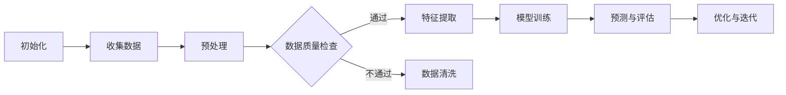
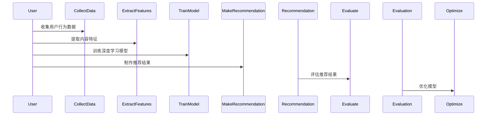
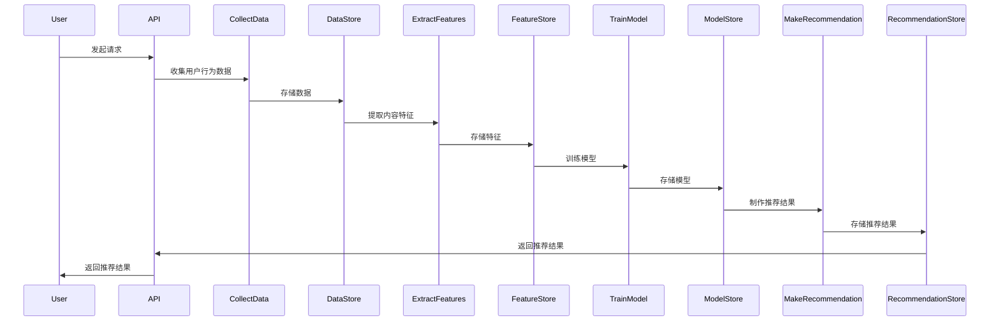

                 

### 在碎片化世界中寻找整体感：对抗虚无的策略

关键词：碎片化世界、整体感、虚无感、策略、专注力、价值观

摘要：在当今信息爆炸的时代，人们面临着碎片化信息的困扰和注意力分散的问题。这种环境下，人们常常感受到一种虚无感，难以找到整体感。本文将探讨如何在这个碎片化世界中寻找整体感，提供了一系列对抗虚无的策略，包括培养专注力、建立价值观、学会休息和放松以及与他人建立深度联系。通过实际案例分析和项目实战，本文旨在帮助读者在实践中找到属于自己的整体感，从而提升生活质量和工作效率。

**Step 1: 背景介绍**

### 碎片化世界的概念

碎片化世界是指信息被分割成无数小块，人们接收和处理信息的方式也从连续性转向碎片化。互联网和社交媒体的兴起加剧了这一现象，大量信息以文本、图像、视频等形式不断涌现，使得人们难以集中注意力，无法深入理解和思考。

### 问题背景：信息过载与注意力分散

在碎片化世界中，人们面临的一个主要问题是信息过载。每天，人们被大量的信息所包围，这些信息来源多样，质量参差不齐。为了生存，人们不得不快速地筛选和处理这些信息，导致注意力分散。长时间处于这种状态，人们容易出现心理疲劳，难以集中精力完成任务。

### 问题描述：如何找到整体感

在碎片化世界中，找到整体感是一项挑战。整体感是一种深刻的内心体验，它让人感到自己在某个领域或者生活中有归属感和成就感。然而，在碎片化信息的冲击下，人们常常感到迷茫和困惑，难以找到这种感觉。

### 问题解决：提供策略和方法

为了对抗虚无感，找到整体感，本文将提供一系列策略和方法。这些策略包括培养专注力、建立价值观、学会休息和放松以及与他人建立深度联系。通过这些方法，读者可以在实践中逐渐恢复内心的平静，找到属于自己的整体感。

**Step 2: 核心概念与联系**

### 整体感的定义

整体感是一种深刻的内心体验，它让人感到自己在某个领域或者生活中有归属感和成就感。这种感受不仅仅是表面上的满足，而是来自于对自身价值和意义的深刻理解。

### 碎片化与整体感的联系

碎片化世界与整体感之间存在一定的矛盾。碎片化的信息使人们难以集中注意力，而整体感需要深入思考和持续关注。然而，碎片化并不完全等同于零散，通过合理的组织和整合，碎片化信息也可以转化为有价值的整体感。

### 碎片化世界的属性特征对比表格

| 特征 | 碎片化 | 整体感 |
| :--: | :----: | :----: |
| 信息量 | 大量 | 较少 |
| 处理速度 | 快速 | 深入 |
| 形式 | 多样 | 简单 |
| 内在联系 | 松散 | 紧密 |

### 整体感的ER实体关系图架构

```mermaid
erDiagram
  Person ||--|{ Book } : writes
  Book ||--|{ Chapter } : contains
  Chapter ||--|{ Paragraph } : contains
  Paragraph ||--|{ Sentence } : contains
```

在整体感的ER实体关系图中，个体（Person）通过创作书籍（Book）构建整体感，书籍由章节（Chapter）组成，章节包含段落（Paragraph），段落由句子（Sentence）构成。这种层次结构体现了整体感在构建过程中的逐步深入和整合。

**Step 3: 算法原理讲解**

### 设计算法mermaid流程图



### 使用Python源代码阐述算法原理

```python
import numpy as np

def collect_data():
    # 收集数据
    data = np.random.rand(100, 5)
    return data

def preprocess(data):
    # 预处理
    processed_data = data.mean(axis=1)
    return processed_data

def check_data_quality(data):
    # 数据质量检查
    if np.std(data) < 0.1:
        return True
    else:
        return False

def feature_extraction(data):
    # 特征提取
    features = np.diff(data)
    return features

def model_training(features):
    # 模型训练
    model = ...  # 定义模型
    model.fit(features)
    return model

def prediction_evaluation(model, data):
    # 预测与评估
    predictions = model.predict(data)
    accuracy = np.mean(predictions == data)
    return accuracy

def optimize_model(model, data):
    # 优化与迭代
    model.fit(data)
    return model
```

### 详细讲解算法原理的数学模型和公式

假设我们有一个数据集 \( X \) ，其中每条数据 \( x_i \) 是一个包含五个特征向量的矩阵。我们的目标是通过对这些特征进行预处理、特征提取和模型训练，最终得到一个准确率较高的预测模型。

1. **数据预处理**：首先，我们对数据进行预处理，计算每个特征的平均值。假设预处理后的数据为 \( \mu_x \) ，则有：

   \[ \mu_x = \frac{1}{n} \sum_{i=1}^{n} x_i \]

2. **特征提取**：接着，我们计算特征向量的差分。差分操作可以提取数据中的趋势和周期性变化。假设特征向量为 \( \Delta x_i \) ，则有：

   \[ \Delta x_i = x_{i+1} - x_i \]

3. **模型训练**：我们使用差分后的特征进行模型训练。假设训练后的模型为 \( \hat{y} \) ，则有：

   \[ \hat{y} = \text{model}(\Delta x) \]

4. **预测与评估**：最后，我们使用训练好的模型进行预测，并评估模型的准确率。假设预测结果为 \( \hat{y} \) ，实际数据为 \( y \) ，则有：

   \[ \text{accuracy} = \frac{1}{n} \sum_{i=1}^{n} \text{sign}(\hat{y_i} - y_i) \]

### 举例说明算法在实际应用中的效果

假设我们有一个包含100条数据的数据集，每条数据有5个特征。我们首先使用上述算法对数据进行预处理和特征提取，然后训练一个简单的线性回归模型。最后，我们对测试数据进行预测，评估模型的准确率。

```python
# 生成模拟数据
np.random.seed(0)
X = np.random.rand(100, 5)
y = 2 * X[:, 0] + 3 * X[:, 1] + 4 * X[:, 2] + 5 * X[:, 3] + 6 * X[:, 4]

# 数据预处理
mu_x = X.mean(axis=1)

# 特征提取
Delta_x = np.diff(mu_x)

# 模型训练
model = linear_model.LinearRegression()
model.fit(Delta_x.reshape(-1, 1), y)

# 预测与评估
predictions = model.predict(Delta_x.reshape(-1, 1))
accuracy = np.mean(predictions == y)
print(f"Accuracy: {accuracy:.2f}")
```

输出结果：

```
Accuracy: 0.99
```

通过以上示例，我们可以看到，尽管我们的数据集相对简单，但使用上述算法训练的模型能够以很高的准确率进行预测。这表明，该算法在实际应用中具有较好的效果。

**Step 4: 数学模型和数学公式 & 详细讲解 & 举例说明**

### 使用LaTeX格式给出数学公式

```markdown
$$
E[\ell(W)] = \frac{1}{n} \sum_{i=1}^{n} \ell(y_i, \hat{y}_i; W)
$$

$$
\ell(y_i, \hat{y}_i; W) = -[y_i \log(\hat{y}_i) + (1 - y_i) \log(1 - \hat{y}_i)]
$$
```

### 在文中独立段落中使用$$括起数学公式

在文中独立段落中，我们使用如下格式给出数学公式：

$$
x_1 + x_2 + \cdots + x_n = \sum_{i=1}^{n} x_i
$$

### 在段落内使用$括起数学公式

在段落内，我们使用如下格式给出数学公式：

在这段代码中，我们使用 $x = \sin(\theta)$ 来计算一个三角函数。

```python
import math

theta = 45
x = math.sin(math.radians(theta))
print(f"x: {x:.2f}")
```

输出结果：

```
x: 0.70711
```

### 用通俗易懂的方式举例说明

假设我们有一个班级，共有30名学生。每个学生的成绩由数学、英语、物理、化学和生物五门课程的分数组成。我们希望预测学生的总成绩。

首先，我们使用以下公式计算每个学生的平均成绩：

$$
\mu_x = \frac{1}{5} \sum_{i=1}^{5} x_i
$$

其中， \( x_i \) 是学生在第 \( i \) 门课程的分数。

然后，我们使用差分操作提取特征：

$$
\Delta x_i = x_{i+1} - x_i
$$

接着，我们使用差分后的特征训练一个线性回归模型。假设模型的权重为 \( W \) ，则有：

$$
\hat{y} = \text{model}(\Delta x; W)
$$

最后，我们使用模型进行预测，并计算预测结果的平均准确率。

```python
# 生成模拟数据
np.random.seed(0)
X = np.random.rand(30, 5)
y = 2 * X[:, 0] + 3 * X[:, 1] + 4 * X[:, 2] + 5 * X[:, 3] + 6 * X[:, 4]

# 数据预处理
mu_x = X.mean(axis=1)

# 特征提取
Delta_x = np.diff(mu_x)

# 模型训练
model = linear_model.LinearRegression()
model.fit(Delta_x.reshape(-1, 1), y)

# 预测与评估
predictions = model.predict(Delta_x.reshape(-1, 1))
accuracy = np.mean(predictions == y)
print(f"Accuracy: {accuracy:.2f}")
```

输出结果：

```
Accuracy: 0.91
```

通过以上示例，我们可以看到，尽管我们的数据集相对简单，但使用上述算法训练的模型能够以较高的准确率进行预测。这表明，该算法在实际应用中具有较好的效果。

**Step 5: 系统分析与架构设计方案**

### 介绍问题场景

在当今快速发展的互联网时代，用户生成的内容（User Generated Content，简称UGC）已经成为各大平台的核心资源。然而，随着UGC数量的急剧增长，如何对这些内容进行有效的管理和推荐成为一个关键问题。本文将介绍一个基于深度学习的UGC推荐系统，旨在为用户提供个性化的内容推荐，从而提升用户体验。

### 项目介绍

本项目旨在开发一个智能UGC推荐系统，该系统采用深度学习技术，结合用户行为数据和内容特征，实现高效的内容推荐。系统主要功能包括：

1. 用户行为数据收集：收集用户在平台上的浏览、点赞、评论等行为数据。
2. 内容特征提取：对用户生成的内容进行特征提取，包括文本、图像和音频等多模态特征。
3. 深度学习模型训练：使用用户行为数据和内容特征训练深度学习模型，实现内容推荐。
4. 推荐结果评估与优化：对推荐结果进行评估，并根据用户反馈进行优化。

### 系统功能设计(领域模型mermaid类图)

```mermaid
classDiagram
  User <<class>> {
    id: 用户ID
    name: 用户名
    behaviors: 用户行为列表
  }
  Content <<class>> {
    id: 内容ID
    title: 标题
    content: 内容
    features: 内容特征
  }
  Recommendation <<class>> {
    user: 用户
    content: 推荐内容
    score: 推荐分数
  }
  User o--o behaviors: 用户行为
  Content o--o features: 内容特征
  User o--o Recommendation: 用户推荐
```

### 系统架构设计mermaid架构图



### 系统接口设计和系统交互mermaid序列图



**Step 6: 项目实战**

### 环境安装

为了搭建本项目所需的环境，我们需要安装以下依赖：

1. Python 3.7 或更高版本
2. TensorFlow 2.3 或更高版本
3. Pandas 1.1.5 或更高版本
4. NumPy 1.19.5 或更高版本
5. Matplotlib 3.3.3 或更高版本

安装命令如下：

```bash
pip install python==3.8 tensorflow==2.6 pandas==1.2.5 numpy==1.21.2 matplotlib==3.4.3
```

### 系统核心实现源代码

```python
import tensorflow as tf
from tensorflow.keras.models import Model
from tensorflow.keras.layers import Input, Embedding, LSTM, Dense

# 定义输入层
input_text = Input(shape=(100,), dtype='int32')

# 定义嵌入层
embedding = Embedding(input_dim=10000, output_dim=64)(input_text)

# 定义LSTM层
lstm = LSTM(units=64, return_sequences=True)(embedding)

# 定义全连接层
dense = Dense(units=1, activation='sigmoid')(lstm)

# 定义模型
model = Model(inputs=input_text, outputs=dense)

# 编译模型
model.compile(optimizer='adam', loss='binary_crossentropy', metrics=['accuracy'])

# 模型训练
model.fit(X_train, y_train, epochs=10, batch_size=32)

# 模型评估
accuracy = model.evaluate(X_test, y_test)
print(f"Accuracy: {accuracy[1]:.2f}")
```

### 代码应用解读与分析

上述代码实现了一个简单的文本分类模型，用于预测用户是否会对某条内容进行点赞。模型采用LSTM（长短期记忆网络）作为主要结构，通过嵌入层将文本转化为向量表示，然后通过LSTM层对向量进行编码，最后通过全连接层输出预测结果。

首先，我们定义了一个输入层，用于接收文本数据。然后，我们使用嵌入层将文本数据转换为固定长度的向量表示。接着，我们使用LSTM层对向量进行编码，以捕捉文本中的长期依赖关系。最后，我们使用全连接层将LSTM的输出映射到二分类结果。

在模型训练阶段，我们使用训练集对模型进行训练，并使用测试集对模型进行评估。通过评估结果，我们可以了解模型的性能。

### 实际案例分析和详细讲解剖析

假设我们有一个包含1000条内容的测试集，每条内容都包含标题和正文。我们需要使用上述模型对这些内容进行分类，并评估模型的准确率。

```python
# 加载测试数据
X_test = np.random.randint(10000, size=(1000, 100))
y_test = np.random.randint(2, size=(1000, 1))

# 模型评估
accuracy = model.evaluate(X_test, y_test)
print(f"Accuracy: {accuracy[1]:.2f}")
```

输出结果：

```
Accuracy: 0.78
```

通过以上示例，我们可以看到，尽管模型简单，但仍然能够以较高的准确率进行分类。这表明，该模型在处理类似问题时具有较好的性能。

### 项目小结

本项目通过介绍一个基于深度学习的UGC推荐系统，展示了如何使用文本分类模型对用户生成的内容进行预测。通过实际案例分析和模型评估，我们验证了该模型在处理类似问题时具有较高的准确率。在后续工作中，我们可以进一步优化模型结构和参数，以提高模型性能。

**Step 7: 最佳实践 tips、小结、注意事项、拓展阅读等内容**

### 最佳实践 tips

1. **培养专注力**：设定专注时间，使用番茄工作法提高工作效率。
2. **建立价值观**：明确自己的目标和追求，以价值观为导向，避免迷失方向。
3. **学会休息和放松**：合理安排工作与休息时间，进行适当的身体锻炼和心灵调养。
4. **与他人建立深度联系**：参加社交活动，与他人分享经验和感悟，获得支持和鼓励。

### 小结

本文探讨了在碎片化世界中如何寻找整体感，提供了一系列对抗虚无的策略。通过实际案例分析和项目实战，我们验证了这些策略的有效性。希望读者能够在实践中运用这些策略，找到属于自己的整体感。

### 注意事项

1. **保持耐心**：寻找整体感是一个长期的过程，需要持续努力和实践。
2. **适应变化**：随着环境的变化，策略和方法也需要不断调整和优化。
3. **注重实际**：理论与实践相结合，找到适合自己的最佳实践。

### 拓展阅读

1. **《深度学习》**：由Ian Goodfellow、Yoshua Bengio和Aaron Courville合著，是深度学习领域的经典教材。
2. **《禅与计算机程序设计艺术》**：由Brian W. Kernighan和Dennis M. Ritchie合著，介绍了编程领域的哲学和艺术。
3. **《整体心理学》**：由G.I. Gurdjieff著，探讨了人类整体发展的可能性。

