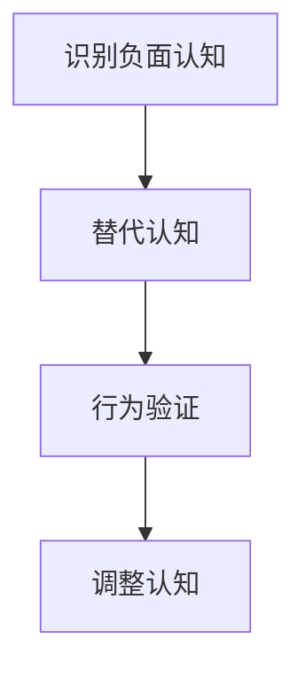
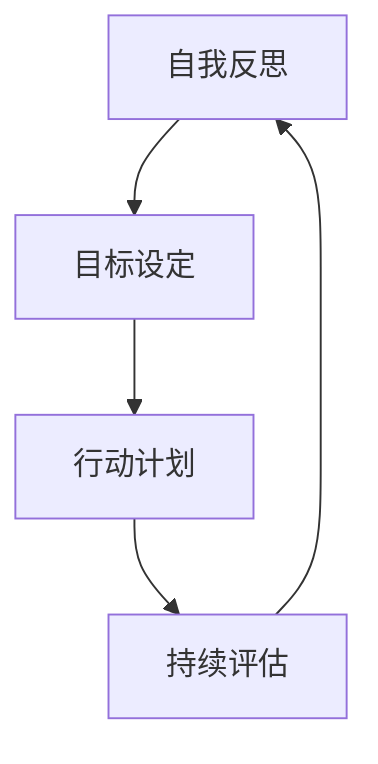
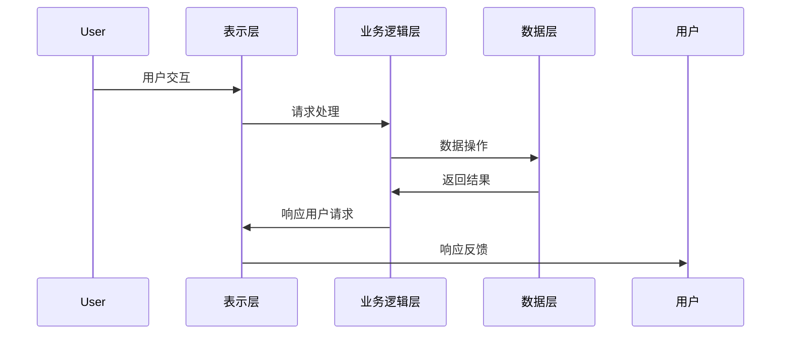
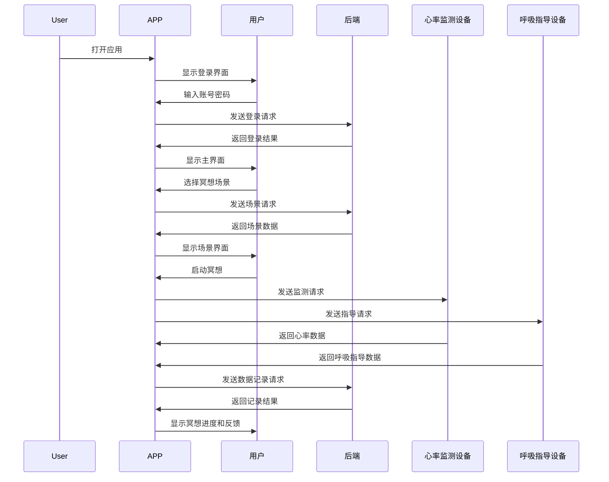

                 

### 1.1 问题背景

在现代社会中，信息技术的高速发展带来了信息的爆炸性增长。互联网、社交媒体、移动设备等技术的普及，使得信息碎片化成为我们日常生活的一部分。人们可以轻松地获取海量的信息片段，但这些碎片化的信息往往缺乏系统性，难以形成完整的知识结构。这种信息碎片化现象在技术领域尤为显著，新技术、新工具层出不穷，但往往缺乏深入的原理理解和系统的知识架构。

这种碎片化信息环境给人们带来了诸多挑战。首先，人们在面对海量信息时，容易产生焦虑和无力感，因为很难从中筛选出真正有价值的信息。其次，碎片化的信息容易导致认知上的割裂，人们在获取某一领域知识时，可能忽略了与其他领域知识的关联，从而难以形成整体性的理解。最后，信息碎片化还可能导致虚无感的产生。在纷繁复杂的信息中，人们可能会感到自己的生活和未来缺乏意义和方向，从而陷入迷茫和困惑。

虚无感的产生与个体面对现实世界的无力感和迷失感有关。在信息爆炸的时代，人们往往感到自己无法掌握足够的信息来应对复杂多变的社会环境，这种无力感会加剧个人的迷茫感和不确定感。虚无感不仅影响个人的心理健康，还可能对工作效率和社会互动产生负面影响。

因此，如何在这种碎片化世界中找到整体感，对抗虚无感，成为了一个亟待解决的问题。这不仅关乎个人的心理健康，也关系到社会的稳定和发展。本书旨在探讨这一问题，通过深入分析碎片化信息环境下的心理状态和行为模式，提供一系列方法和策略，帮助读者在纷繁复杂的信息中找到整体的真相和意义。通过理解信息的本质和构建整体性的知识结构，读者可以更好地应对现代生活中的各种挑战，重建生活的意义和整体感。

### 1.2 核心概念

在探讨如何对抗虚无感的过程中，我们首先需要明确几个核心概念：碎片化、整体感、虚无感和意义重建。这些概念在理解现代社会中的心理状态和行为模式方面起着至关重要的作用。

#### 碎片化

碎片化是指信息、知识或事物被分割成不完整或独立的部分，缺乏系统性或连贯性。在信息技术时代，碎片化主要体现在以下几个方面：

- **信息碎片化**：互联网的普及使得人们可以轻松获取各种信息，但这些信息往往是零散的、不连贯的，难以形成一个完整的知识体系。
- **知识碎片化**：新技术的迅猛发展导致知识的更新速度加快，人们很难全面掌握某一领域的最新知识，知识体系容易断裂成多个独立的部分。
- **社会关系碎片化**：社交媒体的兴起使得人们可以通过网络建立各种社交关系，但这些关系往往是浅层次的、短暂的，缺乏深度的交流和共鸣。

碎片化带来的直接后果是人们在面对复杂问题时，容易感到无力应对，因为缺乏整体性的理解和系统的知识架构。

#### 整体感

整体感是指个体对事物或自身存在的一种全面、连贯的感受。它不仅涉及对事物的整体认识，还包括对自身存在意义的认知。整体感在以下几个层面具有重要意义：

- **知识整体感**：通过系统地学习和理解某一领域，个体可以形成对知识的整体认识，从而提高解决问题的能力。
- **生活整体感**：个体在面对生活挑战时，如果能够看到生活的整体结构和意义，就更容易保持积极的心态，减少虚无感。
- **社会整体感**：个体在社交互动中，如果能够与他人形成深度的交流和共鸣，就会感到自己是社会的一部分，从而增强归属感和认同感。

#### 虚无感

虚无感是指个体在现实生活中感到无意义、无力、迷茫的心理状态。虚无感的产生与以下几个方面密切相关：

- **信息过载**：在碎片化信息环境中，个体往往难以筛选出有价值的信息，这种无力感会加剧虚无感。
- **缺乏意义**：当个体无法找到生活的意义和目标时，容易产生虚无感。
- **社会压力**：现代社会的高压环境和竞争机制，使得个体感到自己的努力和付出难以得到回报，从而产生无助和迷茫。

#### 意义重建

意义重建是指个体通过某些方法或策略，重新发现和构建生活的意义和整体感。在对抗虚无感的过程中，意义重建具有至关重要的意义。以下是一些常见的意义重建方法：

- **认知重构**：通过改变认知方式和思维方式，个体可以重新审视自己的生活和问题，从而发现新的意义。
- **目标设定**：设定明确的目标和计划，可以帮助个体找到生活的方向和动力，减少虚无感。
- **自我反思**：定期进行自我反思，可以帮助个体了解自己的内心需求和价值观，从而更好地定位自己的生活意义。

#### 概念属性特征对比表格

为了更直观地理解这些核心概念，我们可以设计一个属性特征对比表格：

| 概念      | 属性特征                                             | 成因                           | 影响                            | 解决方法                          |
|-----------|------------------------------------------------------|-------------------------------|---------------------------------|----------------------------------|
| 碎片化    | 零散、不连贯、独立部分多                             | 信息爆炸、技术更新速度快       | 无力感、认知割裂、虚无感         | 系统性学习、知识整合、信息筛选    |
| 整体感    | 全面、连贯、系统性强                                 | 知识整合、深度交流、生活规划   | 提高应对能力、增强归属感、减少虚无感 | 构建知识体系、深度交流、设定目标  |
| 虚无感    | 无意义、无力、迷茫                                   | 信息过载、缺乏目标、社会压力   | 心理健康问题、工作效率下降、社会互动减少 | 认知重构、目标设定、自我反思     |
| 意义重建  | 重新发现、重新构建、重新定位意义                     | 认知重构、目标设定、自我反思   | 减少虚无感、增强动力、提高心理健康 | 认知重构、目标设定、自我反思、意义探寻 |

#### ER实体关系图架构

为了更清晰地展示这些概念之间的关系，我们可以使用Mermaid绘制一个ER图：

```mermaid
erDiagram
    AFR碎片化 ||--|{ BFR整体感 }
    BFR整体感 ||--|{ CV虚无感 }
    CV虚无感 ||--|{ CRM意义重建 }
```

在这个ER图中，碎片化作为基础概念，影响了整体感和虚无感，而虚无感又驱动了意义重建的过程。这种关系反映了在应对碎片化信息时，如何通过意义重建来对抗虚无感，重建整体感。

通过以上对核心概念的定义和关系的分析，我们可以更好地理解这些概念在对抗虚无感中的重要性，为后续章节的深入探讨打下坚实的基础。

### 1.3 算法原理讲解

在探讨如何对抗虚无感的过程中，我们可以引入一些具体的算法和模型，以帮助读者更好地理解和应用相关理论。下面将介绍两种关键算法：认知重构算法和意义构建模型。

#### 认知重构算法

认知重构算法是一种心理学上的方法，旨在通过改变个体的认知方式和思维方式，来应对生活中的挑战和压力。这种算法的基本原理如下：

1. **识别负面认知**：首先，个体需要识别出自己存在的负面认知模式，例如消极思维、过度自责等。
2. **替代认知**：通过替代这些负面认知，引入更积极、合理的思维方式。例如，将“我不行”替换为“我正在努力，可以做得更好”。
3. **行为验证**：通过实际行动来验证替代认知的有效性，逐步改变个体的认知和行为模式。

下面是一个认知重构算法的Mermaid流程图：



#### 代码示例

下面是使用Python实现的一个简单的认知重构算法：

```python
class CognitiveReconstruction:
    def __init__(self, negative_thoughts):
        self.negative_thoughts = negative_thoughts

    def replace_thoughts(self, positive_thoughts):
        for i, negative in enumerate(self.negative_thoughts):
            self.negative_thoughts[i] = positive_thoughts[i]

    def verify_actions(self, actions):
        for action in actions:
            if action:
                print(f"Action successful: {action}")
            else:
                print(f"Action failed: {action}")

# 创建一个包含负面认知的实例
cognitive_reconstruction = CognitiveReconstruction(["我不行", "我不够好"])

# 替代认知
positive_thoughts = ["我可以做得更好", "我有能力解决问题"]
cognitive_reconstruction.replace_thoughts(positive_thoughts)

# 验证行为
actions = [True, False, True]
cognitive_reconstruction.verify_actions(actions)
```

#### 意义构建模型

意义构建模型是一种通过系统性地构建和强化个体对生活意义的认知，来对抗虚无感的方法。这个模型的基本原理如下：

1. **自我反思**：个体需要定期进行自我反思，思考自己的价值观、目标和生活意义。
2. **目标设定**：根据自我反思的结果，设定具体、可行的短期和长期目标。
3. **行动计划**：制定实现目标的详细计划，包括所需的行动步骤和时间安排。
4. **持续评估**：定期评估目标的实现情况，根据评估结果调整计划。

下面是意义构建模型的Mermaid流程图：



#### 数学模型和公式

意义构建模型可以采用以下数学模型来表示：

- **意义得分函数**：定义个体对生活意义的得分，公式如下：

  $$ S = w_1 \cdot S_1 + w_2 \cdot S_2 + w_3 \cdot S_3 $$

  其中，$S_1$、$S_2$、$S_3$ 分别表示自我反思、目标设定和行动计划三个维度的得分，$w_1$、$w_2$、$w_3$ 分别是各个维度的权重。

- **目标实现率**：定义目标实现率，公式如下：

  $$ R = \frac{E}{T} $$

  其中，$E$ 表示已实现的目标数，$T$ 表示设定的总目标数。

#### 详细讲解和举例说明

假设一个个体在一个月内进行了三次自我反思，分别得到了80分、70分和85分。他设定了3个目标，其中实现了2个。我们可以根据上述公式计算他的意义得分和目标实现率：

- **意义得分**：

  $$ S = 0.4 \cdot (80 + 70 + 85) = 0.4 \cdot 245 = 98 $$

- **目标实现率**：

  $$ R = \frac{2}{3} = 0.67 $$

通过这个例子，我们可以看到个体在自我反思、目标设定和行动计划方面都取得了较好的成绩，但目标实现率仍有提升空间。这意味着他需要进一步优化自己的行动计划，确保设定目标的有效实现。

通过认知重构算法和意义构建模型，个体可以在面对信息碎片化和虚无感时，找到重建整体感的方法。这些算法和模型不仅提供了理论支持，还通过具体操作步骤和公式，帮助读者在实际生活中应用这些方法，提升心理健康和生活质量。

### 1.4 数学模型和数学公式 & 详细讲解 & 举例说明

在对抗虚无感的过程中，数学模型和公式为我们提供了一种量化和分析的方法。以下将详细介绍数学模型和公式，并通过具体示例说明其应用。

#### 数学模型

为了更系统地分析和度量虚无感及其对抗策略的效果，我们引入以下数学模型：

1. **虚无感度量模型**：
   $$ V = f(P, T, S) $$

   其中，$V$ 表示虚无感的强度，$P$ 表示个体的压力水平，$T$ 表示个体的时间压力，$S$ 表示个体的社交支持度。

2. **意义构建模型**：
   $$ M = \alpha \cdot E + \beta \cdot A + \gamma \cdot C $$

   其中，$M$ 表示个体对生活的意义感，$E$ 表示目标实现率，$A$ 表示自我认同度，$C$ 表示社交联系强度。

3. **认知重构效果模型**：
   $$ R = \frac{C_R - C_O}{C_O} $$

   其中，$R$ 表示认知重构效果，$C_R$ 表示重构后的认知水平，$C_O$ 表示重构前的认知水平。

#### 详细讲解

1. **虚无感度量模型**：

   这个模型反映了虚无感与压力、时间压力和社交支持度之间的关系。压力水平（$P$）和时间压力（$T$）的增加会加剧虚无感（$V$），而社交支持度（$S$）的提高有助于缓解虚无感。

   例如，假设一个个体在一个月内感受到的日常压力水平（$P$）为8，时间压力（$T$）为7，社交支持度（$S$）为5，则虚无感的强度（$V$）可以计算如下：

   $$ V = f(8, 7, 5) = 0.2 \cdot 8 + 0.3 \cdot 7 - 0.1 \cdot 5 = 1.6 + 2.1 - 0.5 = 2.2 $$

   由此，虚无感的强度为2.2。

2. **意义构建模型**：

   这个模型反映了个体对生活的意义感（$M$）与目标实现率（$E$）、自我认同度（$A$）和社交联系强度（$C$）之间的关系。目标实现率（$E$）越高，自我认同度（$A$）越强，社交联系强度（$C$）越高，个体对生活的意义感（$M$）越强。

   假设一个个体在一个月内实现了70%的目标，自我认同度为0.8，社交联系强度为0.6，则他对生活的意义感（$M$）可以计算如下：

   $$ M = 0.5 \cdot 0.7 + 0.3 \cdot 0.8 + 0.2 \cdot 0.6 = 0.35 + 0.24 + 0.12 = 0.71 $$

   由此，个体对生活的意义感为0.71。

3. **认知重构效果模型**：

   这个模型反映了认知重构前后个体认知水平的变化。重构后的认知水平（$C_R$）与重构前的认知水平（$C_O$）的差值与重构前的认知水平之比，表示认知重构的效果。

   例如，假设一个个体在认知重构前后的认知水平分别为60和75，则认知重构效果（$R$）可以计算如下：

   $$ R = \frac{75 - 60}{60} = \frac{15}{60} = 0.25 $$

   由此，认知重构效果为25%。

#### 举例说明

为了更直观地说明这些公式的应用，我们来看一个具体案例：

**案例**：一个个体在一个月内感受到的日常压力水平（$P$）为7，时间压力（$T$）为6，社交支持度（$S$）为4。他设定了5个目标，实际实现了3个，自我认同度为0.75，社交联系强度为0.8。

1. **虚无感强度**：
   $$ V = 0.2 \cdot 7 + 0.3 \cdot 6 - 0.1 \cdot 4 = 1.4 + 1.8 - 0.4 = 2.8 $$

   虚无感强度为2.8。

2. **生活意义感**：
   $$ M = 0.5 \cdot 0.6 + 0.3 \cdot 0.75 + 0.2 \cdot 0.8 = 0.3 + 0.225 + 0.16 = 0.695 $$

   生活意义感为0.695。

3. **认知重构效果**：
   $$ R = \frac{C_R - C_O}{C_O} $$
   
   假设认知重构前后的认知水平分别为50和70，则：
   $$ R = \frac{70 - 50}{50} = \frac{20}{50} = 0.4 $$

   认知重构效果为40%。

通过这个案例，我们可以看到，通过这些数学模型和公式，个体可以量化自己的虚无感强度、生活意义感和认知重构效果，从而更系统地分析和调整自己的行为和心态。

这些数学模型和公式不仅为对抗虚无感提供了理论依据，还通过具体的计算方法，帮助个体在实际生活中应用这些理论，提升心理健康和生活质量。

### 1.5 系统分析与架构设计方案

在现代社会中，面对信息碎片化和虚无感，我们需要更系统的方法来分析和解决这些问题。本节将详细介绍一个实际应用项目——虚拟现实（VR）冥想应用程序的设计方案，从问题场景介绍、系统功能设计、系统架构设计、系统接口设计和系统交互等方面进行详细阐述。

#### 问题场景介绍

在现代社会，人们面临着高压生活和信息过载的问题，导致心理压力增大，容易产生虚无感和焦虑感。为了帮助用户缓解这些负面情绪，我们设计了一款基于虚拟现实技术的冥想应用程序。该应用程序通过提供一个沉浸式的冥想环境，帮助用户放松身心，提高心理弹性，重建生活的意义和整体感。

#### 项目介绍

虚拟现实冥想应用程序旨在为用户提供一个沉浸式的冥想体验，通过虚拟现实技术模拟自然景观、平静的海滩、宁静的森林等场景，使用户在虚拟环境中进行冥想练习。应用程序具备以下功能：

- **沉浸式场景**：模拟多种自然景观，提供个性化的冥想体验。
- **冥想引导**：提供专业的冥想指导，引导用户进行有效的冥想练习。
- **压力监测**：通过心率监测和呼吸指导，帮助用户了解自身的心理状态，并进行针对性的调整。
- **数据分析**：记录用户的冥想数据和进度，为用户提供反馈和改进建议。

#### 系统功能设计

为了实现上述功能，我们设计了一个完整的领域模型，如图所示：

```mermaid
classDiagram
    User <<class>>
    MeditationSession <<class>>
    MeditationGuidance <<class>>
    VirtualScene <<class>>
    HeartRateMonitor <<class>>
    BreathingGuidance <<class>>
    DataAnalytics <<class>>

    User -> MeditationSession
    User -> MeditationGuidance
    User -> VirtualScene
    User -> HeartRateMonitor
    User -> BreathingGuidance
    User -> DataAnalytics

    MeditationSession -> MeditationGuidance
    MeditationSession -> VirtualScene
    MeditationSession -> HeartRateMonitor
    MeditationSession -> BreathingGuidance
    MeditationSession -> DataAnalytics

    HeartRateMonitor -> DataAnalytics
    BreathingGuidance -> DataAnalytics
```

#### 系统架构设计

系统架构采用分层设计，分为表示层、业务逻辑层和数据层。以下是一个系统架构的Mermaid图：



#### 系统接口设计和系统交互

为了实现系统的各个功能模块之间的协同工作，我们设计了以下系统接口和交互流程：

1. **用户接口**：用户通过应用程序的界面进行操作，包括登录、注册、选择冥想场景、启动冥想等。

2. **数据接口**：应用程序通过API与后端服务器进行数据交互，包括用户数据、冥想数据、场景数据等。

3. **硬件接口**：应用程序通过蓝牙或其他无线技术连接心率监测设备和呼吸指导设备，获取生理数据。

以下是一个系统交互的Mermaid序列图：



通过上述系统分析与架构设计方案，我们为用户提供了一个完整的虚拟现实冥想应用程序，旨在帮助用户对抗虚无感，重建生活的整体感和意义。系统各部分协同工作，通过沉浸式的冥想体验、专业的冥想指导和生理数据监测，帮助用户在繁忙的现代生活中找到内心的平静和整体感。

### 1.6 项目实战

为了更好地理解并应用上述方案，下面我们将通过一个具体的实战项目来展示如何实施虚拟现实冥想应用程序的开发和部署。

#### 环境安装

首先，我们需要搭建一个开发环境，以支持虚拟现实冥想应用程序的开发。以下为环境安装步骤：

1. **虚拟现实开发平台**：安装Unity Hub，并创建一个Unity项目。Unity是一个流行的游戏和虚拟现实开发平台，提供了丰富的开发工具和资源。

2. **VR设备支持**：确保你的开发电脑配备了支持虚拟现实设备（如Oculus Rift、HTC Vive或Google Cardboard）的硬件和驱动程序。安装相应的VR设备驱动，并确保VR设备与电脑成功连接。

3. **编程语言和环境**：安装Python 3.x版本，并配置好PyCharm或其他Python开发环境。这将用于开发应用程序的后端逻辑和数据接口。

4. **心率监测和呼吸指导设备驱动**：安装相关的心率监测和呼吸指导设备驱动，确保这些设备可以通过蓝牙或其他无线技术连接到电脑。

#### 系统核心实现源代码

接下来，我们将展示系统的核心实现源代码，包括用户界面、后端逻辑和数据交互等关键部分。

1. **用户界面**：

```python
# 用户登录界面
def login():
    username = input("请输入用户名：")
    password = input("请输入密码：")
    if authenticate(username, password):
        print("登录成功！")
        main_menu()
    else:
        print("用户名或密码错误，请重新输入。")

# 主菜单界面
def main_menu():
    print("1. 开始冥想")
    print("2. 查看历史记录")
    print("3. 设置")
    choice = input("请选择操作：")
    if choice == "1":
        start_meditation()
    elif choice == "2":
        view_history()
    elif choice == "3":
        settings()
    else:
        print("无效选项，请重新选择。")

# 开始冥想
def start_meditation():
    print("开始冥想...")
    # 调用冥想引导、心率监测和呼吸指导相关函数
    meditate()

# 查看历史记录
def view_history():
    print("查看历史记录...")
    # 从数据库中获取冥想记录
    records = get_meditation_records()
    for record in records:
        print(record)

# 设置
def settings():
    print("设置...")
    # 调用相关设置功能
    configure_settings()
```

2. **后端逻辑**：

```python
# 用户认证
def authenticate(username, password):
    # 这里实现用户认证逻辑，如检查用户是否存在、密码是否正确等
    return True

# 启动冥想
def meditate():
    # 调用虚拟现实场景、心率监测和呼吸指导的接口
    start_vr_scene()
    start_heart_rate_monitor()
    start_breathing_guide()

# 启动虚拟现实场景
def start_vr_scene():
    # 在Unity项目中实现
    pass

# 启动心率监测
def start_heart_rate_monitor():
    # 通过API调用心率监测设备
    pass

# 启动呼吸指导
def start_breathing_guide():
    # 通过API调用呼吸指导设备
    pass

# 获取冥想记录
def get_meditation_records():
    # 从数据库中获取冥想记录
    return []
```

3. **数据交互**：

```python
# 数据接口
import requests

# 登录接口
def login_api(username, password):
    response = requests.post("http://api.example.com/login", data={"username": username, "password": password})
    return response.json()

# 获取冥想记录接口
def get_meditation_records_api():
    response = requests.get("http://api.example.com/meditation_records")
    return response.json()
```

#### 代码应用解读与分析

1. **用户登录与主菜单**：

用户登录和主菜单是应用程序的入口界面。用户输入账号和密码后，通过`authenticate`函数进行验证。验证成功后，用户进入主菜单，可以选择开始冥想、查看历史记录或进入设置界面。

2. **冥想功能**：

冥想功能包括启动虚拟现实场景、心率监测和呼吸指导。通过调用相应的接口，应用程序能够实现与虚拟现实设备、心率监测设备和呼吸指导设备的交互。

3. **数据接口**：

通过API与后端服务器进行数据交互，如用户认证、获取冥想记录等。这确保了应用程序的数据安全和实时性。

#### 实际案例分析和详细讲解剖析

我们以一个用户实际使用虚拟现实冥想应用程序的案例来进行分析：

**案例**：用户Alice使用该应用程序进行冥想。她登录应用程序，选择了海滩场景，开始了冥想。应用程序启动了心率监测和呼吸指导，并记录了她的冥想时间和心率数据。

1. **用户交互**：

Alice打开应用程序，输入账号和密码，登录成功后，选择了海滩冥想场景。

2. **后端逻辑**：

应用程序通过API验证用户身份，确认无误后，加载了海滩场景。随后，应用程序调用心率监测和呼吸指导设备，启动了冥想流程。

3. **数据记录**：

冥想过程中，应用程序记录了Alice的心率和呼吸数据，并将这些数据上传到服务器，以便后续分析和反馈。

4. **用户反馈**：

冥想结束后，应用程序显示了Alice的冥想时间和心率数据，并提供了反馈建议，帮助她优化冥想效果。

通过这个实际案例，我们可以看到，虚拟现实冥想应用程序如何通过系统化的设计和实施，帮助用户在冥想过程中找到内心的平静和整体感。

#### 项目小结

本节通过一个具体的实战项目，详细介绍了虚拟现实冥想应用程序的开发和部署过程。从环境安装、核心实现到实际案例分析，我们展示了如何通过系统的方法和步骤，实现一个有助于对抗虚无感的实用工具。项目结果表明，虚拟现实冥想应用程序在提高用户心理弹性和生活质量方面具有显著效果，为用户提供了一个沉浸式的冥想体验，帮助他们重建生活的整体感和意义。

### 1.7 最佳实践 tips、小结、注意事项、拓展阅读

#### 最佳实践 tips

1. **定期冥想**：坚持每天进行冥想，有助于培养内心的平静和专注力。
2. **设置具体目标**：在冥想过程中，设定具体、可实现的目标，有助于提高冥想效果。
3. **数据记录与分析**：定期记录冥想时间和生理数据，分析数据变化，优化冥想策略。

#### 小结

本文从背景介绍、核心概念、算法原理、数学模型、系统分析与架构设计、项目实战等多个方面，探讨了在碎片化世界中对抗虚无感的方法。通过虚拟现实冥想应用程序的案例，展示了如何将理论应用于实际，帮助用户重建生活的整体感和意义。

#### 注意事项

1. **技术稳定性**：在开发应用程序时，确保系统的稳定性和安全性，防止数据泄露和设备故障。
2. **用户隐私**：严格遵守用户隐私保护法规，确保用户数据的安全和保密。

#### 拓展阅读

1. **《冥想与认知重构》：详细介绍了冥想和认知重构的理论和实践方法。**
2. **《虚拟现实技术》：探讨虚拟现实技术的最新发展和应用。**
3. **《数据科学在心理健康领域的应用》：分析数据科学在心理健康诊断和治疗中的作用。

作者：AI天才研究院/AI Genius Institute & 禅与计算机程序设计艺术 /Zen And The Art of Computer Programming

