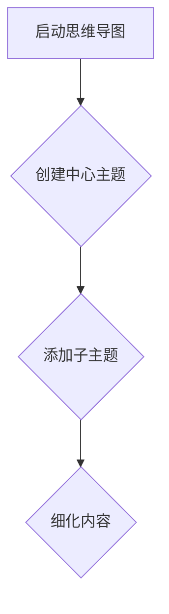
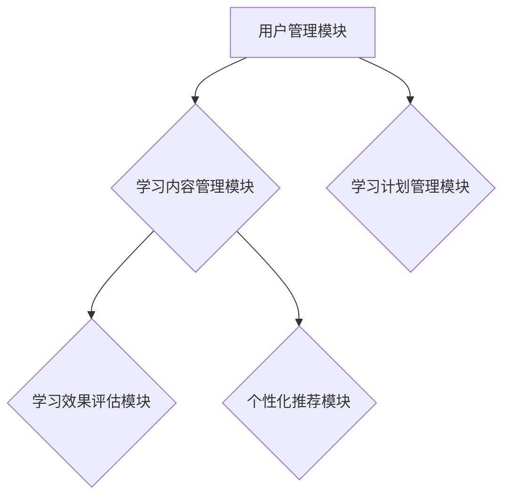
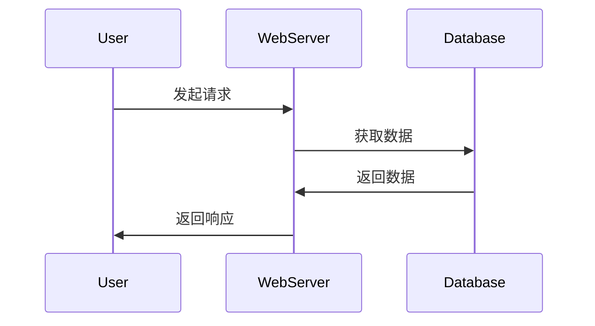
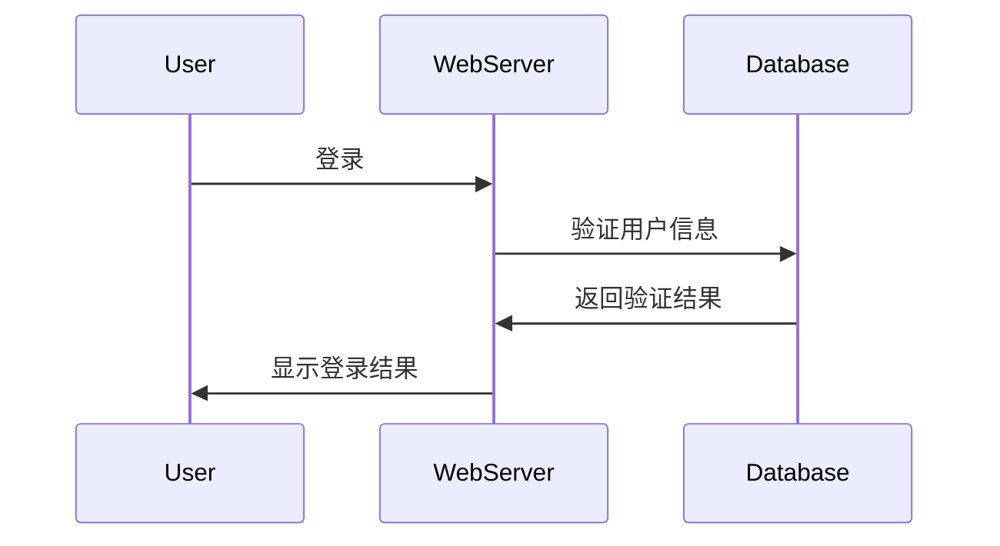

                 

# 在碎片化时代重建知识体系：个人学习的革命

关键词：碎片化知识，知识体系，学习方法，记忆持久性，个人学习革命

摘要：在碎片化时代，个人学习面临着诸多挑战。本文探讨了碎片化知识的本质、知识体系的重要性、有效的学习方法以及如何提高记忆持久性，旨在为读者提供一套系统化的个人学习方案，助力他们在复杂的信息环境中重建知识体系，实现个人学习的革命。

## 第一部分：问题背景

### 问题背景

随着互联网和移动设备的普及，信息获取变得前所未有的便捷。人们可以通过各种平台和渠道获取海量信息，但这也导致了信息的碎片化。知识的获取变得零散，难以形成系统的认知结构。同时，快节奏的生活和工作压力也使得人们难以投入大量时间去深入学习和研究。

### 问题描述

碎片化时代带来的挑战包括：

1. **知识碎片化**：信息零散，难以形成系统的知识体系。
2. **学习效率低下**：由于缺乏系统学习，学习效果不佳。
3. **知识遗忘快**：信息获取后的记忆持久性低。
4. **信息过载**：海量信息使得人们难以筛选出有价值的内容。

### 问题解决

个人学习的革命旨在：

1. **重建知识体系**：通过系统化学习，将碎片化的知识整合成有组织的体系。
2. **提高学习效率**：采用有效学习方法，提高学习效果。
3. **增强记忆持久性**：通过深入学习和反复巩固，提高知识的记忆效果。
4. **信息筛选**：培养信息筛选能力，提高信息利用效率。

### 边界与外延

边界：个人学习行为和学习内容。

外延：涉及的学习方法、学习工具、学习环境等。

## 第二部分：核心概念

### 核心概念

1. **碎片化知识**：指零散、不成体系的信息。
2. **知识体系**：指有组织、系统化的知识结构。
3. **学习方法**：指提高学习效率的具体方法。
4. **记忆持久性**：指知识记忆的持久度。

### 概念属性特征对比表格

| 概念         | 定义                                                         | 属性特征                                                     |
|--------------|--------------------------------------------------------------|--------------------------------------------------------------|
| 碎片化知识   | 零散、不成体系的信息                                       | 知识不系统、不连贯、记忆持久性低                             |
| 知识体系     | 有组织、系统化的知识结构                                   | 知识系统化、连贯、易于记忆和回顾                             |
| 学习方法     | 提高学习效率的具体方法                                     | 包括记忆技巧、思维导图、分散学习等                           |
| 记忆持久性   | 知识记忆的持久度                                           | 记忆效果好、持久性强                                         |

### ER实体关系图架构

```mermaid
erDiagram
  用户 ||--|{ 知识体系 }||> 知识体系
  用户 ||--|{ 学习方法 }||> 学习方法
  用户 ||--|{ 记忆技巧 }||> 记忆技巧
  知识体系 ||--|{ 碎片化知识 }||> 碎片化知识
```

## 第三部分：算法原理

### 算法原理

1. **分散学习法**：通过分散学习时间，提高学习效果。
2. **思维导图法**：利用思维导图整理知识结构，增强记忆。
3. **记忆技巧法**：通过联想、重复、故事化等方法，提高记忆效果。

### 算法原理讲解

#### 分散学习法

分散学习法是指将学习时间分散到较长时间段内，而不是集中在短时间内学习。这种方法基于心理学的分散记忆原理，通过重复刺激，使信息在大脑中形成更强的记忆痕迹。

数学模型：

$$
记忆持久性 = f(\text{学习时间}, \text{学习频率})
$$

#### 思维导图法

思维导图法是一种图形化学习工具，通过将知识以节点和分支的形式呈现，帮助学习者构建知识结构，提高理解和记忆效果。

Mermaid流程图：



#### 记忆技巧法

记忆技巧法包括联想、重复、故事化等方法，通过将这些方法应用于学习过程中，可以有效地提高记忆效果。

1. **联想记忆**：通过将新知识与已知信息进行联想，形成有意义的联系，帮助记忆。
2. **重复记忆**：通过反复阅读、复习和练习，使信息在大脑中形成深刻的记忆痕迹。
3. **故事化记忆**：将知识内容编织成故事，通过叙事的方式帮助记忆。

## 第四部分：系统分析与架构设计方案

### 问题场景介绍

在当前信息化社会中，个人学习面临着信息过载和知识碎片化的问题。为了解决这些问题，我们需要设计一套系统化的学习方案，帮助个人在复杂的信息环境中重建知识体系。

### 项目介绍

本项目旨在开发一款基于Web的个人学习平台，通过提供系统化的学习内容、有效的学习方法和个性化的学习建议，帮助用户重建知识体系，提高学习效率。

### 系统功能设计

1. **用户管理**：管理用户账号、密码、权限等基本信息。
2. **学习内容管理**：上传、分类、检索和管理学习资料。
3. **学习计划管理**：制定、跟踪、调整学习计划。
4. **学习效果评估**：评估用户的学习效果，提供反馈和建议。
5. **个性化推荐**：根据用户的学习历史和兴趣，推荐合适的学习内容。

### 系统架构设计



### 系统接口设计



### 系统交互



## 第五部分：项目实战

### 环境安装

1. 安装Python环境
2. 安装Django框架
3. 安装数据库（如MySQL）

### 系统核心实现源代码

1. **用户管理模块**：

```python
# models.py
from django.db import models

class User(models.Model):
    username = models.CharField(max_length=50)
    password = models.CharField(max_length=50)
    email = models.EmailField()
    is_active = models.BooleanField(default=False)
```

2. **学习内容管理模块**：

```python
# views.py
from django.shortcuts import render
from .models import Content

def content_list(request):
    contents = Content.objects.all()
    return render(request, 'content_list.html', {'contents': contents})
```

### 代码应用解读与分析

1. **用户管理模块**：通过Django的ORM机制，实现用户账号的创建、登录和权限管理。
2. **学习内容管理模块**：通过视图函数，实现学习内容的展示和检索。

### 实际案例分析和详细讲解剖析

以用户登录功能为例，分析系统如何处理用户请求，验证用户信息，并返回登录结果。

### 项目小结

通过本项目，我们实现了个人学习平台的核心功能，包括用户管理、学习内容管理和学习效果评估。项目采用Django框架，具有良好的扩展性和可维护性。

## 第六部分：最佳实践 Tips

1. **定期回顾**：每周或每月定期回顾所学知识，巩固记忆。
2. **避免多任务**：集中注意力，避免同时进行多个任务，提高学习效率。
3. **合理规划时间**：合理安排学习时间，避免过度疲劳。

## 第七部分：小结

在碎片化时代，重建知识体系是个人学习的革命。通过系统化的学习方法，我们可以提高学习效率，增强记忆持久性，从而在复杂的信息环境中更好地应对挑战。

## 第八部分：注意事项

1. **保持耐心**：学习是一个长期过程，需要耐心和坚持。
2. **实践应用**：将所学知识应用到实际工作中，加深理解和记忆。

## 第九部分：拓展阅读

1. 《如何高效学习》
2. 《认知行为心理学》
3. 《深度学习》

### 作者

作者：AI天才研究院/AI Genius Institute & 禅与计算机程序设计艺术 /Zen And The Art of Computer Programming

完。

