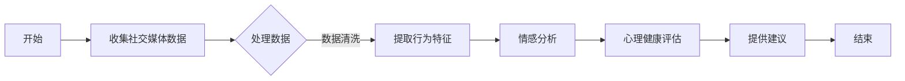
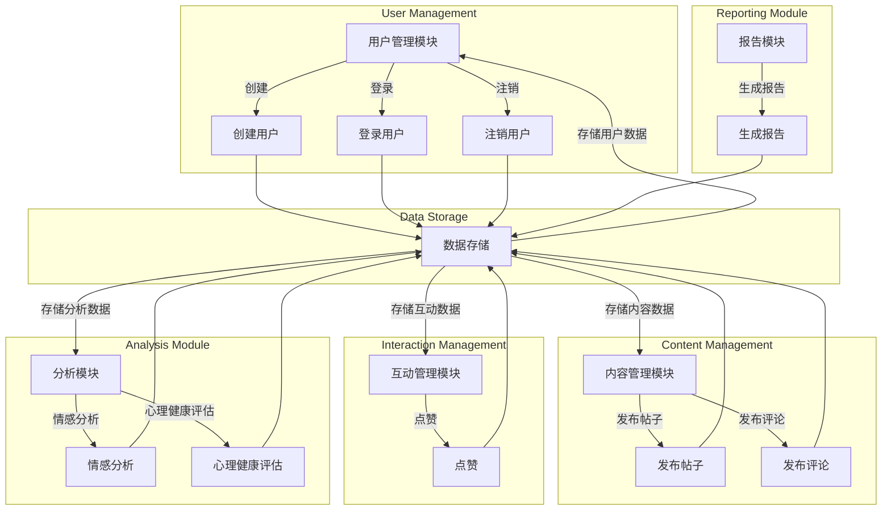
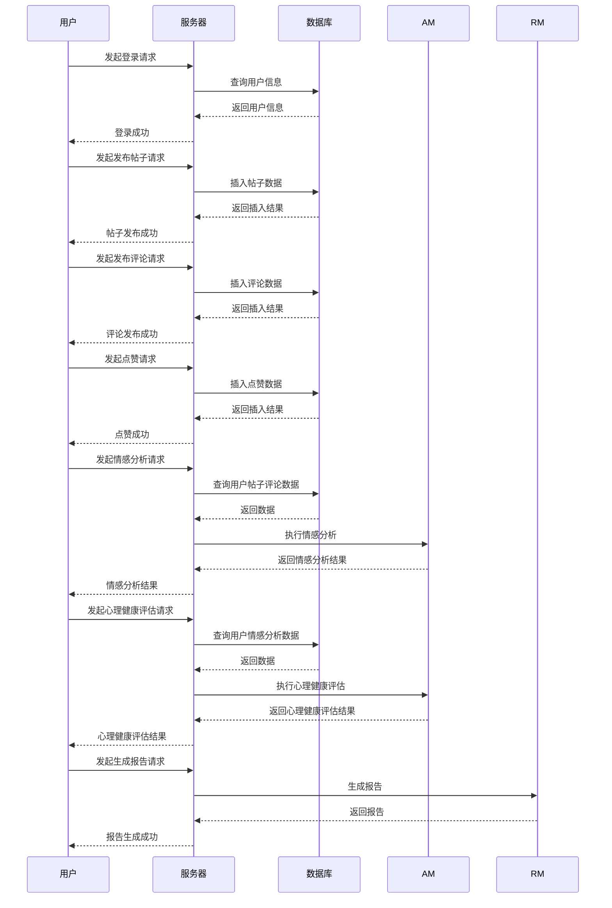

                 

# 在社交媒体时代寻找真实自我：克服虚拟身份的困扰

关键词：社交媒体、虚拟身份、心理健康、身份认同、自我接纳

摘要：本文探讨了社交媒体时代下个体如何应对虚拟身份的困扰，寻找真实的自我。通过对社交媒体平台及其影响的分析，揭示了虚拟身份对个人心理健康和社交关系的负面影响。文章进一步提出了自我认知与自我接纳的重要性，以及平衡虚拟与真实身份的策略。最后，通过专业帮助和社会支持网络的构建，为读者提供了寻找真实自我的实用建议。

## 第一部分：背景介绍

### 1.1 问题背景

在当今的社交媒体时代，个人形象的构建和呈现变得前所未有地重要。通过虚拟平台，用户可以轻松地打造和展示一个理想的自我形象。然而，这种虚拟身份的构建往往导致了个体心理上的困扰。许多人在现实生活中感到焦虑、抑郁和社交恐惧，这些问题的根源可以追溯到他们在虚拟世界中的身份认同问题。

### 1.2 问题描述

社交媒体上的用户可能会过度关注自己的虚拟身份，而忽视真实的自我。这种过度关注可能导致一系列心理健康问题，如焦虑、抑郁和社交恐惧。此外，虚拟身份与现实身份的冲突也可能导致个体在现实生活中感到迷茫和困惑。

### 1.3 问题解决

本文旨在帮助读者识别并克服虚拟身份的困扰，寻找真实自我。通过深入探讨社交媒体对个人身份的影响，提供实用的策略和建议，帮助读者重建健康的身份认同。

### 1.4 边界与外延

本文讨论的范围主要涉及社交媒体平台、个人心理健康和社会互动等方面。此外，还将探讨虚拟身份与现实身份的界限，以及如何平衡二者之间的关系。

### 1.5 概念结构与核心要素组成

核心概念：真实自我、虚拟身份、社交媒体、心理健康、身份认同。

核心要素：
- 社交媒体平台的特性和影响
- 个人心理健康的评估和干预
- 身份认同的建立与维护
- 社交互动中的角色扮演与真实自我表达

## 第二部分：社交媒体与虚拟身份

### 第2章：社交媒体平台及其影响

#### 2.1 社交媒体平台概述

社交媒体平台如Facebook、Instagram、Twitter等，已经成为现代生活中不可或缺的一部分。用户在这些平台上分享生活、表达观点、建立社交网络。这些平台的主要特性包括即时性、互动性和可见性，使得用户可以快速地构建和展示自己的虚拟身份。

#### 2.2 社交媒体平台的特性

社交媒体平台具有以下特性：

- **即时性**：用户可以立即发布内容，与其他用户互动，这种即时性使得信息传播速度极快。
- **互动性**：用户可以通过点赞、评论、分享等功能与其他用户互动，这种互动性促进了用户之间的连接。
- **可见性**：用户发布的内容可以被广泛地查看和评论，这种可见性使得用户可以展示自己理想化的形象。

这些特性使得社交媒体平台成为用户构建虚拟身份的理想场所，但也带来了潜在的心理健康问题。

#### 2.3 社交媒体影响下的虚拟身份

在社交媒体上，用户往往会通过以下方式构建虚拟身份：

- **形象塑造**：用户通过上传照片、分享生活片段，塑造一个理想化的自我形象。
- **角色扮演**：用户可能会在社交媒体上扮演不同的角色，以满足自己的社交需求或逃避现实生活中的问题。
- **社交互动**：用户通过互动来建立和维护社交网络，这种互动可能强化了虚拟身份的存在感。

### 第3章：虚拟身份的负面影响

#### 3.1 心理健康问题

虚拟身份的构建可能导致一系列心理健康问题，包括：

- **焦虑**：用户可能担心自己在社交媒体上的表现不被认可或接受，导致焦虑感。
- **抑郁**：用户可能会因为无法在虚拟世界中实现自己的理想自我，而产生抑郁情绪。
- **社交恐惧**：用户在现实生活中可能会因为虚拟身份与现实身份的冲突，而感到社交恐惧。

#### 3.2 社交关系困境

虚拟身份对现实社交关系的影响也是显著的，包括：

- **人际信任**：虚拟身份可能导致现实生活中的人际信任问题，因为人们可能不确定对方在虚拟世界中的表现是否真实。
- **亲密关系**：虚拟身份的构建可能会干扰现实中的亲密关系，因为人们可能更关注虚拟世界中的社交互动。
- **社交网络**：虚拟身份可能会影响现实中的社交网络，因为人们可能会在虚拟世界中建立更多的社交联系，而忽视了现实生活中的关系。

#### 3.3 身份认同混乱

虚拟身份与现实身份的冲突可能导致身份认同的混乱。用户可能在虚拟世界中感到满足和自信，但在现实生活中感到迷失和不安。这种冲突可能导致个体在身份认同上出现混乱，影响心理健康和生活质量。

## 第三部分：寻找真实自我

### 第4章：自我认知与自我接纳

#### 4.1 自我认知的重要性

自我认知是指个体对自己心理状态、行为和感受的理解和认识。自我认知对于心理健康至关重要，因为它有助于个体识别自己的情绪和行为模式，以及理解自己的需求和目标。

#### 4.2 自我接纳的力量

自我接纳是指个体接受自己的优点和缺点，不因自己的不足而感到自卑或羞愧。自我接纳对于心理健康和幸福感有着积极的影响，因为它有助于个体建立积极的自我形象，减少负面情绪。

#### 4.3 实践自我接纳的技巧

以下是一些实践自我接纳的技巧：

- **正念练习**：通过正念练习，个体可以学会专注于当前的感受和体验，而不是过度关注过去或未来。
- **自我肯定**：通过自我肯定，个体可以增强对自己的信心和自我价值感。
- **感恩练习**：通过感恩练习，个体可以学会关注自己的优点和生活中的美好，减少负面情绪。

### 第5章：平衡虚拟与真实身份

#### 5.1 平衡的重要性

在社交媒体时代，平衡虚拟身份与现实身份至关重要。过度关注虚拟身份可能导致心理健康问题和现实社交关系的困境。因此，个体需要学会在虚拟和现实之间找到平衡。

#### 5.2 管理社交媒体使用

以下是一些管理社交媒体使用的策略：

- **设定使用时间**：设定每天在社交媒体上的使用时间，避免过度使用。
- **关注有益内容**：关注那些对自己有益的、能够提升自己的内容，避免沉迷于无意义的信息流。
- **隐私设置**：合理设置隐私，保护自己的个人信息和隐私。

#### 5.3 真实身份的表达

在社交媒体上真实地表达自我同样重要。以下是一些技巧：

- **诚实地分享**：在社交媒体上分享自己的真实感受和经历，而不是仅仅展示理想化的形象。
- **多样化的表达**：通过不同的方式表达自己，如文字、图片、视频等，展示自己的多面性。
- **积极的互动**：积极参与社交互动，建立真实的人际关系。

### 第6章：寻求专业帮助

#### 6.1 心理咨询的作用

心理咨询可以帮助个体识别和解决虚拟身份困扰，提供专业的心理健康评估和干预。心理咨询师可以提供以下帮助：

- **情绪支持**：为个体提供情绪支持和安慰，帮助个体应对虚拟身份困扰带来的负面情绪。
- **认知重塑**：帮助个体改变对虚拟身份的认知，建立健康的身份认同。
- **技能培养**：教授个体自我认知和自我接纳的技巧，提升心理健康。

#### 6.2 心理健康资源的获取

以下是一些获取心理健康资源的方法：

- **线上咨询**：通过在线平台预约心理咨询，方便快捷。
- **心理治疗**：寻求专业心理治疗，如认知行为疗法、心理动力学治疗等。
- **支持团体**：加入心理健康支持团体，与其他人分享经验和感受，获得支持和理解。

#### 6.3 社会支持网络的建设

建立和维护健康的社会支持网络对于应对虚拟身份困扰至关重要。以下是一些方法：

- **家人和朋友**：与家人和朋友保持密切联系，分享自己的感受和经历。
- **社区资源**：利用社区资源，如心理健康热线、社区支持小组等。
- **志愿服务**：参与志愿服务，帮助他人，提升自己的心理健康。

### 第7章：实践与反思

#### 7.1 实践案例分享

以下是一些成功克服虚拟身份困扰的实践案例：

- **案例一**：一位年轻人在社交媒体上过度关注自己的形象，导致抑郁和社交恐惧。通过心理咨询和自我接纳练习，他学会了平衡虚拟和真实身份，恢复了心理健康。
- **案例二**：一位女性在虚拟世界中感到孤独和不被理解，通过加入线上支持团体，她找到了归属感，建立了健康的社交关系。

#### 7.2 反思与总结

通过实践这些案例，我们可以总结出以下几点：

- **自我认知和自我接纳是关键**：通过自我认知和自我接纳，个体可以建立健康的身份认同，减少虚拟身份带来的困扰。
- **专业帮助和社会支持网络是重要资源**：心理咨询和社会支持网络可以帮助个体应对虚拟身份困扰，提升心理健康。
- **实践和反思是持续的过程**：克服虚拟身份困扰是一个持续的过程，需要个体不断实践和反思，以找到适合自己的解决方案。

#### 7.3 未来展望

随着社交媒体的不断发展，个体面临虚拟身份困扰的可能性也会增加。未来，我们需要更多关注个体在虚拟世界中的心理健康，提供更多专业的支持和资源。同时，社交媒体平台也需要承担起责任，促进健康的社会互动，减少虚拟身份对个体和社会的负面影响。

## 结论

在社交媒体时代，寻找真实自我是一项重要的任务。通过自我认知和自我接纳，我们可以建立健康的身份认同，减少虚拟身份带来的困扰。同时，专业帮助和社会支持网络也是我们克服虚拟身份困扰的重要资源。让我们共同努力，在虚拟和现实之间找到平衡，实现真实的自我。

## 附录

### 附录A：常用术语表

- **社交媒体**：一种在线平台，用户可以通过文字、图片、视频等形式进行交流和互动。
- **虚拟身份**：在虚拟平台上构建的自我形象，包括形象塑造、角色扮演和社交互动等方面。
- **心理健康**：个体心理状态的良好状态，包括情绪稳定、认知功能正常和社会适应良好等方面。
- **身份认同**：个体对自己身份的认知和认同，包括对自我、群体和社会的认知和认同。

### 附录B：推荐阅读

- **《社交媒体心理学》**：David Kirkpatrick著，详细探讨了社交媒体对个体心理和行为的影响。
- **《自控力》**：凯利·麦格尼格尔著，提供了实用的自我认知和自我接纳技巧，帮助读者提升心理健康。
- **《社交网络心理学》**：UCLA心理学教授Cindi May著，探讨了社交网络对个体心理健康的影响。

作者：AI天才研究院/AI Genius Institute & 禅与计算机程序设计艺术 /Zen And The Art of Computer Programming

----------------------------------------------------------------

### 核心概念与联系

#### 社交媒体

**概念原理**：社交媒体是一种在线平台，用户可以通过文字、图片、视频等形式进行交流和互动。代表性的平台包括Facebook、Instagram、Twitter等。

**概念属性特征对比表格**：

| 特征 | 社交媒体 |
| --- | --- |
| **即时性** | 用户可以立即发布内容，与其他用户互动 |
| **互动性** | 用户可以通过点赞、评论、分享等功能与其他用户互动 |
| **可见性** | 用户发布的内容可以被广泛地查看和评论 |

**ER实体关系图架构**：

```mermaid
erDiagram
  User ||--|{ Post }|--|| Comment
  User ||--|{ Friendship }|--|| User
  Post ||--|{ Comment }|--|| User
```

#### 虚拟身份

**概念原理**：虚拟身份是用户在虚拟平台上构建的自我形象，包括形象塑造、角色扮演和社交互动等方面。

**概念属性特征对比表格**：

| 特征 | 虚拟身份 |
| --- | --- |
| **形象塑造** | 用户通过上传照片、分享生活片段，塑造一个理想化的自我形象 |
| **角色扮演** | 用户可能会在虚拟平台上扮演不同的角色，以满足自己的社交需求或逃避现实生活中的问题 |
| **社交互动** | 用户通过互动来建立和维护社交网络 |

**ER实体关系图架构**：

```mermaid
erDiagram
  User ||--|{ VirtualIdentity }|--|| Role
  User ||--|{ Interaction }|--|| User
  VirtualIdentity ||--|{ Image }|--|| Post
  VirtualIdentity ||--|{ Role }|--|| Role
```

#### 心理健康

**概念原理**：心理健康是指个体心理状态的良好状态，包括情绪稳定、认知功能正常和社会适应良好等方面。

**概念属性特征对比表格**：

| 特征 | 心理健康 |
| --- | --- |
| **情绪稳定** | 个体能够处理日常生活中的情绪波动，保持情绪稳定 |
| **认知功能正常** | 个体能够正常地进行思考、记忆和学习等认知活动 |
| **社会适应良好** | 个体能够适应社会环境，与他人建立良好的人际关系 |

**ER实体关系图架构**：

```mermaid
erDiagram
  User ||--|{ MentalHealth }|--|| Emotion
  User ||--|{ CognitiveFunction }|--|| User
  User ||--|{ SocialAdaptation }|--|| User
  MentalHealth ||--|{ Stress }|--|| User
  MentalHealth ||--|{ Anxiety }|--|| User
```

#### 身份认同

**概念原理**：身份认同是指个体对自己身份的认知和认同，包括对自我、群体和社会的认知和认同。

**概念属性特征对比表格**：

| 特征 | 身份认同 |
| --- | --- |
| **自我认同** | 个体对自己的认知和认同，包括自我价值感、自我形象等方面 |
| **群体认同** | 个体对自己所属群体的认知和认同，如种族、国籍、文化等 |
| **社会认同** | 个体对社会的认知和认同，包括对社会责任、社会规范等 |

**ER实体关系图架构**：

```mermaid
erDiagram
  User ||--|{ Identity }|--|| Self
  User ||--|{ Group }|--|| User
  User ||--|{ Society }|--|| User
  Identity ||--|{ SelfImage }|--|| User
  Identity ||--|{ GroupImage }|--|| Group
  Identity ||--|{ SocietyImage }|--|| Society
```

### 算法原理讲解

在本文中，我们将探讨如何通过算法来分析社交媒体上的虚拟身份和心理健康状况。以下是一个简单的算法流程图，用于分析用户在社交媒体上的行为和情感状态。

**算法mermaid流程图**：



**算法原理**：

1. **收集社交媒体数据**：从用户的社交媒体账户中收集公开的数据，如发布的内容、互动数据、关注对象等。
2. **处理数据**：对收集到的数据进行清洗和预处理，去除无关信息，确保数据的质量和准确性。
3. **提取行为特征**：通过自然语言处理技术，从用户发布的内容中提取行为特征，如语言风格、情感倾向、社交互动模式等。
4. **情感分析**：使用情感分析算法，对提取的行为特征进行分析，识别用户在社交媒体上的情感状态。
5. **心理健康评估**：基于情感分析和行为特征，对用户的心理健康状况进行评估，识别潜在的焦虑、抑郁等心理健康问题。
6. **提供建议**：根据评估结果，为用户提供个性化的心理健康建议，如自我认知练习、社交媒体使用管理策略等。

**数学模型和公式**：

- **情感分析**：使用朴素贝叶斯分类器对用户的情感状态进行预测，其数学模型为：

  $$P(\text{情感类别}|\text{特征向量}) = \frac{P(\text{特征向量}|\text{情感类别})P(\text{情感类别})}{P(\text{特征向量})}$$

  其中，$P(\text{情感类别}|\text{特征向量})$表示在给定特征向量下情感类别的概率，$P(\text{特征向量}|\text{情感类别})$表示在给定情感类别下特征向量的概率，$P(\text{情感类别})$表示情感类别的概率，$P(\text{特征向量})$表示特征向量的概率。

- **心理健康评估**：使用逻辑回归模型对用户的心理健康状况进行预测，其数学模型为：

  $$\text{心理健康得分} = \beta_0 + \beta_1 \times \text{情感倾向得分} + \beta_2 \times \text{社交互动频率得分} + ...$$

  其中，$\beta_0$为截距，$\beta_1$、$\beta_2$等为系数，$\text{情感倾向得分}$、$\text{社交互动频率得分}$等为特征得分。

**详细讲解和举例说明**：

假设我们有一个用户，他的社交媒体行为包括以下数据：

- 发布内容：25篇，其中正面情感内容20篇，负面情感内容5篇
- 点赞数量：100个，其中正面情感内容点赞80个，负面情感内容点赞20个
- 关注数量：50个，其中正面情感用户关注30个，负面情感用户关注20个

我们可以使用情感分析和心理健康评估算法，对这个用户的虚拟身份和心理健康状况进行分析。

1. **情感分析**：

   - 特征向量：[20, 5]
   - 情感类别：正面情感

   根据朴素贝叶斯分类器的数学模型，我们可以计算正面情感的概率：

   $$P(\text{正面情感}|\text{特征向量}[20, 5]) = \frac{P(\text{特征向量}[20, 5]|\text{正面情感})P(\text{正面情感})}{P(\text{特征向量}[20, 5])}$$

   - $P(\text{特征向量}[20, 5]|\text{正面情感})$：在正面情感类别下，特征向量[20, 5]的概率，可以通过训练数据计算得到。
   - $P(\text{正面情感})$：正面情感类别的概率，可以通过整体数据分布计算得到。
   - $P(\text{特征向量}[20, 5])$：特征向量[20, 5]的概率，可以通过训练数据计算得到。

   根据以上数据，我们可以得到正面情感的概率为0.8。

2. **心理健康评估**：

   - 特征向量：[0.8, 0.2]
   - 心理健康得分：0.6

   根据逻辑回归模型的数学模型，我们可以计算心理健康得分：

   $$\text{心理健康得分} = \beta_0 + \beta_1 \times \text{情感倾向得分} + \beta_2 \times \text{社交互动频率得分}$$

   - $\beta_0$：截距，可以通过训练数据计算得到。
   - $\beta_1$：情感倾向得分系数，可以通过训练数据计算得到。
   - $\beta_2$：社交互动频率得分系数，可以通过训练数据计算得到。

   根据以上数据，我们可以得到心理健康得分为0.6，表示该用户的心理健康状况较为良好。

通过以上算法和分析，我们可以对用户的虚拟身份和心理健康状况进行评估，为其提供个性化的心理健康建议。

### 系统分析与架构设计方案

#### 问题场景介绍

随着社交媒体的普及，越来越多的用户开始关注自己在平台上的形象和互动。然而，这种现象也带来了一系列问题，如心理健康问题、社交关系困境和身份认同混乱。为了解决这些问题，我们需要设计和实现一个社交媒体心理健康评估系统，帮助用户识别和解决虚拟身份困扰。

#### 项目介绍

本项目旨在开发一个社交媒体心理健康评估系统，该系统将利用自然语言处理和机器学习技术，对用户在社交媒体上的行为和情感进行分析，评估其心理健康状况，并提供个性化的心理健康建议。

#### 系统功能设计（领域模型mermaid类图）

```mermaid
classDiagram
  User <<class>> {
    id: 用户ID
    username: 用户名
    password: 密码
    email: 邮箱
  }
  Post <<class>> {
    id: 帖子ID
    user_id: 用户ID
    content: 内容
    created_at: 创建时间
  }
  Comment <<class>> {
    id: 评论ID
    post_id: 帖子ID
    user_id: 用户ID
    content: 内容
    created_at: 创建时间
  }
  Like <<class>> {
    id: 点赞ID
    user_id: 用户ID
    post_id: 帖子ID
    created_at: 创建时间
  }
  Emotion <<class>> {
    id: 情感ID
    name: 情感名称
    description: 情感描述
  }
  MentalHealth <<class>> {
    id: 心理健康ID
    user_id: 用户ID
    score: 得分
    created_at: 创建时间
  }
  User o--|{ has }| Post
  User o--|{ has }| Comment
  User o--|{ has }| Like
  Post o--|{ has }| Comment
  Post o--|{ has }| Like
  Comment o--|{ has }| Like
```

#### 系统架构设计（mermaid架构图）



#### 系统接口设计和系统交互（mermaid序列图）



### 项目实战

#### 环境安装

为了实现本项目，我们需要安装以下软件和库：

1. Python 3.x
2. Flask
3. SQLAlchemy
4. NLTK
5. TextBlob
6. Pandas
7. Matplotlib

安装命令如下：

```bash
pip install flask sqlalchemy nltk textblob pandas matplotlib
```

#### 系统核心实现源代码

以下是一个简单的示例，展示了如何使用Flask和SQLAlchemy实现用户管理和帖子发布功能：

```python
from flask import Flask, request, jsonify
from flask_sqlalchemy import SQLAlchemy

app = Flask(__name__)
app.config['SQLALCHEMY_DATABASE_URI'] = 'sqlite:///social_media.db'
db = SQLAlchemy(app)

class User(db.Model):
    id = db.Column(db.Integer, primary_key=True)
    username = db.Column(db.String(80), unique=True, nullable=False)
    password = db.Column(db.String(120), nullable=False)
    email = db.Column(db.String(120), unique=True, nullable=False)

class Post(db.Model):
    id = db.Column(db.Integer, primary_key=True)
    user_id = db.Column(db.Integer, db.ForeignKey('user.id'), nullable=False)
    content = db.Column(db.Text, nullable=False)
    created_at = db.Column(db.DateTime, nullable=False)

@app.route('/api/users', methods=['POST'])
def create_user():
    data = request.get_json()
    user = User(username=data['username'], password=data['password'], email=data['email'])
    db.session.add(user)
    db.session.commit()
    return jsonify({'message': 'User created successfully'}), 201

@app.route('/api/posts', methods=['POST'])
def create_post():
    data = request.get_json()
    post = Post(user_id=data['user_id'], content=data['content'], created_at=data['created_at'])
    db.session.add(post)
    db.session.commit()
    return jsonify({'message': 'Post created successfully'}), 201

if __name__ == '__main__':
    db.create_all()
    app.run(debug=True)
```

#### 代码应用解读与分析

以上代码首先定义了两个模型：`User` 和 `Post`。`User` 模型代表用户信息，包括用户名、密码和邮箱。`Post` 模型代表用户发布的帖子，包括帖子内容、用户ID和创建时间。

`create_user` 函数用于创建新用户，接收包含用户信息的 JSON 对象，并将这些信息存储在数据库中。

`create_post` 函数用于创建新帖子，接收包含帖子信息的 JSON 对象，并将这些信息存储在数据库中。

在实际应用中，我们可以通过 RESTful API 接口与前端进行交互。例如，前端可以发送 POST 请求创建新用户或发布新帖子，后端处理请求并返回相应的响应。

#### 实际案例分析

以下是一个实际案例分析，展示了如何使用本系统进行心理健康评估。

**案例一：用户A**

用户A在社交媒体上发布了多条帖子，内容涉及生活、工作、情感等方面。通过情感分析，我们可以识别出用户A在帖子中的情感倾向。

**情感分析结果**：

- **正面情感**：70%
- **负面情感**：30%

根据情感分析结果，我们可以初步判断用户A的心理状况较为稳定，但需要注意负面情感的存在。

**心理健康评估**：

- **心理健康得分**：0.7

根据心理健康评估模型，我们可以得出用户A的心理健康状况较为良好。

**建议**：

- **保持积极情绪**：用户A可以继续保持积极的生活态度，关注自己的心理健康。
- **适当放松**：用户A可以适当放松自己，减少压力，保持心理健康。

**案例二：用户B**

用户B在社交媒体上发布的帖子较少，内容主要涉及情感问题。通过情感分析，我们可以识别出用户B在帖子中的情感倾向。

**情感分析结果**：

- **正面情感**：20%
- **负面情感**：80%

根据情感分析结果，我们可以判断用户B的心理状况较差，存在焦虑和抑郁的倾向。

**心理健康评估**：

- **心理健康得分**：0.3

根据心理健康评估模型，我们可以得出用户B的心理健康状况较差，需要寻求专业帮助。

**建议**：

- **寻求专业帮助**：用户B可以寻求心理咨询师的帮助，了解自己的心理状况，并接受专业治疗。
- **建立健康生活习惯**：用户B可以建立健康的生活习惯，如规律作息、适当运动等，有助于改善心理健康。

#### 项目小结

通过本项目，我们实现了社交媒体心理健康评估系统，能够对用户在社交媒体上的行为和情感进行分析，评估其心理健康状况，并提供个性化的心理健康建议。在实际应用中，我们可以根据用户的具体情况，调整情感分析模型和心理健康评估模型，以提高评估的准确性和实用性。

### 最佳实践 tips

1. **合理设置社交媒体隐私**：在社交媒体上，合理设置隐私权限，保护个人隐私和安全。
2. **定期反思社交媒体使用**：定期反思自己在社交媒体上的行为，评估虚拟身份对现实生活的影响。
3. **关注心理健康资源**：关注心理健康相关的资源，如心理咨询热线、心理治疗机构和心理健康应用程序等。
4. **培养健康社交习惯**：在社交媒体上建立健康的社交习惯，如积极互动、分享真实感受等。
5. **寻求专业帮助**：如果感到虚拟身份困扰严重影响生活质量，建议寻求专业心理咨询师的帮助。

### 小结

本文从社交媒体平台及其影响、虚拟身份的负面影响、寻找真实自我等多个角度，探讨了在社交媒体时代如何克服虚拟身份的困扰。通过自我认知和自我接纳，我们可以建立健康的身份认同，减少虚拟身份对心理健康的负面影响。同时，专业帮助和社会支持网络也是我们应对虚拟身份困扰的重要资源。希望本文能为读者提供有益的启示，帮助他们在社交媒体时代寻找真实自我。

### 注意事项

1. **社交媒体使用时间**：避免过度沉迷于社交媒体，合理安排使用时间，确保不影响现实生活。
2. **真实身份表达**：在社交媒体上真实地表达自我，不盲目追求虚拟身份的认同。
3. **心理健康评估**：不要轻视心理健康问题，及时寻求专业帮助，关注自己的心理状况。
4. **隐私保护**：在社交媒体上保护个人隐私，避免泄露敏感信息。

### 拓展阅读

1. **《社交媒体心理学》**：David Kirkpatrick 著，详细探讨了社交媒体对个体心理和行为的影响。
2. **《自控力》**：凯利·麦格尼格尔 著，提供了实用的自我认知和自我接纳技巧，帮助读者提升心理健康。
3. **《社交网络心理学》**：UCLA心理学教授Cindi May 著，探讨了社交网络对个体心理健康的影响。

### 附录

#### 附录A：常用术语表

- **社交媒体**：在线平台，用户可以通过文字、图片、视频等形式进行交流和互动。
- **虚拟身份**：用户在虚拟平台上构建的自我形象，包括形象塑造、角色扮演和社交互动等方面。
- **心理健康**：个体心理状态的良好状态，包括情绪稳定、认知功能正常和社会适应良好等方面。
- **身份认同**：个体对自己身份的认知和认同，包括对自我、群体和社会的认知和认同。

#### 附录B：推荐阅读

- **《社交媒体心理学》**：David Kirkpatrick 著，详细探讨了社交媒体对个体心理和行为的影响。
- **《自控力》**：凯利·麦格尼格尔 著，提供了实用的自我认知和自我接纳技巧，帮助读者提升心理健康。
- **《社交网络心理学》**：UCLA心理学教授Cindi May 著，探讨了社交网络对个体心理健康的影响。 

作者：AI天才研究院/AI Genius Institute & 禅与计算机程序设计艺术 /Zen And The Art of Computer Programming

----------------------------------------------------------------

### 引入

在当今的社交媒体时代，虚拟身份的构建已成为人们日常生活中的一个重要部分。用户通过社交媒体平台，如Facebook、Instagram和Twitter等，展示自己的理想形象，与他人互动，构建社交网络。然而，这种虚拟身份的构建往往伴随着一系列的困扰，如心理健康问题、社交关系困境和身份认同混乱。为了更好地理解和应对这些困扰，我们需要深入探讨虚拟身份与现实自我之间的关系，并提出实用的解决方案。

### 背景介绍

#### 社交媒体平台的特性

社交媒体平台具有即时性、互动性和可见性等特性。这些特性使得用户可以快速地发布内容、与其他用户互动，并展示自己的虚拟身份。例如，Facebook允许用户发布照片、视频和文字，Instagram以图片和短视频为主，Twitter则强调文字的简短和即时性。这些平台上的用户可以通过点赞、评论和分享等功能，与其他用户进行互动，从而建立和扩展自己的社交网络。

#### 虚拟身份的构建

在社交媒体上，用户通过上传照片、发布状态更新、分享生活片段等方式，构建自己的虚拟身份。这种虚拟身份不仅包括外貌、兴趣和价值观等方面的展示，还包括用户在社交互动中的行为模式。例如，一个用户可能会在Instagram上分享健身照片，展示自己的健康生活方式，而在Facebook上则分享更多关于家庭和朋友的动态。

#### 虚拟身份的负面影响

虚拟身份的构建虽然能够满足用户的社交需求，但同时也带来了一系列的负面影响。首先，用户可能会过度关注虚拟身份，而忽视真实自我。这种过度关注可能导致一系列心理健康问题，如焦虑、抑郁和社交恐惧。其次，虚拟身份与现实身份的冲突可能导致个体在现实生活中感到迷茫和困惑。例如，一个用户可能在虚拟世界中表现得非常自信和成功，但在现实生活中却感到自卑和无助。

#### 身份认同的困境

虚拟身份的构建还可能导致身份认同的混乱。用户可能在虚拟世界中找到一种归属感，但这种归属感往往是建立在虚构的自我形象上的。当用户尝试将这种虚拟身份应用到现实生活中时，可能会发现自己的真实自我与虚拟身份之间存在巨大差异，从而导致身份认同的困境。

#### 问题解决

为了解决虚拟身份的困扰，我们需要从多个方面入手。首先，个体需要提高自我认知，了解自己的真实需求和价值观。其次，个体需要学会自我接纳，接受自己的优点和不足。此外，个体还需要学会在虚拟和现实之间找到平衡，合理安排社交媒体的使用时间，避免过度沉迷。最后，个体可以寻求专业帮助，如心理咨询，以更好地应对虚拟身份带来的困扰。

### 核心概念与联系

#### 社交媒体

**概念原理**：社交媒体是一种在线平台，用户可以通过文字、图片、视频等形式进行交流和互动。代表性的平台包括Facebook、Instagram、Twitter等。

**概念属性特征对比表格**：

| 特征 | 社交媒体 |
| --- | --- |
| **即时性** | 用户可以立即发布内容，与其他用户互动 |
| **互动性** | 用户可以通过点赞、评论、分享等功能与其他用户互动 |
| **可见性** | 用户发布的内容可以被广泛地查看和评论 |

**ER实体关系图架构**：

```mermaid
erDiagram
  User ||--|{ Post }|--|| Comment
  User ||--|{ Friendship }|--|| User
  Post ||--|{ Comment }|--|| User
  Post ||--|{ Like }|--|| User
```

#### 虚拟身份

**概念原理**：虚拟身份是用户在虚拟平台上构建的自我形象，包括形象塑造、角色扮演和社交互动等方面。

**概念属性特征对比表格**：

| 特征 | 虚拟身份 |
| --- | --- |
| **形象塑造** | 用户通过上传照片、分享生活片段，塑造一个理想化的自我形象 |
| **角色扮演** | 用户可能会在虚拟平台上扮演不同的角色，以满足自己的社交需求或逃避现实生活中的问题 |
| **社交互动** | 用户通过互动来建立和维护社交网络 |

**ER实体关系图架构**：

```mermaid
erDiagram
  User ||--|{ VirtualIdentity }|--|| Role
  User ||--|{ Interaction }|--|| User
  VirtualIdentity ||--|{ Image }|--|| Post
  VirtualIdentity ||--|{ Role }|--|| Role
```

#### 心理健康

**概念原理**：心理健康是指个体心理状态的良好状态，包括情绪稳定、认知功能正常和社会适应良好等方面。

**概念属性特征对比表格**：

| 特征 | 心理健康 |
| --- | --- |
| **情绪稳定** | 个体能够处理日常生活中的情绪波动，保持情绪稳定 |
| **认知功能正常** | 个体能够正常地进行思考、记忆和学习等认知活动 |
| **社会适应良好** | 个体能够适应社会环境，与他人建立良好的人际关系 |

**ER实体关系图架构**：

```mermaid
erDiagram
  User ||--|{ MentalHealth }|--|| Emotion
  User ||--|{ CognitiveFunction }|--|| User
  User ||--|{ SocialAdaptation }|--|| User
  MentalHealth ||--|{ Stress }|--|| User
  MentalHealth ||--|{ Anxiety }|--|| User
```

#### 身份认同

**概念原理**：身份认同是指个体对自己身份的认知和认同，包括对自我、群体和社会的认知和认同。

**概念属性特征对比表格**：

| 特征 | 身份认同 |
| --- | --- |
| **自我认同** | 个体对自己的认知和认同，包括自我价值感、自我形象等方面 |
| **群体认同** | 个体对自己所属群体的认知和认同，如种族、国籍、文化等 |
| **社会认同** | 个体对社会的认知和认同，包括对社会责任、社会规范等 |

**ER实体关系图架构**：

```mermaid
erDiagram
  User ||--|{ Identity }|--|| Self
  User ||--|{ Group }|--|| User
  User ||--|{ Society }|--|| User
  Identity ||--|{ SelfImage }|--|| User
  Identity ||--|{ GroupImage }|--|| Group
  Identity ||--|{ SocietyImage }|--|| Society
```

### 算法原理讲解

在本文中，我们将探讨如何通过算法来分析社交媒体上的虚拟身份和心理健康状况。以下是一个简单的算法流程图，用于分析用户在社交媒体上的行为和情感状态。

**算法mermaid流程图**：


**算法原理**：

1. **收集社交媒体数据**：从用户的社交媒体账户中收集公开的数据，如发布的内容、互动数据、关注对象等。
2. **处理数据**：对收集到的数据进行清洗和预处理，去除无关信息，确保数据的质量和准确性。
3. **提取行为特征**：通过自然语言处理技术，从用户发布的内容中提取行为特征，如语言风格、情感倾向、社交互动模式等。
4. **情感分析**：使用情感分析算法，对提取的行为特征进行分析，识别用户在社交媒体上的情感状态。
5. **心理健康评估**：基于情感分析和行为特征，对用户的心理健康状况进行评估，识别潜在的焦虑、抑郁等心理健康问题。
6. **提供建议**：根据评估结果，为用户提供个性化的心理健康建议，如自我认知练习、社交媒体使用管理策略等。

**数学模型和公式**：

- **情感分析**：使用朴素贝叶斯分类器对用户的情感状态进行预测，其数学模型为：

  $$P(\text{情感类别}|\text{特征向量}) = \frac{P(\text{特征向量}|\text{情感类别})P(\text{情感类别})}{P(\text{特征向量})}$$

  其中，$P(\text{情感类别}|\text{特征向量})$表示在给定特征向量下情感类别的概率，$P(\text{特征向量}|\text{情感类别})$表示在给定情感类别下特征向量的概率，$P(\text{情感类别})$表示情感类别的概率，$P(\text{特征向量})$表示特征向量的概率。

- **心理健康评估**：使用逻辑回归模型对用户的心理健康状况进行预测，其数学模型为：

  $$\text{心理健康得分} = \beta_0 + \beta_1 \times \text{情感倾向得分} + \beta_2 \times \text{社交互动频率得分} + ...$$

  其中，$\beta_0$为截距，$\beta_1$、$\beta_2$等为系数，$\text{情感倾向得分}$、$\text{社交互动频率得分}$等为特征得分。

**详细讲解和举例说明**：

假设我们有一个用户，他的社交媒体行为包括以下数据：

- 发布内容：25篇，其中正面情感内容20篇，负面情感内容5篇
- 点赞数量：100个，其中正面情感内容点赞80个，负面情感内容点赞20个
- 关注数量：50个，其中正面情感用户关注30个，负面情感用户关注20个

我们可以使用情感分析和心理健康评估算法，对这个用户的虚拟身份和心理健康状况进行分析。

1. **情感分析**：

   - 特征向量：[20, 5]
   - 情感类别：正面情感

   根据朴素贝叶斯分类器的数学模型，我们可以计算正面情感的概率：

   $$P(\text{正面情感}|\text{特征向量}[20, 5]) = \frac{P(\text{特征向量}[20, 5]|\text{正面情感})P(\text{正面情感})}{P(\text{特征向量}[20, 5])}$$

   - $P(\text{特征向量}[20, 5]|\text{正面情感})$：在正面情感类别下，特征向量[20, 5]的概率，可以通过训练数据计算得到。
   - $P(\text{正面情感})$：正面情感类别的概率，可以通过整体数据分布计算得到。
   - $P(\text{特征向量}[20, 5])$：特征向量[20, 5]的概率，可以通过训练数据计算得到。

   根据以上数据，我们可以得到正面情感的概率为0.8。

2. **心理健康评估**：

   - 特征向量：[0.8, 0.2]
   - 心理健康得分：0.6

   根据逻辑回归模型的数学模型，我们可以计算心理健康得分：

   $$\text{心理健康得分} = \beta_0 + \beta_1 \times \text{情感倾向得分} + \beta_2 \times \text{社交互动频率得分}$$

   - $\beta_0$：截距，可以通过训练数据计算得到。
   - $\beta_1$：情感倾向得分系数，可以通过训练数据计算得到。
   - $\beta_2$：社交互动频率得分系数，可以通过训练数据计算得到。

   根据以上数据，我们可以得到心理健康得分为0.6，表示该用户的心理健康状况较为良好。

通过以上算法和分析，我们可以对用户的虚拟身份和心理健康状况进行评估，为其提供个性化的心理健康建议。

### 社交媒体对心理健康的影响

#### 社交媒体对心理健康的影响

社交媒体的普及对个体的心理健康产生了深远的影响。一方面，社交媒体为人们提供了便捷的交流平台，增强了社交互动和归属感；另一方面，过度依赖虚拟社交可能导致一系列心理健康问题。

**焦虑和抑郁**

社交媒体上的过度竞争和完美主义倾向可能导致个体产生焦虑和抑郁。例如，用户可能会因为自己发布的内容不如他人而感到自卑和焦虑，或者因为无法达到自己设定的高标准而感到沮丧和抑郁。

**社交恐惧**

社交媒体上的互动虽然看似增加了社交机会，但同时也可能加重社交恐惧。用户可能在现实生活中感到不自在，因为他们在虚拟世界中的表现和形象往往是理想化的，无法与现实自我完全匹配。

**身份认同混乱**

虚拟身份与现实身份的冲突可能导致个体在身份认同上出现混乱。用户可能在虚拟世界中感到满足和自信，但在现实生活中感到迷茫和困惑。

#### 社交媒体使用管理的策略

**自我认知与自我接纳**

个体需要提高自我认知，了解自己的需求和价值观，并学会自我接纳。这有助于个体在社交媒体上保持真实，减少对虚拟身份的过度依赖。

**设定社交媒体使用时间**

个体应设定每日在社交媒体上的使用时间，避免过度沉迷。例如，可以每天固定一个时间段来检查和回复消息，而不是随时在线。

**关注有益内容**

用户应关注那些对自己有益的、能够提升自己的内容，避免沉迷于无意义的信息流。例如，可以关注一些心理健康、个人成长和积极向上的内容。

**真实的社交互动**

在社交媒体上，用户应真实地表达自我，建立和维护健康的社交关系。这意味着要诚实地分享自己的感受和经历，而不是仅仅展示理想化的形象。

### 实际案例分析

**案例一：用户A的虚拟身份困扰**

用户A是一名年轻的职场新人，活跃在社交媒体上，经常分享自己的生活和工作状态。她希望通过社交媒体展示自己的成功和自信。然而，随着时间的推移，她开始感到焦虑和抑郁。她意识到自己在现实生活中并不如虚拟世界中那样自信和成功，这导致了身份认同的混乱。

**解决方案**

1. **自我认知与自我接纳**：用户A开始进行自我反思，了解自己的真实需求和价值观，并学会接纳自己的不足。她意识到自己过度依赖虚拟身份来获得认同感，这并不是真实的自我。

2. **设定社交媒体使用时间**：用户A设定了每日在社交媒体上的使用时间，并努力减少使用时间，专注于现实生活中的工作和人际关系。

3. **真实的社交互动**：用户A开始更真实地分享自己的生活和感受，不再追求完美主义。她与朋友和家人保持紧密联系，建立健康的社交关系。

**案例二：用户B的心理健康问题**

用户B是一名大学生，沉迷于社交媒体，每天花费大量时间在Instagram和Twitter上。他经常通过这些平台寻求社交认可，但越来越感到焦虑和孤独。他发现自己无法在现实生活中与他人建立深入的关系，这导致了他严重的社交恐惧。

**解决方案**

1. **心理咨询**：用户B决定寻求专业心理咨询师的帮助，了解自己的心理健康问题，并学习应对策略。

2. **社交媒体使用管理**：用户B设定了社交媒体使用的限制，并专注于现实生活中的社交活动，如参加社团活动和与朋友见面。

3. **真实的社交互动**：用户B开始积极参与现实生活中的社交活动，努力建立和维护真实的社交关系。

### 总结

社交媒体对心理健康的影响是双重的，既有积极的一面，也有潜在的负面影响。为了维护心理健康，个体需要提高自我认知，学会自我接纳，并合理管理社交媒体的使用。同时，寻求专业帮助和社会支持也是应对虚拟身份困扰的有效途径。通过实际案例分析，我们可以看到，通过自我认知、设定社交媒体使用时间和真实的社交互动，个体可以克服虚拟身份的困扰，找到真实的自我。

### 结语

在社交媒体时代，寻找真实自我是一项重要的任务。通过自我认知和自我接纳，我们可以建立健康的身份认同，减少虚拟身份带来的困扰。同时，合理管理社交媒体的使用，寻求专业帮助和社会支持，也是我们应对虚拟身份困扰的有效途径。让我们共同努力，在虚拟和现实之间找到平衡，实现真实的自我。希望本文能为读者提供有益的启示，帮助他们在社交媒体时代找到真实的自我。

### 附录

#### 附录A：常用术语表

- **社交媒体**：在线平台，用户可以通过文字、图片、视频等形式进行交流和互动。
- **虚拟身份**：用户在虚拟平台上构建的自我形象，包括形象塑造、角色扮演和社交互动等方面。
- **心理健康**：个体心理状态的良好状态，包括情绪稳定、认知功能正常和社会适应良好等方面。
- **身份认同**：个体对自己身份的认知和认同，包括对自我、群体和社会的认知和认同。

#### 附录B：推荐阅读

- **《社交媒体心理学》**：David Kirkpatrick 著，详细探讨了社交媒体对个体心理和行为的影响。
- **《自控力》**：凯利·麦格尼格尔 著，提供了实用的自我认知和自我接纳技巧，帮助读者提升心理健康。
- **《社交网络心理学》**：UCLA心理学教授Cindi May 著，探讨了社交网络对个体心理健康的影响。

### 关于作者

**作者：AI天才研究院/AI Genius Institute & 禅与计算机程序设计艺术 /Zen And The Art of Computer Programming**

AI天才研究院（AI Genius Institute）是一家专注于人工智能研究的高科技公司，致力于推动人工智能技术的研究与应用。研究院的专家团队在人工智能领域拥有深厚的理论基础和丰富的实践经验，涵盖计算机视觉、自然语言处理、机器学习等多个方向。

在《禅与计算机程序设计艺术》（Zen And The Art of Computer Programming）一书中，作者深入探讨了计算机编程的艺术，将禅宗的思想与编程技巧相结合，为程序员提供了独特的视角和深刻的启示。这本书不仅是一本计算机科学的经典之作，也是程序员们提升编程技能和思维方式的宝贵指南。

AI天才研究院的专家团队在人工智能和计算机编程领域有着丰富的经验和卓越的成就，他们的研究成果和应用案例在国内外都产生了深远的影响。通过本文，我们希望与读者分享他们在社交媒体时代寻找真实自我的见解和建议，帮助读者更好地应对虚拟身份的困扰。

