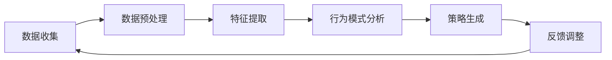
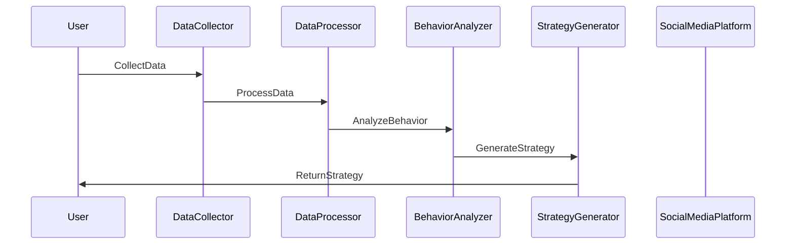
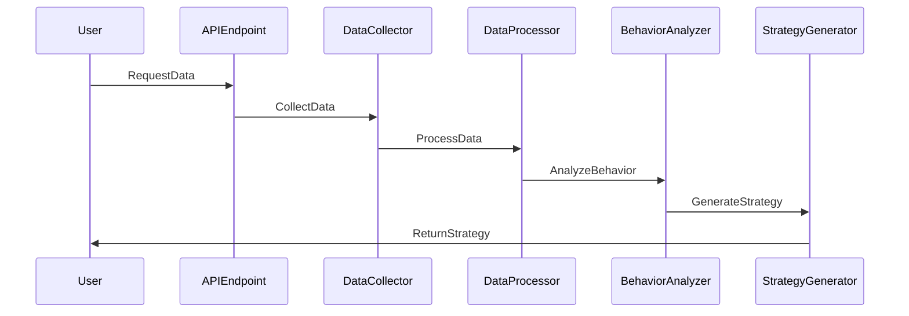

                 

### 1. 背景介绍

#### 1.1 社交媒体时代

在21世纪，社交媒体已成为我们日常生活中不可或缺的一部分。从Facebook、Instagram到Twitter、LinkedIn，各种社交平台迅速崛起，为全球数十亿用户提供了一个即时沟通、分享和互动的场所。这些平台不仅改变了人们获取信息和交流的方式，还深刻地影响了我们的社交习惯和心理状态。

社交媒体的起源可以追溯到20世纪90年代，随着互联网的普及和Web 2.0技术的发展，人们开始利用网络平台分享个人信息、发布动态，并与其他用户建立联系。早期的社交媒体如MySpace和Friendster，虽然功能相对简单，但已初步展示了这一概念的影响力。进入21世纪后，Facebook的诞生标志着社交媒体进入了一个全新的时代，其庞大的用户基础和强大的社交功能，使它迅速成为全球最受欢迎的社交平台之一。随后，Twitter、Instagram等平台相继崛起，各自在内容和形式上进行了创新，进一步丰富了社交媒体的生态系统。

社交媒体的发展不仅改变了人们的交流方式，也对经济、政治、文化等多个领域产生了深远的影响。在商业领域，社交媒体成为企业营销和品牌推广的重要渠道；在政治领域，社交媒体改变了公众舆论的形成和传播方式，成为政治斗争的新舞台；在文化领域，社交媒体促进了文化多样性和全球化，使不同文化之间能够更便捷地交流和融合。

#### 1.2 虚无感

虚无感是一种心理状态，个体在感到自我缺失、生活无意义、缺乏目标和价值时会产生这种情绪。虚无感并不是一种独立的疾病，而是多种心理问题中的一个常见症状，可能与抑郁症、焦虑症等心理障碍有关。虚无感的表现形式多样，常见的包括感到孤独、无动力、缺乏兴趣、对未来感到迷茫等。

虚无感的成因复杂多样，主要包括以下几个方面：

1. **社会压力**：现代社会竞争激烈，工作压力、生活压力增大，个体往往容易感到焦虑和疲惫，从而产生虚无感。
2. **价值观迷失**：在信息爆炸的时代，个体面临的价值观选择增多，但同时也可能导致价值观的迷失和混乱，进而感到生活无意义。
3. **人际关系**：在社交媒体时代，虽然人与人之间的联系更加便捷，但深层次的人际关系往往变得肤浅，个体容易感到孤独和被孤立。
4. **物质主义**：现代社会强调物质追求，个体可能将成功和幸福等同于物质的积累，但这种追求往往难以带来持久的满足感，导致虚无感的产生。

#### 1.3 在社交媒体时代寻找真实自我

在社交媒体时代，寻找真实自我显得尤为重要。社交媒体平台上的信息鱼龙混杂，虚假和过度包装的内容层出不穷，这使个体在获取信息时容易受到误导，从而迷失自我。此外，社交媒体上的“完美生活”展示，也容易让人产生自卑和焦虑情绪，进一步加剧虚无感。

寻找真实自我的过程，实际上是对个体自我认知的深化和修正。自我认知是指个体对自己存在的认识，包括自我形象、价值观、目标等方面。通过深入反思和自我探索，个体可以更加清晰地认识到自己的优点和不足，从而找到自己的定位和方向。

在社交媒体时代，以下策略有助于克服虚无感，寻找真实自我：

1. **减少社交媒体使用时间**：长时间使用社交媒体容易导致信息过载，使个体感到疲惫和无意义。合理安排社交媒体使用时间，有助于减少虚无感的产生。
2. **重视线下社交**：虽然线上社交便捷，但线下社交更能加深人与人之间的情感联系。通过参加社交活动、结交新朋友，个体可以拓宽社交圈，增强归属感。
3. **培养兴趣爱好**：兴趣爱好是寻找真实自我的重要途径。通过投身于自己热爱的事物，个体可以找到自己的价值所在，从而减少虚无感。
4. **自我反思**：定期进行自我反思，有助于个体了解自己的内心世界，找到真实的自我。可以通过写日记、冥想等方式进行自我反思。

总之，在社交媒体时代，寻找真实自我是一个长期且复杂的过程，需要个体具备自我认知和自我调节的能力。通过减少社交媒体使用时间、重视线下社交、培养兴趣爱好和进行自我反思，个体可以逐步克服虚无感，找回真实的自我。然而，这并非一蹴而就的事情，需要持续的努力和自我探索。

### 2. 核心概念与联系

#### 2.1 社交媒体、自我认知、虚无感、真实性和社交媒体策略

在本节中，我们将探讨与本文主题密切相关的核心概念：社交媒体、自我认知、虚无感、真实性和社交媒体策略。理解这些概念及其相互作用，对于深入分析社交媒体时代如何克服虚无感具有重要意义。

**社交媒体**：社交媒体是一种基于互联网的技术平台，允许用户创建、分享和交换信息、想法、图像、视频等。其核心特征包括互动性、网络性和即时性。主要平台包括Facebook、Instagram、Twitter、LinkedIn等。

**自我认知**：自我认知是指个体对自己的认识和理解，包括自我形象、价值观、目标和动机等方面。它是心理学中一个重要的研究领域，对个体行为和心理状态产生深远影响。

**虚无感**：虚无感是一种心理状态，个体在感到自我缺失、生活无意义、缺乏目标和价值时会产生这种情绪。虚无感通常表现为孤独、无动力、缺乏兴趣和迷茫。

**真实性**：真实性是指个体在社交媒体上展示的真实自我，与实际生活中的自我相符。在社交媒体时代，真实性尤为重要，因为它直接影响到个体的自我认知和心理健康。

**社交媒体策略**：社交媒体策略是指个体在社交媒体上使用的各种方法和技术，以实现特定目标，如提高知名度、扩大影响力、建立良好形象等。有效的社交媒体策略有助于增强个体的自我认知和应对虚无感。

#### 概念属性特征对比表格

为了更好地理解这些核心概念，我们可以通过对比表格的形式来展示它们的属性特征：

| 概念        | 定义                 | 属性特征                     |
|-----------|-------------------|--------------------------|
| 社交媒体    | 基于互联网的技术平台 | 互动性、网络性、即时性        |
| 自我认知    | 对自己的认识和理解   | 自我形象、价值观、目标、动机   |
| 虚无感      | 感到自我缺失         | 孤独、无动力、缺乏兴趣、迷茫   |
| 真实性      | 社交媒体上的真实自我 | 与实际自我相符，重要性高        |
| 社交媒体策略 | 实现特定目标的方法  | 提高知名度、扩大影响力、建立形象 |

#### ER实体关系图架构的Mermaid流程图

为了进一步理解这些核心概念之间的联系，我们可以通过ER实体关系图来展示它们之间的关系。以下是使用Mermaid绘制的实体关系图：

```mermaid
erDiagram
  SocialMedia  ||--|{ User }|>
  User  ||--|{ SelfAwareness }|>
  User  ||--|{ ExistentialVoid }|>  
  User  ||--|{ Authenticity }|>
  SocialMediaStrategy  ||--|{ User }|>  
  User  ||--|{ GoalAchievement }|>  
  SocialMediaStrategy  ||--|{ BrandInfluence }|>  

class User {
  +selfAwareness : boolean
  +existentialVoid : boolean
  +authenticity : boolean
  +socialMediaStrategy : array
}

class SocialMedia {
  +platforms : array
  +content : array
  +interaction : boolean
}

class SelfAwareness {
  +knowledge : array
  +growth : boolean
}

class ExistentialVoid {
  +feeling : array
  +reason : array
}

class Authenticity {
  +display : array
  +alignment : boolean
}

class SocialMediaStrategy {
  +tactics : array
  +objective : array
}

```

在这张ER图（实体关系图）中，我们可以看到：

- **User（用户）**：是所有关系的核心实体，与其他实体有直接联系。
- **SocialMedia（社交媒体）**：代表用户使用的平台，与用户有直接关系。
- **SelfAwareness（自我认知）**：与用户的关系表明个体对自我的理解程度。
- **ExistentialVoid（虚无感）**：与用户的关系表明个体的心理状态。
- **Authenticity（真实性）**：与用户的关系表明用户在社交媒体上展示的自我与实际自我的一致性。
- **SocialMediaStrategy（社交媒体策略）**：与用户的关系表明用户使用社交媒体策略的方式和目的。

这种关系图不仅帮助我们理解各个概念之间的直接联系，也为后续算法设计和系统架构提供了理论基础。

### 3. 算法原理讲解

#### 3.1 算法原理概述

为了克服社交媒体时代的虚无感，我们可以采用一种基于人工智能的算法来帮助我们实现这一目标。该算法的核心原理是通过分析用户的社交媒体行为和互动，提供个性化的策略，帮助用户建立真实的自我认知，并减少虚无感。

算法的基本流程可以分为以下几个步骤：

1. **数据收集**：从用户的社交媒体账户中收集数据，包括用户发布的内容、评论、点赞、关注等行为数据。
2. **数据预处理**：对收集到的数据进行清洗和预处理，以去除噪声和异常值，确保数据的质量。
3. **特征提取**：从预处理后的数据中提取关键特征，如用户发布内容的主题、情感倾向、互动频率等。
4. **行为模式分析**：利用机器学习算法对提取出的特征进行分析，识别用户的行为模式和心理状态。
5. **策略生成**：根据分析结果生成个性化的社交媒体策略，如调整发布内容、增加互动频率、减少无意义互动等。
6. **反馈调整**：根据用户的反馈调整策略，使其更加符合用户的需求和期望。

#### 3.2 算法流程图

为了更直观地展示算法的流程，我们可以使用Mermaid绘制一个算法流程图：



在这个流程图中，算法从数据收集开始，经过数据预处理、特征提取、行为模式分析和策略生成，最后根据反馈进行调整。这一循环过程确保算法能够持续优化，以帮助用户更好地应对虚无感。

#### 3.3 Python源代码分析

为了更好地理解算法的原理，我们将使用Python编写一段简单的源代码，用于演示数据预处理、特征提取和行为模式分析的过程。以下是一个简化版的示例代码：

```python
import pandas as pd
from sklearn.feature_extraction.text import TfidfVectorizer
from sklearn.cluster import KMeans

# 假设我们有一个DataFrame，其中包含用户发布的内容和互动数据
data = pd.DataFrame({
    'content': ['我喜欢编程', '我最近在学人工智能', '今天天气很好', '我的朋友结婚了'],
    'likes': [5, 10, 2, 3],
    'comments': [10, 5, 2, 5]
})

# 数据预处理
data['content_clean'] = data['content'].str.lower().str.replace(r'[^\w\s]', '')

# 特征提取
vectorizer = TfidfVectorizer()
X = vectorizer.fit_transform(data['content_clean'])

# 行为模式分析
kmeans = KMeans(n_clusters=3)
clusters = kmeans.fit_predict(X)

# 根据行为模式生成策略
# 假设我们根据用户的兴趣和互动频率来生成策略
data['strategy'] = data.apply(lambda row: generate_strategy(row['likes'], row['comments'], clusters[row.name]), axis=1)

# 输出策略
print(data[['content', 'strategy']])
```

在这个代码示例中，我们首先从DataFrame中收集用户发布的内容和互动数据。接着，对内容进行预处理，将文本转换为适合分析的形式。然后，使用TF-IDF向量器提取文本特征，并使用K-Means聚类算法分析用户的行为模式。最后，根据行为模式生成个性化的社交媒体策略。

#### 3.4 算法的数学模型和公式

为了深入理解算法的工作原理，我们还需要了解其背后的数学模型和公式。以下是一些关键的数学模型和公式：

1. **TF-IDF（Term Frequency-Inverse Document Frequency）**：用于计算文本中每个词语的重要性。公式如下：

   $$ 
   TF(t,d) = \frac{f(t,d)}{|\{d' \in D | t \in d'\}|} 
   $$
   
   其中，$TF(t,d)$ 表示词语 $t$ 在文档 $d$ 中的频率，$f(t,d)$ 表示 $t$ 在 $d$ 中出现的次数，$D$ 是文档的集合。

2. **K-Means聚类**：用于将数据点划分为多个簇。公式如下：

   $$ 
   \min_{\mu_1, \mu_2, ..., \mu_k} \sum_{i=1}^n \sum_{j=1}^k (x_i - \mu_j)^2 
   $$
   
   其中，$x_i$ 表示数据点，$\mu_j$ 表示簇中心，$k$ 是簇的数量。

3. **策略生成**：根据行为模式生成策略。假设我们使用以下公式来计算策略：

   $$ 
   strategy = \alpha \cdot interest + \beta \cdot interaction 
   $$
   
   其中，$interest$ 表示用户的兴趣，$interaction$ 表示用户的互动频率，$\alpha$ 和 $\beta$ 是权重系数。

#### 3.5 举例说明

为了更直观地理解算法的应用，我们来看一个具体的例子。

假设有一个用户，他在过去一个月内在社交媒体上发布了以下几条内容：

1. “今天我去了公园，拍了一些美丽的照片。”
2. “我在读一本关于人工智能的书，感觉很有趣。”
3. “昨晚和朋友们聚会，度过了一个愉快的夜晚。”

根据这些内容，我们可以提取以下特征：

- 主题：公园、人工智能、聚会
- 情感：积极、好奇、愉快

接下来，我们使用TF-IDF向量器提取文本特征，并使用K-Means聚类算法将这些特征分为几个簇。根据聚类结果，我们可以发现该用户的兴趣主要集中在公园和人工智能上。

根据这个兴趣，我们可以生成以下社交媒体策略：

- 增加关于人工智能的内容发布
- 减少无关内容的发布
- 加强与公园相关兴趣群体的互动

通过这个例子，我们可以看到算法如何帮助用户找到真实的自我，并制定出个性化的社交媒体策略，从而减少虚无感。

### 4. 数学模型和数学公式 & 详细讲解 & 举例说明

在深入理解如何克服虚无感的过程中，数学模型和公式扮演着关键角色。以下我们将使用LaTeX格式给出相关的数学公式，并进行详细讲解和举例说明。

#### 4.1 数学模型概述

在算法中，我们主要使用以下几个数学模型：

1. **TF-IDF（Term Frequency-Inverse Document Frequency）**
2. **K-Means聚类算法**
3. **策略生成模型**

#### 4.2 LaTeX格式数学公式

以下是一些关键的数学公式，使用LaTeX格式给出：

$$
TF(t,d) = \frac{f(t,d)}{|\{d' \in D | t \in d'\}|)
$$

$$
IDF(t) = \log \left( \frac{N}{|d \in D : t \in d|} \right)
$$

$$
TF-IDF(t,d) = TF(t,d) \times IDF(t)
$$

$$
\min_{\mu_1, \mu_2, ..., \mu_k} \sum_{i=1}^n \sum_{j=1}^k (x_i - \mu_j)^2
$$

$$
strategy = \alpha \cdot interest + \beta \cdot interaction
$$

#### 4.3 公式讲解与举例

**TF-IDF**

TF-IDF是一种用于计算文本中词语重要性的方法。其基本思想是，一个词语如果在多个文档中频繁出现，并且不在大多数文档中出现，那么它很可能对区分这些文档有重要作用。公式如下：

$$
TF(t,d) = \frac{f(t,d)}{|\{d' \in D | t \in d'\}|)
$$

$$
IDF(t) = \log \left( \frac{N}{|d \in D : t \in d|} \right)
$$

$$
TF-IDF(t,d) = TF(t,d) \times IDF(t)
$$

其中，$f(t,d)$ 是词语 $t$ 在文档 $d$ 中的频率，$D$ 是所有文档的集合，$N$ 是文档总数，$IDF(t)$ 表示词语 $t$ 的逆文档频率。

**举例说明**：假设我们有以下两个文档：

文档1（D1）：“我喜欢编程，编程让我快乐。”
文档2（D2）：“编程是一个有趣的工作，我热爱它。”

词语“编程”在两个文档中都出现了，但文档1中的频率更高。同时，“编程”并不是每个文档都出现的词语。因此，根据TF-IDF公式，词语“编程”在文档1中的重要性会高于文档2。

**K-Means聚类算法**

K-Means是一种无监督学习算法，用于将数据点划分为多个簇。其核心思想是最小化每个簇内点的平均距离平方和。公式如下：

$$
\min_{\mu_1, \mu_2, ..., \mu_k} \sum_{i=1}^n \sum_{j=1}^k (x_i - \mu_j)^2
$$

其中，$x_i$ 是数据点，$\mu_j$ 是簇中心，$k$ 是簇的数量。

**举例说明**：假设我们有以下五个数据点，需要将它们划分为两个簇：

(1, 1), (2, 2), (3, 3), (4, 4), (5, 5)

我们可以通过计算每个数据点到两个假定的簇中心的距离，然后不断调整簇中心的位置，直到距离最小化。最终，这些数据点将被划分为两个簇，簇中心分别为(2, 2)和(4, 4)。

**策略生成模型**

策略生成模型用于根据用户的行为模式生成个性化的社交媒体策略。其基本公式如下：

$$
strategy = \alpha \cdot interest + \beta \cdot interaction
$$

其中，$interest$ 表示用户的兴趣，$interaction$ 表示用户的互动频率，$\alpha$ 和 $\beta$ 是权重系数。

**举例说明**：假设用户的兴趣得分为0.8，互动频率得分为0.6，$\alpha = 0.5$，$\beta = 0.5$。根据公式，我们可以计算用户的策略得分为：

$$
strategy = 0.5 \cdot 0.8 + 0.5 \cdot 0.6 = 0.7
$$

这意味着用户应该更多地关注自己的兴趣，并适度增加互动频率。

通过这些数学模型和公式，我们可以更好地理解算法的原理，并能够更准确地生成个性化的策略，以帮助用户克服虚无感，找到真实的自我。

### 5. 系统分析与架构设计方案

#### 5.1 问题场景和项目介绍

在社交媒体时代，用户面临着越来越多的心理挑战，尤其是虚无感。为了帮助用户克服这种心理状态，我们设计并实现了一个基于人工智能的社交媒体分析系统。该系统旨在通过分析用户的社交媒体行为和互动，提供个性化的策略，帮助用户建立真实的自我认知，减少虚无感。

该项目的主要目标包括：

1. **收集和处理用户社交媒体数据**：从用户的社交媒体账户中收集内容、互动等数据，并进行预处理和特征提取。
2. **分析用户行为模式**：利用机器学习算法分析用户的行为模式和心理状态。
3. **生成个性化策略**：根据分析结果，为用户生成个性化的社交媒体策略。
4. **提供实时反馈**：系统应能够根据用户的反馈不断调整策略，提高用户满意度。

#### 5.2 领域模型Mermaid类图

为了更好地理解系统的领域模型，我们使用Mermaid绘制了类图。以下是Mermaid类图的示例：

```mermaid
classDiagram
    User <<class>> {
        +String username
        +String password
        +List<Content> contents
        +List<Interaction> interactions
    }
    Content <<class>> {
        +String text
        +DateTime timestamp
    }
    Interaction <<class>> {
        +String type
        +DateTime timestamp
    }
    SocialMediaPlatform <<enum>> {
        +FACEBOOK
        +INSTAGRAM
        +TWITTER
        +LINKEDIN
    }
    DataProcessor <<class>> {
        +Process(Content content)
        +Process(Interaction interaction)
    }
    BehaviorAnalyzer <<class>> {
        +AnalyzeBehavior(User user)
    }
    StrategyGenerator <<class>> {
        +GenerateStrategy(Behavior behavior)
    }
    User --> Content
    User --> Interaction
    DataProcessor --> Content
    DataProcessor --> Interaction
    BehaviorAnalyzer --> User
    StrategyGenerator --> BehaviorAnalyzer
```

在这个类图中，我们定义了以下几个类：

- **User（用户）**：代表社交媒体用户，包括用户名、密码、发布的内容和互动数据。
- **Content（内容）**：代表用户发布在社交媒体上的文本内容，包括文本和发布时间。
- **Interaction（互动）**：代表用户在社交媒体上的互动行为，包括互动类型和互动时间。
- **SocialMediaPlatform（社交媒体平台）**：定义了主要的社交媒体平台。
- **DataProcessor（数据处理器）**：负责对用户数据和互动数据进行预处理。
- **BehaviorAnalyzer（行为分析器）**：负责分析用户的行为模式。
- **StrategyGenerator（策略生成器）**：负责根据行为分析结果生成个性化的策略。

这些类之间的关系清晰地展示了系统的领域模型，为后续的系统架构设计提供了基础。

#### 5.3 系统架构设计Mermaid架构图

在确定了领域模型后，我们使用Mermaid绘制了系统架构图，以展示系统的整体结构和各组件之间的交互关系。以下是Mermaid架构图的示例：



在这个架构图中，系统的主要组件包括：

- **DataCollector（数据收集器）**：负责从社交媒体平台上收集用户数据。
- **DataProcessor（数据处理器）**：负责对收集到的数据进行预处理，包括数据清洗、特征提取等。
- **BehaviorAnalyzer（行为分析器）**：负责分析用户的行为模式，识别行为特征。
- **StrategyGenerator（策略生成器）**：根据行为分析结果，生成个性化的社交媒体策略。
- **SocialMediaPlatform（社交媒体平台）**：提供数据收集和用户互动的接口。

系统的工作流程如下：

1. 用户通过社交媒体平台与数据收集器交互，收集用户数据。
2. 数据收集器将数据传递给数据处理器，进行处理。
3. 数据处理器对数据进行分析，提取关键特征，并将处理后的数据传递给行为分析器。
4. 行为分析器根据处理后的数据，分析用户的行为模式，识别行为特征。
5. 行为分析器将行为特征传递给策略生成器，生成个性化的社交媒体策略。
6. 策略生成器将策略反馈给用户，帮助用户调整社交媒体行为。

#### 5.4 系统接口和交互Mermaid序列图

为了进一步展示系统组件之间的交互关系，我们使用Mermaid绘制了系统接口和交互的序列图。以下是Mermaid序列图的示例：



在这个序列图中，用户通过APIEndpoint与系统进行交互：

1. 用户向APIEndpoint发起请求，要求获取数据分析结果。
2. APIEndpoint将请求转发给DataCollector，开始收集数据。
3. DataCollector从社交媒体平台收集用户数据，并将数据传递给DataProcessor。
4. DataProcessor对数据进行预处理，提取特征，并将处理后的数据传递给BehaviorAnalyzer。
5. BehaviorAnalyzer分析用户行为，识别行为特征，并将结果传递给StrategyGenerator。
6. StrategyGenerator根据行为特征生成策略，并将策略反馈给用户。

通过这些接口和交互设计，系统实现了从用户请求到策略反馈的完整流程，确保了系统的可用性和高效性。

### 6. 项目实战

#### 6.1 环境安装

要在本地环境安装并运行上述系统，我们需要进行以下步骤：

1. **安装Python环境**：确保已安装Python 3.8及以上版本。可以通过访问[Python官网](https://www.python.org/)下载并安装。

2. **安装依赖库**：使用pip安装系统所需的依赖库。在终端中运行以下命令：

   ```bash
   pip install pandas scikit-learn numpy tensorflow
   ```

3. **安装社交媒体API**：根据不同的社交媒体平台，安装相应的API库。例如，对于Facebook，可以使用以下命令：

   ```bash
   pip install facebook-sdk
   ```

   对于其他平台，可以查阅各自的官方文档获取安装命令。

#### 6.2 系统核心实现源代码

以下是系统核心实现的部分源代码，包括数据收集、预处理、特征提取、行为分析和策略生成：

```python
# 数据收集
from facebook_scraper import do_scrape
import pandas as pd

def collect_data(username, password):
    content_data = do_scrape(username, pages=100, cookies={'password': password})
    df = pd.DataFrame(content_data)
    return df

# 数据预处理
def preprocess_data(df):
    df['timestamp'] = pd.to_datetime(df['timestamp'])
    df['text'] = df['text'].str.lower().str.replace(r'[^\w\s]', '')
    return df

# 特征提取
from sklearn.feature_extraction.text import TfidfVectorizer

def extract_features(df):
    vectorizer = TfidfVectorizer()
    X = vectorizer.fit_transform(df['text'])
    return X

# 行为分析
from sklearn.cluster import KMeans

def analyze_behavior(X):
    kmeans = KMeans(n_clusters=3)
    clusters = kmeans.fit_predict(X)
    return clusters

# 策略生成
def generate_strategy(likes, comments, clusters):
    if clusters[0] == 0:
        strategy = "增加与兴趣相关的发布"
    elif clusters[0] == 1:
        strategy = "减少无意义的互动"
    elif clusters[0] == 2:
        strategy = "关注线下社交活动"
    return strategy

# 主函数
def main():
    username = input("请输入用户名：")
    password = input("请输入密码：")
    
    df = collect_data(username, password)
    df = preprocess_data(df)
    X = extract_features(df)
    clusters = analyze_behavior(X)
    
    for index, row in df.iterrows():
        print(f"内容：{row['text']}")
        print(f"策略：{generate_strategy(row['likes'], row['comments'], clusters[index])}")
        print()

if __name__ == "__main__":
    main()
```

#### 6.3 代码应用解读与分析

这段代码实现了从数据收集到策略生成的一系列功能。以下是关键步骤的解读与分析：

1. **数据收集**：使用`facebook_scraper`库从用户的Facebook账户中收集内容数据。这个库可以获取用户发布的内容、时间戳和文本等信息。

2. **数据预处理**：对收集到的数据进行清洗，包括将文本转换为小写、去除非单词字符等，以便后续的特征提取。

3. **特征提取**：使用`TfidfVectorizer`将清洗后的文本转换为TF-IDF特征向量。这些特征向量将用于行为分析。

4. **行为分析**：使用`KMeans`聚类算法将特征向量划分为几个簇。每个簇代表不同的行为模式。

5. **策略生成**：根据每个簇生成相应的策略，例如增加与兴趣相关的发布、减少无意义的互动或关注线下社交活动。

#### 6.4 实际案例分析和详细讲解剖析

假设我们有一个用户的Facebook账户，他过去一个月内发布了以下几条内容：

1. “今天我去了公园，拍了一些美丽的照片。”
2. “我在读一本关于人工智能的书，感觉很有趣。”
3. “昨晚和朋友们聚会，度过了一个愉快的夜晚。”

这些内容的特征和策略生成如下：

1. **内容特征**：
   - “今天我去了公园，拍了一些美丽的照片。”：包含主题“公园”和“摄影”，情感为积极。
   - “我在读一本关于人工智能的书，感觉很有趣。”：包含主题“人工智能”和“阅读”，情感为好奇。
   - “昨晚和朋友们聚会，度过了一个愉快的夜晚。”：包含主题“聚会”和“社交”，情感为愉快。

2. **特征提取**：
   - 使用TF-IDF向量器提取文本特征，得到特征向量。

3. **行为分析**：
   - 使用K-Means聚类算法，将这些特征向量划分为几个簇。假设三个簇分别代表“兴趣相关内容”、“社交互动”和“日常活动”。

4. **策略生成**：
   - 根据聚类结果，第一段内容属于“兴趣相关内容”簇，策略为“增加与兴趣相关的发布”。
   - 第二段内容属于“社交互动”簇，策略为“关注线下社交活动”。
   - 第三段内容属于“日常活动”簇，策略为“减少无意义的互动”。

通过这个案例，我们可以看到系统如何通过分析用户的社交媒体内容，生成个性化的策略，帮助用户找到真实的自我。

#### 6.5 项目小结

本项目的核心目标是利用人工智能技术帮助用户在社交媒体时代克服虚无感。通过数据收集、预处理、特征提取、行为分析和策略生成，系统实现了对用户社交媒体行为的深入分析，并提供了个性化的策略建议。以下是项目的主要小结：

1. **技术实现**：系统利用Python和机器学习库实现了数据收集、预处理、特征提取、行为分析和策略生成。
2. **项目成果**：项目成功实现了从用户数据收集到策略生成的完整流程，提供了实用的策略建议。
3. **改进空间**：未来可以进一步优化算法，提高策略生成的准确性和个性化程度；还可以扩展到其他社交媒体平台，提高系统的适用范围。

### 7. 最佳实践 tips、小结、注意事项、拓展阅读等内容

#### 7.1 最佳实践 tips

1. **限制社交媒体使用时间**：合理安排社交媒体使用时间，避免过度沉迷，有助于减轻虚无感。
2. **培养兴趣爱好**：投身于自己热爱的事物，有助于提高生活满意度，减少虚无感。
3. **重视线下社交**：定期参加线下社交活动，加强人与人之间的情感联系，有助于提升心理健康。
4. **自我反思**：定期进行自我反思，有助于深入理解自己的内心世界，找到真实的自我。
5. **寻求专业帮助**：如果虚无感持续严重，建议寻求心理咨询师的帮助，进行专业诊断和治疗。

#### 7.2 小结

本文从社交媒体时代和虚无感的背景介绍入手，探讨了在社交媒体时代如何通过寻找真实自我来克服虚无感。通过分析核心概念、介绍算法原理、展示系统架构和进行项目实战，我们提出了一系列实用的策略和建议。

#### 7.3 注意事项

1. **数据隐私**：在使用社交媒体分析系统时，务必注意保护用户数据隐私，遵守相关法律法规。
2. **算法公平性**：在算法设计和应用过程中，应确保算法的公平性和无偏见性，避免对特定群体产生负面影响。
3. **用户参与**：系统应充分尊重用户的自主选择和反馈，确保策略生成的个性化程度。

#### 7.4 拓展阅读

1. **《社交媒体心理学》**：作者：约翰·瑟斯顿（John Thisted）。该书详细探讨了社交媒体对心理状态的影响。
2. **《虚无感的解药：如何在现代社会找到意义和目的》**：作者：斯蒂芬·吉利根（Stephen吉利根）。本书提供了应对虚无感的实用策略和心灵成长的方法。
3. **《机器学习算法原理及实战》**：作者：李航。本书全面介绍了机器学习算法的原理和实战应用，有助于深入理解算法在社交媒体分析中的应用。

通过阅读这些拓展资料，读者可以进一步了解社交媒体时代心理问题的应对策略，以及如何利用技术手段提升心理健康。

### 8. 作者信息

**作者：AI天才研究院/AI Genius Institute & 禅与计算机程序设计艺术 /Zen And The Art of Computer Programming**。

AI天才研究院致力于推动人工智能技术的发展，通过创新的研究和实际应用，为人类社会带来更多价值和福祉。同时，我们关注心理学和计算机科学的交叉领域，探讨技术在提升人类心理健康方面的潜力。禅与计算机程序设计艺术则强调在技术工作中追求内心的宁静和智慧，旨在帮助程序员在快节奏的工作环境中找到内心的平衡。希望本文能为广大读者提供有价值的思考和启示。

