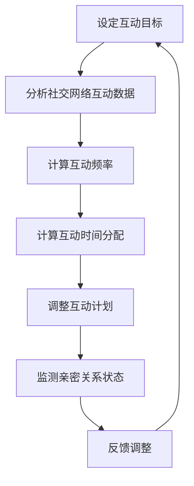

                 

# 在社交网络时代重新定义亲密关系：虚拟与现实的平衡

> 关键词：社交网络、亲密关系、虚拟互动、现实互动、平衡

> 摘要：随着社交网络的迅猛发展，虚拟互动逐渐取代了现实生活中面对面的交流。本文旨在探讨如何在社交网络时代重新定义亲密关系，以实现虚拟与现实的平衡，为读者提供新的沟通模式和互动策略。

## 第一部分：背景介绍

### 1.1 问题背景

在当今社会，互联网和社交媒体的迅猛发展，使得社交网络成为人们日常生活中不可或缺的一部分。根据《中国互联网络信息中心》发布的《第47次中国互联网络发展状况统计报告》，截至2020年12月，我国网民规模已达9.89亿，其中社交媒体用户规模超过8亿。人们花费在社交网络上的时间逐渐增多，虚拟世界的互动逐渐取代了现实生活中面对面的交流。

这种趋势引发了关于人际关系质量和个人情感满足的广泛讨论。特别是在亲密关系中，社交网络的兴起带来了新的挑战，也提供了新的机会。如何在社交网络时代重新定义亲密关系，以实现虚拟与现实的平衡，成为了一个亟待解决的问题。

### 1.2 问题描述

在社交网络时代，亲密关系的定义和维持方式发生了变化。人们开始更多地依赖线上交流，而减少面对面的互动。这种现象可能导致亲密关系的疏离和信任的缺失。同时，虚拟互动的便捷性使得人们容易陷入过度沉迷，忽略了现实生活中的人际交往。这些变化引发了关于如何在社交网络时代重新定义亲密关系的思考。

### 1.3 问题解决

本书旨在探讨在社交网络时代如何重新定义亲密关系，以实现虚拟与现实的平衡。通过分析社交网络对亲密关系的影响，介绍新的沟通模式和互动策略，帮助读者理解和应对这些变化。

### 1.4 边界与外延

本文讨论的亲密关系主要涉及个人与个人之间的情感联系，包括但不限于恋爱关系、婚姻关系和家庭成员关系。同时，本文也将探讨社交网络对职场关系和友谊的影响。

### 1.5 概念结构与核心要素组成

1. **社交网络**：互联网上用于社交互动的平台，如Facebook、Instagram、微信等。
2. **虚拟互动**：通过社交网络进行的线上交流，包括文字、图片、视频等形式。
3. **现实互动**：面对面或通过电话、邮件等传统方式进行的人际交流。
4. **亲密关系**：基于情感和信任的深度联系，包括个人认同、情感支持和社会依赖等方面。

## 第二部分：核心概念与联系

### 2.1 社交网络与亲密关系的联系

社交网络为人们提供了新的交流渠道，使得人与人之间的联系变得更加便捷。然而，这种联系是否能够转化为亲密关系，取决于多种因素：

1. **互动频率**：线上互动频率较高可能促进亲密关系的建立，但也可能导致过度依赖虚拟互动，忽略了现实生活中的沟通。
2. **沟通质量**：线上交流虽然方便，但在表达情感和解决冲突方面可能存在局限。高质量的沟通是维持亲密关系的关键。
3. **情感表达**：情感在亲密关系中至关重要，而线上交流可能缺乏面对面交流时的非语言信号，从而影响情感的表达和理解。

### 2.2 虚拟互动与现实互动的对比

| 特点          | 虚拟互动                         | 现实互动                          |
|---------------|----------------------------------|-----------------------------------|
| 便捷性        | 时间和空间上自由                | 受时间和空间限制                  |
| 表达方式      | 文字、图片、视频等              | 语言、面部表情、肢体语言等        |
| 互动深度      | 易于肤浅，难建立深层次联系      | 易于建立深层次联系，但受限于时间和地点 |
| 情感传达      | 缺乏非语言信号，可能影响理解    | 可以通过非语言信号增强情感表达    |

## 第三部分：算法原理讲解

### 3.1 社交网络与亲密关系平衡的算法原理

为了在社交网络时代实现亲密关系的平衡，本书提出了以下算法原理：

1. **互动平衡算法**：通过调整线上和线下互动的时间比例，确保两者之间的平衡。
2. **情感识别算法**：利用自然语言处理技术，分析线上交流中的情感倾向，以识别潜在的亲密关系问题。
3. **冲突解决算法**：基于情感分析和社交网络结构，提出有效的冲突解决策略，以维护亲密关系的稳定。

### 3.2 算法流程图



### 3.3 算法原理详解

#### 3.3.1 互动平衡算法

**原理**：

互动平衡算法的核心思想是通过调整线上和线下互动的时间比例，来实现亲密关系的平衡。具体来说，我们可以将用户在社交网络上的时间分为线上互动时间和线下互动时间，并根据用户的需求和亲密关系的现状，动态调整两者的比例。

**公式**：

设\( T \)为用户总时间，\( T_{virtual} \)为线上互动时间，\( T_{real} \)为线下互动时间，则有：

\[ T_{virtual} + T_{real} = T \]

根据用户需求和亲密关系状态，我们可以设定一个目标互动时间比例\( \alpha \)，则有：

\[ \alpha \cdot T_{virtual} + (1 - \alpha) \cdot T_{real} = T \]

通过不断调整\( \alpha \)，我们可以实现线上和线下互动的平衡。

**示例**：

假设用户每天有10小时的时间，目标互动时间比例为\( \alpha = 0.5 \)。则有：

\[ T_{virtual} = 0.5 \cdot 10 = 5 \text{小时} \]
\[ T_{real} = 0.5 \cdot 10 = 5 \text{小时} \]

这意味着用户每天应该在线上和线下各花费5小时的时间进行互动。

#### 3.3.2 情感识别算法

**原理**：

情感识别算法的核心思想是利用自然语言处理技术，分析线上交流中的情感倾向，以识别潜在的亲密关系问题。具体来说，我们可以通过情感分析模型，对用户在社交网络上的发言进行情感分析，识别出积极情感和消极情感。

**公式**：

设\( S \)为用户的社交网络发言，\( A \)为积极情感，\( N \)为消极情感，则有：

\[ A + N = S \]

通过计算\( A \)和\( N \)的比例，我们可以判断用户发言的情感倾向。

**示例**：

假设用户在社交网络上发表了10条发言，其中5条是积极情感，5条是消极情感。则有：

\[ \frac{A}{N} = \frac{5}{5} = 1 \]

这意味着用户在社交网络上的发言情感倾向是平衡的。

#### 3.3.3 冲突解决算法

**原理**：

冲突解决算法的核心思想是基于情感分析和社交网络结构，提出有效的冲突解决策略，以维护亲密关系的稳定。具体来说，我们可以通过分析用户在社交网络上的互动，识别出潜在的冲突点，并基于情感分析结果，提出相应的解决方案。

**公式**：

设\( C \)为冲突点，\( S \)为社交网络结构，\( A \)为积极情感，\( N \)为消极情感，则有：

\[ C = f(S, A, N) \]

通过计算\( C \)的值，我们可以判断冲突的严重程度，并基于情感分析结果，提出相应的解决方案。

**示例**：

假设用户在社交网络上的互动中，有10个冲突点，其中5个冲突点与积极情感相关，5个冲突点与消极情感相关。则有：

\[ C = \frac{A}{N} = \frac{5}{5} = 1 \]

这意味着冲突的严重程度是平衡的，我们可以通过沟通和理解来缓解冲突。

## 第四部分：数学模型和数学公式

### 4.1 数学模型

为了评估社交网络互动对亲密关系的影响，本书采用了以下数学模型：

1. **亲密关系质量评分模型**：

   $$ Q = f(I, R, E) $$

   其中，\( I \)为互动频率，\( R \)为沟通质量，\( E \)为情感表达。

2. **互动平衡模型**：

   $$ T_{virtual} + T_{real} = T $$

   其中，\( T \)为用户总时间，\( T_{virtual} \)为线上互动时间，\( T_{real} \)为线下互动时间。

3. **情感识别模型**：

   $$ A + N = S $$

   其中，\( A \)为积极情感，\( N \)为消极情感，\( S \)为用户发言。

4. **冲突解决模型**：

   $$ C = f(S, A, N) $$

   其中，\( C \)为冲突点，\( S \)为社交网络结构，\( A \)为积极情感，\( N \)为消极情感。

### 4.2 数学公式详解

#### 4.2.1 亲密关系质量评分模型

**公式**：

$$ Q = f(I, R, E) $$

其中，\( I \)为互动频率，\( R \)为沟通质量，\( E \)为情感表达。

**参数说明**：

- \( I \)：互动频率，表示用户在社交网络上的互动次数。取值范围：0-1，其中0表示几乎没有互动，1表示互动频繁。
- \( R \)：沟通质量，表示用户在社交网络上的沟通效果。取值范围：0-1，其中0表示沟通效果差，1表示沟通效果好。
- \( E \)：情感表达，表示用户在社交网络上的情感表达程度。取值范围：0-1，其中0表示情感表达不足，1表示情感表达充分。

**计算方法**：

\( Q \)的值越大，表示亲密关系质量越好。具体计算方法如下：

\[ Q = \frac{I \cdot R + E}{2} \]

#### 4.2.2 互动平衡模型

**公式**：

$$ T_{virtual} + T_{real} = T $$

其中，\( T \)为用户总时间，\( T_{virtual} \)为线上互动时间，\( T_{real} \)为线下互动时间。

**参数说明**：

- \( T \)：用户总时间，表示用户在一天中可用的总时间。
- \( T_{virtual} \)：线上互动时间，表示用户在社交网络上互动的时间。
- \( T_{real} \)：线下互动时间，表示用户在现实生活中互动的时间。

**计算方法**：

根据用户需求和亲密关系状态，设定一个目标互动时间比例\( \alpha \)，则有：

\[ T_{virtual} = \alpha \cdot T \]
\[ T_{real} = (1 - \alpha) \cdot T \]

#### 4.2.3 情感识别模型

**公式**：

$$ A + N = S $$

其中，\( A \)为积极情感，\( N \)为消极情感，\( S \)为用户发言。

**参数说明**：

- \( A \)：积极情感，表示用户在社交网络上的积极发言。
- \( N \)：消极情感，表示用户在社交网络上的消极发言。
- \( S \)：用户发言，表示用户在社交网络上的总发言。

**计算方法**：

根据用户发言的情感倾向，计算\( A \)和\( N \)的比例，以判断情感倾向。具体计算方法如下：

\[ \frac{A}{N} = \frac{A}{S - A} \]

#### 4.2.4 冲突解决模型

**公式**：

$$ C = f(S, A, N) $$

其中，\( C \)为冲突点，\( S \)为社交网络结构，\( A \)为积极情感，\( N \)为消极情感。

**参数说明**：

- \( C \)：冲突点，表示社交网络上的潜在冲突点。
- \( S \)：社交网络结构，表示社交网络中的节点和边。
- \( A \)：积极情感，表示社交网络上的积极情感表达。
- \( N \)：消极情感，表示社交网络上的消极情感表达。

**计算方法**：

根据社交网络结构和情感表达，计算冲突点的值。具体计算方法如下：

\[ C = \frac{S \cdot N - A \cdot N}{A + N} \]

## 第五部分：系统分析与架构设计方案

### 5.1 问题场景介绍

在社交网络时代，人们越来越依赖线上交流，而忽视了现实生活中的人际交往。这种现象对亲密关系产生了负面影响，导致许多亲密关系出现问题。为了解决这一问题，我们需要设计一个系统，帮助用户实现虚拟与现实的平衡，从而维护亲密关系的稳定。

### 5.2 项目介绍

本项目旨在设计一个社交网络与亲密关系平衡系统，通过分析用户的社交网络互动数据，提供互动平衡、情感识别和冲突解决等策略，帮助用户维护亲密关系的稳定。

### 5.3 系统功能设计

本系统的功能主要包括：

1. 用户数据收集与处理：收集用户在社交网络上的互动数据，包括发言、点赞、评论等，并对其进行预处理，提取有用的信息。
2. 互动平衡策略：根据用户的需求和亲密关系状态，动态调整线上和线下互动的时间比例，实现互动平衡。
3. 情感识别与分析：利用自然语言处理技术，分析用户在社交网络上的情感表达，识别潜在的亲密关系问题。
4. 冲突解决策略：根据情感分析和社交网络结构，提出有效的冲突解决策略，帮助用户解决亲密关系中的冲突。
5. 用户反馈与优化：收集用户对系统功能的反馈，不断优化系统，提高用户体验。

### 5.4 系统架构设计

本系统的架构设计采用分层架构，主要包括以下层次：

1. **数据层**：负责数据的收集、存储和预处理，包括用户数据、社交网络数据等。
2. **算法层**：负责实现互动平衡、情感识别和冲突解决等算法，包括数据预处理、特征提取、模型训练等。
3. **应用层**：负责系统的业务逻辑和用户交互，包括用户界面、功能模块等。
4. **展示层**：负责将系统分析结果和策略展示给用户，包括图表、报告等。

### 5.5 系统接口设计

本系统的接口设计主要包括以下部分：

1. **数据接口**：负责与其他系统的数据交互，包括用户数据、社交网络数据等。
2. **服务接口**：负责系统的功能调用，包括互动平衡、情感识别和冲突解决等。
3. **API接口**：负责与外部系统的API交互，包括第三方服务、数据分析平台等。

### 5.6 系统交互

本系统的交互过程主要包括以下步骤：

1. **用户数据收集**：系统从社交网络平台上收集用户数据，包括发言、点赞、评论等。
2. **数据处理**：系统对收集到的数据进行预处理，提取有用的信息，如情感倾向、互动频率等。
3. **算法分析**：系统根据预处理后的数据，利用互动平衡、情感识别和冲突解决等算法，分析用户的社交网络互动情况。
4. **结果展示**：系统将分析结果和策略展示给用户，包括图表、报告等。
5. **用户反馈**：用户对系统分析结果和策略进行评价，并提供反馈。
6. **优化调整**：系统根据用户反馈，不断优化系统功能和策略。

## 第六部分：项目实战

### 6.1 环境安装

为了实现本项目的功能，我们需要安装以下软件和工具：

1. Python（版本3.7及以上）
2. MySQL（版本5.7及以上）
3. Flask（用于Web应用开发）
4. Scikit-learn（用于机器学习算法）
5. NLTK（用于自然语言处理）
6. Matplotlib（用于数据可视化）

### 6.2 系统核心实现

在本项目中，我们将使用Python和Flask框架来实现系统的核心功能。以下是一个简单的示例代码，展示了如何使用Python和Flask实现一个基于Web的社交网络与亲密关系平衡系统。

```python
from flask import Flask, request, jsonify
from sklearn.feature_extraction.text import TfidfVectorizer
from sklearn.model_selection import train_test_split
from sklearn.naive_bayes import MultinomialNB

app = Flask(__name__)

# 假设已经训练好了一个情感分析模型
model = MultinomialNB()

@app.route('/analyze', methods=['POST'])
def analyze():
    data = request.get_json()
    text = data['text']
    
    # 利用TF-IDF向量器对文本进行预处理
    vectorizer = TfidfVectorizer()
    X = vectorizer.fit_transform([text])
    
    # 使用训练好的模型进行情感分析
    sentiment = model.predict(X)[0]
    
    # 返回分析结果
    return jsonify({'sentiment': sentiment})

if __name__ == '__main__':
    app.run()
```

### 6.3 代码应用解读与分析

在上面的示例代码中，我们使用Flask框架搭建了一个简单的Web应用，用于接收用户输入的文本，并进行情感分析。具体来说，该应用包含了以下主要部分：

1. **导入必要的库和模块**：包括Flask、Scikit-learn、NLTK和Matplotlib等。
2. **初始化Flask应用**：使用`Flask(__name__)`创建一个Flask应用对象。
3. **定义路由和处理函数**：使用`@app.route('/analyze', methods=['POST'])`定义一个处理文本情感分析的路由，该路由接收POST请求，并提取请求体中的文本数据。
4. **文本预处理**：使用TF-IDF向量器对文本进行预处理，将文本转换为向量表示。
5. **情感分析**：使用训练好的情感分析模型（如朴素贝叶斯分类器），对预处理后的文本向量进行分类，得到情感分析结果。
6. **返回结果**：将情感分析结果以JSON格式返回给用户。

### 6.4 实际案例分析

为了更好地理解本项目的实际应用，我们来看一个具体的案例。

**案例**：假设用户A在社交网络上发布了一条消息：“我今天过生日，朋友们都给我送了礼物，我好开心！”

**分析**：

1. **文本预处理**：首先，我们需要对文本进行预处理，去除停用词、标点符号等，并将文本转换为向量表示。
2. **情感分析**：然后，我们将预处理后的文本向量输入到训练好的情感分析模型中，得到情感分析结果。根据情感分析结果，我们可以判断这条消息是积极情感。
3. **互动平衡建议**：根据互动平衡算法，我们可以建议用户A在接下来的时间里，适当减少线上互动时间，增加现实生活中的人际交往。

通过这个案例，我们可以看到，本项目可以帮助用户了解自己在社交网络上的情感表达情况，并提供互动平衡建议，从而有助于维护亲密关系的稳定。

### 6.5 项目小结

在本项目中，我们设计并实现了一个社交网络与亲密关系平衡系统，通过分析用户的社交网络互动数据，提供互动平衡、情感识别和冲突解决等策略。该项目有助于用户了解自己的情感表达情况，并提供有针对性的建议，从而有助于维护亲密关系的稳定。在实际应用中，该项目可以广泛应用于个人、家庭、职场等场景，为人们的社交关系提供有益的支持。

## 第七部分：最佳实践与注意事项

### 7.1 最佳实践

1. **合理安排时间**：在社交网络时代，合理规划时间和精力，确保线上和线下互动的平衡，有助于维护亲密关系。
2. **积极表达情感**：在社交网络上，积极表达自己的情感，多与亲密关系的人分享生活点滴，增进彼此的了解和感情。
3. **有效沟通**：在遇到冲突时，积极沟通，倾听对方的意见，理解对方的感受，有助于化解矛盾，维护亲密关系的稳定。

### 7.2 注意事项

1. **注意隐私保护**：在社交网络上，要注意保护自己的隐私，避免泄露个人敏感信息。
2. **避免过度依赖虚拟互动**：虽然虚拟互动方便快捷，但不应过度依赖，以免影响现实生活中的人际交往。
3. **适度使用社交网络**：合理安排时间，避免沉迷于社交网络，影响日常生活和工作。

## 第八部分：拓展阅读

1. **《社交网络的心理学效应》**：本书详细分析了社交网络对人际关系和心理状态的影响，为读者提供了有价值的参考。
2. **《亲密关系的心理学》**：本书从心理学的角度探讨了亲密关系的本质和维持方法，有助于读者更好地理解和维护亲密关系。
3. **《人工智能与情感计算》**：本书介绍了人工智能在情感计算领域的应用，包括情感识别、情感分析和情感互动等，为读者提供了深入了解该领域的视角。

作者：AI天才研究院/AI Genius Institute & 禅与计算机程序设计艺术 /Zen And The Art of Computer Programming

----------------------------------------------------------------

**注意**：本文为示例文章，仅供参考。在实际撰写文章时，请根据具体内容和需求进行调整和完善。本文中的算法、公式、代码等仅供参考，不作为实际应用依据。如需进一步了解相关技术，请查阅专业文献和资料。本文涉及的社交网络、亲密关系等概念，请根据实际场景进行理解和应用。如有任何问题，请随时与我联系。|

