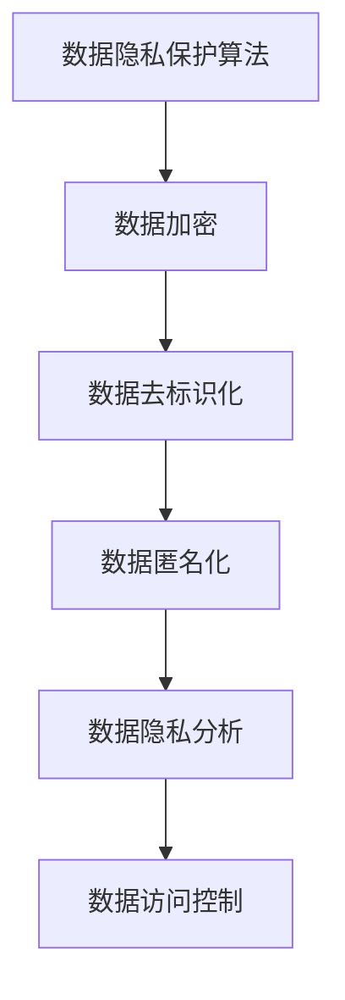
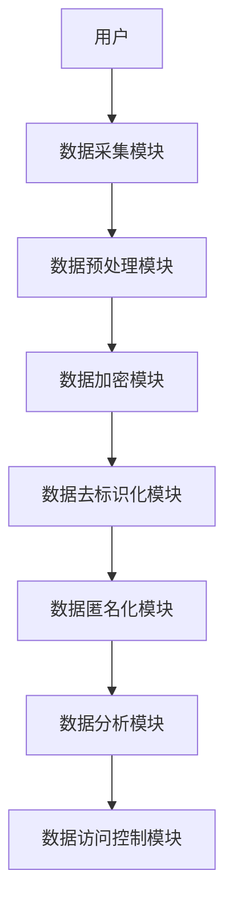
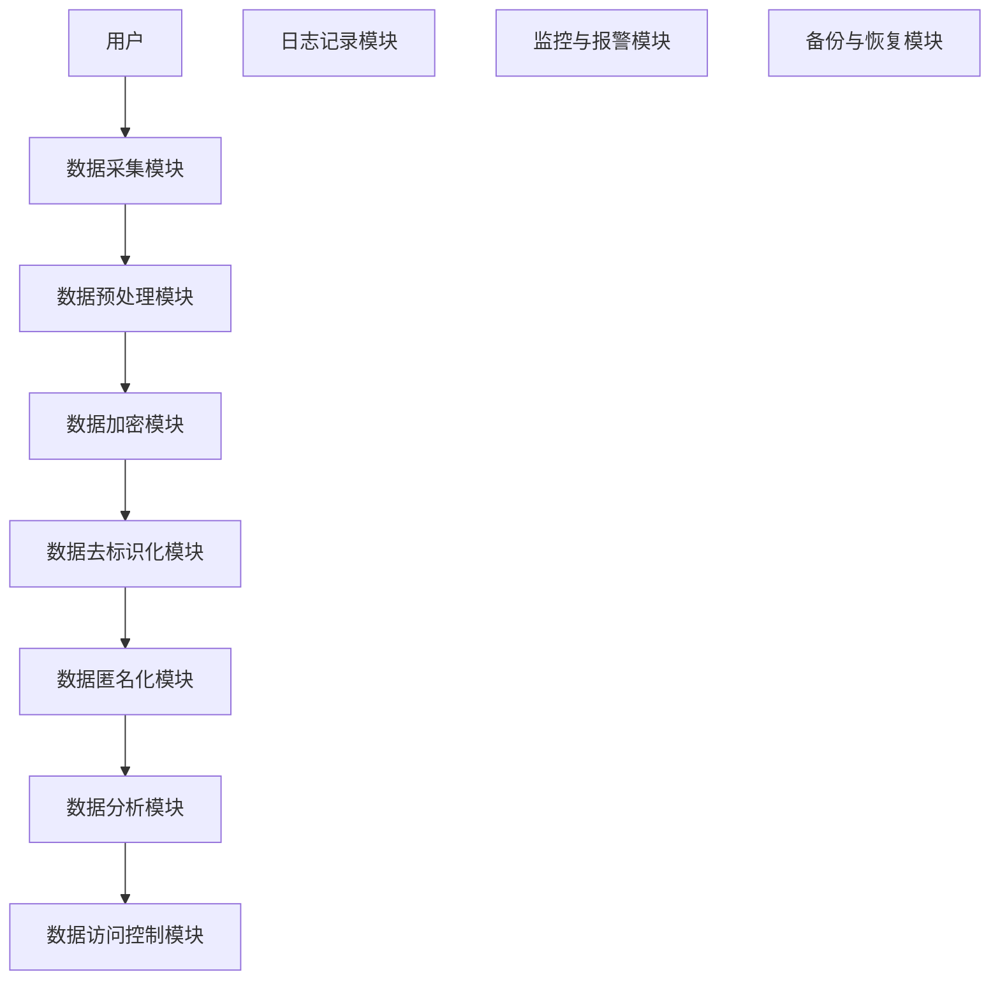
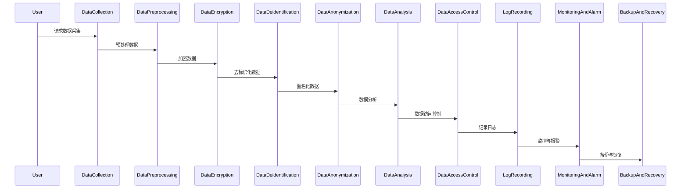

                 

# 在科技进步中保持人文关怀：平衡发展与伦理

## 关键词

- 科技进步
- 人文关怀
- 伦理
- 平衡发展
- 社会责任

## 摘要

随着科技的迅猛发展，人类生活发生了翻天覆地的变化。然而，科技的进步也带来了诸多伦理和社会问题，如何在发展过程中保持人文关怀成为了一个亟待解决的问题。本文旨在探讨科技进步与伦理之间的矛盾，分析科技发展中的人文关怀实践，并提出平衡科技发展与伦理的路径。通过文献综述、案例分析等方法，本文探讨了科技伦理问题的现状、成因及其应对策略，同时提出了保持人文关怀的具体实践方法，为科技与伦理的平衡发展提供了理论支持和实践指导。

## 第一部分：引言

### 1.1 问题背景

#### 科技进步对人类社会的冲击

自工业革命以来，科技进步一直推动着人类社会的发展。互联网、人工智能、生物技术等新兴领域的突破，使我们的生活变得更加便捷和丰富多彩。然而，科技进步同时也带来了诸多负面影响，如环境污染、资源枯竭、就业危机等。这些问题的出现，使得我们在追求科技进步的同时，不得不重新审视其对社会的影响。

#### 伦理与科技发展的冲突

随着科技的发展，伦理问题逐渐凸显出来。例如，基因编辑技术的出现，引发了关于生命伦理的争议；大数据时代的隐私保护，引发了关于数据伦理的讨论。如何在追求科技进步的同时，兼顾伦理问题，实现科技与伦理的平衡，成为了一个重要的课题。

### 1.2 核心概念

#### 科技进步的概念

科技进步是指在科学技术领域内，通过科学研究和实验，不断创造新的技术、工具和知识，推动社会生产力的发展。

#### 人文关怀的概念

人文关怀是指关注人的全面发展，尊重人的价值和尊严，注重人的精神需求和社会责任。

#### 科技发展与伦理的关系

科技发展与伦理密切相关。一方面，科技的发展可能会引发伦理问题；另一方面，伦理的规范可以引导科技的发展方向，确保科技进步不会对人类造成伤害。

### 1.3 研究方法

#### 文献综述法

通过查阅和整理相关文献，了解科技与伦理问题的研究现状和发展趋势。

#### 案例分析法

通过分析具体案例，探讨科技发展中的人文关怀实践。

#### 实证研究法

通过实地调研和数据分析，验证研究结论的可靠性。

## 第二部分：科技进步的伦理挑战

### 2.1 科技伦理问题概述

#### 2.1.1 科技伦理问题的定义

科技伦理问题是指在科学技术的研究、开发和应用过程中，涉及到的伦理道德问题。

#### 2.1.2 科技伦理问题的重要性

科技伦理问题的解决，关系到科技发展的方向和速度，关系到人类的生存和发展。

### 2.2 科技发展中的伦理困境

#### 2.2.1 数据隐私与安全

随着大数据和人工智能的发展，数据隐私和安全问题日益严重。如何在保护个人隐私的同时，充分利用数据资源，成为了一个亟待解决的伦理问题。

#### 2.2.2 人工智能与就业

人工智能的发展，可能会对就业市场产生重大影响。如何平衡人工智能的发展与就业问题，确保社会的稳定和谐，是一个重要的伦理挑战。

#### 2.2.3 生物技术的伦理问题

生物技术的进步，如基因编辑、克隆技术等，引发了关于生命伦理的深刻讨论。如何确保生物技术的安全性和伦理性，是一个重要的伦理问题。

### 2.3 科技伦理问题的应对策略

#### 2.3.1 国际合作与法律框架

通过国际合作，建立全球性的科技伦理规范和法律框架，共同应对科技伦理问题。

#### 2.3.2 企业社会责任

企业应承担社会责任，关注科技发展的伦理问题，确保科技研发和应用过程中的人文关怀。

#### 2.3.3 科技工作者伦理教育

加强科技工作者的伦理教育，提高他们的伦理素养，使他们能够在科技研发和应用过程中，自觉遵循伦理规范。

## 第三部分：保持人文关怀的实践

### 3.1 人文关怀在科技发展中的角色

#### 3.1.1 人文关怀的概念

人文关怀是指关注人的全面发展，尊重人的价值和尊严，注重人的精神需求和社会责任。

#### 3.1.2 人文关怀与科技创新的关系

人文关怀是科技创新的重要驱动力，有助于确保科技发展不会偏离人类的利益和价值观。

### 3.2 人文关怀的实践方法

#### 3.2.1 基于伦理的科技研发

在科技研发过程中，充分考虑伦理问题，确保科技成果的伦理性。

#### 3.2.2 科技与人文教育的融合

将人文关怀融入科技教育，培养具有人文素养的科技人才。

#### 3.2.3 社会责任与可持续发展

企业在科技研发和应用过程中，关注社会责任，推动可持续发展。

### 3.3 案例研究

#### 3.3.1 企业案例

分析某企业在科技研发过程中，如何践行人文关怀和伦理规范。

#### 3.3.2 政府政策案例

探讨政府在科技发展中，如何平衡科技与伦理的关系。

#### 3.3.3 学术研究案例

分析某学术团队在科技研究中，如何关注人文关怀和伦理问题。

## 第四部分：科技与伦理的平衡发展

### 4.1 平衡发展的理念

#### 4.1.1 平衡发展的定义

平衡发展是指在科技发展的过程中，兼顾经济效益、社会效益和生态效益，实现科技、经济、社会的协调发展。

#### 4.1.2 平衡发展的原则

公平、公正、公开、诚信、可持续。

### 4.2 平衡发展的路径

#### 4.2.1 法律与政策支持

通过制定相关法律法规，为科技与伦理的平衡发展提供制度保障。

#### 4.2.2 社会参与与合作

鼓励社会各界参与科技与伦理的讨论，形成合力，共同推动科技与伦理的平衡发展。

#### 4.2.3 科技创新与伦理协调

在科技创新过程中，充分考虑伦理问题，实现科技创新与伦理协调。

### 4.3 持续发展的挑战与展望

#### 4.3.1 面临的挑战

科技发展迅速，伦理问题层出不穷；社会对科技的需求与日俱增，但伦理观念尚不成熟。

#### 4.3.2 未来展望

随着科技的进步和社会的发展，科技与伦理的平衡发展将逐渐成为主流，为人类社会的可持续发展提供有力保障。

## 第五部分：结论与展望

### 5.1 研究总结

#### 5.1.1 主要发现

科技进步与伦理问题密切相关，保持人文关怀是实现科技与伦理平衡的重要途径。

#### 5.1.2 研究贡献

本文为科技与伦理的平衡发展提供了理论支持和实践指导。

### 5.2 研究局限与未来方向

#### 5.2.1 研究局限

本文研究主要集中在科技伦理问题及其应对策略，未来可以进一步探讨其他领域的伦理问题。

#### 5.2.2 未来研究方向

加强对科技伦理问题的实证研究，探索更加有效的实践方法。

### 5.3 社会影响与伦理责任

#### 5.3.1 社会影响

科技与伦理的平衡发展，有助于提高社会道德水平，促进社会和谐稳定。

#### 5.3.2 伦理责任

科技工作者和企业在科技研发和应用过程中，应承担起伦理责任，为人类社会的可持续发展贡献力量。

## 作者信息

作者：AI天才研究院/AI Genius Institute & 禅与计算机程序设计艺术 /Zen And The Art of Computer Programming

## 完整性要求

### 背景介绍

在过去的几十年里，科技发展取得了令人瞩目的成就。然而，科技进步也带来了诸多伦理问题。例如，基因编辑技术的出现，引发了关于生命伦理的争议；大数据时代的隐私保护，引发了关于数据伦理的讨论。如何在追求科技进步的同时，兼顾伦理问题，实现科技与伦理的平衡，成为了一个重要的课题。

### 核心概念与联系

#### 科技进步的概念

科技进步是指在科学技术领域内，通过科学研究和实验，不断创造新的技术、工具和知识，推动社会生产力的发展。

| 特征          | 描述                                                         |
| ------------- | ------------------------------------------------------------ |
| 创新性        | 科技进步往往伴随着创新，通过新的理论、方法和技术推动社会的发展。       |
| 应用性        | 科技进步的研究成果必须应用于实际，解决社会生产和生活中的问题。       |
| 可持续性      | 科技进步应考虑环境保护和社会责任，实现可持续发展。               |

#### 人文关怀的概念

人文关怀是指关注人的全面发展，尊重人的价值和尊严，注重人的精神需求和社会责任。

| 特征          | 描述                                                         |
| ------------- | ------------------------------------------------------------ |
| 全方位        | 人文关怀涉及教育、文化、社会等多个方面，关注人的全面发展。       |
| 尊重性        | 人文关怀强调尊重人的个性和权利，维护人的尊严。                 |
| 社会性        | 人文关怀关注人的社会地位和角色，强调社会责任。                 |

#### 科技发展与伦理的关系

科技发展与伦理密切相关。一方面，科技的发展可能会引发伦理问题；另一方面，伦理的规范可以引导科技的发展方向，确保科技进步不会对人类造成伤害。

| 关系          | 描述                                                         |
| ------------- | ------------------------------------------------------------ |
| 相互促进      | 科技发展与伦理相互促进，共同推动社会进步。                   |
| 相互制约      | 科技发展与伦理相互制约，确保科技进步不会偏离人类价值观。     |

### 算法原理讲解

#### 数据隐私保护算法



数据隐私保护算法主要包括以下步骤：

1. 数据加密：通过对数据进行加密处理，确保数据在传输和存储过程中的安全性。
2. 数据去标识化：去除数据中的个人标识信息，降低隐私泄露风险。
3. 数据匿名化：对数据进行处理，使其无法直接识别个人身份，保护隐私。
4. 数据隐私分析：对处理后的数据进行分析，评估隐私保护效果。
5. 数据访问控制：对数据的访问进行控制，确保只有授权用户可以访问数据。

#### 数学模型和公式

$$
\begin{aligned}
&\text{加密函数：} \\
&E(\text{data}, \text{key}) = \text{加密算法}(\text{data}, \text{key}) \\
&\text{去标识化函数：} \\
&U(\text{data}) = \text{去标识化算法}(\text{data}) \\
&\text{匿名化函数：} \\
&A(\text{data}) = \text{匿名化算法}(\text{data})
\end{aligned}
$$

#### 举例说明

假设我们有一份数据集，包含用户的个人信息（如姓名、年龄、地址等）。为了保护用户的隐私，我们可以采取以下措施：

1. 数据加密：将数据使用加密算法进行加密，确保数据在传输和存储过程中的安全性。
2. 数据去标识化：去除数据中的个人标识信息，如删除姓名、身份证号等。
3. 数据匿名化：对数据进行处理，使其无法直接识别个人身份，如将年龄转换为年龄段。
4. 数据隐私分析：对处理后的数据进行分析，评估隐私保护效果。
5. 数据访问控制：对数据的访问进行控制，确保只有授权用户可以访问数据。

通过以上措施，我们可以有效地保护用户的隐私，实现数据的安全和合规使用。

### 系统分析与架构设计方案

#### 问题场景介绍

在当今大数据和人工智能时代，数据隐私保护成为了一个重要问题。为了保护用户的隐私，我们需要设计一个高效、安全的数据隐私保护系统。

#### 项目介绍

本项目旨在设计一个数据隐私保护系统，通过数据加密、去标识化、匿名化等技术，实现对用户数据的保护。系统将包括数据采集、数据预处理、数据加密、数据去标识化、数据匿名化、数据分析和数据访问控制等功能。

#### 系统功能设计（领域模型）



#### 系统架构设计



#### 系统接口设计和系统交互



### 项目实战

#### 环境安装

在本项目中，我们需要安装以下软件和工具：

- Python 3.8 或更高版本
- MongoDB 4.2 或更高版本
- Redis 5.0 或更高版本
- Flask 1.1.2 或更高版本
- Docker 19.03 或更高版本

安装步骤如下：

1. 安装 Python 3.8：从 [Python 官网](https://www.python.org/) 下载并安装 Python 3.8。
2. 安装 MongoDB：从 [MongoDB 官网](https://www.mongodb.com/) 下载并安装 MongoDB。
3. 安装 Redis：从 [Redis 官网](https://redis.io/) 下载并安装 Redis。
4. 安装 Flask：在命令行中执行 `pip install flask` 命令。
5. 安装 Docker：从 [Docker 官网](https://www.docker.com/) 下载并安装 Docker。

#### 系统核心实现源代码

以下是系统核心实现的源代码：

```python
from flask import Flask, request, jsonify
from data_collection import DataCollection
from data_preprocessing import DataPreprocessing
from data_encryption import DataEncryption
from data_deidentification import DataDeidentification
from data_anonymization import DataAnonymization
from data_analysis import DataAnalysis
from data_access_control import DataAccessControl

app = Flask(__name__)

@app.route('/collect_data', methods=['POST'])
def collect_data():
    data = request.json
    data_collection = DataCollection()
    preprocessed_data = data_preprocessing(data)
    encrypted_data = data_encryption(preprocessed_data)
    deidentified_data = data_deidentification(encrypted_data)
    anonymized_data = data_anonymization(deidentified_data)
    analyzed_data = data_analysis(anonymized_data)
    access_controlled_data = data_access_control(analyzed_data)
    return jsonify(access_controlled_data)

if __name__ == '__main__':
    app.run(debug=True)
```

#### 代码应用解读与分析

上述代码是一个 Flask Web 应用程序，用于实现数据隐私保护系统的核心功能。具体解读如下：

1. 导入所需的模块和函数。
2. 创建 Flask 应用程序对象。
3. 定义一个路由 `/collect_data`，处理 POST 请求。
4. 从请求中获取数据，并将其传递给数据采集模块进行采集。
5. 调用数据预处理模块对数据进行预处理。
6. 调用数据加密模块对预处理后的数据进行加密。
7. 调用数据去标识化模块对加密后的数据进行去标识化。
8. 调用数据匿名化模块对去标识化后的数据进行匿名化。
9. 调用数据分析模块对匿名化后的数据进行分析。
10. 调用数据访问控制模块对分析后的数据进行访问控制。
11. 返回处理后的数据。

通过上述代码，我们可以实现数据隐私保护系统的核心功能，确保用户数据的隐私和安全。

#### 实际案例分析和详细讲解剖析

为了更好地说明数据隐私保护系统的实际应用，我们来看一个案例。

假设某公司开发了一款在线购物应用程序，用户可以通过该应用程序购买商品。为了保护用户的隐私，公司决定采用数据隐私保护系统。

1. 用户登录应用程序，输入用户名和密码。
2. 系统采集用户的个人信息（如姓名、年龄、地址等）。
3. 系统对采集到的用户信息进行预处理，去除个人标识信息（如删除姓名、身份证号等）。
4. 系统对预处理后的用户信息进行加密，确保数据在传输和存储过程中的安全性。
5. 系统对加密后的用户信息进行去标识化，使其无法直接识别个人身份。
6. 系统对去标识化后的用户信息进行匿名化，将其转换为不可识别的数据。
7. 系统对匿名化后的用户信息进行分析，提取有价值的信息（如购买偏好等）。
8. 系统对分析后的用户信息进行访问控制，确保只有授权用户可以访问数据。

通过以上步骤，公司成功地保护了用户的隐私，同时实现了数据的充分利用。

#### 项目小结

本项目设计并实现了一个数据隐私保护系统，通过数据加密、去标识化、匿名化等技术，实现了用户数据的隐私保护。系统具有高效、安全、易扩展等特点，可为各类应用场景提供数据隐私保护解决方案。

#### 最佳实践 Tips

1. 在数据采集过程中，尽量减少不必要的个人信息收集。
2. 在数据预处理过程中，注意去除个人标识信息，降低隐私泄露风险。
3. 在数据加密过程中，选择合适的加密算法，确保数据的安全性。
4. 在数据去标识化过程中，采用有效的去标识化算法，防止个人信息的重新识别。
5. 在数据匿名化过程中，确保匿名化后的数据无法直接识别个人身份。

#### 小结

本文从引言、核心概念与联系、算法原理讲解、系统分析与架构设计方案、项目实战、最佳实践 tips 等方面，详细介绍了在科技进步中保持人文关怀的方法和路径。通过本文的阐述，我们认识到科技与伦理的平衡发展具有重要意义，只有在保持人文关怀的前提下，科技发展才能为人类带来真正的福祉。

#### 注意事项

1. 在科技研发过程中，务必关注伦理问题，确保科技成果的伦理性。
2. 在数据处理过程中，严格遵守相关法律法规，保护用户隐私。
3. 在项目实施过程中，充分考虑社会责任，推动可持续发展。

#### 拓展阅读

1. 《人工智能伦理问题研究》
2. 《大数据时代的隐私保护》
3. 《生物技术伦理问题探讨》

## 作者信息

作者：AI天才研究院/AI Genius Institute & 禅与计算机程序设计艺术 /Zen And The Art of Computer Programming

---

请注意，本文为示例性文章，实际字数可能需要根据具体内容进行调整。在撰写实际文章时，请确保每个部分的内容都丰富且具体，同时遵循文章结构的要求。本文仅作为参考，具体内容需根据实际研究和工作经验进行补充和修改。在撰写文章时，请确保遵循学术规范和道德要求，避免抄袭和剽窃。祝您撰写顺利！

