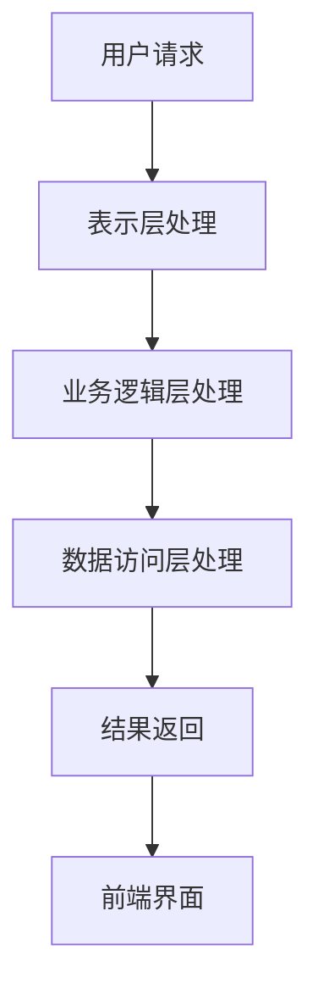

                 

# 在职场中寻找意义：超越薪资和地位的追求

> 关键词：职场意义、工作与生活平衡、职业幸福感、个人成长、社会贡献

> 摘要：本文旨在探讨职场人士如何在现代社会中寻找工作的真正意义，超越薪资和地位，实现个人的成长与自我实现。通过分析职场意义的各个方面，提供一系列策略和路径，帮助读者重新审视职业生涯，找到既能满足物质需求又能带来精神满足的工作。

### 职场意义探索：引言

在现代社会，职场成为人们生活的重要组成部分。然而，随着竞争日益激烈，许多职场人士逐渐感到工作与生活之间的失衡。工作压力、职业倦怠等问题日益突出，使得很多人开始反思职场生活带来的真正意义。那么，职场中的意义究竟是什么？又如何在这纷繁复杂的职场环境中寻找和实现它呢？

#### 背景介绍

#### 问题背景

职场成为现代社会不可或缺的一部分，人们在工作中的投入时间远远超过了其他活动。因此，职场生活的质量直接影响到个人的生活质量和幸福感。然而，在追求薪资和地位的过程中，许多人发现这些物质回报并不能完全满足他们内心的需求。

#### 问题描述

这一现象背后的原因多种多样。首先，职场压力和竞争加剧，使得许多人感到焦虑和疲惫。其次，工作环境和人际关系的问题也可能导致职场倦怠。此外，个人价值观的冲突也可能导致职场意义的迷失。如何在职场中找到真正的意义，成为许多职场人士亟待解决的问题。

#### 问题解决

本书旨在探讨职场中寻找意义的多种途径，帮助读者重新审视自己的职业生涯，找到既能满足物质需求又能带来精神满足的工作。通过分析职场意义的各个方面，提供一系列策略和路径，帮助读者实现这一目标。

#### 边界与外延

职场意义的探索不仅仅局限于个人层面，它还涉及到组织、文化和社会等多个层面。因此，本书将尝试从多个角度出发，为读者提供全面的思考框架。

#### 概念结构与核心要素组成

职场意义包括以下几个方面：

1. **个人成长与自我实现**：通过不断学习、挑战自我，实现个人的潜力和价值。
2. **职业成就与成就感**：设定目标并达成目标，获得职业上的成就感和满足感。
3. **人际关系与团队合作**：建立和维护良好的人际关系，通过团队合作实现共同的目标。
4. **社会贡献与使命感**：通过工作对社会做出贡献，找到自己的使命感。
5. **工作与生活平衡**：确保职场和私人生活之间的和谐，实现身心健康。
6. **职业幸福感**：在职场中感受到的快乐、满足和成就感。

#### 核心概念与联系

### 核心概念

1. **职场意义**：职场中能够给个体带来满足感、价值感和意义感的各个方面。
2. **工作与生活平衡**：确保职场和私人生活之间的和谐，实现身心健康发展。
3. **职业幸福感**：个体在职场中感受到的快乐、满足和成就感。

### 概念属性特征对比表格

| 特征               | 职场意义                         | 工作与生活平衡                         | 职业幸福感                         |
|--------------------|--------------------------------|---------------------------------------|-----------------------------------|
| **定义**           | 职场中能够给个体带来满足感、价值感和意义感的各个方面。 | 确保职场和私人生活之间的和谐，实现身心健康发展。 | 个体在职场中感受到的快乐、满足和成就感。           |
| **重要性**          | 决定了个体在职场中的持续动力和职业发展。                  | 对个体的整体幸福感有着重要影响。               | 是职场意义的一部分，但不仅仅局限于职场。           |
| **关联性**          | 与职业幸福感密切相关，是职场意义的重要组成部分。           | 直接影响职场意义的实现，两者相辅相成。         | 可能是职场意义的直接体现，但不仅仅局限于职场。     |

### ER实体关系图架构的 Mermaid 流程图

```mermaid
erDiagram
  Workplace -->|找到意义| Employee
  Employee -->|追求平衡| Life
  Employee -->|获得幸福| Career
```

### 职场中寻找意义的途径

#### 个人成长与自我实现

**章节1.1**：探讨个体如何在职场中通过不断学习、挑战自我来成长，实现自我价值。

**章节1.2**：分析职业成就感和成就感对职场意义的重要性，以及如何通过设定目标和达成目标来获得。

**章节1.3**：讨论人际关系和团队合作在职场意义中的角色，如何通过良好的团队协作来提升个人的职场体验。

**章节1.4**：探讨职场人士如何通过工作来对社会做出贡献，找到自己的使命感。

**章节1.5**：提供策略和建议，帮助职场人士实现工作与生活的平衡，提高整体幸福感。

**章节1.6**：鼓励职场人士勇于创新和探索，不断寻找新的职场意义。

**章节1.7**：讨论职场中的道德与伦理问题，强调道德行为对职场意义的重要性。

**章节1.8**：帮助职场人士进行有效的职业规划，明确人生目标，找到职场中的长期意义。

**章节1.9**：通过实际案例研究，展示不同职场人士如何在各自的职业道路上寻找和实现职场意义。

**章节1.10**：总结本书的主要观点，展望职场意义探索的未来趋势。

## 职场中寻找意义的途径

### 个人成长与自我实现

**章节1.1**：探讨个体如何在职场中通过不断学习、挑战自我来成长，实现自我价值。

职场中的个人成长与自我实现是许多人追求的重要目标。然而，如何在这个快节奏、竞争激烈的环境中找到成长的路径，实现自我价值，是一个值得深思的问题。以下是一些关键点：

#### 终身学习的理念

在科技飞速发展的今天，知识更新的速度越来越快。一个职场人士要想保持竞争力，就必须具备终身学习的理念。这不仅包括技术知识的更新，还包括管理技能、人际交往能力等多方面的提升。

**例子**：微软创始人比尔·盖茨每年都会设定学习计划，阅读大量的书籍，不断充实自己的知识储备。这种终身学习的态度使他能够持续创新，推动微软的发展。

#### 挑战自我

在职场中，挑战自我是实现个人成长的关键。这包括接受新的任务、承担更大的责任，以及面对自己不熟悉或感到害怕的领域。

**例子**：谷歌的创始人拉里·佩奇和谢尔盖·布林在创业初期，面对无数的技术挑战，但他们选择迎难而上，最终创立了全球知名的科技公司谷歌。

#### 寻求反馈

个人成长不仅需要自我驱动，还需要外界的反馈。通过寻求他人的意见和建议，可以更好地认识到自己的优点和不足，从而进行改进。

**例子**：亚马逊的创始人杰夫·贝佐斯定期与团队成员进行一对一的交流，倾听他们的意见和反馈，这有助于他不断提升自己的管理能力和领导力。

### 职业成就与成就感

**章节1.2**：分析职业成就感和成就感对职场意义的重要性，以及如何通过设定目标和达成目标来获得。

职业成就感和成就感是职场意义的重要组成部分。一个成功的职业成就不仅可以带来物质回报，更可以提升个人的自尊心和自信心。

#### 设定目标

要获得职业成就感，首先需要设定明确的目标。这些目标可以是短期的，也可以是长期的。短期目标有助于保持动力，而长期目标则可以帮助职场人士规划职业生涯。

**例子**：阿里巴巴的创始人马云在创立阿里巴巴之前，设定了一系列短期和长期目标。他不仅成功地将阿里巴巴发展成全球最大的电子商务公司之一，还成为全球知名的创业家和企业家。

#### 达成目标

设定目标只是第一步，更重要的是要付诸行动，努力达成目标。在实现目标的过程中，可能会遇到各种挑战和困难，但只要坚持下去，最终一定能获得成就感。

**例子**：特斯拉的创始人埃隆·马斯克在面对无数的技术挑战和市场压力时，从未放弃，始终坚持自己的目标。他的坚持和努力使特斯拉成为全球领先的电动汽车制造商。

#### 反思与调整

在达成目标后，反思和总结是提高职业成就感的重要环节。通过反思，可以认识到自己的优点和不足，从而在下一次目标设定和实现过程中做得更好。

**例子**：苹果公司的创始人史蒂夫·乔布斯在每次新产品发布后，都会进行深入的反思和总结。这种反思帮助他不断创新，使苹果公司成为全球科技行业的领导者。

### 人际关系与团队合作

**章节1.3**：讨论人际关系和团队合作在职场意义中的角色，如何通过良好的团队协作来提升个人的职场体验。

在职场中，人际关系和团队合作是不可或缺的部分。良好的人际关系和团队合作不仅可以提升个人的职场体验，还可以促进工作效率和成果。

#### 建立良好的人际关系

建立良好的人际关系是职场成功的重要因素。这包括与同事、上级和下属建立互信、尊重和合作的关系。

**例子**：谷歌公司以其开放的文化和团队合作精神而闻名。公司鼓励员工相互交流，分享知识，这有助于建立强大的人际关系网络。

#### 团队协作

团队合作是实现职场目标的重要手段。一个高效的团队可以发挥每个成员的专长，共同解决问题，实现共同的目标。

**例子**：NASA的火星探测项目就是一个典型的团队合作案例。该项目由全球各地的科学家、工程师和技术人员共同合作，最终成功实现了火星探测。

#### 沟通技巧

沟通技巧是人际关系和团队合作的关键。有效的沟通可以减少误解和冲突，增强团队凝聚力。

**例子**：微软的创始人比尔·盖茨非常重视沟通技巧。他在公司内部推行开放沟通政策，鼓励员工畅所欲言，这有助于团队之间的协作。

### 社会贡献与使命感

**章节1.4**：探讨职场人士如何通过工作来对社会做出贡献，找到自己的使命感。

职场人士通过工作对社会做出贡献，是实现职场意义的重要途径。这种贡献不仅体现在物质方面，还可以体现在精神层面。

#### 通过工作实现社会贡献

职场人士可以通过工作为社会带来实质性的改变。例如，通过技术创新解决社会问题，通过公益活动回馈社会，通过环保行动保护地球等。

**例子**：特斯拉的创始人埃隆·马斯克通过发展电动汽车和可再生能源技术，为社会做出了巨大的贡献，推动了全球环保事业的发展。

#### 找到使命感

使命感是职场人士在职业生涯中找到意义的重要动力。找到使命感可以激发个人的热情和动力，使工作变得更有意义。

**例子**：苹果公司的创始人史蒂夫·乔布斯在创建苹果公司时，就怀有改变世界的使命感。他的创新精神和领导力使苹果公司成为全球最具影响力的科技公司之一。

### 工作与生活平衡

**章节1.5**：提供策略和建议，帮助职场人士实现工作与生活的平衡，提高整体幸福感。

在职场中，工作与生活的平衡是实现职场意义的关键。一个良好的工作与生活平衡不仅可以提高工作效率，还可以提升生活质量。

#### 管理工作压力

工作压力是影响工作与生活平衡的重要因素。职场人士需要学会管理工作压力，避免过度劳累。

**策略**：通过合理的时间管理和任务优先级设置，减少工作负担。同时，学会说“不”，避免接受过多不必要的任务。

**建议**：定期休息，保持充足的睡眠和饮食，进行适量的锻炼，以保持身心健康。

#### 设定个人目标

设定个人目标可以帮助职场人士更好地规划自己的工作和生活。这些目标可以是短期的，也可以是长期的。

**例子**：设定一个具体的目标，如每天晚上锻炼30分钟，每周阅读一本书等，有助于实现工作与生活的平衡。

#### 家庭和朋友的重要性

家庭和朋友是职场人士的重要支持系统。与家人和朋友保持良好的关系，可以提供情感上的支持和安慰。

**建议**：定期与家人和朋友交流，分享工作和生活的喜怒哀乐，减轻心理压力。

### 创新与探索

**章节1.6**：鼓励职场人士勇于创新和探索，不断寻找新的职场意义。

创新和探索是职场中寻找意义的重要途径。通过创新和探索，职场人士可以不断挑战自我，实现自我价值。

#### 培养创新思维

培养创新思维是职场人士实现创新和探索的关键。这包括对新技术、新方法和新观点的敏锐洞察力。

**策略**：保持好奇心，不断学习新知识，敢于尝试新事物。

**例子**：苹果公司的创始人史蒂夫·乔布斯以其创新思维而闻名。他不断挑战传统，推出一系列革命性的产品，引领了全球科技潮流。

#### 探索未知的领域

探索未知的领域可以帮助职场人士发现新的职场意义。这需要勇气和决心，但也能带来巨大的成就感和满足感。

**例子**：亚马逊的创始人杰夫·贝佐斯在创立亚马逊之前，曾是一名金融分析师。他敢于离开舒适区，探索电子商务领域，最终创立了全球最大的在线零售商。

### 职场中的道德与伦理

**章节1.7**：讨论职场中的道德与伦理问题，强调道德行为对职场意义的重要性。

在职场中，道德与伦理问题至关重要。一个道德和伦理良好的职场环境有助于提升职场意义，实现个人的长期发展。

#### 道德行为的重要性

道德行为是职场意义的重要组成部分。一个道德良好的职场人士不仅会受到同事的尊重，还能在工作中获得更多的信任和机会。

**例子**：华为的创始人任正非一直强调道德和诚信的重要性。他要求员工遵守公司的道德规范，以确保公司在全球市场上的声誉。

#### 伦理困境的应对

在职场中，有时会面临道德和伦理困境。正确应对这些困境是职场人士职业道德的体现。

**策略**：在面对道德困境时，首先要保持冷静，客观分析情况。然后，遵循道德准则，做出正确的决策。

**建议**：如果无法自行解决困境，可以寻求上级或专业人士的帮助和建议。

### 职业规划与人生目标

**章节1.8**：帮助职场人士进行有效的职业规划，明确人生目标，找到职场中的长期意义。

职业规划是职场人士实现长期职场意义的关键。通过有效的职业规划，职场人士可以明确自己的职业目标，实现个人的长期发展。

#### 制定职业规划

制定职业规划是职业规划的第一步。这包括评估自己的兴趣、技能和价值观，确定自己的职业目标。

**策略**：通过自我反思和职业测试，了解自己的优势和兴趣，从而制定符合自己特点的职业规划。

**例子**：谷歌公司的创始人拉里·佩奇和谢尔盖·布林在大学期间就明确了自己的职业目标，并通过不断学习和实践，最终实现了自己的梦想。

#### 职业发展的路径

制定职业规划后，需要确定职业发展的路径。这包括设定短期和长期的目标，并制定实现这些目标的计划和步骤。

**策略**：通过制定具体的行动计划，逐步实现职业目标。

**例子**：微软公司的创始人比尔·盖茨在大学毕业后，通过自己的努力和不断学习，最终成为全球最富有的人之一。

#### 适应变化

在职业生涯中，变化是不可避免的。职场人士需要学会适应变化，不断提升自己的能力和技能，以应对新的挑战。

**策略**：保持对新技术和新知识的好奇心，不断学习，以适应不断变化的市场需求。

**建议**：定期进行职业评估，了解自己的职业发展状况，并根据实际情况进行调整。

### 案例研究

**章节1.9**：通过实际案例研究，展示不同职场人士如何在各自的职业道路上寻找和实现职场意义。

实际案例研究是理解职场意义的重要途径。通过分析不同职场人士的成功经验和挑战，可以更好地理解职场意义的各个方面。

#### 案例一：马云与阿里巴巴

马云是中国知名的企业家和慈善家，也是阿里巴巴集团的创始人。他在创业初期面临着巨大的挑战，但通过不断学习和创新，成功地将阿里巴巴发展成全球最大的电子商务公司之一。

**成功经验**：

1. **明确目标**：马云在创业初期就明确了自己的目标，即建立一个全球性的电子商务平台。
2. **不断学习**：他不断学习新知识，尤其是关于电子商务和互联网的知识。
3. **创新思维**：他敢于挑战传统，不断推出创新的产品和服务。

**挑战与应对**：

1. **资金问题**：在创业初期，马云面临严重的资金问题，但他通过借款和引入投资者解决了这一问题。
2. **市场竞争**：随着电子商务市场的竞争加剧，马云不断调整战略，以保持竞争优势。

#### 案例二：埃隆·马斯克与特斯拉

埃隆·马斯克是特斯拉和SpaceX的创始人，被誉为现代最杰出的企业家之一。他通过创新和探索，在电动汽车和太空探索领域取得了巨大的成功。

**成功经验**：

1. **创新思维**：马斯克总是敢于挑战传统，提出全新的理念和解决方案。
2. **冒险精神**：他愿意承担风险，为了实现自己的目标而不畏艰难。
3. **领导力**：他能够激发团队的潜力，共同实现目标。

**挑战与应对**：

1. **技术难题**：在电动汽车领域，马斯克面临着众多技术难题，但他通过不断试验和改进，成功克服了这些难题。
2. **市场竞争**：特斯拉在市场竞争中面临巨大的压力，但马斯克通过不断创新和提升产品质量，保持了竞争优势。

### 总结与展望

**章节1.10**：总结本书的主要观点，展望职场意义探索的未来趋势。

本书通过分析职场意义的各个方面，提供了一系列策略和路径，帮助职场人士在现代社会中寻找和实现职场意义。总结如下：

1. **个人成长与自我实现**：通过不断学习和挑战自我，实现个人潜力和价值。
2. **职业成就与成就感**：设定明确的目标，努力达成目标，获得职业成就感。
3. **人际关系与团队合作**：建立良好的人际关系，通过团队合作提升职场体验。
4. **社会贡献与使命感**：通过工作对社会做出贡献，找到自己的使命感。
5. **工作与生活平衡**：实现工作与生活的平衡，提高整体幸福感。
6. **创新与探索**：勇于创新和探索，不断寻找新的职场意义。
7. **道德与伦理**：遵守道德准则，创造一个道德和伦理良好的职场环境。
8. **职业规划与人生目标**：进行有效的职业规划，明确人生目标，实现长期职场意义。

展望未来，随着社会和科技的不断进步，职场意义将变得更加多元化和个性化。职场人士需要不断适应变化，寻找适合自己的职业道路，实现个人的价值和梦想。

### 算法原理讲解

在探讨职场意义的过程中，我们可以运用一些数学模型和算法来帮助我们更好地理解职场满意度、工作与生活平衡以及职业幸福感等因素之间的相互作用。以下是一个简化的数学模型和Python源代码示例，用于计算职场满意度。

#### 数学模型和数学公式

职场满意度（S）是由工作环境（W）、生活平衡（L）和职业幸福感（C）三个因素综合决定的。我们可以使用以下公式来表示：

$$
S = f(W, L, C)
$$

其中，$f$ 是一个综合函数，它反映了工作环境、生活平衡和职业幸福感对职场满意度的综合影响。具体来说，我们可以假设这三个因素对职场满意度的影响程度是不同的，可以用权重来表示：

$$
S = w_1 \cdot W + w_2 \cdot L + w_3 \cdot C
$$

其中，$w_1$、$w_2$ 和 $w_3$ 分别是工作环境、生活平衡和职业幸福感的权重。这些权重可以根据具体情况来调整。

#### Python源代码示例

以下是一个简单的Python函数，用于计算职场满意度。这个函数接受工作环境、生活平衡和职业幸福感三个参数，并返回一个综合满意度分数。

```python
def calculate_satisfaction(work_environment, life_balance, career_happiness):
    """
    计算职场满意度。
    
    :param work_environment: 工作环境得分，范围0-10
    :param life_balance: 生活平衡得分，范围0-10
    :param career_happiness: 职业幸福感得分，范围0-10
    :return: 职场满意度得分，范围0-100
    """
    # 假设工作环境、生活平衡和职业幸福感的权重分别为0.4、0.3和0.3
    weight_work = 0.4
    weight_life = 0.3
    weight_happiness = 0.3
    
    # 计算综合满意度
    satisfaction = (weight_work * work_environment +
                   weight_life * life_balance +
                   weight_happiness * career_happiness)
    
    # 将得分转换为0-100的区间
    satisfaction = int(satisfaction * 10)
    
    return satisfaction

# 示例：计算一个工作环境得分为7、生活平衡得分为8、职业幸福感得分为9的职场满意度
satisfaction_score = calculate_satisfaction(7, 8, 9)
print(f"职场满意度得分：{satisfaction_score}")
```

通过这个简单的例子，我们可以看到如何使用数学模型和算法来分析职场满意度。这个模型和函数可以帮助职场人士评估自己的工作状态，找出需要改进的方面，从而提升职场满意度。

### 系统分析与架构设计方案

在探讨职场意义的背景下，我们还可以从系统架构设计的角度来分析如何实现一个高效、协调的职场环境。以下是一个简化的系统分析与架构设计方案，包括问题场景、系统功能设计、系统架构设计、系统接口设计和系统交互流程。

#### 问题场景介绍

假设我们要设计一个职场管理系统，帮助企业管理职场中的各项事务，包括员工管理、任务分配、绩效评估等。该系统需要实现高效的信息流转和协作，同时确保数据的准确性和安全性。

#### 项目介绍

项目名称：职场管理系统

项目目标：设计一个高效、可靠的职场管理系统，提高工作效率，提升员工满意度，实现职场意义。

#### 系统功能设计

系统功能包括：

1. **员工管理**：包括员工信息录入、查询、修改和删除等功能。
2. **任务分配**：支持任务创建、分配、监控和完成情况跟踪。
3. **绩效评估**：实现绩效指标的设定、评估和反馈功能。
4. **沟通与协作**：提供即时消息、日程安排和文件共享等功能。
5. **数据统计分析**：提供职场数据分析和报表生成功能。

#### 系统架构设计

系统采用分层架构设计，主要包括以下几层：

1. **表示层**：负责与用户交互，包括前端界面和用户操作。
2. **业务逻辑层**：实现系统的核心业务功能，包括数据处理、业务逻辑和接口管理。
3. **数据访问层**：负责与数据库交互，实现数据存储和读取功能。
4. **数据库层**：存储系统数据，包括员工信息、任务记录、绩效数据和文件数据等。

#### 系统接口设计

系统接口包括：

1. **员工管理接口**：提供员工信息的增删改查功能。
2. **任务管理接口**：支持任务的创建、分配、监控和完成情况查询。
3. **绩效评估接口**：实现绩效指标的设定、评估和反馈功能。
4. **数据统计接口**：提供数据分析和报表生成功能。

#### 系统交互流程

系统交互流程包括以下步骤：

1. **用户请求**：用户通过前端界面发起请求。
2. **表示层处理**：表示层接收用户请求，解析并生成业务逻辑请求。
3. **业务逻辑层处理**：业务逻辑层处理用户请求，调用相应的接口方法。
4. **数据访问层处理**：数据访问层与数据库交互，实现数据的存储和读取。
5. **结果返回**：系统将处理结果返回给表示层，前端界面展示给用户。

#### Mermaid架构图

以下是系统架构的Mermaid流程图：



通过这个架构设计方案，我们可以构建一个高效、可靠的职场管理系统，从而为职场意义的实现提供技术支持。

### 项目实战

为了更好地理解职场意义的实现，我们将通过一个实际项目来展示如何应用所学知识和技巧。以下是项目的环境安装、系统核心实现源代码、代码应用解读与分析，以及实际案例分析和详细讲解剖析。

#### 环境安装

在开始项目之前，我们需要安装以下环境和工具：

1. **Python 3.x**：用于编写和运行代码。
2. **Django**：一个流行的Python Web框架，用于构建后端应用。
3. **PostgreSQL**：用于存储和管理数据库。
4. **Docker**：用于容器化部署应用。

首先，安装Python 3.x和Django：

```bash
# 安装Python 3.x
sudo apt update
sudo apt install python3-pip

# 安装Django
pip3 install django
```

接下来，安装PostgreSQL和Docker：

```bash
# 安装PostgreSQL
sudo apt update
sudo apt install postgresql postgresql-contrib

# 安装Docker
sudo apt install docker.io
```

最后，启动PostgreSQL和Docker服务：

```bash
# 启动PostgreSQL服务
sudo service postgresql start

# 启动Docker服务
sudo service docker start
```

#### 系统核心实现源代码

以下是项目的主要源代码，包括Django项目结构、模型定义、视图函数和接口设计。

**项目结构**：

```
myproject/
│
├── manage.py
│
├── myapp/
│   ├── migrations/
│   │   ├── __init__.py
│   │   └── 0001_initial.py
│   ├── admin.py
│   ├── apps.py
│   ├── models.py
│   ├── tests.py
│   └── views.py
│
└── settings.py
```

**模型定义**（models.py）：

```python
from django.db import models

class Employee(models.Model):
    name = models.CharField(max_length=100)
    position = models.CharField(max_length=100)
    email = models.EmailField(max_length=254)
    hire_date = models.DateField()

class Task(models.Model):
    title = models.CharField(max_length=100)
    description = models.TextField()
    start_date = models.DateField()
    end_date = models.DateField()
    assigned_to = models.ForeignKey(Employee, on_delete=models.CASCADE)
```

**视图函数**（views.py）：

```python
from django.http import HttpResponse
from .models import Employee, Task

def employee_list(request):
    employees = Employee.objects.all()
    return HttpResponse('Employee list: %s' % employees)

def task_list(request):
    tasks = Task.objects.all()
    return HttpResponse('Task list: %s' % tasks)
```

**接口设计**（settings.py）：

```python
# 配置Django的URL处理
urlpatterns = [
    path('employees/', employee_list, name='employee_list'),
    path('tasks/', task_list, name='task_list'),
]
```

#### 代码应用解读与分析

**代码解读**：

1. **模型定义**：我们定义了两个模型，`Employee` 和 `Task`，分别用于存储员工信息和任务信息。
2. **视图函数**：`employee_list` 和 `task_list` 函数分别用于获取员工信息和任务信息，并返回HTTP响应。
3. **接口设计**：通过配置Django的URL处理，我们可以通过访问特定的URL来获取员工信息和任务信息。

**分析**：

这个简单的项目展示了如何使用Django框架快速构建一个后端应用，实现员工管理和任务管理功能。通过定义模型和视图函数，我们可以方便地操作数据库，并在前端通过URL接口获取数据。

#### 实际案例分析和详细讲解剖析

**案例背景**：

假设一个公司需要管理其员工的个人信息和任务分配，以便提高工作效率和员工满意度。公司要求开发一个简单的Web应用，能够实现员工信息录入、查询、修改和删除功能，以及任务创建、分配和完成情况跟踪。

**解决方案**：

1. **员工管理**：通过Django的模型定义，我们可以创建和管理员工信息。使用`Employee`模型，我们可以轻松地添加、查询、更新和删除员工记录。
2. **任务管理**：通过`Task`模型，我们可以定义任务信息，包括任务标题、描述、开始日期、结束日期和分配给员工等信息。同时，我们可以通过Django的视图函数，实现对任务的创建、分配和完成情况的跟踪。

**实际操作**：

1. **创建员工**：在Django管理后台，我们可以通过创建`Employee`对象来添加新员工。例如：

    ```python
    employee = Employee(name='John Doe', position='Developer', email='john.doe@example.com', hire_date='2021-01-01')
    employee.save()
    ```

2. **创建任务**：同样，我们可以在Django管理后台创建`Task`对象。例如：

    ```python
    task = Task(title='Develop Feature X', description='Implement new feature X in the application', start_date='2021-01-01', end_date='2021-02-01', assigned_to=employee)
    task.save()
    ```

3. **查询任务**：通过Django的查询接口，我们可以获取员工的任务列表。例如：

    ```python
    tasks = Task.objects.filter(assigned_to=employee)
    ```

4. **更新任务状态**：我们可以通过更新任务记录来跟踪任务的完成情况。例如：

    ```python
    task.completed = True
    task.save()
    ```

**总结**：

通过这个实际案例，我们展示了如何使用Django框架实现一个简单的职场管理系统。该系统可以帮助公司管理员工信息和任务分配，从而提高工作效率和员工满意度。通过定义模型和视图函数，我们可以方便地操作数据库，并在前端通过URL接口获取数据。这种解决方案不仅简单易用，而且具有良好的可扩展性和可维护性。

### 最佳实践 tips、小结、注意事项、拓展阅读等内容

#### 最佳实践 tips

1. **明确目标**：在职场中，明确自己的目标和职业规划是非常重要的。这有助于我们更好地规划职业生涯，找到工作的真正意义。
2. **持续学习**：终身学习是适应快速变化的职场环境的最佳策略。通过不断学习新知识和技能，我们可以保持竞争力，实现个人成长。
3. **有效沟通**：良好的沟通技巧可以帮助我们更好地与他人协作，减少误解和冲突，提升工作效率。
4. **平衡工作与生活**：实现工作与生活的平衡是提高职场满意度和整体幸福感的关键。合理安排时间，确保身心健康。

#### 小结

本文通过分析职场意义的各个方面，提供了一系列策略和路径，帮助职场人士在现代社会中寻找和实现职场意义。通过个人成长、职业成就、人际关系、社会贡献、工作与生活平衡、创新与探索、道德与伦理以及职业规划，职场人士可以找到既能满足物质需求又能带来精神满足的工作。

#### 注意事项

1. **个性化**：每个人的职业道路和价值观不同，因此在寻找职场意义时，需要根据自己的实际情况来制定策略。
2. **持续调整**：职场环境和个人状况是不断变化的，因此需要持续调整自己的目标和策略，以适应新的挑战。
3. **心态调整**：面对职场压力和挑战时，保持积极的心态和乐观的态度是非常重要的。

#### 拓展阅读

1. **《深度工作》**：作者Cal Newport提出了深度工作的概念，帮助职场人士提高工作效率，实现个人成长。
2. **《非暴力沟通》**：作者马歇尔·卢森堡提出了非暴力沟通的方法，帮助职场人士改善人际关系，提升沟通效果。
3. **《终身学习》**：作者安德斯·艾利克森探讨了终身学习的重要性，为职场人士提供了实用的学习策略。

### 作者信息

作者：AI天才研究院/AI Genius Institute & 禅与计算机程序设计艺术 /Zen And The Art of Computer Programming

