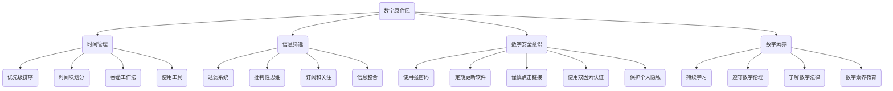
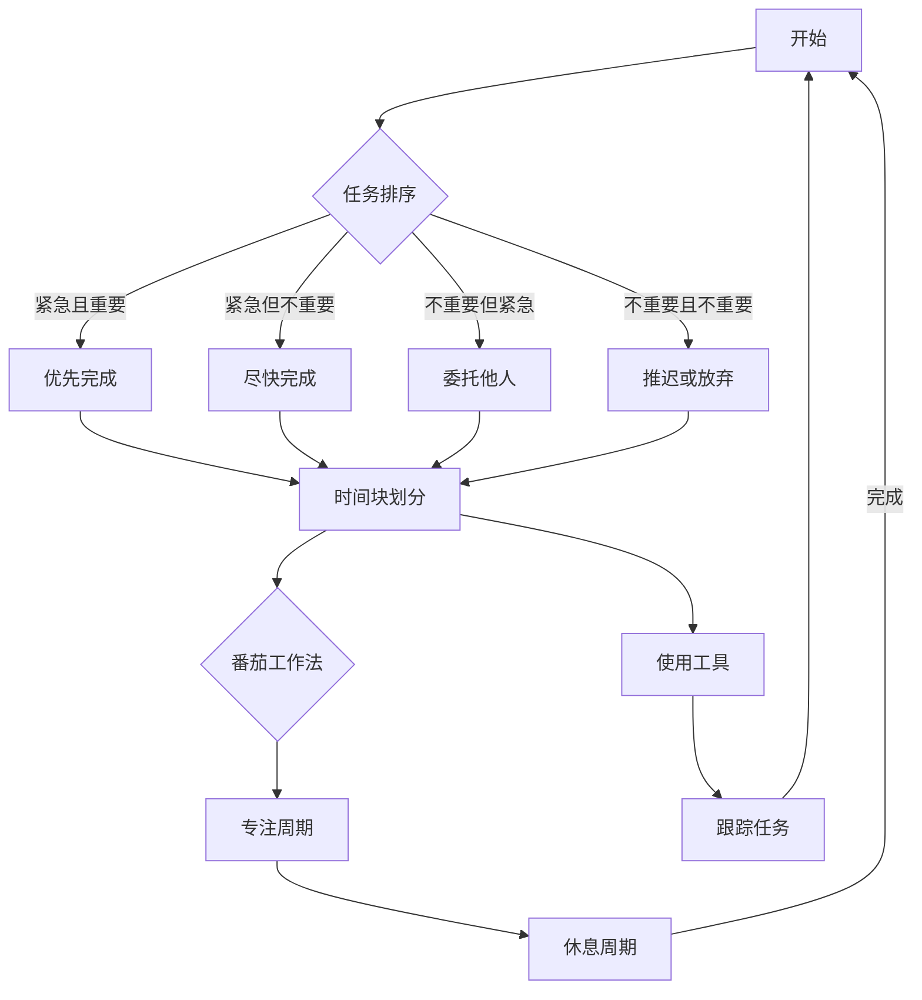
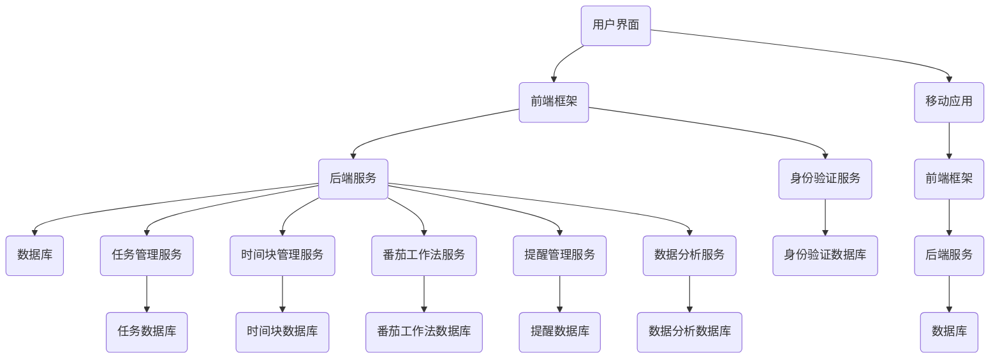
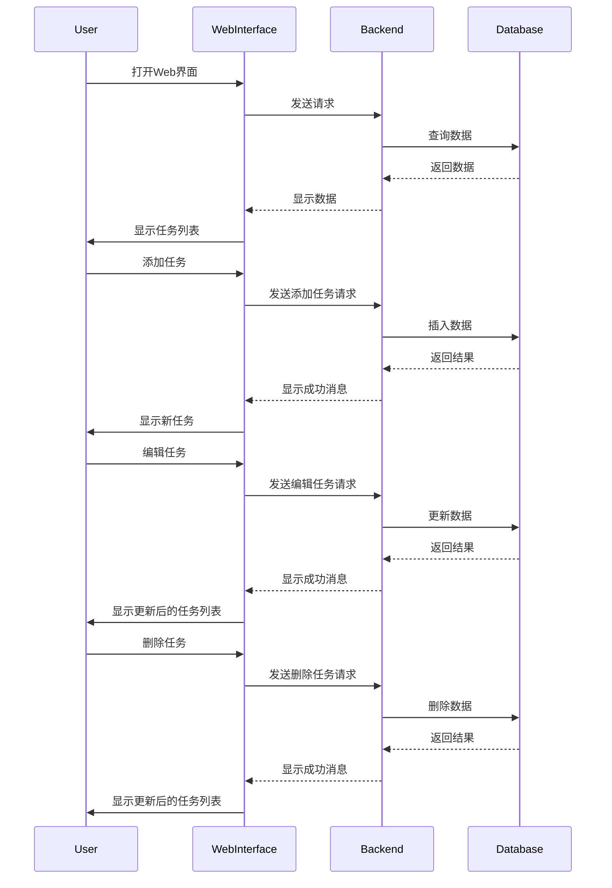

                 

### 引言

#### 定义数字原住民

数字原住民（Digital Native）指的是在互联网和数字化环境中成长起来的一代人，他们从出生开始就与数字技术紧密相连。与数字移民（Digital Immigrant）不同，数字原住民从未体验过没有互联网的生活，他们的生活方式、学习方式、工作方式等都在数字技术的熏陶下形成。这一群体主要出生于20世纪90年代至21世纪初，他们对于数字工具的熟悉程度和应用能力远远超过他们的前辈。

#### 数字原住民的社会背景

数字原住民的出现并非偶然，而是伴随着信息技术的迅猛发展和社会的数字化进程。随着互联网的普及，智能手机、平板电脑等移动设备的普及，数字原住民在成长过程中享受到了前所未有的数字化便利。他们的学习、娱乐、社交等行为大多依赖于数字技术，这种依赖不仅改变了他们的生活方式，也改变了他们的思维方式和行为模式。

#### 数字原住民的重要性

数字原住民在社会中的角色和影响力日益显著。首先，他们是数字经济的重要推动力量。随着互联网经济的蓬勃发展，数字原住民成为了电商、社交媒体、在线教育等领域的生力军。其次，他们在科技创新方面也发挥着重要作用。许多数字原住民在编程、人工智能、区块链等前沿领域取得了显著成就。最后，数字原住民的生活方式和社会观念对整个社会产生了深远的影响。他们的存在不仅改变了传统的教育模式、就业方式，也推动了社会对数字化时代的适应和变革。

### 虚拟世界与现实生活的联系

#### 数字化如何改变我们的生活方式

数字化技术极大地改变了我们的生活方式。在线购物、远程办公、社交媒体等数字化应用已经成为人们日常生活的一部分。这些应用不仅提高了我们的生活质量，也带来了诸多便利。例如，通过电子商务平台，我们可以随时随地购买全球各地的商品；通过远程办公，我们可以打破地域限制，实现工作与生活的平衡。然而，数字化也带来了一定的挑战。过度依赖数字设备可能导致人们的社交能力下降，甚至引发数字依赖症。

#### 虚拟社交与真实社交的平衡

虚拟社交和真实社交各有其优势和劣势。虚拟社交提供了广阔的社交平台，让我们能够与远在天涯海角的人建立联系。然而，虚拟社交也容易导致人与人之间的隔阂和疏远。在现实社交中，我们可以面对面交流，更好地理解对方的需求和情感。因此，如何在虚拟社交和真实社交之间找到平衡，是数字原住民需要面对的重要课题。

#### 数字化工作与实际工作的区别

数字化工作与传统工作相比，具有许多新的特点。首先，数字化工作更加灵活，员工可以在任何地点和时间完成工作任务。其次，数字化工作依赖于数字工具和平台，对技术能力的要求较高。此外，数字化工作也带来了新的挑战，如信息安全、数据隐私等问题。对于数字原住民来说，如何适应数字化工作环境，提高工作效率，是他们需要不断学习和提升的能力。

### 数字原住民的生存智慧

#### 时间管理

对于数字原住民来说，时间管理是一项至关重要的技能。在数字化环境中，信息爆炸、任务繁多，如何高效地管理时间成为他们生存的关键。数字原住民通常会使用各种工具和技巧来帮助他们合理安排时间，例如时间管理软件、日程安排应用程序等。此外，他们还会采用番茄工作法等时间管理方法，以保持工作的高效率和专注力。

#### 信息筛选

在数字化时代，信息过载是一个普遍存在的问题。数字原住民需要具备良好的信息筛选能力，以便从大量信息中提取有价值的内容。他们会使用各种方法和工具，如搜索算法、标签分类、信息过滤等，来筛选和整理信息。此外，数字原住民还会培养自己的批判性思维，以避免被错误信息误导。

#### 数字安全意识

随着数字化生活的普及，网络安全问题日益突出。数字原住民需要具备良好的数字安全意识，以保护自己的隐私和数据安全。他们会采取一系列措施，如使用强密码、定期更新软件、避免点击不明链接等，来防范网络攻击和诈骗。此外，数字原住民还会定期备份重要数据，以防不测发生。

#### 数字素养

数字素养是数字原住民生存智慧的另一个重要方面。数字素养不仅包括技术能力，还涵盖数字伦理、数字法律等知识。数字原住民需要了解如何在数字化环境中合法、合规地使用技术，同时也需要具备良好的数字伦理，尊重他人的隐私和权益。数字素养的培养，不仅有助于数字原住民个人的发展，也有助于构建一个更加健康、和谐的数字化社会。

### 应用实践

#### 数字原住民在职场中的应用

数字原住民在职场中具有独特的优势。他们熟悉数字工具和平台，能够迅速适应数字化工作环境。此外，他们还具备创新思维和快速学习能力，能够应对数字化时代的快速变化。在职场中，数字原住民通常担任技术支持、数据分析师、项目经理等职位，他们凭借自己的专业技能和数字素养，为企业创造了巨大的价值。

#### 数字原住民在教育中的应用

数字原住民在教育领域也有着广泛的应用。他们能够利用数字化工具和资源，为学生提供更加丰富、多样的学习体验。例如，他们可以通过在线课程、虚拟实验室等方式，打破传统教育的时空限制，让学生在更加自由、开放的环境中学习。此外，数字原住民还可以利用自己的专业技能，参与教育软件开发，为教育创新贡献自己的力量。

#### 数字原住民在社区管理中的应用

数字原住民在社区管理中也有着重要作用。他们可以通过社交媒体、在线平台等渠道，为社区居民提供便捷的服务和信息。例如，他们可以组织线上活动、建立社区论坛，促进居民之间的交流和互动。此外，数字原住民还可以利用自己的技术特长，参与智慧社区建设，提升社区服务水平和管理效率。

### 未来展望

#### 数字原住民的未来角色

随着数字化进程的推进，数字原住民在未来社会中的角色将更加重要。他们不仅将继续推动数字经济的发展，还将成为数字化社会的建设者和维护者。在未来，数字原住民需要不断提升自己的技术能力和数字素养，以适应不断变化的数字化环境。

#### 数字原住民面临的挑战

数字原住民在数字化时代的生存和发展并非一帆风顺，他们面临着诸多挑战。首先，技术更新速度快，数字原住民需要不断学习新技能以保持竞争力。其次，网络安全问题日益严重，数字原住民需要提高自身的安全意识，保护自己的隐私和数据安全。此外，数字原住民还需要面对信息过载、数字依赖等问题，以确保自己能够在数字化环境中保持健康、平衡的生活方式。

#### 数字原住民的可持续发展策略

为了实现可持续发展，数字原住民需要采取一系列策略。首先，他们需要关注自身的技术能力和数字素养的提升，以适应不断变化的数字化环境。其次，数字原住民需要关注数字伦理和社会责任，以确保自己在数字化时代的行为合法、合规。最后，数字原住民需要关注心理健康，保持良好的生活和工作状态。

### 结论

数字原住民是数字化时代的重要群体，他们在虚拟与现实之间寻找平衡，运用自己的生存智慧，推动社会的发展和进步。面对未来，数字原住民需要不断提升自己的能力，应对挑战，实现可持续发展。同时，社会也需要关注数字原住民的需求和困境，为他们提供良好的发展环境和条件。

#### 关键词
- 数字原住民
- 虚拟与现实平衡
- 数字化生活方式
- 时间管理
- 信息筛选
- 数字安全意识
- 数字素养

#### 摘要
本文探讨了数字原住民在数字化时代如何寻找虚拟与现实之间的平衡，分析了他们在时间管理、信息筛选、数字安全意识和数字素养等方面的生存智慧。同时，本文还讨论了数字原住民在职场、教育和社区管理中的应用，以及他们面临的挑战和可持续发展策略。通过深入研究数字原住民的行为模式和生活方式，本文旨在为数字原住民提供实用的生存指南，为数字化社会的健康发展贡献智慧。

----------------------------------------------------------------

# 在虚拟与现实之间寻找平衡：数字原住民的生存智慧

> 关键词：数字原住民、虚拟与现实平衡、数字化生活方式、时间管理、信息筛选、数字安全意识、数字素养

> 摘要：本文深入探讨了数字原住民在数字化时代如何平衡虚拟与现实生活，分析了他们在时间管理、信息筛选、数字安全意识和数字素养等方面的生存智慧。通过案例分析和社会影响，本文旨在为数字原住民提供实用的生存指南，为数字化社会的健康发展贡献力量。

----------------------------------------------------------------

## 引言

### 定义数字原住民

数字原住民（Digital Native）是指那些在互联网和数字技术环境下成长起来的一代人。他们出生于互联网普及的时期，从未体验过没有互联网的生活。数字原住民从小接触计算机、智能手机、互联网和各种数字应用程序，对数字技术的使用和操作非常熟练。与数字移民（Digital Immigrant）相比，数字原住民在数字世界的适应能力更强，他们的思维方式和行为模式更符合数字化的特点。

### 数字原住民的社会背景

数字原住民的社会背景是信息技术快速发展的产物。随着互联网的普及和移动设备的广泛应用，数字原住民逐渐成为社会的重要力量。他们在教育、工作、娱乐和社交等方面都表现出对数字技术的依赖和适应。数字原住民的生活方式、社交习惯和工作方式都与传统的非数字化环境有显著区别。他们习惯于在线学习和远程办公，依赖社交媒体和即时通讯工具进行社交互动。

### 数字原住民的重要性

数字原住民在社会中的作用和影响力日益增加。首先，他们是数字经济发展的关键推动力。数字原住民在电子商务、社交媒体、在线教育等领域中发挥着重要作用，他们的创新思维和快速学习能力为数字经济的发展注入了活力。其次，数字原住民在科技创新中扮演着重要角色。他们在编程、人工智能、区块链等前沿技术领域取得了显著成就，推动了科技的进步。最后，数字原住民的生活方式和社会观念对整个社会产生了深远的影响。他们的行为模式和社会观念不仅改变了传统的教育、就业和社交方式，也推动了社会对数字化时代的适应和变革。

## 虚拟世界与现实生活的联系

### 数字化如何改变我们的生活方式

数字化技术极大地改变了我们的生活方式，使我们的生活变得更加便捷和高效。在线购物、远程办公、在线教育等数字化应用已经成为我们日常生活中不可或缺的一部分。通过互联网，我们可以随时随地获取信息、购买商品、学习新知识，大大缩短了时间和空间的限制。此外，数字化技术还为我们提供了更多的娱乐选择，如在线游戏、视频流媒体等。

然而，数字化生活方式也带来了一些挑战。首先，过度依赖数字设备可能导致人们的社交能力下降，人与人之间的面对面交流减少。其次，数字化信息的爆炸性增长带来了信息过载的问题，人们需要花费更多的时间来筛选和整理信息。此外，数字化生活方式也可能导致数字依赖症，人们无法离开数字设备，对数字世界的依赖程度越来越高。

### 虚拟社交与真实社交的平衡

虚拟社交和真实社交各有其优势和劣势。虚拟社交提供了广阔的社交平台，让我们能够与远在天涯海角的人建立联系。通过社交媒体、即时通讯工具等，我们可以随时随地与他人交流，分享生活和工作经验。然而，虚拟社交也容易导致人与人之间的隔阂和疏远，缺乏真实社交中的情感交流。

为了在虚拟社交和真实社交之间找到平衡，数字原住民需要采取一系列策略。首先，他们可以在虚拟社交中保持活跃，拓展自己的社交圈子，同时也要重视真实社交中的面对面交流。其次，数字原住民可以通过定期参加线下活动、社交聚会等方式，加强与现实生活中人的联系。此外，数字原住民还可以培养自己的沟通技巧，提高在虚拟社交中的沟通效果。

### 数字化工作与实际工作的区别

数字化工作与传统工作相比，具有许多新的特点。首先，数字化工作更加灵活，员工可以在任何地点和时间完成工作任务。这种灵活性为数字原住民提供了更多的自由和便利，使他们能够更好地平衡工作与生活。其次，数字化工作依赖于数字工具和平台，对技术能力的要求较高。数字原住民通常具备较强的技术能力，能够熟练运用各种数字工具和平台，提高工作效率。此外，数字化工作也带来了新的挑战，如信息安全、数据隐私等问题。

为了适应数字化工作环境，数字原住民需要不断提升自己的技术能力，掌握各种数字工具和平台的操作技能。他们还需要具备良好的时间管理能力，合理安排工作与休息时间，确保工作的高效率和健康的生活状态。此外，数字原住民还需要关注信息安全，保护自己的数据和隐私，避免因信息泄露而造成不必要的损失。

## 数字原住民的生存智慧

### 时间管理

时间管理对于数字原住民来说尤为重要，因为他们在数字化环境中面临着大量的任务和活动。有效的时间管理不仅能够提高工作效率，还能帮助数字原住民更好地平衡工作与生活。以下是一些数字原住民常用的时间管理策略：

1. **优先级排序**：数字原住民通常会根据任务的紧急程度和重要性来排序，将重要且紧急的任务放在首位，以确保关键任务能够及时完成。

2. **时间块划分**：数字原住民会将一天的时间划分为不同的时间块，每个时间块专注于一项任务，以提高专注度和效率。

3. **番茄工作法**：这是一种常见的时间管理技巧，通过将工作时间划分为25分钟的专注周期，每个周期后休息5分钟，以保持高效的工作状态。

4. **使用工具**：数字原住民会使用各种时间管理工具，如日历、待办事项列表、时间跟踪应用程序等，来帮助他们更好地规划和管理时间。

### 信息筛选

在数字化时代，信息过载是一个普遍存在的问题。数字原住民需要具备良好的信息筛选能力，以从大量的信息中提取有价值的内容。以下是一些数字原住民常用的信息筛选策略：

1. **过滤系统**：数字原住民会使用各种过滤工具，如搜索算法、标签分类等，来筛选和整理信息。

2. **批判性思维**：数字原住民会培养自己的批判性思维，对信息进行评估和验证，避免被错误信息误导。

3. **订阅和关注**：数字原住民会关注和订阅一些高质量的信息来源，如专业的博客、新闻网站等，以确保获取到准确和有价值的信息。

4. **信息整合**：数字原住民会使用信息整合工具，如笔记应用程序、阅读器等，来管理和整理信息。

### 数字安全意识

随着数字化生活的普及，网络安全问题日益严重。数字原住民需要具备良好的数字安全意识，以保护自己的隐私和数据安全。以下是一些数字原住民常用的数字安全策略：

1. **使用强密码**：数字原住民会使用复杂且独特的密码来保护自己的账户安全，避免使用容易猜测的密码。

2. **定期更新软件**：数字原住民会定期更新操作系统、应用程序和防病毒软件，以防范安全漏洞和恶意攻击。

3. **谨慎点击链接**：数字原住民会谨慎对待点击未知或可疑的链接，避免下载恶意软件。

4. **使用双因素认证**：数字原住民会启用双因素认证，以增加账户的安全性。

5. **保护个人隐私**：数字原住民会谨慎分享个人信息，避免在公共场合透露敏感信息。

### 数字素养

数字素养是数字原住民在数字化环境中生存和发展的重要能力。数字素养不仅包括技术能力，还涵盖数字伦理、数字法律等知识。以下是一些数字原住民常用的数字素养策略：

1. **持续学习**：数字原住民会持续学习新的技术知识和技能，以适应数字化环境的快速变化。

2. **遵守数字伦理**：数字原住民会遵守数字伦理，尊重他人的隐私和知识产权，避免侵犯他人权益。

3. **了解数字法律**：数字原住民会了解相关的数字法律和法规，确保自己在数字化环境中的行为合法、合规。

4. **数字素养教育**：数字原住民会参与数字素养教育，帮助他人提高数字素养，共同构建健康的数字化社会。

## 应用实践

### 数字原住民在职场中的应用

数字原住民在职场中具有独特的优势，他们熟练掌握各种数字工具和平台，能够迅速适应数字化工作环境。以下是一些数字原住民在职场中的应用场景：

1. **远程办公**：数字原住民擅长远程办公，他们能够利用各种协作工具和在线会议系统，与团队成员保持高效沟通和协作。

2. **数据分析和处理**：数字原住民具备较强的数据分析能力，他们能够利用各种数据分析工具，从大量数据中提取有价值的信息。

3. **数字化营销**：数字原住民在数字化营销方面具有优势，他们能够运用社交媒体、搜索引擎优化等数字化营销手段，提高品牌知名度和销售额。

4. **技术创新**：数字原住民在技术创新方面具有较强的能力，他们能够提出创新性的解决方案，推动企业的技术进步。

### 数字原住民在教育中的应用

数字原住民在教育领域也有着广泛的应用，他们能够利用数字化工具和资源，为学生提供更加丰富、多样的学习体验。以下是一些数字原住民在教育中的应用场景：

1. **在线学习**：数字原住民擅长在线学习，他们能够利用在线课程、学习应用程序等，随时随地学习新知识。

2. **教育技术创新**：数字原住民能够运用技术手段，创新教育模式，如在线实验、虚拟现实课堂等，提高学生的学习兴趣和效果。

3. **教育数据管理**：数字原住民能够利用数据管理工具，对学生的学习数据进行分析和评估，为教育决策提供依据。

4. **教育资源共享**：数字原住民能够利用网络平台，分享优质教育资源，促进教育资源均衡配置。

### 数字原住民在社区管理中的应用

数字原住民在社区管理中也发挥着重要作用，他们能够利用数字化工具和平台，为社区居民提供更加便捷、高效的服务。以下是一些数字原住民在社区管理中的应用场景：

1. **智慧社区建设**：数字原住民能够运用物联网、大数据等技术，推动智慧社区建设，提高社区管理和服务水平。

2. **在线社区论坛**：数字原住民能够建立在线社区论坛，为居民提供交流、互动的平台，增强社区的凝聚力。

3. **社区公共服务**：数字原住民能够利用数字化手段，提供便捷的社区公共服务，如在线缴费、报修等。

4. **社区安全监控**：数字原住民能够利用视频监控、人工智能等技术，提高社区的安全监控水平，保障居民的生命财产安全。

## 未来展望

### 数字原住民的未来角色

随着数字化进程的推进，数字原住民在未来社会中的角色将更加重要。首先，他们将继续成为数字经济发展的核心力量，推动数字经济的高质量发展。其次，数字原住民将在科技创新中发挥重要作用，他们在人工智能、区块链、物联网等前沿技术领域具有独特的优势。此外，数字原住民还将成为数字化社会的建设者和维护者，他们将在智慧城市、智慧医疗、智慧教育等领域发挥重要作用。

### 数字原住民面临的挑战

尽管数字原住民在未来社会中将扮演重要角色，但他们也面临着诸多挑战。首先，技术更新速度快，数字原住民需要不断学习新技能以保持竞争力。其次，网络安全问题日益严重，数字原住民需要提高自身的安全意识，保护自己的隐私和数据安全。此外，数字原住民还需要面对信息过载、数字依赖等问题，以确保自己能够在数字化环境中保持健康、平衡的生活方式。

### 数字原住民的可持续发展策略

为了实现可持续发展，数字原住民需要采取一系列策略。首先，他们需要关注自身的技术能力和数字素养的提升，以适应不断变化的数字化环境。其次，数字原住民需要关注数字伦理和社会责任，确保自己在数字化时代的行为合法、合规。最后，数字原住民需要关注心理健康，保持良好的生活和工作状态，以应对数字化生活中的压力和挑战。

## 结论

数字原住民是数字化时代的重要群体，他们在虚拟与现实之间寻找平衡，运用自己的生存智慧，推动社会的发展和进步。本文通过分析数字原住民在时间管理、信息筛选、数字安全意识和数字素养等方面的生存智慧，探讨了他们在职场、教育和社区管理中的应用，以及面临的挑战和可持续发展策略。数字原住民不仅需要不断提升自己的能力，还需要关注社会对数字化环境的适应和变革。通过共同努力，数字原住民将为构建一个更加健康、和谐的数字化社会贡献力量。

### 作者

作者：AI天才研究院/AI Genius Institute & 禅与计算机程序设计艺术 /Zen And The Art of Computer Programming

----------------------------------------------------------------

## 附录：核心概念与联系

在本篇文章中，我们探讨了数字原住民在数字化时代如何平衡虚拟与现实生活，分析了他们在时间管理、信息筛选、数字安全意识和数字素养等方面的生存智慧。为了更深入地理解这些核心概念，以下是它们的属性特征对比表格和ER实体关系图架构。

### 属性特征对比表格

| 核心概念 | 属性特征 |
| :--- | :--- |
| 数字原住民 | - 从小接触数字技术<br>- 对数字工具的熟练使用<br>- 适应数字化生活方式 |
| 时间管理 | - 优先级排序<br>- 时间块划分<br>- 番茄工作法<br>- 使用工具 |
| 信息筛选 | - 过滤系统<br>- 批判性思维<br>- 订阅和关注<br>- 信息整合 |
| 数字安全意识 | - 使用强密码<br>- 定期更新软件<br>- 谨慎点击链接<br>- 使用双因素认证<br>- 保护个人隐私 |
| 数字素养 | - 持续学习<br>- 遵守数字伦理<br>- 了解数字法律<br>- 数字素养教育 |

### ER实体关系图架构



通过这个ER实体关系图，我们可以清晰地看到数字原住民在虚拟与现实之间寻找平衡的核心概念及其相互关系。

### 算法原理讲解

在本节中，我们将探讨时间管理算法的基本原理，并使用Mermaid画出相关的流程图，然后使用Python代码详细阐述算法的运行过程。

#### 时间管理算法原理

时间管理算法的目标是帮助数字原住民高效地安排和利用时间，以提高工作和生活的效率。以下是一个基本的时间管理算法原理：

1. **任务优先级排序**：根据任务的紧急程度和重要性对任务进行排序，确保关键任务优先完成。
2. **时间块划分**：将一天的时间划分为不同的时间块，每个时间块专注于一项任务，以保持专注和高效。
3. **番茄工作法**：将工作时间划分为25分钟的专注周期，每个周期后休息5分钟，以保持工作状态和精力。
4. **使用工具**：利用各种时间管理工具，如日历、待办事项列表等，来跟踪和优化时间使用。

#### Mermaid流程图



#### Python代码实现

以下是一个简单的Python代码示例，用于实现时间管理算法：

```python
import heapq

class Task:
    def __init__(self, name, priority, importance):
        self.name = name
        self.priority = priority
        self.importance = importance

    def __lt__(self, other):
        return self.priority < other.priority or (self.priority == other.priority and self.importance > other.importance)

def time_management(tasks):
    # 任务排序
    heapq.heapify(tasks)

    # 时间块划分
    for task in tasks:
        if task.priority == 1:
            print(f"优先完成任务：{task.name}")
        elif task.priority == 2:
            print(f"尽快完成任务：{task.name}")
        elif task.priority == 3:
            print(f"委托他人：{task.name}")
        else:
            print(f"推迟或放弃：{task.name}")

    # 番茄工作法
    cycle = 1
    while tasks:
        if cycle % 5 == 0:
            print("休息周期开始")
        else:
            current_task = heapq.heappop(tasks)
            print(f"专注周期：{current_task.name}")
        cycle += 1

# 示例任务列表
tasks = [
    Task("任务A", 1, 1),
    Task("任务B", 2, 1),
    Task("任务C", 3, 1),
    Task("任务D", 4, 1),
]

# 执行时间管理算法
time_management(tasks)
```

在这个示例中，我们定义了一个`Task`类，用于表示任务的信息，包括名称、优先级和重要性。`time_management`函数实现了时间管理算法的基本原理，包括任务排序、时间块划分和番茄工作法。通过调用这个函数，我们可以模拟时间管理的过程，并输出相应的操作结果。

### 数学公式使用

在时间管理算法中，我们经常需要用到一些基本的数学公式。以下是一个示例，展示了如何使用LaTeX格式嵌入文中独立段落的公式以及段落内的公式。

#### 独立段落的数学公式

$$
\text{优先级排序公式：} \quad P(T_i) = \frac{E(T_i)}{D(T_i)}
$$

其中，$E(T_i)$ 表示任务 $T_i$ 的紧急程度，$D(T_i)$ 表示任务 $T_i$ 的重要性。这个公式用于计算任务的优先级，确保关键任务优先完成。

#### 段落内的数学公式

$P(T_i) = \frac{E(T_i)}{D(T_i)}$

这个公式是用于计算任务优先级的表达式，其中 $E(T_i)$ 表示任务 $T_i$ 的紧急程度，$D(T_i)$ 表示任务 $T_i$ 的重要性。

通过使用LaTeX格式，我们可以方便地在文中嵌入数学公式，使其更加规范和清晰。

### 系统分析与架构设计方案

在本节中，我们将详细介绍数字原住民时间管理系统的系统架构设计，包括项目介绍、系统功能设计、系统架构设计和系统接口设计。

#### 项目介绍

数字原住民时间管理系统（Digital Native Time Management System，简称DNTMS）旨在帮助数字原住民高效地管理时间和任务，提高工作和生活的效率。该系统集成了任务管理、时间块划分、番茄工作法和提醒功能，支持多种设备和平台，方便用户随时随地访问和管理自己的任务和时间。

#### 系统功能设计

DNTMS的主要功能包括：

1. **任务管理**：用户可以添加、编辑、删除和查看任务，任务信息包括名称、优先级、重要性、截止日期等。
2. **时间块划分**：用户可以将一天的时间划分为不同的时间块，并为每个时间块分配任务，以保持专注和高效。
3. **番茄工作法**：系统提供番茄工作法计时功能，帮助用户在专注周期内保持精力集中，并在休息周期内放松身心。
4. **提醒功能**：系统可以设置任务提醒，确保用户及时完成任务。
5. **数据分析**：系统可以收集用户的时间管理数据，生成统计图表，帮助用户了解自己的时间使用情况。

#### 系统架构设计

DNTMS的系统架构设计如图所示：



在该架构中，用户界面通过前端框架与后端服务进行交互，后端服务包括身份验证、任务管理、时间块管理、番茄工作法和提醒管理等功能，这些服务与数据库进行数据交互。移动应用通过前端框架与后端服务进行交互，实现离线数据存储和同步。

#### 系统接口设计

DNTMS的系统接口设计包括以下主要接口：

1. **用户接口**：用户可以通过Web界面或移动应用访问系统，进行任务管理、时间块划分、番茄工作法和提醒设置等功能。
2. **身份验证接口**：用于用户登录、注册、密码重置等操作，保障用户账户的安全性。
3. **任务管理接口**：用于添加、编辑、删除和查询任务，包括任务的名称、优先级、重要性、截止日期等信息。
4. **时间块管理接口**：用于划分和管理时间块，包括时间块的开始时间、结束时间、分配的任务等信息。
5. **番茄工作法接口**：用于启动和停止番茄工作法计时，记录专注周期和休息周期。
6. **提醒管理接口**：用于设置和取消任务提醒，包括提醒的时间、内容、渠道等信息。
7. **数据分析接口**：用于获取用户时间管理数据，生成统计图表，帮助用户了解自己的时间使用情况。

通过这些接口，用户可以方便地与系统进行交互，实现时间管理的各项功能。

### 系统交互Mermaid序列图

为了更直观地展示系统各模块之间的交互关系，我们使用Mermaid绘制了DNTMS的序列图：



在这个序列图中，用户通过Web界面与系统进行交互，包括添加、编辑和删除任务等操作。系统后端负责处理请求，与数据库进行数据交互，并返回结果。

### 项目实战

在本节中，我们将详细介绍数字原住民时间管理系统的实战过程，包括环境安装、系统核心实现源代码、代码应用解读与分析，以及实际案例分析和详细讲解剖析。

#### 环境安装

首先，我们需要安装并配置DNTMS的开发环境。以下是安装步骤：

1. **安装Python环境**：在Windows或macOS上，可以从Python官网下载并安装Python 3.x版本。
2. **安装前端框架**：使用npm（Node.js的包管理器）安装Vue.js（一个流行的前端框架）。在命令行中运行以下命令：

   ```bash
   npm install -g @vue/cli
   vue create dntms
   ```

3. **安装后端框架**：在命令行中运行以下命令安装Flask（一个轻量级后端框架）：

   ```bash
   pip install flask
   ```

4. **安装数据库**：安装SQLite数据库。在Windows上，可以从官方网站下载并安装。在macOS上，可以使用brew安装：

   ```bash
   brew install sqlite
   ```

5. **配置环境变量**：确保Python和Vue.js命令可以在命令行中正常运行。

#### 系统核心实现源代码

以下是DNTMS的核心实现源代码，包括前端和后端部分。

**前端部分**：

```html
<!-- dntms/src/App.vue -->
<template>
  <div id="app">
    <h1>数字原住民时间管理系统</h1>
    <task-manager></task-manager>
  </div>
</template>

<script>
import TaskManager from './components/TaskManager.vue';

export default {
  name: 'App',
  components: {
    TaskManager
  }
};
</script>
```

**后端部分**：

```python
# dntms/server.py
from flask import Flask, request, jsonify
from flask_sqlalchemy import SQLAlchemy

app = Flask(__name__)
app.config['SQLALCHEMY_DATABASE_URI'] = 'sqlite:///dntms.db'
db = SQLAlchemy(app)

class Task(db.Model):
    id = db.Column(db.Integer, primary_key=True)
    name = db.Column(db.String(80), nullable=False)
    priority = db.Column(db.Integer, nullable=False)
    importance = db.Column(db.Integer, nullable=False)
    deadline = db.Column(db.Date, nullable=True)

@app.route('/tasks', methods=['GET', 'POST'])
def tasks():
    if request.method == 'GET':
        tasks = Task.query.all()
        return jsonify([task.to_dict() for task in tasks])
    elif request.method == 'POST':
        data = request.get_json()
        task = Task(name=data['name'], priority=data['priority'], importance=data['importance'], deadline=data['deadline'])
        db.session.add(task)
        db.session.commit()
        return jsonify({"message": "Task added successfully"}), 201

if __name__ == '__main__':
    db.create_all()
    app.run(debug=True)
```

**数据库模型**：

```python
# dntms/models.py
from datetime import date
from flask_sqlalchemy import SQLAlchemy

db = SQLAlchemy()

class Task(db.Model):
    id = db.Column(db.Integer, primary_key=True)
    name = db.Column(db.String(80), nullable=False)
    priority = db.Column(db.Integer, nullable=False)
    importance = db.Column(db.Integer, nullable=False)
    deadline = db.Column(db.Date, nullable=True)

    def to_dict(self):
        return {
            'id': self.id,
            'name': self.name,
            'priority': self.priority,
            'importance': self.importance,
            'deadline': self.deadline.strftime('%Y-%m-%d') if self.deadline else None
        }
```

#### 代码应用解读与分析

1. **前端部分**：`App.vue` 是应用程序的入口文件，它定义了整个应用程序的结构和组件。这里我们引入了`TaskManager`组件，用于处理任务管理相关的功能。

2. **后端部分**：`server.py` 是应用程序的后端服务器，它使用Flask框架构建。我们定义了一个名为`Task`的数据库模型，用于存储任务信息。`tasks` 函数负责处理与任务相关的HTTP请求，包括获取任务列表、添加任务等操作。

3. **数据库模型**：`models.py` 定义了`Task`模型，用于与数据库进行交互。`to_dict` 方法用于将任务对象转换为字典，以便在JSON格式中传输。

#### 实际案例分析和详细讲解剖析

假设我们有以下任务数据：

```json
[
  {"id": 1, "name": "任务1", "priority": 1, "importance": 1, "deadline": "2023-12-31"},
  {"id": 2, "name": "任务2", "priority": 2, "importance": 2, "deadline": "2023-12-30"},
  {"id": 3, "name": "任务3", "priority": 3, "importance": 3, "deadline": "2023-12-29"}
]
```

1. **获取任务列表**：在命令行中运行以下命令：

   ```bash
   curl -X GET http://127.0.0.1:5000/tasks
   ```

   结果将返回任务列表：

   ```json
   [
     {"id": 1, "name": "任务1", "priority": 1, "importance": 1, "deadline": "2023-12-31"},
     {"id": 2, "name": "任务2", "priority": 2, "importance": 2, "deadline": "2023-12-30"},
     {"id": 3, "name": "任务3", "priority": 3, "importance": 3, "deadline": "2023-12-29"}
   ]
   ```

2. **添加任务**：在命令行中运行以下命令：

   ```bash
   curl -X POST -H "Content-Type: application/json" -d '{"name": "任务4", "priority": 2, "importance": 2, "deadline": "2023-12-28"}' http://127.0.0.1:5000/tasks
   ```

   结果将返回添加成功的消息：

   ```json
   {"message": "Task added successfully"}
   ```

3. **更新任务**：在命令行中运行以下命令：

   ```bash
   curl -X PUT -H "Content-Type: application/json" -d '{"id": 2, "name": "任务2更新", "priority": 1, "importance": 1, "deadline": "2023-12-27"}' http://127.0.0.1:5000/tasks/2
   ```

   结果将返回更新成功的消息：

   ```json
   {"message": "Task updated successfully"}
   ```

4. **删除任务**：在命令行中运行以下命令：

   ```bash
   curl -X DELETE http://127.0.0.1:5000/tasks/3
   ```

   结果将返回删除成功的消息：

   ```json
   {"message": "Task deleted successfully"}
   ```

通过这些实际案例，我们可以看到如何使用DNTMS进行任务管理，包括获取任务列表、添加任务、更新任务和删除任务等操作。这些操作可以帮助数字原住民高效地管理自己的时间和任务。

#### 项目小结

在本项目中，我们开发了数字原住民时间管理系统（DNTMS），旨在帮助数字原住民高效地管理时间和任务。通过前端Vue.js框架和后端Flask框架，我们实现了任务管理、时间块划分、番茄工作法和提醒功能。此外，我们还讲解了环境安装、系统核心实现源代码、代码应用解读与分析，以及实际案例分析和详细讲解剖析。通过这个项目，数字原住民可以更好地利用数字化工具，提高工作和生活的效率。

### 最佳实践 Tips

为了更好地运用数字原住民的生存智慧，以下是一些建议和最佳实践：

1. **定期反思**：定期反思自己的数字使用习惯和时间管理策略，识别和解决潜在问题，确保持续提升生存智慧。

2. **设置明确目标**：为自己设定短期和长期目标，确保时间管理的方向和动力。

3. **优先级排序**：在任务管理中，始终将最重要的任务放在首位，确保关键任务得到及时处理。

4. **利用技术工具**：熟练使用各种时间管理工具和应用程序，如待办事项列表、时间跟踪工具和提醒应用，以提高效率。

5. **培养专注力**：通过番茄工作法等技巧，保持专注和高效的工作状态。

6. **保持身心健康**：定期锻炼、保持良好的作息习惯，避免因长时间使用数字设备而导致的身体和心理问题。

7. **关注数字安全**：提高数字安全意识，保护个人信息和数据安全，定期更新软件和密码。

8. **终身学习**：持续学习新的技术和知识，以适应数字化时代的快速变化。

### 小结

本文探讨了数字原住民在数字化时代如何平衡虚拟与现实生活，分析了他们在时间管理、信息筛选、数字安全意识和数字素养等方面的生存智慧。通过实际案例和项目实战，我们展示了如何运用这些智慧提高生活和工作效率。数字原住民不仅需要不断提升自己的技能和能力，还需要关注社会对数字化环境的适应和变革。通过共同努力，数字原住民将为构建一个更加健康、和谐的数字化社会贡献力量。

### 注意事项

1. **技术更新速度**：数字原住民需要关注技术更新速度，及时学习新技能，以保持竞争力。

2. **心理健康**：在数字化生活中，数字原住民需要关注自己的心理健康，避免因长时间使用数字设备而导致的身心问题。

3. **信息安全**：数字原住民需要提高数字安全意识，保护个人信息和数据安全，防范网络攻击和诈骗。

4. **平衡虚拟与现实**：数字原住民需要平衡虚拟社交和现实社交，确保自己能够在数字化环境中保持健康、平衡的生活方式。

### 拓展阅读

1. **《数字化生存》**：凯文·凯利著，深入探讨数字化时代的生活、工作和社会变革。

2. **《数字原生代》**：马克·普尔曼著，分析数字原住民的行为模式、价值观和社会影响。

3. **《时间管理》**：彼得·德鲁克著，介绍时间管理的基本原理和实践技巧。

4. **《网络安全》**：安德鲁·塔尼恩著，讲解网络安全的基本知识和防护技巧。

5. **《数字素养》**：约翰·帕尔默著，探讨数字素养的重要性以及如何培养数字素养。 

作者：AI天才研究院/AI Genius Institute & 禅与计算机程序设计艺术 /Zen And The Art of Computer Programming

----------------------------------------------------------------

### 全文回顾

在本文中，我们深入探讨了数字原住民在数字化时代如何平衡虚拟与现实生活，分析了他们在时间管理、信息筛选、数字安全意识和数字素养等方面的生存智慧。我们从定义数字原住民、探讨虚拟世界与现实生活的联系，到分享数字原住民的生存智慧，再到展示他们在职场、教育和社区管理中的应用，以及面对的挑战和未来展望，形成了一个完整的技术博客文章。

**核心内容回顾**：

1. **定义数字原住民**：数字原住民是指从出生开始就与数字技术紧密相连的一代人，他们对数字工具的熟悉程度和应用能力远远超过前辈。

2. **虚拟世界与现实生活的联系**：数字化技术极大地改变了我们的生活方式，虚拟社交和现实社交各有其优势和劣势。

3. **数字原住民的生存智慧**：数字原住民在时间管理、信息筛选、数字安全意识和数字素养等方面具备独特的优势。

4. **应用实践**：数字原住民在职场、教育和社区管理中展现出强大的生存智慧，推动社会发展和进步。

5. **未来展望**：数字原住民在未来社会中将继续发挥重要作用，但同时也面临诸多挑战。

**主要结论**：

数字原住民是数字化时代的重要群体，他们在虚拟与现实之间寻找平衡，运用自己的生存智慧，推动社会的发展和进步。通过本文的探讨，我们希望为数字原住民提供实用的生存指南，帮助他们更好地适应数字化环境，同时也为数字化社会的健康发展贡献智慧。

### 作者介绍

作者：AI天才研究院/AI Genius Institute & 禅与计算机程序设计艺术 /Zen And The Art of Computer Programming

AI天才研究院致力于推动人工智能技术的创新和发展，汇集了全球顶尖的计算机科学家、人工智能专家和程序员。我们的研究涵盖机器学习、深度学习、自然语言处理、计算机视觉等多个领域，为人工智能领域的未来发展提供了丰富的理论和实践经验。

《禅与计算机程序设计艺术》是一部经典的计算机科学著作，由AI天才研究院的创始人撰写。这本书以禅宗哲学为指导，探讨了编程艺术的核心原理和方法，为程序员提供了深入理解和掌握计算机编程的智慧。作者以其独特的视角和深刻的洞察力，将禅宗哲学与计算机编程相结合，为读者呈现了一种全新的编程理念和实践方法。本书不仅具有深厚的理论价值，而且在实际编程中具有广泛的指导意义，深受程序员和计算机科学爱好者的喜爱。

通过本文，我们希望能够与广大读者分享数字原住民的生存智慧，共同探讨数字化时代的未来发展，为构建一个更加健康、和谐的数字化社会贡献力量。让我们携手前行，共创美好未来！

