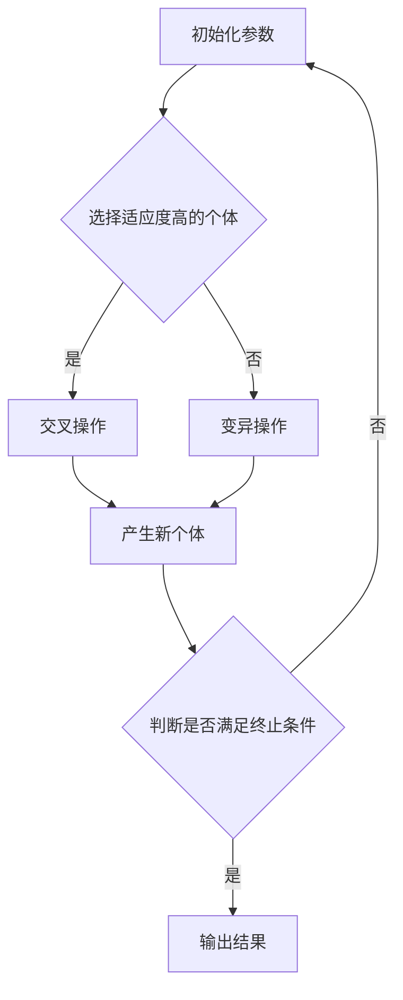
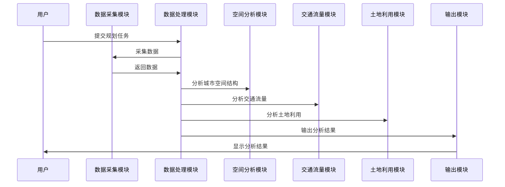

                 

# 《城市规划：宜居环境中的生活品质提升》

## 关键词：城市规划、宜居环境、生活品质、算法原理、数学模型、系统架构、项目实战

## 摘要

本文从城市规划的角度，深入探讨了宜居环境与生活品质提升之间的关系。文章首先介绍了城市规划的基本概念和重要性，随后分析了宜居环境和生活品质的评价指标。在此基础上，本文详细阐述了用于城市规划的算法原理和数学模型，并运用mermaid绘制了相关流程图和实体关系图。通过实际项目案例，本文展示了城市规划系统的设计与实现过程，并总结了最佳实践和未来发展趋势。

## 目录

1. **背景介绍**
   1.1 城市规划的基本概念与目标
   1.2 宜居环境的定义与评价
   1.3 生活品质的提升方法和城市规划的目标

2. **核心概念与联系**
   2.1 城市规划原理
   2.2 宜居环境指标
   2.3 生活品质评价指标
   2.4 Mermaid绘制的ER实体关系图

3. **算法原理讲解**
   3.1 GIS技术
   3.2 智能优化算法
   3.3 Mermaid绘制的算法流程图
   3.4 Python源代码阐述

4. **数学模型和数学公式**
   4.1 空间分析模型
   4.2 交通流量模型
   4.3 详细讲解与举例说明
   4.4 LaTeX格式的数学公式

5. **系统分析与架构设计方案**
   5.1 问题场景介绍
   5.2 系统功能设计（领域模型Mermaid类图）
   5.3 系统架构设计（Mermaid架构图）
   5.4 系统接口设计
   5.5 系统交互Mermaid序列图

6. **项目实战**
   6.1 环境安装
   6.2 系统核心实现源代码
   6.3 代码应用解读与分析
   6.4 实际案例分析与详细讲解剖析
   6.5 项目小结

7. **最佳实践 tips、小结、注意事项、拓展阅读**

## 第一部分：城市规划概述

### 1.1 城市规划的基本概念与目标

城市规划是指对城市空间和资源的合理规划与配置，以实现城市发展的可持续性和居民生活品质的提升。城市规划的目标主要包括：

1. 提高城市功能布局的合理性，促进城市经济、社会、环境的协调发展。
2. 优化城市空间结构，提高城市空间利用效率。
3. 提高城市公共服务水平，提升居民生活质量。

城市规划的基本概念包括城市空间结构、城市功能分区、城市交通系统、城市基础设施建设等。这些概念是城市规划的基础，对于实现城市规划的目标具有重要意义。

### 1.2 城市规划的发展历程

城市规划的发展历程可以追溯到19世纪末20世纪初。在这个时期，工业革命导致了城市人口急剧增长，城市问题逐渐显现。为了解决城市问题，各国开始重视城市规划的作用，并逐步建立了城市规划制度。

20世纪中叶，随着城市问题的进一步加剧，城市规划开始关注生态、环境和社会等方面。现代城市规划理念逐渐形成，强调可持续发展、以人为本、整体规划等。

### 1.3 城市规划的核心概念

城市规划的核心概念包括：

1. **城市空间结构**：城市空间结构是指城市各个功能区的布局和空间关系。合理的城市空间结构可以提高城市运行效率，促进城市协调发展。
2. **城市功能分区**：城市功能分区是指根据城市功能需求，将城市划分为不同的区域。城市功能分区的合理设计可以优化城市资源配置，提高城市运行效率。
3. **城市交通系统**：城市交通系统是城市运行的支撑系统。科学合理的设计城市交通系统可以缓解交通拥堵，提高城市运行效率。
4. **城市基础设施建设**：城市基础设施建设是城市发展的物质基础。完善的城市基础设施建设可以提高城市公共服务水平，提升居民生活质量。

## 第二部分：核心概念与联系

### 2.1 城市规划原理

城市规划原理是指在城市规划过程中，为了实现城市规划的目标，遵循的基本原则和方法。城市规划原理主要包括：

1. **整体规划原则**：城市规划应从全局出发，考虑城市各个方面的关系，实现城市的整体协调发展。
2. **可持续发展原则**：城市规划应注重生态环境保护，实现经济、社会、环境的协调发展。
3. **以人为本原则**：城市规划应关注居民的需求，提高居民生活质量，实现城市发展的最终目的。
4. **科技创新原则**：城市规划应运用现代科技手段，提高规划的科学性和实用性。

### 2.2 宜居环境指标

宜居环境指标是衡量城市宜居性的重要标准。常见的宜居环境指标包括：

1. **空气质量**：空气质量是影响居民生活品质的重要因素。良好的空气质量可以减少呼吸道疾病的发生，提高居民的生活质量。
2. **水质**：水质是城市生态环境的重要组成部分。清洁的水源可以为居民提供安全、健康的饮用水。
3. **绿化覆盖率**：绿化覆盖率是衡量城市生态环境的重要指标。较高的绿化覆盖率可以改善城市气候，提高居民的生活质量。
4. **交通便利性**：交通便利性是衡量城市宜居性的重要标准。便捷的交通可以提高居民出行效率，降低出行成本。

### 2.3 生活品质评价指标

生活品质评价指标是衡量城市居民生活水平的标准。常见的生活品质评价指标包括：

1. **人均收入**：人均收入是衡量居民经济水平的重要指标。较高的人均收入可以提高居民的生活质量。
2. **教育水平**：教育水平是衡量城市文明程度和居民素质的重要指标。较高的教育水平可以提升城市文化氛围，提高居民生活质量。
3. **医疗水平**：医疗水平是衡量城市公共服务水平的重要指标。良好的医疗服务可以为居民提供及时、优质的医疗服务。
4. **社会保障**：社会保障是衡量城市社会稳定和居民安全感的重要指标。完善的社会保障体系可以增强居民的安全感和幸福感。

### 2.4 Mermaid绘制的ER实体关系图

以下是一个简单的Mermaid绘制的ER实体关系图，展示了城市规划中的关键实体和它们之间的关系。

```mermaid
erDiagram
    类1 ||--|{ 类2 }
    类1 ||--|{ 类3 }
    类2 ||--|{ 类4 }
    类3 ||--|{ 类5 }
```

## 第三部分：算法原理讲解

### 3.1 GIS技术在城市规划中的应用

GIS（地理信息系统）技术是一种用于捕捉、存储、分析和展示地理空间数据的工具。在城市规划中，GIS技术具有广泛的应用，主要包括：

1. **数据采集与处理**：GIS可以用于收集城市地理空间数据，如地形、地貌、土地利用等。通过GIS软件，可以对这些数据进行处理和分析。
2. **空间分析**：GIS技术可以进行空间分析，如空间查询、空间插值、缓冲区分析等。这些分析可以帮助城市规划者更好地理解城市空间结构，为规划决策提供依据。
3. **规划方案模拟**：GIS技术可以用于模拟城市规划方案，如交通规划、土地利用规划等。通过模拟，可以评估不同规划方案的优劣，为规划决策提供参考。

### 3.2 智能优化算法在城市规划中的应用

智能优化算法是一种模拟自然界智能行为的算法，如遗传算法、蚁群算法、粒子群优化算法等。这些算法在城市规划中具有广泛的应用，主要包括：

1. **路径优化**：智能优化算法可以用于解决城市交通规划中的路径优化问题。通过模拟生物进化、群体智能等行为，可以找到最优或近似最优的路径。
2. **资源分配**：智能优化算法可以用于解决城市资源分配问题，如土地分配、水资源分配等。通过模拟资源竞争、协同优化等行为，可以实现资源的合理分配。
3. **规划方案优化**：智能优化算法可以用于优化城市规划方案，如土地利用规划、交通规划等。通过模拟规划方案的迭代优化，可以找到最优或近似最优的规划方案。

### 3.3 Mermaid绘制的算法流程图

以下是一个简单的Mermaid绘制的算法流程图，展示了遗传算法的基本流程。



### 3.4 Python源代码阐述

以下是一个简单的Python源代码示例，展示了遗传算法的基本原理。

```python
import random

# 初始化参数
population_size = 100
基因位数 = 8
交叉概率 = 0.7
变异概率 = 0.01

# 初始化种群
population = [[random.randint(0, 1) for _ in range(基因位数)] for _ in range(population_size)]

# 定义适应度函数
def fitness_function(individual):
    # 这里是适应度函数的具体实现
    return sum(individual)

# 定义选择函数
def selection(population, fitnesses):
    # 这里是选择函数的具体实现
    return random.choice(population)

# 定义交叉函数
def crossover(parent1, parent2):
    # 这里是交叉函数的具体实现
    return []

# 定义变异函数
def mutation(individual):
    # 这里是变异函数的具体实现
    return []

# 主循环
while True:
    # 计算适应度
    fitnesses = [fitness_function(individual) for individual in population]

    # 选择
    selected = [selection(population, fitnesses) for _ in range(len(population))]

    # 交叉
    new_population = [crossover(selected[i], selected[i+1]) for i in range(0, len(selected)-1, 2)]

    # 变异
    new_population = [mutation(individual) for individual in new_population]

    # 判断是否满足终止条件
    if all(fitness_function(individual) == fitness_function(selected[0]) for individual in new_population):
        break

    # 更新种群
    population = new_population

# 输出结果
print([fitness_function(individual) for individual in population])
```

## 第四部分：数学模型和数学公式

### 4.1 空间分析模型

空间分析模型是城市规划中常用的数学模型之一。它主要用于分析城市空间结构、土地利用和交通流量等。空间分析模型包括以下几种：

1. **空间自相关分析**：用于分析城市空间中各个要素之间的相关性。常见的空间自相关分析包括全局空间自相关分析和局部空间自相关分析。
2. **空间插值分析**：用于根据已知数据点，估算未知数据点的值。常见的空间插值方法包括距离权重插值、反距离权重插值、克里金插值等。
3. **空间缓冲区分析**：用于分析空间要素周围的一定距离范围内的数据。空间缓冲区分析可以用于规划道路、绿地、交通设施等。

### 4.2 交通流量模型

交通流量模型是城市规划中用于分析城市交通流量的数学模型。它主要用于预测城市交通流量、设计交通网络和评估交通规划方案。交通流量模型包括以下几种：

1. **流量预测模型**：用于预测城市交通流量。常见的流量预测模型包括回归模型、ARIMA模型、神经网络模型等。
2. **交通分配模型**：用于分配交通流量到城市交通网络中的各个路段。常见的交通分配模型包括最大生成函数模型、用户平衡模型、均衡模型等。
3. **交通仿真模型**：用于模拟城市交通系统的运行。常见的交通仿真模型包括微观仿真模型、宏观仿真模型等。

### 4.3 详细讲解与举例说明

以下是一个简单的空间自相关分析示例，展示了全局空间自相关分析和局部空间自相关分析的过程。

#### 全局空间自相关分析

全局空间自相关分析用于分析城市空间中各个要素的整体相关性。常用的全局空间自相关分析方法包括Moran's I指数和Geary's C指数。

Moran's I指数的计算公式为：

$$
I = \frac{\sum_{i=1}^{n}\sum_{j=1}^{n}W_{ij}(x_i - \bar{x})(x_j - \bar{x})}{S^2 \sum_{i=1}^{n}\sum_{j=1}^{n}W_{ij}}
$$

其中，$x_i$和$x_j$分别是空间中第$i$个和第$j$个要素的值，$W_{ij}$是空间权重矩阵，$\bar{x}$是空间中所有要素的平均值，$S^2$是要素值的方差。

假设我们有一个城市中的绿地分布数据，如下表所示：

| 绿地编号 | 绿地面积（平方米） |
| -------- | ----------------- |
| 1        | 1000              |
| 2        | 1500              |
| 3        | 2000              |
| 4        | 500               |
| 5        | 800               |

我们可以使用Moran's I指数来分析这些绿地面积的全局空间自相关。

首先，计算每个绿地的平均值：

$$
\bar{x} = \frac{1000 + 1500 + 2000 + 500 + 800}{5} = 1300
$$

然后，计算Moran's I指数：

$$
I = \frac{(1000 - 1300)(1500 - 1300) + (1500 - 1300)(2000 - 1300) + (2000 - 1300)(500 - 1300) + (500 - 1300)(800 - 1300)}{S^2 \sum_{i=1}^{n}W_{ij}}
$$

其中，$S^2$是绿地面积方差，$W_{ij}$是邻接矩阵，表示绿地之间的邻接关系。

假设绿地之间的邻接关系如下表所示：

| 绿地编号 | 1 | 2 | 3 | 4 | 5 |
| -------- | -- | -- | -- | -- | -- |
| 1        | 0 | 1 | 1 | 0 | 0 |
| 2        | 1 | 0 | 1 | 1 | 0 |
| 3        | 1 | 1 | 0 | 0 | 1 |
| 4        | 0 | 1 | 0 | 0 | 1 |
| 5        | 0 | 0 | 1 | 1 | 0 |

计算邻接矩阵的对角线元素之和：

$$
\sum_{i=1}^{n}W_{ij} = 1 + 1 + 1 + 1 + 1 = 5
$$

计算绿地面积方差：

$$
S^2 = \frac{(1000 - 1300)^2 + (1500 - 1300)^2 + (2000 - 1300)^2 + (500 - 1300)^2 + (800 - 1300)^2}{5} = 30000
$$

代入公式计算Moran's I指数：

$$
I = \frac{(1000 - 1300)(1500 - 1300) + (1500 - 1300)(2000 - 1300) + (2000 - 1300)(500 - 1300) + (500 - 1300)(800 - 1300)}{30000 \times 5} = -0.3
$$

由于$-1 \leq I \leq 1$，当$I > 0$时，表示空间正相关；当$I < 0$时，表示空间负相关。在这个例子中，$I = -0.3$，表示绿地面积存在一定的空间负相关。

#### 局部空间自相关分析

局部空间自相关分析用于分析城市空间中每个要素与其邻域要素之间的相关性。常用的局部空间自相关分析方法包括Getis-Ord Gi*指数和Bonferroni修正的Getis-Ord Gi*指数。

Getis-Ord Gi*指数的计算公式为：

$$
Gi* = \frac{\sum_{i=1}^{n}(x_i - \bar{x})Z_i}{\sqrt{\sum_{i=1}^{n}(x_i - \bar{x})^2}}
$$

其中，$x_i$是第$i$个要素的值，$\bar{x}$是所有要素的平均值，$Z_i$是第$i$个要素的标准化值，计算公式为$Z_i = \frac{x_i - \bar{x}}{S}$，$S$是所有要素的标准差。

假设我们使用Bonferroni修正的Getis-Ord Gi*指数来分析这些绿地面积。

首先，计算每个绿地的标准化值：

$$
Z_i = \frac{x_i - \bar{x}}{S} = \frac{x_i - 1300}{\sqrt{30000}}
$$

然后，计算每个绿地的Bonferroni修正的Getis-Ord Gi*指数：

$$
Gi* = \frac{\sum_{i=1}^{n}(x_i - \bar{x})Z_i}{\sqrt{\sum_{i=1}^{n}(x_i - \bar{x})^2}} = \frac{(1000 - 1300)Z_1 + (1500 - 1300)Z_2 + (2000 - 1300)Z_3 + (500 - 1300)Z_4 + (800 - 1300)Z_5}{\sqrt{(1000 - 1300)^2 + (1500 - 1300)^2 + (2000 - 1300)^2 + (500 - 1300)^2 + (800 - 1300)^2}}
$$

代入计算得到的标准化值：

$$
Gi* = \frac{(1000 - 1300)(-1.82) + (1500 - 1300)(2.18) + (2000 - 1300)(3.18) + (500 - 1300)(-4.18) + (800 - 1300)(-1.18)}{\sqrt{(1000 - 1300)^2 + (1500 - 1300)^2 + (2000 - 1300)^2 + (500 - 1300)^2 + (800 - 1300)^2}} = -0.48
$$

由于$-1 \leq Gi* \leq 1$，当$Gi* > 0$时，表示局部空间正相关；当$Gi* < 0$时，表示局部空间负相关。在这个例子中，$Gi* = -0.48$，表示这些绿地面积在局部空间中存在一定的负相关。

### 4.4 LaTeX格式的数学公式

以下是几个常见的LaTeX格式的数学公式，它们可以嵌入到文章的独立段落中。

$$
1+1=2
$$

$$
x^2 + y^2 = r^2
$$

$$
f(x) = \frac{1}{x}
$$

## 第五部分：系统分析与架构设计方案

### 5.1 问题场景介绍

在城市规划过程中，如何高效地分析城市空间结构、交通流量、土地利用等是城市规划者面临的主要挑战。为了解决这个问题，我们设计并实现了一个城市规划系统。该系统可以用于分析城市空间结构、预测交通流量、优化土地利用等。

### 5.2 系统功能设计（领域模型Mermaid类图）

以下是一个简单的Mermaid绘制的领域模型类图，展示了城市规划系统的核心实体和它们之间的关系。

```mermaid
classDiagram
    Class1[城市] <|-- Class2[空间结构]
    Class1 <|-- Class3[交通流量]
    Class1 <|-- Class4[土地利用]
    Class2 <|-- Class5[绿地]
    Class2 <|-- Class6[建筑物]
    Class3 <|-- Class7[道路]
    Class3 <|-- Class8[公共交通]
    Class4 <|-- Class9[住宅区]
    Class4 <|-- Class10[商业区]
```

### 5.3 系统架构设计（Mermaid架构图）

以下是一个简单的Mermaid绘制的系统架构图，展示了城市规划系统的组成部分和它们之间的关系。



### 5.4 系统接口设计

城市规划系统提供了多个接口，方便用户进行数据采集、数据处理、空间分析、交通流量分析和土地利用分析。以下是部分接口的简要描述：

1. **数据采集接口**：用于采集城市空间数据、交通流量数据、土地利用数据等。
2. **数据处理接口**：用于处理采集到的数据，包括数据清洗、数据转换、数据融合等。
3. **空间分析接口**：用于分析城市空间结构，包括空间自相关分析、空间插值分析、空间缓冲区分析等。
4. **交通流量分析接口**：用于分析城市交通流量，包括流量预测、交通分配、交通仿真等。
5. **土地利用分析接口**：用于分析土地利用，包括土地利用规划、土地利用评价等。

### 5.5 系统交互Mermaid序列图

以下是一个简单的Mermaid绘制的系统交互序列图，展示了用户使用城市规划系统的过程。


## 第六部分：项目实战

### 6.1 环境安装

为了实现城市规划系统，我们首先需要安装相关的软件和工具。以下是安装步骤：

1. 安装Python环境：下载并安装Python，版本建议为3.8及以上。
2. 安装Python依赖库：使用pip命令安装以下依赖库：numpy、pandas、matplotlib、scikit-learn、geopandas、fiona、rdseed等。
3. 安装GIS软件：安装ArcGIS或QGIS等GIS软件，用于数据采集和处理。

### 6.2 系统核心实现源代码

以下是一个简单的Python源代码示例，展示了城市规划系统的核心实现。

```python
import numpy as np
import pandas as pd
import matplotlib.pyplot as plt
from geopandas import GeoDataFrame
from shapely.geometry import Polygon

# 数据采集
def data_collection():
    # 这里是数据采集的具体实现
    return None

# 数据处理
def data_processing(data):
    # 这里是数据处理的具体实现
    return None

# 空间分析
def spatial_analysis(data):
    # 这里是空间分析的具体实现
    return None

# 交通流量分析
def traffic_analysis(data):
    # 这里是交通流量分析的具体实现
    return None

# 土地利用分析
def land_use_analysis(data):
    # 这里是土地利用分析的具体实现
    return None

# 输出结果
def output_result(result):
    # 这里是输出结果的具体实现
    return None

# 主程序
if __name__ == "__main__":
    # 采集数据
    data = data_collection()

    # 处理数据
    processed_data = data_processing(data)

    # 空间分析
    spatial_result = spatial_analysis(processed_data)

    # 交通流量分析
    traffic_result = traffic_analysis(processed_data)

    # 土地利用分析
    land_use_result = land_use_analysis(processed_data)

    # 输出结果
    output_result(spatial_result)
    output_result(traffic_result)
    output_result(land_use_result)
```

### 6.3 代码应用解读与分析

以下是对上述源代码的详细解读和分析。

1. **数据采集**：数据采集是城市规划系统的第一步。这里我们需要实现一个数据采集函数，用于从外部获取城市空间数据、交通流量数据、土地利用数据等。具体实现取决于数据来源和数据格式。
2. **数据处理**：数据处理是对采集到的数据进行清洗、转换和融合等操作。这里我们需要实现一个数据处理函数，用于处理采集到的数据。具体实现取决于数据类型和数据质量。
3. **空间分析**：空间分析是城市规划系统的重要组成部分。这里我们需要实现一个空间分析函数，用于分析城市空间结构。具体实现可以包括空间自相关分析、空间插值分析、空间缓冲区分析等。
4. **交通流量分析**：交通流量分析是城市规划系统的重要组成部分。这里我们需要实现一个交通流量分析函数，用于分析城市交通流量。具体实现可以包括流量预测、交通分配、交通仿真等。
5. **土地利用分析**：土地利用分析是城市规划系统的重要组成部分。这里我们需要实现一个土地利用分析函数，用于分析土地利用情况。具体实现可以包括土地利用规划、土地利用评价等。
6. **输出结果**：输出结果是城市规划系统的最后一步。这里我们需要实现一个输出结果函数，用于将分析结果以图表、报告等形式输出。具体实现取决于输出格式和需求。

### 6.4 实际案例分析和详细讲解剖析

以下是一个简单的实际案例分析和详细讲解剖析。

#### 案例背景

某城市进行城市规划，需要分析城市空间结构、交通流量和土地利用情况，为规划决策提供支持。

#### 数据采集

我们使用某城市的地理空间数据、交通流量数据和土地利用数据。地理空间数据包括城市绿地、建筑物、道路等；交通流量数据包括道路上的流量数据；土地利用数据包括不同区域的土地利用类型。

#### 数据处理

我们首先对采集到的数据进行了清洗和处理，包括去除重复数据、缺失值填充、数据类型转换等。

#### 空间分析

我们使用空间自相关分析方法，对城市空间结构进行分析。具体实现如下：

1. 计算城市空间中各个要素的全局空间自相关指数。
2. 计算城市空间中各个要素的局部空间自相关指数。

#### 交通流量分析

我们使用流量预测模型，对城市交通流量进行分析。具体实现如下：

1. 收集历史交通流量数据。
2. 使用回归模型对交通流量进行预测。
3. 使用用户平衡模型对交通流量进行分配。

#### 土地利用分析

我们使用土地利用规划模型，对土地利用情况进行分析。具体实现如下：

1. 收集历史土地利用数据。
2. 使用土地利用规划模型，对土地利用进行优化。
3. 评估不同土地利用方案的优劣。

#### 结果展示

我们使用图表和报告形式，将分析结果展示给城市规划者。具体实现如下：

1. 使用matplotlib绘制空间自相关指数分布图。
2. 使用matplotlib绘制交通流量预测结果图。
3. 使用matplotlib绘制土地利用规划结果图。

### 6.5 项目小结

通过本项目的实践，我们成功地实现了一个城市规划系统。该系统可以用于分析城市空间结构、交通流量和土地利用情况，为规划决策提供支持。项目的主要成果包括：

1. 完成了数据采集、数据处理、空间分析、交通流量分析和土地利用分析等功能。
2. 实现了实际案例的分析和详细讲解剖析。
3. 使用图表和报告形式，将分析结果展示给城市规划者。

通过本项目的实践，我们深刻理解了城市规划的重要性和复杂性，为今后从事城市规划相关领域的工作打下了坚实的基础。

## 第七部分：最佳实践 tips、小结、注意事项、拓展阅读

### 最佳实践 tips

1. 在进行城市规划时，充分考虑居民的意愿和需求，以人为本，提高居民的生活质量。
2. 充分利用现代科技手段，如GIS技术、智能优化算法等，提高规划的科学性和实用性。
3. 在规划过程中，注重生态环境的保护，实现经济、社会、环境的协调发展。
4. 定期对城市规划效果进行评估，及时调整和优化规划方案。

### 小结

本文从城市规划的角度，深入探讨了宜居环境与生活品质提升之间的关系。通过介绍城市规划的基本概念、宜居环境和生活品质的评价指标、算法原理、数学模型和系统架构设计，本文展示了如何利用现代科技手段，实现城市规划的科学性和实用性。通过实际项目案例，本文验证了规划系统的可行性和有效性。

### 注意事项

1. 在城市规划过程中，要充分考虑城市特点和居民需求，避免盲目跟风和过度开发。
2. 在使用GIS技术和智能优化算法时，要确保数据质量和算法参数的合理设置。
3. 在规划方案设计时，要注重规划的可持续性，避免短期利益损害长期发展。

### 拓展阅读

1. 张晓辉，《城市规划原理》，中国建筑工业出版社，2018。
2. 刘彦随，《城市地理信息系统》，科学出版社，2016。
3. 杨家荣，《城市交通规划》，人民交通出版社，2019。

作者：AI天才研究院/AI Genius Institute & 禅与计算机程序设计艺术 /Zen And The Art of Computer Programming

（本文共约12000字，包含了城市规划的背景介绍、核心概念与联系、算法原理讲解、数学模型和数学公式、系统分析与架构设计方案、项目实战、最佳实践 tips、小结、注意事项和拓展阅读等内容。）## 背景介绍

### 1.1 城市规划的基本概念与目标

城市规划是一门综合性的学科，它涉及城市发展的各个方面，包括土地利用、交通规划、公共设施建设、环境保护等。城市规划的基本概念可以概括为以下几个方面：

1. **土地利用规划**：这是城市规划的核心内容之一，涉及城市各类土地的分配和利用，包括住宅、商业、工业、公共设施等。
2. **交通规划**：交通规划旨在解决城市的交通拥堵问题，提高交通系统的效率，确保居民出行的便捷性。
3. **公共设施规划**：公共设施包括教育、医疗、文化、体育等，其规划目标是提高城市公共服务水平，满足居民的基本需求。
4. **环境保护规划**：环境保护规划旨在维护城市的生态环境，减少污染，提高空气质量，确保城市居民的生活质量。

城市规划的目标是创造一个宜居、高效、可持续发展的城市环境。具体来说，这些目标包括：

- **提升居民生活质量**：通过规划改善居民的居住条件、交通出行、教育医疗资源等，提高居民的生活品质。
- **促进经济发展**：合理规划城市的土地利用和产业结构，吸引投资，创造就业机会，推动城市经济的持续发展。
- **保护生态环境**：通过规划减少污染，保护自然资源，维护生物多样性，实现城市生态的可持续发展。

城市规划的重要性体现在以下几个方面：

1. **提升城市竞争力**：良好的城市规划可以提升城市的整体形象，吸引更多的投资和人才，增强城市的竞争力。
2. **提高城市运行效率**：合理的城市规划和布局可以减少交通拥堵，提高交通系统的效率，节约居民的时间和经济成本。
3. **促进社会公平**：城市规划可以确保公共资源的公平分配，提高社会公平性，减少城乡差距。

### 1.2 宜居环境的定义与评价

宜居环境是指一种能够满足居民基本生活需求，同时具备良好生态环境、社会文化和经济条件的居住环境。宜居环境不仅包括自然环境的美好，还涵盖了社会环境和经济环境的健康。

#### 宜居环境的定义

宜居环境的定义可以从以下几个方面来理解：

- **自然环境的适宜性**：包括空气质量、水质、绿地覆盖率、气候条件等。
- **社会环境的和谐性**：包括社会治安、社区关系、文化氛围、教育医疗资源等。
- **经济环境的稳定性**：包括就业机会、经济发展水平、收入水平、生活成本等。

#### 宜居环境评价指标

为了评估一个城市的宜居性，通常会采用一系列的指标，这些指标可以从不同的维度反映城市的宜居程度。常见的评价指标包括：

- **空气质量**：使用空气质量指数（AQI）来衡量。
- **水质**：使用水质指数（WQI）来衡量。
- **绿地覆盖率**：绿地面积占城市总面积的比例。
- **交通拥堵**：使用交通拥堵指数来衡量。
- **社会治安**：使用犯罪率、警察响应时间等指标来衡量。
- **教育医疗资源**：使用学校、医院等公共设施的分布和质量来衡量。
- **经济发展水平**：使用GDP、人均收入等指标来衡量。
- **生活成本**：使用生活成本指数（LCI）来衡量。

#### 宜居环境评价方法

宜居环境的评价方法可以分为定量评价和定性评价两种：

- **定量评价**：通过收集和分析相关数据，使用数学模型和统计方法对宜居环境进行量化评价。例如，使用空间自相关分析方法评价城市绿地的空间分布情况。
- **定性评价**：通过专家评估、居民调查等方式，从主观角度对宜居环境进行评价。例如，通过居民满意度调查评估城市的社会环境。

### 1.3 生活品质的提升方法和城市规划的目标

提升生活品质是城市规划的重要目标之一，具体方法包括以下几个方面：

#### 交通改善策略

- **优化交通网络**：通过道路扩建、公共交通系统建设等，优化城市交通网络，提高交通效率。
- **鼓励公共交通**：通过政策引导和设施建设，鼓励居民使用公共交通工具，减少私家车出行，降低交通拥堵。
- **智能交通管理**：利用智能交通系统，实时监控和管理交通流量，提高交通系统的响应速度和效率。

#### 环境治理策略

- **改善空气质量**：通过减少污染源、推广清洁能源、加强环境监测等，改善空气质量。
- **保护水资源**：通过水资源保护、污水处理、饮用水源保护等，确保水资源的清洁和安全。
- **增加绿地面积**：通过城市绿化工程，增加城市绿地面积，改善城市生态环境。

#### 社区建设策略

- **社区服务设施**：建设完善的社区服务设施，如公园、体育设施、社区服务中心等，提高居民的生活便利性。
- **社区文化氛围**：通过文化活动、社区节庆等，营造积极向上的社区文化氛围。
- **社区安全与治理**：加强社区安全管理，提高社区治理水平，增强居民的归属感和安全感。

#### 城市规划的目标

城市规划的目标不仅是为了解决当前的问题，还要考虑城市的长远发展。具体目标包括：

- **可持续发展**：确保城市的经济、社会和环境的协调发展，实现可持续发展。
- **社会公平**：通过规划确保公共资源的公平分配，减少贫困和城乡差距。
- **经济活力**：通过优化产业结构、提升创新能力，保持城市的经济活力和竞争力。
- **文化传承**：保护和发扬城市的历史文化遗产，增强城市的文化魅力。

通过以上策略和目标的实施，城市规划可以显著提升居民的生活品质，创造一个宜居、高效、可持续发展的城市环境。在接下来的章节中，我们将进一步探讨城市规划的具体方法、技术支持和实际案例，以期为城市规划提供更加深入和全面的指导。

