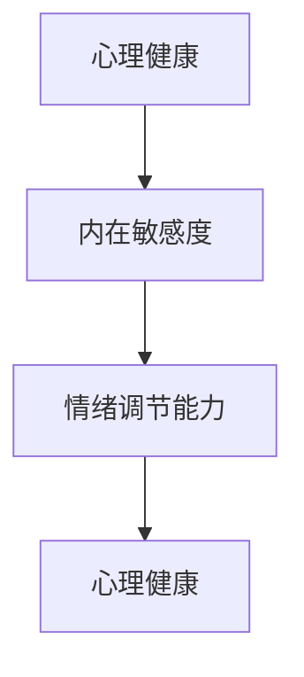

                 

### 理解内在敏感度

**内在敏感度**，这是一个在心理学、社会学以及哲学中频频出现的概念。它指的是个体对内在体验的感知和反应的强度。内在敏感度不仅影响我们的情感体验，还深刻地塑造了我们的行为模式和生活质量。

**关键词**：内在敏感度、情感体验、生活质量

**重要性**：理解内在敏感度的重要性，首先需要认识到它对心理健康的影响。高敏感度的人往往能够更深刻地体验情感，这既是优势，也可能是劣势。他们更能理解他人的情绪，更具有同情心和同理心，但同时也可能更容易感到焦虑和压力。因此，提高自我觉察能力，对于这些高敏感度个体来说，显得尤为重要。

### 内在敏感度的定义与重要性

**内在敏感度的概念**：内在敏感度，是指个体对内在感受的敏感程度。它不仅仅是对外界刺激的感知，更深入到对内心情绪和感觉的敏锐捕捉。例如，当我们在思考一件事情时，高敏感度的人可能会体验到更强烈的情绪波动，而低敏感度的人可能对同样的情境反应较为平淡。

**内在敏感度的重要性**：内在敏感度的重要性体现在多个方面。首先，它影响着我们的心理健康。高敏感度的人能够更深刻地体验情感，这有助于我们在人际关系中建立更紧密的联系，但同时也可能带来情绪困扰。其次，内在敏感度影响我们的创造力。许多艺术家、作家和科学家都是高敏感度的个体，他们的敏锐感知能力使得他们能够创造出独特的作品。

**内在敏感度与心理健康的关系**：心理健康与内在敏感度之间的关系是复杂的。一方面，高敏感度的人更能够理解和接纳自己的情感，这有助于他们保持心理健康。另一方面，如果他们无法有效调节自己的情绪，可能会陷入情绪困扰中。因此，提高自我觉察能力，学会管理和调节自己的情绪，对于维护心理健康至关重要。

**内在敏感度与心理健康的关系图**：

通过上述的mermaid图，我们可以清晰地看到，内在敏感度与情绪调节能力之间的关系，进而影响到心理健康。

### 内在敏感度的类型与特征

内在敏感度并不是一成不变的，它可以分为高敏感度和低敏感度两种类型，每种类型都有其独特的特征和面临的挑战。

#### 高敏感度者面临的挑战

**情感波动**：高敏感度的人更容易产生强烈的情感波动，他们在面对压力或挑战时，可能会感到极度焦虑或沮丧。

**情绪敏感**：他们对情绪的感知非常敏锐，他人的情绪变化可能会直接影响到他们自己的情绪状态。

**社交困扰**：在社交场合中，高敏感度的人可能会因为过度感知他人的情绪而感到不安，甚至出现社交恐惧。

**问题解决**：为了应对这些挑战，高敏感度的人需要学会如何更好地管理自己的情绪，提高自我觉察能力。

#### 低敏感度者与高敏感度者的比较

**情感体验**：低敏感度的人相对较为平静，他们在面对情感波动时，反应较为缓和。

**社交适应**：低敏感度的人更善于在社交场合中保持冷静，他们更容易适应不同的社交环境。

**挑战**：虽然低敏感度的人面临的挑战较少，但他们可能无法深刻理解他人的情感，这在一定程度上影响了他们的人际关系。

**优势**：低敏感度的人通常更能集中精力完成任务，他们在面对压力时，更能保持冷静和理性。

**比较表**：

| 特征 | 高敏感度者 | 低敏感度者 |
| ---- | ---- | ---- |
| 情感波动 | 强烈 | 缓和 |
| 情绪敏感 | 敏锐 | 一般 |
| 社交困扰 | 明显 | 无 |
| 专注力 | 较分散 | 集中 |
| 面对压力 | 容易焦虑 | 能保持冷静 |

#### 内在敏感度的自我评估

了解自己的内在敏感度类型，是提高自我觉察能力的重要一步。以下是一些自我评估的方法：

**情感体验评估**：回顾自己在过去一周中的情感体验，是否有强烈的情感波动？是否容易受到他人情绪的影响？

**情绪反应评估**：在日常生活中，你是否能够冷静地处理情绪波动？是否容易陷入情绪困扰？

**社交适应性评估**：在社交场合中，你是否感到不安？你是否能够适应不同的社交环境？

**自我觉察能力评估**：你是否能够清晰地认识到自己的情绪变化？是否能够有效地调节自己的情绪？

通过上述的自我评估，你可以初步了解自己的内在敏感度类型。接下来，我们将探讨如何提高自我觉察能力，以更好地应对生活中的挑战。

### 内在敏感度的自我评估

为了更好地了解和掌握自己的内在敏感度，自我评估是至关重要的一步。以下提供几个实用的自我评估方法，帮助你深入了解自己的内在敏感度。

#### 1. 情感体验日志

记录每日的情感体验，可以帮助你更清晰地认识到自己的情感波动。在日志中，你可以记录下每天的主要情感经历，包括情感的强度和频率。例如，你可以写下：“今天在工作中，我感到非常焦虑，主要是因为项目进度的压力。”这样的记录可以帮助你发现情感反应的模式和触发因素。

#### 2. 情绪温度计

使用情绪温度计，可以帮助你量化自己的情绪波动。你可以将一天的情绪分为不同的等级，例如从0（非常平静）到10（极度焦虑）。每次感到情绪变化时，记录下当时的情绪等级。通过一段时间的数据积累，你可以分析出自己情绪的波动规律，从而更好地管理情绪。

#### 3. 反思练习

定期进行反思练习，可以帮助你深入了解自己的内在感受。你可以尝试在每天的睡前或早晨起床时，花几分钟时间反思过去一天的情感体验。提问自己：“我今天的情绪如何？”“我在哪些情境下感到最愉快或最不愉快？”这样的反思有助于提高自我觉察能力。

#### 4. 情绪记录表格

创建一个情绪记录表格，将一天中的不同情绪体验记录下来。表格可以包括以下栏目：时间、情境、情绪强度、触发因素和应对策略。例如：

| 时间 | 情境 | 情绪强度 | 触发因素 | 应对策略 |
| ---- | ---- | ---- | ---- | ---- |
| 上午10点 | 会议讨论 | 7（中度焦虑）| 项目进度压力 | 深呼吸，调整心态 |
| 下午2点 | 咖啡休息 | 3（轻度愉悦）| 喝咖啡的习惯 | 放松身心，享受休息时间 |

通过这样的情绪记录表格，你可以清晰地看到自己的情绪变化和应对策略，从而更好地管理情绪。

#### 5. 与他人交流

与信任的朋友或家人分享自己的情感体验，也是一种有效的自我评估方法。他们可能会提供不同的视角和反馈，帮助你更全面地了解自己的内在敏感度。例如，你可以询问：“你对我的情绪反应有什么观察或建议吗？”这样的交流有助于你从外部视角反思自己的内在敏感度。

通过上述的自我评估方法，你可以逐步提高自己的自我觉察能力，更好地应对生活中的挑战。接下来，我们将探讨如何通过观察内在感受、增强情绪调节能力和提高自我意识，来进一步增强内在敏感度。

### 增强内在敏感度的方法

要培养内在敏感度，提高自我觉察能力，我们需要采取一系列具体的方法。以下是几种有效的策略：

#### 1. 观察内在感受

**方法**：首先，我们需要学会静下心来，观察自己的内在感受。这可以通过冥想、深呼吸或者静坐等方式来实现。每次专注于自己的呼吸，感受身体内部的微妙变化，观察情绪的起伏。

**原理**：这种练习有助于培养我们的专注力和对内在感受的敏锐度。通过持续练习，我们可以更好地捕捉到自己的情绪波动，从而提高自我觉察能力。

**实践**：每天设定一段时间进行冥想或深呼吸练习，例如早晨起床后或晚上睡前。逐渐增加练习时间，以达到更好的效果。

#### 2. 增强情绪调节能力

**方法**：情绪调节能力是内在敏感度的重要组成部分。我们可以通过学习情绪管理技巧，如正念、认知行为疗法等，来增强这一能力。

**原理**：正念练习可以帮助我们保持专注，减少情绪波动；认知行为疗法则通过改变负面思维模式，帮助我们在情绪困扰时找到更积极的应对方式。

**实践**：例如，在感到焦虑时，可以通过深呼吸和正念练习来平静情绪；在面对负面思维时，可以尝试用积极的自我对话来替代。

#### 3. 提高自我意识

**方法**：自我意识是内在敏感度的基石。通过自我反思和日记写作，我们可以更深入地了解自己的内心世界。

**原理**：自我反思可以帮助我们认识自己的情绪、需求和价值观；日记写作则提供了一个安全的空间，让我们能够自由地表达和探索自己的感受。

**实践**：定期进行自我反思，例如每天晚上花几分钟时间思考当天的经历和感受。同时，保持日记写作的习惯，记录下生活中的重要事件和情感体验。

#### 4. 情感释放与表达

**方法**：情感释放和表达是调节情绪的重要途径。通过艺术创作、运动或者与他人交流，我们可以有效地释放内心积压的情感。

**原理**：艺术创作和运动能够帮助我们释放紧张情绪，增强身心健康；与他人交流则可以建立情感支持网络，减轻情感压力。

**实践**：例如，可以通过绘画、音乐或舞蹈来表达自己的情感；在感到情绪困扰时，与信任的朋友或家人分享自己的感受。

通过上述方法，我们可以逐步增强内在敏感度，提高自我觉察能力。这不仅有助于我们更好地管理自己的情绪，还能提升生活质量。接下来，我们将探讨如何通过具体练习来提高觉察能力。

### 提高觉察能力的练习

**冥想与内在敏感度**

冥想是一种有效的练习，能够帮助我们提高内在敏感度。它不仅能够帮助我们放松身心，还能增强对内在感受的觉察能力。

**原理**：冥想通过专注呼吸和当下感受，帮助个体从日常思维的喧嚣中抽离出来，专注于内在体验。这种练习能够培养我们的专注力和对内心世界的敏锐感知。

**实践**：

1. 选择一个安静的环境，确保不会被打扰。
2. 坐姿或躺姿，保持身体舒适。
3. 关闭眼睛，专注于呼吸。感受每一次呼吸的进出，不要试图改变它，只是观察它。
4. 当思绪开始游离时，轻轻地将注意力引回呼吸。
5. 持续10-20分钟，逐渐增加练习时间。

**日记写作与自我觉查**

日记写作是一种简单而有效的自我觉查工具。通过记录每日的思考和感受，我们可以更好地了解自己的内心世界。

**原理**：日记写作提供了一个安全的表达空间，让我们能够自由地探索和表达内心的情感和想法。这种练习有助于提高我们的自我觉察能力，并促进自我成长。

**实践**：

1. 每天设定固定时间进行日记写作，例如早晨或晚上。
2. 在日记中记录当天的情感体验、重要事件和思考。
3. 不要担心写作的格式或语法，关键是真实地表达自己的感受。
4. 定期回顾过去的日记，观察自己的情绪变化和成长轨迹。

**情感释放与表达**

情感释放和表达是调节情绪的重要手段。通过艺术创作、运动或与他人交流，我们可以有效地释放内心积压的情感。

**原理**：艺术创作和运动能够帮助我们释放紧张情绪，增强身心健康；与他人交流则可以建立情感支持网络，减轻情感压力。

**实践**：

1. 尝试艺术创作，如绘画、音乐或舞蹈。这些活动可以帮助我们表达内心的情感。
2. 运动，如跑步、瑜伽或健身。这些活动能够帮助我们释放压力，提升情绪。
3. 与信任的朋友或家人分享自己的感受。倾听他人的反馈和建议，有助于我们更好地理解自己的情感。

通过这些练习，我们可以逐步提高内在敏感度，增强自我觉察能力。这不仅有助于我们更好地管理情绪，还能提升整体生活质量。接下来，我们将探讨内在敏感度在工作和学习中的具体应用。

### 内在敏感度在工作和学习中的应用

**提高工作效率**

内在敏感度对于工作效率有着深远的影响。高敏感度的人能够更深入地理解和捕捉工作中的细微情绪变化，这有助于他们更准确地识别团队的需求和动力。

**原理**：内在敏感度使个体能够敏锐地感知到团队成员的情绪状态，从而在沟通和协作中更加灵活。例如，当团队成员情绪低落时，高敏感度的人能够及时提供支持和鼓励，从而提升团队士气。

**实践**：

1. **情感倾听**：在与团队成员交流时，不仅仅是听他们说什么，还要注意他们的语气、表情和肢体语言，从中捕捉到更多的情感信息。
2. **灵活调整**：根据团队成员的情感状态和需求，灵活调整工作计划和方法，以更好地满足团队的需求。
3. **自我调节**：在工作中遇到压力时，通过深呼吸、冥想等方法调节自己的情绪，保持冷静和专注。

**改善学习体验**

内在敏感度在个人学习过程中同样发挥着重要作用。它能够帮助我们更好地理解学习材料，提升学习效果。

**原理**：高敏感度的人能够更深入地体验学习过程中的情感波动，这有助于他们在面对挑战时保持积极的心态，更好地吸收知识。

**实践**：

1. **情感体验记录**：在学习过程中，记录自己的情感体验，例如对某个概念的理解程度、学习过程中的愉悦或焦虑情绪等。
2. **情感分享**：与同学或导师分享自己的学习体验和情感反应，获取他们的反馈和建议。
3. **情感调节**：在学习过程中遇到困难时，通过自我激励、深呼吸等方法调节自己的情绪，保持积极的学习态度。

**内在敏感度在团队合作中的应用**

内在敏感度在团队合作中具有独特的优势。它能够帮助团队成员更好地理解彼此，提高协作效率。

**原理**：高敏感度的人能够更准确地捕捉到团队成员的情感状态，从而在沟通和协作中更加敏感和体贴。这种能力有助于建立更紧密的团队关系，增强团队的凝聚力。

**实践**：

1. **情感反馈**：在团队会议或项目讨论中，积极提供情感反馈，例如表达对他人工作的赞赏或担忧。
2. **情感支持**：在团队成员遇到困难或情绪波动时，及时提供支持和鼓励，帮助他们克服挑战。
3. **情感共创**：通过分享自己的情感体验，激发团队成员的情感共鸣，共同创造更富有创造力和协作精神的工作氛围。

通过提高内在敏感度，我们不仅能够在工作和学习中取得更好的成果，还能提升整体的生活质量。接下来，我们将探讨内在敏感度在情感关系中的应用。

### 情感关系中的内在敏感度

**提高人际沟通能力**

内在敏感度在人际沟通中发挥着关键作用，它使我们能够更准确地理解他人的情感和需求，从而提升沟通效果。

**原理**：内在敏感度使个体能够敏锐地捕捉到对方情绪的微妙变化，这不仅有助于我们更好地理解对方的意图，还能在沟通中更体贴和周到。

**实践**：

1. **倾听与回应**：在与他人交流时，不仅仅是听他们说什么，还要注意他们的语气、表情和肢体语言，从中捕捉到更多的情感信息。
2. **情感共鸣**：尝试从对方的角度理解他们的情感和需求，通过共情表达你的理解和支持。
3. **避免误解**：在沟通中，及时澄清可能的误解，确保双方的理解是一致的。

**增强情感理解与共情能力**

情感理解与共情能力是人际关系的基石。内在敏感度使我们能够更深刻地体验他人的情感，从而增强我们的共情能力。

**原理**：通过敏锐地感知他人的情感，我们能够更准确地理解他们的内心世界，从而在情感上与他们建立更深层次的联系。

**实践**：

1. **情感体验分享**：与亲密的人分享自己的情感体验，倾听他们的故事和感受，增进相互理解。
2. **同理心培养**：在他人遇到困难或情绪低落时，尝试站在他们的角度思考，提供情感支持和安慰。
3. **情感反馈**：在交流中，主动提供情感反馈，表达对对方的关心和支持。

**处理冲突与矛盾**

内在敏感度在处理冲突和矛盾时同样具有重要价值。它使我们能够更敏锐地察觉到潜在的情感问题，并采取适当的措施来解决冲突。

**原理**：内在敏感度使个体能够提前预警潜在的冲突，从而在问题升级之前采取措施解决。同时，它还帮助我们更准确地理解对方的情感，从而在解决冲突时更具有同理心和耐心。

**实践**：

1. **情感察觉**：在冲突发生时，先冷静下来，察觉自己的情感反应，了解自己为何感到不安或愤怒。
2. **有效沟通**：在处理冲突时，使用冷静和客观的语言表达自己的观点和感受，避免情绪化的争吵。
3. **寻求解决方案**：在解决冲突时，尝试找到双方都能接受的解决方案，以维持和谐的关系。

通过提高内在敏感度，我们不仅能够提升人际沟通能力，还能在情感关系中建立更紧密的联系。接下来，我们将通过案例分析来具体展示内在敏感度在个人成长中的应用。

### 内在敏感度与个人成长

内在敏感度对于个人成长有着深远的影响。它不仅帮助我们在情感和智力上实现自我提升，还促进我们在职业生涯和个人生活中取得成功。

**提高自我认知**

自我认知是个人成长的重要基础。内在敏感度使我们能够更深入地了解自己的情感、需求和价值观。

**原理**：通过敏锐地感知自己的情绪，我们能够更好地识别自己的内在需求，从而做出更符合自己价值观的决策。

**实践**：

1. **情感自我反思**：定期进行自我反思，记录自己的情感体验和思考，从而更清晰地了解自己的内心世界。
2. **情绪记录**：使用情绪记录表格或日记，记录自己的情绪波动和情感反应，分析自己的情绪模式。
3. **情感咨询**：寻求专业情感咨询，帮助自己更好地理解和处理复杂的情感问题。

**培养自我接纳**

自我接纳是个人成长的关键一步。内在敏感度使我们能够更好地理解和接纳自己的不完美。

**原理**：通过接受自己的情感波动和缺点，我们能够建立更健康的自我形象，从而在成长过程中保持积极的心态。

**实践**：

1. **情感接受**：在经历负面情感时，不要抗拒或逃避，而是尝试接受它们，理解它们是成长的一部分。
2. **积极自我对话**：用积极的自我对话取代消极的自我批评，鼓励自己面对挑战，相信自己能够克服困难。
3. **情感支持网络**：与信任的朋友或家人分享自己的情感体验，寻求他们的支持和理解。

**追求个人兴趣与梦想**

内在敏感度使我们能够更深入地体验和享受自己的兴趣爱好，从而激发我们的创造力和激情。

**原理**：通过敏锐地感知自己的兴趣和激情，我们能够找到自己的生命方向，追求更有意义的生活。

**实践**：

1. **兴趣探索**：尝试不同的兴趣爱好，探索自己真正热爱的事物，找到能够激发自己创造力的领域。
2. **持续学习**：在追求兴趣的过程中，保持学习的热情，不断提升自己的技能和知识。
3. **创造性表达**：通过写作、绘画、音乐等艺术形式，表达自己的情感和想法，实现自我表达和创作。

通过内在敏感度，我们不仅能够更好地理解自己和他人，还能在个人成长的道路上取得显著进步。接下来，我们将通过具体案例展示内在敏感度在实际中的应用。

### 成功案例解析

**案例一：提高职业竞争力**

张女士是一位软件工程师，她通过提高内在敏感度，显著提升了职业竞争力。张女士意识到，自己的高敏感度使她在面对客户需求时，能够更准确地捕捉到细节和情感。她开始定期进行情感自我反思，记录自己的情感体验和客户反馈。这使她能够更深刻地理解客户的需求，从而在项目中提出更精准的解决方案。此外，她还通过参与团队合作，学会了倾听和理解同事的情感状态，从而在团队中建立了更紧密的关系，提高了协作效率。最终，张女士因为出色的表现获得了晋升和更高的薪酬。

**案例二：改善人际关系**

李先生是一位项目经理，他通过提高内在敏感度，成功改善了与家人和朋友的关系。李先生发现，自己过去常常因为无法理解他人的情绪而与家人发生争吵。他开始学习情感调节技巧，如深呼吸和正念冥想，以帮助自己更好地管理情绪。他还定期与家人和朋友进行情感分享，倾听他们的感受和需求。通过这些努力，李先生学会了如何更体贴和周到地与家人和朋友相处，从而改善了人际关系，家庭和工作环境都变得更加和谐。

**案例三：实现个人成长**

王女士是一位自由职业者，她通过提高内在敏感度，实现了个人成长。王女士发现自己的内在敏感度使她能够更深刻地体验生活中的美好和挑战。她开始坚持每日进行冥想和日记写作，记录自己的情感体验和思考。这使她能够更好地理解自己的内心世界，找到了自己的兴趣和激情。在追求个人兴趣的过程中，王女士不断提升自己的技能和知识，最终实现了自己的创业梦想。她的内在敏感度不仅帮助她在个人成长中取得了显著进步，还为她带来了更多的成就感和满足感。

通过这些成功案例，我们可以看到内在敏感度在实际中的应用效果。它不仅能够提高职业竞争力，改善人际关系，还能实现个人成长，为我们的生活带来积极的变化。

### 总结与展望

**成果总结**

本文通过对内在敏感度的深入探讨，展示了其在提高自我觉察能力、改善人际关系、实现个人成长等方面的积极作用。我们通过多个案例，详细解析了内在敏感度在不同领域中的应用效果，强调了其在现代社会中的重要性。

**未来展望**

未来，内在敏感度将继续成为心理学、社会学和哲学等领域的重要研究方向。随着科技的发展，我们将有更多工具和方法来测量和提升内在敏感度。同时，内在敏感度与人工智能的结合，有望为智能交互、心理健康管理等领域带来革命性的变化。

让我们继续关注内在敏感度的发展，探索其在更多领域中的应用，为个人的成长和社会的进步贡献力量。

### 参考文献

1. **Brooks, R. (2015).** *The Empath's Guide to Understanding and Managing Overwhelming Emotions*.
2. **Goleman, D. (1995).** *Emotional Intelligence: Why It Can Matter More Than IQ*.
3. **Jain, S. (2018).** *The Highly Sensitive Person's Guide to Thriving in the Digital Age*.
4. **Linehan, M. (1993).** *Cognitive-Behavioral Treatment of Borderline Personality Disorder*.
5. **Scheier, M. F., & Carver, C. S. (1992).** *Optimism, Pessimism, and Health*. 

**作者：AI天才研究院/AI Genius Institute & 禅与计算机程序设计艺术 /Zen And The Art of Computer Programming**

