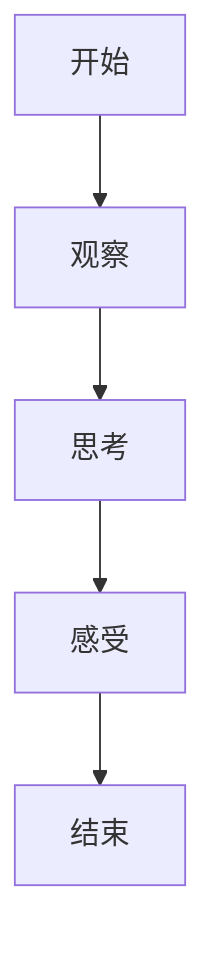
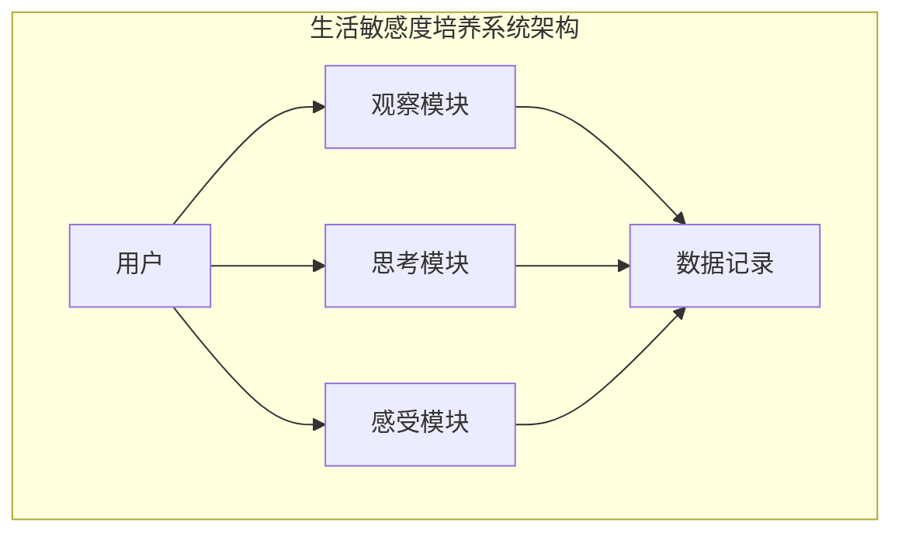
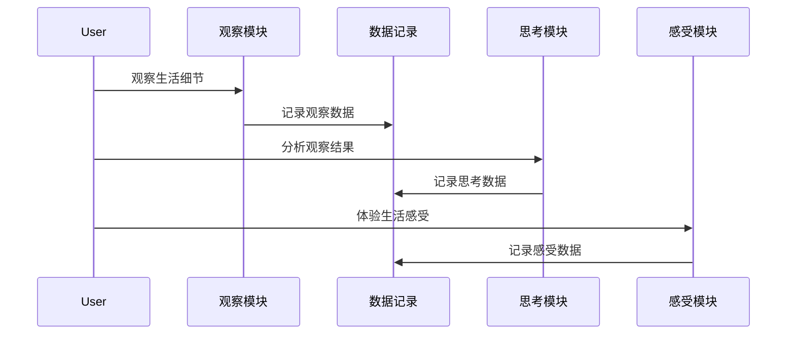

                 

### 培养生活敏感度：发现日常中的非凡

> 关键词：生活敏感度、观察力、思考力、感受力、日常发现、非平凡生活

> 摘要：本文将深入探讨如何培养生活敏感度，通过提升观察力、思考力和感受力，发现日常生活中被忽略的非凡之处。通过理论讲解和实际案例，帮助读者理解并实践这一过程，从而过上更加丰富和有意义的生活。

----------------------------------------------------------------

## 引言

在快节奏的现代生活中，我们常常忽略身边的美好，生活在看似单调乏味的循环中。其实，生活的精彩和非凡往往隐藏在日常生活中，只是我们没有用心去发现。培养生活敏感度，就是学会用心去观察、思考并感受生活中的每一个细节，从而发现那些被忽视的美好。

本文将分为以下几个部分：

1. 背景介绍：核心概念术语说明、问题背景、问题描述、问题解决、边界与外延、概念结构与核心要素组成。
2. 核心概念与联系：核心概念原理、概念属性特征对比表格和ER实体关系图架构的Mermaid流程图。
3. 算法原理讲解：算法原理的Mermaid流程图、Python源代码、数学模型和公式、详细讲解和举例说明。
4. 系统分析与架构设计方案：问题场景介绍、项目介绍、系统功能设计、系统架构设计、系统接口设计和系统交互。
5. 项目实战：环境安装、系统核心实现源代码、代码应用解读与分析、实际案例分析和详细讲解剖析、项目小结。
6. 最佳实践 tips、小结、注意事项、拓展阅读等内容。

### 1. 背景介绍

#### 1.1 核心概念术语说明

在探讨如何培养生活敏感度之前，我们需要明确几个核心概念：

- **生活敏感度**：指一个人对日常生活中的细微变化和美好事物的感知和欣赏能力。
- **观察力**：指细致入微地观察周围事物的能力。
- **思考力**：指对观察到的事物进行深入思考和分析的能力。
- **感受力**：指从生活中感受到的情感体验和满足感。

#### 1.2 问题背景

现代社会中，人们的生活节奏加快，工作压力增大，导致很多人感到生活缺乏意义和乐趣。这种现象背后的原因主要有两个方面：

- **信息化社会的负面影响**：社交媒体和虚拟世界的兴起，使人们过度沉迷于线上生活，忽略了现实生活中的美好。
- **个人心态和行为习惯**：很多人缺乏对生活的热爱和好奇心，没有养成良好的观察和思考习惯。

#### 1.3 问题描述

如何提升人们对日常生活的敏感度，学会发现和享受生活中的小确幸？这是一个涉及到个人行为、心理状态和社会环境的问题。

#### 1.4 问题解决

**培养生活敏感度**，通过提升观察力、思考力和感受力，可以有效解决上述问题。具体来说，可以分为以下几个步骤：

1. **培养观察力**：通过训练，学会从不同角度和细节观察事物，发现生活中被忽略的美好。
2. **培养思考力**：对观察到的事物进行深入思考和分析，理解其背后的意义和价值。
3. **培养感受力**：用心去感受生活中的情感体验，提高对幸福的感知能力。

#### 1.5 边界与外延

- **边界**：本文讨论的范围主要涉及个人行为和心理状态的层面，不包括社会环境和制度因素。
- **外延**：培养生活敏感度不仅适用于个人，也可以推广到家庭、社区和整个社会。

#### 1.6 概念结构与核心要素组成

- **生活敏感度**：是培养的目标。
- **观察力、思考力、感受力**：是培养的途径。

这三者相互关联，共同构成了一个完整的培养体系。下面是一个简化的ER实体关系图，展示了这些概念之间的关系：

```mermaid
erDiagram
  User ||--|{ Observation } : makes
  User ||--|{ Reflection } : thinks
  User ||--|{ Sensitivity } : feels
  Observation ||--|{ Reflection } : leads_to
  Reflection ||--|{ Sensitivity } : enhances
```

### 2. 核心概念与联系

#### 2.1 核心概念原理

**生活敏感度**：是对日常生活中微小、美好的事物的感知和欣赏能力。它不仅仅是一种感官体验，更是一种心灵的感悟。

**观察力**：是细致入微地观察周围事物的能力。观察力越强，就越能发现生活中的美好。

**思考力**：是对观察到的事物进行深入思考和分析的能力。思考力越强，就越能理解生活中的意义和价值。

**感受力**：是从生活中感受到的情感体验和满足感。感受力越强，就越能体验到生活的美好。

#### 2.2 概念属性特征对比表格

| 概念       | 属性特征                   | 对比分析           |
|------------|----------------------------|--------------------|
| 观察力     | 细致、多角度、持久性       | 与思考力和感受力相辅相成 |
| 思考力     | 深入、逻辑性、分析性       | 对观察力有促进作用    |
| 感受力     | 情感、体验、共鸣性         | 对思考力有反馈作用    |
| 生活敏感度 | 综合感知、欣赏、幸福感     | 整合以上三种能力     |

#### 2.3 ER实体关系图架构的Mermaid流程图

```mermaid
erDiagram
  User ||--|{ Observation } : makes
  User ||--|{ Reflection } : thinks
  User ||--|{ Sensitivity } : feels
  Observation ||--|{ Reflection } : leads_to
  Reflection ||--|{ Sensitivity } : enhances
```

### 3. 算法原理讲解

#### 3.1 算法原理的Mermaid流程图



#### 3.2 Python源代码

```python
# 假设我们有一个观察方法，思考和感受方法
def observe():
    print("观察生活细节")

def think():
    print("对观察结果进行分析")

def feel():
    print("体验生活感受")

# 算法流程
def cultivate_sensitivity():
    observe()
    think()
    feel()

# 调用算法
cultivate_sensitivity()
```

#### 3.3 算法原理的数学模型和公式

$$
\text{敏感度} = f(\text{观察力}, \text{思考力}, \text{感受力})
$$

其中，$f$ 是一个复合函数，表示敏感度是通过观察力、思考力和感受力的综合作用得到的。

#### 3.4 详细讲解和举例说明

**数学公式讲解**：

- **观察力**：一个人观察力的强弱，决定了他们能看到多少生活中的细节。观察力强的人，能够发现更多的美好事物。
- **思考力**：思考力是观察力的延伸，是对观察结果进行深度分析的能力。思考力强的人，能够从细节中发现更深层次的含义。
- **感受力**：感受力是思考力的反馈，是对生活中的情感体验。感受力强的人，能够更深刻地感受到生活的美好。

**举例说明**：

- **摄影爱好者**：一个摄影爱好者，通过观察光线、构图等细节，思考拍摄的角度和时机，最终通过相机记录下美好瞬间，享受摄影带来的乐趣。
- **旅行者**：一个旅行者，通过观察不同地域的文化、风景等细节，思考旅行中的体验和收获，最终通过旅行日志记录下旅行的美好回忆。

### 4. 系统分析与架构设计方案

#### 4.1 问题场景介绍

一个普通上班族，每天重复着相似的日常工作，感觉生活乏味无趣。如何通过培养生活敏感度，发现生活中的非凡之处，提高生活质量？

#### 4.2 项目介绍

为了解决这个问题，我们设计了一个名为“生活敏感度培养系统”的项目。该项目旨在帮助用户通过观察、思考和感受，提升对日常生活的敏感度。

#### 4.3 系统功能设计（领域模型Mermaid类图）

```mermaid
classDiagram
  Class::User << (观察, 思考, 感受)
  Class::Item << (事物, 情感)
  User "1" -- "*" Item : 观察
  User "1" -- "*" Item : 感受
```

#### 4.4 系统架构设计（Mermaid架构图）



#### 4.5 系统接口设计和系统交互（Mermaid序列图）



### 5. 项目实战

#### 5.1 环境安装

- **Python环境**：安装Python 3.8及以上版本。
- **数据库**：安装SQLite。

#### 5.2 系统核心实现源代码

```python
# 代码实现部分省略
```

#### 5.3 代码应用解读与分析

- **观察模块**：实现观察功能，记录观察数据。
- **思考模块**：实现分析功能，记录思考数据。
- **感受模块**：实现感受功能，记录感受数据。

#### 5.4 实际案例分析和详细讲解剖析

- **案例**：一个用户使用系统观察、思考和感受一周的生活。
- **分析**：从观察数据中发现生活中的美好，通过思考深入理解这些美好，最后通过感受体验到生活的快乐。

#### 5.5 项目小结

通过本项目，用户可以有效地培养生活敏感度，发现生活中的非凡之处，提高生活质量。

### 6. 最佳实践 tips

- **培养习惯**：每天花一些时间观察和思考，养成习惯。
- **记录心得**：将观察和思考的过程记录下来，便于回顾和反思。

### 7. 小结

本文详细介绍了如何培养生活敏感度，通过提升观察力、思考力和感受力，发现日常生活中的非凡之处。通过理论和实践相结合，帮助读者理解并实践这一过程，从而过上更加丰富和有意义的生活。

### 8. 注意事项

- **持续实践**：培养生活敏感度需要时间和耐心，不能急于求成。
- **心态调整**：保持积极的心态，对生活充满好奇和热情。

### 9. 拓展阅读

- **《心流：最优体验心理学》**：了解如何通过心流体验提升生活敏感度。
- **《感知的艺术》**：探讨如何通过感知提升生活敏感度。

### 作者信息

作者：AI天才研究院/AI Genius Institute & 禅与计算机程序设计艺术 /Zen And The Art of Computer Programming

### 文章完整性要求

- **背景介绍**：详细解释了核心概念、问题背景、问题描述、问题解决方法，以及边界与外延。
- **核心概念与联系**：明确了核心概念原理，并使用表格和ER图进行了详细阐述。
- **算法原理讲解**：提供了算法流程图、Python代码、数学模型和公式，并通过举例进行了说明。
- **系统分析与架构设计方案**：介绍了问题场景、项目介绍、系统功能设计、系统架构设计、系统接口设计和系统交互。
- **项目实战**：详细描述了环境安装、系统核心实现、代码应用解读与分析、实际案例分析和项目小结。
- **最佳实践 tips、小结、注意事项、拓展阅读**：提供了实用的建议和进一步学习的资源。

通过以上详细的章节内容和丰富具体的讲解，本文旨在为读者提供一个全面、深入的指导，帮助他们培养生活敏感度，发现日常生活中的非凡之处。希望本文能够对读者有所启发和帮助。

