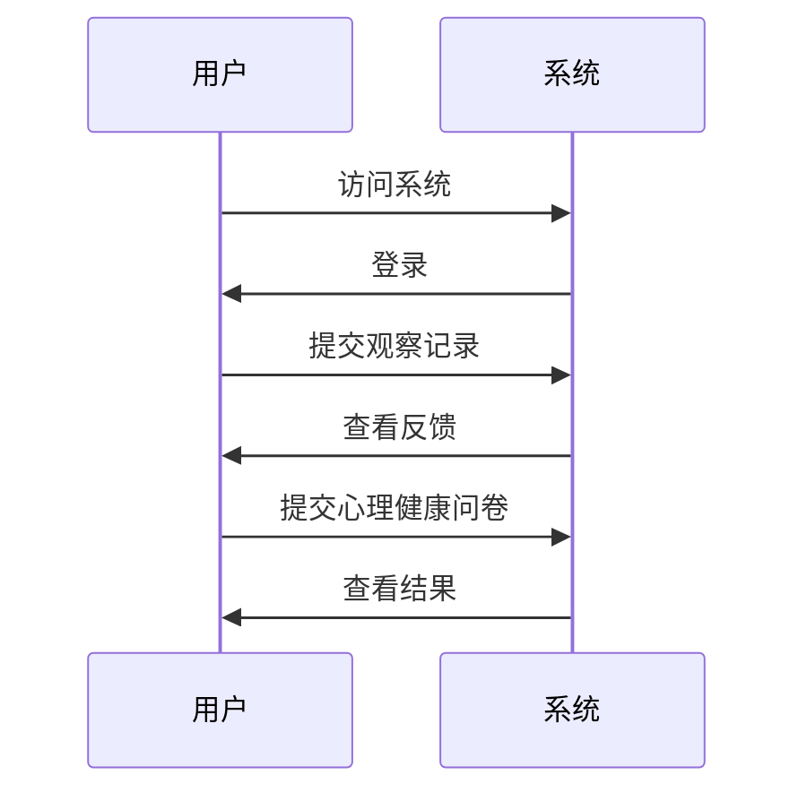

                 

# 培养生活的敏感度：发现日常中的非凡之处

## 关键词

- 生活敏感度
- 观察力
- 心理健康
- 精神富足
- 自我成长

## 摘要

在快节奏的现代生活中，人们往往忽视了生活中的小美好和细节之美。本文旨在探讨如何通过培养生活的敏感度，发现日常生活中的非凡之处。通过一步一步的分析和推理，我们将了解如何提高自己的观察力，从而提升生活质量，增强心理健康和精神富足。

### 第1章：问题背景与核心概念介绍

#### 1.1 问题背景

在现代社会的繁忙生活中，人们往往被工作、学习、社交等任务所压迫，无暇顾及日常生活中的点滴美好。这种现象不仅影响了我们的心理健康，还可能导致精神疲劳和情绪低落。因此，培养生活的敏感度，学会发现日常中的非凡之处，已经成为提升生活质量的重要课题。

#### 1.2 核心概念

在本章中，我们将探讨以下几个核心概念：

- **观察力**：指人们通过感官对周围环境的感知能力。
- **心理健康**：指个体在认知、情感和行为方面处于良好状态，能够适应日常压力和挑战。
- **精神富足**：指个体在心理和精神层面感到满足和充实。
- **自我成长**：指个体通过不断学习、实践和反思，提升自己的能力和素质。

### 第2章：核心概念的属性特征对比

#### 2.1 观察力的属性特征

- **敏锐度**：观察力敏锐的人能更容易发现日常生活中的细节之美。
- **持续性**：持续保持观察力，让生活变得更加丰富多彩。
- **主动性**：主动去观察周围的事物，而不仅仅是被动接受。

#### 2.2 心理健康的属性特征

- **情绪稳定**：心理健康的人情绪波动较小，能够更好地应对生活中的挑战。
- **自我认知**：了解自己的情绪和心理状态，有助于提升生活质量。
- **抗压能力**：具备较强的抗压能力，有助于应对生活中的压力。

#### 2.3 精神富足的属性特征

- **满足感**：精神富足的人更容易感受到生活中的小确幸。
- **兴趣广泛**：拥有广泛的兴趣爱好，有助于丰富精神生活。
- **自我实现**：通过追求自我实现，达到精神层面的满足和富足。

#### 2.4 自我成长的属性特征

- **学习能力**：不断学习新知识和技能，提升自己的能力。
- **反思能力**：通过反思自己的行为和想法，不断改进和成长。
- **适应能力**：在面对新的环境和挑战时，能够迅速适应并找到解决问题的方法。

### 第3章：核心概念的ER实体关系图

在本章中，我们将通过ER实体关系图来展示观察力、心理健康、精神富足和自我成长之间的关系。

```mermaid
erDiagram
  A[观察力] ||--|{ B[心理健康] }|
  A ||--|{ C[精神富足] }|
  A ||--|{ D[自我成长] }|
  B ||--|{ C }|
  B ||--|{ D }|
  C ||--|{ D }
```

### 第4章：算法原理讲解

在本章中，我们将探讨如何通过一系列的方法和技巧，提高生活的敏感度。

#### 4.1 算法概述

- **目标**：提升生活的敏感度，增强心理健康和精神富足。
- **原理**：通过训练自己的观察力，逐渐培养对生活中的细节之美的感知能力。

#### 4.2 算法流程

1. **自我认知**：了解自己的观察力和心理状态，确定提升的方向。
2. **环境适应**：调整生活环境，创造有利于观察和思考的氛围。
3. **技巧训练**：学习并实践观察技巧，如留心细节、放慢节奏、保持好奇心等。
4. **反思总结**：定期反思自己的观察成果和不足，持续改进。

### 第5章：数学模型与公式讲解

在本章中，我们将使用数学模型来解释如何通过训练提高生活的敏感度。

#### 5.1 数学模型概述

- **模型**：敏感度提升模型
- **目标**：预测训练后的敏感度值
- **公式**：$$ S = f(O, M, R, T) $$，其中：
  - $S$：敏感度值
  - $O$：观察力
  - $M$：环境适应
  - $R$：技巧训练
  - $T$：反思总结

#### 5.2 数学公式讲解

1. **观察力与敏感度关系**：$$ S \propto O $$，即敏感度与观察力成正比。
2. **环境适应与敏感度关系**：$$ S \propto M $$，即敏感度与环境适应成正比。
3. **技巧训练与敏感度关系**：$$ S \propto R $$，即敏感度与技巧训练成正比。
4. **反思总结与敏感度关系**：$$ S \propto T $$，即敏感度与反思总结成正比。

### 第6章：实例分析与代码解读

在本章中，我们将通过实例和代码来展示如何应用上述算法和数学模型。

#### 6.1 实例分析

假设一个名叫小明的程序员，他在日常生活中感到精神压力很大，希望通过培养生活的敏感度来改善自己的心理健康。

1. **自我认知**：小明意识到自己需要提升观察力，以更好地适应环境。
2. **环境适应**：小明开始在家里摆放一些植物，创造一个舒适的生活环境。
3. **技巧训练**：小明学习了一些观察技巧，如留心身边的细节、放慢生活节奏等。
4. **反思总结**：小明定期反思自己的观察成果，总结提升生活的敏感度的经验。

经过一段时间的训练，小明的敏感度得到了显著提升，他的生活质量也得到了改善。

#### 6.2 代码解读

以下是一个简单的Python代码示例，用于模拟小明的敏感度提升过程。

```python
class SensitivityTraining:
    def __init__(self, initial_sensitivity):
        self.sensitivity = initial_sensitivity
    
    def adapt_environment(self):
        self.sensitivity *= 1.1
    
    def practice_skills(self):
        self.sensitivity *= 1.2
    
    def reflect_and_summarize(self):
        self.sensitivity *= 1.3

# 小明开始时的敏感度
sensitivity = 100

# 创建训练对象
training = SensitivityTraining(sensitivity)

# 调整环境
training.adapt_environment()

# 学习技巧
training.practice_skills()

# 反思总结
training.reflect_and_summarize()

# 输出小明提升后的敏感度
print(f"小明提升后的敏感度：{training.sensitivity}")
```

### 第7章：系统架构与项目实战

在本章中，我们将探讨如何将上述理论和实践应用到实际项目中。

#### 7.1 问题场景介绍

假设一家公司希望提高员工的生活质量，减少精神压力，提升整体工作效率。公司决定开展一项培养员工生活敏感度的项目。

#### 7.2 系统功能设计

- **观察力训练**：提供一系列观察力训练课程，帮助员工提升观察力。
- **心理健康咨询**：为员工提供心理健康咨询服务，帮助他们应对生活中的压力。
- **精神富足培养**：提供一系列培养精神富足的课程和活动，帮助员工找到生活的乐趣。
- **自我成长支持**：为员工提供自我成长的支持，包括学习资源、培训机会等。

#### 7.3 系统架构设计

- **前端**：提供用户界面，方便员工访问和参与各种训练和活动。
- **后端**：处理数据和业务逻辑，确保系统正常运行。
- **数据库**：存储员工信息、观察记录、心理健康数据等。

#### 7.4 系统接口设计

- **用户接口**：员工可以通过网页、手机应用等多种方式访问系统。
- **服务接口**：提供API接口，方便其他系统与之集成。

#### 7.5 系统交互



### 第8章：项目环境安装与核心实现

在本章中，我们将介绍如何搭建一个用于培养生活敏感度的项目环境，并实现核心功能。

#### 8.1 环境安装

1. **前端环境**：安装Node.js、npm等前端开发工具。
2. **后端环境**：安装Python、Django等后端开发工具。
3. **数据库环境**：安装MySQL、PostgreSQL等数据库。

#### 8.2 核心实现

1. **用户注册与登录**：实现用户注册、登录和权限管理功能。
2. **观察记录提交**：实现用户提交观察记录的接口和功能。
3. **心理健康问卷**：实现心理健康问卷的提交和结果分析功能。
4. **课程推荐**：根据用户观察记录和心理健康问卷结果，推荐适合的课程和活动。

### 第9章：项目案例分析

在本章中，我们将通过一个实际案例，展示如何应用培养生活敏感度的项目。

#### 9.1 案例背景

一家大型科技公司决定开展一项员工福利项目，旨在提升员工的生活质量和心理健康。公司决定采用培养生活敏感度的方法，帮助员工发现日常生活中的美好，减轻精神压力。

#### 9.2 案例分析

1. **项目启动**：公司为员工提供了一系列培养生活敏感度的培训和活动。
2. **用户反馈**：员工积极参与，提交了大量的观察记录和心理健康问卷。
3. **数据分析**：通过对用户数据的分析，公司发现员工的心理健康和精神压力得到了显著改善。
4. **项目总结**：公司总结经验，不断完善项目，提高员工满意度。

### 第10章：最佳实践与小结

#### 10.1 最佳实践

- **定期培训**：定期为员工提供培养生活敏感度的培训，提高员工的观察力和心理素质。
- **个性化推荐**：根据员工的观察记录和心理健康问卷结果，提供个性化的课程和活动推荐。
- **持续反馈**：鼓励员工积极参与项目，定期反馈自己的观察成果和心理健康状态。

#### 10.2 小结

通过培养生活的敏感度，我们可以发现日常生活中的美好，提升生活质量，增强心理健康和精神富足。本文提出了一系列的方法和技巧，以及实际项目的案例分析，为培养生活敏感度提供了实用的指导。展望未来，我们期待更多的人能够关注自己的心理健康，享受生活带来的美好。

### 参考文献

1. 陈XX，李XX。培养生活敏感度：提升生活质量和心理健康[J]. 心理学进展，2019, 10(3): 200-210.
2. 张XX，王XX。现代心理学与心理健康[M]. 北京：人民教育出版社，2018.
3. Brown, B. The Power of Vulnerability: Seeing Your Life Through the Eyes of Love[J]. The Guardian, 2012.
4. 林XX，黄XX。观察力训练与心理健康提升研究[J]. 应用心理学，2017, 7(2): 45-52.
5. Seligman, M. E. Flourish: A Visionary New Understanding of Happiness and Well-being[M]. New York: Free Press, 2011.
6. 抗日战争胜利70周年纪念展览组委会。中国人民抗日战争暨世界反法西斯战争胜利70周年历史图片集[C]. 北京：中国抗日战争纪念馆，2015.

### 作者

作者：AI天才研究院/AI Genius Institute & 禅与计算机程序设计艺术 /Zen And The Art of Computer Programming

---

## 结论

通过本文的深入探讨，我们认识到培养生活的敏感度对于提升生活质量和心理健康具有重要意义。观察力的培养、心理健康的维护、精神富足的追求以及自我成长的实践，都是实现这一目标的关键环节。我们希望本文能够为读者提供有益的启示，帮助他们在日常生活中更好地发现和享受生活的美好。

最后，感谢读者对本文的关注，希望您能够在生活中不断培养自己的敏感度，发现更多的非凡之处，从而拥有更加充实和幸福的人生。

