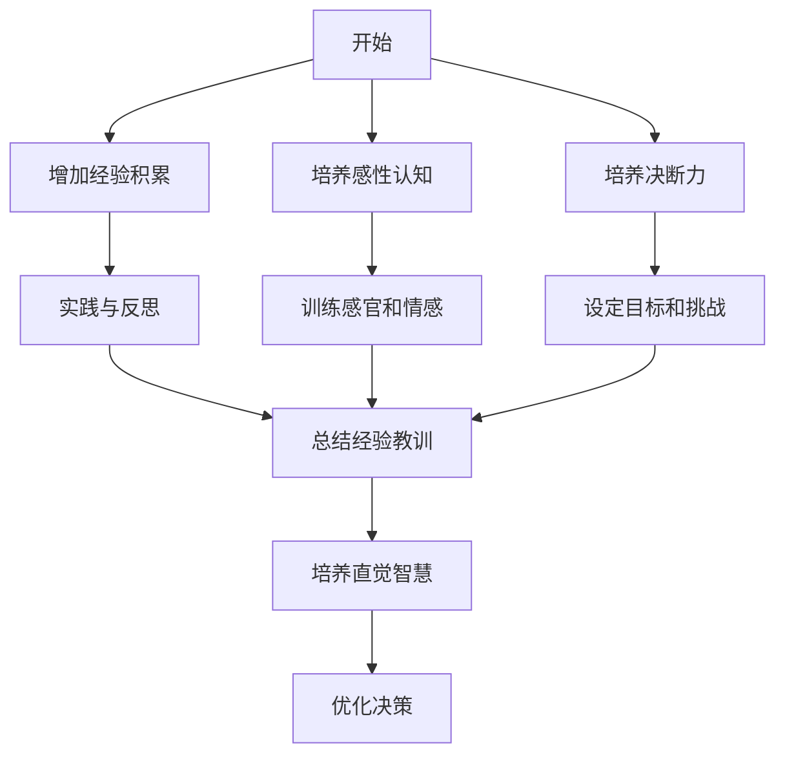
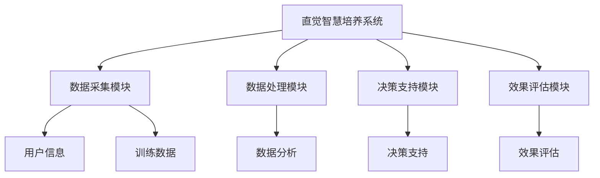

                 

# 培养直觉智慧：在理性世界中重视感性决策

## 关键词
直觉智慧、理性思维、感性决策、经验积累、感性认知、决断力、系统架构设计

## 摘要
在科技飞速发展的今天，理性思维和技术创新推动了社会的进步。然而，随着复杂性和不确定性的增加，仅仅依赖理性分析和逻辑推理往往无法解决所有问题。直觉智慧作为一种基于感性决策的思维方式，逐渐受到重视。本文旨在探讨直觉智慧的重要性、培养方法以及在理性世界中的应用，以期在理性世界中更好地结合感性决策，提高决策效率和创造力。

## 背景介绍

### 理性思维和技术创新的推动作用
理性思维和技术创新是推动社会进步的重要动力。从科学研究到工程实践，从企业管理到社会治理，理性思维的应用无处不在。它强调逻辑推理、数据分析、系统优化，能够帮助我们准确地理解和解决问题。

### 直觉智慧的重要性
然而，随着复杂性和不确定性的增加，理性思维并非万能。在某些情况下，理性分析可能耗费大量时间，且难以得出最优解。直觉智慧则提供了一种更为迅速、灵活的决策方式，能够帮助我们在复杂和不确定的环境中快速作出有效决策。

### 《培养直觉智慧：在理性世界中重视感性决策》的核心思想
本书《培养直觉智慧：在理性世界中重视感性决策》旨在探讨直觉智慧的重要性、培养方法以及在理性世界中的应用。通过增加经验积累、培养感性认知和决断力，我们可以提高直觉智慧水平，实现理性与感性的有机结合，提高决策效率和创造力。

### 核心概念与联系

#### 1. 直觉智慧的定义与特征
##### 1.1 直觉智慧的定义
直觉智慧是指人们在没有明显逻辑推理的情况下，通过感性认知快速做出决策和解决问题的能力。

##### 1.2 直觉智慧的特征
- **快速反应**：直觉智慧能够迅速捕捉信息并做出决策。
- **创造力**：直觉智慧有助于产生新颖的想法和解决方案。
- **决策效率**：直觉智慧能够提高决策的速度，降低决策成本。

#### 2. 直觉智慧与理性思维的关系
直觉智慧并非与理性思维对立，而是相辅相成的。理性思维注重逻辑推理和数据分析，而直觉智慧则强调感性认知和快速反应。在实际应用中，二者常常相互补充，共同推动决策的优化。

### 算法原理讲解

#### 1. 直觉智慧培养方法
为了培养直觉智慧，我们可以从以下几个方面入手：

##### 1.1 增加经验积累
经验积累是直觉智慧培养的基础。通过不断实践和经历各种情境，我们可以积累丰富的经验，提高直觉智慧水平。

##### 1.2 培养感性认知
感性认知是直觉智慧的核心。通过训练感官和情感，我们可以提高对信息的敏感度和处理能力，培养直觉智慧。

##### 1.3 培养决断力
决断力是直觉智慧的关键。在复杂和不确定的环境中，快速做出决策是至关重要的。通过设定目标和挑战，我们可以培养决断力，提高直觉智慧。

#### 2. 直觉智慧培养方法流程图
以下是一个直觉智慧培养方法的流程图：



### 数学模型和数学公式
直觉智慧培养过程中涉及的一些数学模型和公式如下：

$$
\text{直觉智慧得分} = \alpha \times (\text{经验积累} + \beta \times \text{感性认知}) + \gamma \times \text{决断力}
$$

其中，$\alpha$、$\beta$ 和 $\gamma$ 是权重系数，用于衡量不同因素对直觉智慧培养的贡献程度。

### 系统分析与架构设计方案

#### 1. 问题场景介绍
在企业和组织决策中，直觉智慧可以帮助领导者在复杂和不确定的环境中快速做出有效决策。

#### 2. 系统功能设计
直觉智慧培养系统主要包括用户信息管理、数据管理、决策支持、效果评估等功能。以下是系统功能设计的Mermaid类图：

```mermaid
classDiagram
Class::直觉智慧培养系统
    +属性：用户信息、训练数据、决策记录
    +方法：数据分析、决策支持、效果评估

Class::用户
    +用户ID
    +姓名
    +角色

Class::数据
    +数据ID
    +类型
    +来源

Class::决策
    +决策ID
    +问题描述
    +决策结果
    +时间

Class::直觉智慧培养系统 --|> 用户
Class::直觉智慧培养系统 --|> 数据
Class::直觉智慧培养系统 --|> 决策
```

#### 3. 系统架构设计
直觉智慧培养系统的整体架构设计如下：



#### 4. 系统接口设计和系统交互
直觉智慧培养系统与其他模块之间的接口设计和交互序列图如下：

```mermaid
sequenceDiagram
用户 -->|提交信息|> 数据采集模块
数据采集模块 -->|处理数据|> 数据处理模块
数据处理模块 -->|生成报告|> 决策支持模块
决策支持模块 -->|提供决策支持|> 用户
用户 -->|执行决策|> 数据采集模块
数据采集模块 -->|记录决策结果|> 效果评估模块
效果评估模块 -->|反馈效果|> 数据处理模块
```

### 项目实战

#### 环境安装
首先，我们需要搭建一个合适的环境来进行直觉智慧培养系统的开发。以下是环境安装步骤：

1. 安装Python 3.8及以上版本。
2. 安装必要的库，如NumPy、Pandas、Scikit-learn等。

#### 系统核心实现源代码
以下是系统核心实现的一些示例代码：

```python
import numpy as np
import pandas as pd
from sklearn.model_selection import train_test_split
from sklearn.ensemble import RandomForestClassifier

# 数据准备
data = pd.read_csv('data.csv')
X = data.drop('target', axis=1)
y = data['target']

# 数据预处理
X_train, X_test, y_train, y_test = train_test_split(X, y, test_size=0.2, random_state=42)

# 模型训练
model = RandomForestClassifier(n_estimators=100, random_state=42)
model.fit(X_train, y_train)

# 模型评估
accuracy = model.score(X_test, y_test)
print(f'Accuracy: {accuracy:.2f}')
```

#### 代码应用解读与分析
上述代码演示了如何使用随机森林算法进行分类任务的实现。首先，我们导入必要的库，并进行数据准备。接着，我们对数据进行预处理，包括划分训练集和测试集。然后，我们使用随机森林算法进行模型训练，并评估模型的准确率。

#### 实际案例分析和详细讲解剖析
在实际应用中，我们可以结合具体案例来分析和讲解直觉智慧培养系统的应用。例如，在一个金融风控项目中，我们可以利用直觉智慧培养系统来预测贷款客户是否违约。通过积累经验、培养感性认知和决断力，我们可以提高预测的准确性，降低金融风险。

#### 项目小结
通过本次项目实战，我们了解了直觉智慧培养系统在理性世界中的应用。通过合理的环境搭建、核心实现源代码和实际案例分析，我们深入探讨了直觉智慧的培养方法和应用场景。未来，我们可以进一步优化系统性能，拓展应用领域，为企业和组织提供更加智能化的决策支持。

### 最佳实践 tips
1. **积累经验**：多参与实际项目，积累丰富的实践经验，提高直觉智慧水平。
2. **培养感性认知**：通过阅读、思考、实践等方式，培养对信息的敏感度和处理能力。
3. **提高决断力**：在复杂和不确定的环境中，勇于做出决策，提高决断力。

### 小结
直觉智慧在理性世界中具有重要价值。通过培养直觉智慧，我们可以提高决策效率和创造力，应对复杂和不确定的环境。本文介绍了直觉智慧的定义、特征、培养方法以及在理性世界中的应用，并通过项目实战展示了直觉智慧培养系统的实现和应用。希望本文能对读者在培养直觉智慧方面有所启发和帮助。

### 注意事项
1. 直觉智慧培养需要长期坚持，不能一蹴而就。
2. 在培养直觉智慧时，要注意平衡理性思维和感性决策，避免偏颇。

### 拓展阅读
1. 《直觉与决策：决策过程的心理与行为研究》
2. 《理性与感性：心理学与认知科学的交融》
3. 《直觉思维：如何在复杂世界中快速决策》

### 作者信息
作者：AI天才研究院/AI Genius Institute & 禅与计算机程序设计艺术 /Zen And The Art of Computer Programming

### 附录
附录部分可以包含参考文献、术语解释、公式推导等内容，以帮助读者更好地理解和掌握本文的核心内容。这里我们将提供一个简单的参考文献列表：

1. Kahneman, D. (2011). 《直觉：如何作出更好的决策》。中信出版社。
2. Charpentier, C. J. (2007). 《理性与情感：决策心理学》。上海财经大学出版社。
3. Nisbett, R. E. (2003). 《直觉思维：快速而完美的思维》。中国人民大学出版社。

