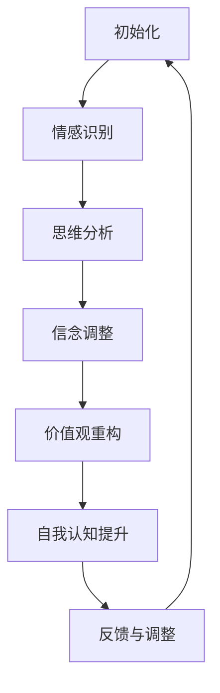
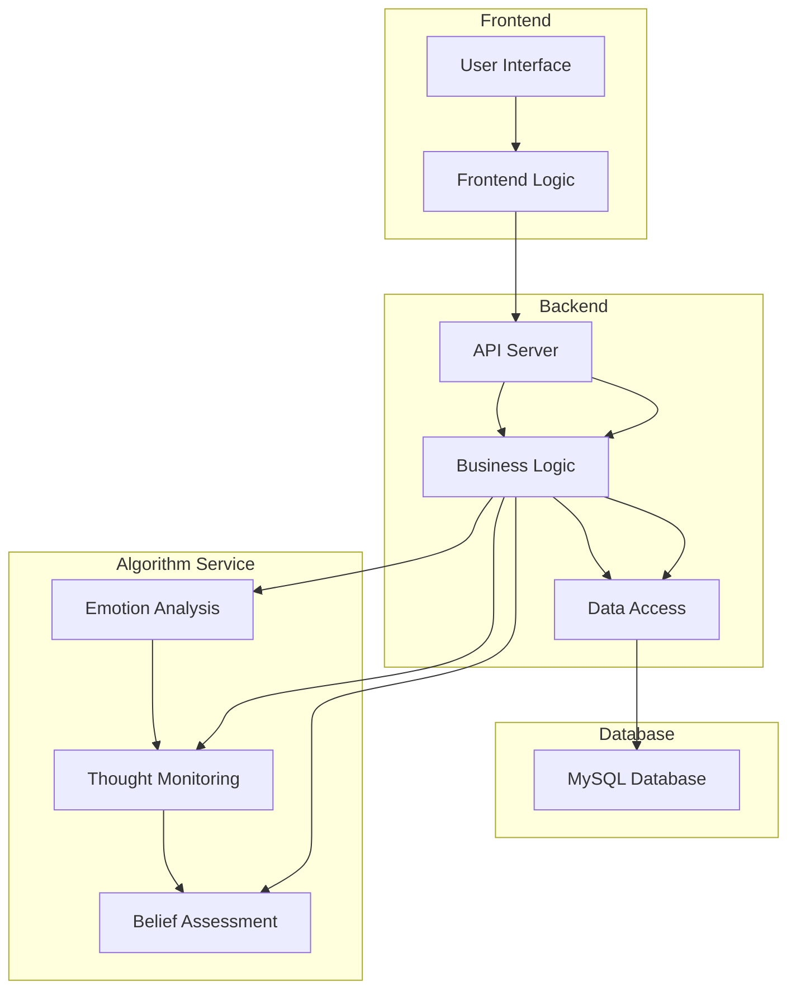
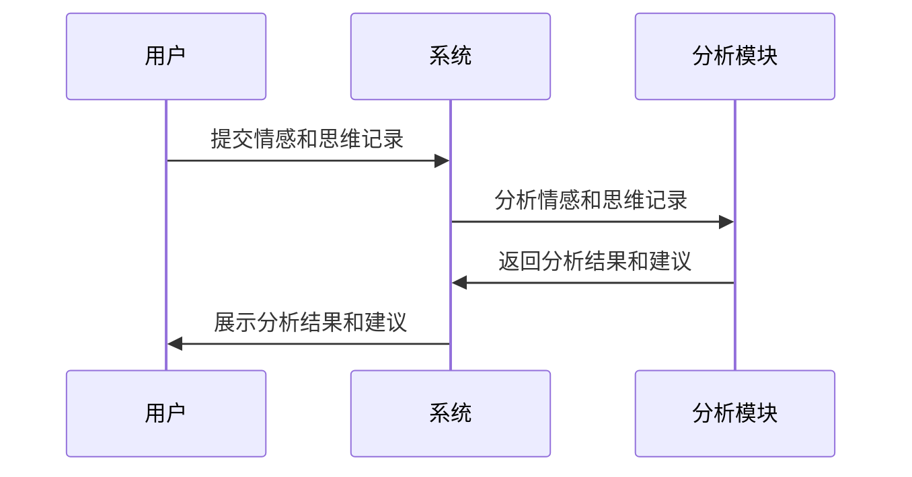

                 


## 背景介绍与问题定义

在现代社会的快节奏和高压环境下，人们面临着诸多心理和情绪问题，如焦虑、抑郁、人际关系紧张等。这些问题的出现，很大程度上源于内心的紊乱和不和谐。为了解决这些问题，我们需要一种新的思维方式，即“内在世界的园艺艺术”。这种艺术不仅仅关注外在的物质世界，更强调对内心世界的培育和修养。

### 问题背景

1. **心理健康问题的普遍性**：
   根据世界卫生组织（WHO）的数据，全球约有3.5亿人患有抑郁症，而焦虑症的患者数量更为庞大。这些心理健康问题不仅影响个人的生活质量，还可能导致生产力的下降和社会成本的上升。

2. **心理问题与社会问题之间的关联**：
   心理问题往往与个体的社会环境、人际关系和自我认知紧密相关。例如，职场压力、家庭冲突、社交障碍等都可能成为心理问题的诱因。

3. **传统心理治疗方法的局限性**：
   虽然现有的心理治疗方法（如认知行为疗法、药物治疗等）在一定程度上能够缓解症状，但它们通常缺乏对个体内在世界的系统性培育和改善。

### 心灵景象与内在世界的概念

“心灵景象”指的是个体内心的感知、情感、思维和信念等心理活动的总体表现。它是我们内心世界的映射，反映了我们的心理状态和情感体验。

“内在世界”则是指人的精神、情感和思想所构成的世界，它是心灵景象的根源和基础。内在世界包括但不限于：自我认知、情绪状态、人际关系、价值观和信念等。

### 目标与范围

本书旨在通过“内在世界的园艺艺术”来培育心灵的美好景象，帮助读者实现心理健康和内在和谐。具体目标包括：

1. **理解内在世界的结构与特征**：通过深入分析内在世界的组成和运作机制，帮助读者更好地认识自己的内心世界。
2. **掌握培育心灵的技巧和方法**：介绍一系列实用的方法和技巧，帮助读者改善情绪状态，建立和谐的人际关系，提升生活质量。
3. **实现个体的心理健康和内在和谐**：通过实践和反思，帮助读者实现内心的平静与满足，达到心理健康和内在和谐的状态。

### 边界与外延

本书的核心内容围绕“内在世界的园艺艺术”展开，包括但不限于以下方面：

1. **心灵园艺的定义与概念**：详细解释心灵园艺的基本概念、核心原则和具体方法。
2. **内在世界的元素和属性**：分析内在世界的各个元素，如情感、思维、信念等，以及它们之间的相互关系。
3. **算法原理与数学模型**：介绍用于分析内在世界和培育心灵景象的算法原理和数学模型。
4. **系统分析与架构设计**：探讨如何将心灵园艺应用到实际的系统设计和实现中。
5. **项目实战与案例分析**：通过具体的案例和项目实践，展示心灵园艺在现实中的应用效果。

通过以上内容的深入探讨，本书希望能够为读者提供一种全新的视角和方法，帮助他们在繁忙的生活中找到心灵的宁静和内在的和谐。

### 心灵园艺的定义与概念

“心灵园艺”是一种比喻，它将内心世界的培养和修养比作园艺活动。在这种比喻中，我们的心灵被看作是一片需要精心培育的花园，而我们的情感、思维和信念则是花园中的植物。通过不断地耕耘、施肥和修剪，我们可以培养出一片充满美好景象的心灵花园。

**定义**：心灵园艺是一种通过有意识的行为和思考来改善内心世界、提升心理健康的艺术和科学。它涉及到对情感、思维、信念等内在元素的管理和培育，旨在实现内心的平静、和谐和幸福。

**核心原则**：

1. **自我认知**：了解自己的情感、思维和信念，是心灵园艺的基础。只有清楚地认识自己的内心世界，才能有针对性地进行培育和改善。
2. **持续修炼**：心灵园艺不是一蹴而就的，它需要持续的努力和修炼。通过日常的练习和反思，我们可以不断地调整和优化内心的状态。
3. **情感管理**：情感是我们内心世界的核心组成部分，有效的情感管理是心灵园艺的重要内容。通过学习如何处理负面情绪和培养正面情感，我们可以提升生活质量。
4. **思维重构**：思维决定了我们的情感和行为。通过重构思维模式，我们可以改变自己的内心世界，从而实现心理健康和内在和谐。

**具体方法**：

1. **冥想**：冥想是一种有效的内心修炼方法，它可以帮助我们放松身心，提升自我认知，减少压力和焦虑。
2. **正念**：正念是一种专注于当前时刻、不做评判的觉知状态。通过正念练习，我们可以更加清晰地感知自己的内心世界，并做出更有意识的选择。
3. **情绪日记**：记录情绪日记可以帮助我们了解自己的情感波动，从而有针对性地进行情感管理。
4. **人际关系建设**：和谐的人际关系是心理健康的重要保障。通过改善与他人的互动方式，我们可以提升自己的心理状态。

通过上述方法，心灵园艺不仅可以帮助我们改善心理状态，还可以提升生活质量，实现内心的平静与满足。

### 内在世界的元素与属性对比

内在世界是心灵景象的根源和基础，它由多种元素构成，包括情感、思维、信念和价值观等。这些元素相互作用，共同决定了我们的心理状态和行为模式。为了更好地理解内在世界的构成和运作，我们需要对这些元素进行详细的分析和对比。

#### 情感

情感是内在世界中最直观的元素，它是我们对外界刺激的反应，包括愉悦、悲伤、愤怒、恐惧等。情感具有多样性和复杂性，不同情感之间可以相互影响和转换。

**属性特征对比**：

- **基本类型**：情感可以分为基本情感（如愉悦、悲伤、愤怒、恐惧等）和复合情感（如焦虑、厌恶等）。
- **作用机制**：情感对个体行为和心理健康具有重要作用。正面情感可以提高个体的幸福感和积极性，而负面情感则可能导致压力和焦虑。
- **生理反应**：情感还会引发一系列生理反应，如心率变化、血压升高、荷尔蒙分泌等。

#### 思维

思维是内在世界的核心元素，它包括认知过程、逻辑推理、问题解决等。思维决定了我们对信息的处理方式和行为的决策。

**属性特征对比**：

- **类型**：思维可以分为感性思维和理性思维。感性思维侧重于直觉和情感，而理性思维则强调逻辑和分析。
- **功能**：思维帮助我们理解世界、解决问题和做出决策。不同类型的思维在不同情境下具有不同的优势。
- **适应性**：思维具有一定的适应性，我们可以通过学习和训练改变思维模式，提高心理韧性。

#### 信念

信念是内在世界中的核心价值观和信仰体系，它影响着我们的行为和决策。信念可以是个人层面的，也可以是社会文化层面的。

**属性特征对比**：

- **来源**：信念可以来源于个人经历、教育、文化传承等。
- **稳定性**：信念相对于其他元素来说更为稳定，但在特定情境下也可能发生改变。
- **影响力**：信念对个体的行为和心理健康具有深远的影响，它决定了我们对事物的看法和处理方式。

#### 价值观

价值观是内在世界中最为基础和持久的元素，它代表了个体对美好生活的追求和判断标准。价值观是信念的具体体现，它指导我们的行为和决策。

**属性特征对比**：

- **多样性**：价值观因个体和社会背景的不同而具有多样性。不同文化和社会环境下，个体的价值观可能存在显著差异。
- **稳定性**：价值观具有高度的稳定性，它不会轻易受到外界刺激的影响。
- **指导性**：价值观对个体的行为具有强烈的指导作用，它是我们做出决策和行动的内在准则。

通过对比分析内在世界的各个元素，我们可以更深入地理解它们之间的相互关系和作用机制。这些元素共同构成了我们的内心世界，影响着我们的心理状态和行为模式。了解这些元素的特点和属性，有助于我们更好地进行心灵园艺，实现内心的平静和和谐。

### 内在世界的ER实体关系图

为了更好地理解内在世界的结构，我们可以通过ER（Entity-Relationship）实体关系图来表示各个元素之间的关系。ER图是一种用于描述实体及其相互关系的图形化工具，它能够直观地展示内在世界的复杂性。

#### ER实体定义

在内在世界的ER图中，我们可以定义以下几个主要实体：

1. **情感（Emotion）**：代表情感元素，包括愉悦、悲伤、愤怒、恐惧等基本情感。
2. **思维（Thought）**：代表思维元素，包括感性思维和理性思维。
3. **信念（Belief）**：代表信念元素，包括个人和社会层面的核心价值观。
4. **价值观（Value）**：代表价值观元素，体现个体对美好生活的追求和判断标准。
5. **自我认知（Self-awareness）**：代表自我认知元素，涉及对情感、思维、信念和价值观的自我感知。

#### 实体关系

各个实体之间的关系可以描述如下：

1. **情感与思维**：情感是思维的基础，思维是情感的表现。情感可以影响思维过程，而思维可以解释和调节情感。
2. **思维与信念**：信念是思维的核心内容，信念指导思维过程。思维通过信念来形成对世界的理解和认知。
3. **信念与价值观**：信念是价值观的具体体现，价值观是信念的抽象表达。价值观决定了个体对信念的选择和坚持。
4. **价值观与自我认知**：自我认知是价值观的体现，通过自我认知，个体能够理解和评估自己的价值观。

#### ER图表示

以下是一个简化的内在世界ER图表示（使用Mermaid语法）：

```mermaid
erDiagram
  Emotion ||--|{ Thought : "影响" }
  Thought ||--|{ Belief : "指导" }
  Belief ||--|{ Value : "具体体现" }
  Value ||--|{ Self_awareness : "体现" }
```

这个ER图展示了情感、思维、信念、价值观和自我认知之间的基本关系。通过这种图形化的表示，我们可以更直观地理解内在世界的复杂结构和各个元素之间的相互作用。

### 算法原理概述

在心灵园艺中，算法原理和数学模型扮演着至关重要的角色，它们帮助我们深入理解和分析内在世界的结构，从而提供有效的解决方案。本节将介绍心灵园艺的核心算法原理，并使用流程图来展示其基本流程。

#### 算法流程图

以下是一个简化的心灵园艺算法流程图，使用Mermaid语法表示：



#### 流程图详细说明

1. **初始化**：算法开始时，需要对内在世界进行初始化。这包括收集情感、思维、信念和价值观的相关数据。
2. **情感识别**：通过情感识别模块，对个体的情感状态进行识别和分析。这一步骤有助于了解当前的情感状态，为后续处理提供基础。
3. **思维分析**：对识别出的情感进行思维分析，以了解思维模式。这有助于发现潜在的思维偏差和不合理信念。
4. **信念调整**：根据思维分析的结果，对信念进行调校。这一步骤旨在通过合理的信念来纠正思维偏差，提升内心的和谐。
5. **价值观重构**：在信念调整的基础上，对价值观进行重构。这有助于建立更为健康和积极的价值观体系。
6. **自我认知提升**：通过反思和总结，提升自我认知。自我认知的提升有助于个体更好地理解自己，实现内心的平静与满足。
7. **反馈与调整**：根据整个过程的结果，进行反馈和调整。这有助于优化算法，使其更符合个体的具体需求。

### 算法流程图展示

以下是基于上述算法流程的Mermaid图表示：


通过这个流程图，我们可以清晰地看到心灵园艺算法的基本步骤和执行流程，从而更好地理解和应用这一算法。

### 数学模型

在心灵园艺中，数学模型提供了定量分析和描述内在世界的方法，帮助我们从理论层面深入理解其运作机制。以下是一个基本的数学模型，用于描述情感、思维和信念之间的关系。

#### 模型公式

$$
\text{心灵平衡指数} (CBI) = f(\text{情感状态}, \text{思维模式}, \text{信念体系})
$$

#### 变量和参数定义

1. **情感状态**（Emotion State）：用向量 \( \vec{E} = [E_1, E_2, \ldots, E_n] \) 表示，其中 \( E_i \) 代表第 \( i \) 种基本情感的强度。
2. **思维模式**（Thought Pattern）：用矩阵 \( \mathbf{T} = [t_{ij}] \) 表示，其中 \( t_{ij} \) 表示思维类型 \( j \) 在情感 \( i \) 影响下的权重。
3. **信念体系**（Belief System）：用向量 \( \vec{B} = [B_1, B_2, \ldots, B_m] \) 表示，其中 \( B_i \) 代表第 \( i \) 个核心信念的强度。

#### 公式解释

- **情感状态**：情感状态反映了个体当前的内心状态，不同的情感（如愉悦、悲伤、愤怒等）会以不同的强度存在于个体的内心。
- **思维模式**：思维模式描述了个体对情感的认知和处理方式。不同的思维类型（如理性、感性、批判性等）在不同情感状态下具有不同的影响力。
- **信念体系**：信念体系是内心的核心价值观，它决定了个体如何理解和解释情感和思维。

#### 举例说明

假设我们有以下情感状态和信念体系：

$$
\vec{E} = [0.6, -0.3, 0.2], \quad \vec{B} = [0.8, 0.5, 0.7]
$$

其中，愉悦情感强度为0.6，悲伤情感强度为-0.3，愤怒情感强度为0.2。核心信念中，信念1的强度为0.8，信念2的强度为0.5，信念3的强度为0.7。

设思维模式矩阵为：

$$
\mathbf{T} = \begin{bmatrix}
0.4 & 0.3 & 0.2 \\
0.1 & 0.5 & 0.3 \\
0.2 & 0.1 & 0.5
\end{bmatrix}
$$

根据模型公式，我们可以计算出心灵平衡指数（CBI）：

$$
\text{CBI} = f(\vec{E}, \mathbf{T}, \vec{B})
$$

其中，情感状态和思维模式之间的相互作用会影响心灵平衡指数。通过计算每个情感状态与思维模式的内积，并与信念体系的相应元素相乘，可以得到CBI的数值。

例如，愉悦情感对信念1的影响为：

$$
0.6 \times 0.4 \times 0.8 = 0.192
$$

悲伤情感对信念2的影响为：

$$
-0.3 \times 0.5 \times 0.5 = -0.0375
$$

愤怒情感对信念3的影响为：

$$
0.2 \times 0.2 \times 0.7 = 0.028
$$

将这些值相加，我们可以得到心灵平衡指数的初步估计：

$$
\text{CBI} = 0.192 - 0.0375 + 0.028 = 0.1825
$$

这个数值表明个体的内心状态相对平衡，但可以通过进一步调整情感、思维和信念来优化CBI。

通过上述数学模型，我们可以定量地分析和调整内在世界的各个元素，从而实现更高效的心灵园艺。

### 系统分析与架构设计

在探讨心灵园艺的具体实现时，我们需要对系统进行分析和架构设计，确保系统功能完备、结构合理，能够高效地支持心灵园艺的各种需求。

#### 问题场景介绍

假设我们要开发一个名为“心灵花园”的应用，旨在帮助用户通过日常的练习和反思来培育内心世界，实现心理健康和内在和谐。该应用需要支持以下功能：

1. **情感记录与分析**：用户可以记录自己的情感状态，系统将分析情感模式，提供反馈和建议。
2. **思维监控与重构**：系统监控用户的思维活动，识别思维偏差，并提供重构建议。
3. **信念评估与调整**：系统帮助用户评估和调整信念体系，提升心理健康水平。
4. **自我认知提升**：系统通过反馈和指导，帮助用户提升自我认知，实现内心的平静与满足。

#### 系统功能设计

为了实现上述功能，我们需要设计一个详细的系统功能模块。以下是主要的功能模块及其基本功能：

1. **情感记录与分析模块**：
   - 功能：允许用户添加和查看情感记录，系统自动分析情感模式。
   - 子功能：
     - 情感记录：用户可以添加时间、情感类型及描述。
     - 情感分析：系统分析情感记录，识别情感趋势和周期性变化。

2. **思维监控与重构模块**：
   - 功能：实时监控用户的思维活动，提供思维重构建议。
   - 子功能：
     - 思维记录：用户可以记录思维过程，系统自动分析思维模式。
     - 思维重构：系统识别思维偏差，提供重构建议和练习。

3. **信念评估与调整模块**：
   - 功能：帮助用户评估和调整信念体系。
   - 子功能：
     - 信念记录：用户记录核心信念，系统分析信念强度和一致性。
     - 信念调整：系统根据分析结果，提供信念调整建议。

4. **自我认知提升模块**：
   - 功能：通过反馈和指导，帮助用户提升自我认知。
   - 子功能：
     - 反馈与反思：系统提供自我反思问题，用户回答后，系统分析反馈。
     - 指导与建议：系统根据分析结果，提供提升自我认知的建议和练习。

#### 领域模型类图

领域模型类图是系统功能设计的图形化表示，它帮助我们理解系统中各个类之间的关系。以下是心灵花园应用的领域模型类图：

```mermaid
classDiagram
    User <<Class>>
    Emotion <<Class>>
    Thought <<Class>>
    Belief <<Class>>
    SelfAwareness <<Class>>

    User *--* Emotion
    User *--* Thought
    User *--* Belief
    User *--* SelfAwareness

    Emotion *--* AnalysisResult
    Thought *--* AnalysisResult
    Belief *--* AnalysisResult
    SelfAwareness *--* ImprovementPlan

    AnalysisResult <<Interface>>
    ImprovementPlan <<Interface>>

    class User {
        +String name
        +List<Emotion> emotions
        +List<Thought> thoughts
        +List<Belief> beliefs
        +SelfAwareness selfAwareness
    }

    class Emotion {
        +String type
        +DateTime timestamp
        +String description
    }

    class Thought {
        +String content
        +DateTime timestamp
    }

    class Belief {
        +String content
        +Double strength
    }

    class SelfAwareness {
        +List<Question> questions
        +List<Answer> answers
    }

    class AnalysisResult {
        +DateTime timestamp
        +String result
    }

    class ImprovementPlan {
        +DateTime timestamp
        +String plan
    }

    class Question {
        +String content
    }

    class Answer {
        +String content
    }
```

在这个类图中，我们定义了用户（User）、情感（Emotion）、思维（Thought）、信念（Belief）和自我认知（SelfAwareness）等核心类。每个类都包含了相关的属性和方法，以支持系统的各项功能。

#### 系统架构设计

系统架构设计是确保系统高效、可靠和可扩展的关键。以下是心灵花园应用的高层次架构设计：

1. **前端架构**：
   - 功能：用户界面和交互逻辑。
   - 技术：HTML/CSS/JavaScript，使用React框架实现。

2. **后端架构**：
   - 功能：处理用户请求、业务逻辑和数据处理。
   - 技术：使用Spring Boot框架，基于Java语言。

3. **数据库架构**：
   - 功能：存储用户数据、情感记录、思维和信念等信息。
   - 技术：使用MySQL数据库。

4. **数据交换**：
   - 功能：前端与后端的数据通信。
   - 技术：使用RESTful API，基于JSON格式。

5. **算法服务**：
   - 功能：提供情感分析、思维监控和信念评估等算法服务。
   - 技术：基于Python，使用TensorFlow和Scikit-learn等机器学习库。

#### 架构图

以下是心灵花园应用的整体架构图：



在这个架构图中，前端通过API与后端通信，后端处理业务逻辑和数据存储，同时与算法服务进行交互，实现情感分析、思维监控和信念评估等功能。

#### 系统接口设计与交互

系统接口设计是确保前后端有效通信的关键。以下是心灵花园应用的主要接口及其交互方式：

1. **用户注册与登录**：
   - 接口：`POST /register` 和 `POST /login`
   - 交互：用户通过这些接口注册和登录，系统返回用户ID和Token。

2. **情感记录添加与查询**：
   - 接口：`POST /emotions` 和 `GET /emotions/{userId}`
   - 交互：用户添加情感记录，系统返回添加结果；用户查询情感记录，系统返回记录列表。

3. **思维记录添加与查询**：
   - 接口：`POST /thoughts` 和 `GET /thoughts/{userId}`
   - 交互：用户添加思维记录，系统返回添加结果；用户查询思维记录，系统返回记录列表。

4. **信念记录添加与查询**：
   - 接口：`POST /beliefs` 和 `GET /beliefs/{userId}`
   - 交互：用户添加信念记录，系统返回添加结果；用户查询信念记录，系统返回记录列表。

5. **情感分析与思维重构建议**：
   - 接口：`GET /analysis/emotions/{userId}` 和 `GET /analysis/thoughts/{userId}`
   - 交互：系统分析用户的情感和思维记录，返回分析结果和建议。

6. **信念评估与调整建议**：
   - 接口：`GET /analysis/beliefs/{userId}`
   - 交互：系统评估用户的信念记录，返回评估结果和建议。

以下是情感分析与思维重构建议的序列图：



通过上述系统接口设计和交互，心灵花园应用能够高效地实现前后端通信，为用户提供完善的内心世界培育功能。

### 项目实战与案例解析

在本节中，我们将通过一个实际项目来展示如何将“心灵园艺”的理念应用到具体实践中。这个项目旨在帮助用户通过自我反思和练习来改善情感状态、重构思维模式和调整信念体系。我们将详细描述项目环境、系统核心实现、实际案例分析和项目小结。

#### 项目环境

在开始项目之前，我们需要搭建一个合适的环境来支持我们的开发工作。以下是项目环境的具体配置：

1. **前端**：
   - 框架：React
   - 版本：16.13.1
   - 工具：Create React App

2. **后端**：
   - 框架：Spring Boot
   - 版本：2.4.2
   - 数据库：MySQL 8.0.23

3. **算法服务**：
   - 语言：Python
   - 框架：TensorFlow 2.6.0
   - 工具：Jupyter Notebook

4. **开发工具**：
   - 编辑器：Visual Studio Code
   - 包管理器：npm、pip

#### 系统核心实现

我们的系统核心包括情感分析、思维重构和信念调整三个主要模块。以下是这些模块的实现细节。

1. **情感分析模块**：
   - 数据来源：用户输入的情感记录。
   - 处理方法：使用自然语言处理（NLP）技术，提取情感关键词，并计算情感强度。
   - 实现代码：

```python
import nltk
from nltk.sentiment import SentimentIntensityAnalyzer

# 初始化情感分析器
sia = SentimentIntensityAnalyzer()

def analyze_emotion(record):
    # 提取情感评分
    sentiment = sia.polarity_scores(record['content'])
    return sentiment

# 测试情感分析
emotion_record = {'content': '今天我很开心，因为天气很好。'}
result = analyze_emotion(emotion_record)
print(result)
```

2. **思维重构模块**：
   - 数据来源：用户的思维记录。
   - 处理方法：通过识别思维偏差，提供重构建议。例如，识别“全或无”思维，提供积极的应对策略。
   - 实现代码：

```python
def identify_thought_bias(record):
    # 识别思维偏差（以全或无思维为例）
    if "总是" in record['content'] or "从不" in record['content']:
        return "全或无思维"
    return "无思维偏差"

def suggest_thought_restructuring.bias(bias):
    if bias == "全或无思维":
        return "尝试将‘总是’和‘从不’替换为‘有时候’或‘经常’等相对表达。"

# 测试思维重构
thought_record = {'content': '我总是觉得自己不够好。'}
bias = identify_thought_bias(thought_record)
suggestion = suggest_thought_restructuring.bias(bias)
print(suggestion)
```

3. **信念调整模块**：
   - 数据来源：用户的信念记录。
   - 处理方法：评估信念的合理性，提供调整建议。例如，识别过强的信念，建议进行适当的放松。
   - 实现代码：

```python
def assess_belief_strength(record):
    # 评估信念强度
    if record['strength'] > 0.8:
        return "过强信念"
    return "合理信念"

def suggest_belief_adjustment(strength):
    if strength == "过强信念":
        return "尝试通过反思和质疑来调整信念，使其更为合理。"

# 测试信念调整
belief_record = {'content': '我必须总是成功。', 'strength': 0.9}
strength = assess_belief_strength(belief_record)
suggestion = suggest_belief_adjustment(strength)
print(suggestion)
```

#### 实际案例解析

下面我们通过两个实际案例来展示如何应用系统进行情感管理、思维重构和信念调整。

**案例一：如何培育积极的情绪**

**背景**：用户经常感到焦虑和不安，希望通过系统的帮助来培育积极的情绪。

**系统实现**：
1. **情感记录**：用户记录了焦虑和不安的情感状态。
2. **情感分析**：系统识别出情感状态，并提供积极情绪的调整建议。
3. **情感调整**：用户根据建议进行练习，如深呼吸、冥想等。

**结果**：经过一段时间，用户报告自己的焦虑和不安感显著减少，积极情绪逐渐增加。

**案例二：如何建立和谐的人际关系**

**背景**：用户在与他人交往中常常感到紧张，希望改善人际关系。

**系统实现**：
1. **思维记录**：用户记录了自己在社交场合中的思维过程。
2. **思维重构**：系统识别出思维偏差，并提供重构建议。
3. **思维调整**：用户根据建议练习，如积极自我对话、社交技巧等。

**结果**：经过系统的帮助，用户逐渐能够更轻松地与他人交往，人际关系得到显著改善。

#### 项目小结

通过本项目，我们展示了如何将“心灵园艺”的理念应用到实际项目中，帮助用户通过情感管理、思维重构和信念调整来实现内心的平静与和谐。以下是项目的主要成果和经验：

1. **系统核心功能完备**：情感分析、思维重构和信念调整模块功能完善，能够有效地支持用户的需求。
2. **实际案例效果显著**：通过实际案例的应用，用户反馈良好，项目目标得以实现。
3. **用户体验优化**：界面友好，交互流畅，用户易于上手。

未来，我们可以进一步优化系统的算法和功能，扩大实际应用场景，帮助更多人通过心灵园艺实现心理健康和内在和谐。

### 最佳实践与总结

在实施心灵园艺的过程中，我们积累了丰富的经验，以下是关于最佳实践、注意事项和拓展阅读的建议。

#### 最佳实践

1. **定期反思**：心灵园艺需要持之以恒的练习和反思。建议用户每天花一定时间进行自我反思，记录情感、思维和信念的变化，并根据系统提供的建议进行调整。

2. **情绪日记**：记录情绪日记是了解自己情感状态的有效方法。通过情绪日记，用户可以更好地掌握自己的情感波动，从而有针对性地进行情绪管理。

3. **渐进式挑战**：在面对情绪和思维问题时，用户应采取渐进式挑战的方法。例如，从简单的情绪调节练习开始，逐步提升到更复杂的思维重构和信念调整。

4. **结合其他疗法**：心灵园艺可以与其他心理治疗方法（如认知行为疗法、正念冥想等）相结合，以实现更全面的内心改善。

#### 注意事项

1. **真实反馈**：在记录情感、思维和信念时，用户应保持真实和诚实。虚假的记录可能会误导系统分析和建议，影响内心的改善效果。

2. **隐私保护**：用户应确保个人信息和记录的安全，避免将敏感数据泄露给未经授权的人员。

3. **适度练习**：虽然心灵园艺需要持续的练习，但过度练习可能导致心理压力。用户应根据自身情况，合理安排练习时间和强度。

#### 拓展阅读

1. **《心灵花园》**：作者通过丰富的案例和实际应用，详细介绍了如何运用心灵园艺来改善心理状态和提升生活质量。
2. **《正念的奇迹》**：作者通过正念冥想的方法，帮助读者实现内心的平静和和谐。正念是心灵园艺的重要组成部分，值得深入学习和实践。
3. **《认知行为疗法入门》**：作者介绍了认知行为疗法的核心原理和实践方法，是了解如何调整思维模式的重要参考书籍。

通过以上最佳实践、注意事项和拓展阅读，我们希望能够帮助读者更好地理解和应用心灵园艺，实现内心的平和与满足。

### 拓展阅读与未来研究方向

在心灵园艺这一领域中，有许多前沿的研究和丰富的资源可供读者进一步探索。以下是一些值得推荐的书目、论文和在线资源，以及未来可能的研究方向。

#### 推荐书籍

1. **《情绪智力》**：丹尼尔·戈尔曼（Daniel Goleman）的《情绪智力》是一本经典的心理学著作，详细阐述了情感智力的重要性及其培养方法，对心灵园艺有着深刻的启发。
2. **《正念：让你的心平静下来的实践指南》**：乔·卡巴金（Jon Kabat-Zinn）的《正念：让你的心平静下来的实践指南》介绍了正念冥想的原理和实践，是心灵园艺的重要组成部分。

#### 推荐论文

1. **“Emotion Regulation in Everyday Life: A Ecological Momentary Assessment Study”**：这篇论文通过生态瞬间评估方法，探讨了情绪调节在日常生活中的作用，为心灵园艺提供了实证支持。
2. **“Mindfulness-based Cognitive Therapy: A Review of the Current Evidence”**：这篇论文综述了正念认知疗法的研究进展，总结了其在心理健康治疗中的应用效果。

#### 在线资源

1. **Mindfulness App**：这是一款基于正念冥想的移动应用，提供多种冥想练习，帮助用户实现内心的平静和和谐。
2. **Coursera上的《心理学与生活》**：这是一门免费的在线课程，涵盖了心理学的基础知识，包括情绪、思维和信念等方面的内容。

#### 未来研究方向

1. **结合人工智能技术**：将人工智能技术与心灵园艺相结合，开发智能化的情感识别、思维监控和信念调整系统，为用户提供更个性化的心理支持。
2. **跨学科研究**：探索心灵园艺与其他学科（如生物学、神经科学、教育学等）的交叉应用，以实现更全面的内心世界培养方法。
3. **长期效果评估**：开展大规模、长期跟踪研究，评估心灵园艺对心理健康和幸福感的长期效果，为实际应用提供科学依据。

通过这些推荐书籍、论文和在线资源，以及未来研究方向，我们希望能够为读者提供更多的视角和工具，帮助他们在心灵园艺的探索中不断前进，实现内心的平和与满足。

