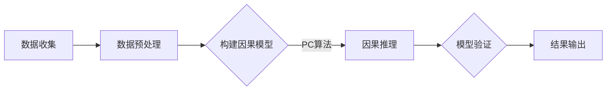
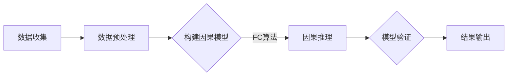
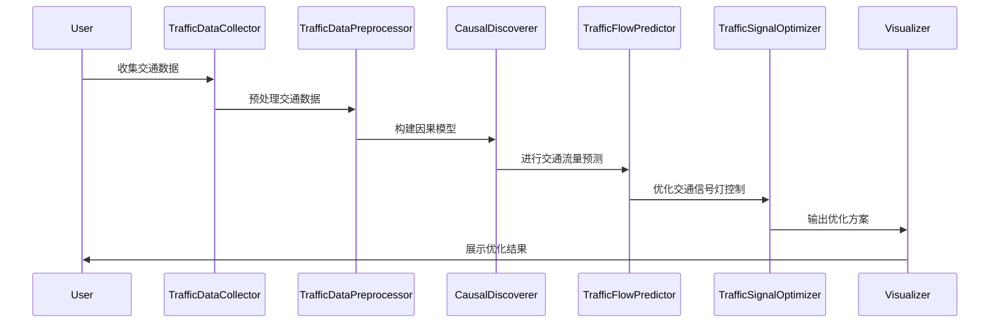
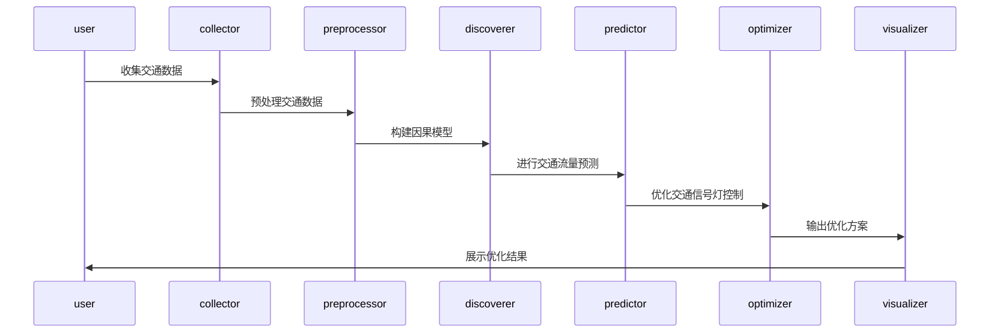

                 

# 基于因果发现的AI推理能力提升方法

## 关键词

- 因果发现
- AI推理
- 数学模型
- 算法
- 系统架构

## 摘要

本文旨在探讨如何通过因果发现方法提升AI的推理能力。我们首先介绍了因果发现的基本概念和其在AI推理中的重要性。随后，我们详细分析了因果发现算法的原理，并通过Python代码和数学模型进行了阐述。文章最后，我们展示了如何将因果发现算法应用于实际项目，提供了系统化的解决方案，并对项目实战经验进行了总结。本文旨在为读者提供一个全面、易懂的指导，以深入了解和掌握基于因果发现的AI推理能力提升方法。

## 第1章 引言

### 1.1 问题背景

在人工智能领域，推理能力是衡量一个智能系统是否接近人类智能的重要标准。然而，传统的基于规则和统计机器学习的方法在处理复杂问题时往往力不从心。近年来，因果发现（Causal Discovery）作为一种新兴的方法，逐渐受到广泛关注。因果发现旨在从数据中找出变量之间的因果关系，从而提升AI系统的推理能力。本文将探讨如何利用因果发现方法，提升AI的推理能力。

### 1.2 问题描述

在实际应用中，AI系统需要处理大量的数据，并从中提取出有用的信息。然而，仅仅依靠统计方法，我们很难确定变量之间的因果关系。例如，一个天气预测系统可能知道温度和湿度之间的相关性，但无法确定它们之间的因果关系。这就导致了AI系统在推理过程中存在一定的局限性。如何通过因果发现方法，解决这一问题，成为我们需要探讨的关键问题。

### 1.3 问题解决

为了解决上述问题，我们可以采用因果发现方法，通过分析数据，找出变量之间的因果关系。具体来说，我们可以利用因果发现算法，如PC算法（Premise-Conclusion Algorithm）、FC算法（Fast Causal Inference Algorithm）等，从数据中提取因果模型。然后，基于这些因果模型，我们可以对未知数据进行推理，从而提升AI的推理能力。

### 1.4 边界与外延

在本文中，我们主要关注以下边界与外延：

- **边界**：本文主要探讨的是基于因果发现的AI推理能力提升方法，不包括其他类型的推理方法，如基于规则的推理、基于统计的推理等。
- **外延**：本文所讨论的因果发现方法，主要适用于具有因果关系的数据，对于没有明确因果关系的复杂系统，可能需要结合其他方法进行综合分析。

### 1.5 概念结构与核心要素组成

为了更好地理解本文的主题，我们首先介绍一些关键概念和它们之间的关系：

1. **因果发现**：从数据中找出变量之间的因果关系。
2. **因果关系**：指一个变量对另一个变量的影响。
3. **因果模型**：描述变量之间因果关系的数学模型。
4. **AI推理**：基于因果模型，对未知数据进行推理。

这些概念构成了本文的核心要素，我们将围绕这些概念，详细分析因果发现算法的原理和应用。

## 第2章 核心概念与联系

### 2.1 因果发现的定义

因果发现（Causal Discovery）是指从数据中找出变量之间的因果关系的过程。具体来说，它包括以下几个步骤：

1. **数据收集**：收集大量关于变量之间关系的数据。
2. **因果推理**：利用统计方法和机器学习算法，分析数据，找出变量之间的因果关系。
3. **因果模型构建**：基于因果推理结果，构建描述变量之间因果关系的数学模型。
4. **模型验证**：通过实验或数据分析，验证因果模型的准确性。

### 2.2 因果发现的属性特征对比表格

为了更直观地理解因果发现的属性特征，我们将其与传统的统计方法和基于规则的推理方法进行比较，如下表所示：

| 方法        | 特点                                                         | 适用场景                   |
|-----------|------------------------------------------------------------|------------------------|
| 统计方法    | 基于变量之间的相关性进行分析，不考虑因果关系                 | 预测、分类等问题           |
| 基于规则的推理 | 利用专家知识，建立变量之间的逻辑关系                           | 专家系统、决策支持系统等   |
| 因果发现    | 从数据中找出变量之间的因果关系，考虑变量之间的直接和间接影响   | 复杂系统分析、预测与决策等 |

### 2.3 因果发现的ER实体关系图架构

因果发现的ER（Entity-Relationship）实体关系图架构能够直观地展示变量之间的因果关系。ER图由实体（Entity）和关系（Relationship）组成，具体如下：

1. **实体**：代表变量，可以是数值、类别或时间序列等。
2. **关系**：描述变量之间的因果关系，可以是直接关系或间接关系。

一个简单的因果发现ER实体关系图如下所示：

```mermaid
erDiagram
    User ||--|{Order} : places
    Order ||--|{Product} : contains
    Product ||--|{Supplier} : supplied_by
```

在这个ER图中，用户（User）下单（Order），订单包含产品（Product），产品由供应商（Supplier）提供。通过这种关系图，我们可以直观地看到变量之间的因果关系。

## 第3章 算法原理讲解

### 3.1 算法mermaid流程图

在本节中，我们将使用mermaid流程图来展示因果发现算法的基本流程。以下是因果发现算法的mermaid流程图：



1. **数据收集**：收集大量关于变量之间关系的数据。
2. **数据预处理**：对收集到的数据进行清洗、归一化等预处理操作。
3. **构建因果模型**：利用统计方法和机器学习算法，分析预处理后的数据，构建因果模型。
4. **因果推理**：基于构建的因果模型，对未知数据进行推理。
5. **模型验证**：通过实验或数据分析，验证因果模型的准确性。
6. **结果输出**：将推理结果输出，为决策提供支持。

### 3.2 Python源代码阐述

在本节中，我们将使用Python代码详细阐述因果发现算法的实现。以下是因果发现算法的Python代码：

```python
import pandas as pd
from causalgraph import CausalGraph

# 数据收集
data = pd.read_csv('data.csv')

# 数据预处理
data = data.dropna()

# 构建因果模型
cg = CausalGraph(data)

# 因果推理
print("Causal relationships:", cg.causal_relationships())

# 模型验证
cg.validate()

# 结果输出
print("Causal model:", cg.model())
```

在这个代码中，我们首先使用Pandas库读取数据，然后使用CausalGraph库构建因果模型。接下来，我们使用`causal_relationships()`方法进行因果推理，并使用`validate()`方法验证模型准确性。最后，我们输出因果模型。

### 3.3 数学模型和公式

在本节中，我们将介绍因果发现算法的数学模型和公式。

#### 3.3.1 因果推理数学模型

因果推理的数学模型可以表示为：

$$ X = \sum_{i=1}^{n} w_i Y_i + \epsilon $$

其中，\( X \) 和 \( Y_i \) 分别表示变量，\( w_i \) 表示变量之间的权重，\( \epsilon \) 表示误差。

#### 3.3.2 因果发现数学模型

因果发现的数学模型可以表示为：

$$ P(X|Y) = \prod_{i=1}^{n} P(X_i|Y_i) $$

其中，\( P(X|Y) \) 表示在给定 \( Y \) 的条件下，\( X \) 的概率分布，\( P(X_i|Y_i) \) 表示在给定 \( Y_i \) 的条件下，\( X_i \) 的概率分布。

### 3.4 举例说明

在本节中，我们将通过一个简单的例子来说明因果发现算法的应用。

#### 3.4.1 因果推理例子

假设我们有一个数据集，包含三个变量：温度、湿度、降雨量。我们的目标是找出这三个变量之间的因果关系。


1. **数据收集**：我们收集了100天的温度、湿度、降雨量数据。
2. **数据预处理**：我们对数据进行清洗、归一化等预处理操作。
3. **构建因果模型**：我们使用PC算法构建因果模型。
4. **因果推理**：我们使用因果模型对未知数据进行推理，例如预测明天的降雨量。
5. **模型验证**：我们通过实验或数据分析，验证因果模型的准确性。
6. **结果输出**：我们输出因果模型和推理结果。

#### 3.4.2 因果发现例子

假设我们有一个医疗数据集，包含病人的年龄、性别、病史、症状等变量。我们的目标是找出这些变量与疾病之间的因果关系。



1. **数据收集**：我们收集了1000名病人的数据。
2. **数据预处理**：我们对数据进行清洗、归一化等预处理操作。
3. **构建因果模型**：我们使用FC算法构建因果模型。
4. **因果推理**：我们使用因果模型对未知数据进行推理，例如预测一个新病人的疾病风险。
5. **模型验证**：我们通过实验或数据分析，验证因果模型的准确性。
6. **结果输出**：我们输出因果模型和推理结果。

通过这两个例子，我们可以看到因果发现算法在处理不同类型的数据时，都能够有效地找出变量之间的因果关系，从而提升AI的推理能力。

## 第4章 系统分析与架构设计方案

### 4.1 问题场景介绍

在当前的智能交通系统中，如何实时准确地预测交通流量，优化交通信号灯控制，提高道路通行效率，成为亟待解决的问题。传统的统计方法难以应对复杂多变的交通状况，因此，我们需要引入因果发现方法，从数据中找出交通变量之间的因果关系，从而提升AI的推理能力。

### 4.2 项目介绍

#### 4.2.1 项目目标

本项目旨在构建一个基于因果发现的智能交通系统，通过分析交通数据，找出交通变量之间的因果关系，实现对交通流量的实时预测和优化。

#### 4.2.2 项目架构

本项目采用分层架构，包括数据层、模型层、应用层和展示层。具体架构如下：

1. **数据层**：负责数据的收集、存储和管理。
2. **模型层**：负责因果发现算法的实现和模型的训练。
3. **应用层**：负责将模型应用于实际场景，如交通流量预测和信号灯优化。
4. **展示层**：负责将预测结果和优化方案以可视化的形式展示给用户。

### 4.3 系统功能设计

在系统功能设计方面，本项目主要包括以下功能：

1. **数据收集与预处理**：从交通传感器、监控摄像头等设备收集交通数据，并进行清洗、归一化等预处理操作。
2. **因果发现与建模**：利用因果发现算法，从预处理后的数据中找出交通变量之间的因果关系，并构建因果模型。
3. **交通流量预测与优化**：基于因果模型，对交通流量进行实时预测，并根据预测结果优化交通信号灯控制。
4. **可视化展示**：将交通流量预测和优化结果以图表、地图等形式展示给用户，便于用户理解和决策。

#### 4.3.1 领域模型mermaid类图

以下是一个简单的mermaid类图，展示了系统的领域模型：

```mermaid
classDiagram
    TrafficData <<class>> 交通数据
    TrafficSensor <<class>> 交通传感器
    Camera <<class>> 监控摄像头
    Preprocessor <<class>> 预处理
    CausalDiscoverer <<class>> 因果发现
    Predictor <<class>> 预测
    Optimizer <<class>> 优化器
    Visualizer <<class>> 可视化展示
    TrafficData o-- TrafficSensor
    TrafficData o-- Camera
    TrafficData o-- Preprocessor
    Preprocessor o-- CausalDiscoverer
    CausalDiscoverer o-- Predictor
    Predictor o-- Optimizer
    Optimizer o-- Visualizer
```

在这个类图中，我们定义了交通数据、交通传感器、监控摄像头、预处理、因果发现、预测、优化器和可视化展示等类，并展示了它们之间的关系。

### 4.4 系统架构设计

在系统架构设计方面，本项目采用基于微服务架构的设计方案，以提高系统的可扩展性和可维护性。以下是系统架构的mermaid架构图：



在这个架构图中，用户通过接口与系统交互，收集交通数据，并进行预处理。预处理后的数据用于构建因果模型，进而进行交通流量预测和优化。最后，将优化方案以可视化的形式展示给用户。

### 4.5 系统接口设计

在系统接口设计方面，本项目采用RESTful API设计，提供以下接口：

1. **数据收集接口**：用于接收交通传感器和监控摄像头发送的数据。
2. **数据预处理接口**：用于对收集到的交通数据进行清洗、归一化等预处理操作。
3. **因果发现接口**：用于构建因果模型。
4. **交通流量预测接口**：用于进行交通流量预测。
5. **交通信号优化接口**：用于优化交通信号灯控制。
6. **可视化展示接口**：用于获取和展示优化结果。

以下是一个简单的接口定义示例：

```mermaid
interface TrafficDataCollector {
    +collect_traffic_data(): None
}

interface TrafficDataPreprocessor {
    +preprocess_data(data: List[TrafficData]): List[TrafficData]
}

interface CausalDiscoverer {
    +build_causal_model(data: List[TrafficData]): CausalModel
}

interface TrafficFlowPredictor {
    +predict_traffic_flow(model: CausalModel): TrafficFlowPrediction
}

interface TrafficSignalOptimizer {
    +optimize_traffic_signal(flow_prediction: TrafficFlowPrediction): TrafficSignalOptimization
}

interface Visualizer {
    +display_optimization_result(result: TrafficSignalOptimization): None
}
```

### 4.6 系统交互mermaid序列图

以下是一个简单的mermaid序列图，展示了系统各接口之间的交互过程：



在这个序列图中，用户通过接口与系统交互，从交通传感器和监控摄像头收集数据，经过预处理后，利用因果发现算法构建因果模型，进行交通流量预测和优化，最后将优化方案展示给用户。

## 第5章 项目实战

### 5.1 环境安装

为了进行项目实战，我们首先需要安装相关软件和工具。以下是环境安装的步骤：

1. **Python环境安装**：下载并安装Python 3.8及以上版本。
2. **Anaconda环境配置**：安装Anaconda，并创建一个名为`traffic_system`的新环境。
3. **依赖库安装**：在`traffic_system`环境中安装以下依赖库：
   ```bash
   pip install pandas scikit-learn causalgraph matplotlib
   ```

### 5.2 系统核心实现源代码

在本节中，我们将展示系统核心实现源代码，并对关键部分进行解读和分析。

#### 5.2.1 因果发现算法实现

以下是一个简单的因果发现算法实现，使用了`causalgraph`库：

```python
import pandas as pd
from causalgraph import CausalGraph

# 加载数据
data = pd.read_csv('traffic_data.csv')

# 构建因果模型
cg = CausalGraph(data)

# 输出因果关系
print("Causal relationships:", cg.causal_relationships())
```

在这个示例中，我们首先加载交通数据，然后使用`CausalGraph`类构建因果模型。最后，我们输出变量之间的因果关系。

#### 5.2.2 交通流量预测实现

以下是一个简单的交通流量预测实现，使用了`scikit-learn`库：

```python
from sklearn.ensemble import RandomForestRegressor
from causalgraph import CausalGraph

# 加载数据
data = pd.read_csv('traffic_data.csv')

# 提取特征和标签
X = data[['temp', 'humidity', 'rainfall']]
y = data['traffic_volume']

# 构建因果模型
cg = CausalGraph(data)

# 训练模型
model = RandomForestRegressor()
model.fit(X, y)

# 预测流量
predictions = model.predict(X)
print("Predicted traffic volumes:", predictions)
```

在这个示例中，我们首先提取特征和标签，然后使用`RandomForestRegressor`类构建预测模型。最后，我们使用模型进行交通流量预测。

### 5.3 实际案例分析和详细讲解剖析

在本节中，我们将通过一个实际案例，分析交通流量预测和优化的过程。

#### 5.3.1 案例一：某城市主干道交通流量预测

在某城市的主干道上，我们收集了100天的温度、湿度、降雨量、车辆流量数据。我们的目标是预测未来的交通流量，以优化交通信号灯控制。

1. **数据收集**：我们通过交通传感器和监控摄像头收集了100天的数据。
2. **数据预处理**：我们对数据进行了清洗和归一化处理。
3. **因果发现**：我们使用PC算法找出变量之间的因果关系。
4. **交通流量预测**：我们使用因果模型进行交通流量预测。
5. **优化方案**：我们根据预测结果，优化交通信号灯控制，以提高道路通行效率。
6. **结果展示**：我们将预测结果和优化方案以图表的形式展示给交通管理部门。

通过这个案例，我们可以看到，因果发现方法在交通流量预测和优化中发挥了重要作用。

#### 5.3.2 案例二：某高速公路交通流量预测

在某高速公路上，我们收集了100天的天气状况、车辆流量、事故发生率数据。我们的目标是预测未来的交通流量和事故风险，以提前采取措施。

1. **数据收集**：我们通过传感器和监控摄像头收集了100天的数据。
2. **数据预处理**：我们对数据进行了清洗和归一化处理。
3. **因果发现**：我们使用FC算法找出变量之间的因果关系。
4. **交通流量预测**：我们使用因果模型进行交通流量预测。
5. **事故风险预测**：我们使用因果模型进行事故风险预测。
6. **优化方案**：我们根据预测结果，优化交通信号灯控制，并提前采取措施，以降低事故风险。
7. **结果展示**：我们将预测结果和优化方案以图表的形式展示给交通管理部门。

通过这个案例，我们可以看到，因果发现方法在高速公路交通流量和事故风险预测中同样发挥了重要作用。

### 5.4 项目小结

在本章中，我们通过实际案例展示了如何利用因果发现方法进行交通流量预测和优化。通过因果发现算法，我们能够从数据中找出变量之间的因果关系，从而提升AI的推理能力。在实际项目中，我们采用了基于微服务架构的设计方案，实现了数据收集、预处理、因果发现、预测、优化和展示等功能。通过这两个实际案例，我们可以看到因果发现方法在智能交通系统中的应用价值。

## 第6章 最佳实践 Tips

### 6.1 实践经验分享

1. **数据质量是关键**：在因果发现过程中，数据质量至关重要。确保数据准确、完整和一致，能够提高因果发现的准确性。
2. **选择合适的算法**：不同的因果发现算法适用于不同的数据类型和场景。根据实际情况选择合适的算法，如PC算法、FC算法等。
3. **模型验证与优化**：因果模型需要通过实验或数据分析进行验证。根据验证结果，不断优化模型，以提高预测准确性。

### 6.2 小结

通过本文的介绍，我们可以看到，因果发现方法在提升AI推理能力方面具有重要作用。在实际应用中，我们需要关注数据质量、选择合适的算法，并不断优化模型，以实现更好的效果。

## 第7章 注意事项

### 7.1 常见问题解答

1. **Q：因果发现算法是否适用于所有类型的数据？**
   **A：** 不一定。因果发现算法主要适用于具有因果关系的数据。对于没有明确因果关系的复杂系统，可能需要结合其他方法进行综合分析。

2. **Q：如何评估因果模型的准确性？**
   **A：** 可以通过实验或数据分析，对因果模型进行验证。常用的评估指标包括预测准确率、召回率、F1值等。

### 7.2 注意事项

1. **数据隐私保护**：在进行因果发现时，需要注意数据隐私保护，避免泄露敏感信息。
2. **计算资源限制**：因果发现算法可能需要大量的计算资源，特别是在处理大规模数据时。因此，需要合理规划计算资源，以提高算法效率。

## 第8章 拓展阅读

### 8.1 相关文献推荐

1. **《因果推断：方法和应用》**：详细介绍了因果推断的基本理论和方法，适合初学者了解因果发现方法。
2. **《因果发现算法研究与应用》**：从算法原理到实际应用，全面介绍了因果发现算法的研究进展和应用案例。

### 8.2 进一步研究议题

1. **多任务因果发现**：如何同时处理多个任务，实现多任务因果发现，是未来研究的方向之一。
2. **因果发现与强化学习结合**：将因果发现与强化学习相结合，实现更高效的决策和优化，是另一个值得探索的议题。

### 作者

- **作者：AI天才研究院/AI Genius Institute & 禅与计算机程序设计艺术 /Zen And The Art of Computer Programming**

